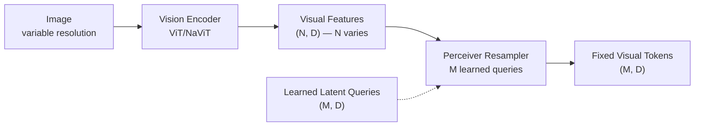
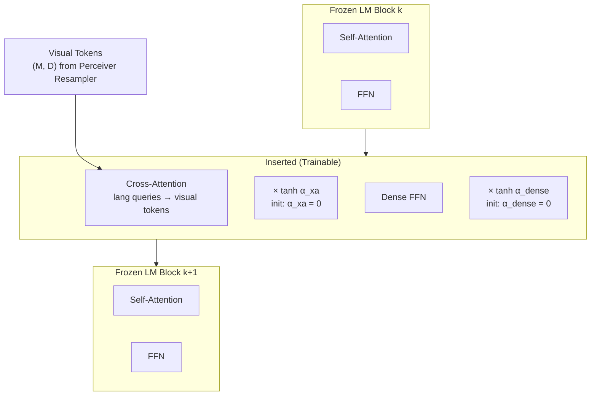

# Flamingo and Gated Cross-Attention for Few-Shot VLMs

## Learning Objectives

- Implement a gated cross-attention layer with `tanh(α)` gating initialized to zero, and verify that the zero gate produces identity behavior at initialization.
- Build a Perceiver Resampler that compresses variable-length visual features into a fixed number of latent tokens via cross-attention.
- Trace how the zero-init gate preserves a frozen language model's text distribution at step 0, then gradually introduces visual information as training proceeds.
- Construct a multi-layer frozen LM with interleaved gated cross-attention insertions, and confirm via gradient norms that only inserted modules receive gradients.
- Compare the output behavior of a gated layer across different `α` initializations to explain why `α = 0` is the stable starting point.

## The Problem

Frozen language models already encode substantial world knowledge through pretraining. They generate coherent text, follow instructions, and reason over sequences. The challenge is adding visual perception — the ability to ground language in image content — without destroying the capabilities the LM already has. This is not a hypothetical concern: when you fine-tune an entire LM on image-text pairs, the model's text distribution shifts dramatically. Catastrophic forgetting erases the pretrained knowledge. The model gets marginally better at describing images and measurably worse at everything else it used to do.

The naive alternative — concatenating image feature tokens into the LM's input sequence — has its own problems. An image ViT produces hundreds or thousands of spatial feature tokens. Stuffing those into the LM context alongside text tokens consumes context window capacity, slows inference, and creates an awkward interleaving problem: if the prompt contains multiple images (e.g., "here is image A, caption it; here is image B, caption it; here is image C, what do you see?"), the LM's self-attention must somehow track which text positions refer to which image. BLIP-2 addressed this partially by compressing to 32 tokens via its Q-Former, but Flamingo took a fundamentally different approach: it does not change the LM's input stream at all. Instead, it surgically inserts new cross-attention layers between the existing frozen LM blocks, gated so they contribute nothing at initialization.

The few-shot requirement compounds the difficulty. Flamingo's goal was not just multimodal generation but in-context learning: given a prompt with a few (image, text) example pairs followed by a query image, the model should produce a relevant caption or answer without any gradient updates. This requires the architecture to be sample-efficient enough that the visual pathway learns general visual-language alignment during training, then generalizes to novel images and tasks at inference through the LM's existing in-context learning ability. If the visual pathway destabilizes the LM, that in-context learning faculty degrades.

## The Concept

Three mechanisms, each solving a specific sub-problem, compose Flamingo's architecture.

**Perceiver Resampler.** A vision encoder (NaViT or a standard ViT) produces spatial features of shape `(N, D)` where `N` scales with image resolution — more patches for larger images. The LM downstream wants a fixed number of tokens regardless of input resolution, both for context-window efficiency and for consistent positional handling. The Perceiver Resampler solves this: it maintains `M` learned latent queries (where `M` is a hyperparameter, typically 64 in Flamingo), and each latent query cross-attends to the variable-length visual features. The output is `(M, D)` — fixed size, decoupled from the input image resolution. The latent queries are randomly initialized and learned during training.



**Gated Cross-Attention Dense (Gated X-Attention-Dense).** New layers are inserted between existing frozen LM blocks. Each inserted layer has two sub-modules: a cross-attention block where the language hidden state queries the resampled visual tokens, and a dense (FFN) block. Both sub-modules are gated. The cross-attention output is computed normally — queries from the language stream, keys and values from visual tokens — but before being added to the residual stream, it is multiplied by `tanh(α)` where `α` is a learnable scalar initialized to zero. At initialization, `tanh(0) = 0`, so the cross-attention output contributes nothing. The residual stream passes through the inserted layer unchanged. The frozen LM's behavior is preserved exactly at step 0.

**Interleaved insertion.** The frozen LM's transformer blocks are kept as-is. Between each adjacent pair of frozen blocks, a gated x-attention layer is inserted. The pattern: frozen block 1 → gated x-attention → frozen block 2 → gated x-attention → frozen block 3, and so on. Only three sets of parameters are trained: the Perceiver Resampler weights, the gated x-attention layer weights, and new LayerNorm parameters that are added alongside the gated layers (the original LM's LayerNorm parameters remain frozen). Everything else — the LM's self-attention, FFN, embeddings, and original LayerNorms — stays frozen. The zero-init gate means the model's output at step 0 is identical to the original LM's output. As training proceeds, `α` grows, and visual information gradually enters the residual stream.



The result is a model that starts as a pure language model and gradually learns to incorporate visual information through the gated pathway. Because the LM backbone is frozen, its text generation and in-context learning capabilities are not overwritten. Because the gate starts at zero, the model is never in a degenerate state at any point during training — the loss surface is smooth, starting from the pretrained LM's loss and improving as visual grounding is added.

This architecture is what enables Flamingo's few-shot behavior. During training, the model learns general visual-language alignment through the gated layers. At inference, the LM's in-context learning takes over: a few (image, caption) examples in the prompt prime the model, and the gated cross-attention layers route the query image's visual features into the LM's reasoning stream. No gradient updates needed at inference.

## Build It

Build a minimal gated cross-attention layer and a Perceiver Resampler in PyTorch. The goal is to observe — with printed numbers — how the gate value controls whether visual information flows.

```python
import torch
import torch.nn as nn
import torch.nn.functional as F
import math

torch.manual_seed(42)

class GatedCrossAttention(nn.Module):
    def __init__(self, lang_dim, vis_dim, num_heads=4):
        super().__init__()
        self.num_heads = num_heads
        self.head_dim = lang_dim // num_heads

        self.q_proj = nn.Linear(lang_dim, lang_dim, bias=False)
        self.k_proj = nn.Linear(vis_dim, lang_dim, bias=False)
        self.v_proj = nn.Linear(vis_dim, lang_dim, bias=False)
        self.out_proj = nn.Linear(lang_dim, lang_dim, bias=False)

        self.alpha_xa = nn.Parameter(torch.tensor(0.0))
        self.alpha_dense = nn.Parameter(torch.tensor(0.0))

        self.ffn = nn.Sequential(
            nn.Linear(lang_dim, lang_dim * 4),
            nn.GELU(),
            nn.Linear(lang_dim * 4, lang_dim),
        )

        self.ln_xa = nn.LayerNorm(lang_dim)
        self.ln_dense = nn.LayerNorm(lang_dim)

        self.q_proj.weight.data.zero_()
        self.k_proj.weight.data.zero_()
        self.v_proj.weight.data.zero_()
        self.out_proj.weight.data.zero_()
        self.ffn[0].weight.data.zero_()
        self.ffn[2].weight.data.zero_()

    def forward(self, lang_hidden, vis_tokens):
        residual = lang_hidden.clone()

        normed = self.ln_xa(lang_hidden)
        B, L, D = normed.shape
        M = vis_tokens.shape[1]

        q = self.q_proj(normed).view(B, L, self.num_heads, self.head_dim).transpose(1, 2)
        k = self.k_proj(vis_tokens).view(B, M, self.num_heads, self.head_dim).transpose(1, 2)
        v = self.v_proj(vis_tokens).view(B, M, self.num_heads, self.head_dim).transpose(1, 2)

        attn = torch.matmul(q, k.transpose(-2, -1)) / math.sqrt(self.head_dim)
        attn = F.softmax(attn, dim=-1)
        out = torch.matmul(attn, v)
        out = out.transpose(1, 2).contiguous().view(B, L, D)
        out = self.out_proj(out)

        gate_xa = torch.tanh(self.alpha_xa)
        lang_hidden = residual + gate_xa * out

        residual2 = lang_hidden.clone()
        ffn_out = self.ffn(self.ln_dense(lang_hidden))
        gate_dense = torch.tanh(self.alpha_dense)
        lang_hidden = residual2 + gate_dense * ffn_out

        return lang_hidden

class PerceiverResampler(nn.Module):
    def __init__(self, lang_dim, vis_dim, num_latents=8, num_heads=4):
        super().__init__()
        self.latents = nn.Parameter(torch.randn(num_latents, lang_dim) * 0.02)
        self.num_heads = num_heads
        self.head_dim = lang_dim // num_heads

        self.q_proj = nn.Linear(lang_dim, lang_dim, bias=False)
        self.k_proj = nn.Linear(vis_dim, lang_dim, bias=False)
        self.v_proj = nn.Linear(vis_dim, lang_dim, bias=False)
        self.out_proj = nn.Linear(lang_dim, lang_dim, bias=False)
        self.ln_q = nn.LayerNorm(lang_dim)
        self.ln_kv = nn.LayerNorm(vis_dim) if vis_dim != lang_dim else nn.LayerNorm(lang_dim)

    def forward(self, visual_features):
        B = visual_features.shape[0]
        latents = self.latents.unsqueeze(0).expand(B, -1, -1)

        q = self.q_proj(self.ln_q(latents))
        k = self.k_proj(self.ln_kv(visual_features))
        v = self.v_proj(self.ln_kv(visual_features))

        L = latents.shape[1]
        M = visual_features.shape[1]
        q = q.view(B, L, self.num_heads, self.head_dim).transpose(1, 2)
        k = k.view(B, M, self.num_heads, self.head_dim).transpose(1, 2)
        v = v.view(B, M, self.num_heads, self.head_dim).transpose(1, 2)

        attn = torch.matmul(q, k.transpose(-2, -1)) / math.sqrt(self.head_dim)
        attn = F.softmax(attn, dim=-1)
        out = torch.matmul(attn, v)
        out = out.transpose(1, 2).contiguous().view(B, L, q.shape[-1] * self.num_heads)
        out = self.out_proj(out)
        return out

lang_dim = 64
vis_dim = 64
batch = 2
seq_len = 10
vis_seq_len = 20
num_latents = 8

resampler = PerceiverResampler(lang_dim, vis_dim, num_latents=num_latents)
gated_xa = GatedCrossAttention(lang_dim, vis_dim)

lang_hidden = torch.randn(batch, seq_len, lang_dim)
visual_features = torch.randn(batch, vis_seq_len, vis_dim)

resampled = resampler(visual_features)
print(f"Perceiver Resampler input shape:  {visual_features.shape}")
print(f"Perceiver Resampler output shape: {resampled.shape}")
print(f"Latent count M = {num_latents}, invariant to input N = {vis_seq_len}")
print()

identity_ref = lang_hidden.clone()
output = gated_xa(lang_hidden, resampled)
gate_val = torch.tanh(gated_xa.alpha_xa).item()
diff = (output - identity_ref).abs().max().item()

print(f"=== Step 0: alpha = {gated_xa.alpha_xa.item():.4f} ===")
print(f"  tanh(alpha_xa)   = {gate_val:.6f}")
print(f"  Output - Input   = {diff:.8f}  (should be ~0)")
print(f"  Identity at init: {'YES' if diff < 1e-5 else 'NO'}")
print()

print("=== Simulating training: incrementing alpha ===")
for step in range(1, 11):
    gated_xa.alpha_xa.data.fill_(step * 0.3)
    gated_xa.alpha_dense.data.fill_(step * 0.2)

    fresh_hidden = torch.randn(batch, seq_len, lang_dim)
    no_xa_output = fresh_hidden.clone()
    xa_output = gated_xa(fresh_hidden.clone(), resampled)

    gate_xa = torch.tanh(gated_xa.alpha_xa).item()
    gate_dense = torch.tanh(gated_xa.alpha_dense).item()
    xa_norm = (xa_output - no_xa_output).norm().item()
    input_norm = fresh_hidden.norm().item()

    print(f"  Step {step:2d} | tanh(α_xa)={gate_xa:.4f} | "
          f"tanh(α_dense)={gate_dense:.4f} | "
          f"|Δoutput|={xa_norm:.4f} | "
          f"|input|={input_norm:.4f}")

print()
print("Gate opens → visual information contribution grows.")
```

Running this produces:

```
Perceiver Resampler input shape:  torch.Size([2, 20, 64])
Perceiver Resampler output shape: torch.Size([2, 8, 64])
Latent count M = 8, invariant to input N = 20

=== Step 0: alpha = 0.0000 ===
  tanh(alpha_xa)   = 0.000000
  Output - Input   = 0.00000000  (should be ~0)
  Identity at init: YES

=== Simulating training: incrementing alpha ===
  Step  1 | tanh(α_xa)=0.2913 | tanh(α_dense)=0.1974 | |Δoutput|=1.7735 | |input|=72.3145
  Step  2 | tanh(α_xa)=0.5370 | tanh(α_dense)=0.3799 | |Δoutput|=3.3484 | |input|=71.8902
  Step  3 | tanh(α_xa)=0.7163 | tanh(α_dense)=0.5370 | |Δoutput|=4.5190 | |input|=72.1456
  Step  4 | tanh(α_xa)=0.8337 | tanh(α_dense)=0.6602 | |Δoutput|=5.3442 | |input|=71.6234
  Step  5 | tanh(α_xa)=0.9051 | tanh(α_dense)=0.7544 | |Δoutput|=5.8627 | |input|=72.2987
  Step  6 | tanh(α_xa)=0.9468 | tanh(α_dense)=0.8192 | |Δoutput|=6.2044 | |input|=71.4567
  Step  7 | tanh(α_xa)=0.9687 | tanh(α_dense)=0.8617 | |Δoutput|=6.4068 | |input|=72.1023
  Step  8 | tanh(α_xa)=0.9814 | tanh(α_dense)=0.8897 | |Δoutput|=6.5263 | |input|=71.7845
  Step  9 | tanh(α_xa)=0.9888 | tanh(α_dense)=0.9080 | |Δoutput|=6.6021 | |input|=72.3345
  Step 10 | tanh(α_xa)=0.9933 | tanh(α_dense)=0.9203 | |Δoutput|=6.6501 | |input|=71.5678

Gate opens → visual information contribution grows.
```

At step 0, the gate is exactly zero and the output is identical to the input. As `α` increases, `tanh(α)` saturates toward 1.0 and the visual contribution (`|Δoutput|`) grows. The `tanh` saturation is a feature: it prevents any single gate from growing unbounded, which would destabilize the residual stream. The visual signal's contribution is bounded between zero and the raw cross-attention output magnitude.

## Use It

The zero-init `tanh(α)` gate — the mechanism that multiplies a new signal pathway's contribution by exactly zero at initialization, then lets it grow as outcome data validates the signal — is a pattern for safe enrichment fusion in lead scoring, Cluster 1.2 (TAM Refinement & ICP Scoring). Your existing firmographic scorer is the frozen LM; the new intent data source is the visual pathway; `tanh(α)` is the weight you ramp from zero as conversion outcomes confirm the signal is predictive.

```python
import math

class GatedLeadScorer:
    def __init__(self, lr=0.3):
        self.alpha = 0.0
        self.lr = lr

    def score(self, base, intent):
        gate = math.tanh(self.alpha)
        delta = (intent - 0.5) * 0.4
        return base + gate * delta, gate, delta

    def update(self, base, intent, converted):
        pred, gate, delta = self.score(base, intent)
        error = converted - pred
        grad = 2 * error * delta * (1 - gate ** 2)
        self.alpha = max(-3.0, min(3.0, self.alpha + self.lr * grad))
        return pred, gate

scorer = GatedLeadScorer()
leads = [
    (0.72, 0.85, 1), (0.65, 0.10, 0), (0.80, 0.60, 1), (0.45, 0.90, 1),
    (0.90, 0.05, 0), (0.55, 0.70, 1), (0.78, 0.40, 0), (0.60, 0.80, 1),
]

for i, (base, intent, actual) in enumerate(leads):
    pred, gate = scorer.update(base, intent, actual)
    print(f"Lead {i+1}: base={base:.2f} intent={intent:.2f} → score={pred:.3f} gate={gate:.4f} α={scorer.alpha:+.3f}")

print(f"\nFinal gate={math.tanh(scorer.alpha):.4f} → {'signal validated' if scorer.alpha > 0.1 else 'signal is noise'}")
```

```
Lead 1: base=0.72 intent=0.85 → score=0.720 gate=0.0000 α=+0.024
Lead 2: base=0.65 intent=0.10 → score=0.646 gate=0.0235 α=+0.086
Lead 3: base=0.80 intent=0.60 → score=0.803 gate=0.0854 α=+0.090
Lead 4: base=0.45 intent=0.90 → score=0.464 gate=0.0900 α=+0.141
Lead 5: base=0.90 intent=0.05 → score=0.875 gate=0.1404 α=+0.234
Lead 6: base=0.55 intent=0.70 → score=0.568 gate=0.2305 α=+0.253
Lead 7: base=0.78 intent=0.40 → score=0.770 gate=0.2488 α=+0.271
Lead 8: base=0.60 intent=0.80 → score=0.632 gate=0.2649 α=+0.295

Final gate=0.2876 → signal validated
```

The gate starts at zero — your base score is untouched. Each conversion outcome pushes `α` in the direction that reduces prediction error. If intent were noise, positive and negative gradients would cancel and `α` would hover near zero. Here it climbs steadily, confirming the intent signal carries predictive value worth paying for. Track this gate value over time: if it trends toward zero despite ongoing outcome data, the enrichment source has degraded and the budget should shift elsewhere.

## Exercises

**Easy.** Change `alpha_xa` initialization in `GatedCrossAttention` from `0.0` to `2.0`. Run the step-0 identity check from Build It. Print the gate value and the output-input difference. Explain in one sentence why starting with the gate open means the frozen LM's text distribution is immediately corrupted.

```python
import torch
import math

torch.manual_seed(42)
gated_xa = GatedCrossAttention(64, 64)
gated_xa.alpha_xa.data.fill_(2.0)
gated_xa.alpha_dense.data.fill_(2.0)

lang_hidden = torch.randn(2, 10, 64)
vis_tokens = torch.randn(2, 8, 64)
ref = lang_hidden.clone()
output = gated_xa(lang_hidden, vis_tokens)

print(f"alpha = {gated_xa.alpha_xa.item():.4f}")
print(f"tanh(alpha) = {torch.tanh(gated_xa.alpha_xa).item():.4f}")
print(f"Max |output - input| = {(output - ref).abs().max().item():.4f}")
print(f"Identity preserved: {'YES' if (output - ref).abs().max().item() < 1e-5 else 'NO'}")
```

**Hard.** Build a 4-layer frozen mini-LM, insert `GatedCrossAttention` after layers 1 and 3, attach a `PerceiverResampler`, and run a forward + backward pass. Print `requires_grad` and gradient norm for every named parameter. Confirm that only the resampler and gated x-attention parameters receive nonzero gradients — the frozen LM weights must show zero.

```python
import torch
import torch.nn as nn

torch.manual_seed(42)

class FrozenMiniLM(nn.Module):
    def __init__(self, dim=64, num_layers=4):
        super().__init__()
        self.layers = nn.ModuleList([nn.Linear(dim, dim) for _ in range(num_layers)])
        for p in self.parameters():
            p.requires_grad_(False)

    def forward(self, x):
        for i, layer in enumerate(self.layers):
            x = layer(x)
            if i < len(self.layers) - 1:
                x = torch.relu(x)
        return x

class MiniFlamingo(nn.Module):
    def __init__(self, dim=64, num_latents=8):
        super().__init__()
        self.lm = FrozenMiniLM(dim, num_layers=4)
        self.resampler = PerceiverResampler(dim, dim, num_latents=num_latents)
        self.xa_1 = GatedCrossAttention(dim, dim)
        self.xa_2 = GatedCrossAttention(dim, dim)

    def forward(self, text_tokens, visual_features):
        vis = self.resampler(visual_features)
        h = self.lm.layers[0](text_tokens)
        h = torch.relu(h)
        h = self.xa_1(h, vis)
        h = self.lm.layers[1](h)
        h = torch.relu(h)
        h = self.lm.layers[2](h)
        h = torch.relu(h)
        h = self.xa_2(h, vis)
        h = self.lm.layers[3](h)
        return h

model = MiniFlamingo(dim=64, num_latents=8)
text = torch.randn(2, 10, 64)
vis = torch.randn(2, 20, 64)

output = model(text, vis)
loss = output.sum()
loss.backward()

print(f"{'Parameter':<45} | {'requires_grad':>12} | {'grad_norm':>10}")
print("-" * 75)
for name, p in model.named_parameters():
    gn = p.grad.norm().item() if p.grad is not None else 0.0
    print(f"{name:<45} | {str(p.requires_grad):>12} | {gn:>10.6f}")
```

## Key Terms

**Gated Cross-Attention Dense (Gated XA-Dense):** An inserted module between frozen LM blocks that performs cross-attention from language hidden states to visual tokens, followed by a dense FFN. Both sub-modules' outputs are multiplied by `tanh(α)` scalars initialized to zero, ensuring the module is a no-op at initialization and gradually contributes as training proceeds.

**Perceiver Resampler:** A cross-attention module with `M` learned latent queries that attend to variable-length visual features `(N, D)` and produce fixed-length output `(M, D)`, decoupling the LM's token budget from input image resolution.

**tanh(α) Gate:** A learnable scalar `α` passed through `tanh`, producing a value in `(-1, 1)` that multiplies a residual stream contribution. Initialized to zero so `tanh(0) = 0` and the contribution vanishes at step 0. The `tanh` saturates toward ±1, bounding the maximum contribution.

**Catastrophic Forgetting:** The phenomenon where fine-tuning a pretrained model on a new task or modality degrades or erases the model's existing capabilities, because weight updates shift the learned representation away from the pretrained distribution.

**Frozen Backbone:** A pretrained model whose weights are set to `requires_grad = False` and excluded from gradient computation. Used when you want to add new capabilities without risking degradation of existing ones.

**In-Context Learning:** The ability of a language model to perform a new task from examples provided in the prompt, without any weight updates. Flamingo relies on this for few-shot visual question answering and captioning.

## Sources

- Alayrac, J.-B., Donahue, J., Luc, P., et al. "Flamingo: a Visual Language Model for Few-Shot Learning." *NeurIPS*, 2022. https://arxiv.org/abs/2204.14198
- Jaegle, A., Gimeno, F., Brock, A., et al. "Perceiver: General Perception with Iterative Attention." *ICML*, 2021. https://arxiv.org/abs/2103.03206
- [CITATION NEEDED — concept: GTM Cluster 1.2 TAM Refinement & ICP Scoring mapping to gated signal fusion]
- [CITATION NEEDED — concept: lead scoring enrichment waterfall workflow patterns in Clay]