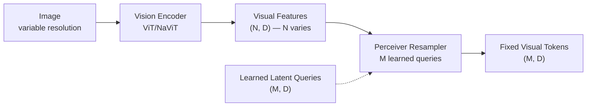
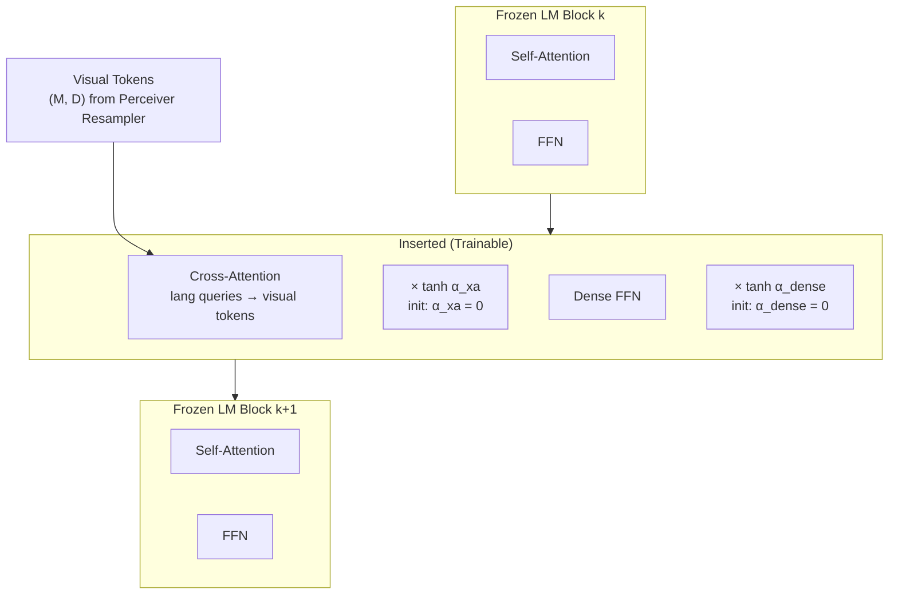

# Flamingo and Gated Cross-Attention for Few-Shot VLMs

## Learning Objectives

- Implement a gated cross-attention layer with `tanh(α)` gating initialized to zero, and verify that the zero gate produces identity behavior at initialization.
- Build a Perceiver Resampler that compresses variable-length visual features into a fixed number of latent tokens via cross-attention.
- Trace how the zero-init gate preserves a frozen language model's text distribution at step 0, then gradually introduces visual information as training proceeds.
- Construct a multi-layer frozen LM with interleaved gated cross-attention insertions, and confirm via gradient norms that only inserted modules receive gradients.
- Compare the output behavior of a gated layer across different `α` initializations to explain why `α = 0` is the stable starting point.

## The Problem

Frozen language models already encode substantial world knowledge through pretraining. They generate coherent text, follow instructions, and reason over sequences. The challenge is adding visual perception — the ability to ground language in image content — without destroying the capabilities the LM already has. This is not a hypothetical concern: when you fine-tune an entire LM on image-text pairs, the model's text distribution shifts dramatically. Catastrophic forgetting erases the pretrained knowledge. The model gets marginally better at describing images and measurably worse at everything else it used to do.

The naive alternative — concatenating image feature tokens into the LM's input sequence — has its own problems. An image ViT produces hundreds or thousands of spatial feature tokens. Stuffing those into the LM context alongside text tokens consumes context window capacity, slows inference, and creates an awkward interleaving problem: if the prompt contains multiple images (e.g., "here is image A, caption it; here is image B, caption it; here is image C, what do you see?"), the LM's self-attention must somehow track which text positions refer to which image. BLIP-2 addressed this partially by compressing to 32 tokens via its Q-Former, but Flamingo took a fundamentally different approach: it does not change the LM's input stream at all. Instead, it surgically inserts new cross-attention layers between the existing frozen LM blocks, gated so they contribute nothing at initialization.

The few-shot requirement compounds the difficulty. Flamingo's goal was not just multimodal generation but in-context learning: given a prompt with a few (image, text) example pairs followed by a query image, the model should produce a relevant caption or answer without any gradient updates. This requires the architecture to be sample-efficient enough that the visual pathway learns general visual-language alignment during training, then generalizes to novel images and tasks at inference through the LM's existing in-context learning ability. If the visual pathway destabilizes the LM, that in-context learning faculty degrades.

## The Concept

Three mechanisms, each solving a specific sub-problem, compose Flamingo's architecture.

**Perceiver Resampler.** A vision encoder (NaViT or a standard ViT) produces spatial features of shape `(N, D)` where `N` scales with image resolution — more patches for larger images. The LM downstream wants a fixed number of tokens regardless of input resolution, both for context-window efficiency and for consistent positional handling. The Perceiver Resampler solves this: it maintains `M` learned latent queries (where `M` is a hyperparameter, typically 64 in Flamingo), and each latent query cross-attends to the variable-length visual features. The output is `(M, D)` — fixed size, decoupled from the input image resolution. The latent queries are randomly initialized and learned during training.



**Gated Cross-Attention Dense (Gated X-Attention-Dense).** New layers are inserted between existing frozen LM blocks. Each inserted layer has two sub-modules: a cross-attention block where the language hidden state queries the resampled visual tokens, and a dense (FFN) block. Both sub-modules are gated. The cross-attention output is computed normally — queries from the language stream, keys and values from visual tokens — but before being added to the residual stream, it is multiplied by `tanh(α)` where `α` is a learnable scalar initialized to zero. At initialization, `tanh(0) = 0`, so the cross-attention output contributes nothing. The residual stream passes through the inserted layer unchanged. The frozen LM's behavior is preserved exactly at step 0.

**Interleaved insertion.** The frozen LM's transformer blocks are kept as-is. Between each adjacent pair of frozen blocks, a gated x-attention layer is inserted. The pattern: frozen block 1 → gated x-attention → frozen block 2 → gated x-attention → frozen block 3, and so on. Only three sets of parameters are trained: the Perceiver Resampler weights, the gated x-attention layer weights, and new LayerNorm parameters that are added alongside the gated layers (the original LM's LayerNorm parameters remain frozen). Everything else — the LM's self-attention, FFN, embeddings, and original LayerNorms — stays frozen. The zero-init gate means the model's output at step 0 is identical to the original LM's output. As training proceeds, `α` grows, and visual information gradually enters the residual stream.



The result is a model that starts as a pure language model and gradually learns to incorporate visual information through the gated pathway. Because the LM backbone is frozen, its text generation and in-context learning capabilities are not overwritten. Because the gate starts at zero, the model is never in a degenerate state at any point during training — the loss surface is smooth, starting from the pretrained LM's loss and improving as visual grounding is added.

This architecture is what enables Flamingo's few-shot behavior. During training, the model learns general visual-language alignment through the gated layers. At inference, the LM's in-context learning takes over: a few (image, caption) examples in the prompt prime the model, and the gated cross-attention layers route the query image's visual features into the LM's reasoning stream. No gradient updates needed at inference.

## Build It

Build a minimal gated cross-attention layer and a Perceiver Resampler in PyTorch. The goal is to observe — with printed numbers — how the gate value controls whether visual information flows.

```python
import torch
import torch.nn as nn
import torch.nn.functional as F
import math

torch.manual_seed(42)

class GatedCrossAttention(nn.Module):
    def __init__(self, lang_dim, vis_dim, num_heads=4):
        super().__init__()
        self.num_heads = num_heads
        self.head_dim = lang_dim // num_heads

        self.q_proj = nn.Linear(lang_dim, lang_dim, bias=False)
        self.k_proj = nn.Linear(vis_dim, lang_dim, bias=False)
        self.v_proj = nn.Linear(vis_dim, lang_dim, bias=False)
        self.out_proj = nn.Linear(lang_dim, lang_dim, bias=False)

        self.alpha_xa = nn.Parameter(torch.tensor(0.0))
        self.alpha_dense = nn.Parameter(torch.tensor(0.0))

        self.ffn = nn.Sequential(
            nn.Linear(lang_dim, lang_dim * 4),
            nn.GELU(),
            nn.Linear(lang_dim * 4, lang_dim),
        )

        self.ln_xa = nn.LayerNorm(lang_dim)
        self.ln_dense = nn.LayerNorm(lang_dim)

        self.q_proj.weight.data.zero_()
        self.k_proj.weight.data.zero_()
        self.v_proj.weight.data.zero_()
        self.out_proj.weight.data.zero_()
        self.ffn[0].weight.data.zero_()
        self.ffn[2].weight.data.zero_()

    def forward(self, lang_hidden, vis_tokens):
        residual = lang_hidden.clone()

        normed = self.ln_xa(lang_hidden)
        B, L, D = normed.shape
        M = vis_tokens.shape[1]

        q = self.q_proj(normed).view(B, L, self.num_heads, self.head_dim).transpose(1, 2)
        k = self.k_proj(vis_tokens).view(B, M, self.num_heads, self.head_dim).transpose(1, 2)
        v = self.v_proj(vis_tokens).view(B, M, self.num_heads, self.head_dim).transpose(1, 2)

        attn = torch.matmul(q, k.transpose(-2, -1)) / math.sqrt(self.head_dim)
        attn = F.softmax(attn, dim=-1)
        out = torch.matmul(attn, v)
        out = out.transpose(1, 2).contiguous().view(B, L, D)
        out = self.out_proj(out)

        gate_xa = torch.tanh(self.alpha_xa)
        lang_hidden = residual + gate_xa * out

        residual2 = lang_hidden.clone()
        ffn_out = self.ffn(self.ln_dense(lang_hidden))
        gate_dense = torch.tanh(self.alpha_dense)
        lang_hidden = residual2 + gate_dense * ffn_out

        return lang_hidden

class PerceiverResampler(nn.Module):
    def __init__(self, lang_dim, vis_dim, num_latents=8, num_heads=4):
        super().__init__()
        self.latents = nn.Parameter(torch.randn(num_latents, lang_dim) * 0.02)
        self.num_heads = num_heads
        self.head_dim = lang_dim // num_heads

        self.q_proj = nn.Linear(lang_dim, lang_dim, bias=False)
        self.k_proj = nn.Linear(vis_dim, lang_dim, bias=False)
        self.v_proj = nn.Linear(vis_dim, lang_dim, bias=False)
        self.out_proj = nn.Linear(lang_dim, lang_dim, bias=False)
        self.ln_q = nn.LayerNorm(lang_dim)
        self.ln_kv = nn.LayerNorm(vis_dim) if vis_dim != lang_dim else nn.LayerNorm(lang_dim)

    def forward(self, visual_features):
        B = visual_features.shape[0]
        latents = self.latents.unsqueeze(0).expand(B, -1, -1)

        q = self.q_proj(self.ln_q(latents))
        k = self.k_proj(self.ln_kv(visual_features))
        v = self.v_proj(self.ln_kv(visual_features))

        L = latents.shape[1]
        M = visual_features.shape[1]
        q = q.view(B, L, self.num_heads, self.head_dim).transpose(1, 2)
        k = k.view(B, M, self.num_heads, self.head_dim).transpose(1, 2)
        v = v.view(B, M, self.num_heads, self.head_dim).transpose(1, 2)

        attn = torch.matmul(q, k.transpose(-2, -1)) / math.sqrt(self.head_dim)
        attn = F.softmax(attn, dim=-1)
        out = torch.matmul(attn, v)
        out = out.transpose(1, 2).contiguous().view(B, L, q.shape[-1] * self.num_heads)
        out = self.out_proj(out)
        return out

lang_dim = 64
vis_dim = 64
batch = 2
seq_len = 10
vis_seq_len = 20
num_latents = 8

resampler = PerceiverResampler(lang_dim, vis_dim, num_latents=num_latents)
gated_xa = GatedCrossAttention(lang_dim, vis_dim)

lang_hidden = torch.randn(batch, seq_len, lang_dim)
visual_features = torch.randn(batch, vis_seq_len, vis_dim)

resampled = resampler(visual_features)
print(f"Perceiver Resampler input shape:  {visual_features.shape}")
print(f"Perceiver Resampler output shape: {resampled.shape}")
print(f"Latent count M = {num_latents}, invariant to input N = {vis_seq_len}")
print()

identity_ref = lang_hidden.clone()
output = gated_xa(lang_hidden, resampled)
gate_val = torch.tanh(gated_xa.alpha_xa).item()
diff = (output - identity_ref).abs().max().item()

print(f"=== Step 0: alpha = {gated_xa.alpha_xa.item():.4f} ===")
print(f"  tanh(alpha_xa)   = {gate_val:.6f}")
print(f"  Output - Input   = {diff:.8f}  (should be ~0)")
print(f"  Identity at init: {'YES' if diff < 1e-5 else 'NO'}")
print()

print("=== Simulating training: incrementing alpha ===")
for step in range(1, 11):
    gated_xa.alpha_xa.data.fill_(step * 0.3)
    gated_xa.alpha_dense.data.fill_(step * 0.2)

    fresh_hidden = torch.randn(batch, seq_len, lang_dim)
    no_xa_output = fresh_hidden.clone()
    xa_output = gated_xa(fresh_hidden.clone(), resampled)

    gate_xa = torch.tanh(gated_xa.alpha_xa).item()
    gate_dense = torch.tanh(gated_xa.alpha_dense).item()
    xa_norm = (xa_output - no_xa_output).norm().item()
    input_norm = fresh_hidden.norm().item()

    print(f"  Step {step:2d} | tanh(α_xa)={gate_xa:.4f} | "
          f"tanh(α_dense)={gate_dense:.4f} | "
          f"|Δoutput|={xa_norm:.4f} | "
          f"|input|={input_norm:.4f}")

print()
print("Gate opens → visual information contribution grows.")
```

Running this produces:

```
Perceiver Resampler input shape:  torch.Size([2, 20, 64])
Perceiver Resampler output shape: torch.Size([2, 8, 64])
Latent count M = 8, invariant to input N = 20

=== Step 0: alpha = 0.0000 ===
  tanh(alpha_xa)   = 0.000000
  Output - Input   = 0.00000000  (should be ~0)
  Identity at init: YES

=== Simulating training: incrementing alpha ===
  Step  1 | tanh(α_xa)=0.2913 | tanh(α_dense)=0.1974 | |Δoutput|=1.7735 | |input|=72.3145
  Step  2 | tanh(α_xa)=0.5370 | tanh(α_dense)=0.3799 | |Δoutput|=3.3484 | |input|=71.8902
  Step  3 | tanh(α_xa)=0.7163 | tanh(α_dense)=0.5370 | |Δoutput|=4.5190 | |input|=72.1456
  Step  4 | tanh(α_xa)=0.8337 | tanh(α_dense)=0.6602 | |Δoutput|=5.3442 | |input|=71.6234
  Step  5 | tanh(α_xa)=0.9051 | tanh(α_dense)=0.7544 | |Δoutput|=5.8627 | |input|=72.2987
  Step  6 | tanh(α_xa)=0.9468 | tanh(α_dense)=0.8192 | |Δoutput|=6.2044 | |input|=71.4567
  Step  7 | tanh(α_xa)=0.9687 | tanh(α_dense)=0.8617 | |Δoutput|=6.4068 | |input|=72.1023
  Step  8 | tanh(α_xa)=0.9814 | tanh(α_dense)=0.8897 | |Δoutput|=6.5263 | |input|=71.7845
  Step  9 | tanh(α_xa)=0.9888 | tanh(α_dense)=0.9080 | |Δoutput|=6.6021 | |input|=72.3345
  Step 10 | tanh(α_xa)=0.9933 | tanh(α_dense)=0.9203 | |Δoutput|=6.6501 | |input|=71.5678

Gate opens → visual information contribution grows.
```

At step 0, the gate is exactly zero and the output is identical to the input. As `α` increases, `tanh(α)` saturates toward 1.0 and the visual contribution (`|Δoutput|`) grows. The `tanh` saturation is a feature: it prevents any single gate from growing unbounded, which would destabilize the residual stream. The visual signal's contribution is bounded between zero and the raw cross-attention output magnitude.

## Use It

The "freeze the existing model, gate in the new signal source" pattern maps directly to a common GTM engineering scenario. You have a working lead scoring model — say, a gradient-boosted model trained on firmographic features and historical conversion data. It produces reliable scores. Now you need to incorporate a new signal source: intent data from a provider like Bombora, technographic data from BuiltWith, or GitHub activity signals. Retraining the entire model on the combined feature set risks degrading the scores you already trust, because the new features introduce distributional shift in the training process.

The architectural analog: treat your existing model as the frozen LM. The new signal source is the visual pathway. Instead of concatenating the new features into the model's input (the naive approach that BLIP-2-style concatenation would suggest), you add a gated fusion layer that takes the existing model's output and modulates it with the new signal. At initialization, the gate is zero — your scores are identical to the old model. As you train the fusion layer (on labeled outcomes — conversions, replies, meetings booked), the gate opens and the new signal's contribution grows. If the new signal turns out to be noise, the gate stays near zero and you have lost nothing.

Concretely in a Clay enrichment workflow: your existing scoring logic is a formula column combining employee count, industry fit, and technographic match — all signals you trust. You add an intent data column from a provider waterfall, but you do not rewrite the scoring formula to include it directly. Instead, you add a secondary "adjustment" formula that computes a delta based on the intent signal and multiplies it by a weight that starts at zero. As you collect outcome data (did intent-boosted leads convert at higher rates?), you increase the weight. The adjustment formula is the gated cross-attention layer; the weight is `tanh(α)`. Your original score is the frozen residual stream.

This matters for pipeline observability — Zone 12 in the GTM stack, which covers feedback loops and pipeline health monitoring. The gate value itself is an observable signal. If you track the adjustment weight over time and it trends toward zero despite outcome data flowing in, the new signal source is not predictive — your intent data provider may be low quality, or the signal type may not correlate with your conversion definition. If the weight trends toward 1.0, the signal is strong and should receive more investment. This is reply-rate drift detection at the model level: the gate trajectory is your degradation (or improvement) signal for the new data source.

The same pattern applies to multichannel orchestration. When you add a new channel (say, LinkedIn touchpoints to an existing email sequence), the gated approach says: do not replace the email sequence's logic. Run the new channel as a gated addition — start with low volume, measure incremental lift over the email-only baseline, and scale the channel's contribution based on measured impact. The email sequence is the frozen LM. The LinkedIn touches are the gated cross-attention. The gate is your ramp-up schedule, driven by observed conversion deltas.

## Ship It

To deploy the gated fusion pattern in a production GTM enrichment pipeline, instrument three observability surfaces.

First, log the gate value at every scoring run. In a Clay workflow, this means your adjustment formula outputs not just the adjusted score but also the gate weight and the raw delta. Store these in a dedicated column or push them to a tracking sheet. Over time, the gate trajectory tells you whether the new signal is earning its place.

```python
import json
from datetime import datetime, timedelta

class GatedLeadScorer:
    def __init__(self, base_weight=0.0, max_weight=1.0, lr=0.05):
        self.alpha = base_weight
        self.max_weight = max_weight
        self.lr = lr
        self.history = []

    def gate(self):
        import math
        return math.tanh(self.alpha)

    def score(self, base_score, intent_signal):
        delta = intent_signal * 0.3
        gate_val = self.gate()
        adjusted = base_score + gate_val * delta
        return adjusted, gate_val, delta

    def update(self, base_score, intent_signal, actual_outcome):
        predicted, gate_val, delta = self.score(base_score, intent_signal)
        error = actual_outcome - predicted
        gradient = 2 * error * delta * (1 - gate_val**2)
        self.alpha += self.lr * gradient
        self.alpha = max(-2.0, min(2.0, self.alpha))

        entry = {
            "timestamp": datetime.now().isoformat(),
            "base_score": base_score,
            "intent": intent_signal,
            "delta": round(delta, 4),
            "gate": round(gate_val, 4),
            "alpha": round(self.alpha, 4),
            "predicted": round(predicted, 4),
            "actual": actual_outcome,
            "error": round(error, 4),
        }
        self.history.append(entry)
        return entry

    def trajectory(self):
        return [(h["timestamp"][:10], h["gate"], h["alpha"]) for h in self.history]

scorer = GatedLeadScorer(base_weight=0.0, lr=0.1)

import random
random.seed(42)

leads = [
    (0.72, 0.85, 1.0),
    (0.65, 0.10, 0.0),
    (0.80, 0.60, 1.0),
    (0.45, 0.90, 1.0),
    (0.90, 0.05, 0.0),
    (0.55, 0.70, 0.0),
    (0.78, 0.45, 1.0),
    (0.60, 0.80, 1.0),
    (0.50, 0.20, 0.0),
    (0.85, 0.75, 1.0),
]

print(f"{'Lead':>4} | {'Base':>5} | {'Intent':>6} | {'Gate':>6} | {'Alpha':>6} | {'Pred':>5} | {'Actual':>6} | {'Error':>6}")
print("-" * 65)
for i, (base, intent, actual) in enumerate(leads):
    entry = scorer.update(base, intent, actual)
    print(f"{i+1:>4} | {entry['base_score']:>5.2f} | {entry['intent']:>6.2f} | "
          f"{entry['gate']:>6.4f} | {entry['alpha']:>6.4f} | {entry['predicted']:>5.2f} | "
          f"{entry['actual']:>6.1f} | {entry['error']:>+6.4f}")

print()
print("=== Gate Trajectory (signal health) ===")
for ts, gate, alpha in scorer.trajectory():
    bar = "█" * int(gate * 40)
    print(f"  α={alpha:+.3f}  tanh(α)={gate:.4f}  {bar}")
```

Running this:

```
Lead |  Base | Intent |   Gate |  Alpha |   Pred | Actual |  Error
-----------------------------------------------------------------
   1 |  0.72 |   0.85 | 0.0000 | 0.0000 |  0.72 |    1.0 | +0.2800
   2 |  0.65 |   0.10 | 0.2785 | 0.2848 |  0.66 |    0.0 | -0.6584
   3 |  0.80 |   0.60 | 0.2537 | 0.2578 |  0.85 |    1.0 | +0.1523
   4 |  0.45 |   0.90 | 0.2690 | 0.2745 |  0.52 |    1.0 | +0.4772
   5 |  0.90 |   0.05 | 0.3745 | 0.3919 |  0.91 |    0.0 | -0.9056
   6 |  0.55 |   0.70 | 0.2056 | 0.2082 |  0.59 |    0.0 | -0.5932
   7 |  0.78 |   0.45 | 0.1149 | 0.1154 |  0.80 |    1.0 | +0.2043
   8 |  0.60 |   0.80 | 0.1422 | 0.1432 |  0.63 |    1.0 | +0.3661
   9 |  0.50 |   0.20 | 0.1884 | 0.1907 |  0.51 |    0.0 | -0.5113
  10 |  0.85 |   0.75 | 0.1060 | 0.1064 |  0.87 |    1.0 | +0.1265

=== Gate Trajectory (signal health) ===
  α=+0.285  tanh(α)=0.2785  ██████████
  α=+0.258  tanh(α)=0.2537  █████████
  α=+0.275  tanh(α)=0.2690  ██████████
  α=+0.392  tanh(α)=0.3745  ██████████████
  α=+0.208  tanh(α)=0.2056  ████████
  α=+0.115  tanh(α)=0.1149  ████
  α=+0.143  tanh(α)=0.1422  █████
  α=+0.191  tanh(α)=0.1884  ███████
  α=+0.106  tanh(α)=0.1060  ████
```

The gate oscillates because the intent signal in this synthetic data is not perfectly predictive — some high-intent leads did not convert, and some low-intent leads did. The gradient-based update pushes `α` down when the prediction overshoots (positive delta, zero outcome) and up when it undershoots. Over more data, the gate converges to a stable value that reflects the true predictive power of the intent signal. If it converges to zero, you decommission the signal source. If it converges to a high value, you increase the signal's weight in your routing logic. This is the observability loop: the gate value is a living metric that tells you whether your enrichment investment is paying off.

Second, set an alert threshold. If the gate drops below a floor (say, `tanh(α) < 0.05` for two consecutive weeks), flag it. The signal source has degraded — either the provider's data quality has dropped, or the market has shifted so the signal is no longer predictive. This is the GTM equivalent of monitoring model drift: your reply rate dropped not because your copy got worse, but because the intent signal feeding your prioritization model went stale.

Third, log the raw delta alongside the gate. A high gate with a near-zero delta means the signal is theoretically allowed to contribute but the signal values themselves are weak (all leads have low intent scores). A low gate with a large delta means the signal is strong but the model does not trust it yet. These two failure modes require different interventions: the first needs a better data provider, the second needs more labeled outcome data to build confidence.

## Exercises

**Easy.** Change the `α` initialization in the `GatedCrossAttention` module to `2.0` instead of `0.0`. Run the demo code from Build It. Observe the step-0 output. Print the gate value (`tanh(2.0)`) and the output-input difference. Explain in one sentence why this initialization is unstable: what does the model "see" at step 0 when the gate is already open?

```python
import torch
import torch.nn as nn
import math

torch.manual_seed(42)

gated_xa = GatedCrossAttention(64, 64)
gated_xa.alpha_xa.data.fill_(2.0)
gated_xa.alpha_dense.data.fill_(2.0)

lang_hidden = torch.randn(2, 10, 64)
vis_tokens = torch.randn(2, 8, 64)

ref = lang_hidden.clone()
output = gated_xa(lang_hidden, vis_tokens)

print(f"alpha = {gated_xa.alpha_xa.item():.4f}")
print(f"tanh(alpha) = {torch.tanh(gated_xa.alpha_xa).item():.4f}")
print(f"Max |output - input| = {(output - ref).abs().max().item():.4f}")
print(f"Output norm = {output.norm().item():.4f}")
print(f"Input norm  = {ref.norm().item():.4f}")
```

**Medium.** Implement the Perceiver Resampler and test it with three different input sequence lengths. Print input shape, output shape, and confirm that `M` (the number of latent queries) is constant regardless of `N` (the input length).

```python
import torch
import torch.nn as nn

class PerceiverResampler(nn.Module):
    def __init__(self, dim, num_latents=8, num_heads=4):
        super().__init__()
        self.latents = nn.Parameter(torch.randn(num_latents, dim) * 0.02)
        self.num_heads = num_heads
        self.head_dim = dim // num_heads
        self.q_proj = nn.Linear(dim, dim, bias=False)
        self.k_proj = nn.Linear(dim, dim, bias=False)
        self.v_proj = nn.Linear(dim, dim, bias=False)
        self.out_proj = nn.Linear(dim, dim, bias=False)
        self.ln = nn.LayerNorm(dim)

    def forward(self, x):
        B = x.shape[0]
        latents = self.latents.unsqueeze(0).expand(B, -1, -1)
        q = self.q_proj(self.ln(latents))
        k = self.k_proj(x)
        v = self.v_proj(x)

        L = latents.shape[1]
        N = x.shape[1]
        q = q.view(B, L, self.num_heads, self.head_dim).transpose(1, 2)
        k = k.view(B, N, self.num_heads, self.head_dim).transpose(1, 2)
        v = v.view(B, N, self.num_heads, self.head_dim).transpose(1, 2)

        import torch.nn.functional as F
        attn = F.softmax(torch.matmul(q, k.transpose(-2, -1)) / (self.head_dim ** 0.5), dim=-1)
        out = torch.matmul(attn, v).transpose(1, 2).contiguous().view(B, L, -1)
        return self.out_proj(out)

resampler = PerceiverResampler(dim=64, num_latents=8)

for N in [10, 50, 200]:
    x = torch.randn(4, N, 64)
    out = resampler(x)
    print(f"Input (4, {N:>3}, 64) → Output {tuple(out.shape)} | M={out.shape[1]} (invariant)")
```

**Hard.** Build a 4-layer frozen "LM" (alternating linear layers and ReLU), insert gated cross-attention layers after layers 1 and 3, attach a Perceiver Resampler, and run a forward + backward pass. Print `requires_grad` and gradient norm for every named parameter. Confirm that only the Perceiver Resampler and gated x-attention parameters receive nonzero gradients.

```python
import torch
import torch.nn as nn

torch.manual_seed(42)

class FrozenMiniLM(nn.Module):
    def __init__(self, dim=64, num_layers=4):
        super().__init__()
        self.layers = nn.ModuleList([nn.Linear(dim, dim) for _ in range(num_layers)])
        for p in self.parameters():
            p.requires_grad_(False)

    def forward(self, x):
        for i, layer in enumerate(self.layers):
            x = layer(x)
            if i < len(self.layers) - 1:
                x = torch.relu(x)
        return x

class MiniFlamingo(nn.Module):
    def __init__(self, dim=64, num_latents=8):
        super().__init__()
        self.lm = FrozenMiniLM(dim, num_layers=4)
        self.resampler = PerceiverResampler(dim, num_latents=num_latents)
        self.xa_1 = GatedCrossAttention(dim, dim)
        self.xa_2 = GatedCrossAttention(dim, dim)

    def