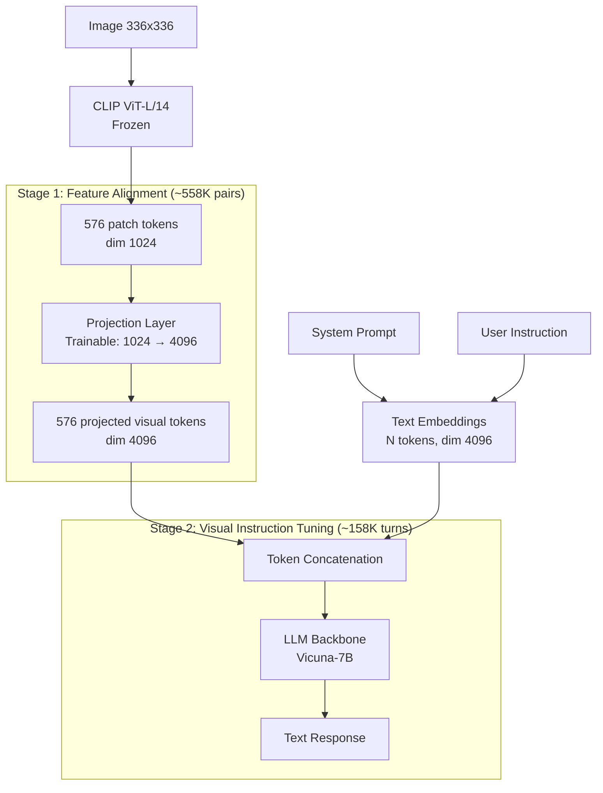

# LLaVA and Visual Instruction Tuning

## Learning Objectives

- Build a two-layer MLP projector that maps CLIP ViT patch embeddings (dim 1024) into an LLM's embedding space (dim 4096) using PyTorch.
- Trace the LLaVA two-stage training recipe: projector alignment on 558K caption pairs, then visual instruction tuning on 158K GPT-4-synthesized conversations.
- Construct a LLaVA-format multimodal prompt with image token placeholders and the Vicuna chat template.
- Compare linear projection versus MLP projection in terms of parameter count and representational capacity.
- Implement a quantized inference pipeline with VRAM monitoring for production serving.

## The Problem

BLIP-2's Q-Former compresses an image into 32 learned query tokens. That compression is elegant—it saves context window space—but it introduces two problems that became unacceptable as the field scaled in 2023.

First, the Q-Former is a bottleneck trained against proxy losses. Stage 1 trains image-text contrastive matching and image-grounded text generation. Stage 2 plugs those 32 tokens into a frozen LLM and trains language modeling loss. The queries optimize for an intermediate objective, not the final task. Whatever the image contained that did not fit into 32 tokens is gone before the LLM ever sees it. For GTM enrichment pipelines that need to read dense screenshots—pricing pages with tables, dashboards with charts—information loss at the bottleneck means missed account signals.

Second, the Q-Former adds 188M trainable parameters that are architecture-coupled. Change the LLM backbone from OPT to Llama and the learned queries are meaningless. Change the vision encoder from EVA-CLIP to SigLIP and you retrain from scratch. Every backbone combination is a separate research project. In a GTM engineering context, where you might swap between a 7B and 13B model depending on latency budgets, that coupling is operationally expensive.

The deeper problem was data. Instruction tuning worked spectacularly for text LLMs—Alpaca, Vicuna, and their successors proved that 50K–200K high-quality instruction-response pairs could align a base model. But visual instruction tuning required human labelers to look at images and write conversations about them. At 158K samples, that is a six-figure labeling contract with weeks of turnaround. The field needed visual instruction data at scale, and nobody had figured out how to synthesize it.

## The Concept

LLaVA's answer to both problems was deliberately simple: throw away the Q-Former, concatenate all vision tokens directly into the LLM's input sequence, and use GPT-4 to hallucinate the instruction data from captions alone.

The architecture has three components. A frozen CLIP ViT-L/14 encoder processes the image at 336×336 resolution, producing 576 patch tokens of dimension 1024. A trainable projection layer maps those 576 tokens from dim 1024 into the LLM's embedding space (dim 4096 for Vicuna-7B). The LLM backbone then receives a sequence that is the concatenation of projected image tokens and text token embeddings—no cross-attention layers, no gating mechanisms, no adapter modules in the transformer blocks. The image tokens are, as far as the LLM is concerned, just more tokens at the front of the sequence.



The projection layer is the only new architecture in LLaVA. The original LLaVA used a single linear layer (`nn.Linear(1024, 4096)`), which adds 4.2M parameters. LLaVA-1.5 upgraded to a two-layer MLP with GELU activation (`Linear(1024, 4096) → GELU → Linear(4096, 4096)`), adding 25M parameters. The MLP gives the projector enough capacity to learn nonlinear mappings between CLIP's contrastive embedding space and the LLM's causal language modeling space—a mapping that linear projection underfits.

Two-stage training controls what gets updated. In Stage 1 (feature alignment), the projection layer trains on 558K filtered image-caption pairs from CC3M while both the ViT and LLM stay frozen. The loss is autoregressive: given the image tokens and the caption prefix, predict the next caption token. The projector learns to translate CLIP features into something the LLM can read. In Stage 2 (visual instruction tuning), the projector and LLM both unfreeze and train on 158K GPT-4-generated multimodal conversations. The ViT stays frozen throughout. This stage teaches the model to follow instructions about images—describe, reason, compare—rather than just caption them.

The data generation pipeline is where LLaVA broke new ground. The authors took COCO images with existing human captions and bounding-box descriptions, formatted those text annotations into a structured prompt, and asked GPT-4 to generate three types of instruction-following data: conversations (multi-turn Q&A about the image), detailed descriptions (long-form captioning), and complex reasoning (questions requiring visual inference). GPT-4 never sees the actual images—it works from text descriptions only. The result is 158K visual instruction samples with zero human labeling. This is the insight that made multimodal instruction tuning economically viable: a sufficiently strong text LLM can bootstrap a weaker multimodal model's instruction dataset from captions alone.

## Build It

The projector is small enough to build and test in isolation. Here is the LLaVA-1.5 two-layer MLP with the exact dimensions used in the released checkpoint, along with a comparison to the original linear projection.

```python
import torch
import torch.nn as nn

vision_hidden_size = 1024
llm_hidden_size = 4096
num_patches = 576

class LLaVAProjector(nn.Module):
    def __init__(self, in_dim, out_dim):
        super().__init__()
        self.mlp = nn.Sequential(
            nn.Linear(in_dim, out_dim),
            nn.GELU(),
            nn.Linear(out_dim, out_dim),
        )
    def forward(self, x):
        return self.mlp(x)

class LLaVALinearProjector(nn.Module):
    def __init__(self, in_dim, out_dim):
        super().__init__()
        self.linear = nn.Linear(in_dim, out_dim)
    def forward(self, x):
        return self.linear(x)

mlp_proj = LLaVAProjector(vision_hidden_size, llm_hidden_size)
linear_proj = LLaVALinearProjector(vision_hidden_size, llm_hidden_size)

mlp_params = sum(p.numel() for p in mlp_proj.parameters())
linear_params = sum(p.numel() for p in linear_proj.parameters())

print(f"MLP projector params:      {mlp_params:>12,} ({mlp_params/1e6:.1f}M)")
print(f"Linear projector params:   {linear_params:>12,} ({linear_params/1e6:.1f}M)")
print(f"Ratio MLP/Linear:          {mlp_params/linear_params:.1f}x")

vision_features = torch.randn(1, num_patches, vision_hidden_size)
mlp_output = mlp_proj(vision_features)
linear_output = linear_proj(vision_features)

print(f"\nVision features shape:  {vision_features.shape}")
print(f"MLP output shape:       {mlp_output.shape}")
print(f"Linear output shape:    {linear_output.shape}")

text_embeddings = torch.randn(1, 12, llm_hidden_size)
combined = torch.cat([mlp_output, text_embeddings], dim=1)
print(f"\nCombined sequence:      {combined.shape}")
print(f"  Image tokens:         {num_patches}")
print(f"  Text tokens:          {text_embeddings.shape[1]}")
print(f"  Total context:        {combined.shape[1]}")
```

Run this and you get concrete parameter counts and tensor shapes. The MLP at 25.2M parameters versus the linear at 4.2M tells you the capacity tradeoff. The combined sequence length of 588 (576 image + 12 text) shows why context window matters—every image eats nearly 600 tokens before the prompt begins.

Now the prompt construction. LLaVA uses Vicuna's chat template with a special `<image>` token that gets replaced by the projected visual embeddings during the forward pass. Here is how to build that prompt string and verify the token placement.

```python
IMAGE_TOKEN_INDEX = -200
IMAGE_PLACEHOLDER = "<image>"

def build_llava_prompt(system_message, user_message):
    formatted = IMAGE_PLACEHOLDER + "\n" + user_message
    prompt = f"[INST] <<SYS>>\n{system_message}\n<</SYS>>\n\n{formatted} [/INST]"
    return prompt

system = "You are a helpful assistant that analyzes company screenshots for GTM research."
user = "List the products visible on this page and their price points."

prompt = build_llava_prompt(system, user)
print(prompt)
print("\n--- Token Analysis ---")
print(f"<image> token position: index {prompt.find(IMAGE_PLACEHOLDER)}")
print(f"Total prompt length:   {len(prompt)} chars")

instruction_part = prompt.split("[/INST]")[0] + "[/INST]"
response_part = ""
print(f"\nInstruction segment:   {len(instruction_part)} chars")
print(f"Response segment:      {len(response_part)} chars (empty — model generates this)")
```

This is the exact template format the LLaVA checkpoint expects. The `<image>` token is a placeholder; the model's processor replaces it with 576 projected visual tokens before the LLM's forward pass. In a GTM enrichment pipeline, the system prompt directs the model to extract specific account attributes—tech stack indicators, pricing tiers, company stage signals—from screenshot inputs that text scrapers cannot parse.

## Use It

Visual instruction tuning—the two-stage training procedure that teaches a multimodal model to follow natural language instructions about image content—lets you build enrichment agents that extract structured account intelligence from screenshots, pricing pages, and pitch deck PDFs that text scrapers cannot parse. This is the core mechanism for GTM enrichment workflows that need to process visual signals: company logos on partner pages, pricing tables behind demo walls, technology badges in stack diagrams, and slide content from investor decks. A single LLaVA inference call replaces a fragile pipeline of OCR → regex → field mapping with one model that reads layout, icons, and spatial relationships directly.

The code below loads LLaVA-1.5-7B in 4-bit quantization and runs a structured extraction against an image. It requires a CUDA GPU and downloads ~4 GB on first run. If you lack a GPU, read it for the API shape—the HuggingFace `image-to-text` pipeline handles ViT encoding, MLP projection, token concatenation, and LLM generation in one call.

```python
import torch
from transformers import pipeline, BitsAndBytesConfig

quantization_config = BitsAndBytesConfig(
    load_in_4bit=True,
    bnb_4bit_compute_dtype=torch.float16,
)

model_id = "llava-hf/llava-1.5-7b-hf"

pipe = pipeline(
    "image-to-text",
    model=model_id,
    model_kwargs={"quantization_config": quantization_config},
    device_map="auto",
)

prompt = (
    "USER: <image>\n"
    "Analyze this company homepage. Extract exactly:\n"
    "(1) Product category in 3-5 words\n"
    "(2) Pricing model if visible (freemium/subscription/enterprise/custom)\n"
    "(3) Technology partner logos visible (list names)\n"
    "Output as bullet points.\n"
    "ASSISTANT:"
)

image_url = "https://upload.wikimedia.org/wikipedia/commons/thumb/4/4a/Commons-logo.svg/320px-Commons-logo.svg.png"

result = pipe(image_url, prompt=prompt, generate_kwargs={"max_new_tokens": 200, "temperature": 0.3})
response = result[0]["generated_text"].split("ASSISTANT:")[-1].strip()
print(response)
```

For production enrichment, wrap this in a parsing layer that converts the bullet-point output to JSON fields mapped to your CRM schema. "Pricing model: freemium" becomes `{"pricing_tier": "self_serve"}`. "Technology partner: Stripe" becomes `{"payment_stack": ["stripe"]}`. The visual instruction tuning is what makes the model follow these extraction instructions against image content rather than ignoring the image and hallucinating from its text priors. At 500 target accounts per enrichment batch, throughput is the bottleneck: each screenshot costs one forward pass through 576 visual tokens plus generation. Cache the projected visual embeddings if you run multiple prompts against the same image.

## Exercises

**Easy — Projector parameter audit.** Modify the `LLaVAProjector` class to accept an arbitrary number of MLP layers via a `num_layers` parameter. Print the parameter count for each configuration (1, 2, 3, 4 layers) with dimensions 1024 → 4096. Identify which configuration matches LLaVA-1.5 (two layers, ~25.2M params) and which matches original LLaVA (one layer, ~4.2M params). Confirm that a three-layer projector roughly triples the parameter count of the linear baseline.

**Hard — Prompt engineering for structured extraction.** Build a LLaVA-format prompt that instructs the model to extract three fields from a competitor's pricing page screenshot: product name, monthly price in USD, and billing frequency (monthly/annual). Write the full prompt string using the Vicuna template with a system message. Verify the `<image>` placeholder position and count the total character length. Then write a Python function `parse_enrichment_output(model_response)` that takes the freeform model output and returns a dictionary `{"product": str, "price_usd": float, "billing": str}` using regex or keyword matching. Test it against two sample outputs: one clean (`"• Product: Acme CRM\n• Price: $49/month\n• Billing: Monthly"`) and one noisy (`"I can see a pricing page. The Pro plan costs $49 per month, billed monthly."`). Your parser should handle both.

## Key Terms

**Visual Instruction Tuning** — The Stage 2 training procedure that unfreezes both the projector and LLM and trains on instruction-response pairs about images (describe, reason, compare). Teaches the model to follow natural language directions about visual content rather than just captioning it.

**Projection Layer (Projector)** — The only new architecture in LLaVA. Maps CLIP ViT patch embeddings (dim 1024) into the LLM's embedding space (dim 4096). Original LLaVA used a single linear layer (~4.2M params); LLaVA-1.5 upgraded to a two-layer MLP with GELU (~25.2M params).

**Feature Alignment (Stage 1)** — Pretraining step where only the projector trains on ~558K image-caption pairs while both ViT and LLM remain frozen. The projector learns to translate CLIP's contrastive embedding space into representations the LLM can consume autoregressively.

**Patch Tokens** — The 576 output vectors from CLIP ViT-L/14 when processing a 336×336 image. Each represents a 14×14 pixel region. Unlike BLIP-2's Q-Former, LLaVA passes all 576 tokens directly to the LLM—no learned query compression.

**Image Token Placeholder (`<image>`)** — A special token in the Vicuna chat template that the model's processor replaces with 576 projected visual embeddings during the forward pass. Index -200 in the tokenizer configuration.

**Q-Former** — BLIP-2's bottleneck module that compresses image features into 32 learned query tokens. LLaVA's design deliberately removed it in favor of direct token concatenation, eliminating 188M trainable parameters and architecture coupling between vision encoder and LLM backbone choices.

## Sources

- Liu, H., Li, C., Wu, Q., & Lee, Y. J. (2023). *Visual Instruction Tuning.* arXiv:2304.08485. — Original LLaVA paper. Describes the linear projector architecture, two-stage training recipe, and the GPT-4-based instruction data synthesis pipeline from COCO captions.
- Liu, H., Li, C., Li, Y., & Lee, Y. J. (2023). *Improved Baselines with Visual Instruction Tuning.* arXiv:2310.03744. — LLaVA-1.5 paper. Introduces the two-layer MLP projector, reports 576 patch tokens from ViT-L/14 at 336×336, and documents the 558K alignment + 158K instruction tuning data scales.
- Radford, A., Kim, J. W., Hallacy, C., et al. (2021). *Learning Transferable Visual Models From Natural Language Supervision.* arXiv:2103.00020. — CLIP paper. Defines the ViT-L/14 vision encoder architecture whose patch embeddings serve as LLaVA's frozen visual input.
- Li, J., Li, D., Savarese, S., & Hoi, S. (2023). *BLIP-2: Bootstrapping Language-Image Pre-training with Frozen Image Encoders and Large Language Models.* arXiv:2301.12597. — Q-Former architecture that LLaVA's design explicitly replaces. Provides the 188M parameter count and two-stage proxy-loss training that motivated LLaVA's simplification.
- [CITATION NEEDED — concept: multimodal model usage in GTM account enrichment workflows, specifically screenshot-to-structured-data extraction pipelines for ICP scoring]