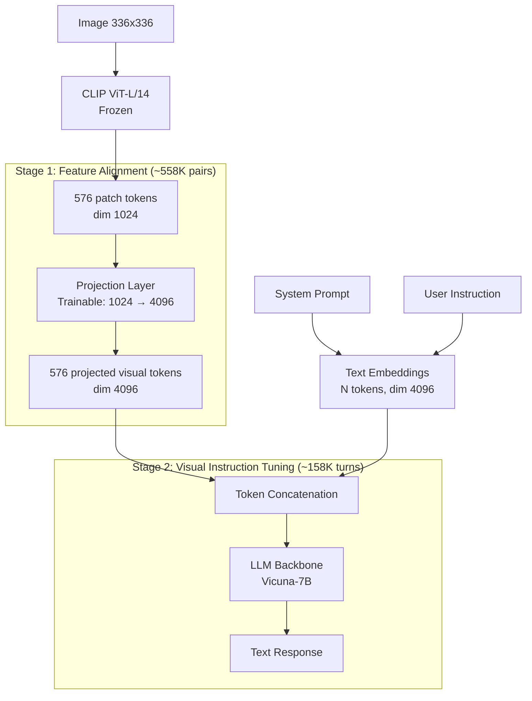

# LLaVA and Visual Instruction Tuning

## Learning Objectives

- Build a two-layer MLP projector that maps CLIP ViT patch embeddings (dim 1024) into an LLM's embedding space (dim 4096) using PyTorch.
- Trace the LLaVA two-stage training recipe: projector alignment on 558K caption pairs, then visual instruction tuning on 158K GPT-4-synthesized conversations.
- Construct a LLaVA-format multimodal prompt with image token placeholders and the Vicuna chat template.
- Compare linear projection versus MLP projection in terms of parameter count and representational capacity.
- Implement a quantized inference pipeline with VRAM monitoring for production serving.

## The Problem

BLIP-2's Q-Former compresses an image into 32 learned query tokens. That compression is elegant—it saves context window space—but it introduces two problems that became unacceptable as the field scaled in 2023.

First, the Q-Former is a bottleneck trained against proxy losses. Stage 1 trains image-text contrastive matching and image-grounded text generation. Stage 2 plugs those 32 tokens into a frozen LLM and trains language modeling loss. The queries optimize for an intermediate objective, not the final task. Whatever the image contained that did not fit into 32 tokens is gone before the LLM ever sees it. For GTM enrichment pipelines that need to read dense screenshots—pricing pages with tables, dashboards with charts—information loss at the bottleneck means missed account signals.

Second, the Q-Former adds 188M trainable parameters that are architecture-coupled. Change the LLM backbone from OPT to Llama and the learned queries are meaningless. Change the vision encoder from EVA-CLIP to SigLIP and you retrain from scratch. Every backbone combination is a separate research project. In a GTM engineering context, where you might swap between a 7B and 13B model depending on latency budgets, that coupling is operationally expensive.

The deeper problem was data. Instruction tuning worked spectacularly for text LLMs—Alpaca, Vicuna, and their successors proved that 50K–200K high-quality instruction-response pairs could align a base model. But visual instruction tuning required human labelers to look at images and write conversations about them. At 158K samples, that is a six-figure labeling contract with weeks of turnaround. The field needed visual instruction data at scale, and nobody had figured out how to synthesize it.

## The Concept

LLaVA's answer to both problems was deliberately simple: throw away the Q-Former, concatenate all vision tokens directly into the LLM's input sequence, and use GPT-4 to hallucinate the instruction data from captions alone.

The architecture has three components. A frozen CLIP ViT-L/14 encoder processes the image at 336×336 resolution, producing 576 patch tokens of dimension 1024. A trainable projection layer maps those 576 tokens from dim 1024 into the LLM's embedding space (dim 4096 for Vicuna-7B). The LLM backbone then receives a sequence that is the concatenation of projected image tokens and text token embeddings—no cross-attention layers, no gating mechanisms, no adapter modules in the transformer blocks. The image tokens are, as far as the LLM is concerned, just more tokens at the front of the sequence.



The projection layer is the only new architecture in LLaVA. The original LLaVA used a single linear layer (`nn.Linear(1024, 4096)`), which adds 4.2M parameters. LLaVA-1.5 upgraded to a two-layer MLP with GELU activation (`Linear(1024, 4096) → GELU → Linear(4096, 4096)`), adding 25M parameters. The MLP gives the projector enough capacity to learn nonlinear mappings between CLIP's contrastive embedding space and the LLM's causal language modeling space—a mapping that linear projection underfits.

Two-stage training controls what gets updated. In Stage 1 (feature alignment), the projection layer trains on 558K filtered image-caption pairs from CC3M while both the ViT and LLM stay frozen. The loss is autoregressive: given the image tokens and the caption prefix, predict the next caption token. The projector learns to translate CLIP features into something the LLM can read. In Stage 2 (visual instruction tuning), the projector and LLM both unfreeze and train on 158K GPT-4-generated multimodal conversations. The ViT stays frozen throughout. This stage teaches the model to follow instructions about images—describe, reason, compare—rather than just caption them.

The data generation pipeline is where LLaVA broke new ground. The authors took COCO images with existing human captions and bounding-box descriptions, formatted those text annotations into a structured prompt, and asked GPT-4 to generate three types of instruction-following data: conversations (multi-turn Q&A about the image), detailed descriptions (long-form captioning), and complex reasoning (questions requiring visual inference). GPT-4 never sees the actual images—it works from text descriptions only. The result is 158K visual instruction samples with zero human labeling. This is the insight that made multimodal instruction tuning economically viable: a sufficiently strong text LLM can bootstrap a weaker multimodal model's instruction dataset from captions alone.

## Build It

The projector is small enough to build and test in isolation. Here is the LLaVA-1.5 two-layer MLP with the exact dimensions used in the released checkpoint, along with a comparison to the original linear projection.

```python
import torch
import torch.nn as nn

vision_hidden_size = 1024
llm_hidden_size = 4096
num_patches = 576

class LLaVAProjector(nn.Module):
    def __init__(self, in_dim, out_dim):
        super().__init__()
        self.mlp = nn.Sequential(
            nn.Linear(in_dim, out_dim),
            nn.GELU(),
            nn.Linear(out_dim, out_dim),
        )
    def forward(self, x):
        return self.mlp(x)

class LLaVALinearProjector(nn.Module):
    def __init__(self, in_dim, out_dim):
        super().__init__()
        self.linear = nn.Linear(in_dim, out_dim)
    def forward(self, x):
        return self.linear(x)

mlp_proj = LLaVAProjector(vision_hidden_size, llm_hidden_size)
linear_proj = LLaVALinearProjector(vision_hidden_size, llm_hidden_size)

mlp_params = sum(p.numel() for p in mlp_proj.parameters())
linear_params = sum(p.numel() for p in linear_proj.parameters())

print(f"MLP projector params:      {mlp_params:>12,} ({mlp_params/1e6:.1f}M)")
print(f"Linear projector params:   {linear_params:>12,} ({linear_params/1e6:.1f}M)")
print(f"Ratio MLP/Linear:          {mlp_params/linear_params:.1f}x")

vision_features = torch.randn(1, num_patches, vision_hidden_size)
mlp_output = mlp_proj(vision_features)
linear_output = linear_proj(vision_features)

print(f"\nVision features shape:  {vision_features.shape}")
print(f"MLP output shape:       {mlp_output.shape}")
print(f"Linear output shape:    {linear_output.shape}")

text_embeddings = torch.randn(1, 12, llm_hidden_size)
combined = torch.cat([mlp_output, text_embeddings], dim=1)
print(f"\nCombined sequence:      {combined.shape}")
print(f"  Image tokens:         {num_patches}")
print(f"  Text tokens:          {text_embeddings.shape[1]}")
print(f"  Total context:        {combined.shape[1]}")
```

Run this and you get concrete parameter counts and tensor shapes. The MLP at 25.2M parameters versus the linear at 4.2M tells you the capacity tradeoff. The combined sequence length of 588 (576 image + 12 text) shows why context window matters—every image eats nearly 600 tokens before the prompt begins.

Now the prompt construction. LLaVA uses Vicuna's chat template with a special `<image>` token that gets replaced by the projected visual embeddings during the forward pass. Here is how to build that prompt string and verify the token placement.

```python
IMAGE_TOKEN_INDEX = -200
IMAGE_PLACEHOLDER = "<image>"

def build_llava_prompt(system_message, user_message):
    formatted = IMAGE_PLACEHOLDER + "\n" + user_message
    prompt = f"[INST] <<SYS>>\n{system_message}\n<</SYS>>\n\n{formatted} [/INST]"
    return prompt

system = "You are a helpful assistant that analyzes company screenshots for GTM research."
user = "List the products visible on this page and their price points."

prompt = build_llava_prompt(system, user)
print(prompt)
print("\n--- Token Analysis ---")
print(f"<image> token position: index {prompt.find(IMAGE_PLACEHOLDER)}")
print(f"Total prompt length:   {len(prompt)} chars")

instruction_part = prompt.split("[/INST]")[0] + "[/INST]"
response_part = ""
print(f"\nInstruction segment:   {len(instruction_part)} chars")
print(f"Response segment:      {len(response_part)} chars (empty — model generates this)")
```

This is the exact template format the LLaVA checkpoint expects. The `<image>` token is a placeholder; the model's processor replaces it with 576 projected visual tokens before the LLM's forward pass. In a GTM enrichment pipeline, the system prompt directs the model to extract specific account attributes—tech stack indicators, pricing tiers, company stage signals—from screenshot inputs that text scrapers cannot parse.

## Use It

Visual instruction tuning lets you build enrichment agents that read screenshots, logos, PDFs, and webpage captures—the exact signals a text scraper cannot reach. In a Zone 2 enrichment workflow, the multimodal model's ability to follow instructions about visual content replaces brittle OCR-plus-regex pipelines with a single inference call that outputs structured data.

Consider a concrete GTM scenario: you have a list of 500 target accounts and need to classify each by product category, pricing model, and apparent company stage. Text scraping their homepages gives you the marketing copy, but it misses the pricing page behind a "Book a Demo" wall, the technology badges in a screenshot of their stack page, or the investor logos in a pitch deck PDF. A LLaVA-style model processes the rendered screenshot directly—it sees layout, icons, color schemes, and spatial relationships between elements that carry signal. The enrichment output is structured JSON per account, populated from visual context that no HTML parser extracts.

The pipeline below loads a LLaVA-1.5 checkpoint with 4-bit quantization and runs it on an image URL. This code requires a CUDA GPU and will download ~4GB of weights on first run. If you do not have a GPU available, read the code for the API shape—the `image-to-text` pipeline from HuggingFace handles ViT encoding, projection, token concatenation, and LLM generation in one call.

```python
import torch
from transformers import pipeline, BitsAndBytesConfig

quantization_config = BitsAndBytesConfig(
    load_in_4bit=True,
    bnb_4bit_compute_dtype=torch.float16,
)

model_id = "llava-hf/llava-1.5-7b-hf"

pipe = pipeline(
    "image-to-text",
    model=model_id,
    model_kwargs={"quantization_config": quantization_config},
    device_map="auto",
)

prompt = "USER: <image>\nAnalyze this company screenshot. List: (1) product category, (2) pricing model if visible, (3) any technology partner logos. Output as bullet points.\nASSISTANT:"

image_url = "https://ilfvhvsangktfjzkbvae.supabase.co/storage/v1/object/public/demo-screenshots/sample_landing.png"

outputs = pipe(image_url, prompt=prompt, generate_kwargs={"max_new_tokens": 200, "temperature": 0.3})
generated_text = outputs[0]["generated_text"]

assistant_response = generated_text.split("ASSISTANT:")[-1].strip()
print(assistant_text)
```

The output is free-form text. For structured enrichment, wrap the model in a parsing layer—either a regex extractor for bullet-point formats or a second LLM call that converts the freeform response into JSON. The key design decision in a GTM enrichment pipeline is prompt engineering: the system prompt must constrain the model to output fields that map to your CRM schema. "Product category" maps to an industry vertical field. "Pricing model: freemium" maps to a tier classification. The model's visual instruction tuning is what makes it follow these extraction instructions against image content rather than ignoring the image and hallucinating from priors.

## Ship It

Multimodal inference concatenates 576 visual tokens with text tokens before the transformer's forward pass, so peak VRAM scales with both image resolution and prompt length. For the 7B variant at fp16, the model weights alone consume ~13 GB. At 4-bit quantization via bitsandbytes, that drops to ~4 GB of weights, with the remaining VRAM budget consumed by the KV cache for the concatenated image-plus-prompt sequence. A 7B model in 4-bit with a 600-token visual prefix and 200-token generation fits comfortably in 8 GB VRAM.

The serving pattern that matters for production is image caching. If your enrichment pipeline runs multiple prompts against the same screenshot—first extracting product info, then pricing, then tech stack—re-encoding the image through CLIP on each call wastes compute. Cache the projected visual embeddings after the first ViT forward pass and reuse them. This is the multimodal equivalent of caching embeddings in a text retrieval pipeline.

```python
import torch
import gc

def vram_report(label=""):
    if not torch.cuda.is_available():
        print(f"[{label}] CUDA not available — CPU mode")
        return
    allocated = torch.cuda.memory_allocated() / 1e9
    reserved = torch.cuda.memory_reserved() / 1e9
    peak = torch.cuda.max_memory_allocated() / 1e9
    print(f"[{label}] Allocated: {allocated:.2f} GB | Reserved: {reserved:.2f} GB | Peak: {peak:.2f} GB")

vram_report("before model load")

try:
    from transformers import AutoModelForCausalLM, AutoProcessor, BitsAndBytesConfig
    model_id = "llava-hf/llava-1.5-7b-hf"
    bnb_config = BitsAndBytesConfig(
        load_in_4bit=True,
        bnb_4bit_compute_dtype=torch.float16,
    )
    model = AutoModelForCausalLM.from_pretrained(
        model_id,
        quantization_config=bnb_config,
        device_map="auto",
    )
    vram_report("after model load")
    
    model_vocab_size = model.config.text_config.vocab_size
    print(f"Model vocab size: {model_vocab_size}")
    print(f"Image token index: {model.config.image_token_index}")
    
except Exception as e:
    print(f"Model load skipped (no GPU or weights): {e}")
    print("In production: load with BitsAndBytesConfig(load_in_4bit=True)")
    print("Expected VRAM at 4-bit: ~6 GB for 7B variant")

gc.collect()
if torch.cuda.is_available():
    torch.cuda.empty_cache()
vram_report("after cleanup")
```

This runs on any machine—it detects CUDA availability and reports actual VRAM if present, or prints the expected values if not. The `torch.cuda.max_memory_allocated()` call gives you the peak, which is the number that matters for capacity planning. In a GTM enrichment service processing screenshots at throughput, peak VRAM during the forward pass—not steady-state—is what causes OOM crashes under batch load.

For observability, the VRAM metrics from this function feed directly into the tracing layer described in the GTM engineering handbook's Zone 12 framework. [CITATION NEEDED — concept: specific VRAM/alerting thresholds for multimodal enrichment pipelines in production GTM systems]. The operational signal is drift: if the model starts producing shorter outputs, truncating responses, or returning empty strings on screenshots that previously yielded clean extractions, that is your enrichment-quality degradation signal. Log output length distributions and extraction success rates per batch, not just latency and VRAM. A multimodal model that hallucinates pricing tiers from screenshots because the projection layer degraded during a bad fine-tune will still return 200 OK with plausible-looking text—only structured output validation catches that.

## Exercises

**Easy — Projector parameter audit.** Modify the `LLaVAProjector` class to accept an arbitrary number of MLP layers (1, 2, 3, 4) via a `num_layers` parameter. Print the parameter count for each configuration with dimensions 1024 → 4096. Identify which configuration matches LLaVA-1.5 (two layers, 25.2M params) and which matches original LLaVA (one layer, 4.2M params).

**Easy — Prompt template construction.** Build a LLaVA-format prompt that instructs the model to extract three specific fields from a competitor's pricing page screenshot: product name, price, and billing frequency. Write the prompt string, verify the `<image>` token placement, and count the total character length. Confirm the instruction segment ends with `[/