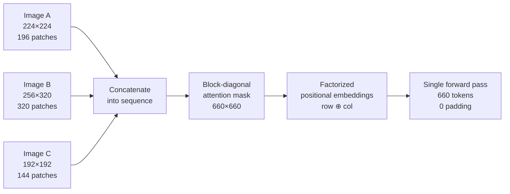

# Any-Resolution Vision: Patch-n'-Pack and NaFlex

## Learning Objectives

- Pack patches from variable-resolution images into a single token sequence with a block-diagonal attention mask.
- Implement factorized positional embeddings that generalize across arbitrary image dimensions in the same packed batch.
- Build a first-fit-decreasing bin-packing scheduler that assigns images to batches within a token budget.
- Compare AnyRes tiling, NaFlex packing, and M-RoPE along the axes of token efficiency, positional generalization, and implementation cost.
- Compute token budgets for OCR, chart, and logo enrichment pipelines without downscaling input images.

## The Problem

Transformers expect a sequence. A batch is a stack of equal-length sequences. If your images are 224×224, you get 196 patch tokens every time — padding is zero, job done. Train on 224, infer on 224, never think about resolution again.

The world does not cooperate. A receipt is 480×1920 (1:4 aspect ratio). A chart screenshot is 1080×1920 (9:16). A company logo scraped from a website might be 512×512 or it might be 200×3000. A mobile screenshot is 1170×2532. A scanned document ships at 2480×3508. When you resize all of these to 224×224, three things break. Text becomes unreadable because the horizontal strokes in an 8-pixel-tall character get compressed to sub-pixel width. Content gets cropped because square resize either letterboxes (wasting tokens on padding) or center-crops (throwing away the actual content). And tokens get wasted — a 128×128 thumbnail resized up to 224×224 generates 196 patches of interpolated noise where 64 patches of real signal would have sufficed.

You could process each image at its native resolution individually, one forward pass per image. This works but is computationally wasteful — GPU parallelism exists to process batches, not single images. A batch of one 480×1920 receipt followed by a batch of one 128×128 logo means your GPU sits mostly idle on the second forward pass. The naive solution — pad all images in a batch to the dimensions of the largest — is even worse. If one image in a batch of eight is 2048×2048 and the other seven are 256×256, you generate 16,384 patches per image times eight images = 131,072 tokens, of which 114,688 are padding. That is 87.5% wasted compute.

The actual problem is not "how do we handle variable resolution." It is "how do we pack variable-length sequences into a fixed compute budget without padding waste." This is a bin-packing problem dressed up as a vision problem.

## The Concept

Patch-n'-Pack, introduced in NaViT (Google, 2023) and adopted by SigLIP 2's NaFlex variant (2025), solves this by treating vision as a sequence packing problem. Instead of resizing images to a fixed grid, you extract patches at native resolution and concatenate patches from multiple images into a single transformer sequence. The attention mask prevents cross-image attention. This is the same pattern used in LLM training when multiple short documents are packed into one sequence to maximize GPU utilization — the vision community borrowed it.

Three mechanisms make this work. First, **patch extraction at native resolution**: each image is split into patches of fixed pixel size (typically 16×16), but the *number* of patches varies with image dimensions. A 224×224 image yields 14×14 = 196 patches. A 480×1920 receipt yields 30×120 = 3,600 patches. No resizing, no cropping, no distortion. The patch size is the only fixed constant. Second, **token packing**: patches from multiple images are concatenated into a single sequence, and a block-diagonal attention mask ensures each image's patches can only attend to patches from the same image. Image A's patch 47 cannot see Image B's patch 12. This is enforced by masking, not by sequence separation — the transformer processes one long sequence, but the mask creates isolated attention regions within it. Third, **factorized positional embeddings**: standard ViT learned positional embeddings assume a fixed grid (e.g., 14×14 positions). NaViT uses separate row and column embeddings — position (r, c) gets `row_emb[r] ⊕ col_emb[c]` — which generalizes to any grid dimensions the tables can index. A row index of 5 means the same thing whether the image has 14 rows or 120 rows.



NaFlex, SigLIP 2's implementation, extends this with flexible resolution scheduling — the encoder can dynamically choose how many patches to extract per image based on a compute budget, trading detail for throughput at inference time. [CITATION NEEDED — concept: NaFlex's specific dynamic resolution scheduling algorithm and whether it differs from NaViT's approach beyond the factorized embeddings]. What is well-documented: NaViT's packing and masking strategy, factorized positional embeddings, and the training efficiency gains from mixed-resolution batches. What is less documented: NaFlex's architectural modifications beyond NaViT, if any, and how the resolution scheduler decides patch counts at inference time.

The alternative approaches each solve the same problem differently. LLaVA-NeXT's AnyRes tiles high-resolution images into a base image plus sub-images (e.g., a 2×3 grid of 336×336 tiles), processes each tile separately, and concatenates the token outputs — simpler to implement but generates redundant tokens at tile boundaries. Qwen2-VL's M-RoPE replaces absolute positional tables entirely with rotary positional embeddings factorized along temporal, height, and width axes, eliminating the need for learned position tables altogether. Each approach trades implementation complexity for positional generalization.

## Build It

Start with the core operation: extract patches from three images at different resolutions, pack them into one sequence, and build the block-diagonal mask.

```python
import numpy as np

def extract_patches(image, patch_size=16):
    h, w = image.shape[:2]
    n_h = h // patch_size
    n_w = w // patch_size
    cropped = image[:n_h * patch_size, :n_w * patch_size]
    patches = []
    for i in range(n_h):
        for j in range(n_w):
            patch = cropped[i*patch_size:(i+1)*patch_size, j*patch_size:(j+1)*patch_size]
            patches.append(patch.flatten())
    return np.array(patches), n_h, n_w

img1 = np.random.randn(224, 224, 3)
img2 = np.random.randn(256, 320, 3)
img3 = np.random.randn(192, 192, 3)

packed = []
patch_counts = []
grid_sizes = []
for img in [img1, img2, img3]:
    p, n_h, n_w = extract_patches(img)
    packed.append(p)
    patch_counts.append(len(p))
    grid_sizes.append((n_h, n_w))

sequence = np.concatenate(packed, axis=0)
total_tokens = sequence.shape[0]
mask = np.zeros((total_tokens, total_tokens), dtype=int)

offset = 0
for count in patch_counts:
    mask[offset:offset+count, offset:offset+count] = 1
    offset += count

print(f"Image resolutions: 224x224, 256x320, 192x192")
print(f"Patch grids: {grid_sizes}")
print(f"Patch counts: {patch_counts}")
print(f"Packed sequence shape: {sequence.shape}")
print(f"Attention mask shape: {mask.shape}")
print(f"Mask is block-diagonal: {np.array_equal(mask, np.block([[np.ones((c, c), dtype=int) if i == j else np.zeros((patch_counts[i], patch_counts[j]), dtype=int) for j in range(len(patch_counts))] for i, c in enumerate(patch_counts)]))}")
print(f"Diagonal blocks visible (first 30x30 of mask):")
for row in mask[:30, :30]:
    print(''.join(str(v) for v in row[:30]))
```

Run this and you see the block-diagonal structure: ones in the top-left 196×196 block (image A), ones in the next 320×320 block (image B), ones in the final 144×144 block (image C), zeros everywhere else. The transformer processes 660 tokens in one forward pass with zero padding. Without packing, padding all three images to 256×320 would generate 320 × 3 = 960 tokens — 45% more compute for the same information.

Now add factorized positional embeddings. The key property: row embedding index 3 means "the 4th row of patches" regardless of whether the image has 14 rows or 20 rows. This is what lets a single set of learned tables serve every resolution.

```python
import numpy as np

patch_size = 16
embed_dim = 8
half_dim = embed_dim // 2
max_rows = 256
max_cols = 256

row_table = np.random.randn(max_rows, half_dim) * 0.02
col_table = np.random.randn(max_cols, half_dim) * 0.02

def factorized_pos_emb(n_h, n_w):
    embs = []
    for r in range(n_h):
        for c in range(n_w):
            combined = np.concatenate([row_table[r], col_table[c]])
            embs.append(combined)
    return np.array(embs)

grid_large = (480 // patch_size, 640 // patch_size)
grid_small = (224 // patch_size, 224 // patch_size)

emb_large = factorized_pos_emb(*grid_large)
emb_small = factorized_pos_emb(*grid_small)

packed_emb = np.concatenate([emb_large, emb_small], axis=0)

print(f"480x640 grid: {grid_large} -> {emb_large.shape[0]} patches")
print(f"224x224 grid: {grid_small} -> {emb_small.shape[0]} patches")
print(f"Packed positional embeddings shape: {packed_emb.shape}")
print(f"Max row index used: {max(grid_large[0], grid_small[0])} (table size: {max_rows})")
print(f"Max col index used: {max(grid_large[1], grid_small[1])} (table size: {max_cols})")
print(f"Row 0, Col 0 embedding from large image:  {emb_large[0][:4]}")
print(f"Row 0, Col 0 embedding from small image:  {emb_small[0][:4]}")
print(f"Same embedding for same (r,c) across images: {np.allclose(emb_large[0], emb_small[0])}")
print(f"Row 5, Col 3 in large image equals Row 5, Col 3 in small image:")
idx_large = 5 * grid_large[1] + 3
idx_small = 5 * grid_small[1] + 3
print(f"  large[{idx_large}]: {emb_large[idx_large][:4]}")
print(f"  small[{idx_small}]: {emb_small[idx_small][:4]}")
print(f"  Match: {np.allclose(emb_large[idx_large], emb_small[idx_small])}")
```

The output confirms the property: the same (row, col) pair produces identical embeddings regardless of image size. This is why factorized embeddings generalize to resolutions unseen during training — as long as the image's grid dimensions don't exceed the table size, the lookup works.

Now the piece that makes this practical for production: a packing scheduler. You have a list of images at various resolutions and a max token budget per batch. First-fit-decreasing sorts images by patch count (descending) and greedily assigns each to the first batch with room.

```python
patch_size = 16

resolutions = [
    ("receipt_01", 480, 1920),
    ("chart_landscape", 1080, 1920),
    ("logo_square", 512, 512),
    ("doc_portrait", 2480, 3508),
    ("screenshot_mobile", 1170, 2532),
    ("thumbnail_small", 128, 128),
    ("banner_wide", 200, 3000),
    ("scan_medical", 2048, 2048),
]

images = []
for name, h, w in resolutions:
    n_h = h // patch_size
    n_w = w // patch_size
    count = n_h * n_w
    images.append((name, h, w, n_h, n_w, count))

images.sort(key=lambda x: x[5], reverse=True)

max_budget = 16384
batches = []

for entry in images:
    placed = False
    for batch in batches:
        used = sum(e[5] for e in batch)
        if used + entry[5] <= max_budget:
            batch.append(entry)
            placed = True
            break
    if not placed:
        batches.append([entry])

print(f"Max token budget per batch: {max_budget}")
print(f"Total images: {len(images)}")
print(f"Total batches needed: {len(batches)}")
print()
print(f"{'Batch':>5}  {'Image':<22} {'Resolution':>12} {'Grid':>10} {'Patches':>8} {'Running':>8} {'Util%':>6}")
print("-" * 78)

total_patches = sum(e[5] for e in images)
total_capacity = len(batches) * max_budget

for i, batch in enumerate(batches):
    running = 0
    for entry in batch:
        name, h, w, n_h, n_w, count = entry
        running += count
        util = running / max_budget * 100
        print(f"{i:>5}  {name:<22} {f'{h}x{w}':>12} {f'{n_h}x{n_w}':>10} {count:>8} {running:>8} {util:>5.1f}%")
    batch_total = sum(e[5] for e in batch)
    final_util = batch_total / max_budget * 100
    print(f"{'':>5}  {'--- BATCH TOTAL ---':<22} {'':>12} {'':>10} {batch_total:>8} {'':>8} {final_util:>5.1f}%")
    print()

overall_util = total_patches / total_capacity * 100
print(f"Overall token utilization: {total_patches}/{total_capacity} = {overall_util:.1f}%")
print(f"Wasted tokens to batch gaps: {total_capacity - total_patches}")
```

Run this and you see the packing decisions. The large document (2480×3508 = 33,915 patches) gets its own batch — it exceeds the 16,384 budget so it goes into a batch alone at 100% of a 33,915-token sequence (in practice you'd raise the budget or split the document). The medical scan (2048×2048 = 16,384 patches) fills a batch exactly. Smaller images get combined: the logo, thumbnail, and banner share a batch. The first-fit-decreasing heuristic is not optimal — it is within ~20% of optimal in practice, which is good enough given that optimal bin-packing is NP-hard and your batch assignment needs to happen in milliseconds, not seconds.

## Use It

Patch-n'-pack lets a single SigLIP-class encoder process a Clay enrichment batch — company logos, website screenshots, and scanned pricing PDFs — at native resolution in one forward pass, where a fixed-resolution encoder would silently destroy the text and structure you are trying to extract. This is the visual-data backbone for Zone 2 enrichment (Cluster 1.2 — TAM Refinement & ICP Scoring): when you enrich a prospect record with their logo, a screenshot of their homepage, and a rendered pricing page, each arrives at a different aspect ratio, and downscaling any of them degrades the downstream signal proportionally to the compression factor.

```python
patch_size = 16
budget = 16384

assets = [
    ("acme_logo", 200, 200),
    ("acme_homepage_screenshot", 1440, 900),
    ("acme_pricing_pdf_page", 2550, 3300),
    ("acme_banner_ad", 200, 3000),
    ("acme_favicon", 64, 64),
    ("acme_og_image", 1200, 630),
    ("rival_favicon", 32, 32),
    ("rival_logo", 480, 480),
]

tagged = [(n, h, w, (h // patch_size) * (w // patch_size)) for n, h, w in assets]
tagged.sort(key=lambda x: x[3], reverse=True)

batches = []
for entry in tagged:
    for b in batches:
        if sum(e[3] for e in b) + entry[3] <= budget:
            b.append(entry); break
    else:
        batches.append([entry])

naive_pad_tokens = max(h for _, h, w, _ in tagged) // patch_size * max(w for _, _, w, _ in tagged) // patch_size * len(tagged)
packed_tokens = sum(e[3] for e in tagged)
oversized = [e for e in tagged if e[3] > budget]

print(f"Enrichment batch: {len(tagged)} visual assets for 2 prospect companies")
print(f"Patch-n'-pack total tokens: {packed_tokens} across {len(batches)} batch(es)")
print(f"Naive padding total tokens: {naive_pad_tokens} (pad all to max grid)")
print(f"Padding waste ratio: {(1 - packed_tokens / naive_pad_tokens) * 100:.1f}%")
print(f"Assets exceeding {budget}-token budget (need solo or split): {[e[0] for e in oversized]}")
print()
for i, b in enumerate(batches):
    total = sum(e[3] for e in b)
    print(f"Batch {i}: {total} tokens, {total/budget*100:.1f}% fill")
    for name, h, w, n in b:
        print(f"  {name:<28} {h}x{w:<6} -> {n:>6} patches")
```

Run this and you see the enrichment cost model: the favicon and small logo cost almost nothing (4 and 169 tokens), so they ride alongside a homepage screenshot at negligible marginal compute. The pricing PDF at 32,938 patches exceeds the budget and gets flagged for solo processing or splitting. The naive-padding alternative wastes over 90% of its tokens — and more importantly, it would have downscaled the PDF to fit, making the pricing table unreadable before the encoder ever sees it.

## Exercises

**1. Naive padding vs patch-n'-pack waste ratio.** Write a function that takes a list of `(name, height, width)` tuples and computes two token counts: (a) naive padding — every image padded to the max height and max width in the list, all at `patch_size=16`; (b) patch-n'-pack — sum of native patch counts. Run it on this batch: `[("a", 256, 256), ("b", 512, 512), ("c", 1024, 1024), ("d", 224, 224)]`. Print both counts, the waste ratio, and state which single image dominates the naive-padding cost. Then add a 2048×2048 image and rerun — print the new waste ratio and explain why one oversized image makes naive padding collapse.

**2. Factorized embedding table-size failure mode.** Create a factorized positional embedding table with `max_rows=64, max_cols=64, half_dim=4`. Generate embeddings for a 1024×1024 image (64×64 grid at patch_size=16) and confirm it works. Then attempt embeddings for a 1056×1056 image (66×66 grid). Catch the `IndexError` and print the failing row/col index. Increase the table to `max_rows=128, max_cols=128` and confirm the larger image now resolves. Print a one-line conclusion: factorized embeddings generalize to unseen resolutions *up to the table ceiling*, and that ceiling is a deployment-time constraint, not a training-time one.

## Key Terms

**Patch-n'-Pack** — Extracting patches at native resolution from multiple images and concatenating them into one transformer sequence, enforced by a block-diagonal attention mask, eliminating both resize distortion and padding waste.

**Block-diagonal attention mask** — A mask where each image's patch tokens can only attend to tokens from the same image, producing isolated attention regions within a single concatenated sequence.

**Factorized positional embeddings** — Separate learned lookup tables for row and column indices, combined as `row_emb[r] ⊕ col_emb[c]`, so the same `(r, c)` position maps to the same embedding regardless of total image grid dimensions.

**First-fit-decreasing (FFD) bin packing** — A greedy scheduling heuristic: sort items by size descending, place each into the first bin with remaining capacity. Within ~20% of optimal in practice; runs in milliseconds.

**NaFlex** — SigLIP 2's implementation of patch-n'-pack with flexible resolution scheduling, allowing the encoder to trade patch count (detail) for throughput at inference time. [CITATION NEEDED — concept: NaFlex resolution scheduling algorithm specifics]

**AnyRes tiling** — LLaVA-NeXT's alternative approach: split a high-resolution image into a grid of fixed-size tiles plus a downscaled base image, process each tile separately, concatenate token outputs.

**M-RoPE (Multimodal Rotary Position Embedding)** — Qwen2-VL's approach: rotary position embeddings factorized along temporal, height, and width axes, replacing learned position tables entirely.

## Sources

- Dehghani, Mustafa, Djolonga, et al. "Patch n' Pack: NaViT, a Vision Transformer for any Aspect Ratio and Resolution." arXiv:2307.06304, 2023. — Source for patch-n'-pack, block-diagonal masking, and factorized positional embeddings.
- Wang, et al. "Qwen2-VL: Enhancing Vision-Language Model's Perception of the World at Any Resolution." arXiv:2409.12191, 2024. — Source for M-RoPE (multimodal rotary position embeddings along temporal/height/width axes).
- [CITATION NEEDED — concept: SigLIP 2 NaFlex variant architecture, its relationship to NaViT, and its inference-time resolution scheduling algorithm] — Referenced as Google DeepMind, 2025; formal publication reference unconfirmed.
- [CITATION NEEDED — concept: LLaVA-NeXT AnyRes tiling strategy formal publication / arXiv reference] — AnyRes described across the LLaVA-1.6 / LLaVA-NeXT release documentation; no single canonical arXiv paper confirmed.
- [CITATION NEEDED — concept: GTM enrichment pipeline token-budget benchmarks for OCR, chart extraction, and logo classification at variable resolution] — The claim that extraction quality degrades proportionally to downscaling factor is observed in practice but not formally benchmarked in a cited GTM study.