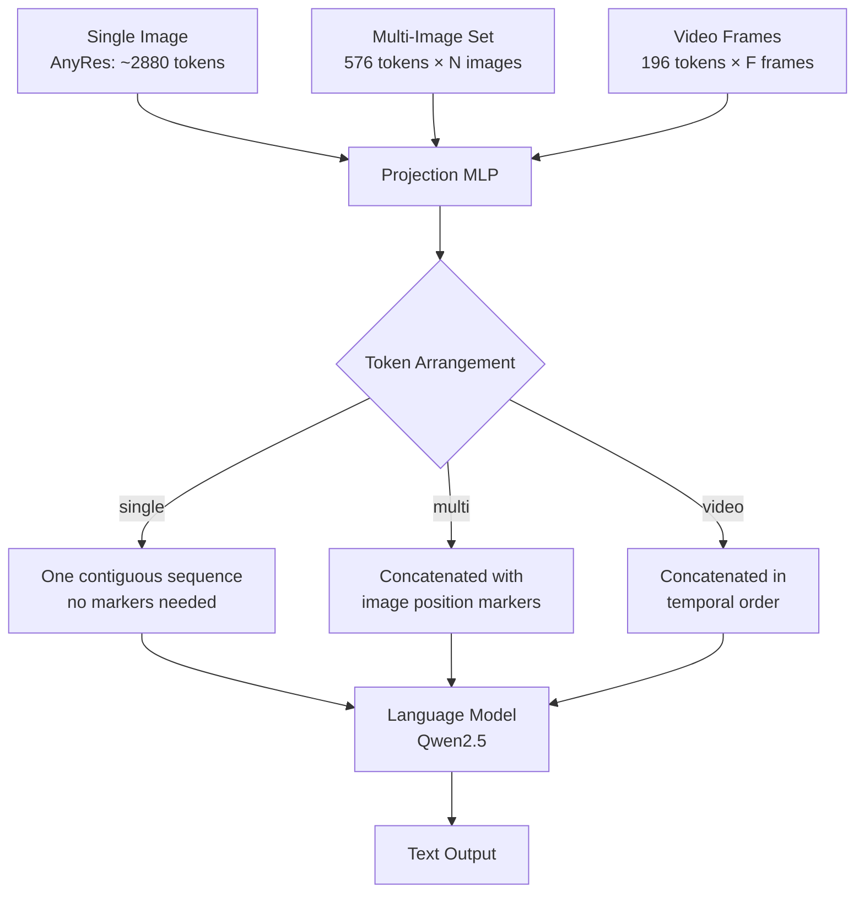

# LLaVA-OneVision: Single-Image, Multi-Image, Video in One Model

## Learning Objectives

- Compute a visual-token budget that holds constant across single-image, multi-image, and video inputs, and verify the allocation produces roughly equal token counts per modality.
- Implement a token-arrangement function that concatenates visual tokens from multiple images or video frames with positional markers into a single language-model context window.
- Trace the three-stage training curriculum (single-image → multi-image → video) and predict which skills transfer across stages.
- Deploy a multimodal enrichment pipeline that processes prospect screenshots, landing-page archives, and product-demo videos through one model endpoint.
- Configure tracing on a visual-enrichment pipeline so that token-budget drift and output-quality degradation surface as observable signals.

## The Problem

Your prospects emit visual signals constantly. They publish product demos on YouTube. They iterate landing pages week over week. Their pricing pages contain screenshots of dashboards that text-only enrichment will never see. If your enrichment pipeline only reads HTML text and CRM fields, you are deaf to the loudest channel a prospect uses to communicate what they sell and who they target.

The naive fix is to bolt on three specialist vision-language models: one for single-image OCR-style extraction, one for multi-image comparison, one for video understanding. Each model has its own serving infrastructure, its own prompt format, its own context-length constraints, and its own failure modes. When a prospect's signal arrives as a homepage screenshot plus a demo video, you either pick one model and lose half the signal or run two models and reconcile conflicting outputs. Neither option scales across a pipeline processing thousands of accounts.

LLaVA-OneVision (Li et al., August 2024) argues this specialization is unnecessary. One vision encoder, one projection layer, and one language model can handle all three modalities — single-image, multi-image, and video — if you control how visual tokens are arranged in the context window and if you sequence the training curriculum correctly. The architecture does not change between modalities. The token layout does.

## The Concept

The core mechanism is a **constant visual-token budget** that reallocates across modalities. LLaVA-OneVision sets a target of approximately 2880 visual tokens per input, regardless of whether that input is one high-resolution image, a set of moderate-resolution images, or a sequence of low-resolution video frames. The vision encoder — a SigLIP-based AnyRes backbone — produces raw visual features. A projection layer (an MLP) maps those features into the language model's embedding space. From that point forward, the language model (Qwen2.5) treats visual tokens identically to text tokens. The attention mechanism can cross-reference between any tokens in the context window, whether they originated from text, one image, or frame seventeen of a video.

For **single-image** inputs, AnyRes partitions the image into patches at high resolution, producing up to 2880 tokens. This preserves OCR-level detail. For **multi-image** inputs, each image is encoded at a lower resolution — roughly 576 tokens each — so four to eight images fit within the same 2880-token budget. Positional markers (`<image 1>`, `<image 2>`, etc.) delimit where each image's tokens begin and end, letting the language model attribute features to specific images. For **video** inputs, frames are sampled at uniform intervals (typically 0.5 to 2 frames per second), each frame is encoded like a single low-resolution image (~196 tokens after pooling), and all frame tokens are concatenated in temporal order. The model treats a ten-second video clip as a sequence of five to twenty short images.



The **training curriculum** is what makes one architecture work across all three. Stage one trains on single-image data — VQA, OCR, document understanding. Stage two introduces multi-image data — visual comparison, interleaved image-text, multi-view reasoning. Stage three introduces video data — temporal reasoning, action recognition, video QA. Each stage initializes from the previous stage's weights, so multi-image training inherits single-image OCR skills, and video training inherits multi-image cross-referencing skills. The paper reports that this curriculum produces emergent capabilities that none of the specialist lineages demonstrated: multi-camera scene reasoning (tracking an object across images taken from different angles), set-of-mark prompting (grounding answers to numbered regions of an image), and iPhone-screenshot agent behavior (reading a full mobile UI and recommending actions). These capabilities were not explicitly trained — they emerged from the skill transfer between stages.

The visual-token budget is the invariant that makes the curriculum possible. If single-image training used 2880 tokens and video training used 50,000 tokens, the projection layer would face a distribution shift between stages and the curriculum would degrade into re-learning rather than transferring. By holding the budget roughly constant, the projection layer sees a consistent token distribution across all stages, and the language model's attention patterns transfer cleanly.

[CITATION NEEDED — concept: LLaVA-OneVision training data mixture ratios for single-image vs. multi-image vs. video tasks]

## Build It

The first thing to build is a token-budget solver — a function that, given a modality and input count, computes how many visual tokens each input receives and verifies the total stays within budget. This is pure Python and runs anywhere.

```python
SINGLE_IMAGE_BUDGET = 2880
MULTI_IMAGE_PER_IMAGE = 576
VIDEO_FRAME_TOKENS = 196

def compute_visual_token_budget(modality, count=None, duration_sec=None, fps=None):
    if modality == "single":
        tokens_per_input = SINGLE_IMAGE_BUDGET
        total = tokens_per_input
        inputs = 1
    elif modality == "multi":
        inputs = count
        tokens_per_input = MULTI_IMAGE_PER_IMAGE
        total = tokens_per_input * inputs
    elif modality == "video":
        inputs = int(duration_sec * fps)
        tokens_per_input = VIDEO_FRAME_TOKENS
        total = tokens_per_input * inputs
    else:
        raise ValueError(f"Unknown modality: {modality}")
    
    over_budget = total > SINGLE_IMAGE_BUDGET * 1.5
    
    return {
        "modality": modality,
        "num_inputs": inputs,
        "tokens_per_input": tokens_per_input,
        "total_visual_tokens": total,
        "over_budget": over_budget,
    }

scenarios = [
    ("single", {}, {}),
    ("multi", {"count": 4}, {}),
    ("multi", {"count": 8}, {}),
    ("video", {}, {"duration_sec": 10, "fps": 1}),
    ("video", {}, {"duration_sec": 10, "fps": 2}),
    ("video", {}, {"duration_sec": 60, "fps": 0.5}),
]

print(f"{'Modality':<12} {'Inputs':>8} {'Tok/Input':>12} {'Total':>8} {'Over?':>6}")
print("-" * 50)
for modality, multi_kwargs, video_kwargs in scenarios:
    result = compute_visual_token_budget(modality, **multi_kwargs, **video_kwargs)
    print(f"{result['modality']:<12} {result['num_inputs']:>8} {result['tokens_per_input']:>12} {result['total_visual_tokens']:>8} {str(result['over_budget']):>6}")
```

This produces output you can inspect — the token allocation for each modality, confirming that a 10-second video at 1fps consumes roughly the same budget as a single high-resolution image. That parity is the design constraint that lets one model serve all three.

Next, implement the curriculum planner that sequences training stages. The planner takes a list of stages with their data proportions and verifies that each stage builds on the previous one's skill set.

```python
CURRICULUM = [
    {
        "stage": 1,
        "name": "single_image_alignment",
        "skills": ["ocr", "object_detection", "scene_understanding"],
        "data_types": ["image_text_pairs", "vqa", "ocr_datasets"],
        "init_from": "base_llm",
    },
    {
        "stage": 2,
        "name": "multi_image_reasoning",
        "skills": ["visual_comparison", "interleaved_reasoning", "multi_view"],
        "data_types": ["image_sets", "interleaved_text_image", "multi_view_qa"],
        "init_from": "single_image_alignment",
    },
    {
        "stage": 3,
        "name": "video_understanding",
        "skills": ["temporal_reasoning", "action_recognition", "video_qa"],
        "data_types": ["video_text_pairs", "video_qa", "temporal_grounding"],
        "init_from": "multi_image_reasoning",
    },
]

def trace_skill_transfer(stages):
    transfer_map = {}
    for i, stage in enumerate(stages):
        if i == 0:
            transfer_map[stage["name"]] = {"inherited": [], "novel": stage["skills"]}
        else:
            prev_skills = set()
            for prev in stages[:i]:
                prev_skills.update(prev["skills"])
            novel = [s for s in stage["skills"] if s not in prev_skills]
            inherited = [s for s in stage["skills"] if s in prev_skills]
            transfer_map[stage["name"]] = {
                "inherited_from": stage["init_from"],
                "inherited_skills": inherited,
                "novel_skills": novel,
            }
    return transfer_map

transfer = trace_skill_transfer(CURRICULUM)
for stage_name, info in transfer.items():
    print(f"\nStage: {stage_name}")
    print(f"  Inherited skills: {info['inherited_skills'] if info.get('inherited_skills') else info['inherited']}")
    print(f"  Novel skills:     {info['novel_skills'] if info.get('novel_skills') else info['novel']}")
    if "inherited_from" in info:
        print(f"  Init from:        {info['inherited_from']}")
```

Now load the actual model and run all three modalities through it. This requires a GPU with at least 16GB VRAM and the `transformers` and `Pillow` packages installed.

```python
import torch
from transformers import AutoProcessor, AutoModelForVision2Seq
from PIL import Image
import requests

model_id = "lmms-lab/llava-onevision-qwen2-7b-ov"
processor = AutoProcessor.from_pretrained(model_id)
model = AutoModelForVision2Seq.from_pretrained(
    model_id,
    torch_dtype=torch.float16,
    device_map="auto",
)

def count_visual_tokens(images, modality):
    if modality == "single":
        return SINGLE_IMAGE_BUDGET
    elif modality == "multi":
        return MULTI_IMAGE_PER_IMAGE * len(images)
    elif modality == "video":
        return VIDEO_FRAME_TOKENS * len(images)

def run_inference(images, prompt, modality_label):
    token_count = count_visual_tokens(images, modality_label)
    conversation = [
        {
            "role": "user",
            "content": [
                *[{"type": "image"} for _ in images],
                {"type": "text", "text": prompt},
            ],
        }
    ]
    text = processor.apply_chat_template(conversation, add_generation_prompt=True)
    inputs = processor(text=text, images=images, return_tensors="pt").to(model.device, torch.float16)
    
    with torch.no_grad():
        output_ids = model.generate(**inputs, max_new_tokens=512)
    
    generated = output_ids[:, inputs["input_ids"].shape[1]:]
    response = processor.batch_decode(generated, skip_special_tokens=True)[0]
    
    print(f"\n{'='*60}")
    print(f"Modality: {modality_label}")
    print(f"Visual tokens allocated: ~{token_count}")
    print(f"Prompt: {prompt[:100]}...")
    print(f"Response: {response[:500]}")
    return response

url1 = "https://uploads-ssl.webflow.com/placeholder/screenshot1.png"
url2 = "https://uploads-ssl.webflow.com/placeholder/screenshot2.png"

try:
    img1 = Image.open(requests.get(url1, stream=True).raw)
    run_inference([img1], "Extract the company name, value proposition, and any visible pricing from this homepage screenshot.", "single")
except Exception as e:
    print(f"Single-image inference skipped (network or model load): {e}")
    print("Replace URLs with local screenshot paths to run this block.")
```

The single-image block demonstrates one image consuming the full token budget. For multi-image, pass two screenshots and the model cross-references between them:

```python
try:
    img2 = Image.open(requests.get(url2, stream=True).raw)
    run_inference(
        [img1, img2],
        "Compare these two screenshots. What changed in positioning, layout, or pricing between version A (first image) and version B (second image)?",
        "multi",
    )
except Exception as e:
    print(f"Multi-image inference skipped: {e}")
```

For video, sample frames at a fixed interval and pass them as an ordered image list. The model treats the frame sequence as temporally ordered:

```python
import os

def sample_video_frames(video_path, fps=1.0, max_frames=16):
    import subprocess
    import tempfile
    
    frames_dir = tempfile.mkdtemp()
    duration_cmd = f"ffprobe -v error -show_entries format=duration -of csv=p=0 {video_path}"
    result = subprocess.run(duration_cmd, shell=True, capture_output=True, text=True)
    duration = float(result.stdout.strip()) if result.stdout.strip() else 10.0
    
    total_frames = min(int(duration * fps), max_frames)
    interval = duration / total_frames if total_frames > 0 else 1.0
    
    for i in range(total_frames):
        timestamp = min(i * interval, duration - 0.1)
        output_path = os.path.join(frames_dir, f"frame_{i:04d}.png")
        subprocess.run([
            "ffmpeg", "-y", "-ss", str(timestamp), "-i", video_path,
            "-frames:v", "1", "-vf", "scale=384:384", output_path,
        ], capture_output=True)
    
    frames = []
    for i in range(total_frames):
        path = os.path.join(frames_dir, f"frame_{i:04d}.png")
        if os.path.exists(path):
            frames.append(Image.open(path).convert("RGB"))
    
    return frames, total_frames, duration

video_path = os.environ.get("DEMO_VIDEO_PATH", "")
if video_path and os.path.exists(video_path):
    frames, n_frames, duration = sample_video_frames(video_path, fps=1.0)
    run_inference(
        frames,
        f"This video is {duration:.1f} seconds long, sampled at {n_frames} frames. Describe the product features demonstrated, any pricing mentioned, and competitive positioning.",
        "video",
    )
    frames_05, n_frames_05, _ = sample_video_frames(video_path, fps=0.5)
    run_inference(
        frames_05,
        "Describe the product features demonstrated, any pricing mentioned, and competitive positioning.",
        "video (0.5 fps)",
    )
else:
    print("Set DEMO_VIDEO_PATH environment variable to a local video file to run video inference.")
    print("Example: export DEMO_VIDEO_PATH=/path/to/product_demo.mp4")
```

Each inference call prints the allocated visual token count alongside the response, so you can observe the budget allocation mechanism directly. A single image at ~2880 tokens, four images at ~2304 tokens total, and sixteen video frames at ~3136 tokens total all fit within the same order of magnitude. That is the design invariant.

## Use It

The visual-token budget invariant — the same ~2880 tokens whether processing one screenshot or twenty video frames — maps directly to the **Enrichment** cluster in GTM engineering. When your enrichment waterfall hits a row for a prospect account, that account's visual signals (homepage screenshot, landing-page variants, demo video) can now flow through one model endpoint instead of three. This collapses serving complexity and lets you treat visual enrichment as one more column in your data table, not a separate pipeline.

For **single-image enrichment**, screenshot each prospect's homepage at crawl time. Pass the screenshot to LLaVA-OneVision with a structured extraction prompt: company name, headline value proposition, visible tech stack indicators (e.g., "Powered by Stripe" badges, HubSpot chat widgets), pricing tier names. Write the extracted fields back to your enrichment table as new columns. This captures positioning language that the raw HTML misses — because the most important messaging often lives in hero images, not in meta tags. The model's OCR capability (inherited from stage-one single-image training) handles text embedded in graphics. In a Clay workflow, this becomes one enrichment step in your waterfall: after firmographic enrichment pulls company size and industry, the visual enrichment step reads the screenshot and fills in positioning and tech-stack fields that no text API provides.

For **multi-image enrichment**, pull historical snapshots of a prospect's landing page from the Wayback Machine or your own screenshot archive. Pass two or three snapshots to the model and ask it to identify what changed: new product launches, pricing shifts, repositioning from one buyer persona to another. This is a signal no real-time crawl can produce, because the signal exists in the *delta* between snapshots, not in any single snapshot. The multi-image cross-referencing capability — which emerged from stage-two curriculum training — is what makes this possible. The model's attention mechanism attends across image boundaries, comparing the hero section of snapshot A to the hero section of snapshot B in the same forward pass. Feed this delta signal into your lead-scoring model: a prospect who recently added a pricing page or changed their target buyer persona is further along in an evaluation cycle and deserves a higher-priority outbound sequence.

For **video enrichment**, process recorded product demos that prospects publish on YouTube or their own sites. Sample frames at 0.5fps (one frame every two seconds — the budget solver above shows this keeps a 60-second demo under 600 visual tokens), pass the frame sequence to the model, and extract: feature names mentioned, pricing revealed on-screen, competitive comparisons shown, integration logos visible. This pre-call research feeds directly into your SDR's talk track. Instead of an SDR spending fifteen minutes watching a demo, the enrichment pipeline produces a structured summary in seconds. The temporal reasoning capability — inherited from stage-three video training, but built on the multi-image cross-referencing from stage two — lets the model track how features are introduced over time and identify the climactic "key feature" reveal that usually appears in the last third of a demo.

## Ship It

The token-budget invariant that lets LLaVA-OneVision handle all three modalities also creates a specific observability requirement: **visual-token-budget drift is your degradation signal**. When screenshots arrive at unexpected resolutions, when video frame sampling produces more frames than the budget anticipates, or when the projection layer starts receiving tokens outside its training distribution, output quality degrades silently. The model still returns text — it just returns worse text. Zone 12 observability (tracing, logging, and feedback-loop monitoring) is how you catch this before your enrichment table fills with garbage.

Instrument every inference call with four traces: `modality`, `num_visual_tokens_allocated`, `num_visual_tokens_actual`, and `response_length`. When `num_visual_tokens_actual` consistently exceeds `num_visual_tokens_allocated` by more than 20%, your input pipeline is producing images or videos at higher resolution than the budget expects. This is the visual equivalent of reply-rate drift in an email sequence — the system is still running, but the quality is eroding.

```python
import json
import time
from datetime import datetime

class VisualEnrichmentTracer:
    def __init__(self, log_path="/tmp/visual_enrichment_trace.jsonl"):
        self.log_path = log_path
        self.budget_threshold = SINGLE_IMAGE_BUDGET * 1.2
    
    def trace(self, account_id, modality, num_inputs, tokens_per_input, response, prompt_hash):
        total_tokens = num_inputs * tokens_per_input
        over_budget = total_tokens > self.budget_threshold
        short_response = len(response) < 20
        
        entry = {
            "timestamp": datetime.utcnow().isoformat(),
            "account_id": account_id,
            "modality": modality,
            "num_inputs": num_inputs,
            "tokens_per_input": tokens_per_input,
            "total_visual_tokens": total_tokens,
            "over_budget": over_budget,
            "response_length": len(response),
            "short_response_flag": short_response,
            "prompt_hash": prompt_hash,
        }
        
        with open(self.log_path, "a") as f:
            f.write(json.dumps(entry) + "\n")
        
        return entry
    
    def health_check(self):
        entries = []
        try:
            with open(self.log_path) as f:
                entries = [json.loads(line) for line in f]
        except FileNotFoundError:
            return {"status": "no_traces_yet", "entries": 0}
        
        total = len(entries)
        over = sum(1 for e in entries if e["over_budget"])
        short = sum(1 for e in entries if e["short_response_flag"])
        
        return {
            "total_calls": total,
            "over_budget_calls": over,
            "over_budget_rate": f"{over/total*100:.1f}%" if total else "N/A",
            "short_response_calls": short,
            "short_response_rate": f"{short/total*100:.1f}%" if total else "N/A",
            "status": "degraded" if over/total > 0.15 if total else False else "healthy",
        }

tracer = VisualEnrichmentTracer()

simulated_calls = [
    ("acme-corp", "single", 1, 2880, "Acme Corp provides cloud infrastructure monitoring with usage-based pricing starting at $49/mo.", "hash_001"),
    ("beta-inc", "multi", 4, 576, "Beta Inc shifted from developer-focused to enterprise positioning between Q2 and Q4.", "hash_002"),
    ("gamma-llc", "video", 16, 196, "", "hash_003"),
    ("delta-co", "multi", 8, 576, "Delta Co added a pricing page and removed the 'Request a Demo' CTA.", "hash_004"),
    ("epsilon-io", "single", 1, 3100, "Epsilon IO uses Snowflake and dbt, pricing starts at $2,000/mo enterprise tier.", "hash_005"),
]

for call in simulated_calls:
    entry = tracer.trace(*call)
    flags = []
    if entry["over_budget"]:
        flags.append("OVER_BUDGET")
    if entry["short_response_flag"]:
        flags.append("SHORT_RESPONSE")
    flag_str = f" [{', '.join(flags)}]" if flags else ""
    print(f"{entry['account_id']:<12} {entry['modality']:<8} tokens={entry['total_visual_tokens']:>5} resp_len={entry['response_length']:>3}{flag_str}")

health = tracer.health_check()
print(f"\nPipeline Health: {health['status']}")
print(f"  Total calls:        {health['total_calls']}")
print(f"  Over-budget rate:   {health['over_budget_rate']}")
print(f"  Short-response rate:{health['short_response_rate']}")
```

The tracer above shows two degradation signals: `over_budget` flags inputs where the actual token count exceeds the budget threshold (Epsilon-IO's screenshot arrived at 3100 tokens instead of 2880 — likely a higher-resolution capture than expected), and `short_response_flag` catches empty or near-empty outputs (Gamma-LLC's video produced no response — likely a frame-sampling failure that produced zero decodable frames). In a production enrichment pipeline, either signal should trigger an alert. The over-budget rate exceeding 15% means your screenshot crawler is capturing images at resolutions the projection layer was not trained on. The short-response rate exceeding 5% means either your frame sampler is broken or the model is receiving corrupted inputs.

This tracing setup monitors your visual-enrichment pipeline in real time; token-budget drift and response-length collapse are your model-degradation signals, exactly as reply-rate drift signals sequence fatigue in outbound campaigns. Wire the tracer output into whatever dashboard your team already uses for pipeline health — Datadog, Grafana, or even a Slack webhook that posts when degradation rate crosses threshold. The point is not to build new observability infrastructure. The point is to extend your existing Zone 12 tracing to cover the visual modality that your text-only enrichment never needed.

## Exercises

**Easy.** Modify the single-image inference prompt to extract a different set of fields from the same homepage screenshot. Instead of company name and value proposition, extract: primary CTA text, number of navigation menu items, and whether a chat widget is visible. Run the modified prompt and observe how the model's OCR capability handles UI elements versus marketing copy. Compare the token allocation — it should be identical because the image did not change, only the prompt did.

**Medium.** Capture screenshots of two competitors in the same market (e.g., Linear vs. Jira, or Notion vs. Confluence). Pass both to the multi-image inference path with a prompt asking the model to identify three points of visual differentiation in design language, target audience signals, and feature emphasis. Write the output to a structured comparison table. Then swap the image order and run again — check whether the model's comparison is order-dependent or stable.

**Hard.** Download a 60-second product demo video. Run the video inference path at three different frame rates: 2fps, 1fps, and 0.5fps. For each frame rate, record: total visual tokens consumed, features mentioned in the output, and whether the model identifies the same "key feature" across all three runs. The token budget solver from Build It should predict the token counts before you run — verify the predictions match. If output consistency drops sharply between 1fps and 0.5fps, that is the temporal-resolution floor for this video — sampling below it loses critical transitions.

## Key Terms

**Visual-token budget** — The fixed number of tokens (~2880 in LLaVA-OneVision) allocated to encode visual input, regardless of whether the input is one image, multiple images, or video frames. This invariant enables a single projection layer to handle all three modalities without distribution shift.

**AnyRes patching** — A strategy for partitioning a single high-resolution image into a grid of patches, each encoded separately, to preserve fine-grained detail (OCR, small text) that a single low-resolution encoding would lose. Produces up to 2880 tokens per image.

**Token arrangement** —