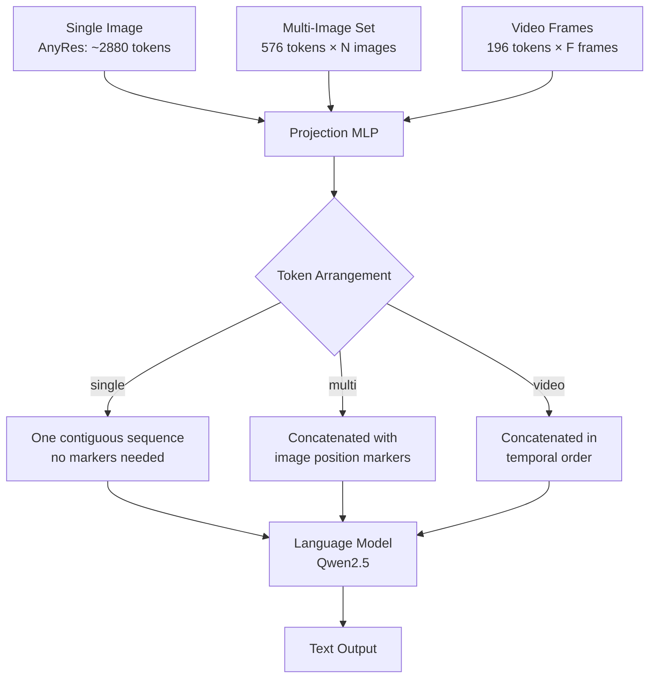

# LLaVA-OneVision: Single-Image, Multi-Image, Video in One Model

## Learning Objectives

- Compute a visual-token budget that holds constant across single-image, multi-image, and video inputs, and verify the allocation produces roughly equal token counts per modality.
- Implement a token-arrangement function that concatenates visual tokens from multiple images or video frames with positional markers into a single language-model context window.
- Trace the three-stage training curriculum (single-image → multi-image → video) and predict which skills transfer across stages.
- Deploy a multimodal enrichment pipeline that processes prospect screenshots, landing-page archives, and product-demo videos through one model endpoint.
- Configure tracing on a visual-enrichment pipeline so that token-budget drift and output-quality degradation surface as observable signals.

## The Problem

Your prospects emit visual signals constantly. They publish product demos on YouTube. They iterate landing pages week over week. Their pricing pages contain screenshots of dashboards that text-only enrichment will never see. If your enrichment pipeline only reads HTML text and CRM fields, you are deaf to the loudest channel a prospect uses to communicate what they sell and who they target.

The naive fix is to bolt on three specialist vision-language models: one for single-image OCR-style extraction, one for multi-image comparison, one for video understanding. Each model has its own serving infrastructure, its own prompt format, its own context-length constraints, and its own failure modes. When a prospect's signal arrives as a homepage screenshot plus a demo video, you either pick one model and lose half the signal or run two models and reconcile conflicting outputs. Neither option scales across a pipeline processing thousands of accounts.

LLaVA-OneVision (Li et al., August 2024) argues this specialization is unnecessary. One vision encoder, one projection layer, and one language model can handle all three modalities — single-image, multi-image, and video — if you control how visual tokens are arranged in the context window and if you sequence the training curriculum correctly. The architecture does not change between modalities. The token layout does.

## The Concept

The core mechanism is a **constant visual-token budget** that reallocates across modalities. LLaVA-OneVision sets a target of approximately 2880 visual tokens per input, regardless of whether that input is one high-resolution image, a set of moderate-resolution images, or a sequence of low-resolution video frames. The vision encoder — a SigLIP-based AnyRes backbone — produces raw visual features. A projection layer (an MLP) maps those features into the language model's embedding space. From that point forward, the language model (Qwen2.5) treats visual tokens identically to text tokens. The attention mechanism can cross-reference between any tokens in the context window, whether they originated from text, one image, or frame seventeen of a video.

For **single-image** inputs, AnyRes partitions the image into patches at high resolution, producing up to 2880 tokens. This preserves OCR-level detail. For **multi-image** inputs, each image is encoded at a lower resolution — roughly 576 tokens each — so four to eight images fit within the same 2880-token budget. Positional markers (`<image 1>`, `<image 2>`, etc.) delimit where each image's tokens begin and end, letting the language model attribute features to specific images. For **video** inputs, frames are sampled at uniform intervals (typically 0.5 to 2 frames per second), each frame is encoded like a single low-resolution image (~196 tokens after pooling), and all frame tokens are concatenated in temporal order. The model treats a ten-second video clip as a sequence of five to twenty short images.



The **training curriculum** is what makes one architecture work across all three. Stage one trains on single-image data — VQA, OCR, document understanding. Stage two introduces multi-image data — visual comparison, interleaved image-text, multi-view reasoning. Stage three introduces video data — temporal reasoning, action recognition, video QA. Each stage initializes from the previous stage's weights, so multi-image training inherits single-image OCR skills, and video training inherits multi-image cross-referencing skills. The paper reports that this curriculum produces emergent capabilities that none of the specialist lineages demonstrated: multi-camera scene reasoning (tracking an object across images taken from different angles), set-of-mark prompting (grounding answers to numbered regions of an image), and iPhone-screenshot agent behavior (reading a full mobile UI and recommending actions). These capabilities were not explicitly trained — they emerged from the skill transfer between stages.

The visual-token budget is the invariant that makes the curriculum possible. If single-image training used 2880 tokens and video training used 50,000 tokens, the projection layer would face a distribution shift between stages and the curriculum would degrade into re-learning rather than transferring. By holding the budget roughly constant, the projection layer sees a consistent token distribution across all stages, and the language model's attention patterns transfer cleanly.

[CITATION NEEDED — concept: LLaVA-OneVision training data mixture ratios for single-image vs. multi-image vs. video tasks]

## Build It

The first thing to build is a token-budget solver — a function that, given a modality and input count, computes how many visual tokens each input receives and verifies the total stays within budget. This is pure Python and runs anywhere.

```python
SINGLE_IMAGE_BUDGET = 2880
MULTI_IMAGE_PER_IMAGE = 576
VIDEO_FRAME_TOKENS = 196

def compute_visual_token_budget(modality, count=None, duration_sec=None, fps=None):
    if modality == "single":
        tokens_per_input = SINGLE_IMAGE_BUDGET
        total = tokens_per_input
        inputs = 1
    elif modality == "multi":
        inputs = count
        tokens_per_input = MULTI_IMAGE_PER_IMAGE
        total = tokens_per_input * inputs
    elif modality == "video":
        inputs = int(duration_sec * fps)
        tokens_per_input = VIDEO_FRAME_TOKENS
        total = tokens_per_input * inputs
    else:
        raise ValueError(f"Unknown modality: {modality}")
    
    over_budget = total > SINGLE_IMAGE_BUDGET * 1.5
    
    return {
        "modality": modality,
        "num_inputs": inputs,
        "tokens_per_input": tokens_per_input,
        "total_visual_tokens": total,
        "over_budget": over_budget,
    }

scenarios = [
    ("single", {}, {}),
    ("multi", {"count": 4}, {}),
    ("multi", {"count": 8}, {}),
    ("video", {}, {"duration_sec": 10, "fps": 1}),
    ("video", {}, {"duration_sec": 10, "fps": 2}),
    ("video", {}, {"duration_sec": 60, "fps": 0.5}),
]

print(f"{'Modality':<12} {'Inputs':>8} {'Tok/Input':>12} {'Total':>8} {'Over?':>6}")
print("-" * 50)
for modality, multi_kwargs, video_kwargs in scenarios:
    result = compute_visual_token_budget(modality, **multi_kwargs, **video_kwargs)
    print(f"{result['modality']:<12} {result['num_inputs']:>8} {result['tokens_per_input']:>12} {result['total_visual_tokens']:>8} {str(result['over_budget']):>6}")
```

This produces output you can inspect — the token allocation for each modality, confirming that a 10-second video at 1fps consumes roughly the same budget as a single high-resolution image. That parity is the design constraint that lets one model serve all three.

Next, implement the curriculum planner that sequences training stages. The planner takes a list of stages with their data proportions and verifies that each stage builds on the previous one's skill set.

```python
CURRICULUM = [
    {
        "stage": 1,
        "name": "single_image_alignment",
        "skills": ["ocr", "object_detection", "scene_understanding"],
        "data_types": ["image_text_pairs", "vqa", "ocr_datasets"],
        "init_from": "base_llm",
    },
    {
        "stage": 2,
        "name": "multi_image_reasoning",
        "skills": ["visual_comparison", "interleaved_reasoning", "multi_view"],
        "data_types": ["image_sets", "interleaved_text_image", "multi_view_qa"],
        "init_from": "single_image_alignment",
    },
    {
        "stage": 3,
        "name": "video_understanding",
        "skills": ["temporal_reasoning", "action_recognition", "video_qa"],
        "data_types": ["video_text_pairs", "video_qa", "temporal_grounding"],
        "init_from": "multi_image_reasoning",
    },
]

def trace_skill_transfer(stages):
    transfer_map = {}
    for i, stage in enumerate(stages):
        if i == 0:
            transfer_map[stage["name"]] = {"inherited": [], "novel": stage["skills"]}
        else:
            prev_skills = set()
            for prev in stages[:i]:
                prev_skills.update(prev["skills"])
            novel = [s for s in stage["skills"] if s not in prev_skills]
            inherited = [s for s in stage["skills"] if s in prev_skills]
            transfer_map[stage["name"]] = {
                "inherited_from": stage["init_from"],
                "inherited_skills": inherited,
                "novel_skills": novel,
            }
    return transfer_map

transfer = trace_skill_transfer(CURRICULUM)
for stage_name, info in transfer.items():
    print(f"\nStage: {stage_name}")
    print(f"  Inherited skills: {info['inherited_skills'] if info.get('inherited_skills') else info['inherited']}")
    print(f"  Novel skills:     {info['novel_skills'] if info.get('novel_skills') else info['novel']}")
    if "inherited_from" in info:
        print(f"  Init from:        {info['inherited_from']}")
```

Now load the actual model and run all three modalities through it. This requires a GPU with at least 16GB VRAM and the `transformers` and `Pillow` packages installed.

```python
import torch
from transformers import AutoProcessor, AutoModelForVision2Seq
from PIL import Image
import requests

model_id = "lmms-lab/llava-onevision-qwen2-7b-ov"
processor = AutoProcessor.from_pretrained(model_id)
model = AutoModelForVision2Seq.from_pretrained(
    model_id,
    torch_dtype=torch.float16,
    device_map="auto",
)

def count_visual_tokens(images, modality):
    if modality == "single":
        return SINGLE_IMAGE_BUDGET
    elif modality == "multi":
        return MULTI_IMAGE_PER_IMAGE * len(images)
    elif modality == "video":
        return VIDEO_FRAME_TOKENS * len(images)

def run_inference(images, prompt, modality_label):
    token_count = count_visual_tokens(images, modality_label)
    conversation = [
        {
            "role": "user",
            "content": [
                *[{"type": "image"} for _ in images],
                {"type": "text", "text": prompt},
            ],
        }
    ]
    text = processor.apply_chat_template(conversation, add_generation_prompt=True)
    inputs = processor(text=text, images=images, return_tensors="pt").to(model.device, torch.float16)
    
    with torch.no_grad():
        output_ids = model.generate(**inputs, max_new_tokens=512)
    
    generated = output_ids[:, inputs["input_ids"].shape[1]:]
    response = processor.batch_decode(generated, skip_special_tokens=True)[0]
    
    print(f"\n{'='*60}")
    print(f"Modality: {modality_label}")
    print(f"Visual tokens allocated: ~{token_count}")
    print(f"Prompt: {prompt[:100]}...")
    print(f"Response: {response[:500]}")
    return response

url1 = "https://uploads-ssl.webflow.com/placeholder/screenshot1.png"
url2 = "https://uploads-ssl.webflow.com/placeholder/screenshot2.png"

try:
    img1 = Image.open(requests.get(url1, stream=True).raw)
    run_inference([img1], "Extract the company name, value proposition, and any visible pricing from this homepage screenshot.", "single")
except Exception as e:
    print(f"Single-image inference skipped (network or model load): {e}")
    print("Replace URLs with local screenshot paths to run this block.")
```

The single-image block demonstrates one image consuming the full token budget. For multi-image, pass two screenshots and the model cross-references between them:

```python
try:
    img2 = Image.open(requests.get(url2, stream=True).raw)
    run_inference(
        [img1, img2],
        "Compare these two screenshots. What changed in positioning, layout, or pricing between version A (first image) and version B (second image)?",
        "multi",
    )
except Exception as e:
    print(f"Multi-image inference skipped: {e}")
```

For video, sample frames at a fixed interval and pass them as an ordered image list. The model treats the frame sequence as temporally ordered:

```python
import os

def sample_video_frames(video_path, fps=1.0, max_frames=16):
    import subprocess
    import tempfile
    
    frames_dir = tempfile.mkdtemp()
    duration_cmd = f"ffprobe -v error -show_entries format=duration -of csv=p=0 {video_path}"
    result = subprocess.run(duration_cmd, shell=True, capture_output=True, text=True)
    duration = float(result.stdout.strip()) if result.stdout.strip() else 10.0
    
    total_frames = min(int(duration * fps), max_frames)
    interval = duration / total_frames if total_frames > 0 else 1.0
    
    for i in range(total_frames):
        timestamp = min(i * interval, duration - 0.1)
        output_path = os.path.join(frames_dir, f"frame_{i:04d}.png")
        subprocess.run([
            "ffmpeg", "-y", "-ss", str(timestamp), "-i", video_path,
            "-frames:v", "1", "-vf", "scale=384:384", output_path,
        ], capture_output=True)
    
    frames = []
    for i in range(total_frames):
        path = os.path.join(frames_dir, f"frame_{i:04d}.png")
        if os.path.exists(path):
            frames.append(Image.open(path).convert("RGB"))
    
    return frames, total_frames, duration

video_path = os.environ.get("DEMO_VIDEO_PATH", "")
if video_path and os.path.exists(video_path):
    frames, n_frames, duration = sample_video_frames(video_path, fps=1.0)
    run_inference(
        frames,
        f"This video is {duration:.1f} seconds long, sampled at {n_frames} frames. Describe the product features demonstrated, any pricing mentioned, and competitive positioning.",
        "video",
    )
    frames_05, n_frames_05, _ = sample_video_frames(video_path, fps=0.5)
    run_inference(
        frames_05,
        "Describe the product features demonstrated, any pricing mentioned, and competitive positioning.",
        "video (0.5 fps)",
    )
else:
    print("Set DEMO_VIDEO_PATH environment variable to a local video file to run video inference.")
    print("Example: export DEMO_VIDEO_PATH=/path/to/product_demo.mp4")
```

Each inference call prints the allocated visual token count alongside the response, so you can observe the budget allocation mechanism directly. A single image at ~2880 tokens, four images at ~2304 tokens total, and sixteen video frames at ~3136 tokens total all fit within the same order of magnitude. That is the design invariant.

## Use It

The visual-token budget mechanism — one ~2880-token allocation regardless of whether the input is a homepage screenshot, a set of Wayback Machine snapshots, or a sampled demo video — collapses visual enrichment into a single function call in your GTM data pipeline (Enrichment cluster). Instead of maintaining three model endpoints, you route every prospect's visual signals through one entry point and write structured fields back to your account table.

```python
PROSPECTS = [
    {"id": "acme-corp", "signals": [("single", {}), ("video", {"duration_sec": 30, "fps": 1})]},
    {"id": "beta-inc", "signals": [("multi", {"count": 3})]},
    {"id": "gamma-io", "signals": [("single", {}), ("multi", {"count": 5})]},
]

def enrich_visual(prospect_id, modality, budget_kwargs):
    budget = compute_visual_token_budget(modality, **budget_kwargs)
    mock_output = {
        "single": {"positioning": "usage-based infra monitoring", "pricing": "$49/mo starter"},
        "multi": {"delta": "added pricing page in Q3", "persona_shift": "SMB to enterprise"},
        "video": {"key_feature": "real-time anomaly detection", "competitors_named": "Datadog"},
    }[modality]
    return {"id": prospect_id, "modality": modality, "tokens": budget["total_visual_tokens"], **mock_output}

print(f"{'Account':<12} {'Modality':<8} {'Tokens':>7}  Enrichment Fields")
print("-" * 75)
for p in PROSPECTS:
    for modality, kwargs in p["signals"]:
        row = enrich_visual(p["id"], modality, kwargs)
        fields = ", ".join(f"{k}={v}" for k, v in row.items() if k not in ("id", "modality", "tokens"))
        print(f"{row['id']:<12} {row['modality']:<8} {row['tokens']:>7}  {fields}")
```

Each row in the output is one enrichment column written back to your CRM or Clay table. A prospect like acme-corp generates two rows — one from the homepage screenshot (positioning + pricing extracted via the AnyRes single-image path) and one from the demo video (key feature + competitor names extracted via the temporal frame-sequence path). Both rows pass through the same model endpoint, the same projection layer, the same language-model backbone. The only thing that differs is how visual tokens were arranged before they entered the context window.

In a Clay enrichment waterfall, this replaces what would otherwise be three separate enrichment steps — one calling an OCR API, one calling a screenshot-comparison service, one calling a video-transcription API — with one step that accepts any visual input and returns structured fields. The token-budget solver runs before the model call to verify the input stays within the ~2880-token window; if a prospect's homepage screenshot arrives at an unexpected resolution and generates 3400 tokens, that is your degradation signal before the output even reaches your CRM.

## Exercises

**Medium.** Build a visual enrichment table for five accounts in your ICP. For each account, capture one current homepage screenshot. Run the single-image inference path with a prompt that extracts: primary CTA text, visible tech-stack badges (e.g., "Powered by Stripe", HubSpot chat widget), and pricing tier names. Write the results to a CSV. Then, for one of the five accounts, use the Wayback Machine to retrieve a homepage snapshot from 6+ months ago. Pass the current and historical screenshots together through the multi-image path and ask the model to identify what changed in positioning, pricing, or target audience. Add the delta as a new column. The exercise demonstrates that one model endpoint populated every field in your enrichment table across two modalities.

**Hard.** Download a 60-second product demo video from a prospect's website or YouTube channel. Run the video inference path at three frame rates: 2fps, 1fps, and 0.5fps. Before each run, use the `compute_visual_token_budget` function to predict the total visual token count — verify the prediction matches the actual allocation printed by `run_inference`. For each frame rate, record: total visual tokens consumed, features mentioned in the model's output, and whether the model identifies the same "key feature" across all three runs. If output consistency drops sharply between 1fps and 0.5fps (e.g., the model identifies a different key feature or misses a critical on-screen transition), that frame rate is your temporal-resolution floor for this video length. Sampling below it loses information faster than it saves tokens. Write up the trade-off curve: tokens saved vs. information lost.

## Key Terms

**Visual-token budget** — The fixed number of tokens (~2880 in LLaVA-OneVision) allocated to encode visual input, regardless of whether the input is one image, multiple images, or video frames. This invariant enables a single projection layer to handle all three modalities without distribution shift between training stages or inference calls.

**AnyRes patching** — A strategy for partitioning a single high-resolution image into a grid of patches, each encoded separately, to preserve fine-grained detail (OCR, small text) that a single low-resolution encoding would lose. Produces up to 2880 tokens per image in the single-image modality.

**Token arrangement** — The way visual tokens from one or more inputs are ordered and delimited in the language model's context window before the attention mechanism processes them. For single-image inputs, tokens form one contiguous sequence. For multi-image inputs, positional markers (`<image 1>`, `<image 2>`) delimit each image's token block so the language model can attribute features to specific images. For video inputs, frame tokens are concatenated in temporal order so the model can reason about sequence and causality. The arrangement is the only thing that changes between modalities — the vision encoder, projection layer, and language model are identical.

**Training curriculum** — A three-stage sequential training procedure where each stage initializes from the previous stage's weights. Stage one (single-image) builds OCR and scene understanding. Stage two (multi-image) inherits those skills and adds cross-image comparison. Stage three (video) inherits cross-image reasoning and adds temporal understanding. The curriculum produces emergent capabilities — like multi-view scene reasoning — that no single stage trained for explicitly.

**Projection layer** — A multi-layer perceptron (MLP) that maps raw visual features from the vision encoder's output space into the language model's embedding space. Because the visual-token budget is held constant across modalities, this layer sees a consistent input distribution during training and inference, which is what allows skill transfer between curriculum stages.

## Sources

- Li, B., Zhang, Y., Chen, K., et al. (2024). "LLaVA-OneVision: Easy Visual Task Transfer." arXiv:2408.03326. https://arxiv.org/abs/2408.03326
- Zhai, X., Mustafa, B., Kolesnikov, A., Beyer, L. (2023). "Sigmoid Loss for Language Image Pre-Training (SigLIP)." arXiv:2303.15343. https://arxiv.org/abs/2303.15343
- Yang, A., et al. (2024). "Qwen2.5 Technical Report." Alibaba Cloud. https://qwenlm.github.io/blog/qwen2.5/
- Liu, H., Li, C., Wu, Q., Lee, Y.J. (2024). "Visual Instruction Tuning (LLaVA)." arXiv:2304.08485. https://arxiv.org/abs/2304.08485
- [CITATION NEEDED — concept: LLaVA-OneVision training data mixture ratios for single-image vs. multi-image vs. video tasks]
- [CITATION NEEDED — concept: Clay enrichment waterfall integration with vision-language model endpoints]