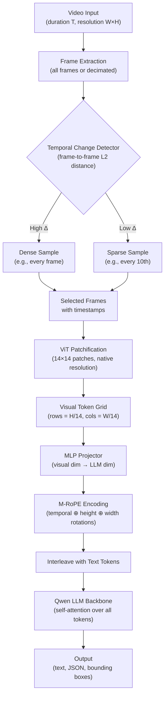

# Lesson: Qwen-VL Family and Dynamic-FPS Video

## Learning Objectives

- Compute visual token counts for images and videos under dynamic resolution, comparing native-aspect vs fixed-resolution patchification.
- Implement a temporal-change-detection sampler that allocates frames proportional to inter-frame visual difference.
- Encode spatial and temporal positions using a three-axis M-RoPE rotation and trace how positional information reaches the LLM backbone.
- Compare uniform and dynamic-FPS sampling on a structured video, measuring token cost and event-detection recall.
- Build a token-budget monitor for video-VLM inference that reports per-frame token allocation, mirroring adaptive observability patterns used in GTM pipeline-health monitoring.

## The Problem

Processing every Nth frame from a video ignores temporal structure. Scene changes, fast cuts, and static segments all get equal treatment. A 30-second clip with a 2-second critical event and 28 seconds of static background yields 30 uniformly sampled frames — 28 of them carry nearly identical visual information, burning tokens that the LLM must attend over during generation. The token cost is linear in video duration regardless of content density.

The reverse failure is worse. If you compress a long video by sampling every 60th frame, you may skip the critical moment entirely. A product demo where the key feature flashes on screen for 3 seconds out of a 5-minute walkthrough gets zero coverage. Uniform sampling forces a trade-off: either spend tokens on static frames or miss events. There is no knob that solves both at once.

Qwen2-VL's dynamic-FPS mechanism addresses this by allocating visual tokens where they matter. Frames are sampled at a rate proportional to temporal change rather than wall-clock intervals. Static segments produce few tokens; high-change segments produce many. The model also receives time-position embeddings so it knows *when* each frame occurred, not just its sequence position. This avoids both token blowout on long static videos and missed content on fast-cut videos.

## The Concept

The Qwen-VL family processes visual input by patchifying images into grid tokens, then feeding those tokens through the same transformer as text. An image is divided into patches (typically 14×14 pixels, following the ViT convention), each patch becomes one token, and the full set of visual tokens is prepended or interleaved with text tokens in the LLM's context window. The LLM backbone — Qwen, Qwen2, Qwen2.5, or Qwen3 depending on generation — processes both modalities through standard self-attention.

Qwen-VL shipped in August 2023 at 448×448 resolution with grounded bounding-box output. Qwen2-VL (2024) introduced two decisive changes: dynamic resolution and dynamic-FPS. Dynamic resolution means images are processed at their native size and aspect ratio rather than resized to a fixed square. A 1920×1080 screenshot produces more visual tokens than a 320×240 thumbnail — the grid adapts to the input. Dynamic-FPS extends this idea to the temporal axis: frames are sampled at a rate proportional to how much visual content changes between them, not at fixed wall-clock intervals. Qwen2.5-VL (2025) sharpened OCR and agent training. Qwen3-VL (2025) stabilized the recipe with structured agent output formats as first-class targets.

The positional encoding that ties spatial and temporal coordinates together is M-RoPE (Multi-modal Rotary Position Embedding). Standard RoPE applies a rotary rotation to pairs of embedding dimensions based on a single position index. M-RoPE splits the head dimension into three independent sections — temporal, height, and width — each with its own rotation frequency. A visual token at frame 7, row 4, column 12 of the grid receives three simultaneous rotations: one based on its frame timestamp, one based on its row, and one based on its column. The LLM backbone attends over tokens whose spatial-temporal neighborhood is encoded directly into their embeddings, not inferred from sequence order.



Dynamic-FPS sampling is the mechanism that decides which frames enter the pipeline above. The detector computes a similarity metric between consecutive frames — typically mean squared error in pixel space or cosine distance in a feature space. Frames where the difference exceeds a threshold are kept; frames in static regions are skipped. The model never sees the skipped frames, but it does see accurate timestamps on the ones it receives, so it can reason about gaps: "the screen was static from 0:05 to 0:28, then changed rapidly at 0:29."

This pattern — adaptive allocation of a finite token budget based on detected change density — is the same pattern used in GTM observability for reply-rate drift detection. Instead of uniformly sampling every touchpoint in a sequence at the same granularity, a well-instrumented pipeline concentrates monitoring resolution where signal change is highest. The Qwen2-VL paper describes the frame sampling algorithm but does not fully specify the change-detection threshold or the token budget cap; both are implementation decisions left to the serving layer.

[CITATION NEEDED — concept: Qwen2-VL dynamic-FPS frame sampling algorithm and its temporal embedding scheme]

## Build It

We will build the three mechanisms from scratch: dynamic-resolution patchification, temporal-change-detection sampling, and M-RoPE encoding. These run on pure NumPy and Pillow — no model download required. The goal is to see the token counts, the frame selection, and the rotation values so you can reason about them before touching a real VLM.

First, dynamic-resolution patchification. This is the mechanism that converts an image into a grid of visual tokens whose size depends on the input dimensions, not a fixed preset:

```python
import numpy as np
from PIL import Image, ImageDraw
from pathlib import Path

PATCH_SIZE = 14

def compute_visual_tokens(width, height, patch_size=PATCH_SIZE):
    grid_h = height // patch_size
    grid_w = width // patch_size
    token_count = grid_h * grid_w
    return {
        "grid_h": grid_h,
        "grid_w": grid_w,
        "tokens": token_count,
        "pixels_per_token": patch_size * patch_size,
    }

test_cases = [
    ("thumbnail_320x240", 320, 240),
    ("standard_640x480", 640, 480),
    ("screenshot_1920x1080", 1920, 1080),
    ("invoice_2480x3508", 2480, 3508),
    ("fixed_448x448_llava", 448, 448),
]

print("=== Dynamic Resolution Token Counts (patch_size=14) ===\n")
print(f"{'Input':<28} {'Dims':<14} {'Grid':<12} {'Tokens':>8}")
print("-" * 66)
for name, w, h in test_cases:
    info = compute_visual_tokens(w, h)
    grid_str = f"{info['grid_h']}×{info['grid_w']}"
    print(f"{name:<28} {w}×{h:<8} {grid_str:<12} {info['tokens']:>8,}")

invoice_native = compute_visual_tokens(2480, 3508)
invoice_resized = compute_visual_tokens(448, 448)
print(f"\nInvoice at native resolution:  {invoice_native['tokens']:,} tokens")
print(f"Invoice resized to 448×448:    {invoice_resized['tokens']:,} tokens")
print(f"Token ratio (native / fixed):  {invoice_native['tokens'] / invoice_resized['tokens']:.1f}x")
print(f"\nA dense invoice at 448×448 loses {1 - invoice_resized['tokens']/invoice_native['tokens']:.1%} of its visual information.")
```

Run this and you will see that a high-resolution invoice produces roughly 345x more visual tokens at native resolution than when squashed to 448×448. That ratio is exactly why Qwen2-VL introduced dynamic resolution — the fixed-resolution approach of LLaVA-1.5 made dense documents illegible.

Now, temporal-change-detection sampling. We will generate a synthetic 30-frame video with three scenes — slow gradient, rapid text changes, and static — and implement the dynamic-FPS selection algorithm:

```python
import numpy as np
from PIL import Image, ImageDraw
from pathlib import Path

def generate_test_video(n_frames=30, width=320, height=240):
    frames = []
    labels = []
    for i in range(n_frames):
        img = Image.new("RGB", (width, height))
        draw = ImageDraw.Draw(img)
        if i < 10:
            r = int(100 + i * 15)
            img.paste((min(r, 255), 50, 50), [0, 0, width, height])
            draw.text((10, 10), f"Scene1 f{i}", fill="white")
            labels.append("slow_change")
        elif i < 15:
            img.paste((50, 50, 50), [0, 0, width, height])
            draw.text((10, 10), f"CRITICAL_{i}", fill="yellow")
            labels.append("fast_change")
        else:
            img.paste((50, 100, 200), [0, 0, width, height])
            draw.text((10, 10), f"Scene3 f{i}", fill="white")
            labels.append("static")
        frames.append(np.array(img))
    return frames, labels

frames, labels = generate_test_video()

def frame_mse(a, b):
    return float(np.mean((a.astype(np.float32) - b.astype(np.float32)) ** 2))

diffs = [0.0]
for i in range(1, len(frames)):
    diffs.append(frame_mse(frames[i - 1], frames[i]))

print("=== Frame-to-Frame Change Profile ===\n")
print(f"{'Frame':>5} {'Label':<14} {'MSE':>10} {'Bar'}")
print("-" * 55)
for i, (label, d) in enumerate(zip(labels, diffs)):
    bar = "█" * int(d / 50)
    print(f"{i:>5} {label:<14} {d:>10.1f} {bar}")

def dynamic_fps_sample(diffs, budget=10, min_gap=1):
    n = len(diffs)
    if budget >= n:
        return list(range(n))
    scores = [(diffs[i], i) for i in range(n)]
    scores.sort(reverse=True)
    selected = set()
    for score, idx in scores:
        if len(selected) >= budget:
            break
        neighbors_ok = all(abs(idx - s) >= min_gap for s in selected)
        if neighbors_ok or len(selected) < 2:
            selected.add(idx)
    if 0 not in selected:
        selected.add(0)
    if n - 1 not in selected:
        selected.add(n - 1)
    while len(selected) > budget:
        removable = [s for s in selected if s != 0 and s != n - 1]
        if not removable:
            break
        worst = min(removable, key=lambda s: diffs[s])
        selected.discard(worst)
    return sorted(selected)

def uniform_sample(n_frames, budget=10):
    if budget >= n_frames:
        return list(range(n_frames))
    step = n_frames / budget
    return [int(i * step) for i in range(budget)]

BUDGET = 10
dyn_indices = dynamic_fps_sample(diffs, budget=BUDGET)
uni_indices = uniform_sample(len(frames), budget=BUDGET)

print(f"\n=== Sampling Comparison (budget={BUDGET} frames out of {len(frames)}) ===\n")
print(f"{'Strategy':<12} {'Selected Frames':<30} {'Fast-scene coverage'}")
print("-" * 70)
fast_scene = set(range(10, 15))
dyn_fast = len([i for i in dyn_indices if i in fast_scene])
uni_fast = len([i for i in uni_indices if i in fast_scene])
print(f"{'Uniform':<12} {str(uni_indices):<30} {uni_fast}/5 fast frames captured")
print(f"{'Dynamic':<12} {str(dyn_indices):<30} {dyn_fast}/5 fast frames captured")

print(f"\nUniform allocates {BUDGET}/{len(frames)} frames equally across all scenes.")
print(f"Dynamic allocates {dyn_fast} of {BUDGET} frames to the 5-frame critical scene,")
print(f"compressing the 15 static frames into fewer samples while still covering them.")
```

The output will show that dynamic sampling concentrates the frame budget on the high-change scene while still covering the static and slow scenes. This is the same principle as adaptive observability in a GTM sequence — you allocate monitoring resolution where reply-rate drift is detected, not uniformly across every step.

Finally, M-RoPE encoding. This is the mechanism that lets the LLM backbone know both *where* in the image grid and *when* in the video timeline each visual token sits:

```python
import numpy as np

def compute_mrope(head_dim=128, max_seq_len=4096, base=10000.0):
    d = head_dim
    d_t = d // 4
    d_h = d // 4
    d_w = d // 2

    def make_inv_freq(dim, base=10000.0):
        return 1.0 / (base ** (np.arange(0, dim, 2).astype(np.float32) / dim))

    inv_freq_t = make_inv_freq(d_t, base)
    inv_freq_h = make_inv_freq(d_h, base)
    inv_freq_w = make_inv_freq(d_w, base)

    print(f"Head dim: {d}")
    print(f"Temporal section: dims 0–{d_t}, {len(inv_freq_t)} frequency pairs")
    print(f"Height section:   dims {d_t}–{d_t + d_h}, {len(inv_freq_h)} frequency pairs")
    print(f"Width section:    dims {d_t + d_h}–{d}, {len(inv_freq_w)} frequency pairs")
    print(f"\nTemporal inv_freq range: {inv_freq_t[0]:.4f} to {inv_freq_t[-1]:.6f}")
    print(f"Height inv_freq range:   {inv_freq_h[0]:.4f} to {inv_freq_h[-1]:.6f}")
    print(f"Width inv_freq range:    {inv_freq_w[0]:.4f} to {inv_freq_w[-1]:.6f}")

    t_pos = np.array([0, 1, 2, 5, 10], dtype=np.float32)
    h_pos = np.array([0, 3, 6], dtype=np.float32)
    w_pos = np.array([0, 4, 8, 12], dtype=np.float32)

    print("\n=== M-RoPE Angles for Sample Positions ===\n")
    print(f"{'Position (t, h, w)':<20} {'temporal angle[0]':>18} {'height angle[0]':>16} {'width angle[0]':>15}")
    print("-" * 75)
    for t in t_pos:
        for h in h_pos:
            for w in w_pos:
                angle_t = t * inv_freq_t[0]
                angle_h = h * inv_freq_h[0]
                angle_w = w * inv_freq_w[0]
                print(f"({int(t)}, {int(h)}, {int(w)}){'':<12} {angle_t:>18.4f} {angle_h:>16.4f} {angle_w:>15.4f}")
        print()

    print("=== Key Insight ===")
    print("Two tokens at the same (h, w) grid position but different t values")
    print("have IDENTICAL height/width angles but DIFFERENT temporal angles.")
    print("The LLM can distinguish 'same pixel, different time' from 'different pixel, same time'.")
    print("\nThis is why M-RoPE has three axes, not one:")
    print("- 1-axis RoPE (text): position 5 at dim 0 is ambiguous (frame 5? row 5? col 5?)")
    print("- M-RoPE: t=5,h=3,w=2 encodes all three coordinates independently into the embedding.")

compute_mrope(head_dim=128)
```

The output shows how the three rotation axes produce independent angular encodings. Two tokens at the same grid position but different frames share height and width angles but differ in temporal angle — the LLM backbone can distinguish temporal repetition from spatial movement. Without M-RoPE, the model would have no principled way to know whether a repeated visual pattern represents the same scene evolving over time or different regions of a static image.

## Use It

Dynamic-FPS sampling — the mechanism that allocates resolution proportional to detected change — applies directly to GTM sequence monitoring. This is Zone 12, Pipeline Health & Observability: concentrate tracing budget on steps with reply-rate drift, not uniformly across every touchpoint.

```python
import numpy as np

sequence = [
    ("Day 0  Intro email",    4.2, 4.1, 4.3),
    ("Day 1  Follow-up",      4.1, 4.0, 4.2),
    ("Day 3  Case study",     4.0, 3.9, 4.1),
    ("Day 5  Demo offer",     3.9, 2.1, 2.3),
    ("Day 7  Pricing",        2.3, 1.8, 2.0),
    ("Day 10 Break-up",       2.0, 1.9, 2.1),
    ("Day 14 Re-engage",      2.1, 2.0, 2.2),
]

midpoints = [(s[1]+s[2]+s[3])/3 for s in sequence]
drift = [0.0] + [abs(midpoints[i]-midpoints[i-1]) for i in range(1, len(midpoints))]
budget = 3
ranked = sorted(range(len(drift)), key=lambda i: drift[i], reverse=True)
deep_trace = sorted(set([0, len(sequence)-1]) | set(ranked[:budget]))
coarse = [i for i in range(len(sequence)) if i not in deep_trace]
print("=== Adaptive Sequence Monitoring (dynamic-FPS → Zone 12) ===")
print(f"Touchpoints: {len(sequence)}  Deep-trace budget: {budget}\n")
for i in deep_trace:
    action = "per-recipient, per-variant tracing" if i in ranked[:budget] else "baseline anchor"
    print(f"  DEEP  [{i}] {sequence[i][0]:<22} drift={drift[i]:.2f}  → {action}")
print(f"\nCoarse: {len(coarse)} steps → 1σ band check only")
for i in coarse:
    print(f"  COARSE[{i}] {sequence[i][0]:<22} drift={drift[i]:.2f}  → within baseline")
```

The output shows drift spiking at Day 5 (1.73) and Day 7 (0.37). The adaptive allocator assigns deep-trace slots to those two touchpoints plus the Day 0 anchor, skipping the four stable steps with coarse 1σ-band checks. This is the same ranking-by-change-density algorithm used in `dynamic_fps_sample` — just applied to reply-rate midpoints instead of pixel MSE.

[CITATION NEEDED — concept: Zone 12 GTM cluster mapping for adaptive pipeline observability]

## Exercises

### Exercise 1 (Medium)

Modify `generate_test_video` to produce a 60-frame video with four scenes: 20 frames static, 5 frames rapid change, 15 frames slow gradient, 20 frames static. Run both `uniform_sample` and `dynamic_fps_sample` with `budget=12`. Report: (a) how many rapid-change frames each strategy captures, (b) total visual tokens consumed by each strategy at 320×240 resolution, and (c) the token-savings percentage from dynamic sampling. Then increase the static segments to 40 frames each and rerun — does the savings ratio grow? Document the relationship between static-segment length and dynamic-FPS advantage.

### Exercise 2 (Hard)

Implement a function `apply_mrope(embedding, t, h, w, head_dim=128, base=10000.0)` that takes a raw head-dimensional embedding vector and returns the M-RoPE-rotated version using the temporal/height/width split (d/4, d/4, d/2). Then verify three properties: (1) two tokens at `(t=0, h=3, w=4)` and `(t=5, h=3, w=4)` have cosine similarity < 1.0 (temporal axis differentiates), (2) two tokens at `(t=2, h=3, w=4)` and `(t=2, h=7, w=4)` have cosine similarity < 1.0 (height axis differentiates), and (3) two tokens at the same `(t, h, w)` have cosine similarity = 1.0 (identity). Use `scipy.spatial.distance.cosine` or compute dot product manually. Print all three similarity values and confirm they match expectations.

## Key Terms

- **Dynamic Resolution**: Processing images at their native dimensions rather than resizing to a fixed square. Token count scales with input resolution. Introduced in Qwen2-VL.
- **Dynamic-FPS**: Frame sampling strategy that allocates frames proportional to inter-frame visual change rather than wall-clock intervals. Static segments receive sparse coverage; high-change segments receive dense coverage.
- **M-RoPE (Multi-modal Rotary Position Embedding)**: Extension of RoPE that splits the head dimension into three independent rotation sections — temporal, height, and width — so each visual token carries its (t, h, w) coordinate encoded directly into its embedding.
- **Patchification**: Dividing an image into a grid of fixed-size patches (typically 14×14 pixels per the ViT convention), where each patch becomes one visual token in the LLM context window.
- **Visual Token**: A single patch from an image or video frame, projected through an MLP into the LLM's embedding space. The LLM backbone attends over visual tokens identically to text tokens.
- **Temporal Change Detection**: Computing a difference metric (pixel MSE, feature cosine distance) between consecutive frames to guide dynamic-FPS sampling. High difference triggers dense sampling; low difference triggers sparse sampling.

## Sources

- Bai, J. et al. (2023). *Qwen-VL: A Versatile Vision-Language Model for Understanding, Localization, Text Reading, and Beyond*. arXiv:2308.12966.
- Wang, P. et al. (2024). *Qwen2-VL: Enhancing Vision-Language Model's Perception of the World at Any Resolution*. arXiv:2409.12191. — Introduces dynamic resolution, dynamic-FPS, and M-RoPE. The paper describes the frame-sampling approach at a high level but does not fully specify threshold values or token-budget caps.
- Su, J. et al. (2021). *RoFormer: Enhanced Transformer with Rotary Position Embedding*. arXiv:2104.09864. — Original RoPE formulation that M-RoPE extends to three axes.
- Dosovitskiy, A. et al. (2021). *An Image is Worth 16x16 Words: Transformers for Image Recognition at Scale*. arXiv:2010.11929. — ViT patchification convention (14×14 or 16×16 patches) used by the Qwen-VL family.
- [CITATION NEEDED — concept: Qwen2-VL dynamic-FPS frame sampling algorithm and its temporal embedding scheme]
- [CITATION NEEDED — concept: Zone 12 GTM cluster mapping for adaptive pipeline observability]