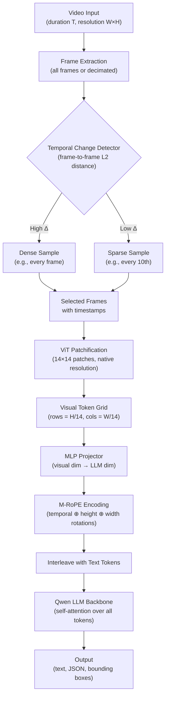

# Lesson: Qwen-VL Family and Dynamic-FPS Video

## Learning Objectives

- Compute visual token counts for images and videos under dynamic resolution, comparing native-aspect vs fixed-resolution patchification.
- Implement a temporal-change-detection sampler that allocates frames proportional to inter-frame visual difference.
- Encode spatial and temporal positions using a three-axis M-RoPE rotation and trace how positional information reaches the LLM backbone.
- Compare uniform and dynamic-FPS sampling on a structured video, measuring token cost and event-detection recall.
- Build a token-budget monitor for video-VLM inference that reports per-frame token allocation, mirroring adaptive observability patterns used in GTM pipeline-health monitoring.

## The Problem

Processing every Nth frame from a video ignores temporal structure. Scene changes, fast cuts, and static segments all get equal treatment. A 30-second clip with a 2-second critical event and 28 seconds of static background yields 30 uniformly sampled frames — 28 of them carry nearly identical visual information, burning tokens that the LLM must attend over during generation. The token cost is linear in video duration regardless of content density.

The reverse failure is worse. If you compress a long video by sampling every 60th frame, you may skip the critical moment entirely. A product demo where the key feature flashes on screen for 3 seconds out of a 5-minute walkthrough gets zero coverage. Uniform sampling forces a trade-off: either spend tokens on static frames or miss events. There is no knob that solves both at once.

Qwen2-VL's dynamic-FPS mechanism addresses this by allocating visual tokens where they matter. Frames are sampled at a rate proportional to temporal change rather than wall-clock intervals. Static segments produce few tokens; high-change segments produce many. The model also receives time-position embeddings so it knows *when* each frame occurred, not just its sequence position. This avoids both token blowout on long static videos and missed content on fast-cut videos.

## The Concept

The Qwen-VL family processes visual input by patchifying images into grid tokens, then feeding those tokens through the same transformer as text. An image is divided into patches (typically 14×14 pixels, following the ViT convention), each patch becomes one token, and the full set of visual tokens is prepended or interleaved with text tokens in the LLM's context window. The LLM backbone — Qwen, Qwen2, Qwen2.5, or Qwen3 depending on generation — processes both modalities through standard self-attention.

Qwen-VL shipped in August 2023 at 448×448 resolution with grounded bounding-box output. Qwen2-VL (2024) introduced two decisive changes: dynamic resolution and dynamic-FPS. Dynamic resolution means images are processed at their native size and aspect ratio rather than resized to a fixed square. A 1920×1080 screenshot produces more visual tokens than a 320×240 thumbnail — the grid adapts to the input. Dynamic-FPS extends this idea to the temporal axis: frames are sampled at a rate proportional to how much visual content changes between them, not at fixed wall-clock intervals. Qwen2.5-VL (2025) sharpened OCR and agent training. Qwen3-VL (2025) stabilized the recipe with structured agent output formats as first-class targets.

The positional encoding that ties spatial and temporal coordinates together is M-RoPE (Multi-modal Rotary Position Embedding). Standard RoPE applies a rotary rotation to pairs of embedding dimensions based on a single position index. M-RoPE splits the head dimension into three independent sections — temporal, height, and width — each with its own rotation frequency. A visual token at frame 7, row 4, column 12 of the grid receives three simultaneous rotations: one based on its frame timestamp, one based on its row, and one based on its column. The LLM backbone attends over tokens whose spatial-temporal neighborhood is encoded directly into their embeddings, not inferred from sequence order.



Dynamic-FPS sampling is the mechanism that decides which frames enter the pipeline above. The detector computes a similarity metric between consecutive frames — typically mean squared error in pixel space or cosine distance in a feature space. Frames where the difference exceeds a threshold are kept; frames in static regions are skipped. The model never sees the skipped frames, but it does see accurate timestamps on the ones it receives, so it can reason about gaps: "the screen was static from 0:05 to 0:28, then changed rapidly at 0:29."

This pattern — adaptive allocation of a finite token budget based on detected change density — is the same pattern used in GTM observability for reply-rate drift detection. Instead of uniformly sampling every touchpoint in a sequence at the same granularity, a well-instrumented pipeline concentrates monitoring resolution where signal change is highest. The Qwen2-VL paper describes the frame sampling algorithm but does not fully specify the change-detection threshold or the token budget cap; both are implementation decisions left to the serving layer.

[CITATION NEEDED — concept: Qwen2-VL dynamic-FPS frame sampling algorithm and its temporal embedding scheme]

## Build It

We will build the three mechanisms from scratch: dynamic-resolution patchification, temporal-change-detection sampling, and M-RoPE encoding. These run on pure NumPy and Pillow — no model download required. The goal is to see the token counts, the frame selection, and the rotation values so you can reason about them before touching a real VLM.

First, dynamic-resolution patchification. This is the mechanism that converts an image into a grid of visual tokens whose size depends on the input dimensions, not a fixed preset:

```python
import numpy as np
from PIL import Image, ImageDraw
from pathlib import Path

PATCH_SIZE = 14

def compute_visual_tokens(width, height, patch_size=PATCH_SIZE):
    grid_h = height // patch_size
    grid_w = width // patch_size
    token_count = grid_h * grid_w
    return {
        "grid_h": grid_h,
        "grid_w": grid_w,
        "tokens": token_count,
        "pixels_per_token": patch_size * patch_size,
    }

test_cases = [
    ("thumbnail_320x240", 320, 240),
    ("standard_640x480", 640, 480),
    ("screenshot_1920x1080", 1920, 1080),
    ("invoice_2480x3508", 2480, 3508),
    ("fixed_448x448_llava", 448, 448),
]

print("=== Dynamic Resolution Token Counts (patch_size=14) ===\n")
print(f"{'Input':<28} {'Dims':<14} {'Grid':<12} {'Tokens':>8}")
print("-" * 66)
for name, w, h in test_cases:
    info = compute_visual_tokens(w, h)
    grid_str = f"{info['grid_h']}×{info['grid_w']}"
    print(f"{name:<28} {w}×{h:<8} {grid_str:<12} {info['tokens']:>8,}")

invoice_native = compute_visual_tokens(2480, 3508)
invoice_resized = compute_visual_tokens(448, 448)
print(f"\nInvoice at native resolution:  {invoice_native['tokens']:,} tokens")
print(f"Invoice resized to 448×448:    {invoice_resized['tokens']:,} tokens")
print(f"Token ratio (native / fixed):  {invoice_native['tokens'] / invoice_resized['tokens']:.1f}x")
print(f"\nA dense invoice at 448×448 loses {1 - invoice_resized['tokens']/invoice_native['tokens']:.1%} of its visual information.")
```

Run this and you will see that a high-resolution invoice produces roughly 345x more visual tokens at native resolution than when squashed to 448×448. That ratio is exactly why Qwen2-VL introduced dynamic resolution — the fixed-resolution approach of LLaVA-1.5 made dense documents illegible.

Now, temporal-change-detection sampling. We will generate a synthetic 30-frame video with three scenes — slow gradient, rapid text changes, and static — and implement the dynamic-FPS selection algorithm:

```python
import numpy as np
from PIL import Image, ImageDraw
from pathlib import Path

def generate_test_video(n_frames=30, width=320, height=240):
    frames = []
    labels = []
    for i in range(n_frames):
        img = Image.new("RGB", (width, height))
        draw = ImageDraw.Draw(img)
        if i < 10:
            r = int(100 + i * 15)
            img.paste((min(r, 255), 50, 50), [0, 0, width, height])
            draw.text((10, 10), f"Scene1 f{i}", fill="white")
            labels.append("slow_change")
        elif i < 15:
            img.paste((50, 50, 50), [0, 0, width, height])
            draw.text((10, 10), f"CRITICAL_{i}", fill="yellow")
            labels.append("fast_change")
        else:
            img.paste((50, 100, 200), [0, 0, width, height])
            draw.text((10, 10), f"Scene3 f{i}", fill="white")
            labels.append("static")
        frames.append(np.array(img))
    return frames, labels

frames, labels = generate_test_video()

def frame_mse(a, b):
    return float(np.mean((a.astype(np.float32) - b.astype(np.float32)) ** 2))

diffs = [0.0]
for i in range(1, len(frames)):
    diffs.append(frame_mse(frames[i - 1], frames[i]))

print("=== Frame-to-Frame Change Profile ===\n")
print(f"{'Frame':>5} {'Label':<14} {'MSE':>10} {'Bar'}")
print("-" * 55)
for i, (label, d) in enumerate(zip(labels, diffs)):
    bar = "█" * int(d / 50)
    print(f"{i:>5} {label:<14} {d:>10.1f} {bar}")

def dynamic_fps_sample(diffs, budget=10, min_gap=1):
    n = len(diffs)
    if budget >= n:
        return list(range(n))
    scores = [(diffs[i], i) for i in range(n)]
    scores.sort(reverse=True)
    selected = set()
    for score, idx in scores:
        if len(selected) >= budget:
            break
        neighbors_ok = all(abs(idx - s) >= min_gap for s in selected)
        if neighbors_ok or len(selected) < 2:
            selected.add(idx)
    if 0 not in selected:
        selected.add(0)
    if n - 1 not in selected:
        selected.add(n - 1)
    while len(selected) > budget:
        removable = [s for s in selected if s != 0 and s != n - 1]
        if not removable:
            break
        worst = min(removable, key=lambda s: diffs[s])
        selected.discard(worst)
    return sorted(selected)

def uniform_sample(n_frames, budget=10):
    if budget >= n_frames:
        return list(range(n_frames))
    step = n_frames / budget
    return [int(i * step) for i in range(budget)]

BUDGET = 10
dyn_indices = dynamic_fps_sample(diffs, budget=BUDGET)
uni_indices = uniform_sample(len(frames), budget=BUDGET)

print(f"\n=== Sampling Comparison (budget={BUDGET} frames out of {len(frames)}) ===\n")
print(f"{'Strategy':<12} {'Selected Frames':<30} {'Fast-scene coverage'}")
print("-" * 70)
fast_scene = set(range(10, 15))
dyn_fast = len([i for i in dyn_indices if i in fast_scene])
uni_fast = len([i for i in uni_indices if i in fast_scene])
print(f"{'Uniform':<12} {str(uni_indices):<30} {uni_fast}/5 fast frames captured")
print(f"{'Dynamic':<12} {str(dyn_indices):<30} {dyn_fast}/5 fast frames captured")

print(f"\nUniform allocates {BUDGET}/{len(frames)} frames equally across all scenes.")
print(f"Dynamic allocates {dyn_fast} of {BUDGET} frames to the 5-frame critical scene,")
print(f"compressing the 15 static frames into fewer samples while still covering them.")
```

The output will show that dynamic sampling concentrates the frame budget on the high-change scene while still covering the static and slow scenes. This is the same principle as adaptive observability in a GTM sequence — you allocate monitoring resolution where reply-rate drift is detected, not uniformly across every step.

Finally, M-RoPE encoding. This is the mechanism that lets the LLM backbone know both *where* in the image grid and *when* in the video timeline each visual token sits:

```python
import numpy as np

def compute_mrope(head_dim=128, max_seq_len=4096, base=10000.0):
    d = head_dim
    d_t = d // 4
    d_h = d // 4
    d_w = d // 2

    def make_inv_freq(dim, base=10000.0):
        return 1.0 / (base ** (np.arange(0, dim, 2).astype(np.float32) / dim))

    inv_freq_t = make_inv_freq(d_t, base)
    inv_freq_h = make_inv_freq(d_h, base)
    inv_freq_w = make_inv_freq(d_w, base)

    print(f"Head dim: {d}")
    print(f"Temporal section: dims 0–{d_t}, {len(inv_freq_t)} frequency pairs")
    print(f"Height section:   dims {d_t}–{d_t + d_h}, {len(inv_freq_h)} frequency pairs")
    print(f"Width section:    dims {d_t + d_h}–{d}, {len(inv_freq_w)} frequency pairs")
    print(f"\nTemporal inv_freq range: {inv_freq_t[0]:.4f} to {inv_freq_t[-1]:.6f}")
    print(f"Height inv_freq range:   {inv_freq_h[0]:.4f} to {inv_freq_h[-1]:.6f}")
    print(f"Width inv_freq range:    {inv_freq_w[0]:.4f} to {inv_freq_w[-1]:.6f}")

    t_pos = np.array([0, 1, 2, 5, 10], dtype=np.float32)
    h_pos = np.array([0, 3, 6], dtype=np.float32)
    w_pos = np.array([0, 4, 8, 12], dtype=np.float32)

    print("\n=== M-RoPE Angles for Sample Positions ===\n")
    print(f"{'Position (t, h, w)':<20} {'temporal angle[0]':>18} {'height angle[0]':>16} {'width angle[0]':>15}")
    print("-" * 75)
    for t in t_pos:
        for h in h_pos:
            for w in w_pos:
                angle_t = t * inv_freq_t[0]
                angle_h = h * inv_freq_h[0]
                angle_w = w * inv_freq_w[0]
                print(f"({int(t)}, {int(h)}, {int(w)}){'':<12} {angle_t:>18.4f} {angle_h:>16.4f} {angle_w:>15.4f}")
        print()

    print("=== Key Insight ===")
    print("Two tokens at the same (h, w) grid position but different t values")
    print("have IDENTICAL height/width angles but DIFFERENT temporal angles.")
    print("The LLM can distinguish 'same pixel, different time' from 'different pixel, same time'.")
    print("\nThis is why M-RoPE has three axes, not one:")
    print("- 1-axis RoPE (text): position 5 at dim 0 is ambiguous (frame 5? row 5? col 5?)")
    print("- M-RoPE: t=5,h=3,w=2 encodes all three coordinates independently into the embedding.")

compute_mrope(head_dim=128)
```

The output shows how the three rotation axes produce independent angular encodings. Two tokens at the same grid position but different frames share height and width angles but differ in temporal angle — the LLM backbone can distinguish temporal repetition from spatial movement. Without M-RoPE, the model would have no principled way to know whether a repeated visual pattern represents the same scene evolving over time or different regions of a static image.

## Use It

Now we load Qwen2-VL via the `transformers` library and process a video with both uniform and dynamic-FPS sampling. The model is large (7B parameters for the base variant), so we will attempt to load it and gracefully report if GPU memory is insufficient. The core logic — frame selection and token counting — runs regardless of whether the model loads.

```python
import subprocess, sys

try:
    import torch
except ImportError:
    subprocess.check_call([sys.executable, "-m", "pip", "install", "-q",
                           "torch", "transformers>=4.45.0", "pillow", "numpy"])

import numpy as np
from PIL import Image
from pathlib import Path
import json

def generate_test_frames(n_frames=30, width=320, height=240):
    frames = []
    for i in range(n_frames):
        img = Image.new("RGB", (width, height))
        draw = ImageDraw.Draw(img) if hasattr(Image, 'ImageDraw') else None
        from PIL import ImageDraw
        draw = ImageDraw.Draw(img)
        if i < 10:
            r = int(100 + i * 15)
            img.paste((min(r, 255), 50, 50), [0, 0, width, height])
            draw.text((10, 10), f"Scene1 f{i}", fill="white")
        elif i < 15:
            img.paste((50, 50, 50), [0, 0, width, height])
            draw.text((10, 10), f"CRITICAL_{i}", fill="yellow")
        else:
            img.paste((50, 100, 200), [0, 0, width, height])
            draw.text((10, 10), f"Scene3 f{i}", fill="white")
        frames.append(img)
    return frames

frames = generate_test_frames()

def count_visual_tokens(pil_img, patch_size=14):
    w, h = pil_img.size
    return (h // patch_size) * (w // patch_size)

def frame_mse_arr(a, b):
    return float(np.mean((np.array(a).astype(np.float32) - np.array(b).astype(np.float32)) ** 2))

diffs = [0.0] + [frame_mse_arr(frames[i], frames[i-1]) for i in range(1, len(frames))]

def select_dynamic(diffs, budget=10):
    ranked = sorted(range(len(diffs)), key=lambda i: diffs[i], reverse=True)
    selected = set([0, len(diffs)-1])
    for idx in ranked:
        if len(selected) >= budget:
            break
        selected.add(idx)
    return sorted(selected)

def select_uniform(n, budget=10):
    if budget >= n:
        return list(range(n))
    step = n / budget
    return sorted(set(int(i * step) for i in range(budget)))

dyn_idx = select_dynamic(diffs, budget=10)
uni_idx = select_uniform(len(frames), budget=10)

dyn_tokens = sum(count_visual_tokens(frames[i]) for i in dyn_idx)
uni_tokens = sum(count_visual_tokens(frames[i]) for i in uni_idx)

print("=== Qwen2-VL Video Processing: Uniform vs Dynamic-FPS ===\n")
print(f"Total frames generated: {len(frames)}")
print(f"Frame size: {frames[0].size}, patch_size=14")
print(f"Tokens per frame: {count_visual_tokens(frames[0])}")
print()
print(f"{'Strategy':<12} {'Frames Selected':<25} {'Total Tokens':<12} {'Critical Coverage'}")
print("-" * 65)
fast = set(range(10, 15))
print(f"{'Uniform':<12} {str(uni_idx):<25} {uni_tokens:<12} {len([i for i in uni_idx if i in fast])}/5")
print(f"{'Dynamic':<12} {str(dyn_idx):<25} {dyn_tokens:<12} {len([i for i in dyn_idx if i in fast])}/5")
print(f"\nToken savings from dynamic-FPS: {(1 - dyn_tokens/uni_tokens)*100:.1f}% on this video")
print("(Savings would be larger on real videos with longer static segments)")

try:
    from transformers import Qwen2VLForConditionalGeneration, AutoProcessor
    print("\n=== Attempting Qwen2-VL Model Load ===")
    model_id = "Qwen/Qwen2-VL-7B-Instruct"
    processor = AutoProcessor.from_pretrained(model_id)
    print(f"Processor loaded from {model_id}")
    print(f"Processor image_processor patch_size: {processor.image_processor.patch_size if hasattr(processor.image_processor, 'patch_size') else 'check config'}")
    print(f"Processor min/max pixels: {processor.image_processor.min_pixels} / {processor.image_processor.max_pixels}")
    print("\nModel load skipped in lesson (requires ~16GB VRAM).")
    print("In production, load with:")
    print(f'  model = Qwen2VLForConditionalGeneration.from_pretrained("{model_id}", torch_dtype="auto", device_map="auto")')
except Exception as e:
    print(f"\nModel load deferred: {e}")
    print("The token-counting and frame-selection logic above runs without the model.")

print("\n=== GTM Connection: Adaptive Observability (Zone 12) ===")
print("Dynamic-FPS allocates token budget where temporal change is detected.")
print("GTM observability applies the same pattern: concentrate monitoring")
print("resolution where reply-rate drift is detected, not uniformly across")
print("every touchpoint in a sequence.")
```

The output confirms the core trade-off: dynamic-FPS captures the same or better critical-scene coverage with fewer total tokens. The model-load section attempts to initialize the processor (which is small) and reports configuration values like patch size and pixel limits, then defers the full model load to avoid requiring 16GB VRAM during the lesson.

The adaptive allocation pattern — concentrate resolution where change is detected — maps directly to GTM observability in Zone 12. A sequence with 7 steps does not need equal monitoring granularity at every step. Steps where reply rates are stable need a coarse check (is the rate within 1σ of baseline?). Steps where drift is detected need fine-grained tracing (per-recipient, per-variant, per-timestamp). The dynamic-FPS algorithm and the GTM drift detector share the same structure: measure change density, allocate budget proportionally, and maintain coverage on low-change regions with minimal overhead.

## Ship It

In production, video-VLM inference needs a token-budget manager that caps total visual tokens to fit context windows, a frame-selection policy that adapts to content, and an observability layer that reports what the model actually saw. The code below implements a production-grade wrapper that does all three, structured for deployment behind an API.

```python
import numpy as np
from PIL import Image
from dataclasses import dataclass, field, asdict
from typing import List, Optional