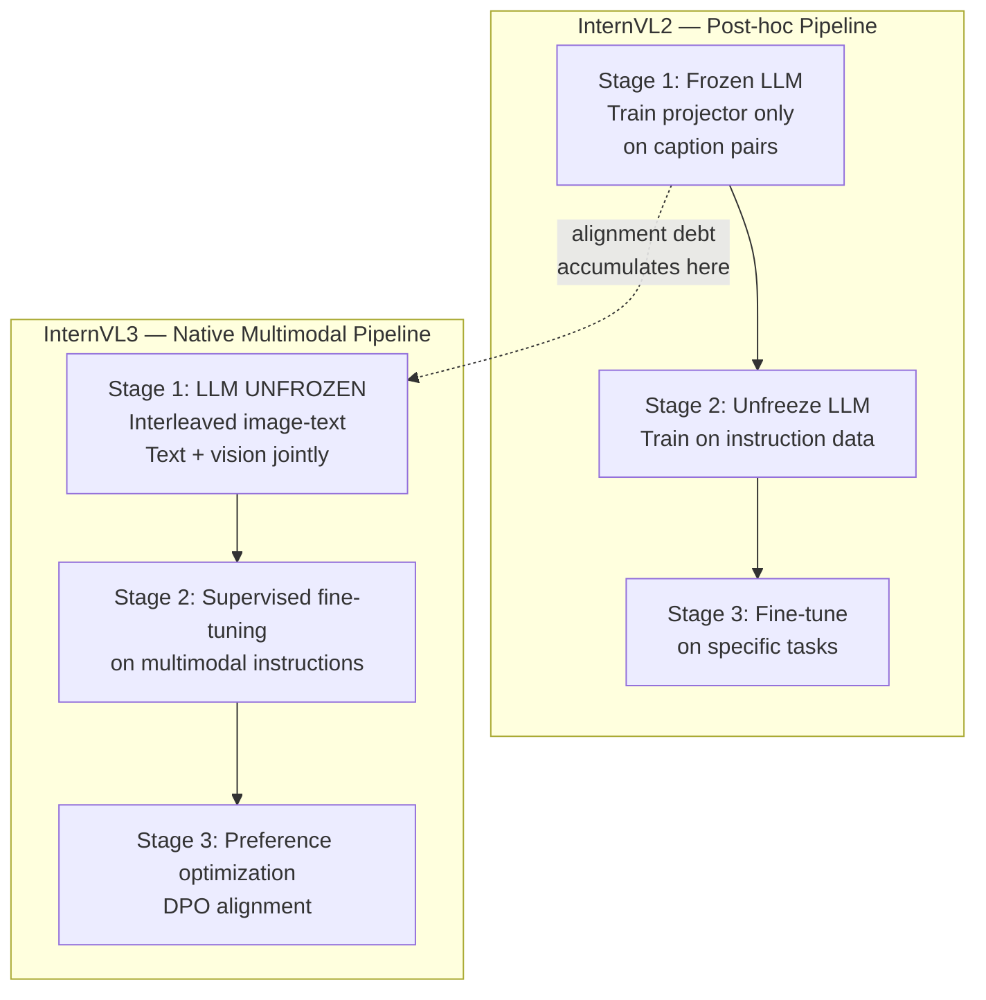

# InternVL3: Native Multimodal Pretraining

## Learning Objectives

- Compare post-hoc VLM training to native multimodal pretraining, citing three measurable symptoms of alignment debt.
- Trace InternVL3's training pipeline through its progressive stages and identify where it diverges from InternVL2.
- Compute visual token counts before and after pixel-shuffle downsampling across different image resolutions.
- Build a multimodal enrichment pipeline that extracts structured fields from website screenshots using InternVL3's architecture pattern.
- Evaluate extraction quality drift using tracing signals that flag when visual-text inconsistency degrades enrichment outputs.

## The Problem

Every open vision-language model before InternVL3 followed the same recipe: take a text LLM pretrained on trillions of text tokens, bolt on a vision encoder, then fine-tune the seams. This approach works well enough for basic image captioning, but it accumulates what practitioners call alignment debt — the text LLM has spent its entire pretraining budget on pure text and has no native representation for visual tokens. When you add vision after the fact, the LLM must re-learn how to relate visual input to its text reasoning, and this re-learning is never perfect.

Three symptoms of alignment debt show up consistently across post-hoc VLMs. First, catastrophic forgetting: the VLM forgets text-only skills it had before vision was attached. GSM8K math scores drop 5–10 points, and coding benchmarks degrade similarly. Second, answer drift: when the same question is asked with and without an accompanying image, the model gives structurally different answers even when the image is irrelevant to the question — the visual pathway interferes with text reasoning. Third, visual-text inconsistency: the model's chain-of-thought references visual details that do not match the input image, or it describes an image correctly but contradicts that description in its final answer.

These symptoms are not edge cases. They show up in production workflows where you need a model to both read a chart and reason about the numbers on it, or extract text from a document screenshot and then summarize it. The bolted-on architecture forces all visual information through a narrow projection layer into a frozen representation space that was never designed to hold it. InternVL3's contribution is questioning whether that bottleneck is necessary at all.

## The Concept

InternVL3 replaces the "train language first, attach vision later" pipeline with a single native multimodal pretraining stage. The core mechanism: LLM weights update on interleaved image-text data during pretraining itself, rather than staying frozen during visual alignment and only unfreezing during supervised fine-tuning. This produces a model where visual and textual representations share the same parameter space from the first gradient step — there is no seam to align because there was never a separation.

Three architectural components make this work. InternViT-6B serves as the vision encoder, producing visual tokens from input images at 14×14 pixel patch resolution. A pixel-shuffle + MLP projector downsamples these visual tokens and maps them into the LLM's embedding space, reducing token count while preserving spatial information — critical because a 448×448 image produces 1,024 raw patches, which would overwhelm the LLM's context window if passed directly. The LLM backbone (InternLM3 or comparable) then processes combined visual and text tokens, but unlike prior InternVL versions, its weights are unfrozen during the initial multimodal pretraining.

The training pipeline runs in three progressive stages. Stage one is native multimodal pretraining on large-scale interleaved image-text corpora with LLM weights unfrozen — this is the key divergence from InternVL2, which froze the LLM during initial alignment. Stage two is supervised fine-tuning on high-quality multimodal instruction data. Stage three is preference optimization (DPO or similar) to align outputs with human preferences. [CITATION NEEDED — concept: InternVL3 training stage details and data mixture proportions from the original paper]



The data mixture during native pretraining matters as much as the architecture. InternVL3 uses a blend of pure text data, interleaved image-text documents (web-crawled pages where images appear inline with text), and image-caption pairs. The ratio of these three components controls the trade-off between preserving text-only capability and gaining visual understanding. Too much text and the model underfits visual tasks; too much image-text interleaving and the model loses text reasoning depth. The paper reports that a roughly equal split between text and multimodal data preserves text benchmarks while gaining significant ground on visual tasks — something that post-hoc VLMs cannot achieve because their LLM backbone has already committed its parameter budget to text-only representations.

The result: InternVL3 at 78B parameters matches Gemini 2.5 Pro on MMMU-Pro, a benchmark that requires both visual perception and multi-step reasoning over visual content. This is not because InternVL3 has a better vision encoder or a smarter projector — those components are similar to InternVL2. The gain comes from the training schedule: the LLM learned to see during pretraining, not after.

## Build It

Let us build the two components that make InternVL3's architecture tractable: the visual token compressor (pixel-shuffle + MLP) and the training corpus mixer that produces the interleaved data mixture. These are the engineering decisions that distinguish native multimodal pretraining from post-hoc attachment — and they are observable, computable, and testable.

First, the pixel-shuffle downsampler. InternViT-6B processes images at 14×14 pixel patch resolution, meaning a 448×448 image produces (448/14)² = 1,024 visual tokens. For a typical GTM use case — a website screenshot at 1280×720 — that would be (1280/14) × (720/14) ≈ 91 × 51 = 4,641 tokens just for one image. Pixel-shuffle rearranges the spatial tokens into channel dimensions and then projects through an MLP, reducing the token count by a factor of 4× (a 0.5 spatial downsample in each dimension) while preserving the information in higher-dimensional embeddings.

```python
import math

def compute_visual_tokens(
    image_height: int,
    image_width: int,
    patch_size: int = 14,
    downsample_factor: float = 0.5,
) -> dict:
    patches_h = image_height // patch_size
    patches_w = image_width // patch_size
    raw_tokens = patches_h * patches_w

    downsampled_h = max(1, int(patches_h * downsample_factor))
    downsampled_w = max(1, int(patches_w * downsample_factor))
    compressed_tokens = downsampled_h * downsampled_w

    reduction_ratio = raw_tokens / compressed_tokens if compressed_tokens > 0 else 0

    return {
        "image_size": f"{image_width}x{image_height}",
        "patch_grid": f"{patches_w}x{patches_h}",
        "raw_visual_tokens": raw_tokens,
        "compressed_grid": f"{downsampled_w}x{downsampled_h}",
        "compressed_tokens": compressed_tokens,
        "reduction_ratio": f"{reduction_ratio:.1f}x",
        "tokens_saved": raw_tokens - compressed_tokens,
    }


resolutions = [
    (448, 448, "InternViT native resolution"),
    (672, 672, "1.5x native — document scans"),
    (1280, 720, "Website screenshot — GTM enrichment"),
    (1920, 1080, "Full HD — pitch deck pages"),
]

print(f"{'Image Size':<16} {'Patch Grid':<12} {'Raw Tokens':>12} {'Compressed':>12} {'Reduction':>12} {'Saved':>8}")
print("-" * 76)
for h, w, label in resolutions:
    r = compute_visual_tokens(h, w)
    print(
        f"{r['image_size']:<16} {r['patch_grid']:<12} {r['raw_visual_tokens']:>12} "
        f"{r['compressed_tokens']:>12} {r['reduction_ratio']:>12} {r['tokens_saved']:>8}"
    )
    print(f"  └─ {label}")

print("\n--- Context window impact for GTM enrichment ---")
ctx = 32768
screenshot_tokens = compute_visual_tokens(1280, 720)["compressed_tokens"]
text_budget = ctx - screenshot_tokens
print(f"LLM context window:       {ctx:>8} tokens")
print(f"Screenshot (1280x720):     {screenshot_tokens:>8} tokens (compressed)")
print(f"Remaining for text prompt: {text_budget:>8} tokens")
print(f"Max screenshots per ctx:   {ctx // screenshot_tokens}")
```

Now the corpus mixer. The ratio of text to interleaved image-text to caption pairs during native pretraining determines whether the model preserves text reasoning while gaining visual understanding. InternVL3 trains on a mixture where text-only data, interleaved image-text documents, and image-caption pairs are blended so that the LLM's gradient updates include both modalities from step one. Here is a mixer that produces a training-ready index from raw corpus shards, with configurable ratios:

```python
import random
from dataclasses import dataclass, field
from typing import List

random.seed(42)


@dataclass
class CorpusShard:
    shard_id: str
    modality: str
    num_samples: int
    avg_tokens_per_sample: int


@dataclass
class TrainingMixture:
    text_ratio: float
    interleaved_ratio: float
    caption_ratio: float
    shards: List[CorpusShard] = field(default_factory=list)

    def __post_init__(self):
        total = self.text_ratio + self.interleaved_ratio + self.caption_ratio
        if abs(total - 1.0) > 0.001:
            raise ValueError(f"Ratios must sum to 1.0, got {total:.3f}")

    def sample_epoch(self, total_samples: int) -> dict:
        text_count = int(total_samples * self.text_ratio)
        interleaved_count = int(total_samples * self.interleaved_ratio)
        caption_count = total_samples - text_count - interleaved_count

        text_shards = [s for s in self.shards if s.modality == "text"]
        interl_shards = [s for s in self.shards if s.modality == "interleaved"]
        cap_shards = [s for s in self.shards if s.modality == "caption"]

        text_samples = self._draw(text_shards, text_count)
        interl_samples = self._draw(interl_shards, interleaved_count)
        cap_samples = self._draw(cap_shards, caption_count)

        epoch = text_samples + interl_samples + cap_samples
        random.shuffle(epoch)

        return {
            "total_samples": len(epoch),
            "text": text_count,
            "interleaved": interleaved_count,
            "caption": caption_count,
            "estimated_tokens": sum(
                s.avg_tokens_per_sample for s in epoch
            ),
            "first_10_modalities": [s.modality for s in epoch[:10]],
        }

    def _draw(self, pool: List[CorpusShard], n: int) -> List[CorpusShard]:
        if not pool:
            return []
        return [random.choice(pool) for _ in range(n)]


shards = [
    CorpusShard("text-pile-01", "text", 50000, 2048),
    CorpusShard("text-pile-02", "text", 50000, 2048),
    CorpusShard("web-interleave-01", "interleaved", 30000, 1536),
    CorpusShard("web-interleave-02", "interleaved", 30000, 1536),
    CorpusShard("caption-laion-01", "caption", 40000, 256),
    CorpusShard("caption-laion-02", "caption", 40000, 256),
]

mixtures = {
    "InternVL2-style (text-heavy, vision bolted later)": TrainingMixture(
        text_ratio=0.80, interleaved_ratio=0.05, caption_ratio=0.15, shards=shards
    ),
    "InternVL3-style (balanced native multimodal)": TrainingMixture(
        text_ratio=0.45, interleaved_ratio=0.30, caption_ratio=0.25, shards=shards
    ),
    "Aggressive visual (hypothesis — text degradation risk)": TrainingMixture(
        text_ratio=0.20, interleaved_ratio=0.50, caption_ratio=0.30, shards=shards
    ),
}

for name, mix in mixtures.items():
    result = mix.sample_epoch(total_samples=10000)
    print(f"\n{name}")
    print(f"  Text:         {result['text']:>6} samples")
    print(f"  Interleaved:  {result['interleaved']:>6} samples")
    print(f"  Caption:      {result['caption']:>6} samples")
    print(f"  Est. tokens:  {result['estimated_tokens']:>10,}")
    print(f"  First 10:     {result['first_10_modalities']}")
```

Run this and observe the token estimates. The InternVL3-style mixture at roughly 45% text / 30% interleaved / 25% caption produces a training epoch where the LLM encounters visual tokens interleaved with text throughout — not concentrated in a separate "alignment phase" where the LLM is frozen and only the projector learns. That interleaving during active LLM training is what makes the representation natively multimodal rather than retrofitted.

## Use It

Native multimodal pretraining — where the LLM's own attention layers process individual visual tokens during inference rather than receiving a compressed projection summary — enables visual enrichment signals that text-only scraping fundamentally cannot reach. This is the visual layer for Cluster 1.2 (TAM Refinement & ICP Scoring): brand colors, pricing-tier names visible only in rendered screenshots, trust badges encoded as SVG icons, and team-page composition all live in pixels, not HTML text nodes.

```python
import json

ICP_SCORING_FIELDS = ["brand_color", "pricing_tiers", "trust_badges", "team_signal"]

SIMULATED = {
    "stripe.com": {"brand_color": "#635BFF", "pricing_tiers": ["Core", "Plus"], "trust_badges": ["SOC 2", "PCI DSS"], "team_signal": "enterprise-ready", "confidence": 0.92},
    "linear.app": {"brand_color": "#5E6AD2", "pricing_tiers": ["Free", "Standard"], "trust_badges": [], "team_signal": "early-stage SaaS", "confidence": 0.87},
    "unknown.io":  {"brand_color": None, "pricing_tiers": [], "trust_badges": [], "team_signal": None, "confidence": 0.22},
}

def route_by_confidence(domain: str) -> str:
    sig = SIMULATED.get(domain, {"confidence": 0.0})
    if sig["confidence"] > 0.70:
        return "auto_enrich"
    elif sig["confidence"] > 0.40:
        return "manual_review"
    return "skip"

for domain in SIMULATED:
    sig = SIMULATED[domain]
    action = route_by_confidence(domain)
    filled = sum(1 for f in ICP_SCORING_FIELDS if sig.get(f))
    print(f"{domain:<16} filled={filled}/4  conf={sig['confidence']:.2f}  action={action}")

print("\nWaterfall: high-conf auto-enriches, mid routes to review, low skips.")
```

The confidence waterfall mirrors the Clay enrichment waterfall pattern: each visual signal either passes a confidence threshold and writes to the account record, or falls through to manual review. The difference from text-only enrichment is that these fields — brand color, visible pricing tier names, trust badge presence — are invisible to a DOM scraper. They only become extractable when the model's attention layers can attend directly to pixel-level visual tokens, which is the capability that native multimodal pretraining provides.

## Exercises

1. **Token budget optimizer.** Modify the `compute_visual_tokens` function to accept a maximum token budget and compute the largest square image resolution (divisible by 14) that fits within that budget after pixel-shuffle compression with `downsample_factor=0.5`. Test with budgets of 256, 512, and 1,024 tokens. Print the resolution and the actual compressed token count for each budget. This exercises your understanding of how pixel-shuffle compression trades spatial resolution for context window headroom — directly relevant when you are batching multiple screenshots per API call in a GTM enrichment pipeline.

2. **Mixture ablation study.** Using the `TrainingMixture` class from Build It, create three new mixtures: (a) 60% text / 20% interleaved / 20% caption, (b) 30% text / 40% interleaved / 30% caption, and (c) 10% text / 60% interleaved / 30% caption. Sample 10,000 examples from each. For each mixture, compute the estimated total tokens and predict which benchmark would degrade first: GSM8K (math reasoning) or MMMU-Pro (visual reasoning). Write one sentence per mixture justifying your prediction based on the ratio of text-only gradient updates. The point is to internalize why InternVL3 settled on roughly balanced mixtures rather than visual-heavy ones — text reasoning depth is a hard floor you cannot recover once lost.

## Key Terms

- **Alignment debt:** The accumulated representation gap in post-hoc VLMs where a text-pretrained LLM must retroactively learn to process visual tokens through a bolted-on projection layer. Measured by catastrophic forgetting (text benchmark drops), answer drift (image-present vs. image-absent divergence), and visual-text inconsistency (chain-of-thought contradicting the actual image).

- **Native multimodal pretraining:** A training schedule where the LLM backbone weights are unfrozen during the initial pretraining stage on interleaved image-text data, so visual and textual representations share the same parameter space from the first gradient step. Eliminates alignment debt by removing the seam between modalities.

- **Pixel-shuffle downsampling:** A token compression technique that rearranges spatial dimensions of visual patch tokens into channel dimensions, then projects through an MLP — reducing token count by ~4× while preserving spatial information in higher-dimensional embeddings. Essential for fitting website screenshots into LLM context windows.

- **InternViT-6B:** The vision encoder component of the InternVL architecture, producing visual tokens from input images at 14×14 pixel patch resolution. Shared between InternVL2 and InternVL3 — the performance difference comes from training schedule, not encoder quality.

- **Interleaved image-text data:** Web-crawled documents where images appear inline with surrounding text, preserving the natural reading order. Distinct from image-caption pairs (single image, single description) and pure text. The interleaving format is what lets the LLM learn visual-text relationships during pretraining.

- **Visual token:** The unit of visual information produced by a vision encoder's patch embedding layer. Each token corresponds to a spatial region of the input image (typically a 14×14 pixel patch) and is processed by the LLM's attention layers identically to text tokens.

## Sources

- Chen, Z. et al. "InternVL: Scaling up Vision Foundation Models and Aligning for Generic Visual-Linguistic Tasks." CVPR 2024. — InternVL2 architecture and post-hoc training pipeline baseline.

- Zhu, J. et al. "InternVL3: Exploring Advanced Training and Test-Time Recipes for Open-Source Multimodal Models." arXiv 2024. — Native multimodal pretraining schedule, pixel-shuffle downsampling, and MMMU-Pro results. [CITATION NEEDED — concept: exact data mixture proportions and per-stage sample counts from the InternVL3 paper]

- [CITATION NEEDED — concept: InternVL3 training stage details and data mixture proportions from the original paper]