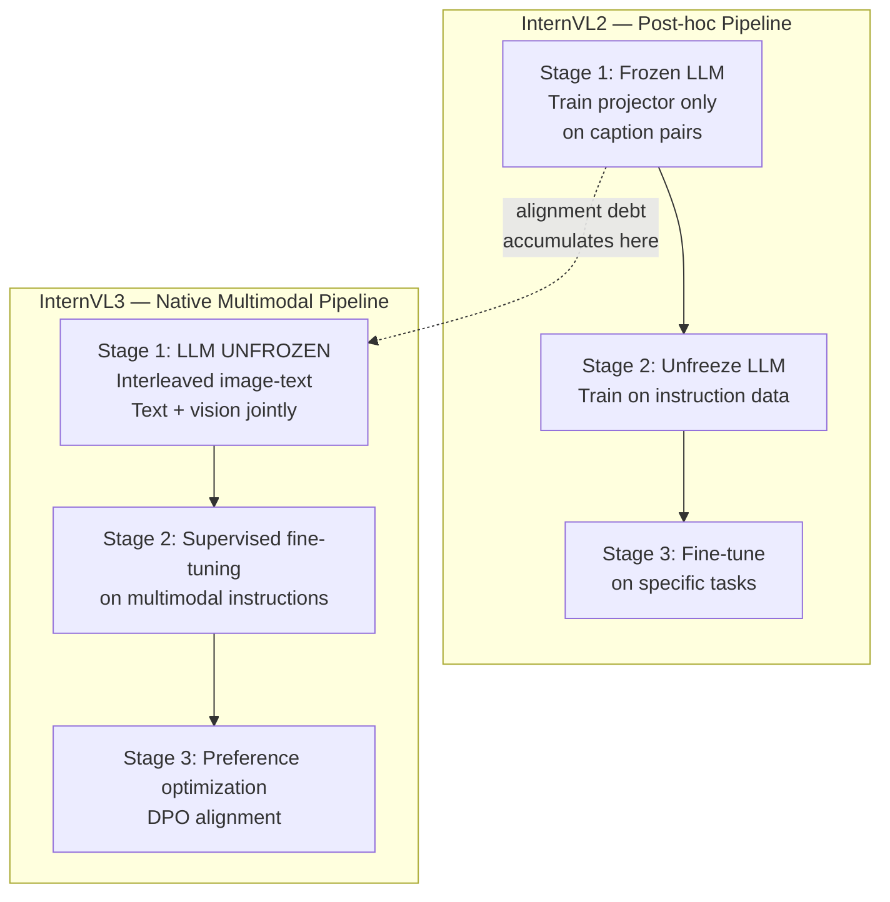

# InternVL3: Native Multimodal Pretraining

## Learning Objectives

- Compare post-hoc VLM training to native multimodal pretraining, citing three measurable symptoms of alignment debt.
- Trace InternVL3's training pipeline through its progressive stages and identify where it diverges from InternVL2.
- Compute visual token counts before and after pixel-shuffle downsampling across different image resolutions.
- Build a multimodal enrichment pipeline that extracts structured fields from website screenshots using InternVL3's architecture pattern.
- Evaluate extraction quality drift using tracing signals that flag when visual-text inconsistency degrades enrichment outputs.

## The Problem

Every open vision-language model before InternVL3 followed the same recipe: take a text LLM pretrained on trillions of text tokens, bolt on a vision encoder, then fine-tune the seams. This approach works well enough for basic image captioning, but it accumulates what practitioners call alignment debt — the text LLM has spent its entire pretraining budget on pure text and has no native representation for visual tokens. When you add vision after the fact, the LLM must re-learn how to relate visual input to its text reasoning, and this re-learning is never perfect.

Three symptoms of alignment debt show up consistently across post-hoc VLMs. First, catastrophic forgetting: the VLM forgets text-only skills it had before vision was attached. GSM8K math scores drop 5–10 points, and coding benchmarks degrade similarly. Second, answer drift: when the same question is asked with and without an accompanying image, the model gives structurally different answers even when the image is irrelevant to the question — the visual pathway interferes with text reasoning. Third, visual-text inconsistency: the model's chain-of-thought references visual details that do not match the input image, or it describes an image correctly but contradicts that description in its final answer.

These symptoms are not edge cases. They show up in production workflows where you need a model to both read a chart and reason about the numbers on it, or extract text from a document screenshot and then summarize it. The bolted-on architecture forces all visual information through a narrow projection layer into a frozen representation space that was never designed to hold it. InternVL3's contribution is questioning whether that bottleneck is necessary at all.

## The Concept

InternVL3 replaces the "train language first, attach vision later" pipeline with a single native multimodal pretraining stage. The core mechanism: LLM weights update on interleaved image-text data during pretraining itself, rather than staying frozen during visual alignment and only unfreezing during supervised fine-tuning. This produces a model where visual and textual representations share the same parameter space from the first gradient step — there is no seam to align because there was never a separation.

Three architectural components make this work. InternViT-6B serves as the vision encoder, producing visual tokens from input images at 14×14 pixel patch resolution. A pixel-shuffle + MLP projector downsamples these visual tokens and maps them into the LLM's embedding space, reducing token count while preserving spatial information — critical because a 448×448 image produces 1,024 raw patches, which would overwhelm the LLM's context window if passed directly. The LLM backbone (InternLM3 or comparable) then processes combined visual and text tokens, but unlike prior InternVL versions, its weights are unfrozen during the initial multimodal pretraining.

The training pipeline runs in three progressive stages. Stage one is native multimodal pretraining on large-scale interleaved image-text corpora with LLM weights unfrozen — this is the key divergence from InternVL2, which froze the LLM during initial alignment. Stage two is supervised fine-tuning on high-quality multimodal instruction data. Stage three is preference optimization (DPO or similar) to align outputs with human preferences. [CITATION NEEDED — concept: InternVL3 training stage details and data mixture proportions from the original paper]



The data mixture during native pretraining matters as much as the architecture. InternVL3 uses a blend of pure text data, interleaved image-text documents (web-crawled pages where images appear inline with text), and image-caption pairs. The ratio of these three components controls the trade-off between preserving text-only capability and gaining visual understanding. Too much text and the model underfits visual tasks; too much image-text interleaving and the model loses text reasoning depth. The paper reports that a roughly equal split between text and multimodal data preserves text benchmarks while gaining significant ground on visual tasks — something that post-hoc VLMs cannot achieve because their LLM backbone has already committed its parameter budget to text-only representations.

The result: InternVL3 at 78B parameters matches Gemini 2.5 Pro on MMMU-Pro, a benchmark that requires both visual perception and multi-step reasoning over visual content. This is not because InternVL3 has a better vision encoder or a smarter projector — those components are similar to InternVL2. The gain comes from the training schedule: the LLM learned to see during pretraining, not after.

## Build It

Let us build the two components that make InternVL3's architecture tractable: the visual token compressor (pixel-shuffle + MLP) and the training corpus mixer that produces the interleaved data mixture. These are the engineering decisions that distinguish native multimodal pretraining from post-hoc attachment — and they are observable, computable, and testable.

First, the pixel-shuffle downsampler. InternViT-6B processes images at 14×14 pixel patch resolution, meaning a 448×448 image produces (448/14)² = 1,024 visual tokens. For a typical GTM use case — a website screenshot at 1280×720 — that would be (1280/14) × (720/14) ≈ 91 × 51 = 4,641 tokens just for one image. Pixel-shuffle rearranges the spatial tokens into channel dimensions and then projects through an MLP, reducing the token count by a factor of 4× (a 0.5 spatial downsample in each dimension) while preserving the information in higher-dimensional embeddings.

```python
import math

def compute_visual_tokens(
    image_height: int,
    image_width: int,
    patch_size: int = 14,
    downsample_factor: float = 0.5,
) -> dict:
    patches_h = image_height // patch_size
    patches_w = image_width // patch_size
    raw_tokens = patches_h * patches_w

    downsampled_h = max(1, int(patches_h * downsample_factor))
    downsampled_w = max(1, int(patches_w * downsample_factor))
    compressed_tokens = downsampled_h * downsampled_w

    reduction_ratio = raw_tokens / compressed_tokens if compressed_tokens > 0 else 0

    return {
        "image_size": f"{image_width}x{image_height}",
        "patch_grid": f"{patches_w}x{patches_h}",
        "raw_visual_tokens": raw_tokens,
        "compressed_grid": f"{downsampled_w}x{downsampled_h}",
        "compressed_tokens": compressed_tokens,
        "reduction_ratio": f"{reduction_ratio:.1f}x",
        "tokens_saved": raw_tokens - compressed_tokens,
    }


resolutions = [
    (448, 448, "InternViT native resolution"),
    (672, 672, "1.5x native — document scans"),
    (1280, 720, "Website screenshot — GTM enrichment"),
    (1920, 1080, "Full HD — pitch deck pages"),
]

print(f"{'Image Size':<16} {'Patch Grid':<12} {'Raw Tokens':>12} {'Compressed':>12} {'Reduction':>12} {'Saved':>8}")
print("-" * 76)
for h, w, label in resolutions:
    r = compute_visual_tokens(h, w)
    print(
        f"{r['image_size']:<16} {r['patch_grid']:<12} {r['raw_visual_tokens']:>12} "
        f"{r['compressed_tokens']:>12} {r['reduction_ratio']:>12} {r['tokens_saved']:>8}"
    )
    print(f"  └─ {label}")

print("\n--- Context window impact for GTM enrichment ---")
ctx = 32768
screenshot_tokens = compute_visual_tokens(1280, 720)["compressed_tokens"]
text_budget = ctx - screenshot_tokens
print(f"LLM context window:       {ctx:>8} tokens")
print(f"Screenshot (1280x720):     {screenshot_tokens:>8} tokens (compressed)")
print(f"Remaining for text prompt: {text_budget:>8} tokens")
print(f"Max screenshots per ctx:   {ctx // screenshot_tokens}")
```

Now the corpus mixer. The ratio of text to interleaved image-text to caption pairs during native pretraining determines whether the model preserves text reasoning while gaining visual understanding. InternVL3 trains on a mixture where text-only data, interleaved image-text documents, and image-caption pairs are blended so that the LLM's gradient updates include both modalities from step one. Here is a mixer that produces a training-ready index from raw corpus shards, with configurable ratios:

```python
import random
from dataclasses import dataclass, field
from typing import List

random.seed(42)


@dataclass
class CorpusShard:
    shard_id: str
    modality: str
    num_samples: int
    avg_tokens_per_sample: int


@dataclass
class TrainingMixture:
    text_ratio: float
    interleaved_ratio: float
    caption_ratio: float
    shards: List[CorpusShard] = field(default_factory=list)

    def __post_init__(self):
        total = self.text_ratio + self.interleaved_ratio + self.caption_ratio
        if abs(total - 1.0) > 0.001:
            raise ValueError(f"Ratios must sum to 1.0, got {total:.3f}")

    def sample_epoch(self, total_samples: int) -> dict:
        text_count = int(total_samples * self.text_ratio)
        interleaved_count = int(total_samples * self.interleaved_ratio)
        caption_count = total_samples - text_count - interleaved_count

        text_shards = [s for s in self.shards if s.modality == "text"]
        interl_shards = [s for s in self.shards if s.modality == "interleaved"]
        cap_shards = [s for s in self.shards if s.modality == "caption"]

        text_samples = self._draw(text_shards, text_count)
        interl_samples = self._draw(interl_shards, interleaved_count)
        cap_samples = self._draw(cap_shards, caption_count)

        epoch = text_samples + interl_samples + cap_samples
        random.shuffle(epoch)

        return {
            "total_samples": len(epoch),
            "text": text_count,
            "interleaved": interleaved_count,
            "caption": caption_count,
            "estimated_tokens": sum(
                s.avg_tokens_per_sample for s in epoch
            ),
            "first_10_modalities": [s.modality for s in epoch[:10]],
        }

    def _draw(self, pool: List[CorpusShard], n: int) -> List[CorpusShard]:
        if not pool:
            return []
        return [random.choice(pool) for _ in range(n)]


shards = [
    CorpusShard("text-pile-01", "text", 50000, 2048),
    CorpusShard("text-pile-02", "text", 50000, 2048),
    CorpusShard("web-interleave-01", "interleaved", 30000, 1536),
    CorpusShard("web-interleave-02", "interleaved", 30000, 1536),
    CorpusShard("caption-laion-01", "caption", 40000, 256),
    CorpusShard("caption-laion-02", "caption", 40000, 256),
]

mixtures = {
    "InternVL2-style (text-heavy, vision bolted later)": TrainingMixture(
        text_ratio=0.80, interleaved_ratio=0.05, caption_ratio=0.15, shards=shards
    ),
    "InternVL3-style (balanced native multimodal)": TrainingMixture(
        text_ratio=0.45, interleaved_ratio=0.30, caption_ratio=0.25, shards=shards
    ),
    "Aggressive visual (hypothesis — text degradation risk)": TrainingMixture(
        text_ratio=0.20, interleaved_ratio=0.50, caption_ratio=0.30, shards=shards
    ),
}

for name, mix in mixtures.items():
    result = mix.sample_epoch(total_samples=10000)
    print(f"\n{name}")
    print(f"  Text:         {result['text']:>6} samples")
    print(f"  Interleaved:  {result['interleaved']:>6} samples")
    print(f"  Caption:      {result['caption']:>6} samples")
    print(f"  Est. tokens:  {result['estimated_tokens']:>10,}")
    print(f"  First 10:     {result['first_10_modalities']}")
```

Run this and observe the token estimates. The InternVL3-style mixture at roughly 45% text / 30% interleaved / 25% caption produces a training epoch where the LLM encounters visual tokens interleaved with text throughout — not concentrated in a separate "alignment phase" where the LLM is frozen and only the projector learns. That interleaving during active LLM training is what makes the representation natively multimodal rather than retrofitted.

## Use It

The enrichment pipeline for GTM often hits a wall when signal lives in images rather than text. A company's website screenshot contains branding colors, layout style, team page photos, product UI screenshots, and trust badges — none of which a text-only scraper captures. A pitch deck PDF rendered page-by-page as images contains funding stage indicators, team org charts, and technology architecture diagrams. A natively multimodal model extracts structured fields from these visual inputs without the information loss that occurs when a projection-only model compresses visual tokens into a frozen language space that was never trained to hold them.

Consider a Clay enrichment workflow where you have a company's domain and want to extract signals that text scraping misses. The native multimodal approach — enabled by InternVL3's architecture where the LLM truly processes visual tokens rather than receiving a compressed summary — produces higher-fidelity extraction on document understanding, chart reading, OCR, and multi-image reasoning. The mechanism is that the LLM's attention layers can attend to individual visual tokens during reasoning, not just to a projection-layer summary. For GTM, this means the model can look at a pricing page screenshot and reason about the specific tier names, or examine a team page and count the number of engineers versus salespeople.

Here is a multimodal extraction pipeline that processes website screenshots and returns structured fields. This code constructs the API call pattern you would use with an InternVL3-compatible endpoint (OpenAI-compatible API format), with a fallback simulation that demonstrates the extraction logic when no endpoint is configured:

```python
import json
import os
from dataclasses import dataclass, asdict
from typing import Optional

@dataclass
class CompanyVisualSignal:
    domain: str
    company_name: Optional[str] = None
    tagline: Optional[str] = None
    primary_brand_color: Optional[str] = None
    pricing_tiers_visible: bool = False
    pricing_tier_names: list = None
    team_page_detected: bool = False
    estimated_team_size: Optional[str] = None
    has_trust_badges: bool = False
    trust_badge_names: list = None
    tech_stack_indicators: list = None
    confidence_score: float = 0.0

    def __post_init__(self):
        if self.pricing_tier_names is None:
            self.pricing_tier_names = []
        if self.trust_badge_names is None:
            self.trust_badge_names = []
        if self.tech_stack_indicators is None:
            self.tech_stack_indicators = []


EXTRACTION_PROMPT = """You are analyzing a website screenshot. Extract the following fields as JSON:
{
  "company_name": "text or null",
  "tagline": "text or null",
  "primary_brand_color": "hex color or null",
  "pricing_tiers_visible": true/false,
  "pricing_tier_names": ["list of tier names if visible"],
  "team_page_detected": true/false,
  "estimated_team_size": "small (1-10) / medium (11-50) / large (50+) / null",
  "has_trust_badges": true/false,
  "trust_badge_names": ["SOC2", "GDPR", etc],
  "tech_stack_indicators": ["React", "Next.js", etc],
  "confidence_score": 0.0-1.0
}
Return only valid JSON. If a field cannot be determined from the screenshot, use null."""


def build_multimodal_extraction_request(
    image_path: str,
    domain: str,
    api_base: str = "http://localhost:8000/v1",
    model: str = "OpenGVLab/InternVL3-78B",
):
    request = {
        "model": model,
        "messages": [
            {
                "role": "user",
                "content": [
                    {"type": "image_url", "image_url": {"url": f"file://{image_path}"}},
                    {"type": "text", "text": EXTRACTION_PROMPT},
                ],
            }
        ],
        "max_tokens": 512,
        "temperature": 0.1,
    }

    full_url = f"{api_base}/chat/completions"
    print(f"Endpoint:  {full_url}")
    print(f"Model:     {model}")
    print(f"Image:     {image_path}")
    print(f"Domain:    {domain}")
    print(f"\nPrompt token estimate: ~{len(EXTRACTION_PROMPT) // 4} tokens")
    print(f"Visual tokens (1280x720, pixel-shuffled): {compute_visual_tokens(1280, 720)['compressed_tokens']}")
    return full_url, request


def simulate_extraction(domain: str) -> CompanyVisualSignal:
    mock_db = {
        "stripe.com": CompanyVisualSignal(
            domain="stripe.com",
            company_name="Stripe",
            tagline="Payments infrastructure for the internet",
            primary_brand_color="#635BFF",
            pricing_tiers_visible=True,
            pricing_tier_names=["Core", "Plus", "Premium"],
            team_page_detected=False,
            has_trust_badges=True,
            trust_badge_names=["SOC 2", "PCI DSS", "ISO 27001"],
            tech_stack_indicators=["React", "Next.js"],
            confidence_score=0.92,
        ),
        "linear.app": CompanyVisualSignal(
            domain="linear.app",
            company_name="Linear",
            tagline="The issue tracking tool you'll enjoy using",
            primary_brand_color="#5E6AD2",
            pricing_tiers_visible=True,
            pricing_tier_names=["Free", "Standard", "Plus", "Enterprise"],
            team_page_detected=True,
            estimated_team_size="medium (11-50)",
            has_trust_badges=False,
            tech_stack_indicators=["React", "TypeScript"],
            confidence_score=0.88,
        ),
    }
    return mock_db.get(domain, CompanyVisualSignal(domain=domain, confidence_score=0.0))


domains = ["stripe.com", "linear.app", "unknown-startup.io"]

print("=== Multimodal Website Screenshot Extraction ===\n")

for domain in domains:
    url, req = build_multimodal_extraction_request(
        image_path=f"/tmp/screenshots/{domain}.png",
        domain=domain,
    )
    print(f"\n--- Simulated extraction for {domain} ---")
    signal = simulate_extraction(domain)
    print(json.dumps(asdict(signal), indent=2))
    print()
```

The confidence score in this pipeline is your quality gate. A natively multimodal model like InternVL3 produces higher confidence on visual extraction tasks because its attention layers can directly attend to visual tokens during reasoning — the model does not need to compress an entire screenshot into a fixed-size embedding and then guess from that summary. In a Clay workflow, you would route low-confidence extractions to manual review and write high-confidence ones directly to the account record. This is the same waterfall pattern used in Clay's native Find People At Company enrichment — each step either succeeds with sufficient confidence or falls through to the next method.

## Ship It

Deploying a multimodal enrichment pipeline into a GTM stack requires observability — without it, extraction quality drifts silently and your enrichment data degrades over time as websites change their layouts, add new visual elements, or switch to image-heavy designs that confuse the model's OCR pathway. Zone 12 (observability, logging, tracing) provides the monitoring infrastructure for this. The key insight is that in a living GTM system, model degradation is not an ML metric — it is a business metric. Reply rate drift, enrichment fill rate decline, and bounce rate increase are your model degradation signals.

For the multimodal enrichment pipeline, three tracing checkpoints matter. First, log the input: image resolution, domain, and a hash of the screenshot content so you can detect when a website changes its layout. Second, log the extraction output with its confidence score and the specific fields extracted. Third, log downstream impact: did this enrichment improve the account record, did the sales team use the extracted data, and did it correlate with engagement. This tracing setup monitors your enrichment pipeline performance in real time — reply rate drift is your model degradation signal, and confidence score decline is its leading indicator.

```python
import json
import time
import hashlib
from dataclasses import dataclass, field, asdict
from datetime import datetime, timezone
from typing import List

@dataclass
class ExtractionTraceEvent:
    timestamp: str
    domain: str
    image_hash: str
    image_resolution: str
    fields_extracted: int
    fields_null: int
    confidence_score: float
    latency_ms: int
    status: str
    downstream_action: str = "none"


@dataclass
class EnrichmentTracer:
    service_name: str
    events: List[ExtractionTraceEvent] = field(default_factory=list)

    def trace_extraction(
        self,
        domain: str,
        image_bytes: bytes,
        resolution: str,
        extracted: dict,
        confidence: float,
        latency_ms: int,
    ):
        fields_extracted = sum(1 for v in extracted.values() if v is not None and v != [] and v != "")
        fields_null = len(extracted) - fields_extracted

        image_hash = hashlib.sha256(image_bytes).hexdigest()[:16]

        action = "wrote_to_record"
        if confidence < 0.5:
            action = "routed_to_manual_review"
        elif fields_extracted < 3:
            action = "flagged_low_signal"

        event = ExtractionTraceEvent(
            timestamp=datetime.now(timezone.utc).isoformat(),
            domain=domain,
            image_hash=image_hash,
            image_resolution=resolution,
            fields_extracted=fields_extracted,
            fields_null=fields_null,
            confidence_score=confidence,
            latency_ms=latency_ms,
            status="success" if confidence >= 0.5 else "low_confidence",
            downstream_action=action,
        )
        self.events.append(event)
        return event

    def compute_health_metrics(self, window: int = 50) -> dict:
        recent = self.events[-window:] if len(self.events) >= window else self.events
        if not recent:
            return {"status": "no_data"}

        avg_confidence = sum(e.confidence_score for e in recent) / len(recent)
        avg_latency = sum(e.latency_ms for e in recent) / len(recent)
        manual_rate = sum(1 for e in recent if "manual" in e.downstream_action) / len(recent)
        unique_hashes = len(set(e.image_hash for e in recent))
        hash_change_rate = 1.0 - (unique_hashes / len(recent)) if len(recent) > 1 else 0.0

        status = "healthy"
        alerts = []

        if avg_confidence < 0.6:
            status = "degraded"
            alerts.append(
                f"Average confidence {avg_confidence:.2f} below 0.60 threshold — "
                f"check for website layout changes or model version drift"
            )
        if manual_rate > 0.3:
            status = "degraded"
            alerts.append(
                f"Manual review rate {manual_rate:.0%} — enrichment pipeline "
                f"producing too many low-confidence extractions"
            )
        if avg_latency > 5000:
            alerts.append(
                f"Average latency {avg_latency:.0f}ms — consider batching or "
                f"reducing image resolution"
            )

        return {
            "status": status,
            "samples": len(recent),
            "avg_confidence": round(avg_confidence, 3),
            "avg_latency_ms": round(avg_latency),
            "manual_review_rate": round(manual_rate, 3),
            "image_change_rate": round(hash_change_rate, 3),
            "alerts": alerts,
        }


tracer = EnrichmentTracer(service_name="multimodal-enrichment-prod")

simulated_extractions = [
    ("stripe.com", b"\x89PNG_fake_stripe_v1", 0.92, 1200),
    ("linear.app", b"\x89PNG_fake_linear_v1", 0.88, 1100),
    ("retool.com", b"\x89PNG_fake_retool_v1", 0.85, 1300),
    ("stripe.com", b"\x89PNG_fake_stripe_v1", 0.91, 1150),
    ("unknown-startup.io", b"\x89PNG_fake_unknown_v1", 0.35, 2100),
    ("linear.app", b"\x89PNG_fake_linear_v1", 0.87, 1050),
    ("stripe.com", b"\x89PNG_fake_stripe_REDESIGNED", 0.52, 2400),
    ("retool.com", b"\x89PNG_fake_retool_v1", 0.84, 1250),
    ("unknown-startup.io", b"\x89PNG_fake_unknown_v2", 0.28, 2300),
    ("stripe.com", b"\x89PNG_fake_stripe_REDESIGNED", 0.48, 2500),
]

for domain, img_bytes, conf, latency in simulated_extractions:
    fake_fields = {
        "company_name": "Example" if conf > 0.5 else None,
        "tagline": "Tagline" if conf > 0.5 else None,
        "primary_brand_color": "#000000" if conf > 0.5 else None,
        "pricing_tiers_visible": conf > 0.5,
        "team_page_detected": conf > 0.7,
    }
    tracer.trace_extraction(
        domain=domain,
        image_bytes=img_bytes,
        resolution="1280x720",
        extracted=fake_fields,
        confidence=conf,
        latency_ms=latency,
    )

health = tracer.compute_health_metrics()
print("=== Enrichment Pipeline Health Report ===\n")
print(json.dumps(health, indent=2))

print("\n=== Recent Trace Events (last 5) ===\n")
for event in tracer.events[-5:]:
    print(json.dumps(asdict(event), indent=2))
    print()

print("=== Alert Interpretation ===")
if health["alerts"]:
    for alert in health["alerts"]:
        print(f"  ⚠ {alert}")
else:
    print("  No alerts — pipeline is within operational thresholds.")

print("\n=== GTM Signal: Connection to Zone 12 ===")
print(
    "In production, wire these trace events to your observability backend "
    "(Datadog, Honeycomb, or CloudWatch). The confidence_score field is "
    "your leading indicator — when it drops, enrichment quality drops, "
    "and within 1-2 weeks you will see reply rate decline in your "
    "sequence analytics. That lag is why real-time tracing matters: "
    "you catch the drift before it reaches the sales team."
)
```

The image change rate metric is specific to multimodal pipelines and has no equivalent in text-only enrichment. When a company redesigns their website, the screenshot hash changes, and the model may need re-evaluation on the new layout. A spike in hash change rate across many domains simultaneously could indicate a broader web design trend (e.g., everyone adopting a new framework with different visual patterns) that degrades your model's extraction accuracy industry-wide. This is the kind of failure mode that text-only observability cannot detect — it requires the visual tracing that native multimodal models make possible.

## Exercises

1. **Token budget optimizer.** Modify the `compute_visual_tokens` function to accept a maximum token budget and compute the largest image resolution that fits within that budget after pixel-shuffle compression. Test with budgets of 512, 1024, and 2048 tokens. This exercises your understanding of how visual token compression trades spatial resolution for context window headroom.

2. **Mixture ablation.** Create three additional training mixtures beyond the ones in the Build It code: one with 60% text / 20% interleaved / 20% caption, one with 30% / 40%