# Chameleon and Early-Fusion Token-Only Multimodal Models

## Learning Objectives

- Build a toy discrete image tokenizer (VQ codebook lookup) that converts image patches into integer tokens from a shared vocabulary.
- Trace a multimodal sequence through an early-fusion pipeline and verify that attention treats text and image tokens identically.
- Implement a sentinel-based token interleaver that merges text and image token streams into a single sequence.
- Compare early-fusion (Chameleon) and late-fusion (LLaVA/BLIP-2) architectures by their data flow, loss function, and generation capabilities.
- Evaluate when early fusion is the right architectural choice for a given multimodal task, given its trade-offs in representational quality.

## The Problem

Every VLM you have built so far keeps images and text on separate tracks. A text token goes through an embedding lookup; an image goes through a vision encoder, then a projector, then enters the LLM as pseudo-tokens. The two vocabularies never overlap. The model has two input paths that merge somewhere in the middle — sometimes at layer 0 via concatenation, sometimes deeper via cross-attention, but always as a union of two separate representations.

Three consequences fall out of this design. First, the LLM can consume images but cannot emit them — output is text-only because the output head maps to the text vocabulary only. Second, mixed-modality documents (an article with paragraphs and inline images, a product page with descriptions and photos) are awkward to generate. You either orchestrate multiple generation calls with a text model and an image model and stitch the outputs, or you give up on interleaved generation entirely. Third, visual pseudo-tokens and text tokens occupy different regions of the hidden space, creating alignment friction that projector layers must continuously compensate for during inference.

Chameleon (Meta, May 2024) asks a question that dissolves all three problems at once: what if there were no separate vocabularies? What if text and images were both sequences of integers drawn from the same token set, processed by the same transformer layers from position zero?

## The Concept

Early fusion means one tokenizer maps all modalities into one discrete token set, and one transformer processes the mixed sequence natively. There is no vision encoder bolted to an LLM. There is no projector. There is one vocabulary, one embedding table, one stack of attention layers, one output head, and one autoregressive next-token loss applied uniformly across every position in the sequence — whether that position holds a text token or an image token.

The mechanism that makes this possible is a discrete image tokenizer. Chameleon uses a VQ-VAE (vector quantized variational autoencoder) variant — specifically, it builds on the architecture used in Make-A-Scene and subsequent image tokenization work. The VQ-VAE's encoder takes an image and produces a grid of continuous feature vectors. Each vector is then quantized: replaced by its nearest neighbor in a learned codebook of discrete entries. The index of that nearest neighbor becomes the token. A 512×512 image might produce a 32×32 grid of 1024 tokens, each an integer pointing into the shared vocabulary. Text tokens occupy the lower indices (e.g., 0–31,999 for BPE text tokens); image tokens occupy the upper indices (e.g., 32,000–64,823 for the 1,024 codebook entries replicated across spatial positions).

Late fusion — the CLIP, LLaVA, GPT-4V pattern — keeps separate encoders for each modality and projects their embeddings into a shared space at or near inference time. The vision encoder (typically a frozen CLIP ViT) is pretrained on hundreds of millions of image-text pairs and produces rich, semantically meaningful representations. The projector maps these into the LLM's hidden space. The advantage: you inherit the representational quality of a well-trained vision encoder without retraining it. The disadvantage: the LLM's output head still maps to text tokens only, so image generation requires a separate model.

```mermaid
flowchart TD
    subgraph LF["Late Fusion (LLaVA / BLIP-2 / GPT-4V)"]
        LF_T["Raw Text"] --> LF_BPE["BPE Tokenizer"]
        LF_BPE --> LF_TE["Text Embeddings"]
        LF_IMG["Raw Image"] --> LF_VIT["Vision Encoder\n(frozen CLIP ViT)"]
        LF_VIT --> LF_PROJ["Projector / Q-Former"]
        LF_PROJ --> LF_MERGE["Concatenate\nat LLM input"]
        LF_TE --> LF_MERGE
        LF_MERGE --> LF_LLM["Decoder-only Transformer"]
        LF_LLM --> LF_OUT["Text Output Only"]
    end

    subgraph EF["Early Fusion (Chameleon)"]
        EF_T["Raw Text"] --> EF_BPE["BPE Tokenizer"]
        EF_IMG["Raw Image"] --> EF_VQ["Discrete Image Tokenizer\n(VQ-VAE codebook lookup)"]
        EF_BPE --> EF_VOC["Shared Vocabulary\n(text IDs: 0–31999\nimage IDs: 32000–64823)"]
        EF_VQ --> EF_VOC
        EF_VOC --> EF_INTER["Interleave with\nsentinel tokens"]
        EF_INTER --> EF_TX["Single Transformer\n(causal attention\nover all tokens)"]
        EF_TX --> EF_DETEX["Text Detokenizer"]
        EF_TX --> EF_DETIMG["Image Detokenizer\n(VQ-VAE decoder)"]
    end
```



The transformer never knows which tokens are text and which are image. Attention operates uniformly — every token attends to every previous token via the same QKV projections. The causal mask is identical. The residual stream is shared. The loss is the same cross-entropy next-token prediction applied at every position. This is what "early" means in early fusion: the modalities merge at the very first layer (the embedding lookup), not at layer 12 or layer 20.

The trade-off is real. By replacing a frozen CLIP ViT with a learned discrete tokenizer, Chameleon sacrifices the representational quality that comes from training on hundreds of millions of image-text pairs with a contrastive objective. The VQ-VAE codebook is trained on image reconstruction, not on semantic alignment with text. This means that for pure image understanding tasks (e.g., "describe this image"), late-fusion models with CLIP encoders often outperform Chameleon at the same parameter count. Early fusion wins when the task requires interleaved multimodal generation — producing text and images in a single autoregressive pass — because the architecture makes it structurally natural rather than an external orchestration problem.

Chameleon's training also required several stability modifications to the transformer architecture. The team found that standard transformer recipes destabilized when training on mixed token sequences at scale. They introduced QK-Norm (normalizing query and key vectors before the dot-product attention), revised dropout placement, and adjusted LayerNorm ordering relative to attention and feedforward blocks. These are not cosmetic changes — without them, training diverged.

## Build It

Let's build the core mechanism: a discrete image tokenizer using a VQ codebook, a text tokenizer (simplified BPE), a sentinel-based interleaver, and a mock transformer that processes the unified sequence. Every component is runnable and produces observable output.

```python
import random
import math

random.seed(42)

TEXT_VOCAB_SIZE = 32000
IMAGE_CODEBOOK_SIZE = 1024
IMAGE_GRID_SIZE = 8

IMAGE_VOCAB_START = TEXT_VOCAB_SIZE
IMAGE_VOCAB_END = TEXT_VOCAB_SIZE + IMAGE_CODEBOOK_SIZE

SENTINEL_IMAGE_START = TEXT_VOCAB_SIZE + IMAGE_CODEBOOK_SIZE
SENTINEL_IMAGE_END = TEXT_VOCAB_SIZE + IMAGE_CODEBOOK_SIZE + 1

TOTAL_VOCAB_SIZE = SENTINEL_IMAGE_END + 1

SIMPLE_TEXT_VOCAB = {
    "<pad>": 0,
    "<sos>": 1,
    "<eos>": 2,
    "product": 101,
    "description": 102,
    "buy": 103,
    "now": 104,
    "this": 105,
    "is": 106,
    "a": 107,
    "photo": 108,
    "of": 109,
    "our": 110,
    "new": 111,
    "shoe": 112,
}

for word, idx in list(SIMPLE_TEXT_VOCAB.items()):
    if idx < TEXT_VOCAB_SIZE:
        pass


def text_to_tokens(text):
    words = text.lower().strip().split()
    token_ids = [SIMPLE_TEXT_VOCAB["<sos>"]]
    for w in words:
        if w in SIMPLE_TEXT_VOCAB:
            token_ids.append(SIMPLE_TEXT_VOCAB[w])
        else:
            token_ids.append(hash(w) % (TEXT_VOCAB_SIZE - 200) + 200)
    token_ids.append(SIMPLE_TEXT_VOCAB["<eos>"])
    return token_ids


codebook = []
for i in range(IMAGE_CODEBOOK_SIZE):
    vec = [random.gauss(0, 1) for _ in range(16)]
    norm = math.sqrt(sum(x * x for x in vec))
    codebook.append([x / norm for x in vec])


def make_fake_image(patches):
    while len(patches) < IMAGE_GRID_SIZE * IMAGE_GRID_SIZE:
        patches.append([random.gauss(0, 1) for _ in range(16)])
    return patches[:IMAGE_GRID_SIZE * IMAGE_GRID_SIZE]


def quantize_patch(patch_vec):
    best_idx = 0
    best_dist = float("inf")
    for i, cb_vec in enumerate(codebook):
        dist = sum((a - b) ** 2 for a, b in zip(patch_vec, cb_vec))
        if dist < best_dist:
            best_dist = dist
            best_idx = i
    return best_idx


def image_to_tokens(image_patches):
    token_ids = []
    for patch in image_patches:
        cb_idx = quantize_patch(patch)
        token_ids.append(IMAGE_VOCAB_START + cb_idx)
    return token_ids


def interleave(text_tokens, image_tokens):
    sequence = list(text_tokens)
    sequence.append(SENTINEL_IMAGE_START)
    sequence.extend(image_tokens)
    sequence.append(SENTINEL_IMAGE_END)
    return sequence


def categorize_token(token_id):
    if token_id < TEXT_VOCAB_SIZE:
        return "TEXT"
    elif token_id < IMAGE_VOCAB_END:
        return "IMAGE"
    elif token_id == SENTINEL_IMAGE_START:
        return "SENTINEL_IMG_START"
    elif token_id == SENTINEL_IMAGE_END:
        return "SENTINEL_IMG_END"
    return "UNKNOWN"


def mock_attention(sequence):
    print(f"\nSequence length: {len(sequence)} tokens")
    print(f"Vocabulary size: {TOTAL_VOCAB_SIZE}")
    print(f"\n{'Position':<10} {'Token ID':<12} {'Type':<20}")
    print("-" * 42)
    for pos, tok in enumerate(sequence):
        cat = categorize_token(tok)
        print(f"{pos:<10} {tok:<12} {cat:<20}")
    print(f"\nAttention matrix shape: {len(sequence)} x {len(sequence)}")
    print("Every token attends to every previous token.")
    print("No modality-specific routing. No separate QKV heads.")
    text_count = sum(1 for t in sequence if categorize_token(t) == "TEXT")
    image_count = sum(1 for t in sequence if categorize_token(t) == "IMAGE")
    sentinel_count = sum(1 for t in sequence if "SENTINEL" in categorize_token(t))
    print(f"\nBreakdown: {text_count} text, {image_count} image, {sentinel_count} sentinel")


text = "this is a photo of our new shoe"
text_tokens = text_to_tokens(text)

fake_patches = make_fake_image([random.gauss(0, 1) for _ in range(16)])
image_tokens = image_to_tokens(fake_patches)

full_sequence = interleave(text_tokens, image_tokens)

print("=== TEXT TOKENS ===")
print(text_tokens)
print("\n=== IMAGE TOKENS (first 10 of 64) ===")
print(image_tokens[:10], "...")

print("\n=== INTERLEAVED SEQUENCE ===")
print(full_sequence[:10], "...", full_sequence[-5:])

mock_attention(full_sequence)
```

Run this and observe the output. Every token — whether it came from a BPE split of English text or a VQ codebook lookup of an image patch — enters the same sequence at a distinct position. The mock attention summary confirms there is no branching, no modality-specific pathway, and no separate encoder. The only thing distinguishing a text token from an image token is its integer value falling in a different range of the shared vocabulary.

Now let's trace the generation side. In an early-fusion model, the output head predicts over the full vocabulary (text + image + sentinels). When the model emits a token in the image range, it is "generating an image." When it emits a sentinel, it signals a modality switch.

```python
import random

random.seed(99)

TEXT_WORDS = {v: k for k, v in SIMPLE_TEXT_VOCAB.items()}


def decode_text_token(token_id):
    if token_id in TEXT_WORDS:
        return TEXT_WORDS[token_id]
    return f"<unk:{token_id}>"


def decode_image_token(token_id):
    if IMAGE_VOCAB_START <= token_id < IMAGE_VOCAB_END:
        codebook_idx = token_id - IMAGE_VOCAB_START
        return f"[IMG_PATCH cb={codebook_idx}]"
    return "?"


def generate_sequence(prompt_tokens, max_new_tokens=80):
    sequence = list(prompt_tokens)
    generation_log = []

    for step in range(max_new_tokens):
        r = random.random()

        if r < 0.35:
            token_id = random.choice(list(SIMPLE_TEXT_VOCAB.values()))
        elif r < 0.65:
            token_id = IMAGE_VOCAB_START + random.randint(0, IMAGE_CODEBOOK_SIZE - 1)
        elif r < 0.70:
            token_id = SENTINEL_IMAGE_START
        elif r < 0.75:
            token_id = SENTINEL_IMAGE_END
        else:
            token_id = SIMPLE_TEXT_VOCAB.get("buy", 103)

        sequence.append(token_id)
        cat = categorize_token(token_id)
        generation_log.append((step, token_id, cat))

        if len(sequence) > 5 and sequence[-1] == SIMPLE_TEXT_VOCAB.get("<eos>", 2):
            break

    return sequence, generation_log


def decode_sequence(sequence):
    output_parts = []
    current_mode = "TEXT"
    current_buffer = []

    for tok in sequence:
        cat = categorize_token(tok)

        if cat == "SENTINEL_IMG_START":
            if current_mode == "TEXT" and current_buffer:
                text_str = " ".join(decode_text_token(t) for t in current_buffer)
                output_parts.append(("TEXT", text_str))
            current_mode = "IMAGE"
            current_buffer = []
        elif cat == "SENTINEL_IMG_END":
            if current_mode == "IMAGE" and current_buffer:
                patches = [t - IMAGE_VOCAB_START for t in current_buffer]
                grid_dim = int(math.sqrt(len(patches))) if patches else 0
                output_parts.append(("IMAGE", f"{len(patches)} patches, {grid_dim}x{grid_dim} grid"))
            current_mode = "TEXT"
            current_buffer = []
        elif cat == "TEXT":
            current_buffer.append(tok)
        elif cat == "IMAGE":
            current_buffer.append(tok)

    if current_buffer:
        if current_mode == "TEXT":
            text_str = " ".join(decode_text_token(t) for t in current_buffer)
            output_parts.append(("TEXT", text_str))
        else:
            patches = [t - IMAGE_VOCAB_START for t in current_buffer]
            output_parts.append(("IMAGE", f"{len(patches)} patches"))

    return output_parts


prompt = "this is a photo of our new shoe"
prompt_tokens = text_to_tokens(prompt)
generated, log = generate_sequence(prompt_tokens, max_new_tokens=50)

print("=== GENERATION LOG (first 20 steps) ===")
for step, tok, cat in log[:20]:
    print(f"  step {step:3d}  token={tok:<8}  type={cat}")

print("\n=== DECODED OUTPUT ===")
decoded = decode_sequence(generated)
for modality, content in decoded:
    print(f"  [{modality}] {content}")

print(f"\nTotal output segments: {len(decoded)}")
text_segments = sum(1 for m, _ in decoded if m == "TEXT")
image_segments = sum(1 for m, _ in decoded if m == "IMAGE")
print(f"  Text segments: {text_segments}")
print(f"  Image segments: {image_segments}")
print(f"\nThis interleaving happened in ONE generation pass.")
print(f"No external orchestration. No separate image API call.")
```

This is the structural advantage of early fusion in miniature. A single autoregressive pass produced interleaved text and image segments because the output head predicts over a unified vocabulary. The sentinel tokens act as modality boundaries — the decoder reads them to know when to route tokens to the text detokenizer versus the image detokenizer (VQ-VAE decoder that reconstructs pixels from codebook indices).

## Use It

Sentinel-based token interleaving — the mechanism that lets Chameleon route mixed text and image tokens through one transformer with boundary markers — maps directly to Zone 12 (living observability). A GTM engineer faces the same architectural decision Chameleon solved: do you instrument each tool's dashboard separately and correlate manually (late fusion), or do you stream every event into one vocabulary with sentinel boundaries (early fusion)? The early-fusion approach wins for the same reason: drift detection happens in one stream, not across N tabs.

```python
import random
random.seed(42)

EVENT_VOCAB = {
    "EMAIL_SENT": "signal", "EMAIL_OPENED": "signal",
    "REPLY_RECEIVED": "signal", "CRM_UPDATED": "action",
    "SEQ_START": "sentinel", "SEQ_END": "sentinel",
}

def trace_journey(contact_id, steps):
    seq = [("SEQ_START", "sentinel", contact_id)]
    for s in steps:
        seq.append((s, EVENT_VOCAB.get(s, "unknown"), contact_id))
    seq.append(("SEQ_END", "sentinel", contact_id))
    return seq

actions = ["EMAIL_SENT", "EMAIL_OPENED", "REPLY_RECEIVED", "CRM_UPDATED"]
journeys = [trace_journey(c, random.choices(actions, k=random.randint(3, 7)))
            for c in range(1001, 1021)]

sent = replies = 0
for j in journeys:
    inner = [(e, t) for e, t, _ in j if t != "sentinel"]
    sent += sum(1 for e, _ in inner if e == "EMAIL_SENT")
    replies += sum(1 for e, _ in inner if e == "REPLY_RECEIVED")

rate = replies / sent if sent else 0
drift = rate - 0.05
print(f"Unified stream: {len(journeys)} sentinel-bracketed journeys")
print(f"Reply rate: {rate:.1%}  |  Drift vs 5% baseline: {drift:+.1%}")
print("ALERT: investigate sequence health" if abs(drift) > 0.05
      else "Metrics within nominal range")
```

The `SEQ_START` and `SEQ_END` events are sentinels — identical in function to Chameleon's `<image-start>` and `<image-end>`. They bracket a segment so the parser can extract inner events, compute metrics, and flag drift without querying each tool's API. The event vocabulary is the shared token set. The drift check is the output head deciding whether the current distribution looks healthy.

[CITATION NEEDED — concept: Chameleon production API availability and pricing for GTM content generation workflows]

## Exercises

**Easy / Medium:** The `interleave` function currently appends one image block after all text tokens. Rewrite it to accept a list of `(position, image_tokens)` pairs so you can insert multiple image blocks at arbitrary positions within the text — for example: text → `[IMG_START]` image `[IMG_END]` → text → `[IMG_START]` image `[IMG_END]` → text. Then write a `validate_sentinels(sequence)` function that asserts every `SENTINEL_IMAGE_START` has a matching `SENTINEL_IMAGE_END`, that image tokens (IDs in the image range) only appear between sentinel pairs, and that sentinels are properly nested (no interleaving of start/end across blocks). Run it against three test sequences: one valid, one with an unclosed sentinel, one with an image token leaking outside sentinel boundaries. Print pass/fail for each.

**Hard:** Replace the random codebook with a k-means-trained one. Generate 200 synthetic "images" (each a list of 64 random 16-dimensional vectors drawn from two Gaussian clusters so the data has real structure). Implement k-means from scratch using only stdlib (`random`, `math`) — no sklearn. Run 50 iterations of Lloyd's algorithm with k=128 centroids, initializing centroids by sampling random data points. Use the final centroids as the codebook. Quantize all 200 images (replace each patch with its nearest centroid), reconstruct, and compute the average per-patch MSE across the entire dataset. Then repeat with k=32 centroids and compare MSE. Print both MSE values, the reconstruction of three sample patches (original vector, nearest centroid, squared error), and a one-line interpretation of what the k=128 vs k=32 gap tells you about the representational capacity of the codebook. This is the core loop of VQ-VAE codebook learning without a neural encoder/decoder.

## Key Terms

**Early Fusion** — Architecture where all modalities are tokenized into a single shared vocabulary and processed by one transformer from the first layer. Chameleon is the canonical example. Contrast with late fusion.

**Late Fusion** — Architecture where separate encoders process each modality independently, then project outputs into a shared space at or near inference time. CLIP, LLaVA, BLIP-2, and GPT-4V follow this pattern. Preserves pretrained encoder quality but cannot natively generate interleaved multimodal output.

**VQ-VAE (Vector Quantized Variational Autoencoder)** — Model that encodes continuous data (images, audio) into a grid of discrete indices by replacing each encoded vector with its nearest neighbor in a learned codebook. The index becomes a token compatible with a transformer's vocabulary. Chameleon uses a VQ-VAE variant for image tokenization.

**Codebook** — A learned set of K discrete vectors used by a VQ-VAE for quantization. Each input vector is replaced by the codebook entry that minimizes distance (typically L2). The codebook index (0 to K-1) becomes the token ID, offset into the image region of the shared vocabulary.

**Sentinel Token** — Special vocabulary entry that acts as a boundary marker in a token sequence. Chameleon uses `<image-start>` and `<image-end>` to bracket image token blocks so the decoder can route output tokens to the correct detokenizer (text or image).

**QK-Norm** — Normalization applied to query and key vectors before computing the dot-product attention score. Chameleon introduced this (along with revised dropout and LayerNorm placement) to stabilize training on mixed text-image token sequences at scale. Without it, attention logits grew unbounded and training diverged.

**Next-Token Prediction (Cross-Entropy Loss)** — The training objective applied uniformly at every position in an early-fusion sequence. The model predicts the next token ID (whether text or image) and the loss penalizes incorrect predictions over the full shared vocabulary. There is no separate image loss or text loss — one loss, one gradient signal.

## Sources

1. Team Chameleon. "Chameleon: Mixed-Modal Early-Fusion Foundation Models." arXiv:2405.09818, May 2024. — Primary source for the early-fusion architecture, QK-Norm stability modifications, and the claim that training diverged without them.

2. van den Oord, A., Vinyals, O., & Kavukcuoglu, K. "Neural Discrete Representation Learning." NeurIPS 2017. — Original VQ-VAE paper. Defines the codebook quantization mechanism that Chameleon's image tokenizer builds on.

3. Gafni, O., et al. "Make-A-Scene: Scene-Based Text-to-Image Generation with Human Priors." arXiv:2203.13131, 2022. — Image tokenization approach referenced by Chameleon as a precursor to its discrete image tokenizer.

4. [CITATION NEEDED — concept: Chameleon production API availability and pricing for GTM content generation workflows]

5. [CITATION NEEDED — concept: benchmark comparison of early-fusion vs late-fusion VLMs on image understanding tasks at matched parameter counts]