# Chameleon and Early-Fusion Token-Only Multimodal Models

## Learning Objectives

- Build a toy discrete image tokenizer (VQ codebook lookup) that converts image patches into integer tokens from a shared vocabulary.
- Trace a multimodal sequence through an early-fusion pipeline and verify that attention treats text and image tokens identically.
- Implement a sentinel-based token interleaver that merges text and image token streams into a single sequence.
- Compare early-fusion (Chameleon) and late-fusion (LLaVA/BLIP-2) architectures by their data flow, loss function, and generation capabilities.
- Evaluate when early fusion is the right architectural choice for a given multimodal task, given its trade-offs in representational quality.

## The Problem

Every VLM you have built so far keeps images and text on separate tracks. A text token goes through an embedding lookup; an image goes through a vision encoder, then a projector, then enters the LLM as pseudo-tokens. The two vocabularies never overlap. The model has two input paths that merge somewhere in the middle — sometimes at layer 0 via concatenation, sometimes deeper via cross-attention, but always as a union of two separate representations.

Three consequences fall out of this design. First, the LLM can consume images but cannot emit them — output is text-only because the output head maps to the text vocabulary only. Second, mixed-modality documents (an article with paragraphs and inline images, a product page with descriptions and photos) are awkward to generate. You either orchestrate multiple generation calls with a text model and an image model and stitch the outputs, or you give up on interleaved generation entirely. Third, visual pseudo-tokens and text tokens occupy different regions of the hidden space, creating alignment friction that projector layers must continuously compensate for during inference.

Chameleon (Meta, May 2024) asks a question that dissolves all three problems at once: what if there were no separate vocabularies? What if text and images were both sequences of integers drawn from the same token set, processed by the same transformer layers from position zero?

## The Concept

Early fusion means one tokenizer maps all modalities into one discrete token set, and one transformer processes the mixed sequence natively. There is no vision encoder bolted to an LLM. There is no projector. There is one vocabulary, one embedding table, one stack of attention layers, one output head, and one autoregressive next-token loss applied uniformly across every position in the sequence — whether that position holds a text token or an image token.

The mechanism that makes this possible is a discrete image tokenizer. Chameleon uses a VQ-VAE (vector quantized variational autoencoder) variant — specifically, it builds on the architecture used in Make-A-Scene and subsequent image tokenization work. The VQ-VAE's encoder takes an image and produces a grid of continuous feature vectors. Each vector is then quantized: replaced by its nearest neighbor in a learned codebook of discrete entries. The index of that nearest neighbor becomes the token. A 512×512 image might produce a 32×32 grid of 1024 tokens, each an integer pointing into the shared vocabulary. Text tokens occupy the lower indices (e.g., 0–31,999 for BPE text tokens); image tokens occupy the upper indices (e.g., 32,000–64,823 for the 1,024 codebook entries replicated across spatial positions).

Late fusion — the CLIP, LLaVA, GPT-4V pattern — keeps separate encoders for each modality and projects their embeddings into a shared space at or near inference time. The vision encoder (typically a frozen CLIP ViT) is pretrained on hundreds of millions of image-text pairs and produces rich, semantically meaningful representations. The projector maps these into the LLM's hidden space. The advantage: you inherit the representational quality of a well-trained vision encoder without retraining it. The disadvantage: the LLM's output head still maps to text tokens only, so image generation requires a separate model.

```mermaid
flowchart TD
    subgraph LF["Late Fusion (LLaVA / BLIP-2 / GPT-4V)"]
        LF_T["Raw Text"] --> LF_BPE["BPE Tokenizer"]
        LF_BPE --> LF_TE["Text Embeddings"]
        LF_IMG["Raw Image"] --> LF_VIT["Vision Encoder\n(frozen CLIP ViT)"]
        LF_VIT --> LF_PROJ["Projector / Q-Former"]
        LF_PROJ --> LF_MERGE["Concatenate\nat LLM input"]
        LF_TE --> LF_MERGE
        LF_MERGE --> LF_LLM["Decoder-only Transformer"]
        LF_LLM --> LF_OUT["Text Output Only"]
    end

    subgraph EF["Early Fusion (Chameleon)"]
        EF_T["Raw Text"] --> EF_BPE["BPE Tokenizer"]
        EF_IMG["Raw Image"] --> EF_VQ["Discrete Image Tokenizer\n(VQ-VAE codebook lookup)"]
        EF_BPE --> EF_VOC["Shared Vocabulary\n(text IDs: 0–31999\nimage IDs: 32000–64823)"]
        EF_VQ --> EF_VOC
        EF_VOC --> EF_INTER["Interleave with\nsentinel tokens"]
        EF_INTER --> EF_TX["Single Transformer\n(causal attention\nover all tokens)"]
        EF_TX --> EF_DETEX["Text Detokenizer"]
        EF_TX --> EF_DETIMG["Image Detokenizer\n(VQ-VAE decoder)"]
    end
```



The transformer never knows which tokens are text and which are image. Attention operates uniformly — every token attends to every previous token via the same QKV projections. The causal mask is identical. The residual stream is shared. The loss is the same cross-entropy next-token prediction applied at every position. This is what "early" means in early fusion: the modalities merge at the very first layer (the embedding lookup), not at layer 12 or layer 20.

The trade-off is real. By replacing a frozen CLIP ViT with a learned discrete tokenizer, Chameleon sacrifices the representational quality that comes from training on hundreds of millions of image-text pairs with a contrastive objective. The VQ-VAE codebook is trained on image reconstruction, not on semantic alignment with text. This means that for pure image understanding tasks (e.g., "describe this image"), late-fusion models with CLIP encoders often outperform Chameleon at the same parameter count. Early fusion wins when the task requires interleaved multimodal generation — producing text and images in a single autoregressive pass — because the architecture makes it structurally natural rather than an external orchestration problem.

Chameleon's training also required several stability modifications to the transformer architecture. The team found that standard transformer recipes destabilized when training on mixed token sequences at scale. They introduced QK-Norm (normalizing query and key vectors before the dot-product attention), revised dropout placement, and adjusted LayerNorm ordering relative to attention and feedforward blocks. These are not cosmetic changes — without them, training diverged.

## Build It

Let's build the core mechanism: a discrete image tokenizer using a VQ codebook, a text tokenizer (simplified BPE), a sentinel-based interleaver, and a mock transformer that processes the unified sequence. Every component is runnable and produces observable output.

```python
import random
import math

random.seed(42)

TEXT_VOCAB_SIZE = 32000
IMAGE_CODEBOOK_SIZE = 1024
IMAGE_GRID_SIZE = 8

IMAGE_VOCAB_START = TEXT_VOCAB_SIZE
IMAGE_VOCAB_END = TEXT_VOCAB_SIZE + IMAGE_CODEBOOK_SIZE

SENTINEL_IMAGE_START = TEXT_VOCAB_SIZE + IMAGE_CODEBOOK_SIZE
SENTINEL_IMAGE_END = TEXT_VOCAB_SIZE + IMAGE_CODEBOOK_SIZE + 1

TOTAL_VOCAB_SIZE = SENTINEL_IMAGE_END + 1

SIMPLE_TEXT_VOCAB = {
    "<pad>": 0,
    "<sos>": 1,
    "<eos>": 2,
    "product": 101,
    "description": 102,
    "buy": 103,
    "now": 104,
    "this": 105,
    "is": 106,
    "a": 107,
    "photo": 108,
    "of": 109,
    "our": 110,
    "new": 111,
    "shoe": 112,
}

for word, idx in list(SIMPLE_TEXT_VOCAB.items()):
    if idx < TEXT_VOCAB_SIZE:
        pass


def text_to_tokens(text):
    words = text.lower().strip().split()
    token_ids = [SIMPLE_TEXT_VOCAB["<sos>"]]
    for w in words:
        if w in SIMPLE_TEXT_VOCAB:
            token_ids.append(SIMPLE_TEXT_VOCAB[w])
        else:
            token_ids.append(hash(w) % (TEXT_VOCAB_SIZE - 200) + 200)
    token_ids.append(SIMPLE_TEXT_VOCAB["<eos>"])
    return token_ids


codebook = []
for i in range(IMAGE_CODEBOOK_SIZE):
    vec = [random.gauss(0, 1) for _ in range(16)]
    norm = math.sqrt(sum(x * x for x in vec))
    codebook.append([x / norm for x in vec])


def make_fake_image(patches):
    while len(patches) < IMAGE_GRID_SIZE * IMAGE_GRID_SIZE:
        patches.append([random.gauss(0, 1) for _ in range(16)])
    return patches[:IMAGE_GRID_SIZE * IMAGE_GRID_SIZE]


def quantize_patch(patch_vec):
    best_idx = 0
    best_dist = float("inf")
    for i, cb_vec in enumerate(codebook):
        dist = sum((a - b) ** 2 for a, b in zip(patch_vec, cb_vec))
        if dist < best_dist:
            best_dist = dist
            best_idx = i
    return best_idx


def image_to_tokens(image_patches):
    token_ids = []
    for patch in image_patches:
        cb_idx = quantize_patch(patch)
        token_ids.append(IMAGE_VOCAB_START + cb_idx)
    return token_ids


def interleave(text_tokens, image_tokens):
    sequence = list(text_tokens)
    sequence.append(SENTINEL_IMAGE_START)
    sequence.extend(image_tokens)
    sequence.append(SENTINEL_IMAGE_END)
    return sequence


def categorize_token(token_id):
    if token_id < TEXT_VOCAB_SIZE:
        return "TEXT"
    elif token_id < IMAGE_VOCAB_END:
        return "IMAGE"
    elif token_id == SENTINEL_IMAGE_START:
        return "SENTINEL_IMG_START"
    elif token_id == SENTINEL_IMAGE_END:
        return "SENTINEL_IMG_END"
    return "UNKNOWN"


def mock_attention(sequence):
    print(f"\nSequence length: {len(sequence)} tokens")
    print(f"Vocabulary size: {TOTAL_VOCAB_SIZE}")
    print(f"\n{'Position':<10} {'Token ID':<12} {'Type':<20}")
    print("-" * 42)
    for pos, tok in enumerate(sequence):
        cat = categorize_token(tok)
        print(f"{pos:<10} {tok:<12} {cat:<20}")
    print(f"\nAttention matrix shape: {len(sequence)} x {len(sequence)}")
    print("Every token attends to every previous token.")
    print("No modality-specific routing. No separate QKV heads.")
    text_count = sum(1 for t in sequence if categorize_token(t) == "TEXT")
    image_count = sum(1 for t in sequence if categorize_token(t) == "IMAGE")
    sentinel_count = sum(1 for t in sequence if "SENTINEL" in categorize_token(t))
    print(f"\nBreakdown: {text_count} text, {image_count} image, {sentinel_count} sentinel")


text = "this is a photo of our new shoe"
text_tokens = text_to_tokens(text)

fake_patches = make_fake_image([random.gauss(0, 1) for _ in range(16)])
image_tokens = image_to_tokens(fake_patches)

full_sequence = interleave(text_tokens, image_tokens)

print("=== TEXT TOKENS ===")
print(text_tokens)
print("\n=== IMAGE TOKENS (first 10 of 64) ===")
print(image_tokens[:10], "...")

print("\n=== INTERLEAVED SEQUENCE ===")
print(full_sequence[:10], "...", full_sequence[-5:])

mock_attention(full_sequence)
```

Run this and observe the output. Every token — whether it came from a BPE split of English text or a VQ codebook lookup of an image patch — enters the same sequence at a distinct position. The mock attention summary confirms there is no branching, no modality-specific pathway, and no separate encoder. The only thing distinguishing a text token from an image token is its integer value falling in a different range of the shared vocabulary.

Now let's trace the generation side. In an early-fusion model, the output head predicts over the full vocabulary (text + image + sentinels). When the model emits a token in the image range, it is "generating an image." When it emits a sentinel, it signals a modality switch.

```python
import random

random.seed(99)

TEXT_WORDS = {v: k for k, v in SIMPLE_TEXT_VOCAB.items()}


def decode_text_token(token_id):
    if token_id in TEXT_WORDS:
        return TEXT_WORDS[token_id]
    return f"<unk:{token_id}>"


def decode_image_token(token_id):
    if IMAGE_VOCAB_START <= token_id < IMAGE_VOCAB_END:
        codebook_idx = token_id - IMAGE_VOCAB_START
        return f"[IMG_PATCH cb={codebook_idx}]"
    return "?"


def generate_sequence(prompt_tokens, max_new_tokens=80):
    sequence = list(prompt_tokens)
    generation_log = []

    for step in range(max_new_tokens):
        r = random.random()

        if r < 0.35:
            token_id = random.choice(list(SIMPLE_TEXT_VOCAB.values()))
        elif r < 0.65:
            token_id = IMAGE_VOCAB_START + random.randint(0, IMAGE_CODEBOOK_SIZE - 1)
        elif r < 0.70:
            token_id = SENTINEL_IMAGE_START
        elif r < 0.75:
            token_id = SENTINEL_IMAGE_END
        else:
            token_id = SIMPLE_TEXT_VOCAB.get("buy", 103)

        sequence.append(token_id)
        cat = categorize_token(token_id)
        generation_log.append((step, token_id, cat))

        if len(sequence) > 5 and sequence[-1] == SIMPLE_TEXT_VOCAB.get("<eos>", 2):
            break

    return sequence, generation_log


def decode_sequence(sequence):
    output_parts = []
    current_mode = "TEXT"
    current_buffer = []

    for tok in sequence:
        cat = categorize_token(tok)

        if cat == "SENTINEL_IMG_START":
            if current_mode == "TEXT" and current_buffer:
                text_str = " ".join(decode_text_token(t) for t in current_buffer)
                output_parts.append(("TEXT", text_str))
            current_mode = "IMAGE"
            current_buffer = []
        elif cat == "SENTINEL_IMG_END":
            if current_mode == "IMAGE" and current_buffer:
                patches = [t - IMAGE_VOCAB_START for t in current_buffer]
                grid_dim = int(math.sqrt(len(patches))) if patches else 0
                output_parts.append(("IMAGE", f"{len(patches)} patches, {grid_dim}x{grid_dim} grid"))
            current_mode = "TEXT"
            current_buffer = []
        elif cat == "TEXT":
            current_buffer.append(tok)
        elif cat == "IMAGE":
            current_buffer.append(tok)

    if current_buffer:
        if current_mode == "TEXT":
            text_str = " ".join(decode_text_token(t) for t in current_buffer)
            output_parts.append(("TEXT", text_str))
        else:
            patches = [t - IMAGE_VOCAB_START for t in current_buffer]
            output_parts.append(("IMAGE", f"{len(patches)} patches"))

    return output_parts


prompt = "this is a photo of our new shoe"
prompt_tokens = text_to_tokens(prompt)
generated, log = generate_sequence(prompt_tokens, max_new_tokens=50)

print("=== GENERATION LOG (first 20 steps) ===")
for step, tok, cat in log[:20]:
    print(f"  step {step:3d}  token={tok:<8}  type={cat}")

print("\n=== DECODED OUTPUT ===")
decoded = decode_sequence(generated)
for modality, content in decoded:
    print(f"  [{modality}] {content}")

print(f"\nTotal output segments: {len(decoded)}")
text_segments = sum(1 for m, _ in decoded if m == "TEXT")
image_segments = sum(1 for m, _ in decoded if m == "IMAGE")
print(f"  Text segments: {text_segments}")
print(f"  Image segments: {image_segments}")
print(f"\nThis interleaving happened in ONE generation pass.")
print(f"No external orchestration. No separate image API call.")
```

This is the structural advantage of early fusion in miniature. A single autoregressive pass produced interleaved text and image segments because the output head predicts over a unified vocabulary. The sentinel tokens act as modality boundaries — the decoder reads them to know when to route tokens to the text detokenizer versus the image detokenizer (VQ-VAE decoder that reconstructs pixels from codebook indices).

## Use It

Early-fusion token-only models produce natively interleaved multimodal output in a single generation pass. For a GTM engineer building content enrichment workflows, this architectural property maps directly to a pipeline design problem. Consider a Zone 1 content enrichment task: generating a product description with an inline visual — currently this requires orchestrating a text generation call, an image generation call, and a layout step to merge them. An early-fusion model collapses all three into one forward pass because text and image tokens share the same output distribution.

But the more immediate GTM application of this lesson's architecture is conceptual: tracing data flow through a unified token stream is the same mental model as tracing signals through a unified GTM pipeline. In Zone 12 (observability, logging, tracing), the principle is identical — you want one stream, one vocabulary of events, one place to look for drift. When your sequence emails, reply detection, and CRM updates all flow through one traceable pipeline, reply rate drift becomes a single-signal degradation metric rather than a cross-tool correlation problem. The early-fusion insight — merge at the first layer, not the last — applies to pipeline architecture: instrument at ingestion, not at the dashboard.

Let's make the tracing analogy concrete. The sentinel tokens in Chameleon (`<image-start>`, `<image-end>`) serve as boundary markers that let a downstream decoder route tokens to the right processor. In a GTM pipeline, boundary markers serve the same role: a `SEQUENCE_STARTED` event and a `SEQUENCE_COMPLETED` event bracket the steps in between, and a tracer can reconstruct the full path without querying each tool individually.

```python
from datetime import datetime, timedelta
import random

random.seed(42)

EVENT_TYPES = {
    "EMAIL_SENT": "signal",
    "EMAIL_OPENED": "signal",
    "REPLY_RECEIVED": "signal",
    "LINK_CLICKED": "signal",
    "CRM_UPDATED": "action",
    "ENRICHMENT_RUN": "action",
    "WATERFALL_STEP": "action",
    "SEQUENCE_STARTED": "sentinel",
    "SEQUENCE_COMPLETED": "sentinel",
}


def generate_trace(steps=12):
    trace = []
    trace.append(("SEQUENCE_STARTED", datetime.now(), {}))

    t = datetime.now() + timedelta(minutes=5)
    actions = ["EMAIL_SENT", "EMAIL_OPENED", "LINK_CLICKED", "REPLY_RECEIVED",
               "ENRICHMENT_RUN", "WATERFALL_STEP", "CRM_UPDATED"]

    for _ in range(steps):
        event = random.choice(actions)
        t += timedelta(minutes=random.randint(2, 45))
        trace.append((event, t, {"contact_id": random.randint(1000, 9999)}))

    trace.append(("SEQUENCE_COMPLETED", t + timedelta(minutes=10), {}))
    return trace


def parse_trace_like_decoder(trace):
    segments = []
    current_mode = None
    current_events = []

    for event_type, timestamp, metadata in trace:
        cat = EVENT_TYPES.get(event_type, "unknown")

        if cat == "sentinel" and event_type == "SEQUENCE_STARTED":
            current_mode = "ACTIVE"
            current_events = []
        elif cat == "sentinel" and event_type == "SEQUENCE_COMPLETED":
            if current_events:
                segments.append((current_mode, current_events))
            current_mode = None
            current_events = []
        elif current_mode == "ACTIVE":
            current_events.append((event_type, timestamp, metadata))

    return segments


def compute_reply_rate(traces):
    total_sequences = len(traces)
    sequences_with_replies = 0

    for trace in traces:
        segments = parse_trace_like_decoder(trace)
        has_reply = any(
            event_type == "REPLY_RECEIVED"
            for _, events in segments
            for event_type, _, _ in events
        )
        if has_reply:
            sequences_with_replies += 1

    rate = sequences_with_replies / total_sequences if total_sequences > 0 else 0
    return rate, total_sequences, sequences_with_replies


baseline_traces = [generate_trace() for _ in range(100)]
current_traces = [generate_trace() for _ in range(100)]

baseline_rate, baseline_n, baseline_replies = compute_reply_rate(baseline_traces)
current_rate, current_n, current_replies = compute_reply_rate(current_traces)

print("=== PIPELINE TRACE ANALYSIS ===")
print(f"\nBaseline window: {baseline_n} sequences, {baseline_replies} replies")
print(f"  Reply rate: {baseline_rate:.1%}")

print(f"\nCurrent window: {current_n} sequences, {current_replies} replies")
print(f"  Reply rate: {current_rate:.1%}")

drift = current_rate - baseline_rate
print(f"\nReply rate drift: {drift:+.1%}")

if abs(drift) > 0.05:
    print("ALERT: Reply rate drift exceeds 5% threshold.")
    print("This is your degradation signal — investigate before adjusting copy.")
else:
    print("Reply rate within expected range.")

sample_segments = parse_trace_like_decoder(baseline_traces[0])
print(f"\n=== SAMPLE TRACE (sequence 0) ===")
for mode, events in sample_segments:
    print(f"  [{mode}]")
    for event_type, timestamp, metadata in events:
        print(f"    {timestamp.strftime('%H:%M')} {event_type:<20} contact={metadata['contact_id']}")

print(f"\nSentinel-based parsing found {len(sample_segments)} sequence segment(s).")
print("Same pattern as Chameleon's sentinel-based modality routing:")
print("boundaries define segments, segments define metrics.")
```

The tracing logic mirrors Chameleon's decoder. Sentinel events bracket a sequence just as sentinel tokens bracket an image. Inside the boundaries, events are counted and categorized. Outside, they are ignored. This is the same algorithm whether you are routing image tokens to a VQ-VAE decoder or routing sequence events to a reply-rate computation.

[CITATION NEEDED — concept: Chameleon production API availability and pricing for GTM content generation workflows]

## Ship It

Deploying an early-fusion model — or deploying the tracing pattern it teaches — into a production GTM stack requires answering one question: where does the unified stream live? In Chameleon, the unified stream is the token sequence inside the transformer's context window. In a GTM pipeline, the unified stream is your observability layer — the system that ingests events from every tool (email platform, CRM, enrichment API, sequence orchestrator) and presents them as one traceable sequence.

Zone 12 defines this as living observability: not a static dashboard, but a real-time signal feed where reply rate drift, enrichment failure rate, and sequence step latency are all visible as events in a single stream. The connection to early fusion is structural. Late-fusion observability — checking each tool's dashboard separately and correlating manually — is the GTM equivalent of a vision encoder bolted to an LLM: two systems, a projector (your brain or a spreadsheet), and alignment friction. Early-fusion observability — one event stream, one vocabulary of event types, one tracing interface — is the Chameleon pattern applied to pipeline health.

Here is a minimal observability layer that implements the unified-stream pattern:

```python
from datetime import datetime, timedelta
import random
import json

random.seed(7)

EVENT_VOCAB = {
    "SEQ_START":        {"type": "sentinel", "zone": "12"},
    "SEQ_END":          {"type": "sentinel", "zone": "12"},
    "EMAIL_QUEUED":     {"type": "signal",  "zone": "2"},
    "EMAIL_SENT":       {"type": "signal",  "zone": "2"},
    "EMAIL_OPENED":     {"type": "signal",  "zone": "3"},
    "EMAIL_CLICKED":    {"type": "signal",  "zone": "3"},
    "REPLY_RECEIVED":   {"type": "signal",  "zone": "3"},
    "ENRICHMENT_FETCH": {"type": "action",  "zone": "1"},
    "ENRICHMENT_HIT":   {"type": "action",  "zone": "1"},
    "ENRICHMENT_MISS":  {"type": "action",  "zone": "1"},
    "CRM_PUSH":         {"type": "action",  "zone": "4"},
    "WATERFALL_START":  {"type": "sentinel", "zone": "1"},
    "WATERFALL_END":    {"type": "sentinel", "zone": "1"},
}


def emit_event(event_name, contact_id, extra=None):
    if event_name not in EVENT_VOCAB:
        raise ValueError(f"Unknown event: {event_name}")
    event = {
        "event": event_name,
        "contact_id": contact_id,
        "timestamp": datetime.now().isoformat(),
        "meta": EVENT_VOCAB[event_name],
        "payload": extra or {},
    }
    return event


def simulate_contact_journey(contact_id):
    events = []
    events.append(emit_event("SEQ_START", contact_id))

    t = datetime.now()
    steps = random.choices(
        ["EMAIL_SENT", "ENRICHMENT_FETCH", "EMAIL_OPENED",
         "EMAIL_CLICKED", "REPLY_RECEIVED", "CRM_PUSH",
         "ENRICHMENT_MISS"],
        weights=[20, 15, 12, 8, 5, 15, 10],
        k=random.randint(4, 10),
    )

    for step in steps:
        t += timedelta(seconds=random.randint(30, 3600))
        event = emit_event(step, contact_id, {"elapsed_s": int((t - datetime.now()).total_seconds())})
        events.append(event)

    events.append(emit_event("SEQ_END", contact_id))
    return events


def health_report(all_events):
    total = len([e for e in all_events if e["meta"]["type"] != "sentinel"])
    by_type = {}
    for e in all_events:
        if e["meta"]["type"] == "sentinel":
            continue
        by_type[e["event"]] = by_type.get(e["event"], 0) + 1

    enrichment_total = by_type.get("ENRICHMENT_FETCH", 0) + by_type.get("ENRICHMENT_HIT", 0) + by_type.get("ENRICHMENT_MISS", 0)
    enrichment_hit_rate = by_type.get("ENRICHMENT_HIT", 0) / enrichment_total if enrichment_total > 0 else 0

    emails_sent = by_type.get("EMAIL_SENT", 0)
    replies = by_type.get("REPLY_RECEIVED", 0)
    reply_rate = replies / emails_sent if emails_sent > 0 else 0

    opens = by_type.get("EMAIL_OPENED", 0)
    open_rate = opens / emails_sent if emails_sent > 0 else 0

    print("=== PIPELINE HEALTH (Unified Event Stream) ===")
    print(f"\nTotal non-sentinel events: {total}")
    print(f"\n--- Key Metrics ---")
    print(f"  Reply rate:      {reply_rate:.1%}  ({replies}/{emails_sent})")
    print(f"  Open rate:       {open_rate:.1%}  ({opens}/{emails_sent})")
    print(f"  Enrichment hit:  {enrichment_hit_rate:.1%}  ({by_type.get('ENRICHMENT_HIT', 0)}/{enrichment_total})")

    print(f"\n--- Event Distribution ---")
    for event_name, count in sorted(by_type.items(), key=lambda x: -x[1]):
        zone = EVENT_VOCAB[event_name]["zone"]
        pct = count / total * 100
        bar = "#" * int(pct / 2)
        print(f"  [{zone:>2}] {event_name:<20} {count:>4}  {pct:>5.1f}%  {bar}")

    print(f"\n--- Drift Check ---")
    if reply_rate < 0.03:
        print("  WARNING: Reply rate below 3% — possible content degradation")
    if enrichment_hit_rate < 0.5:
        print("  WARNING: Enrichment hit rate below 50% — check provider health")
    if open_rate < 0.15:
        print("  WARNING: Open rate below 15% — subject line or deliverability issue")
    if reply_rate >= 0.03 and enrichment_hit_rate >= 0.5 and open_rate >= 0.15:
        print("  All metrics within expected range.")


all_events = []
for cid in range(1001, 1021):
    journey = simulate_contact_journey(cid)
    all_events.extend(journey)

health_report(all_events)

print("\n=== SAMPLE TRACE (contact 1001) ===")
sample = simulate_contact_journey(1001)
for e in sample:
    print(f"  [{e['meta']['zone']:>2}] {e['timestamp'][-12:-4]}  {e['event']:<20}  type={e['meta']['type']}")
```

This is not a toy abstraction. The event vocabulary (`EVENT_VOCAB`) is the shared token set. The `emit_event` function is the tokenizer — it maps a GTM action to a discrete event type with metadata. The sentinel events (`SEQ_START`, `SEQ_END`, `WATERFALL_START`, `WATERFALL_END`) bracket segments exactly like Chameleon's `<image-start>` and `<image-end>`. The health report computes metrics by parsing the unified stream, not by querying individual tool APIs.

When you deploy this pattern — whether with OpenTelemetry, a custom event bus, or structured logging into a queryable store — you get the same structural benefit Chameleon gets from early fusion: one stream, one vocabulary, one place to detect drift. Reply rate drift becomes your model degradation signal in the same way that a spike in image-token probability at a text position would signal something unusual in Chameleon's output distribution.

## Exercises

**Easy:** Modify the first code block to change `IMAGE_GRID_SIZE` from 8 to 16. How many image tokens does a single image now produce? What is the new total sequence length for the same text prompt? Print the before and after.

**Medium:** The `interleave` function currently places one image block after the text. Modify it to support multiple image blocks at arbitrary positions in the text sequence — for example, text → image → text → image → text. Use sentinel pairs (`SENTINEL_IMAGE_START`, `SENTINEL_IMAGE_END`) to bracket each image. Write assertions that verify every `SENTINEL_IMAGE_START` has a matching `SENTINEL_IMAGE_END` and that image tokens only appear between sentinels.

**Hard:** Replace the random codebook with a trained one. Generate a synthetic dataset of 200 "images" (each a list of 64 random 16-dimensional vectors). Run k-means clustering (implement it with stdlib — no sklearn) with k=128 clusters. Use the cluster centroids as the codebook. Quantize all 200 images, then reconstruct them by replacing each patch vector with its assigned centroid. Compute the average reconstruction MSE across all patches. Print the codebook, three sample quantization results, and the final MSE. This is the core loop of VQ-VAE training without the neural encoder/decoder — the codebook learns to represent the data distribution just as k-means clusters it.

## Key Terms

**Early Fusion** — Architecture where all modalities are tokenized into a single shared vocabulary and processed by one transformer from the first layer. Chameleon is the canonical example. Contrast with late fusion.

**Late Fusion** — Architecture where separate encoders process each modality independently, then project outputs into a shared space at or near inference time. CLIP, LLaVA, BLIP-2, and GPT-4V follow this pattern. Preserves pretrained encoder quality but cannot natively generate interleaved multimodal output.

**VQ-VAE (Vector Quantized Variational Autoencoder)** — Model that encodes continuous data (images, audio) into a grid of discrete indices by replacing each encoded vector with its nearest neighbor in a learned codebook. The index becomes a token compatible with a transformer's vocabulary. Chameleon uses a VQ-VAE variant for image tokenization.

**Codebook** — A learned set of K discrete vectors used by a VQ-VAE for quantization. Each input vector is replaced by the codebook entry that minimizes distance (typically L2). The codebook index (0 to K-1) becomes the token ID, offset into the image region of the shared vocabulary.

**Sentinel Token** — Special vocabulary entry that acts as a boundary marker in a token sequence. Chameleon uses `<image-start>` and `<image-end>` to bracket image token blocks so the decoder can route output tokens to the correct detokenizer (text or image).

**QK-Norm** — Normalization applied to query and