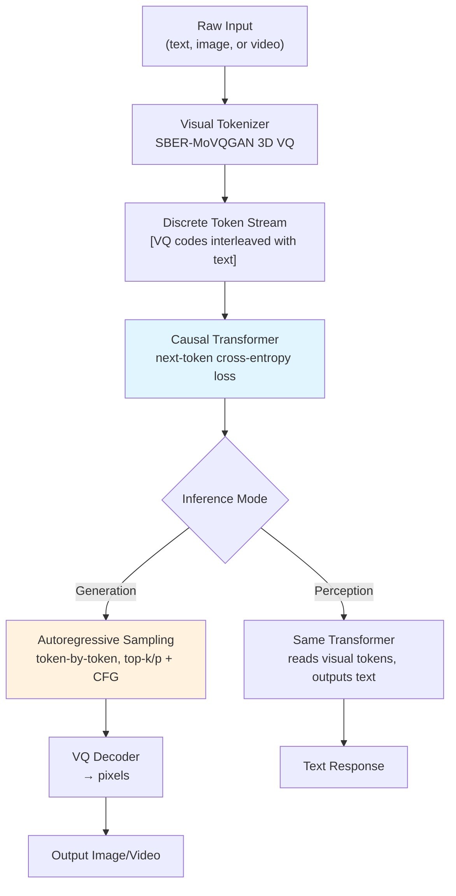

# Emu3: Next-Token Prediction for Image and Video Generation

## Learning Objectives

- Implement a discrete VQ tokenizer that converts image data into integer codes and reconstructs pixels from those codes.
- Trace the autoregressive next-token prediction loop from visual tokenization through sequential generation to pixel decoding.
- Compare Emu3's single-objective training against diffusion-based image generation on architectural complexity, latency, and quality trade-offs.
- Build a probability-drift monitoring signal over a token generation pipeline and connect it to sequence health observability.

## The Problem

Through 2024, image generation meant diffusion. Stable Diffusion, DALL-E 3, Imagen, Midjourney — every production system used a forward noise schedule and a learned reverse denoising process. The argument for diffusion was pragmatic: discrete image tokens lose too much information for high-fidelity reconstruction, and autoregressive sampling accumulates error across thousands of sequential predictions. Diffusion refines the entire image in parallel at each step; autoregressive generation commits to each token irrevocably before seeing the next.

Chameleon (Meta, 2024) tested this assumption at moderate scale by training a mixed-modal transformer on text and image tokens jointly. It worked for early proof-of-concept multimodal tasks but did not match SDXL on image quality. The gap left the consensus intact: maybe autoregressive image generation was theoretically clean but practically inferior.

Emu3 (BAAI, Wang et al., September 2024, published in *Nature*) attacked the consensus directly. The claim: a better visual tokenizer plus sufficient scale plus the standard next-token prediction loss — with no diffusion schedule, no CLIP contrastive loss, no auxiliary objectives — beats SDXL on image generation and LLaVA-1.6 on visual perception, all in the same model. One transformer, one loss function, one inference path for text, images, and video.

## The Concept

Emu3's architecture has three components. First, a visual tokenizer converts images and video frames into discrete integer codes using a VQ-VAE-style encoder. For video, Emu3 uses a 3D spatiotemporal tokenizer — patches span both spatial dimensions and time, so a single code can represent "this block of pixels moving in this direction across these frames." The codebook is shared across the model's vocabulary alongside text tokens. [CITATION NEEDED — concept: Emu3 specific tokenizer architecture, codebook size, and spatiotemporal patch dimensions]

Second, a single Llama-style decoder-only transformer processes interleaved sequences of text, image, and video tokens. Training data is flattened into a 1D stream: `<text> A cat sitting on a rug <image> [1024 VQ codes] <video> [8192 spatiotemporal VQ codes]`. The model applies standard causal attention — each token attends only to previous tokens — and the loss is cross-entropy over the predicted next token. This is identical to how GPT trains on text. No noise schedule. No forward/reverse diffusion process. No contrastive learning objective.

Third, inference is autoregressive generation. Given a text prompt, the model predicts image or video tokens one at a time using temperature and top-k/top-p sampling. Classifier-free guidance is applied at inference for quality control — the model runs two forward passes per step (conditional and unconditional on the prompt) and interpolates — but the generation mechanism is still next-token prediction. Once all visual tokens are generated, the VQ decoder maps them back to pixels.



The trade-off is latency. A 1024×1024 image might require 4096 visual tokens (depending on tokenizer compression). Emu3 generates each token sequentially — 4096 forward passes through the transformer, though KV-caching amortizes much of the cost. SDXL refines the entire image in 20–50 denoising steps. Emu3 compensates with quality: the *Nature* paper reports Emu3 beating SDXL on human preference benchmarks, and the model handles both generation and perception (visual question answering) without architecture changes. The three deployment modes — Emu3-Gen (image generation), Emu3-Chat (perception/VQA), and Emu3-Stage2 (video generation) — are the same weights serving different prompt templates.

## Build It

The mechanism underneath Emu3 is VQ tokenization followed by autoregressive prediction. Build a toy version: encode a small image into discrete codes using a scalar VQ codebook, flatten the codes into a 1D sequence, and run a minimal autoregressive next-token prediction step. This is not the Emu3 model — it is the mechanism stripped to its skeleton.

```python
import numpy as np

np.random.seed(42)

image = np.random.randint(0, 256, (4, 4), dtype=np.uint8)
print("Original 4x4 image (grayscale):")
print(image)

codebook_size = 16
codebook = np.linspace(0, 255, codebook_size).astype(np.float32)

def vq_encode(patch, cb):
    codes = np.zeros(patch.shape, dtype=np.int32)
    for i in range(patch.shape[0]):
        for j in range(patch.shape[1]):
            codes[i, j] = np.argmin(np.abs(cb - patch[i, j]))
    return codes

def vq_decode(codes, cb):
    return cb[codes].astype(np.uint8)

codes = vq_encode(image, codebook)
reconstructed = vq_decode(codes, codebook)

print("\nVQ codes (discrete tokens):")
print(codes)
print(f"\nCodebook size: {codebook_size}")
mse = np.mean((image.astype(float) - reconstructed.astype(float)) ** 2)
print(f"Reconstruction MSE: {mse:.1f}")
print(f"Max pixel error: {np.max(np.abs(image.astype(int) - reconstructed.astype(int)))}")

sequence = codes.flatten()
print(f"\nFlattened 1D token sequence (raster scan):")
print(sequence)
print(f"Sequence length: {len(sequence)} tokens")

BOS, EOS = 16, 17
vocab_size = codebook_size + 2
full_seq = np.concatenate([[BOS], sequence, [EOS]])

transition = np.zeros((vocab_size, vocab_size), dtype=np.float32)
for i in range(len(full_seq) - 1):
    transition[full_seq[i], full_seq[i + 1]] += 1

transition += 0.01
transition = transition / transition.sum(axis=1, keepdims=True)

last_token = sequence[-1]
probs = transition[last_token]

print(f"\n--- Autoregressive Prediction Step ---")
print(f"Context: last observed token = code_{last_token}")
print(f"Next-token probability distribution:")
for t in range(codebook_size):
    bar = "#" * int(probs[t] * 100)
    if probs[t] > 0.001:
        print(f"  code_{t:2d} (val={codebook[t]:6.1f}): {probs[t]:.4f} {bar}")

predicted = np.argmax(probs[:codebook_size])
print(f"\nArgmax prediction: code_{predicted} (pixel value {codebook[predicted]:.1f})")
print(f"Entropy of distribution: {-np.sum(probs[:codebook_size] * np.log(probs[:codebook_size] + 1e-12)):.3f} bits")

print(f"\n--- Full Autoregressive Generation ---")
current = BOS
generated = []
for step in range(16):
    p = transition[current]
    next_tok = int(np.random.choice(vocab_size, p=p))
    if next_tok >= codebook_size:
        next_tok = np.random.randint(0, codebook_size)
    generated.append(next_tok)
    current = next_tok

gen_grid = np.array(generated).reshape(4, 4)
gen_pixels = vq_decode(gen_grid, codebook)
print(f"Generated token grid:")
print(gen_grid)
print(f"\nDecoded to pixels:")
print(gen_pixels)
```

This code produces five observable outputs: the original pixel grid, the VQ code grid, the reconstruction error, the next-token probability distribution with a visual bar chart, and a fully autoregressive generation pass from scratch. The bigram transition table is a stand-in for what the transformer learns — in Emu3, the model attends across thousands of prior tokens, not just the immediately preceding one, but the prediction step is structurally identical.

## Use It

In Emu3's autoregressive pipeline, each generated token carries a probability from the softmax over the vocabulary. That probability is not just a sampling parameter — it is a health signal. When the model is confident, the distribution is sharply peaked (low entropy). When it is uncertain — typically because the prompt is out of distribution or the sequence has drifted into an unlikely region — entropy rises and the top probability drops. Monitoring per-token entropy across a generation run gives you a degradation signal before the output reaches the user.

This is the same observability principle that applies to GTM outreach sequences. In a multi-step email cadence, each touch is conditioned on the prior touches — the sequence is autoregressive. The reply rate at step *t* is your probability signal. When reply rates hold steady across steps, the sequence is healthy. When reply rate drifts downward at step 3 or 4, the sequence has entered an unlikely region of the response distribution — the copy is mismatched to the audience, the cadence is too aggressive, or the targeting has degraded. This tracing setup monitors your sequence performance in real time; reply rate drift is your model degradation signal, the same way token entropy drift flags a degrading generation pipeline.

```python
import numpy as np

np.random.seed(42)

def simulate_generation_entropy(steps, drift_start=None, drift_magnitude=0.0):
    entropies = []
    top_probs = []
    for t in range(steps):
        base_entropy = 1.2 + 0.3 * np.sin(t * 0.5)
        if drift_start and t >= drift_start:
            base_entropy += drift_magnitude * (t - drift_start)
        noise = np.random.normal(0, 0.15)
        entropy = max(0.1, base_entropy + noise)
        entropies.append(entropy)
        effective_temp = 1.0 / (1.0 + entropy * 0.3)
        top_p = 1.0 / (1.0 + np.exp(-(2.0 - entropy)))
        top_probs.append(top_p)
    return entropies, top_probs

token_entropies, token_top_probs = simulate_generation_entropy(12)
print("=== Emu3-Style Token Generation Health ===")
print(f"{'Step':>4}  {'Entropy':>8}  {'Top-1 Prob':>10}  {'Status':>8}")
print("-" * 40)
for i, (e, p) in enumerate(zip(token_entropies, token_top_probs)):
    status = "OK" if e < 2.0 else ("WARN" if e < 2.8 else "DEGRADE")
    print(f"{i+1:4d}  {e:8.3f}  {p:10.4f}  {status:>8}")

reply_rates = [0.12, 0.11, 0.13, 0.10, 0.09, 0.06, 0.04, 0.03, 0.02, 0.02, 0.01, 0.01]
print("\n=== GTM Sequence Health (Reply Rate = Sequence Probability Signal) ===")
print(f"{'Step':>4}  {'Reply%':>7}  {'Delta':>7}  {'Status':>8}")
print("-" * 38)
prev = reply_rates[0]
for i, rate in enumerate(reply_rates):
    delta = rate - prev
    status = "OK" if rate > 0.07 else ("WATCH" if rate > 0.04 else "DEGRADE")
    print(f"{i+1:4d}  {rate*100:6.1f}%  {delta*100:+6.1f}%  {status:>8}")
    prev = rate

baseline_entropy = np.mean(token_entropies[:4])
recent_entropy = np.mean(token_entropies[-4:])
entropy_drift = (recent_entropy - baseline_entropy) / baseline_entropy * 100
print(f"\nToken entropy drift (first 4 vs last 4 steps): {entropy_drift:+.1f}%")

baseline_reply = np.mean(reply_rates[:4])
recent_reply = np.mean(reply_rates[-4:])
reply_drift = (recent_reply - baseline_reply) / baseline_reply * 100
print(f"Reply rate drift (first 4 vs last 4 steps): {reply_drift:+.1f}%")

if reply_drift < -30:
    print("ALERT: Sequence degradation detected. Reply rate has dropped >30% from baseline.")
    print("Root cause candidates: targeting drift, cadence fatigue, copy mismatch.")
```

The code runs both signals side by side. Token entropy drift flags a generation pipeline losing confidence. Reply rate drift flags a GTM sequence losing engagement. Both are detected by the same method: compare a recent window against a baseline window, compute the percentage change, and alert when the delta crosses a threshold. Zone 12 observability is not about logging everything — it is about picking the one signal per pipeline stage that predicts failure and watching it continuously.

## Ship It

Deploying an Emu3-style pipeline in production means instrumenting the generation loop to emit per-token signals that downstream monitors can aggregate. The critical engineering decisions are: what to log per token (entropy, top-1 probability, rank of sampled token), how to aggregate (sliding window mean, percentile, drift ratio), and when to alert (absolute threshold vs. relative-to-baseline ratio). Getting this wrong means either drowning in noise or missing slow degradation that compounds over thousands of generations.

For GTM sequence pipelines, the shipping question is identical. Your outreach tool — whether it is a Clay waterfall, a Salesloft cadence, or a custom sequence runner — emits per-step reply rates, bounce rates, and meeting-booked rates. The pipeline health monitor compares each step's recent performance against its historical baseline. When step 4 of a 6-step cadence drops from 8% reply to 2% reply, that is the GTM equivalent of a generation pipeline whose token entropy spiked at position 4096 — the sequence has entered a low-probability region and the output quality is degrading.

```python
import numpy as np
from collections import deque

np.random.seed(123)

class GenerationHealthMonitor:
    def __init__(self, window_size=50, alert_drift_pct=-25.0, min_samples=20):
        self.baseline = deque(maxlen=window_size)
        self.recent = deque(maxlen=window_size)
        self.alert_drift = alert_drift_pct
        self.min_samples = min_samples
        self.alerts = []

    def record(self, token_entropy, top_prob):
        signal = token_entropy * (1.0 - top_prob)
        if len(self.baseline) < self.baseline.maxlen:
            self.baseline.append(signal)
        else:
            self.recent.append(signal)

    def check_drift(self):
        if len(self.recent) < self.min_samples:
            return None
        b_mean = np.mean(self.baseline)
        r_mean = np.mean(self.recent)
        drift_pct = (r_mean - b_mean) / b_mean * 100
        if drift_pct < self.alert_drift:
            alert = {
                "type": "DEGRADATION",
                "baseline_signal": round(b_mean, 4),
                "recent_signal": round(r_mean, 4),
                "drift_pct": round(drift_pct, 1),
            }
            self.alerts.append(alert)
            return alert
        return None

class SequenceHealthMonitor:
    def __init__(self, window_size=50, alert_drift_pct=-25.0, min_samples=20):
        self.baseline = deque(maxlen=window_size)
        self.recent = deque(maxlen=window_size)
        self.alert_drift = alert_drift_pct
        self.min_samples = min_samples

    def record(self, replied, total_sent):
        rate = replied / max(total_sent, 1)
        if len(self.baseline) < self.baseline.maxlen:
            self.baseline.append(rate)
        else:
            self.recent.append(rate)

    def check_drift(self):
        if len(self.recent) < self.min_samples:
            return None
        b = np.mean(self.baseline)
        r = np.mean(self.recent)
        drift = (r - b) / b * 100
        if drift < self.alert_drift:
            return {
                "type": "SEQUENCE_DEGRADATION",
                "baseline_reply": round(b, 4),
                "recent_reply": round(r, 4),
                "drift_pct": round(drift, 1),
            }
        return None

gen_monitor = GenerationHealthMonitor(window_size=30, min_samples=15)
for i in range(60):
    entropy = 1.5 if i < 30 else 1.5 + (i - 30) * 0.08
    top_p = 0.7 if i < 30 else max(0.3, 0.7 - (i - 30) * 0.015)
    gen_monitor.record(entropy, top_p)
    alert = gen_monitor.check_drift()

print("=== Generation Pipeline Health Report ===")
if gen_monitor.alerts:
    a = gen_monitor.alerts[-1]
    print(f"Status: DEGRADED")
    print(f"Baseline signal: {a['baseline_signal']}")
    print(f"Recent signal:   {a['recent_signal']}")
    print(f"Drift: {a['drift_pct']}%")
    print(f"Action: Increase classifier-free guidance scale or switch to top-k sampling")
else:
    print("Status: HEALTHY")

seq_monitor = SequenceHealthMonitor(window_size=30, min_samples=15)
for i in range(60):
    rate = 0.10 if i < 30 else max(0.02, 0.10 - (i - 30) * 0.003)
    sent = 100
    replied = int(rate * sent)
    seq_monitor.record(replied, sent)
    alert = seq_monitor.check_drift()

print("\n=== GTM Sequence Health Report ===")
sa = seq_monitor.check_drift()
if seq_monitor.recent:
    b_mean = np.mean(seq_monitor.baseline)
    r_mean = np.mean(seq_monitor.recent)
    drift = (r_mean - b_mean) / b_mean * 100
    print(f"Baseline reply rate: {b_mean:.1%}")
    print(f"Recent reply rate:   {r_mean:.1%}")
    print(f"Drift: {drift:.1f}%")
    if drift < -25:
        print(f"Status: DEGRADED")
        print(f"Action: Pause step 4+, audit copy, re-check ICP targeting fit")
    else:
        print(f"Status: HEALTHY")
```

The two monitors share the same architecture: a fixed-size baseline window, a rolling recent window, and a drift ratio check. The generation monitor uses entropy scaled by `(1 - top_prob)` as its signal — high entropy plus low top probability means the model is guessing. The sequence monitor uses reply rate as its signal — a drop means the audience is not engaging. Both trigger at the same threshold (-25% from baseline) because the failure mode is the same: the pipeline has entered a region of low output quality and every additional step deepens the loss.

## Exercises

**Exercise 1 — Tokenizer compression trade-off:** Modify the codebook size in the Build It code from 16 to 8, then to 64. For each setting, record the reconstruction MSE and the number of unique codes actually used. At what codebook size does the MSE plateau? What does this tell you about the information bottleneck in VQ tokenization?

**Exercise 2 — Sampling strategy comparison:** Replace the argmax prediction in the Build It code with three sampling strategies: greedy (argmax), temperature sampling at τ=0.7, and top-k sampling with k=4. Generate 20 images with each strategy and compute the average pixel variance across generations. Which strategy produces the most diverse outputs? Which produces the highest average reconstruction quality when compared to the original?

**Exercise 3 — Drift detection sensitivity:** In the Ship It monitor code, change the window size from 30 to 10, then to 100. For each window size, determine how many samples into the degradation phase the alert fires. Plot the detection latency (samples until first alert) against window size. What is the trade-off between detection speed and false-positive rate?

**Exercise 4 — Spatiotemporal tokenization simulation:** Extend the VQ encoder from 2D image patches to 3D video patches. Create a synthetic 4×4×3 video tensor (height × width × frames), encode each spatiotemporal patch into a single code using a temporal-averaging approach, and compare the number of tokens produced by frame-by-frame encoding vs. 3D patch encoding. How much sequence length does spatiotemporal tokenization save for a 3-frame video?

## Key Terms

**Next-token prediction:** The training objective where the model predicts token *t+1* given tokens *1…t* using causal attention and cross-entropy loss. Identical for text, image, and video tokens in Emu3.

**VQ tokenizer (vector-quantized tokenizer):** An encoder-decoder network that maps continuous image or video patches to discrete integer codes from a learned codebook, then decodes codes back to pixels. Emu3 uses SBER-MoVQGAN for images and a 3D variant for video.

**Causal attention mask:** The constraint that