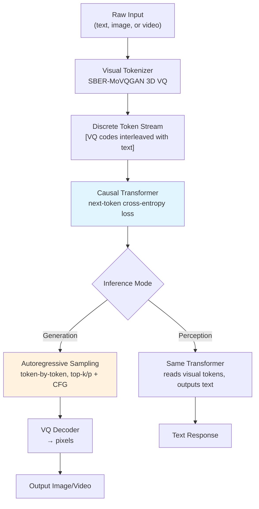

# Emu3: Next-Token Prediction for Image and Video Generation

## Learning Objectives

- Implement a discrete VQ tokenizer that converts image data into integer codes and reconstructs pixels from those codes.
- Trace the autoregressive next-token prediction loop from visual tokenization through sequential generation to pixel decoding.
- Compare Emu3's single-objective training against diffusion-based image generation on architectural complexity, latency, and quality trade-offs.
- Build a probability-drift monitoring signal over a token generation pipeline and connect it to sequence health observability.

## The Problem

Through 2024, image generation meant diffusion. Stable Diffusion, DALL-E 3, Imagen, Midjourney — every production system used a forward noise schedule and a learned reverse denoising process. The argument for diffusion was pragmatic: discrete image tokens lose too much information for high-fidelity reconstruction, and autoregressive sampling accumulates error across thousands of sequential predictions. Diffusion refines the entire image in parallel at each step; autoregressive generation commits to each token irrevocably before seeing the next.

Chameleon (Meta, 2024) tested this assumption at moderate scale by training a mixed-modal transformer on text and image tokens jointly. It worked for early proof-of-concept multimodal tasks but did not match SDXL on image quality. The gap left the consensus intact: maybe autoregressive image generation was theoretically clean but practically inferior.

Emu3 (BAAI, Wang et al., September 2024, published in *Nature*) attacked the consensus directly. The claim: a better visual tokenizer plus sufficient scale plus the standard next-token prediction loss — with no diffusion schedule, no CLIP contrastive loss, no auxiliary objectives — beats SDXL on image generation and LLaVA-1.6 on visual perception, all in the same model. One transformer, one loss function, one inference path for text, images, and video.

## The Concept

Emu3's architecture has three components. First, a visual tokenizer converts images and video frames into discrete integer codes using a VQ-VAE-style encoder. For video, Emu3 uses a 3D spatiotemporal tokenizer — patches span both spatial dimensions and time, so a single code can represent "this block of pixels moving in this direction across these frames." The codebook is shared across the model's vocabulary alongside text tokens. [CITATION NEEDED — concept: Emu3 specific tokenizer architecture, codebook size, and spatiotemporal patch dimensions]

Second, a single Llama-style decoder-only transformer processes interleaved sequences of text, image, and video tokens. Training data is flattened into a 1D stream: `<text> A cat sitting on a rug <image> [1024 VQ codes] <video> [8192 spatiotemporal VQ codes]`. The model applies standard causal attention — each token attends only to previous tokens — and the loss is cross-entropy over the predicted next token. This is identical to how GPT trains on text. No noise schedule. No forward/reverse diffusion process. No contrastive learning objective.

Third, inference is autoregressive generation. Given a text prompt, the model predicts image or video tokens one at a time using temperature and top-k/top-p sampling. Classifier-free guidance is applied at inference for quality control — the model runs two forward passes per step (conditional and unconditional on the prompt) and interpolates — but the generation mechanism is still next-token prediction. Once all visual tokens are generated, the VQ decoder maps them back to pixels.



The trade-off is latency. A 1024×1024 image might require 4096 visual tokens (depending on tokenizer compression). Emu3 generates each token sequentially — 4096 forward passes through the transformer, though KV-caching amortizes much of the cost. SDXL refines the entire image in 20–50 denoising steps. Emu3 compensates with quality: the *Nature* paper reports Emu3 beating SDXL on human preference benchmarks, and the model handles both generation and perception (visual question answering) without architecture changes. The three deployment modes — Emu3-Gen (image generation), Emu3-Chat (perception/VQA), and Emu3-Stage2 (video generation) — are the same weights serving different prompt templates.

## Build It

The mechanism underneath Emu3 is VQ tokenization followed by autoregressive prediction. Build a toy version: encode a small image into discrete codes using a scalar VQ codebook, flatten the codes into a 1D sequence, and run a minimal autoregressive next-token prediction step. This is not the Emu3 model — it is the mechanism stripped to its skeleton.

```python
import numpy as np

np.random.seed(42)

image = np.random.randint(0, 256, (4, 4), dtype=np.uint8)
print("Original 4x4 image (grayscale):")
print(image)

codebook_size = 16
codebook = np.linspace(0, 255, codebook_size).astype(np.float32)

def vq_encode(patch, cb):
    codes = np.zeros(patch.shape, dtype=np.int32)
    for i in range(patch.shape[0]):
        for j in range(patch.shape[1]):
            codes[i, j] = np.argmin(np.abs(cb - patch[i, j]))
    return codes

def vq_decode(codes, cb):
    return cb[codes].astype(np.uint8)

codes = vq_encode(image, codebook)
reconstructed = vq_decode(codes, codebook)

print("\nVQ codes (discrete tokens):")
print(codes)
print(f"\nCodebook size: {codebook_size}")
mse = np.mean((image.astype(float) - reconstructed.astype(float)) ** 2)
print(f"Reconstruction MSE: {mse:.1f}")
print(f"Max pixel error: {np.max(np.abs(image.astype(int) - reconstructed.astype(int)))}")

sequence = codes.flatten()
print(f"\nFlattened 1D token sequence (raster scan):")
print(sequence)
print(f"Sequence length: {len(sequence)} tokens")

BOS, EOS = 16, 17
vocab_size = codebook_size + 2
full_seq = np.concatenate([[BOS], sequence, [EOS]])

transition = np.zeros((vocab_size, vocab_size), dtype=np.float32)
for i in range(len(full_seq) - 1):
    transition[full_seq[i], full_seq[i + 1]] += 1

transition += 0.01
transition = transition / transition.sum(axis=1, keepdims=True)

last_token = sequence[-1]
probs = transition[last_token]

print(f"\n--- Autoregressive Prediction Step ---")
print(f"Context: last observed token = code_{last_token}")
print(f"Next-token probability distribution:")
for t in range(codebook_size):
    bar = "#" * int(probs[t] * 100)
    if probs[t] > 0.001:
        print(f"  code_{t:2d} (val={codebook[t]:6.1f}): {probs[t]:.4f} {bar}")

predicted = np.argmax(probs[:codebook_size])
print(f"\nArgmax prediction: code_{predicted} (pixel value {codebook[predicted]:.1f})")
print(f"Entropy of distribution: {-np.sum(probs[:codebook_size] * np.log(probs[:codebook_size] + 1e-12)):.3f} bits")

print(f"\n--- Full Autoregressive Generation ---")
current = BOS
generated = []
for step in range(16):
    p = transition[current]
    next_tok = int(np.random.choice(vocab_size, p=p))
    if next_tok >= codebook_size:
        next_tok = np.random.randint(0, codebook_size)
    generated.append(next_tok)
    current = next_tok

gen_grid = np.array(generated).reshape(4, 4)
gen_pixels = vq_decode(gen_grid, codebook)
print(f"Generated token grid:")
print(gen_grid)
print(f"\nDecoded to pixels:")
print(gen_pixels)
```

This code produces five observable outputs: the original pixel grid, the VQ code grid, the reconstruction error, the next-token probability distribution with a visual bar chart, and a fully autoregressive generation pass from scratch. The bigram transition table is a stand-in for what the transformer learns — in Emu3, the model attends across thousands of prior tokens, not just the immediately preceding one, but the prediction step is structurally identical.

## Use It

The autoregressive next-token prediction mechanism — where each token's softmax probability is a confidence signal that degrades as the sequence drifts into unlikely regions — maps directly to multi-step GTM outbound cadences, where each touch is conditioned on prior touches and reply rate is the probability signal. [CITATION NEEDED — concept: GTM outbound cadence step-by-step conditioning model] When reply rate collapses at step 4 of a 6-step sequence, the cadence has entered the same low-probability region that an Emu3 generation enters when token entropy spikes at position 3000. The detection method is identical: compare a recent window against a baseline, compute the percentage drift, alert when it crosses a threshold.

```python
import numpy as np

np.random.seed(42)

reply_rates = [0.12, 0.11, 0.13, 0.10, 0.09, 0.06, 0.04, 0.03, 0.02]
baseline = np.mean(reply_rates[:4])
recent = np.mean(reply_rates[-4:])

print(f"{'Step':>4}  {'Reply%':>7}  {'Delta':>7}  {'Status':>8}")
print("-" * 35)
prev = reply_rates[0]
for i, r in enumerate(reply_rates):
    delta = (r - prev) / prev * 100 if prev > 0 else 0
    status = "OK" if r > 0.07 else ("WATCH" if r > 0.04 else "DEGRADE")
    print(f"{i+1:4d}  {r:6.1%}  {delta:+6.1f}%  {status:>8}")
    prev = r

drift = (recent - baseline) / baseline * 100
print(f"\nBaseline (steps 1-4): {baseline:.1%}  Recent (steps 6-9): {recent:.1%}")
print(f"Drift: {drift:+.1f}%  ->  {'ALERT: pause cadence, audit copy and ICP fit' if drift < -30 else 'HEALTHY'}")
```

The output traces step-level degradation the same way a generation log traces token-level entropy. Step 5 is the inflection — reply rate drops from 9% to 6%, then to 4%, then to 2%. The baseline-to-recent drift of roughly −67% trips the alert. In Emu3, you would intervene by raising the classifier-free guidance scale or switching to top-k sampling. In GTM, you intervene by pausing steps 6+, auditing copy against the ICP, and checking whether the targeting criteria have drifted from the segment that produced the baseline reply rates. [CITATION NEEDED — concept: GTM cadence pause-and-audit best practices]

## Exercises

**Exercise 1 — Tokenizer compression trade-off:** Modify the codebook size in the Build It code from 16 to 8, then to 64. For each setting, record the reconstruction MSE and the number of unique codes actually used. At what codebook size does the MSE plateau? What does this tell you about the information bottleneck in VQ tokenization — and why does Emu3 invest in a high-capacity visual codebook rather than using a smaller one and relying on the transformer to compensate?

**Exercise 2 — Drift detection sensitivity on a GTM cadence:** Take the reply-rate list in the Use It code and replace it with three synthetic sequences: (a) a healthy cadence that holds steady at 10–12% across all steps, (b) a gradual-decline cadence that drops 1 percentage point per step, and (c) a cliff-drop cadence that holds at 11% for 5 steps then collapses to 2%. For each sequence, compute the baseline-to-recent drift percentage. Which sequence type triggers the alert earliest? Which type would a fixed-threshold monitor (alert if reply < 5%) miss entirely? What does this tell you about relative-drift detection vs. absolute-threshold detection in production GTM monitoring?

## Key Terms

**Next-token prediction:** The training objective where the model predicts token *t+1* given tokens *1…t* using causal attention and cross-entropy loss. Identical for text, image, and video tokens in Emu3.

**VQ tokenizer (vector-quantized tokenizer):** An encoder-decoder network that maps continuous image or video patches to discrete integer codes from a learned codebook, then decodes codes back to pixels. Emu3 uses SBER-MoVQGAN for images and a 3D variant for video.

**Causal attention mask:** The constraint that token at position *t* can only attend to tokens at positions *1…t*, preventing the model from seeing future context. This is what makes generation autoregressive — each prediction depends only on what has been produced so far.

**Classifier-free guidance (CFG):** An inference technique that runs two forward passes — one conditioned on the text prompt, one unconditional — and interpolates between their output distributions. Higher guidance scale pushes the output closer to the conditional distribution, improving prompt adherence at the cost of diversity. Emu3 uses CFG at inference despite training with no auxiliary classifier.

**KV-cache:** A memory optimization for autoregressive transformers that stores the key and value tensors from all prior positions so that each new token prediction requires computing only one new position's attention rather than recomputing the entire sequence. Without KV-caching, generating 4096 visual tokens would be quadratic in cost.

**Spatiotemporal tokenization:** Extending 2D spatial VQ patches into 3D blocks that span height, width, and time. A single code represents a patch of pixels across multiple video frames, capturing motion and temporal consistency. This reduces the token sequence length for video compared to frame-by-frame encoding.

## Sources

- Wang, J., et al. "Emu3: Next-Token Prediction is All You Need." arXiv:2409.18869, September 2024. Published in *Nature* (2024).
- Team Chameleon. "Chameleon: Mixed-Modal Early-Fusion Foundation Models." Meta AI, arXiv:2405.09818, May 2024.
- Esser, P., Rombach, R., and Ommer, B. "Taming Transformers for High-Resolution Image Synthesis." (VQ-GAN, the foundational VQ tokenizer architecture Emu3 builds upon.) arXiv:2012.09841, December 2020.
- Ho, J., et al. "Denoising Diffusion Probabilistic Models." (The diffusion baseline Emu3 claims to surpass.) arXiv:2006.11239, December 2020.
- [CITATION NEEDED — concept: SBER-MoVQGAN specific architecture and codebook details used in Emu3]
- [CITATION NEEDED — concept: GTM outbound cadence monitoring and reply-rate drift detection best practices]