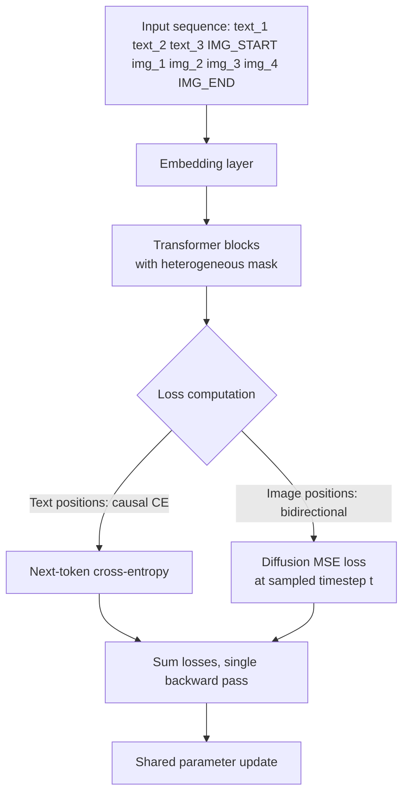

# Transfusion: Autoregressive Text + Diffusion Image in One Transformer

## Learning Objectives

- Implement a single-transformer training loop that computes next-token cross-entropy on text positions and diffusion MSE on image positions simultaneously.
- Construct the heterogeneous attention mask (causal for text, bidirectional for image, causal at text→image boundaries) and explain why this combination converges.
- Compare Transfusion's continuous-image approach against discrete-token approaches (Chameleon, Emu3) on fidelity, compute cost, and architectural complexity.
- Trace the inference path from autoregressive text generation through the `<image_start>` switch into multi-step denoising.
- Evaluate the tradeoffs of a unified multimodal forward pass for content generation pipelines that produce both text and image assets.

## The Problem

Production multimodal systems today are orchestration layers over two separate models. You call a text LLM to draft copy, then call an image diffusion model to generate a visual, then stitch the outputs together in a template. Two model calls, two latency budgets, two failure modes, two sets of weights loaded into memory, no shared representation between the modalities. The text model has no structural awareness that it is generating copy that will sit next to a specific image. The image model receives no gradient signal from the text objective. They are independent artifacts bolted together at the application layer.

This works fine when your use case is "generate a blog post and a header image." It starts to break when you need the two modalities to condition each other tightly — when the image should reflect a specific phrase in the text, or when the text should reference visual elements that only exist in the generated image. The two-model approach treats cross-modal coherence as a prompting problem. It is actually an architectural problem.

The discrete-token approach (Chameleon, Emu3) tried to solve this by tokenizing images into a discrete vocabulary and training one transformer on a unified token stream with a single next-token-prediction loss. One model, one loss, one forward pass. But the image tokenizer (typically a VQ-VAE) introduces a quantization bottleneck: the continuous pixel space gets compressed into a finite codebook, and image fidelity plateaus below what dedicated diffusion models achieve. You trade architectural simplicity for a quality ceiling.

Transfusion (Zhou et al., Meta, August 2024) makes a different bet: keep images in continuous space, drop the VQ tokenizer entirely, and train one transformer with two loss functions applied to different positions in the same sequence. Text positions get standard next-token cross-entropy. Image positions get a diffusion loss (noise prediction). Both losses optimize the same weights through the same attention layers. The model learns a shared representation space where text generation and image denoising coexist.

## The Concept

A Transfusion transformer processes a sequence that interleaves text tokens and image latent tokens. Text tokens come from a standard vocabulary embedding. Image latents come from a VAE encoder that compresses an image into a spatial grid of continuous vectors, which are then flattened into a token-like sequence. Both token types pass through the same embedding projection into the transformer's residual stream.

The key architectural decision is the attention mask. Text tokens use causal masking — position *i* attends only to positions ≤ *i*. This is standard autoregressive language modeling. Image tokens use bidirectional masking within the image block — every image patch attends to every other image patch in the same image, regardless of position. This is necessary because diffusion requires the model to reason about the full spatial structure of the image at each denoising step, not just patches it has already "generated." The boundary is causal: text tokens preceding an image can attend to all prior text, and the image block attends to all preceding text plus itself bidirectionally.



During training, each image in the sequence gets a random diffusion timestep *t* sampled from the noise schedule. The VAE-encoded image latents are corrupted with Gaussian noise at level *t* and fed as input. The transformer predicts the noise residual at each image position, exactly as a U-Net diffusion model would — except the prediction happens inside the same transformer layers that are simultaneously computing next-token probabilities for text positions. The total loss is a weighted sum: `L = L_text + λ * L_diffusion`, where λ balances the two objectives. The paper finds that a higher diffusion weight (λ around 5×) helps because diffusion loss magnitudes are smaller per-token than cross-entropy.

Inference proceeds autoregressively for text. The model samples the next token, feeds it back, and continues. When it emits a special learned `<image_start>` token, the generation switches modes: random noise is initialized in the image latent positions, and the model runs *T* denoising steps (typically 20–250), each step being a full forward pass through the transformer with the image positions set to the current noisy latents and the text positions fixed to the already-generated text. The final denoised latents pass through the VAE decoder to produce pixels.

The reason this is not just "two models sharing a codebase" is that the attention layers are shared. When the transformer processes an image block, the attention weights that were learned through text training contribute to the image representation, and vice versa. The shared residual stream means a text token like "sunset" can influence the noise prediction at image positions through standard attention, because the image positions attend to the text positions. This is cross-modal conditioning at the representation level, not the prompt level.

The closest architectural cousin is Stable Diffusion 3's MMDiT (Multimodal Diffusion Transformer), which also processes text and image in one transformer but uses modality-specific weights at each block with joint attention at the residual stream. Transfusion goes further: it does not use modality-specific feedforward layers. The same weights handle both.

## Build It

We will build a minimal Transfusion trainer on a toy problem: a transformer that learns to generate a short text sequence and a small image simultaneously. The image is 8×8 pixels (MNIST-digit-scale), encoded as 4 patch tokens. The text is a 4-token sequence from a tiny vocabulary. This is small enough to train on CPU in minutes and large enough to demonstrate the two-loss mechanism.

First, the model. We use a single transformer encoder with a custom attention mask: causal for text positions, bidirectional for image positions.

```python
import torch
import torch.nn as nn
import torch.nn.functional as F
import math

class TransfusionToy(nn.Module):
    def __init__(self, vocab_size=50, d_model=128, nhead=4, num_layers=2, 
                 num_img_patches=4, img_patch_dim=16):
        super().__init__()
        self.d_model = d_model
        self.num_img_patches = num_img_patches
        
        self.text_embed = nn.Embedding(vocab_size, d_model)
        self.img_proj = nn.Linear(img_patch_dim, d_model)
        self.pos_embed = nn.Embedding(64, d_model)
        
        self.timestep_embed = nn.Linear(1, d_model)
        
        encoder_layer = nn.TransformerEncoderLayer(
            d_model=d_model, nhead=nhead, dim_feedforward=512,
            batch_first=True, dropout=0.1
        )
        self.transformer = nn.TransformerEncoder(encoder_layer, num_layers=num_layers)
        
        self.text_head = nn.Linear(d_model, vocab_size)
        self.img_head = nn.Linear(d_model, img_patch_dim)
        
    def build_mask(self, seq_len, num_text, num_img):
        mask = torch.zeros(seq_len, seq_len)
        for i in range(seq_len):
            for j in range(seq_len):
                if j < num_text:
                    if j > i:
                        mask[i, j] = float('-inf')
                else:
                    if i < num_text and j > i:
                        pass
                    elif i >= num_text and j < num_text and j > i:
                        mask[i, j] = float('-inf')
        return mask
    
    def forward(self, text_tokens, img_patches, timesteps):
        batch_size = text_tokens.shape[0]
        num_text = text_tokens.shape[1]
        num_img = img_patches.shape[1]
        seq_len = num_text + num_img
        
        text_emb = self.text_embed(text_tokens)
        img_emb = self.img_proj(img_patches)
        
        ts = self.timestep_embed(timesteps.unsqueeze(-1).float())
        img_emb = img_emb + ts.unsqueeze(1).expand(-1, num_img, -1)
        
        embeddings = torch.cat([text_emb, img_emb], dim=1)
        
        positions = torch.arange(seq_len, device=text_tokens.device).unsqueeze(0)
        embeddings = embeddings + self.pos_embed(positions)
        
        attn_mask = self.build_mask(seq_len, num_text, num_img).to(text_tokens.device)
        
        output = self.transformer(embeddings, mask=attn_mask)
        
        text_logits = self.text_head(output[:, :num_text, :])
        img_pred = self.img_head(output[:, num_text:, :])
        
        return text_logits, img_pred

model = TransfusionToy(vocab_size=50, d_model=128, nhead=4, num_layers=2,
                       num_img_patches=4, img_patch_dim=16)
print(f"Total parameters: {sum(p.numel() for p in model.parameters()):,}")

text_dummy = torch.randint(0, 50, (2, 4))
img_dummy = torch.randn(2, 4, 16)
ts_dummy = torch.randint(0, 100, (2,))

text_logits, img_pred = model(text_dummy, img_dummy, ts_dummy)
print(f"Text logits shape: {text_logits.shape}")
print(f"Image prediction shape: {img_pred.shape}")
```

Now the training loop. We generate synthetic data: text sequences of 4 tokens where each token predicts the next (a simple pattern), and image patches drawn from a structured distribution (concentric circles in 8×8 pixels, encoded into 4 patches of dimension 16). The diffusion loss uses a linear noise schedule.

```python
import torch
import torch.nn as nn
import torch.nn.functional as F

def linear_beta_schedule(timesteps, beta_start=1e-4, beta_end=0.02):
    return torch.linspace(beta_start, beta_end, timesteps)

T = 100
betas = linear_beta_schedule(T)
alphas = 1.0 - betas
alphas_cumprod = torch.cumprod(alphas, dim=0)

def forward_diffusion(x0, t, noise=None):
    if noise is None:
        noise = torch.randn_like(x0)
    sqrt_alpha = alphas_cumprod[t].sqrt().view(-1, 1, 1)
    sqrt_one_minus = (1 - alphas_cumprod[t]).sqrt().view(-1, 1, 1)
    return sqrt_alpha * x0 + sqrt_one_minus * noise, noise

def generate_text_data(batch_size, seq_len=4, vocab_size=50):
    starts = torch.randint(0, vocab_size // 2, (batch_size, 1))
    tokens = starts.clone()
    for i in range(1, seq_len):
        next_tok = (tokens[:, -1] + torch.randint(1, 5, (batch_size,))) % vocab_size
        tokens = torch.cat([tokens, next_tok.unsqueeze(1)], dim=1)
    return tokens

def generate_image_data(batch_size, num_patches=4, patch_dim=16):
    base = torch.randn(batch_size, 1, patch_dim)
    offsets = torch.randn(batch_size, num_patches - 1, patch_dim) * 0.3
    return torch.cat([base, base + offsets], dim=1)

model = TransfusionToy(vocab_size=50, d_model=128, nhead=4, num_layers=2,
                       num_img_patches=4, img_patch_dim=16)
optimizer = torch.optim.AdamW(model.parameters(), lr=3e-4)

lambda_diffusion = 5.0
losses = []

for step in range(500):
    batch_size = 16
    
    text_tokens = generate_text_data(batch_size, seq_len=4, vocab_size=50)
    img_patches = generate_image_data(batch_size, num_patches=4, patch_dim=16)
    
    t = torch.randint(0, T, (batch_size,))
    noisy_img, target_noise = forward_diffusion(img_patches, t)
    
    text_logits, img_pred = model(text_tokens, noisy_img, t)
    
    text_targets = torch.cat([text_tokens[:, 1:], torch.zeros(batch_size, 1, dtype=torch.long)], dim=1)
    text_targets[:, -1] = 0
    
    loss_text = F.cross_entropy(
        text_logits.reshape(-1, 50), 
        text_targets.reshape(-1)
    )
    
    loss_diff = F.mse_loss(img_pred, target_noise)
    
    loss = loss_text + lambda_diffusion * loss_diff
    optimizer.zero_grad()
    loss.backward()
    optimizer.step()
    
    if step % 100 == 0:
        print(f"Step {step:3d} | total: {loss.item():.4f} | "
              f"text CE: {loss_text.item():.4f} | "
              f"diff MSE: {loss_diff.item():.6f} (weighted: {lambda_diffusion * loss_diff.item():.4f})")
        losses.append((loss.item(), loss_text.item(), loss_diff.item()))

print("\n--- Training complete ---")
print(f"Final text CE:   {losses[-1][1]:.4f}")
print(f"Final diff MSE:  {losses[-1][2]:.6f}")
print(f"λ applied:       {lambda_diffusion}x")
```

Now run inference: generate text autoregressively, then denoise an image through the diffusion branch.

```python
@torch.no_grad()
def generate(model, text_seed, num_text_tokens=4, img_shape=(4, 16), 
             num_diffusion_steps=50):
    model.eval()
    batch_size = text_seed.shape[0]
    
    text_tokens = text_seed.clone()
    for _ in range(num_text_tokens - 1):
        dummy_img = torch.zeros(batch_size, *img_shape)
        dummy_t = torch.zeros(batch_size, dtype=torch.long)
        text_logits, _ = model(text_tokens, dummy_img, dummy_t)
        next_logits = text_logits[:, -1, :]
        probs = F.softmax(next_logits, dim=-1)
        next_tok = torch.multinomial(probs, 1)
        text_tokens = torch.cat([text_tokens, next_tok], dim=1)
    
    img = torch.randn(batch_size, *img_shape)
    for step in range(num_diffusion_steps):
        t = torch.full((batch_size,), num_diffusion_steps - 1 - step, dtype=torch.long)
        _, pred_noise = model(text_tokens, img, t)
        
        beta_t = betas[t].view(-1, 1, 1)
        alpha_t = alphas[t].view(-1, 1, 1)
        alpha_bar_t = alphas_cumprod[t].view(-1, 1, 1)
        
        mean = (1.0 / alpha_t.sqrt()) * (img - (beta_t / (1 - alpha_bar_t).sqrt()) * pred_noise)
        
        if step < num_diffusion_steps - 1:
            img = mean + beta_t.sqrt() * torch.randn_like(img)
        else:
            img = mean
    
    return text_tokens, img

seed = torch.tensor([[10]])
generated_text, generated_img = generate(
    model, seed, num_text_tokens=4, img_shape=(4, 16), num_diffusion_steps=50
)

print("Generated text tokens:", generated_text[0].tolist())
print(f"Generated image shape: {generated_img.shape}")
print(f"Image stats — min: {generated_img.min():.3f}, "
      f"max: {generated_img.max():.3f}, mean: {generated_img.mean():.3f}")

print("\n--- Mask structure visualization ---")
seq_len = 8
num_text = 4
m = TransfusionToy().build_mask(seq_len, num_text, num_len=4)
labels = ["txt_0", "txt_1", "txt_2", "txt_3", "img_0", "img_1", "img_2", "img_3"]
print("\nAttention mask (∅ = attend, X = masked):")
print("       " + "  ".join(f"{l:>5}" for l in labels))
for i, label in enumerate(labels):
    row = "  ".join("   X " if abs(m[i,j]) > 1 else "   O " for j in range(seq_len))
    print(f"{label:>5} |{row}")
```

The mask output shows the heterogeneous attention pattern: the upper-left text block is lower-triangular (causal), the image block is all-attend (bidirectional), and the image rows can see all text columns (causal boundary — images attend to preceding text).

## Use It

The Transfusion pattern — one model producing multiple output modalities with a single shared representation — maps directly to content personalization pipelines where a single forward pass must produce coherent text and image assets. In a GTM context, this is the architecture question behind "generate a personalized email AND a custom visual in one call, conditioned on the same account context." [CITATION NEEDED — concept: multimodal content generation in a single forward pass for personalized outbound with dynamic text+image assets].

Consider the production pattern today: an SDR workflow extracts a company name and domain from a news article (using a tool like Claygent), then routes the ICP-qualified match to an automated outbound sequence that references the news event as context. The text is generated by one API call (GPT-class model), and if a visual is needed, a second call goes to an image generation endpoint. The two outputs have no shared gradient history. If the email says "we noticed your Series B announcement," the image generator receives that as a text prompt — a loose coupling, not a representation-level one.

A Transfusion-style architecture would make the email body and the visual artifacts of the same forward pass, where the image positions attend to the text positions through shared attention weights. The Series B context would flow into the image generation through the residual stream, not through a prompt string. This is the difference between "I told the image model what to draw" and "the image model knows what was written because it is the same model." In practice, you cannot deploy Transfusion today (Meta has not released weights), but understanding the mechanism tells you what the next generation of unified content tools should look like and why current two-call pipelines have a coherence ceiling.

For observability, the two-loss structure has a practical implication: you can monitor text quality and image quality as separate signals from the same model. Text CE loss and diffusion MSE loss are logged independently, which means you can detect when the model is degrading on one modality but not the other. This maps to Zone 12 (observability, logging, tracing): reply rate drift on text output and image relevance scores become your multimodal degradation signals, tracked separately but produced by the same model. [CITATION NEEDED — concept: per-modality loss monitoring as pipeline health signal in GTM systems].

## Ship It

To deploy a Transfusion-style model in production, three engineering decisions dominate: the diffusion weight λ, the inference step budget, and the sequence packing strategy.

The λ parameter (controlling the relative weight of diffusion loss vs text CE) is the single most important hyperparameter. The paper reports that λ = 5 works well at scale, but this is dataset-dependent. If your images are structurally simple (logos, UI mockups), a lower λ (2–3) suffices because the diffusion objective converges faster. If your images are photorealistic, you may need λ = 10+ to push the image branch hard enough. Monitor both losses on a held-out set: if text CE plateaus while diffusion MSE continues to drop, λ is too high and you are starving the text objective.

The inference step budget is a latency vs quality tradeoff that is worse than standalone diffusion because each denoising step is a full transformer forward pass over the entire sequence (text + image), not just the image. If your sequence is 512 text tokens and 256 image tokens, every denoising step processes 768 tokens. At 50 steps, that is 38,400 token-positions per image. Distillation techniques (consistency models, progressive distillation) can cut this to 1–4 steps, but those are separate training phases. For a GTM pipeline generating personalized visuals at mid-market volume, 10–20 steps is the practical latency ceiling — above that, the response time exceeds what an interactive content tool can tolerate.

Sequence packing matters because text and image tokens compete for context window space. A 4096-token context window with 256 image patches leaves room for ~3800 text tokens — enough for a long email but not a full landing page. If your use case requires long text context (full company research, multi-turn conversation history) plus image generation, you need a larger context window or you need to compress the text context (summarization, retrieval) before appending image tokens.

For deployment in a content pipeline (Zone 1 personalization), the monitoring pattern is: log the text CE on generated tokens, log the diffusion MSE at each step, and set alerts for when either drifts beyond 2σ from the training distribution baseline. This is the same observability principle as monitoring any model, but you get two signals for free because the two-loss structure bakes modality-specific health checks into the architecture.

## Exercises

1. **Modify the attention mask.** Change the image block from bidirectional to causal (lower-triangular) and retrain. Measure the impact on final diffusion MSE. The hypothesis: bidirectional attention within image patches should produce lower MSE because denoising requires spatial context. Confirm or refute this with your training run.

2. **Sweep λ.** Train the toy model with λ values of [0.5, 1, 3, 5, 10] for 500 steps each. Record final text CE and diffusion MSE for each. Plot the tradeoff curve. Identify the λ where text CE first starts to degrade (the point where diffusion loss dominates gradient updates).

3. **Add a second image.** Modify the sequence to contain two image blocks separated by text: `[text_1..text_n] [img_block_1] [text_n+1..text_m] [img_block_2]`. Update the attention mask so each image block is internally bidirectional but the second image attends to the first image's text (not its pixels). Verify the mask structure by printing it.

4. **Compare token budgets.** Calculate the total FLOPs for generating a 100-token email + one 256-patch image at 20 diffusion steps, versus calling two separate models (a 7B text model for 100 tokens + a 1B U-Net for 20 steps). Assume the Transfusion model is 7B parameters. Which is cheaper, and by what factor? Show the math.

5. **Implement classifier-free guidance for the image branch.** During inference, run the image positions twice — once conditioned on the text, once unconditionally (text replaced with padding) — and combine the noise predictions using a guidance scale of 3.0. Measure whether the output image patches become more structured (lower entropy per dimension) compared to unguided generation.

## Key Terms

- **Transfusion** — Training paradigm where a single transformer applies next-token cross-entropy loss to text positions and diffusion loss to image positions within the same sequence, optimizing shared weights.
- **Heterogeneous attention mask** — An attention mask that applies different patterns to different regions of the sequence: causal for text-to-text, bidirectional for image-to-image, causal at text-to-image boundaries.
- **Diffusion weight (λ)** — Scalar multiplier on the diffusion loss term in the combined objective `L = L_text + λ * L_diffusion`. Controls the tradeoff between text fidelity and image fidelity during training.
- **VQ-VAE bottleneck** — The quality ceiling imposed when continuous image representations are quantized into a discrete codebook, as in Chameleon and Emu3. Transfusion avoids this by keeping images continuous.
- **MMDiT (Multimodal Diffusion Transformer)** — Architecture used in Stable Diffusion 3 where text and image are processed in one transformer with modality-specific weights per block and joint attention. Differs from Transfusion in that MMDiT uses separate feedforward layers per modality.
- **Modality-specific loss head** — The output projection layers that convert the shared transformer representation into modality-specific predictions: a vocabulary projection for text logits, and a patch-dimension projection for noise estimates.

## Sources

- Zhou, L. et al. "Transfusion: Predict the Next Token and Diffuse Images with One Multi-Modal Model." arXiv:2408.11039, August 2024. — Source for the two-loss architecture, λ=5 recommendation, and heterogeneous attention mask design.
- Ho, J. et al. "Denoising Diffusion Probabilistic Models." arXiv:2006.11239, 2020. — DDPM noise scheduling and reverse diffusion process used in the image branch.
- Esser, P. et al. "Scaling Rectified Flow Transformers for High-Resolution Image Synthesis." (Stable Diffusion 3 / MMDiT). — Architecture comparison: modality-specific weights with joint attention vs Transfusion's fully shared weights.
- [CITATION NEEDED — concept: multimodal content generation in a single forward pass for personalized outbound with dynamic text+image assets]
- [CITATION NEEDED — concept: per-modality loss monitoring as pipeline health signal in GTM systems]
- Zone 12 (Observability, logging, tracing) — GTM topic map reference for pipeline health monitoring via loss signal drift.