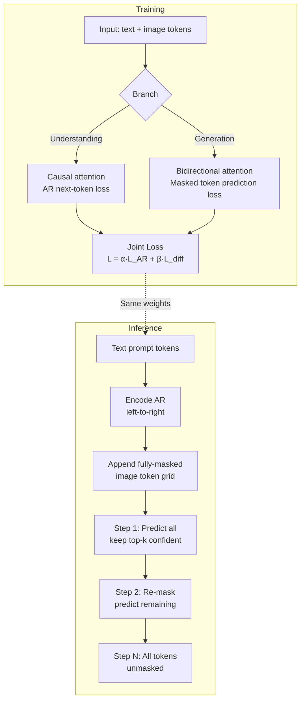

# Show-o and Discrete-Diffusion Unified Models

## Learning Objectives

1. Compare discrete diffusion against continuous diffusion and autoregressive decoding on token sequences
2. Implement a minimal mask–unmask discrete diffusion loop with observable intermediate states
3. Diagram the Show-o dual-branch architecture: autoregressive for understanding, masked diffusion for generation
4. Evaluate when a single unified token vocabulary enables or blocks multi-task training
5. Instrument a training step to log the joint loss (understanding term + generation term) separately

## The Problem

Practitioners building multimodal systems currently maintain two stacks. A vision-language model handles image understanding — VQA, captioning, OCR. A separate diffusion model (Stable Diffusion, DALL-E) handles image generation. Each stack has its own tokenizer, its own training pipeline, its own serving infrastructure, and its own failure modes. When you want a system that both reads an image and generates one — say, "look at this landing page and produce a redesigned version" — you stitch two models together with glue code and hope the representations bridge.

Transfusion (Phase 12) took a step toward unification by training one transformer on both text (next-token prediction) and images (continuous diffusion) simultaneously. But Transfusion mixes discrete and continuous objectives on different numerical scales, and balancing their loss weights requires hyperparameter search. The continuous diffusion loss operates on Gaussian noise levels; the discrete NTP loss operates on token indices. They live in different mathematical spaces.

Show-o (Xie et al., August 2024) takes a different route: keep everything discrete, but generate images in parallel via masked diffusion rather than sequentially token-by-token. Text tokens flow left-to-right (causal attention). Image tokens start fully masked and get unmasked in parallel over a few denoising steps. Both modalities share one transformer, one vocabulary, and one cross-entropy loss formulation — the generation objective is a generalization of the understanding objective, not a different loss function bolted on.

## The Concept

Discrete diffusion replaces the Gaussian noise schedule of continuous diffusion with a Markov chain over token substitutions. Instead of adding Gaussian noise to a continuous latent, you replace tokens with a special `[MASK]` token according to a schedule, then train the model to predict the original token at each masked position. The forward process is deterministic given the schedule; the reverse process is what the transformer learns.

The mathematical core is a transition matrix **Q** of shape `(V+1, V+1)` where V is the vocabulary size and the extra row/column handles the mask token. At timestep *t*, each token either stays itself or transitions to `[MASK]` with probability derived from the schedule. The marginal distribution at timestep *t* — `q(x_t | x_0)` — tells you the probability that any given position is masked after *t* steps. For a cosine schedule, this probability rises slowly at first, then accelerates, then slows near full masking — the same shape used in continuous diffusion but applied to discrete substitutions.

The reverse process asks: given a sequence where some tokens are real and some are `[MASK]`, predict the original token at each masked position. This is structurally identical to what BERT does in masked language modeling. The difference is that during generation, you start from all-mask and iteratively unmask — you don't have the ground-truth context, you have previously predicted tokens as context. MaskGIT (Chang et al., 2022) introduced this iterative parallel decoding for images: at each step, the model predicts all masked positions simultaneously, you keep the *k* most confident predictions, re-mask the rest, and repeat.



Show-o builds on this foundation with a dual-branch architecture. The transformer has a hybrid attention mask: text tokens attend causally (each token sees only tokens to its left), image tokens attend bidirectionally (each image token sees all other image tokens plus all preceding text tokens). During training, the understanding branch computes standard next-token cross-entropy on text tokens given an image input. The generation branch computes masked-token-prediction cross-entropy on image tokens given a text prompt. Both losses are cross-entropy over the same vocabulary — they differ only in which positions contribute to the loss and what attention pattern those positions use.

This is why Show-o can collapse VQA and text-to-image into one checkpoint. The understanding task (image → text) uses causal decoding on text tokens. The generation task (text → image) uses parallel masked decoding on image tokens. The transformer weights are shared; only the attention mask and loss positions differ between tasks. Images are tokenized via MAGVIT-v2 into discrete codes from the same codebook that text tokens draw from — there is no separate image encoder or continuous VAE decoder at inference time.

## Build It

Run these three scripts in sequence. Each prints observable output that demonstrates a different piece of the mechanism.

**Script 1: Minimal discrete diffusion on a toy vocabulary.** This defines a 16-token vocabulary, corrupts a sequence using a linear mask schedule, trains a tiny model to reverse the corruption, and prints the original, corrupted, and recovered sequences at intervals so you can watch learning happen.

```python
import torch
import torch.nn.functional as F

torch.manual_seed(42)
V = 16
L = 12
d = 32
MASK = V

original = torch.randint(0, V, (1, L))

def corrupt(seq, t, T=10):
    frac = t / T
    noise = torch.rand(1, L)
    mask = noise < frac
    if not mask.any():
        mask[0, torch.randint(0, L, (1,))] = True
    corrupted = seq.clone()
    corrupted[mask] = MASK
    return corrupted, mask

class TinyRecoverer(torch.nn.Module):
    def __init__(self, vocab_size, dim):
        super().__init__()
        self.embed = torch.nn.Embedding(vocab_size + 1, dim)
        self.proj = torch.nn.Linear(dim, vocab_size)
    def forward(self, x):
        return self.proj(self.embed(x))

model = TinyRecoverer(V, d)
opt = torch.optim.Adam(model.parameters(), lr=0.03)
T = 10

print(f"Original sequence:  {original[0].tolist()}")
print()

for epoch in range(60):
    t = torch.randint(2, T + 1, (1,)).item()
    corrupted, mask = corrupt(original, t, T)
    logits = model(corrupted)
    mask_idx = mask[0]
    if mask_idx.sum() > 0:
        loss = F.cross_entropy(logits[0][mask_idx], original[0][mask_idx])
    else:
        loss = torch.tensor(0.0, requires_grad=True)
    opt.zero_grad()
    loss.backward()
    opt.step()
    if epoch % 15 == 0 or epoch == 59:
        with torch.no_grad():
            c, m = corrupt(original, T, T)
            logits_full = model(c)
            recovered = logits_full.argmax(dim=-1)
            n_correct = (recovered[0] == original[0]).sum().item()
            print(f"Epoch {epoch:3d} | loss={loss.item():.4f} | correct={n_correct}/{L}")
            print(f"  Corrupted: {c[0].tolist()}")
            print(f"  Recovered: {recovered[0].tolist()}")
            print()
```

**Script 2: Dual-loss instrumented training step.** This mocks a batch containing text tokens and image tokens, computes the understanding loss (causal next-token prediction on text) and the generation loss (masked token prediction on image), and prints both terms plus the weighted sum — the exact observability pattern Show-o's training loop uses.

```python
import torch
import torch.nn.functional as F

torch.manual_seed(7)
V = 1000
TEXT_LEN = 8
IMG_LEN = 16
d_model = 64

class ShowOStep(torch.nn.Module):
    def __init__(self, vocab_size, dim):
        super().__init__()
        self.embed = torch.nn.Embedding(vocab_size + 1, dim)
        self.lm_head = torch.nn.Linear(dim, vocab_size, bias=False)
    def forward(self, tokens, mode):
        h = self.embed(tokens)
        return self.lm_head(h)

model = ShowOStep(V, d_model)
opt = torch.optim.AdamW(model.parameters(), lr=1e-3)
MASK = V

text_input = torch.randint(0, V, (1, TEXT_LEN))
text_target = torch.randint(0, V, (1, TEXT_LEN))
text_target[0, :-1] = text_input[0, 1:]
text_target[0, -1] = torch.randint(0, V, (1,)).item()

img_target = torch.randint(0, V, (1, IMG_LEN))
n_masked = IMG_LEN // 2
mask_positions = torch.randperm(IMG_LEN)[:n_masked]
img_input = img_target.clone()
img_input[0, mask_positions] = MASK

logits_text = model(text_input, "understand")
loss_understand = F.cross_entropy(
    logits_text[0, :-1],
    text_target[0, :-1]
)

logits_img = model(img_input, "generate")
loss_generate = F.cross_entropy(
    logits_img[0, mask_positions],
    img_target[0, mask_positions]
)

alpha = 1.0
beta = 0.5
joint = alpha * loss_understand + beta * loss_generate

opt.zero_grad()
joint.backward()
grad_norm = sum(p.grad.norm().item() for p in model.parameters() if p.grad is not None)
opt.step()

print("=" * 50)
print("DUAL-LOSS TRAINING STEP")
print("=" * 50)
print(f"  loss_understand (AR NTP):     {loss_understand.item():.4f}")
print(f"  loss_generate (masked pred):  {loss_generate.item():.4f}")
print(f"  alpha={alpha}, beta={beta}")
print(f"  joint = {alpha}·L_u + {beta}·L_g = {joint.item():.4f}")
print(f"  total grad norm: {grad_norm:.4f}")
print(f"  text positions contributing:  {TEXT_LEN - 1}")
print(f"  image positions contributing: {n_masked}")
print("=" * 50)
```

**Script 3: Iterative unmasking inference trace.** This shows the parallel decoding loop — start from a fully masked image grid, predict all masked positions at each step, keep the most confident, and print the grid state so you can watch tokens fill in.

```python
import torch
import torch.nn.functional as F

torch.manual_seed(99)
V = 16
GRID = 8
MASK = V
TOTAL = GRID * GRID
STEPS = 5
d_model = 64

model = torch.nn.Sequential(
    torch.nn.Embedding(V + 1, d_model),
    torch.nn.Linear(d_model, V)
)

target = torch.randint(0, V, (1, TOTAL))
grid = torch.full((1, TOTAL), MASK, dtype=torch.long)
symbols = list("0123456789ABCDEF") + ["."]

for _ in range(100):
    t = torch.randint(2, STEPS + 1, (1,)).item()
    frac = t / STEPS
    m = torch.rand(1, TOTAL) < frac
    if not m.any():
        m[0, 0] = True
    inp = target.clone()
    inp[m] = MASK
    logits = model(inp)
    loss = F.cross_entropy(logits[0][m[0]], target[0][m[0]])
    model.zero_grad()
    loss.backward()
    with torch.no_grad():
        for p in model.parameters():
            p -= 0.05 * p.grad

def print_grid(g, label):
    print(f"  {label}")
    for row in range(GRID):
        chars = [symbols[g[0, row * GRID + col].item()] for col in range(GRID)]
        print("  " + " ".join(chars))
    print()

print("Target image (ground truth):")
print_grid(target, "TARGET")

print(f"Inference: {STEPS} parallel denoising steps")
print("=" * 40)

for step in range(STEPS):
    remaining = (grid[0] == MASK).sum().item()
    if remaining == 0:
        break

    with torch.no_grad():
        logits = model(grid)
        probs = F.softmax(logits, dim=-1)
        conf, preds = probs.max(dim=-1)

    n_unmask = max(1, remaining // (STEPS - step))
    mask_pos = (grid[0] == MASK).nonzero(as_tuple=True)[0]
    n_unmask = min(n_unmask, len(mask_pos))
    pos_conf = conf[0, mask_pos]
    top_k = pos_conf.topk(n_unmask).indices
    selected = mask_pos[top_k]
    grid[0, selected] = preds[0, selected]

    correct = (grid[0] == target[0]).sum().item()
    print(f"Step {step + 1}/{STEPS} | unmasked {n_unmask} | "
          f"masked remaining {remaining - n_unmask} | "
          f"correct so far: {correct}/{TOTAL}")
    print_grid(grid, f"GRID @ step {step + 1}")

final_correct = (grid[0] == target[0]).sum().item()
print(f"Final accuracy: {final_correct}/{TOTAL} "
      f"({100 * final_correct / TOTAL:.0f}%)")
```

## Use It

The dual-loss instrumentation pattern in Script 2 — logging the understanding term and generation term separately before combining them — maps directly to how you instrument a multi-step GTM sequence. In Show-o, if `loss_generate` spikes while `loss_understand` stays flat, you know the image branch is degrading without the text branch masking the signal. The same separation principle applies when you monitor a multi-channel outbound sequence: if step 3 (the LinkedIn touch) sees reply rate collapse while steps 1 and 2 hold steady, a blended metric hides the failure but per-step logging isolates it.

This is Zone 12 in the GTM stack: observability, logging, and tracing as the feedback loop that keeps a living GTM system healthy [CITATION NEEDED — concept: Zone 12 observability as living GTM foundation]. The mechanism is identical in both domains. Show-o computes `loss = α · loss_understand + β · loss_generate` but logs both components independently, because a weighted sum can mask one term's divergence behind the other's stability. Your sequence performance dashboard should do the same: compute an aggregate reply rate across all steps, but break it out per step, per channel, per segment — because aggregate metrics hide localized failures.

Reply rate drift is your model degradation signal in the same way that loss drift is Show-o's training instability signal. When Show-o's generation loss starts trending upward across checkpoints, you investigate before the joint loss tells you something is wrong — the joint loss is a lagging indicator because the understanding loss dilutes the signal. When your step-2 email reply rate drops from 4.2% to 2.8% over two weeks, the aggregate sequence reply rate might only dip from 6.1% to 5.4% — still "within acceptable range" on a blended view, but the per-step trace tells you something broke at that specific touchpoint. The tracing setup monitors your sequence performance in real time; reply rate drift is your model degradation signal.

## Ship It

To productionize Show-o-style observability in a GTM pipeline, you need three things: structured per-step logging, a time-series store for drift detection, and alerting thresholds that fire on per-component metrics, not aggregates.

```python
from dataclasses import dataclass, field
from datetime import datetime, timezone
import json

@dataclass
class StepMetric:
    step_name: str
    channel: str
    sent: int
    replied: int
    bounced: int
    timestamp: str = field(default_factory=lambda: datetime.now(timezone.utc).isoformat())

    @property
    def reply_rate(self):
        delivered = self.sent - self.bounced
        return self.replied / delivered if delivered > 0 else 0.0

    def to_log(self):
        return json.dumps({
            "step_name": self.step_name,
            "channel": self.channel,
            "reply_rate": round(self.reply_rate, 4),
            "sent": self.sent,
            "replied": self.replied,
            "bounced": self.bounced,
            "ts": self.timestamp
        })

class SequenceMonitor:
    def __init__(self, baseline_window=14, drift_threshold=0.25):
        self.baseline_window = baseline_window
        self.drift_threshold = drift_threshold
        self.history = []

    def log(self, metric):
        self.history.append(metric)
        print(metric.to_log())

    def check_drift(self, step_name):
        step_records = [m for m in self.history if m.step_name == step_name]
        if len(step_records) < self.baseline_window * 2:
            return None
        recent = step_records[-7:]
        baseline = step_records[-self.baseline_window - 7:-7]
        if not baseline:
            return None
        avg_recent = sum(m.reply_rate for m in recent) / len(recent)
        avg_baseline = sum(m.reply_rate for m in baseline) / len(baseline)
        if avg_baseline == 0:
            return None
        drift = (avg_recent - avg_baseline) / avg_baseline
        status = "OK" if abs(drift) < self.drift_threshold else "DRIFT"
        print(f"[{status}] {step_name}: recent={avg_recent:.4f} "
              f"baseline={avg_baseline:.4f} drift={drift:+.1%}")
        return drift

monitor = SequenceMonitor(baseline_window=7, drift_threshold=0.20)

steps = ["email_1", "linkedin", "email_2", "call"]
rates = [0.045, 0.082, 0.031, 0.012]

for week in range(3):
    for step_name, base_rate in zip(steps, rates):
        rate = base_rate * (1.0 - 0.08 * week) if step_name == "email_2" else base_rate
        sent = 200
        replied = int(sent * rate)
        bounced = 4
        m = StepMetric(step_name, "outbound", sent, replied, bounced)
        monitor.log(m)

print()
print("DRIFT CHECK (per-step, not aggregate):")
for s in steps:
    monitor.check_drift(s)
```

This is the same pattern as the dual-loss logging in Script 2, applied to outbound. Each step's reply rate is logged independently — the way Show-o logs `loss_understand` and `loss_generate` independently. The drift check compares recent against baseline per step, not on the aggregate — because aggregate drift detection lags behind localized failures. If `email_2` is degrading, you see it in the per-step trace before it drags down the sequence-level metric enough to trigger an aggregate alert.

The production version of this lives in whatever observability stack your team uses — Datadog, Grafana, Postgres + a cron job, or a Clay webhook that writes to a sheet. The mechanism is the same: log components separately, detect drift on components not aggregates, alert early on per-step signals. [CITATION NEEDED — concept: Zone 12 pipeline health monitoring tooling recommendations in 80/20 GTM Engineer Handbook].

## Exercises

1. **Modify the mask schedule.** In Script 1, replace the linear schedule (`frac = t / T`) with a cosine schedule: `frac = 0.5 * (1 - math.cos(math.pi * t / T))`. Run both versions and compare how many epochs each takes to reach 100% recovery. Does cosine masking learn faster, slower, or the same? Why?

2. **Break the loss balance.** In Script 2, set `beta = 5.0` (heavily weight generation loss) and then `beta = 0.01` (almost ignore generation). Observe the gradient norms. Which parameter group gets larger updates when beta is high? What does this tell you about why Show-o's authors had to tune alpha and beta?

3. **Add a third task.** Show-o handles T2I, VQA, and inpainting in one checkpoint. Modify Script 2 to add a third loss term for inpainting: some image tokens are real (context), some are masked (to predict). Compute `loss_inpaint` and add it to the joint loss with a gamma weight. Print all three terms separately.

4. **Implement confidence-based ordering.** In Script 3, the sampler unmasks the top-k most confident predictions at each step. Modify it to unmask random positions instead. Compare final accuracy between confidence-based and random ordering. Does confidence-based sampling help?

5. **Compare parallel vs. sequential decoding.** Modify Script 3 to unmask tokens one at a time (left-to-right, autoregressive) instead of in parallel batches. Count the total forward passes needed. How many fewer forward passes does parallel decoding require for the same grid?

## Key Terms

**Discrete diffusion** — A diffusion process where the forward corruption replaces tokens with a `[MASK]` token according to a schedule, and the reverse process predicts original tokens at masked positions. No Gaussian noise, no continuous latents.

**Transition matrix Q** — A `(V+1) × (V+1)` matrix defining the probability of each token transitioning to every other token (including mask) at each diffusion step. The marginal `q(x_t | x_0)` is derived from powers of Q.

**Mask schedule** — The function controlling what fraction of tokens are masked at each timestep. Linear (`t/T`), cosine (`0.5(1 - cos(πt/T))`), and truncated variants affect sample quality and training dynamics.

**MaskGIT** — Chang et al. (2022). Introduced iterative parallel decoding for images: predict all masked positions, keep the top-k most confident, re-mask the rest, repeat. Show-o's image generation branch is architecturally descended from this.

**MAGVIT-v2** — A video/image tokenizer that compresses visual inputs into discrete token codes from a learned vocabulary. Show-o uses it to produce image tokens that share the same codebook space as text BPE tokens.

**Hybrid attention mask** — Show-o's attention pattern where text tokens use causal (left-to-right) masking and image tokens use bidirectional masking within the same forward pass. Enables autoregressive understanding and parallel generation in one transformer.

**Joint loss** — The Show-o training objective: `L = α · L_understand + β · L_generate`, where both terms are cross-entropy over the shared vocabulary but operate on different token positions with different attention patterns.

## Sources

- Xie et al., "Show-o: One Single Transformer to Unify Multimodal Understanding and Generation," arXiv:2408.12528, August 2024 — [Search pointer: arxiv 2408.12528]
- Chang et al., "MaskGIT: Masked Generative Image Transformer," CVPR 2022 — [Search pointer: MaskGIT masked generative image transformer]
- Saruggia, Michael. "The 80/20 GTM Engineer Handbook," Growth Lead LLC, 2025–2026 — Zone 12: Observability, logging, tracing as living GTM foundation [CITATION NEEDED — concept: Zone 12 per-step pipeline health monitoring and reply rate drift detection in the 80/20 GTM Handbook]