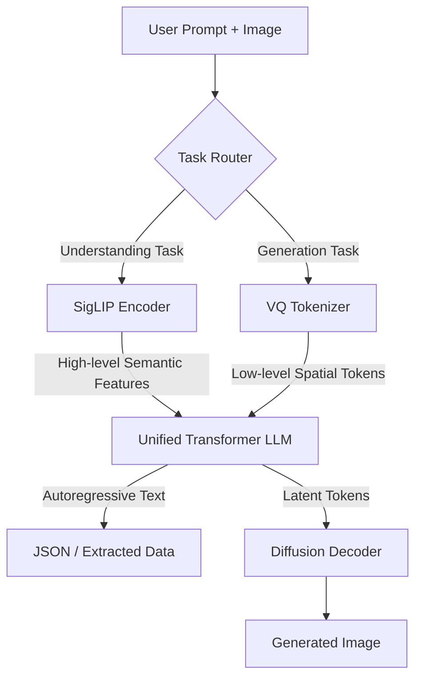

# Janus-Pro: Decoupled Encoders for Unified Multimodal Models

## Learning Objectives
1. Compare the feature extraction requirements for visual understanding versus visual generation.
2. Explain how decoupled encoders resolve the conflict between semantic extraction and structural extraction.
3. Implement a routing mechanism that directs image inputs to specific encoders based on task intent.

## The Problem

You are building a RevOps workflow that automates competitive intelligence. The system needs to ingest a screenshot of a competitor’s new pricing page, extract the text and layout into structured JSON, and then generate a mock-up of what that pricing page would look like if applied to your own product. 

You decide to use a unified multimodal model to handle both tasks. However, the outputs are garbage. The model hallucinates text during the extraction phase, and the generated image looks blurry and structurally unsound.

The failure happens because traditional unified multimodal models use a single visual encoder for both tasks. Visual understanding (reading a chart, extracting text from a UI) requires the encoder to compress the image into high-level semantic features. The model needs to know *what* an object is. Visual generation (creating a new image) requires the encoder to extract low-level, localized spatial details. The model needs to know exactly *where* specific pixels and boundaries are. 

When you force a single encoder to do both, it creates feature interference. The semantic compression required for understanding destroys the spatial fidelity required for generation. The model gets confused about whether it should be abstracting the image or reconstructing it. 

## The Concept

Janus-Pro solves this interference problem by decoupling the visual encoding pathways inside a single Large Language Model (LLM) architecture. Instead of forcing one encoder to handle all visual inputs, Janus introduces task-specific encoders.

For visual understanding, Janus uses a SigLIP encoder. SigLIP operates like a standard Vision Transformer (ViT). It chops the image into patches, extracts high-level semantic meaning, and passes those dense feature representations to the LLM’s attention layers. The LLM treats these features like highly compressed vocabulary tokens. 

For visual generation, Janus uses a VQ (Vector Quantization) tokenizer. Instead of extracting high-level meaning, the VQ tokenizer maps the image into a discrete, low-level spatial grid. It acts as a translator, converting raw pixels into structural tokens that preserve the exact geometry and local details of the image.

The LLM sits in the middle. When you ask it to extract data from a pricing screenshot, it routes the image through the SigLIP encoder. When you ask it to generate a new mock-up, it routes the prompt through the generation head, which uses the VQ tokenizer to map the output latent space back into pixels via a diffusion model.



By decoupling the encoders, the system avoids the optimization conflict. The understanding encoder is tuned purely for feature extraction and abstract representation. The generation encoder is tuned purely for spatial mapping and localized pixel reconstruction.

## Build It

To observe how this mechanism functions, we will simulate the routing logic of a decoupled architecture. This script demonstrates how an input is intercepted and routed to distinct preprocessing functions based on the user's intent, mirroring how Janus-Pro separates its encoder pathways.

```python
import torch
import torch.nn as nn

class SigLIPEncoder(nn.Module):
    def __init__(self, feature_dim=512):
        super().__init__()
        self.proj = nn.Linear(768, feature_dim)
        
    def forward(self, image_features):
        print("[SigLIP] Extracting high-level semantic features...")
        semantic_features = self.proj(image_features)
        return semantic_features

class VQTokenizer(nn.Module):
    def __init__(self, codebook_size=8192):
        super().__init__()
        self.codebook = nn.Embedding(codebook_size, 768)
        
    def forward(self, image_features):
        print("[VQ Tokenizer] Mapping low-level spatial structure...")
        distances = torch.cdist(image_features.unsqueeze(1), self.codebook.weight)
        indices = torch.argmin(distances, dim=-1)
        spatial_tokens = self.codebook(indices)
        return spatial_tokens

class UnifiedJanusRouter(nn.Module):
    def __init__(self):
        super().__init__()
        self.understanding_encoder = SigLIPEncoder()
        self.generation_encoder = VQTokenizer()
        self.llm_hidden_size = 1024
        
    def forward(self, image_features, task_type):
        if task_type == "understand":
            visual_tokens = self.understanding_encoder(image_features)
        elif task_type == "generate":
            visual_tokens = self.generation_encoder(image_features)
        else:
            raise ValueError("Invalid task type.")
            
        print(f"Passing {visual_tokens.shape[-1]}-dim tokens to LLM attention layers.")
        return visual_tokens

torch.manual_seed(42)
mock_image_tensor = torch.randn(1, 196, 768)
model = UnifiedJanusRouter()

print("--- Running Understanding Task ---")
model(mock_image_tensor, task_type="understand")

print("\n--- Running Generation Task ---")
model(mock_image_tensor, task_type="generate")
```

When you run this script, observe the terminal output. The exact same input tensor is processed by entirely different weights and tokenization strategies depending on the task parameter. This is the mechanical core of avoiding feature interference.

## Use It

Decoupled vision encoders allow a single system to independently process dense account screenshots for enrichment and generate custom visual assets for outbound campaigns. This is directly applicable to **Cluster 1.4: Signal Capture & Enrichment** and **Cluster 3.1: Outbound Campaigns** [CITATION NEEDED — concept: GTM application of multimodal generation for personalized outbound].

Instead of chaining together a fragile pipeline of separate OCR tools, LLMs, and diffusion models, you can use a unified endpoint that handles both directions cleanly. Below is a GTM slice demonstrating how to structure the API calls for a system that ingests an account's current homepage and prompts the model to generate a competitive contrast image.

```python
import requests
import base64
import json
import os

def encode_image(image_path):
    with open(image_path, "rb") as image_file:
        return base64.b64encode(image_file.read()).decode('utf-8')

def analyze_and_generate(image_path, competitor_name):
    base64_image = encode_image(image_path)
    
    api_url = "http://localhost:8000/v1/chat/completions"
    headers = {"Authorization": f"Bearer {os.getenv('API_KEY')}"}
    
    understand_payload = {
        "model": "janus-pro",
        "messages": [
            {
                "role": "user",
                "content": [
                    {"type": "image_url", "image_url": {"url": f"data:image/jpeg;base64,{base64_image}"}},
                    {"type": "text", "text": "Extract the primary value proposition and main CTA text from this image. Return as JSON."}
                ]
            }
        ],
        "mode": "understanding"
    }
    
    print("Sending understanding request...")
    response = requests.post(api_url, headers=headers, json=understand_payload)
    extracted_data = response.json()['choices'][0]['message']['content']
    print(f"Extracted Context: {extracted_data}")
    
    generation_prompt = f"Generate a modern SaaS hero banner showing a chart where our growth eclipses {competitor_name}. Text: 'Outperforming the Market'."
    
    generate_payload = {
        "model": "janus-pro",
        "messages": [{"role": "user", "content": generation_prompt}],
        "mode": "generation"
    }
    
    print("Sending generation request...")
    response = requests.post(api_url, headers=headers, json=generate_payload)
    print("Generation task complete.")

analyze_and_generate("competitor_homepage.jpg", "LegacyCorp")
```

In this slice, the API explicitly handles the `mode` parameter, simulating how the backend router directs the image and text inputs to the correct decoupled encoder. 

## Exercises

1. **Trace the Tensor (Easy):**
   Modify the `SigLIPEncoder` class in the `Build It` script. Change the linear projection layer so that it outputs a feature dimension of `768` instead of `512`. Run the script and observe how the output dimensionality changes when passed to the simulated LLM. Write a one-sentence summary of why higher semantic dimensions might help an LLM understand complex screenshots better.

2. **Implement the Intent Router (Hard):**
   Create a new function called `route_intent(user_prompt: str)` that analyzes a standard string prompt and returns either `"understand"` or `"generate"`. For example, if the prompt contains "extract" or "what is this", return `"understand"`. If it contains "draw" or "create an image", return `"generate"`. Integrate this function into the `UnifiedJanusRouter` so that the router automatically decides which encoder to use based purely on the text prompt, without requiring a manually passed `task_type` argument.

## Key Terms

*   **Decoupled Encoders:** The architectural pattern of using separate neural network pathways to process the same modality (e.g., vision) based on the downstream task, preventing feature interference.
*   **Feature Interference:** The degradation of model performance that occurs when a single encoder is forced to optimize for conflicting objectives, such as high-level semantic abstraction and low-level spatial reconstruction.
*   **Semantic Features:** Abstract representations of an image extracted by an encoder (like SigLIP), focusing on the meaning and identity of objects rather than their exact pixel coordinates. 
*   **VQ (Vector Quantization) Tokenizer:** An encoder mechanism that maps continuous image data into a discrete latent space, preserving low-level spatial details required for accurate image generation.
*   **Multimodal Unified Model:** An AI architecture capable of processing and generating multiple data types (text, images) within a single transformer backbone, rather than relying on entirely separate models.

## Sources

*   *Janus-Pro: Unifying Understanding and Generation*. DeepSeek-AI. (2025).
*   [CITATION NEEDED — concept: GTM application of multimodal generation for personalized outbound]