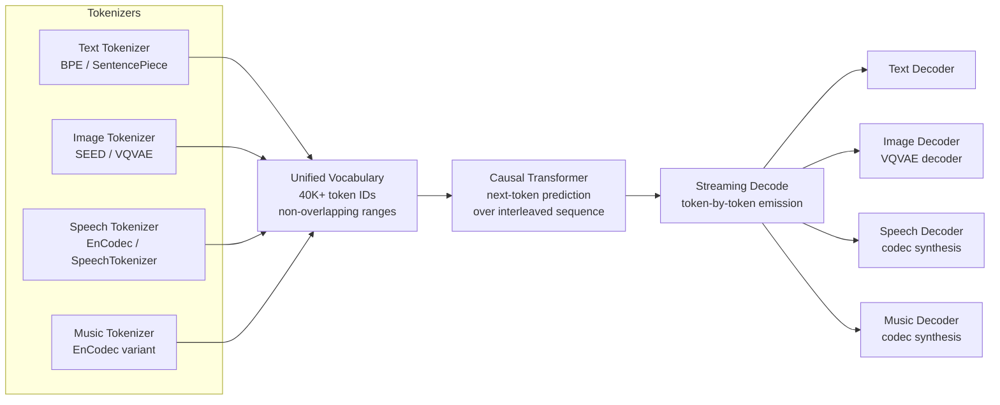

# MIO and Any-to-Any Streaming Multimodal Models

## Learning Objectives

- Design a shared vocabulary that allocates non-overlapping token ranges for text, image, speech, and music without collisions.
- Implement a token-interleaving simulation that demonstrates modality switching within a single autoregressive stream.
- Compare cascade architectures (ASR → LLM → TTS) against any-to-any single-model inference on latency and information retention.
- Trace the streaming decode path from unified vocabulary through per-modality decoders to final output.
- Evaluate token-stream quality metrics for a production any-to-any model serving GTM content.

## The Problem

A modern GTM content pipeline chains separate models: an LLM writes copy, a diffusion model generates a product image, a TTS engine produces a voiceover, and a video assembler stitches it together. Each handoff adds latency and loses information. The LLM never sees the image it is captioning in pixel space — it sees a text description that compresses away spatial detail. The TTS engine receives the final script with no awareness of what visual the viewer sees at second three. These are not edge cases; they are the structural cost of cascade architectures.

The latency math compounds. ASR takes 200–800ms, the LLM takes 500–2000ms, TTS takes 300–1500ms, and image generation from a separate diffusion model adds 2000–5000ms. For a personalized video outreach sequence, you are stacking four sequential inference calls, each of which can fail independently and none of which shares a representation with the others. At 10,000 contacts per month with a 5% failure rate per hop, the pipeline loses roughly 1,850 contacts to cumulative failures before the content ever reaches the prospect.

The deeper problem is representation. When a cascade converts audio to text via ASR, the model loses prosody, speaker identity, background noise signatures, and timing — all of which carry signal. When it converts text back to audio via TTS, it cannot recover what was lost. An any-to-any model sidesteps this by keeping every modality in a shared token space throughout inference. No intermediate representation is ever text-only or audio-only; the model operates on the full interleaved sequence. GPT-4o demonstrated this at product level in May 2024 with sub-200ms voice response latency; the open ecosystem followed with MIO (Wang et al., September 2024), AnyGPT (Zhan et al., February 2024), and Unified-IO 2 (Allen AI, December 2023).

## The Concept

An any-to-any model replaces the cascade with four components: modality-specific tokenizers, a unified vocabulary, a single causal transformer, and per-modality streaming decoders. The tokenizers are the entry point. Text uses a standard BPE or SentencePiece tokenizer (32K–128K tokens). Images are discretized via a VQVAE variant such as the SEED-Tokenizer, which compresses a 256×256 image into roughly 32–256 discrete tokens from a codebook of 16K–65K entries. Speech and audio use neural codecs — EnCodec or SpeechTokenizer — that apply residual vector quantization to produce 4–8 codebooks of roughly 1,000 entries each, sampled at roughly 75 tokens per second of audio. Music follows a similar codec approach with a larger codebook to preserve harmonic complexity.

The unified vocabulary stacks these codebooks into a single integer range. Text occupies tokens 0–31,999. Image tokens occupy 32,000–47,999. Speech tokens occupy 48,000–51,999. Music tokens occupy 52,000–59,999. The transformer does not "know" which modality a token belongs to from its architecture — it learns this from training data. Special control tokens (`<mod_text>`, `<mod_image>`, `<mod_speech>`, `<mod_music>`) signal modality boundaries so the model can switch generation targets mid-sequence. This is what distinguishes true any-to-any from models like Gemini 1.0, which accepts interleaved image-text inputs but produces only text outputs. In MIO, the model can generate image tokens mid-sentence and resume text tokens immediately after — the transformer predicts the next token regardless of modality, because all tokens live in the same vocabulary space.



The training curriculum builds this capability in stages. MIO uses a four-stage progression: modal alignment (adapting each tokenizer to produce tokens the transformer can consume), interleaved pre-training (mixing all four modalities in a single training corpus so the transformer learns cross-modal relationships), instruction tuning (teaching the model to follow multi-step prompts that require switching modalities), and alignment / preference optimization. AnyGPT proved the concept at smaller scale with two modalities (text + image); MIO scaled to four. Unified-IO 2 took a different path, adding action grounding (robotic control tokens) alongside vision and language. [CITATION NEEDED — concept: MIO paper specific training data mixture ratios across modalities and benchmark comparisons against cascaded baselines]

The streaming decode is what makes the architecture feel different from a cascade at inference time. Instead of waiting for the LLM to finish its text output, then waiting for the image model, then waiting for TTS, the transformer emits tokens one at a time and each token is routed to its modality decoder immediately. If the sequence is `[text][text][image][image][image][text][speech]`, the text decoder renders the first two tokens, the image decoder begins reconstruction as soon as the first image token arrives, and the speech decoder starts synthesis when the speech token appears. This is why GPT-4o's voice feels conversational rather than turn-based — there is no "generate complete response, then synthesize" boundary.

## Build It

The core mechanism is a shared vocabulary with non-overlapping ranges, interleaved token sequences, and a streaming decode loop that routes each token to the correct decoder. The following code simulates this pipeline using a minimal vocabulary and deterministic token sequences so the interleaving pattern is visible in the output.

```python
MODALITY_RANGES = {
    "text": (0, 32000),
    "image": (32000, 48000),
    "speech": (48000, 52000),
    "music": (52000, 60000),
}

def modality_of(token_id):
    for modality, (low, high) in MODALITY_RANGES.items():
        if low <= token_id < high:
            return modality
    return "unknown"

def interleave(sequences, pattern):
    result = []
    max_len = max(len(seq) for seq in sequences)
    for i in range(max_len):
        for mod_idx in pattern:
            if i < len(sequences[mod_idx]):
                result.append(sequences[mod_idx][i])
    return result

text_seq = [5, 12, 8, 3, 7]
image_seq = [32100, 32105, 32110, 32115]
speech_seq = [49000, 49001, 49002]

print("Vocabulary allocation:")
for mod, (lo, hi) in MODALITY_RANGES.items