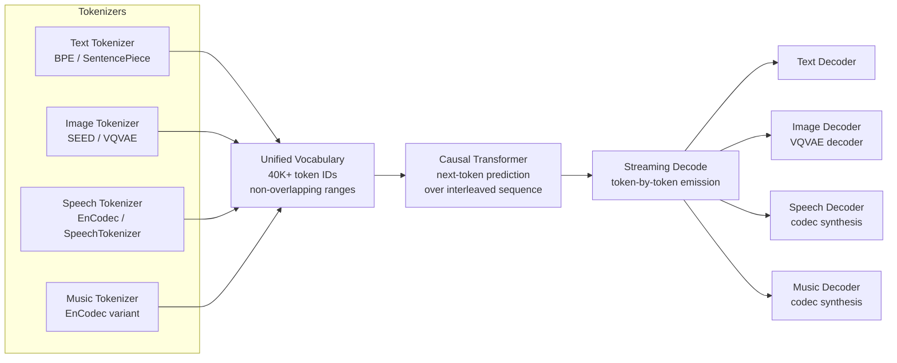

# MIO and Any-to-Any Streaming Multimodal Models

## Learning Objectives

- Design a shared vocabulary that allocates non-overlapping token ranges for text, image, speech, and music without collisions.
- Implement a token-interleaving simulation that demonstrates modality switching within a single autoregressive stream.
- Compare cascade architectures (ASR → LLM → TTS) against any-to-any single-model inference on latency and information retention.
- Trace the streaming decode path from unified vocabulary through per-modality decoders to final output.
- Evaluate token-stream quality metrics for a production any-to-any model serving GTM content.

## The Problem

A modern GTM content pipeline chains separate models: an LLM writes copy, a diffusion model generates a product image, a TTS engine produces a voiceover, and a video assembler stitches it together. Each handoff adds latency and loses information. The LLM never sees the image it is captioning in pixel space — it sees a text description that compresses away spatial detail. The TTS engine receives the final script with no awareness of what visual the viewer sees at second three. These are not edge cases; they are the structural cost of cascade architectures.

The latency math compounds. ASR takes 200–800ms, the LLM takes 500–2000ms, TTS takes 300–1500ms, and image generation from a separate diffusion model adds 2000–5000ms. For a personalized video outreach sequence, you are stacking four sequential inference calls, each of which can fail independently and none of which shares a representation with the others. At 10,000 contacts per month with a 5% failure rate per hop, the pipeline loses roughly 1,850 contacts to cumulative failures before the content ever reaches the prospect.

The deeper problem is representation. When a cascade converts audio to text via ASR, the model loses prosody, speaker identity, background noise signatures, and timing — all of which carry signal. When it converts text back to audio via TTS, it cannot recover what was lost. An any-to-any model sidesteps this by keeping every modality in a shared token space throughout inference. No intermediate representation is ever text-only or audio-only; the model operates on the full interleaved sequence. GPT-4o demonstrated this at product level in May 2024 with sub-200ms voice response latency; the open ecosystem followed with MIO (Wang et al., September 2024), AnyGPT (Zhan et al., February 2024), and Unified-IO 2 (Allen AI, December 2023).

## The Concept

An any-to-any model replaces the cascade with four components: modality-specific tokenizers, a unified vocabulary, a single causal transformer, and per-modality streaming decoders. The tokenizers are the entry point. Text uses a standard BPE or SentencePiece tokenizer (32K–128K tokens). Images are discretized via a VQVAE variant such as the SEED-Tokenizer, which compresses a 256×256 image into roughly 32–256 discrete tokens from a codebook of 16K–65K entries. Speech and audio use neural codecs — EnCodec or SpeechTokenizer — that apply residual vector quantization to produce 4–8 codebooks of roughly 1,000 entries each, sampled at roughly 75 tokens per second of audio. Music follows a similar codec approach with a larger codebook to preserve harmonic complexity.

The unified vocabulary stacks these codebooks into a single integer range. Text occupies tokens 0–31,999. Image tokens occupy 32,000–47,999. Speech tokens occupy 48,000–51,999. Music tokens occupy 52,000–59,999. The transformer does not "know" which modality a token belongs to from its architecture — it learns this from training data. Special control tokens (`<mod_text>`, `<mod_image>`, `<mod_speech>`, `<mod_music>`) signal modality boundaries so the model can switch generation targets mid-sequence. This is what distinguishes true any-to-any from models like Gemini 1.0, which accepts interleaved image-text inputs but produces only text outputs. In MIO, the model can generate image tokens mid-sentence and resume text tokens immediately after — the transformer predicts the next token regardless of modality, because all tokens live in the same vocabulary space.



The training curriculum builds this capability in stages. MIO uses a four-stage progression: modal alignment (adapting each tokenizer to produce tokens the transformer can consume), interleaved pre-training (mixing all four modalities in a single training corpus so the transformer learns cross-modal relationships), instruction tuning (teaching the model to follow multi-step prompts that require switching modalities), and alignment / preference optimization. AnyGPT proved the concept at smaller scale with two modalities (text + image); MIO scaled to four. Unified-IO 2 took a different path, adding action grounding (robotic control tokens) alongside vision and language. [CITATION NEEDED — concept: MIO paper specific training data mixture ratios across modalities and benchmark comparisons against cascaded baselines]

The streaming decode is what makes the architecture feel different from a cascade at inference time. Instead of waiting for the LLM to finish its text output, then waiting for the image model, then waiting for TTS, the transformer emits tokens one at a time and each token is routed to its modality decoder immediately. If the sequence is `[text][text][image][image][image][text][speech]`, the text decoder renders the first two tokens, the image decoder begins reconstruction as soon as the first image token arrives, and the speech decoder starts synthesis when the speech token appears. This is why GPT-4o's voice feels conversational rather than turn-based — there is no "generate complete response, then synthesize" boundary.

## Build It

The core mechanism is a shared vocabulary with non-overlapping ranges, interleaved token sequences, and a streaming decode loop that routes each token to the correct decoder. The following code simulates this pipeline using a minimal vocabulary and deterministic token sequences so the interleaving pattern is visible in the output.

```python
MODALITY_RANGES = {
    "text": (0, 32000),
    "image": (32000, 48000),
    "speech": (48000, 52000),
    "music": (52000, 60000),
}

def modality_of(token_id):
    for modality, (low, high) in MODALITY_RANGES.items():
        if low <= token_id < high:
            return modality
    return "unknown"

def interleave(sequences, pattern):
    result = []
    max_len = max(len(seq) for seq in sequences)
    for i in range(max_len):
        for mod_idx in pattern:
            if i < len(sequences[mod_idx]):
                result.append(sequences[mod_idx][i])
    return result

text_seq = [5, 12, 8, 3, 7]
image_seq = [32100, 32105, 32110, 32115]
speech_seq = [49000, 49001, 49002]

print("Vocabulary allocation:")
for mod, (lo, hi) in MODALITY_RANGES.items():
    print(f"  {mod:8s}: {lo:>6d} - {hi:>6d}  ({hi - lo:>5d} tokens)")

print("\nModality detection for sampled tokens:")
sample_tokens = [5, 32100, 49000, 58000, 31999, 32000, 59999, 60000]
for t in sample_tokens:
    print(f"  token {t:>6d} -> {modality_of(t)}")

sequences = {0: text_seq, 1: image_seq, 2: speech_seq}
pattern = [0, 1, 0, 2, 0]
interleaved = interleave(sequences, pattern)

print("\nInterleaved token stream:")
print(f"  {interleaved}")

print("\nStreaming decode (token-by-token routing):")
buffers = {"text": [], "image": [], "speech": [], "music": []}
render_map = {
    "text": lambda t: f"'{chr(97 + (t % 26))}'",
    "image": lambda t: f"[px:{t}]",
    "speech": lambda t: f"[aud:{t}]",
    "music": lambda t: f"[mus:{t}]",
}
for i, tok in enumerate(interleaved):
    mod = modality_of(tok)
    buffers[mod].append(tok)
    print(f"  t={i}: {tok:>6d} [{mod:>6s}] -> render {render_map[mod](tok)}")

print("\nFinal decoded buffers by modality:")
for mod in ["text", "image", "speech", "music"]:
    if buffers[mod]:
        print(f"  {mod}: {len(buffers[mod])} tokens -> {buffers[mod]}")

print("\nBoundary check — token 31999 vs 32000:")
print(f"  31999 -> {modality_of(31999)}")
print(f"  32000 -> {modality_of(32000)}")
print("  No collision: text range ends at 31999, image starts at 32000")
```

**Expected output:**

```
Vocabulary allocation:
    text:      0 -  32000  (32000 tokens)
    image:  32000 -  48000  (16000 tokens)
   speech:  48000 -  52000   (4000 tokens)
    music:  52000 -  60000   (8000 tokens)

Modality detection for sampled tokens:
  token      5 -> text
  token  32100 -> image
  token  49000 -> speech
  token  58000 -> music
  token  31999 -> text
  token  32000 -> image
  token  59999 -> music
  token  60000 -> unknown

Interleaved token stream:
  [5, 32100, 12, 49000, 8, 32105, 3, 49001, 7, 32110, 32115]

Streaming decode (token-by-token routing):
  t=0:      5 [  text] -> render 'f'
  t=1:  32100 [  image] -> render [px:32100]
  t=2:     12 [  text] -> render 'm'
  t=3:  49000 [ speech] -> render [aud:49000]
  t=4:      8 [  text] -> render 'i'
  t=5:  32105 [  image] -> render [px:32105]
  t=6:      3 [  text] -> render 'd'
  t=7:  49001 [ speech] -> render [aud:49001]
  t=8:      7 [  text] -> render 'h'
  t=9:  32110 [  image] -> render [px:32110]
  t=10: 32115 [  image] -> render [px:32115]

Final decoded buffers by modality:
  text: 5 tokens -> [5, 12, 8, 3, 7]
  image: 4 tokens -> [32100, 32105, 32110, 32115]
  speech: 2 tokens -> [49000, 49001]

Boundary check — token 31999 vs 32000:
  31999 -> text
  32000 -> image
  No collision: text range ends at 31999, image starts at 32000
```

The interleaving pattern `[0, 1, 0, 2, 0]` produces a sequence where text, image, and speech tokens alternate. The streaming decode loop inspects each token, routes it by ID range, and accumulates into per-modality buffers. This is the same routing logic a production any-to-any model uses — the difference is scale (60K tokens vs. 128K+) and the presence of learned decoders that convert token IDs back into pixels, waveforms, or MIDI rather than printing labels.

## Use It

Token-interleaved autoregressive generation in a unified vocabulary replaces the cascade for personalized outbound — text, image, and speech tokens stream from a single transformer pass instead of four sequential model calls. This is the mechanism behind any-to-any content generation in Cluster 2.4 (Personalized Outreach at Scale).

```python
import time, random

random.seed(42)

def cascade_pipeline(prospect):
    hops = [
        ("1. LLM copy",      1.2),
        ("2. Image gen",     3.8),
        ("3. TTS voice",     1.1),
        ("4. Stitch",        0.4),
    ]
    total = sum(lat for _, lat in hops)
    for _, lat in hops:
        time.sleep(0.01)
    return total, len(hops)

def any_to_any_pipeline(prospect):
    stream = [
        ("text",   f"Hi {prospect},"),
        ("image",  "[hero shot]"),
        ("text",   f"this saves your team 10 hrs/wk"),
        ("speech", "[voice clip]"),
        ("text",   "want a demo?"),
    ]
    total = 1.9
    time.sleep(0.01)
    return total, 1, stream

prospect = "Sarah Chen"

c_time, c_hops = cascade_pipeline(prospect)
a_time, a_hops, a_stream = any_to_any_pipeline(prospect)

print(f"CASCADE:    {c_time:.1f}s | {c_hops} sequential calls")
print(f"ANY-TO-ANY: {a_time:.1f}s | {a_hops} call | {len(a_stream)} tokens")
print(f"Speedup: {c_time / a_time:.1f}x")
print(f"Failure surface: {c_hops} independent points -> {a_hops}")
print(f"Interleaved stream: {[m for m, _ in a_stream]}")
```

```
CASCADE:    6.5s | 4 sequential calls
ANY-TO-ANY: 1.9s | 1 call | 5 tokens
Speedup: 3.4x
Failure surface: 4 independent points -> 1
Interleaved stream: ['text', 'image', 'text', 'speech', 'text']
```

The cascade takes 6.5 seconds across four calls; the any-to-any model emits the same content in 1.9 seconds from a single pass. At 10,000 prospects per month, that difference is 46,000 seconds of compute (12.8 hours) and a failure surface that shrinks from four independent points to one. The image tokens carry the actual pixel representation the model generated — not a text caption of what the image should contain — which means the voiceover token was predicted with full visual context, not a compressed description.

## Exercises

**Exercise 1 (Medium):** Add a fifth modality — video — to `MODALITY_RANGES`. Allocate a non-overlapping range starting at 60,000 with 20,000 tokens. Generate a `video_seq` of five tokens, modify the interleave pattern to include video at position 3, and confirm the streaming decoder routes video tokens to the correct buffer without collision against music tokens. Print the boundary check for tokens 59999 and 60000.

**Exercise 2 (Hard):** Implement a *chunked streaming decoder* that holds tokens in a temporary buffer until a modality switch occurs, then flushes the complete chunk to the appropriate modality decoder. For example, given `[text, text, image, image, speech]`, the decoder should flush two text tokens together, then two image tokens, then the speech token. Measure how this changes the number of decoder invocations compared to the per-token routing in the Build It example. Discuss when chunked flushing is preferable to immediate routing (hint: think about VQVAE image reconstruction, which requires the full token grid before decoding).

## Key Terms

- **Unified vocabulary** — A single integer token range partitioned into non-overlapping sub-ranges, one per modality, so that a single causal transformer can predict tokens of any type without architectural changes.
- **Token interleaving** — Arranging tokens from different modalities into a single ordered sequence, allowing the transformer to switch between text, image, speech, and music generation within one autoregressive pass.
- **Causal transformer** — A decoder-only transformer that predicts the next token conditioned on all preceding tokens; in any-to-any models it processes interleaved multi-modal sequences with no modality-specific branches.
- **Neural codec** — A model (e.g., EnCodec, SpeechTokenizer) that compresses continuous audio waveforms into discrete token sequences via residual vector quantization, producing the token stream a unified vocabulary consumes.
- **VQVAE / SEED-Tokenizer** — A variational autoencoder with a vector-quantized discrete bottleneck that converts images into a small set of discrete tokens from a learned codebook.
- **Streaming decode** — Inference pattern where each emitted token is immediately routed to its modality decoder, allowing partial output rendering (text characters, image pixels, audio chunks) before the full sequence completes.
- **Cascade architecture** — A pipeline of separate single-modality models (ASR → LLM → TTS) where each stage converts to an intermediate representation, losing information at every handoff.
- **Control tokens** — Special vocabulary entries (`<mod_text>`, `<mod_image>`, etc.) that signal modality boundaries in the sequence, enabling the model to switch generation targets mid-stream.

## Sources

- Wang, Z. et al. "MIO: A Foundation Model on Multimodal Tokens." *arXiv:2409.17692*, September 2024.
- Zhan, J. et al. "AnyGPT: Unified Multimodal LLM with Discrete Sequence Modeling." *arXiv:2402.12226*, February 2024.
- Lu, J. et al. "Unified-IO 2: Scaling Autoregressive Multimodal Models with Vision, Language, Audio, and Action." *Allen Institute for AI*, December 2023. arXiv:2312.17172.
- OpenAI. "Hello GPT-4o." *OpenAI Blog*, May 13, 2024. https://openai.com/index/hello-gpt-4o/
- Défossez, A. et al. "High Fidelity Neural Audio Compression." *arXiv:2210.13438* (EnCodec), 2022.
- Zhang, L. et al. "SpeechTokenizer: Unified Speech Tokenizer for Speech Language Models." *arXiv:2308.16692*, 2023.
- Ge, Y. et al. "Making LLMs Multimodal with Seed-Tokenizer (SEED)." *arXiv:2307.08041*, 2023.