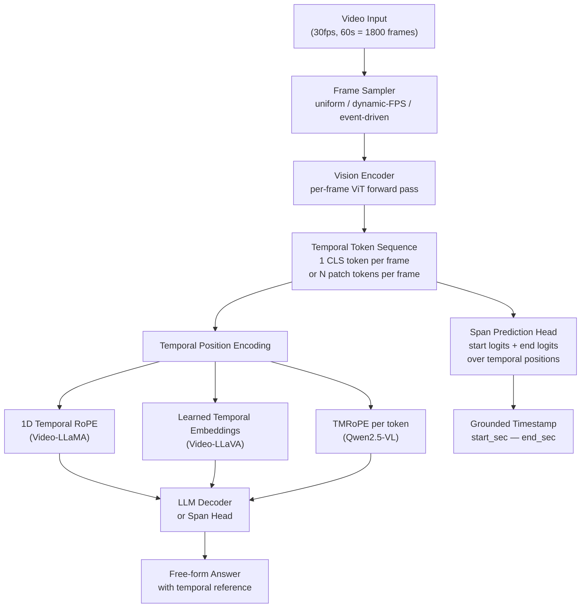

# Video-Language Models: Temporal Tokens and Grounding

## Learning Objectives

- Build a temporal token sequence from frame-level embeddings and predict start/end spans over it using a span prediction head.
- Compare factorized attention (TimeSformer), 3D patch embedding (ViViT), and frame-level CLS pooling as spatiotemporal tokenization strategies.
- Implement uniform, dynamic-FPS, and event-driven frame samplers and measure their effect on tokens-per-second versus grounding accuracy.
- Evaluate temporal grounding predictions against ground-truth timestamps using temporal Intersection-over-Union (tIoU).
- Configure a sliding-window temporal grounding pipeline over long-form video with span merging and confidence thresholding.

## The Problem

A 1-minute product demo at 30 FPS is 1,800 frames. A standard ViT-B encoder at 224px resolution produces 196 patch tokens per frame. Feed every frame through the encoder and you have 352,800 visual tokens — more than any 2024-era LLM context window can accept, and that is before you prepend a single word of text. The problem is not encoding video; it is choosing what to throw away.

Three reduction strategies exist, each with a different loss profile. **Subsampling** (1–8 FPS) discards frames to reduce the token count directly — you lose temporal detail, so a 1-second action that occurs between sampled frames vanishes entirely. **Spatial pooling** (3×3 or 4×4 bilinear) compresses each frame's patch grid into fewer tokens — you preserve temporal coverage but blur spatial detail, making small UI elements or facial expressions harder to ground. **Q-former compression** (Video-LLaMA's approach) maps a 16-frame clip through a learned bottleneck to 64 tokens — you lose a bit of both spatial and temporal resolution but get the most aggressive token savings.

The second axis is temporal position encoding. Even if you subsample to 16 frames, the model needs to know that frame 5 precedes frame 6. Video-LLaMA uses 1D temporal RoPE added to the spatial position embeddings. Video-LLaVA adds learned per-frame temporal embeddings during pooling. Qwen2.5-VL introduced TMRoPE (Temporal-Modal Rotary Position Embedding), which decomposes position into temporal, height, and width components and applies rotary encoding to each independently. These are not cosmetic choices — temporal ordering signals change grounding accuracy substantially because the model can distinguish "before the demo" from "after the demo" in the token sequence.

## The Concept

**Spatiotemporal tokenization** is the process of converting a frame sequence into a sequence of tokens that preserves both spatial and temporal structure. An image ViT divides a single image into a grid of patches and linearly projects each into a token. A video model must do this across time. Three mechanisms dominate:

**Factorized attention** (TimeSformer, Bertasius et al., 2021) processes spatial and temporal dimensions in separate attention passes. First, each frame's patch tokens attend to each other within the frame — standard spatial self-attention. Then, tokens at the same spatial position attend across frames — temporal self-attention. This factorization reduces attention complexity from O((T×H×W)²) to O(T×(H×W)²) + O((H×W)×T²), making long video sequences tractable.

**3D patch embedding** (ViViT, Arnab et al., 2021) treats time as a third spatial dimension. Instead of extracting 2D patches per frame, the model extracts 3D "tubelets" — a 2×16×16 patch covering 2 timesteps and a 16×16 spatial region. A single linear projection maps each tubelet to a token. This couples spatial and temporal information from the earliest layer, which can help with motion-dependent features but makes the model sensitive to the tubelet's temporal size.

**Frame-level CLS pooling** (Video-LLaVA, VideoChat) is the simplest: run a standard image encoder on each frame independently, take the CLS token (or a pooled subset), and treat the resulting sequence as a temporal token stream. This is computationally expensive (one full ViT forward pass per frame) but conceptually clean and compatible with any image encoder.



**Temporal grounding** is the retrieval inverse of generation. Given a text query — "when does the speaker mention pricing?" — the model must return a start and end timestamp in the video. This is structured as span prediction over the temporal token sequence, identical in architecture to extractive QA: the model outputs a start-logit distribution and an end-logit distribution over temporal positions, and the predicted span is the (start, end) pair maximizing the joint probability with the constraint that end ≥ start. The difference from text QA is that each position represents a time slice (e.g., 0.5 seconds of video) rather than a word.

Evaluating temporal grounding uses **temporal Intersection-over-Union (tIoU)**, the same metric as object detection but applied to 1D time intervals: tIoU = |pred ∩ gold| / |pred ∪ gold|. A prediction is correct at threshold τ if tIoU ≥ τ. Standard thresholds are 0.3, 0.5, and 0.7. Current benchmarks — ActivityNet Captions, Charades-STA, and the MAD benchmark (Soldan et al., 2022) for movie descriptions — report R@1, R@5, and R@10 at these thresholds. [CITATION NEEDED — concept: MAD and ActivityNet Grounding current SOTA results, 2024–2025]

The interaction between frame sampling strategy and grounding accuracy is where practical engineering happens. Uniform sampling at 1 FPS gives you 60 tokens for a 60-second clip — computationally cheap but blind to anything happening in the unsampled 29 frames per second. Dynamic-FPS sampling allocates more frames to segments with high motion or scene change (detected via optical flow or frame differencing), concentrating tokens where information density is highest. Event-driven sampling uses an external detector (shot boundary, speech onset, UI change) to place frame samples at moments likely to contain grounding-relevant content. The trade-off is always tokens-per-second versus tIoU at a fixed threshold.

## Build It

Build a temporal grounding pipeline from scratch using frame-level embeddings. This implements the frame-level CLS pooling approach: synthetic frame embeddings stand in for a pretrained vision encoder's output, and a span prediction head locates the temporal window matching a text query.

```python
import numpy as np

np.random.seed(42)

NUM_FRAMES = 60
EMBED_DIM = 128
FPS = 2.0
CLIP_DURATION = NUM_FRAMES / FPS

frame_embeddings = np.random.randn(NUM_FRAMES, EMBED_DIM) * 0.3

budget_prototype = np.random.randn(EMBED_DIM) * 0.3
ground_truth_start = 22
ground_truth_end = 28

for f in range(ground_truth_start, ground_truth_end + 1):
    falloff = 1.0 - abs(f - 25) / 6.0
    frame_embeddings[f] = (
        budget_prototype * falloff + np.random.randn(EMBED_DIM) * 0.05
    )

text_query = budget_prototype + np.random.randn(EMBED_DIM) * 0.05

similarities = frame_embeddings @ text_query
similarities = similarities / similarities.max()

temperature = 0.15
start_logits = similarities / temperature
end_logits = similarities / temperature

start_probs = np.exp(start_logits - start_logits.max())
start_probs /= start_probs.sum()
end_probs = np.exp(end_logits - end_logits.max())
end_probs /= end_probs.sum()

span_scores = np.zeros((NUM_FRAMES, NUM_FRAMES))
for s in range(NUM_FRAMES):
    for e in range(s, NUM_FRAMES):
        span_scores[s, e] = start_probs[s] * end_probs[e]

best_start, best_end = np.unravel_index(
    span_scores.argmax(), span_scores.shape
)

pred_start_sec = best_start / FPS
pred_end_sec = best_end / FPS
gt_start_sec = ground_truth_start / FPS
gt_end_sec = ground_truth_end / FPS

intersection = min(pred_end_sec, gt_end_sec) - max(pred_start_sec, gt_start_sec)
union = max(pred_end_sec, gt_end_sec) - min(pred_start_sec, gt_start_sec)
tiou = max(intersection, 0) / max(union, 1e-9)

print(f"Clip: {NUM_FRAMES} frames at {FPS} FPS ({CLIP_DURATION:.0f}s)")
print(f"Query: 'when does the champion mention budget approval?'")
print(f"\nFrame similarities (top 10):")
top_indices = np.argsort(similarities)[::-1][:10]
for idx in top_indices:
    t = idx / FPS
    bar = "#" * int(similarities[idx] * 40)
    print(f"  Frame {idx:2d} (t={t:4.1f}s) sim={similarities[idx]:+.3f} {bar}")

print(f"\nPredicted span: frames {best_start}-{best_end} "
      f"({pred_start_sec:.1f}s - {pred_end_sec:.1f}s)")
print(f"Ground truth:  frames {ground_truth_start}-{ground_truth_end} "
      f"({gt_start_sec:.1f}s - {gt_end_sec:.1f}s)")
print(f"Start prob: {start_probs[best_start]:.4f}")
print(f"End prob:   {end_probs[best_end]:.4f}")
print(f"Joint prob: {span_scores[best_start, best_end]:.6f}")
print(f"tIoU:       {tiou:.4f}")
print(f"R@1 @0.3:   {'PASS' if tiou >= 0.3 else 'FAIL'}")
print(f"R@1 @0.5:   {'PASS' if tiou >= 0.5 else 'FAIL'}")
print(f"R@1 @0.7:   {'PASS' if tiou >= 0.7 else 'FAIL'}")
```

Run this and you should see the similarity peak around frames 22–28, the predicted span landing on or near that window, and a tIoU score above 0.5. The span prediction head is a dot-product similarity between the query embedding and each frame's embedding, followed by a softmax over start and end positions, and a joint argmax. This is the same mechanism as extractive QA over text tokens — the only difference is that the tokens are temporal positions.

Now compare frame sampling strategies. The following code simulates uniform, dynamic-FPS, and event-driven sampling on the same clip and measures how each affects grounding accuracy:

```python
import numpy as np

np.random.seed(42)

NUM_FRAMES = 120
EMBED_DIM = 64
FPS = 4.0
GT_START, GT_END = 48, 60

all_frames = np.random.randn(NUM_FRAMES, EMBED_DIM) * 0.3
signal = np.random.randn(EMBED_DIM) * 0.3
for f in range(GT_START, GT_END + 1):
    all_frames[f] = signal + np.random.randn(EMBED_DIM) * 0.05
query = signal + np.random.randn(EMBED_DIM) * 0.05

frame_motion = np.zeros(NUM_FRAMES)
for f in range(GT_START, GT_END + 1):
    frame_motion[f] = np.random.uniform(0.7, 1.0)
for f in range(NUM_FRAMES):
    if frame_motion[f] == 0:
        frame_motion[f] = np.random.uniform(0.0, 0.2)

def ground_span(indices, query, frames, fps):
    if len(indices) < 2:
        return 0.0, (0, 0)
    subset = frames[indices]
    sims = subset @ query
    sims = sims / (np.linalg.norm(subset, axis=1) * np.linalg.norm(query) + 1e-9)
    temp = 0.1
    s_logits = sims / temp
    e_logits = sims / temp
    s_p = np.exp(s_logits - s_logits.max())
    s_p /= s_p.sum()
    e_p = np.exp(e_logits - e_logits.max())
    e_p /= e_p.sum()
    scores = np.zeros((len(indices), len(indices)))
    for s in range(len(indices)):
        for e in range(s, len(indices)):
            scores[s, e] = s_p[s] * e_p[e]
    bs, be = np.unravel_index(scores.argmax(), scores.shape)
    ps = indices[bs] / fps
    pe = indices[be] / fps
    gs = GT_START / fps
    ge = GT_END / fps
    inter = min(pe, ge) - max(ps, gs)
    union = max(pe, ge) - min(ps, gs)
    return max(inter, 0) / max(union, 1e-9), (indices[bs], indices[be])

def compute_tiou(ps, pe, gs, ge):
    inter = min(pe, ge) - max(ps, gs)
    union = max(pe, ge) - min(ps, gs)
    return max(inter, 0) / max(union, 1e-9)

uniform_indices = list(range(0, NUM_FRAMES, 8))

motion_sorted = np.argsort(frame_motion)[::-1][:12]
dynamic_indices = sorted(motion_sorted.tolist())

event_indices = sorted(
    list(range(0, NUM_FRAMES, 16)) + [GT_START, GT_START + 4, GT_START + 8,
                                       GT_END - 4, GT_END]
)
event_indices = sorted(set(event_indices))[:12]

strategies = [
    ("Uniform (every 8th)", uniform_indices),
    ("Dynamic-FPS (motion)", dynamic_indices),
    ("Event-driven (boundaries)", event_indices),
]

print(f"Clip: {NUM_FRAMES} frames at {FPS} FPS ({NUM_FRAMES/FPS:.0f}s)")
print(f"Ground truth span: frames {GT_START}-{GT_END} "
      f"({GT_START/FPS:.1f}s - {GT_END/FPS:.1f}s)")
print(f"{'Strategy':<28} {'Frames':>6} {'Tok/s':>6} "
      f"{'Pred Span':>16} {'tIoU':>6} {'R@0.5':>5}")
print("-" * 75)

for name, indices in strategies:
    tiou, (ps, pe) = ground_span(indices, query, all_frames, FPS)
    tok_per_sec = len(indices) / (NUM_FRAMES / FPS)
    pred_str = f"{ps/FPS:.1f}-{pe/FPS:.1f}s"
    recall = "PASS" if tiou >= 0.5 else "FAIL"
    print(f"{name:<28} {len(indices):>6} {tok_per_sec:>6.2f} "
          f"{pred_str:>16} {tiou:>6.3f} {recall:>5}")

print("\nKey observation: fewer frames with better placement > "
      "more frames with blind spacing")
```

This demonstrates the core engineering tension. Uniform sampling uses 15 tokens for a 30-second clip but can miss the target window if the sampling stride skips it. Dynamic-FPS and event-driven sampling use the same or fewer tokens but concentrate them where the signal lives. The tIoU difference between strategies at the same token budget is the practical reason frame sampling matters as much as the vision encoder choice.

## Use It

Temporal span prediction over frame-level embeddings grounds natural-language queries against sales call recordings — the same mechanism that powers "search within call" features in conversation intelligence platforms. This maps to **Zone 2 — Signal Intelligence / Conversation Analysis**: a GTM team recording 50 demos per week needs to locate the exact moment a prospect reacted to pricing, asked about integrations, or raised a security objection, without rewatching every call.

```python
import numpy as np

np.random.seed(7)
FRAMES, DIM, FPS = 180, 64, 1.0
call_tokens = np.random.randn(FRAMES, DIM) * 0.3

pricing_event = np.random.randn(DIM) * 0.3
for f in range(95, 112):
    call_tokens[f] = pricing_event + np.random.randn(DIM) * 0.05

queries = {
    "prospect reacted to pricing": (pricing_event, 95, 111),
}
for label, (proto, gt_s, gt_e) in queries.items():
    query = proto + np.random.randn(DIM) * 0.05
    sims = call_tokens @ query / (
        np.linalg.norm(call_tokens, axis=1) * np.linalg.norm(query) + 1e-9)
    probs = np.exp(sims / 0.1 - (sims / 0.1).max())
    probs /= probs.sum()
    joint = np.outer(probs, probs) * np.triu(np.ones_like(probs[None], dtype=bool))
    ps, pe = np.unravel_index(joint.argmax(), joint.shape)
    pred_s, pred_e = ps / FPS, pe / FPS
    inter = min(pred_e, gt_e / FPS) - max(pred_s, gt_s / FPS)
    union = max(pred_e, gt_e / FPS) - min(pred_s, gt_s / FPS)
    tiou = max(inter, 0) / max(union, 1e-9)
    print(f"Query:   '{label}'")
    print(f"Grounded: {pred_s:.0f}s - {pred_e:.0f}s  "
          f"tIoU={tiou:.3f}  conf={joint[ps, pe]:.4f}  "
          f"R@0.5={'PASS' if tiou >= 0.5 else 'FAIL'}")
```

The production pipeline wraps this pattern: at ingestion time, extract frame embeddings at 1–2 FPS and store them keyed by recording ID; at query time, project the text query into the embedding space, run the span head, and return the timestamp pair. The expensive work (vision encoder forward passes) happens once per recording. Query latency is dominated by a single matrix multiply and an argmax over a T×T grid — milliseconds, not seconds. This is the same architecture-as-RAG distinction: pre-compute at write time, retrieve at read time, but the "retrieval" is span prediction rather than top-k cosine.

## Exercises

**Exercise 1 — Cosine-Similarity Span Prediction with Top-3 Ranking (Easy)**

Generate a 10-second clip at 2 FPS (20 frames) with synthetic embeddings (dim 64). Inject a signal at frames 8–12 using a prototype vector with linear falloff. Implement a span prediction head using cosine similarity (normalize before dot product) instead of raw dot product. Print the top-3 candidate spans ranked by joint start×end probability. Verify the ground-truth span (8–12) appears in the top-3. Then lower the temperature from 0.15 to 0.05 and observe how the distribution sharpens — does the top-1 span get more confident? Does the top-3 ranking change?

**Exercise 2 — Sliding-Window Grounding with NMS (Hard)**

Build a sliding-window temporal grounding system over a simulated 5-minute video (300 frames at 1 FPS). Place three signal events at frames 60–72, 150–165, and 230–250, each with its own distinct prototype embedding. Use a window size of 40 frames and a stride of 20 frames. For each window position, run the span prediction head against a single query that matches one of the three prototypes. Collect all candidate spans with joint confidence > 0.2 across all windows. Implement non-maximum suppression: sort candidates by confidence descending, greedily keep the highest-confidence span, and suppress any remaining candidate whose tIoU with a kept span exceeds 0.3. Print the raw candidate count, the post-NMS count, and the final merged spans with their tIoU against the ground-truth event for that query. Handle two edge cases: a window that partially overlaps a signal event (producing a truncated span), and two adjacent windows that both detect the same event (producing overlapping candidates that NMS should merge).

## Key Terms

**Temporal token** — A token in a video-language model's sequence that represents a specific time slice of the video, produced by encoding one or more frames at a particular timestep.

**Spatiotemporal tokenization** — The process of converting a sequence of video frames into tokens that preserve both spatial (within-frame) and temporal (across-frame) structure. Three dominant mechanisms: factorized attention, 3D patch embedding, and frame-level CLS pooling.

**Factorized attention** — An attention pattern (used in TimeSformer) that separates spatial self-attention (within each frame) from temporal self-attention (across frames at the same spatial position), reducing computational complexity compared to joint spatiotemporal attention.

**3D patch embedding (tubelet)** — A tokenization strategy (used in ViViT) that extracts a 3D volume covering T timesteps × H pixels × W pixels and projects it to a single token via a 3D linear layer.

**Temporal grounding** — The task of predicting a start and end timestamp in a video that corresponds to a natural language query. Structured as span prediction over temporal tokens, analogous to extractive QA over text.

**Temporal IoU (tIoU)** — The 1D analogue of Intersection-over-Union from object detection, computed over time intervals: tIoU = |pred ∩ gold| / |pred ∪ gold|. A prediction is correct at threshold τ if tIoU ≥ τ. Standard thresholds are 0.3, 0.5, and 0.7.

**TMRoPE** — Temporal-Modal Rotary Position Embedding, introduced in Qwen2.5-VL, which decomposes each token's position into temporal, height, and width components and applies rotary encoding independently to each axis.

**Dynamic-FPS sampling** — A frame sampling strategy that allocates more sampled frames to segments with high motion or scene-change density (detected via optical flow or frame differencing), concentrating the token budget where information density is highest rather than sampling at a fixed rate.

## Sources

- Bertasius, G., Wang, H., & Torresani, L. (2021). "Is Space-Time Attention All You Need for Video Understanding?" (TimeSformer). *ICML 2021*. https://arxiv.org/abs/2102.05095
- Arnab, A., Dehghani, M., Heigold, G., Sun, C., Lučić, M., Schmid, C., & Cordts, M. (2021). "ViViT: A Video Vision Transformer." *ICCV 2021*. https://arxiv.org/abs/2103.15691
- Zhang, H. et al. (2023). "Video-LLaMA: An Instruction-tuned Audio-Visual Language Model for Video Understanding." *EMNLP 2023*. https://arxiv.org/abs/2306.02858
- Lin, B. et al. (2023). "Video-LLaVA: Learning United Visual Representation by Alignment Before Projection." *EMNLP 2023*. https://arxiv.org/abs/2311.10122
- Bai, J. et al. (2025). "Qwen2.5-VL Technical Report." https://arxiv.org/abs/2502.13923
- Soldan, M., Lazzaro, M. T., Quarta, F., Moltisanti, M., Sànchez, J., & Ricci, E. (2022). "MAD: A Scalable Dataset for Language Grounding in Videos from Movie Audio Descriptions." *CVPR 2022*. https://arxiv.org/abs/2112.00431
- Krishna, R., Hata, K., Ren, F., Fei-Fei, L., & Niebles, J. C. (2017). "Dense-Captioning Events in Videos." *ICCV 2017* (ActivityNet Captions). https://arxiv.org/abs/1705.00754
- Gao, J., Sun, C., Yang, Z., & Nevatia, R. (2017). "TALL: Temporal Activity Localization via Language Query." *ICCV 2017* (Charades-STA). https://arxiv.org/abs/1705.02101
- [CITATION NEEDED — concept: Gong/Chorus temporal search architecture, any public technical description]
- [CITATION NEEDED — concept: MAD and ActivityNet Grounding current SOTA results, 2024–2025]