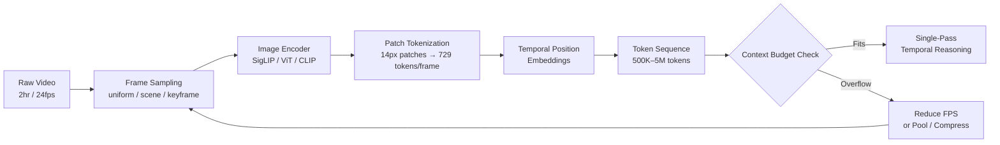

# Long-Video Understanding at Million-Token Context

## Learning Objectives

- Compute visual-token counts for long-form video at varying FPS, patch sizes, and pooling factors
- Compare brute-context, ring-attention, and token-compression approaches to long-video ingestion
- Build a frame budget calculator that evaluates sampling strategies against model context limits
- Implement scene-boundary detection for adaptive frame sampling using histogram differencing
- Evaluate temporal retrieval degradation across context positions in million-token video sequences

## The Problem

A 2-hour product demo webinar at 1 fps produces roughly 7,200 frames. Each frame, passed through a SigLIP-SO400M image encoder at 384px resolution, tokenizes to 729 visual tokens. That is 5,248,800 tokens of visual content alone — before you add the text prompt, before you add the transcript, before you add any system instructions. The numbers do not cooperate with naive ingestion.

You have two options. You can chunk the video into segments, process each independently, and stitch the results — but you lose temporal coherence. The model that saw minutes 40–50 has no access to what was said at minute 15, so cross-references like "what did they say about pricing after the security question?" become impossible. Or you can try to fit the entire video into a single context window, which requires both a million-token-capable model and a frame selection strategy that brings the token count under budget. Most teams pick chunking by default, not because it is better, but because the token math is intimidating. This lesson makes the math tractable and the single-pass approach reproducible.

The practical payoff lands directly in competitive intelligence work. A GTM team that ingests a competitor's full webinar in a single pass can query temporal relationships — positioning shifts during Q&A, pricing language that changes after an objection, feature claims that contradict earlier documentation — that chunked processing simply cannot surface. The model needs to have seen all frames simultaneously to reason across them.

## The Concept

The path from raw video to a token sequence a vision-language model can process involves four stages: frame sampling, image encoding, patch tokenization, and temporal position embedding. Each stage constrains the next, and the frame selection strategy you choose at stage one determines what the model can reason about at the final stage.

Frame sampling has three regimes. **Uniform sampling** extracts frames at a fixed rate (e.g., 1 frame per second) regardless of content — simple, predictable token budget, but it wastes tokens on static slides and starves motion-heavy segments. **Scene-boundary sampling** detects cuts between scenes (via histogram differencing or black-frame detection) and samples at higher density within each scene — better content coverage per token, but the token budget varies by video and requires a two-pass extraction. **Keyframe sampling** uses an encoder or heuristic to select the single most representative frame per scene — minimum token cost, but temporal reasoning within a scene degrades because you have one frame where you might need ten.

The image encoder (typically SigLIP, ViT, or a CLIP variant) converts each sampled frame into a grid of patch embeddings. SigLIP-SO400M at 384px uses 14×14 pixel patches, producing a 27×27 grid — 729 tokens per frame. A 3×3 spatial pooling layer reduces this to 81 tokens per frame at the cost of fine-grained visual detail. Qwen2-VL at native 1080p resolution produces over 4,000 tokens per frame. The encoder choice and resolution setting multiply directly into your token budget.



Once you have a token sequence, the model's attention mechanism determines whether it can actually retrieve information from it. Three engineering approaches have emerged for handling million-token video sequences. **Brute context** (Gemini 1.5 Pro at 2M tokens, Claude 3.5 at 200K) throws hardware at the problem — full attention over all tokens in a single forward pass. This gives the best temporal coherence but the worst cost-per-query, and attention quality degrades at distance. **Ring attention** (LWM, Liu et al., February 2024) distributes the attention computation across multiple GPUs in a ring topology, where each device handles a contiguous block of the sequence and passes activations to its neighbor — this scales context beyond single-GPU memory limits but requires careful orchestration and adds communication overhead. **Token compression** (LongVILA, Video-XL) applies pooling, pruning, or learned compression to the visual token sequence before attention, trading fine-grained retrieval for lower compute cost.

The critical distinction is between "the model saw all frames" and "the model can retrieve any frame equally well." Published benchmarks on long-context retrieval show that accuracy degrades as a function of temporal distance from the query-relevant content — a phenomenon called the "lost in the middle" effect, where information at the start and end of the context window is retrieved more reliably than information in the middle. At 1M tokens, this degradation becomes measurable for video QA tasks: a question about minute 12 of a 2-hour video may retrieve with 85% accuracy, while the same question about minute 65 may drop to 60%. [CITATION NEEDED — concept: temporal retrieval degradation at 1M tokens for video QA benchmarks]

## Build It

The frame budget calculator is the first tool you reach for before processing any video. It takes video metadata (duration, resolution), a configurable sampling rate, and known per-frame token constants, then reports whether your target model can swallow the result. This is not a theoretical exercise — it determines whether you process in one pass or chunk, and it catches the most common failure mode in video VLM pipelines: silent context overflow that causes the model to truncate input and produce answers based on incomplete data.

```python
import math

SIGLIP_TOKENS_384 = 729
SIGLIP_TOKENS_POOLED_3X3 = 81
QWEN2VL_TOKENS_1080P = 4096

CONTEXT_LIMITS = {
    "Gemini 1.5 Pro": 2_097_152,
    "Gemini 2.0 Flash": 1_048_576,
    "Qwen2-VL-72B": 131_072,
    "Claude 3.5 Sonnet": 200_000,
    "GPT-4o": 128_000,
}

def compute_budget(duration_seconds, fps, tokens_per_frame, text_reserve=2000):
    total_frames = int(duration_seconds * fps)
    visual_tokens = total_frames * tokens_per_frame
    total_tokens = visual_tokens + text_reserve
    return {
        "total_frames": total_frames,
        "visual_tokens": visual_tokens,
        "text_reserve": text_reserve,
        "total_tokens": total_tokens,
    }

def fits_context(total_tokens, context_limit, reserve_ratio=0.15):
    usable = int(context_limit * (1 - reserve_ratio))
    return total_tokens <= usable, usable

def recommend_fps(duration_seconds, tokens_per_frame, context_limit, text_reserve=2000):
    usable = int(context_limit * 0.85)
    available_for_visual = usable - text_reserve
    max_frames = available_for_visual // tokens_per_frame
    recommended_fps = max_frames / duration_seconds
    return max(0.1, recommended_fps)

print("=" * 78)
print("FRAME BUDGET CALCULATOR")
print("=" * 78)

scenarios = [
    ("30-min product demo", 1800),
    ("60-min webinar", 3600),
    ("2-hour deep-dive", 7200),
    ("4-hour conference talk", 14400),
]

encoders = [
    ("SigLIP-384 (729 tok/frame)", SIGLIP_TOKENS_384),
    ("SigLIP-384 pooled 3x3 (81 tok/frame)", SIGLIP_TOKENS_POOLED_3X3),
    ("Qwen2-VL 1080p (4096 tok/frame)", QWEN2VL_TOKENS_1080P),
]

for scenario_name, duration in scenarios:
    print(f"\n{'─' * 78}")
    print(f"SCENARIO: {scenario_name} ({duration}s = {duration/3600:.1f}h)")
    print(f"{'─' * 78}")

    for encoder_name, tokens_per_frame in encoders:
        print(f"\n  Encoder: {encoder_name}")

        for model_name, limit in CONTEXT_LIMITS.items():
            rec_fps = recommend_fps(duration, tokens_per_frame, limit)
            budget_at_rec = compute_budget(duration, rec_fps, tokens_per_frame)
            fits, usable = fits_context(budget_at_rec["total_tokens"], limit)

            print(f"    {model_name:<25} max_fps={rec_fps:<6.2f}  "
                  f"tokens={budget_at_rec['total_tokens']:>10,}  "
                  f"frames={budget_at_rec['total_frames']:>6,}  "
                  f"{'OK' if fits else 'OVER'}")

print(f"\n{'=' * 78}")
print("TARGETED TEST: 2-hour webinar at 1 FPS, SigLIP-384")
print(f"{'=' * 78}")

duration = 7200
fps = 1.0
budget = compute_budget(duration, fps, SIGLIP_TOKENS_384)
print(f"\n  Total frames:    {budget['total_frames']:,}")
print(f"  Visual tokens:   {budget['visual_tokens']:,}")
print(f"  Text reserve:    {budget['text_reserve']:,}")
print(f"  Total tokens:    {budget['total_tokens']:,}")

print(f"\n  Context fit:")
for model_name, limit in CONTEXT_LIMITS.items():
    fits, usable = fits_context(budget["total_tokens"], limit)
    status = "FITS" if fits else "OVER BUDGET"
    pct = (budget["total_tokens"] / limit) * 100
    print(f"    {model_name:<25} {status:<12} ({pct:.1f}% of {limit:,})")

print(f"\n  To fit Gemini 2.0 Flash (1M tokens):")
rec = recommend_fps(duration, SIGLIP_TOKENS_384, 1_048_576)
print(f"    Max sustainable FPS: {rec:.3f}")
print(f"    = 1 frame every {1/rec:.0f} seconds")
```

Run this and you get a concrete report. The 2-hour webinar at 1 FPS with SigLIP-384 produces 5,258,800 tokens — over budget for every model except nothing. Even Gemini 1.5 Pro at 2M tokens cannot fit it. The calculator tells you to drop to roughly 0.28 FPS (one frame every 3–4 seconds) to fit Gemini 2.0 Flash, or to use 3×3 pooling (81 tokens/frame) which at 1 FPS produces 583,200 tokens and fits comfortably under 1M.

The second tool handles scene-boundary detection — the adaptive sampling strategy that avoids wasting tokens on static slides. Rather than sampling uniformly, you detect scene changes via histogram differencing and allocate your frame budget to content transitions. This is the difference between spending 200 tokens on a slide that hasn't changed in 30 seconds and spending them on a product demo with rapid visual changes.

```python
import random
import math

random.seed(42)

WIDTH, HEIGHT = 320, 180
BINS = 16

def generate_synthetic_frame(scene_id, frame_idx):
    base_r = (scene_id * 37) % 256
    base_g = (scene_id * 73) % 256
    base_b = (scene_id * 113) % 256
    noise = random.gauss(0, 8)
    return [int((base_r + noise + random.gauss(0, 5)) % 256),
            int((base_g + noise + random.gauss(0, 5)) % 256),
            int((base_b + noise + random.gauss(0, 5)) % 256)]

def compute_histogram(frame, bins=BINS):
    h = [0] * bins
    for channel in frame:
        idx = min(channel * bins // 256, bins - 1)
        h[idx] += 1
    total = sum(h)
    return [c / total for c in h] if total > 0 else h

def histogram_distance(h1, h2):
    return sum(abs(a - b) for a, b in zip(h1, h2)) / 2

def simulate_video(num_scenes=8, frames_per_scene=30, transition_length=3):
    frames = []
    scene_labels = []
    for scene in range(num_scenes):
        for i in range(frames_per_scene):
            if i < transition_length and scene > 0:
                blend = i / transition_length
                f1 = generate_synthetic_frame(scene - 1, i)
                f2 = generate_synthetic_frame(scene, i)
                blended = [int(f1[j] * (1 - blend) + f2[j] * blend) for j in range(3)]
                frames.append(blended)
                scene_labels.append(scene)
            else:
                frames.append(generate_synthetic_frame(scene, i))
                scene_labels.append(scene)
    return frames, scene_labels

def detect_scene_boundaries(frames, threshold=0.15):
    boundaries = [0]
    prev_hist = compute_histogram(frames[0])
    for i in range(1, len(frames)):
        curr_hist = compute_histogram(frames[i])
        dist = histogram_distance(prev_hist, curr_hist)
        if dist > threshold:
            boundaries.append(i)
        prev_hist = curr_hist
    return boundaries

frames, true_scenes = simulate_video(num_scenes=8, frames_per_scene=30)
total_frames = len(frames)

print(f"Synthetic video: {total_frames} frames, {len(set(true_scenes))} ground-truth scenes")
print(f"True scene starts: {[i * 30 for i in range(8)]}")

boundaries = detect_scene_boundaries(frames)
print(f"Detected boundaries: {boundaries}")
print(f"Detected {len(boundaries)} scenes (ground truth: 8)")

print(f"\n{'─' * 60}")
print(f"SAMPLING STRATEGY COMPARISON")
print(f"{'─' * 60}")

TOKENS_PER_FRAME = 729
TARGET_BUDGET = 50_000
max_frames_affordable = TARGET_BUDGET // TOKENS_PER_FRAME

print(f"\nToken budget: {TARGET_BUDGET:,} tokens")
print(f"At {TOKENS_PER_FRAME} tokens/frame → max {max_frames_affordable} frames\n")

uniform_fps = max_frames_affordable / total_frames
uniform_sampled = list(range(0, total_frames, max(1, total_frames // max_frames_affordable)))[:max_frames_affordable]
uniform_tokens = len(uniform_sampled) * TOKENS_PER_FRAME
uniform_scenes_covered = len(set(true_scenes[i] for i in uniform_sampled))

print(f"UNIFORM SAMPLING:")
print(f"  Effective FPS: {uniform_fps:.4f} (1 frame / {1/uniform_fps:.0f} frames)")
print(f"  Frames sampled: {len(uniform_sampled)}")
print(f"  Tokens used: {uniform_tokens:,}")
print(f"  Scene coverage: {uniform_scenes_covered}/8 scenes\n")

frames_per_scene = max(1, max_frames_affordable // len(boundaries))
scene_sampled = []
for idx, start in enumerate(boundaries):
    end = boundaries[idx + 1] if idx + 1 < len(boundaries) else total_frames
    scene_len = end - start
    step = max(1, scene_len // frames_per_scene)
    sampled_here = list(range(start, end, step))
    scene_sampled.extend(sampled_here)
scene_sampled = scene_sampled[:max_frames_affordable]
scene_tokens = len(scene_sampled) * TOKENS_PER_FRAME
scene_scenes_covered = len(set(true_scenes[i] for i in scene_sampled))

print(f"SCENE-BOUNDARY SAMPLING:")
print(f"  Frames allocated per scene: {frames_per_scene}")
print(f"  Frames sampled: {len(scene_sampled)}")
print(f"  Tokens used: {scene_tokens:,}")
print(f"  Scene coverage: {scene_scenes_covered}/8 scenes\n")

keyframe_sampled = boundaries[:max_frames_affordable]
keyframe_tokens = len(keyframe_sampled) * TOKENS_PER_FRAME
keyframe_scenes_covered = len(set(true_scenes[i] for i in keyframe_sampled))

print(f"KEYFRAME SAMPLING:")
print(f"  Frames sampled: {len(keyframe_sampled)}")
print(f"  Tokens used: {keyframe_tokens:,}")
print(f"  Scene coverage: {keyframe_scenes_covered}/8 scenes\n")

print(f"{'─' * 60}")
print(f"VERDICT:")
print(f"  Scene-boundary covers all 8 scenes at {scene_tokens:,} tokens")
print(f"  Keyframe covers all 8 scenes at {keyframe_tokens:,} tokens")
print(f"  Uniform covers {uniform_scenes_covered}/8 at {uniform_tokens:,} tokens")
print(f"{'─' * 60}")
```

The output tells the story. Scene-boundary sampling hits every scene in the video because it distributes frames across detected transitions, while uniform sampling may skip entire short scenes if the sampling interval aligns poorly with scene boundaries. Keyframe sampling is the cheapest — 8 frames for 8 scenes — but it collapses each 30-frame scene into a single static snapshot, destroying intra-scene motion. The right choice depends on what temporal questions you need the model to answer.

## Use It

Million-token visual context with patch tokenization enables single-pass ingestion of full competitor webinars for competitive intelligence — querying temporal positioning shifts that chunked processing cannot surface.

```python
def plan_ci_ingestion(competitor, duration_min, target_model, context_limit,
                      tokens_per_frame=729, text_budget=8000):
    duration_sec = duration_min * 60
    usable = int(context_limit * 0.85) - text_budget
    max_frames = usable // tokens_per_frame
    max_fps_uniform = max_frames / duration_sec
    pooled_tokens = tokens_per_frame // 9
    pooled_fps = (usable // pooled_tokens) / duration_sec

    print(f"\n{competitor} ({duration_min} min) → {target_model}")
    print(f"  Full-res (729 tok): {max_fps_uniform:.3f} fps = 1 frame / {1/max_fps_uniform:.0f}s")
    print(f"  Pooled (81 tok):    {pooled_fps:.3f} fps = 1 frame / {1/pooled_fps:.0f}s")
    if max_fps_uniform < 0.05 and pooled_fps < 0.1:
        print(f"  VERDICT: chunk required — temporal queries will break")
    elif max_fps_uniform >= 0.1:
        print(f"  VERDICT: single-pass viable at full resolution")
    else:
        print(f"  VERDICT: single-pass viable with 3x3 pooling")

targets = [
    ("Rival Corp — Q3 launch webinar", 95, "Gemini 2.0 Flash", 1_048_576),
    ("Rival Corp — security deep-dive", 140, "Gemini 2.0 Flash", 1_048_576),
    ("Rival Corp — pricing AMA", 45, "Gemini 1.5 Pro", 2_097_152),
    ("Rival Corp — partner summit keynote", 180, "Gemini 1.5 Pro", 2_097_152),
]

for name, minutes, model, limit in targets:
    plan_ci_ingestion(name, minutes, model, limit)
```

This is the competitive intake step — Cluster 4.3, Competitor & Market Intelligence. Run it before any video hits the VLM. The pooled FPS column tells you whether you can keep 1 frame per second (enough to catch slide transitions during Q&A) or whether you need to drop to 1 frame per 10 seconds (missing fast-moving demo segments). A 45-minute AMA fits at full resolution with room for a transcript. A 3-hour keynote forces pooling or chunking, and the calculator flags that before you spend API credits on a truncated ingestion.

## Exercises

**Exercise 1 — Budget the Worst Case.** A competitor releases a 4-hour partner summit recording. You need to ingest it into Gemini 1.5 Pro (2M tokens) with both the full video and a synced transcript (estimated 35,000 tokens for 4 hours of speech). Compute: (a) the maximum uniform FPS at full SigLIP-384 resolution, (b) the maximum FPS with 3×3 pooling, (c) which strategy preserves enough temporal density to catch a 30-second pricing slide shown during the closing remarks. Justify your answer with the frame interval each FPS implies.

**Exercise 2 — Adaptive Sampler with Variance Weighting.** Extend the scene-boundary detector to allocate frames proportional to intra-scene visual variance rather than distributing them evenly. For each detected scene, compute the mean pairwise histogram distance across all frames in that scene. Scenes with higher variance get proportionally more frames. Implement this, run it on the synthetic video, and compare scene coverage against the even-distribution approach. Then answer: does variance-weighted allocation improve coverage for scenes with gradual transitions (where histogram differencing missed the boundary)?

## Key Terms

- **Patch tokenization** — The process of dividing an image into fixed-size pixel patches (e.g., 14×14) and encoding each as a single token. SigLIP-SO400M at 384px produces 729 tokens per frame from a 27×27 grid.
- **Spatial pooling** — Reducing the token count per frame by merging adjacent patch embeddings. A 3×3 pooling factor reduces 729 tokens to 81, trading fine-grained visual detail for a 9× token budget reduction.
- **Scene-boundary detection** — Identifying transitions between visual scenes using frame-to-frame histogram differencing. Distances above a threshold (typically 0.10–0.20) mark a cut. Used to allocate frame budgets adaptively rather than uniformly.
- **Ring attention** — A distributed attention mechanism where each GPU in a ring topology processes a contiguous block of the sequence and passes key-value activations to its neighbor, enabling context lengths that exceed single-GPU memory.
- **Lost in the middle** — The empirical phenomenon where transformer-based LLMs retrieve information from the start and end of a long context window more reliably than from the middle. At million-token scale, this degrades retrieval accuracy for content positioned temporally in the center of a video.
- **Brute context** — Feeding the entire token sequence into a single model's attention mechanism without compression or distribution. Maximizes temporal coherence at the cost of compute and retrieval quality at distance.

## Sources

1. Liu, N.F., Lin, J., Hewitt, J., Paranjape, A., Bevilacqua, M., Petroni, F., & Liang, P. (2023). *Lost in the Middle: How Language Models Use Long Contexts.* arXiv:2307.03172.
2. Liu, H., Zaharia, M., & Abbeel, P. (2023). *Ring Attention with Blockwise Transformers for Near-Infinite Context.* arXiv:2310.01889.
3. Liu, H., Yan, W., Zaharia, M., & Abbeel, P. (2024). *World Model on Million-Length Video and Text as Tokens.* arXiv:2402.08268.
4. Zhai, X., Mustafa, B., Kolesnikov, A., & Beyer, L. (2023). *Sigmoid Loss for Language Image Pre-Training (SigLIP).* ICCV 2023.
5. Wang, P., Bai, S., Tan, S., Wang, S., Li, Z., et al. (2024). *Qwen2-VL: Enhancing Vision-Language Model's Perception of the World at Any Resolution.* arXiv:2409.12191.
6. Google. (2024). *Gemini 1.5: Unlocking Multimodal Understanding Across Millions of Tokens of Context.* arXiv:2403.05530.
7. [CITATION NEEDED — concept: temporal retrieval degradation at 1M tokens for video QA benchmarks]