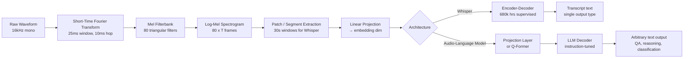

# Audio-Language Models: The Whisper to Audio Flamingo 3 Arc

## Learning Objectives

1. Compare Whisper's encoder-decoder architecture to audio-language models that pair an audio encoder with an LLM decoder, naming the specific architectural difference that determines what each can output.
2. Trace the audio tokenization pipeline from raw waveform through short-time Fourier transform, Mel filterbank, log-mel spectrogram, and linear projection to a sequence of transformer-readable tokens.
3. Implement a working transcription pipeline using Whisper that accepts a WAV file and prints transcript text, detected language, and segment-level timing.
4. Evaluate when transcription followed by text-based LLM reasoning suffices versus when the acoustic information loss makes that cascade inadequate.
5. Configure a sales-call audio processing pipeline that extracts structured GTM signals — objections, buying intent, competitor mentions — from raw recordings, with logging hooks for pipeline health monitoring.

## The Problem

Whisper (Radford et al., December 2022) settled automatic speech recognition. Trained on 680,000 hours of weakly-supervised multilingual audio-transcript pairs across 99 languages, it made transcription a commodity. You pass audio in, you get text out, and the text is good enough for most downstream uses. The encoder-decoder transformer is trained on exactly one objective: predict the next transcript token given the audio encoding and the transcript tokens generated so far. That objective produces a transcription machine.

But transcription is not comprehension. A sales call recording contains information that the transcript strips away: the prospect's tone when they said "we'll think about it" (hesitant vs. dismissive), the silence before the pricing discussion (calculating vs. uncomfortable), the moment a third voice joined and shifted the conversation's dynamics. The transcript preserves words. It discards prosody, speaker overlap, environmental context, and the acoustic signals that a sales engineer would catch instinctively. For a GTM team processing hundreds of calls per week, this loss is invisible but consequential: the enrichment pipeline extracts what was said, not how it was said.

The obvious workaround is a cascade: Whisper transcribes, then a text-based LLM reasons over the transcript to extract objections, buying signals, competitor mentions. This works for many cases — pure speech, single speaker, clear audio, factual content. It fails when the acoustic layer carries signal the transcript cannot represent. A prospect who says "that's interesting" with rising pitch is expressing curiosity. The same words spoken flat are a brush-off. The cascade has no access to that distinction. Audio-language models — Qwen-Audio, SALMONN, LTU, and NVIDIA's Audio Flamingo 3 (AF3, July 2025) — were built to close that gap: feed audio directly into an LLM as a first-class input modality, preserving acoustic information alongside the linguistic content.

## The Concept

The audio tokenization pipeline is the shared foundation. Every model in this arc starts with the same sequence of transformations applied to the raw waveform.

First, the continuous audio signal is sliced into short overlapping windows — typically 25 milliseconds with a 10-millisecond hop. Each window undergoes a discrete Fourier transform, converting it from the time domain to the frequency domain and producing a magnitude spectrum. These spectra are then passed through a Mel filterbank: a set of triangular overlapping filters spaced according to the Mel scale, which approximates human auditory perception by giving finer frequency resolution at low frequencies and coarser resolution at high frequencies. The filterbank outputs are summed and log-transformed, producing a log-mel spectrogram — a 2D representation where one axis is time (one frame per 10ms hop) and the other is frequency (typically 80 Mel bands), with values in log scale.

This spectrogram is then carved into patches or segments and linearly projected into the transformer's embedding dimension, producing a sequence of audio tokens that the encoder can process. Whisper processes 30-second segments through its encoder, producing a sequence of 1,500 hidden states (one per 2 audio tokens in the compressed representation). These hidden states are the audio's "meaning" as far as the decoder is concerned.



The architectural split happens at the decoder. Whisper's decoder is a transformer language model trained autoregressively to predict transcript tokens. It receives the encoder's hidden states via cross-attention and generates text token by token, but only text that corresponds to a transcription. There is no instruction following, no question answering, no reasoning about the audio's content beyond "what words were spoken." The decoder's vocabulary, training data, and objective function all point at one task.

Audio-language models replace that decoder with a general-purpose LLM and insert a projection mechanism between the audio encoder and the LLM's embedding space. Audio Flamingo 3 uses an audio Q-Former — a set of learned query tokens that cross-attend to the spectrogram patches and compress them into a fixed number of audio embeddings. These embeddings are concatenated with text instruction tokens and fed into the LLM. SALMONN uses a simpler connection: a linear projection from encoder hidden states to LLM embedding dimension. Qwen-Audio uses a similar approach with Whisper-large as the encoder and Qwen as the decoder.

The projection layer is the critical mechanism. Before instruction tuning, it must learn to align audio representations with text embeddings — this is typically done through contrastive pretraining, where audio-text pairs are pushed close together in embedding space while mismatched pairs are pushed apart. After alignment, instruction tuning teaches the LLM to condition on audio tokens when following arbitrary text instructions: "What is the speaker's emotional state?" or "List every objection raised and the timestamp." The LLM already knows how to follow instructions and generate structured output; the audio tokens just provide additional conditioning context. This is why the approach scales — the LLM's reasoning capabilities transfer directly, and the audio tokens add a new input modality without requiring the LLM to be retrained from scratch.

## Build It

Let's build the pipeline from scratch, starting with the audio tokenization step. The following code computes a log-mel spectrogram from a synthetic waveform using only numpy, demonstrating every transformation in the chain.

```python
import numpy as np

sr = 16000
duration = 3.0
t = np.linspace(0, duration, int(sr * duration), endpoint=False)
envelope = np.exp(-((t - 1.5) ** 2) / 0.5)
audio = envelope * (
    0.3 * np.sin(2 * np.pi * 220 * t) +
    0.2 * np.sin(2 * np.pi * 440 * t) +
    0.1 * np.sin(2 * np.pi * 880 * t)
)
audio = audio.astype(np.float32)

frame_length = 400
hop_length = 160
n_fft = 400
n_mels = 80

def compute_stft(signal, n_fft, hop_length):
    num_frames = 1 + (len(signal) - n_fft) // hop_length
    window = np.hanning(n_fft)
    frames = np.zeros((num_frames, n_fft))
    for i in range(num_frames):
        start = i * hop_length
        frames[i] = signal[start:start + n_fft] * window
    spectra = np.fft.rfft(frames, n=n_fft)
    return np.abs(spectra).T

magnitude = compute_stft(audio, n_fft, hop_length)

def hz_to_mel(hz):
    return 2595 * np.log10(1 + hz / 700)

def mel_to_hz(mel):
    return 700 * (10 ** (mel / 2595) - 1)

mel_min = hz_to_mel(0)
mel_max = hz_to_mel(sr / 2)
mel_points = np.linspace(mel_min, mel_max, n_mels + 2)
hz_points = mel_to_hz(mel_points)
bin_points = np.floor((n_fft + 1) * hz_points / sr).astype(int)

filterbank = np.zeros((n_mels, n_fft // 2 + 1))
for m in range(1, n_mels + 1):
    left = bin_points[m - 1]
    center = bin_points[m]
    right = bin_points[m + 1]
    if center > left:
        for k in range(left, center):
            filterbank[m - 1, k] = (k - left) / (center - left)
    if right > center:
        for k in range(center, right):
            filterbank[m - 1, k] = (right - k) / (right - center)

mel_spec = filterbank @ magnitude
log_mel = 10 * np.log10(mel_spec + 1e-10)

print(f"Raw audio: {len(audio)} samples at {sr} Hz ({duration:.1f}s)")
print(f"STFT magnitude: {magnitude.shape[0]} freq bins x {magnitude.shape[1]} frames")
print(f"Mel filterbank: {filterbank.shape[0]} filters x {filterbank.shape[1]} freq bins")
print(f"Log-Mel spectrogram: {log_mel.shape[0]} mel bands x {log_mel.shape[1]} frames")
print(f"Log