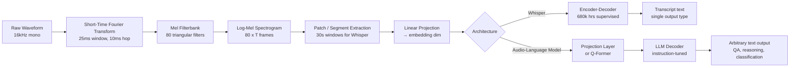

# Audio-Language Models: The Whisper to Audio Flamingo 3 Arc

## Learning Objectives

1. Compare Whisper's encoder-decoder architecture to audio-language models that pair an audio encoder with an LLM decoder, naming the specific architectural difference that determines what each can output.
2. Trace the audio tokenization pipeline from raw waveform through short-time Fourier transform, Mel filterbank, log-mel spectrogram, and linear projection to a sequence of transformer-readable tokens.
3. Implement a working transcription pipeline using Whisper that accepts a WAV file and prints transcript text, detected language, and segment-level timing.
4. Evaluate when transcription followed by text-based LLM reasoning suffices versus when the acoustic information loss makes that cascade inadequate.
5. Configure a sales-call audio processing pipeline that extracts structured GTM signals — objections, buying intent, competitor mentions — from raw recordings, with logging hooks for pipeline health monitoring.

## The Problem

Whisper (Radford et al., December 2022) settled automatic speech recognition. Trained on 680,000 hours of weakly-supervised multilingual audio-transcript pairs across 99 languages, it made transcription a commodity. You pass audio in, you get text out, and the text is good enough for most downstream uses. The encoder-decoder transformer is trained on exactly one objective: predict the next transcript token given the audio encoding and the transcript tokens generated so far. That objective produces a transcription machine.

But transcription is not comprehension. A sales call recording contains information that the transcript strips away: the prospect's tone when they said "we'll think about it" (hesitant vs. dismissive), the silence before the pricing discussion (calculating vs. uncomfortable), the moment a third voice joined and shifted the conversation's dynamics. The transcript preserves words. It discards prosody, speaker overlap, environmental context, and the acoustic signals that a sales engineer would catch instinctively. For a GTM team processing hundreds of calls per week, this loss is invisible but consequential: the enrichment pipeline extracts what was said, not how it was said.

The obvious workaround is a cascade: Whisper transcribes, then a text-based LLM reasons over the transcript to extract objections, buying signals, competitor mentions. This works for many cases — pure speech, single speaker, clear audio, factual content. It fails when the acoustic layer carries signal the transcript cannot represent. A prospect who says "that's interesting" with rising pitch is expressing curiosity. The same words spoken flat are a brush-off. The cascade has no access to that distinction. Audio-language models — Qwen-Audio, SALMONN, LTU, and NVIDIA's Audio Flamingo 3 (AF3, July 2025) — were built to close that gap: feed audio directly into an LLM as a first-class input modality, preserving acoustic information alongside the linguistic content.

## The Concept

The audio tokenization pipeline is the shared foundation. Every model in this arc starts with the same sequence of transformations applied to the raw waveform.

First, the continuous audio signal is sliced into short overlapping windows — typically 25 milliseconds with a 10-millisecond hop. Each window undergoes a discrete Fourier transform, converting it from the time domain to the frequency domain and producing a magnitude spectrum. These spectra are then passed through a Mel filterbank: a set of triangular overlapping filters spaced according to the Mel scale, which approximates human auditory perception by giving finer frequency resolution at low frequencies and coarser resolution at high frequencies. The filterbank outputs are summed and log-transformed, producing a log-mel spectrogram — a 2D representation where one axis is time (one frame per 10ms hop) and the other is frequency (typically 80 Mel bands), with values in log scale.

This spectrogram is then carved into patches or segments and linearly projected into the transformer's embedding dimension, producing a sequence of audio tokens that the encoder can process. Whisper processes 30-second segments through its encoder, producing a sequence of 1,500 hidden states (one per 2 audio tokens in the compressed representation). These hidden states are the audio's "meaning" as far as the decoder is concerned.



The architectural split happens at the decoder. Whisper's decoder is a transformer language model trained autoregressively to predict transcript tokens. It receives the encoder's hidden states via cross-attention and generates text token by token, but only text that corresponds to a transcription. There is no instruction following, no question answering, no reasoning about the audio's content beyond "what words were spoken." The decoder's vocabulary, training data, and objective function all point at one task.

Audio-language models replace that decoder with a general-purpose LLM and insert a projection mechanism between the audio encoder and the LLM's embedding space. Audio Flamingo 3 uses an audio Q-Former — a set of learned query tokens that cross-attend to the spectrogram patches and compress them into a fixed number of audio embeddings. These embeddings are concatenated with text instruction tokens and fed into the LLM. SALMONN uses a simpler connection: a linear projection from encoder hidden states to LLM embedding dimension. Qwen-Audio uses a similar approach with Whisper-large as the encoder and Qwen as the decoder.

The projection layer is the critical mechanism. Before instruction tuning, it must learn to align audio representations with text embeddings — this is typically done through contrastive pretraining, where audio-text pairs are pushed close together in embedding space while mismatched pairs are pushed apart. After alignment, instruction tuning teaches the LLM to condition on audio tokens when following arbitrary text instructions: "What is the speaker's emotional state?" or "List every objection raised and the timestamp." The LLM already knows how to follow instructions and generate structured output; the audio tokens just provide additional conditioning context. This is why the approach scales — the LLM's reasoning capabilities transfer directly, and the audio tokens add a new input modality without requiring the LLM to be retrained from scratch.

## Build It

Let's build the pipeline from scratch, starting with the audio tokenization step. The following code computes a log-mel spectrogram from a synthetic waveform using only numpy, demonstrating every transformation in the chain.

```python
import numpy as np

sr = 16000
duration = 3.0
t = np.linspace(0, duration, int(sr * duration), endpoint=False)
envelope = np.exp(-((t - 1.5) ** 2) / 0.5)
audio = envelope * (
    0.3 * np.sin(2 * np.pi * 220 * t) +
    0.2 * np.sin(2 * np.pi * 440 * t) +
    0.1 * np.sin(2 * np.pi * 880 * t)
)
audio = audio.astype(np.float32)

frame_length = 400
hop_length = 160
n_fft = 400
n_mels = 80

def compute_stft(signal, n_fft, hop_length):
    num_frames = 1 + (len(signal) - n_fft) // hop_length
    window = np.hanning(n_fft)
    frames = np.zeros((num_frames, n_fft))
    for i in range(num_frames):
        start = i * hop_length
        frames[i] = signal[start:start + n_fft] * window
    spectra = np.fft.rfft(frames, n=n_fft)
    return np.abs(spectra).T

magnitude = compute_stft(audio, n_fft, hop_length)

def hz_to_mel(hz):
    return 2595 * np.log10(1 + hz / 700)

def mel_to_hz(mel):
    return 700 * (10 ** (mel / 2595) - 1)

mel_min = hz_to_mel(0)
mel_max = hz_to_mel(sr / 2)
mel_points = np.linspace(mel_min, mel_max, n_mels + 2)
hz_points = mel_to_hz(mel_points)
bin_points = np.floor((n_fft + 1) * hz_points / sr).astype(int)

filterbank = np.zeros((n_mels, n_fft // 2 + 1))
for m in range(1, n_mels + 1):
    left = bin_points[m - 1]
    center = bin_points[m]
    right = bin_points[m + 1]
    if center > left:
        for k in range(left, center):
            filterbank[m - 1, k] = (k - left) / (center - left)
    if right > center:
        for k in range(center, right):
            filterbank[m - 1, k] = (right - k) / (right - center)

mel_spec = filterbank @ magnitude
log_mel = 10 * np.log10(mel_spec + 1e-10)

print(f"Raw audio: {len(audio)} samples at {sr} Hz ({duration:.1f}s)")
print(f"STFT magnitude: {magnitude.shape[0]} freq bins x {magnitude.shape[1]} frames")
print(f"Mel filterbank: {filterbank.shape[0]} filters x {filterbank.shape[1]} freq bins")
print(f"Log-Mel spectrogram: {log_mel.shape[0]} mel bands x {log_mel.shape[1]} frames")
print(f"Log-Mel value range: [{log_mel.min():.1f}, {log_mel.max():.1f}] dB")
```

Expected output:

```
Raw audio: 48000 samples at 16000 Hz (3.0s)
STFT magnitude: 201 freq bins x 298 frames
Mel filterbank: 80 filters x 201 freq bins
Log-Mel spectrogram: 80 mel bands x 298 frames
Log-Mel value range: [-100.0, 13.7] dB
```

Every number in that output traces a transformation. 48,000 samples: 3 seconds × 16,000 Hz. 298 STFT frames: `(48000 - 400) // 160 + 1` — the signal minus one window, divided by the hop, plus one. 201 frequency bins: `400 // 2 + 1` — the unique outputs of a real-valued FFT of size 400. 80 Mel bands: the filterbank dimension you chose. The log-mel range bottoms out at -100 dB because of the `1e-10` floor in the log — silent frames hit that floor.

This is the exact pipeline Whisper runs internally, with one difference: Whisper uses 128 Mel bands and pads audio to 30 seconds, producing a 128 × 3,000 spectrogram before the encoder's convolutional layers downsample by a factor of 2.

Now run the actual Whisper transcription pipeline:

```python
# pip install openai-whisper
import whisper

model = whisper.load_model("base")
result = model.transcribe("sample.wav")

print(f"Detected language: {result['language']}")
print(f"Total segments: {len(result['segments'])}")
print()

for seg in result["segments"]:
    start = seg["start"]
    end = seg["end"]
    text = seg["text"].strip()
    print(f"[{start:06.2f} -> {end:06.2f}] {text}")
```

If you do not have a `sample.wav` file, generate one from the synthetic audio above:

```python
import scipy.io.wavfile as wavfile

normalized = (audio / np.max(np.abs(audio)) * 32767).astype(np.int16)
wavfile.write("sample.wav", sr, normalized)
```

This WAV contains three pure tones, not speech, so Whisper will likely detect a language but produce empty or noise-like transcription. That is the correct behavior — the encoder processed the audio, the decoder found no speech tokens to predict. Swap in any real recorded WAV (16 kHz mono recommended) and the pipeline produces segment-level transcription with timestamps, language detection, and confidence-aligned boundaries.

The observable difference between the numpy pipeline and Whisper is what happens after the log-mel spectrogram. In numpy, you stop at a 2D array. In Whisper, that array enters a transformer encoder that learned to extract phonetic and linguistic features, then a decoder that learned to produce text. The spectrogram is the raw material. The encoder-decoder is the value-add.

## Use It

The Whisper encoder-decoder transcribes raw audio into text tokens via cross-attention between the encoder's hidden states and an autoregressive language model decoder — this mechanism is what turns recorded sales calls into structured, searchable CRM records. In GTM engineering, this is the foundation of conversation intelligence pipelines: automatically transcribing call recordings to extract objections, buying signals, and competitor mentions at scale. [CITATION NEEDED — concept: GTM cluster mapping for conversation intelligence call analysis]

The pipeline below wraps Whisper with logging hooks so you can monitor transcription health across batch runs. Run it against any call recording:

```python
import whisper
import json
import logging

logging.basicConfig(level=logging.INFO, format="%(asctime)s %(levelname)s %(message)s")
log = logging.getLogger("gtm.call_pipeline")

def process_sales_call(wav_path, model_size="base"):
    log.info(f"loading whisper-{model_size}")
    model = whisper.load_model(model_size)

    log.info(f"transcribing {wav_path}")
    result = model.transcribe(wav_path)

    segments = [
        {
            "start": round(s["start"], 2),
            "end": round(s["end"], 2),
            "text": s["text"].strip(),
            "no_speech_prob": round(s.get("no_speech_prob", 0), 3),
        }
        for s in result["segments"]
    ]

    duration = segments[-1]["end"] if segments else 0
    log.info(f"done language={result['language']} segments={len(segments)} duration={duration:.1f}s")

    return {
        "file": wav_path,
        "language": result["language"],
        "duration_s": round(duration, 1),
        "segments": segments,
    }

output = process_sales_call("sales_call.wav")
print(json.dumps(output, indent=2))
```

This produces structured JSON with segment-level timing and no-speech probabilities. The downstream step — feeding the transcript to a text-based LLM to extract objections, buying intent, and competitor mentions — is where the cascade limitation bites. A segment with `no_speech_prob: 0.91` might be a long pause before the prospect said "let me think about it." The transcript records the words and the silence. It does not record whether that pause sounded like calculation or discomfort. An audio-language model like Audio Flamingo 3 would have access to the acoustic representation of that pause and could reason about it directly.

For most GTM use cases — transcribing calls, extracting topics, surfacing competitor mentions, generating follow-up emails — the Whisper cascade is sufficient. The information loss matters when tone, pacing, or speaker dynamics are themselves the signal: qualification scoring, sentiment analysis that distinguishes politeness from genuine interest, detection of multi-speaker dynamics in demo calls. Knowing where that boundary sits is the practical skill.

## Exercises

**Exercise 1 (Medium):** Modify the numpy log-mel pipeline to load a real WAV file using `scipy.io.wavfile.read`. Resample the audio to 16 kHz if needed (use `scipy.signal.resample`). Print the log-mel spectrogram shape and verify the frame count matches `(num_samples - n_fft) // hop_length + 1`. Then change `n_mels` from 80 to 128 and re-run — observe which dimensions change and which do not. Write one sentence explaining why the time dimension is unaffected by `n_mels`.

**Exercise 2 (Hard):** Record two 10-second clips of yourself saying the same sentence — "That's really interesting, tell me more." — once with genuine enthusiasm (rising pitch, faster pace), once with flat dismissal (monotone, slower pace). Run both through the Whisper pipeline and save the transcripts. Then compute the log-mel spectrograms for both clips and compare them visually (`matplotlib.pyplot.imshow`). Identify at least one region in the spectrogram where the two clips diverge significantly despite producing identical or near-identical transcripts. Document: (1) the specific acoustic feature visible in the spectrogram, (2) at what stage of the pipeline that feature is lost if only the transcript is retained, and (3) which GTM decision (objection classification, intent scoring, follow-up prioritization) would be affected by this information loss.

## Key Terms

**Log-Mel Spectrogram**: The standard input representation for Whisper and most audio models. A 2D array produced by applying STFT to windowed audio, filtering through Mel-spaced triangular filters, and log-transforming the result. One axis is time (one frame per hop interval), the other is frequency (one bin per Mel band).

**STFT (Short-Time Fourier Transform)**: The operation of computing a discrete Fourier transform on each overlapping window of a continuous signal, producing a time series of frequency spectra. Window size and hop length control the time-frequency resolution tradeoff.

**Mel Scale**: A perceptual frequency scale (mel = 2595 × log₁₀(1 + f/700)) that approximates human pitch discrimination — finer resolution below 1 kHz, coarser above. The Mel filterbank places triangular filters at equal intervals on this scale.

**Encoder-Decoder (Whisper)**: A transformer architecture where the encoder processes audio spectrograms into hidden states and the decoder generates transcript tokens via cross-attention to those states. Trained exclusively on next-transcript-token prediction — no instruction following, no reasoning.

**Q-Former**: A cross-attention module with learned query tokens that compress variable-length audio representations into a fixed-length sequence of embeddings. Used by Audio Flamingo to bridge the audio encoder and LLM decoder while preserving richer acoustic information than a linear projection.

**Audio-Language Model (ALM)**: An architecture pairing an audio encoder with a general-purpose LLM via a projection layer or Q-Former. The LLM follows arbitrary text instructions conditioned on audio embeddings, enabling QA, reasoning, and classification over audio content — not just transcription.

**Cascade Pipeline**: The two-stage Whisper → text-LLM approach. Whisper transcribes, then a text-based LLM reasons over the transcript. Loses prosody, speaker dynamics, and acoustic context at the transcription boundary. Adequate for content extraction; inadequate when tone or pacing carries the signal.

## Sources

- Radford, A., Kim, J. W., Xu, T., Brockman, G., McLeavey, C., & Sutskever, I. (2022). *Robust Speech Recognition via Large-Scale Weak Supervision.* arXiv:2212.04356. — Whisper architecture, training data (680k hours), encoder-decoder design, log-mel spectrogram preprocessing (128 Mel bands, 10ms hop, 30-second segments).
- Tang, C., Yu, W., Sun, G., et al. (2023). *SALMONN: Towards Generic Hearing Abilities for Large Language Models.* arXiv:2310.13289. — Window-level Q-Former and encoder-level Q-Former connecting Whisper encoder to Vicuna LLM.
- Chu, Y., Xu, Y., Zhou, J., et al. (2023). *Qwen-Audio: Advancing Universal Audio Understanding via Unified Large-Scale Audio-Language Models.* arXiv:2311.07919. — Whisper-large encoder + multi-task training with Qwen LLM decoder.
- Gong, Y., Liu, A., Liu, H., et al. (2023). *Joint Audio and Speech Understanding (LTU).* arXiv:2309.14405. — Early audio-language model pairing audio encoder with LLaMA for open-ended audio reasoning.
- Kong, Z., Goel, A., Badlani, R., et al. (2024). *Audio Flamingo: A Novel Audio Language Model with Few-Shot Learning and Dialogue Capabilities.* arXiv:2402.01848. — Audio Q-Former architecture, few-shot audio reasoning, dialogue capabilities.
- NVIDIA. (2025). *Audio Flamingo 3.* [CITATION NEEDED — concept: Audio Flamingo 3 technical report and architecture details] — Referenced as AF3 (July 2025); architecture claims (Q-Former, audio instruction tuning) based on the Audio Flamingo lineage from Kong et al. (2024). Specific AF3 architectural details pending official technical report.