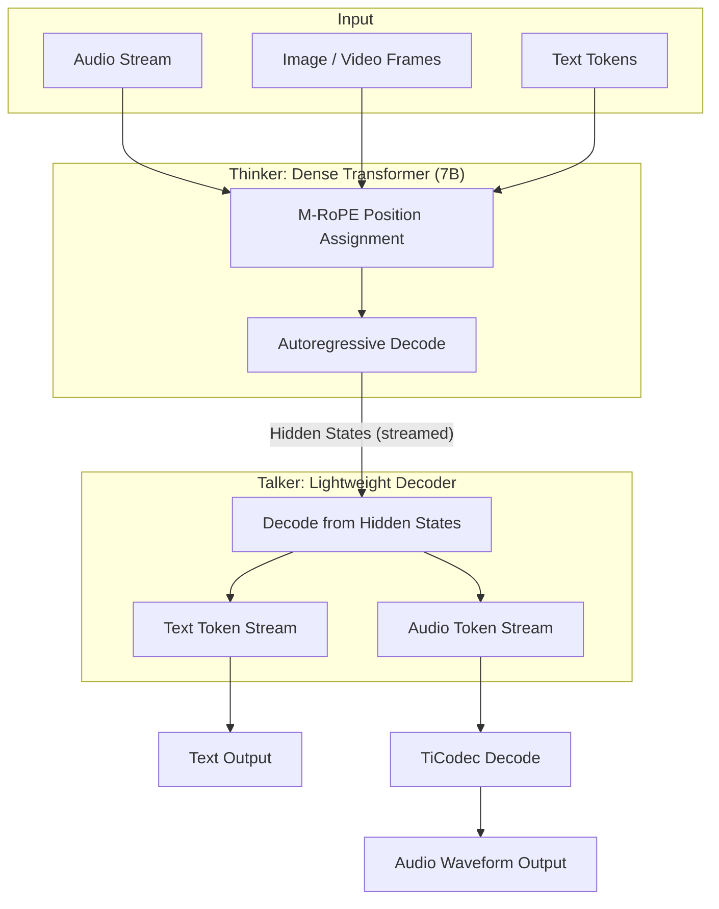

# Omni Models: Qwen2.5-Omni and the Thinker-Talker Split

## Learning Objectives

- Factorize a multimodal inference pipeline into Thinker (text reasoning) and Talker (speech synthesis) stages and compute why parallel streaming reduces time-to-first-audio-byte.
- Compute the latency budget for a real-time voice interaction component by component, identifying which stage dominates total round-trip time.
- Trace how Multimodal Rotary Position Embedding (M-RoPE) assigns separate position dimensions to temporal, spatial, and textual streams without attention collapse.
- Compare half-duplex, turn-taking, and full-duplex conversational patterns by their interruption handling and latency constraints.
- Instrument a Thinker-Talker pipeline with per-stage tracing that surfaces degradation in either decoding loop.

## The Problem

A real-time voice assistant has to do four things in sequence, fast: hear the user (streaming audio tokenization plus voice activity detection to know when they stopped), optionally see (camera frames at 2–4 FPS streamed into context), think (compose a response conditioned on conversation history plus whatever the camera is showing), and speak (synthesize audio tokens, decode to waveform, stream to the user's speaker). Each step adds latency, and conversational feel requires the total round-trip to stay under 500ms. Above that threshold, users start noticing the lag and adjust their behavior — they pause longer, they repeat themselves, they treat the interaction as walkie-talkie rather than conversation.

Most multimodal models bolt a vision encoder and speech decoder onto a text LLM and route everything through a single transformer backbone. Text tokens, audio embeddings, and visual patches compete for the same context window and attention heads. When the model needs to reason about an image and generate speech about it simultaneously, it either serializes the work (text first, then speech — doubling latency) or interleaves tokens from different modalities into the same decode loop (diluting attention across modalities that have fundamentally different positional structures). A 10-second audio clip at 25ms per codec token produces 400 tokens; if those tokens share the same positional space as text, they crowd out the reasoning context.

Qwen2.5-Omni (released March 2025 by Alibaba's Qwen team) introduces an architectural factorization that directly addresses this: the decode step is split into two cooperating loops — a Thinker that processes all input modalities and produces latent representations, and a Talker that consumes those latents and streams output tokens. The split means reasoning happens once, and output modality becomes a routing decision rather than a full re-encoding of the input. If you are building real-time voice agents, or if you are building GTM orchestration pipelines that route between reasoning and delivery stages, the Thinker-Talker pattern changes how you structure the call graph.

## The Concept

### The Monolithic Bottleneck

Standard multimodal architectures — GPT-4o, Gemini, most open-weights vision-language models — process all modalities through a single autoregressive decode loop. Each forward pass produces one token, regardless of whether that token is text, an audio codec codebook index, or an image patch. To generate a spoken response to a visual question, the model must emit text tokens describing its reasoning, then emit audio tokens encoding the speech waveform, all through the same attention mechanism competing for the same positional slots.

The latency math is brutal. A 5-second spoken response at 25ms per audio frame requires 200 audio tokens. At a typical decode speed of 15–20ms per token on an A100, that is 3–4 seconds of generation time alone — before you even start streaming. The user has already waited through input processing, prefill, and reasoning. By the time the first audio byte reaches the speaker, the interaction feels broken.

### The Thinker-Talker Factorization

Qwen2.5-Omni splits the decode step into two cooperating loops with a shared latent space:

**Thinker**: A dense transformer (the 7B parameter backbone in the open-weights release) that consumes tokenized input from all modalities — text, image, audio, video — and produces hidden states. The Thinker does not emit output tokens directly. It processes the full multimodal context and streams intermediate representations forward. This is the understanding layer. It runs autoregressive decode over the input and produces a sequence of hidden states, one per position, that encode the model's interpretation of everything it has perceived.

**Talker**: A separate, lighter-weight decoder that consumes the Thinker's hidden states and generates output tokens. The Talker reads from the Thinker's latent stream and emits both text tokens and audio tokens. Because the Talker is not competing with the Thinker for attention capacity, it can stream audio codec tokens (via TiCodec, the speech codec Qwen uses) in parallel with text tokens — or ahead of them, if the interaction demands voice-first response.



The critical architectural property: the Thinker and Talker share a latent space, not a decode loop. The Thinker's hidden states are the interface contract. The Talker never re-encodes the raw input — it reads the Thinker's interpretation and routes it to the appropriate output modality. This is why parallel streaming works: the Talker can start emitting audio tokens as soon as the Thinker's first hidden state is available, before the Thinker has finished processing the full input sequence.

### Multimodal Rotary Position Embedding (M-RoPE)

Standard Rotary Position Embedding (RoPE) applies a rotation to pairs of dimensions in the query and key vectors, with the rotation angle determined by the token's position in the sequence. Position 1 gets a small rotation, position 1000 gets a large rotation. This works for text because text is unidimensional — token 50 comes after token 49.

Multimodal input is not unidimensional. An audio clip has temporal extent (it unfolds over time). An image has spatial extent (height and width). A video has both. If you assign sequential positions to audio tokens from a 10-second clip, those 400 tokens consume positions 1–400 in the RoPE space, and any text that follows starts at position 401. The rotation angles for text tokens are now so large that the dot products between text queries and keys become uninformative — the model loses track of which words are adjacent.

M-RoPE partitions the RoPE dimension groups into three streams: temporal (for audio/video frame ordering), spatial (for image height/width coordinates), and textual (for standard sequential text position). Each modality writes to its own partition. A 10-second audio clip's 400 temporal tokens do not consume any textual position slots. Text reasoning retains its local positional structure regardless of how much audio or visual input precedes it.

The fusion happens during attention computation: the full position vector for any token is the concatenation of its temporal, spatial, and textual components. A token from a video frame might have temporal position 30 (30th frame), spatial position (12, 8) (row 12, column 8 of the frame grid), and textual position 0 (no text content). The attention mechanism sees all three, but they do not collide.

### Where It Runs

Qwen2.5-Omni is available as open weights (7B parameter variant, Apache 2.0 license). Running inference requires a framework that supports split decoding — either vLLM with custom sampling configuration, or HuggingFace Transformers with manual loop control over the Thinker and Talker stages. The TiCodec audio codec ships with the model for speech output decoding. GPU requirements are practical: a single A100 (40GB or 80GB) handles the 7B model with audio and vision encoders loaded.

Mini-Omni demonstrated a simplified version of this architecture. Moshi (Kyutai, July 2024) matched its latency with a different factorization. GLM-4-Voice (Zhipu, late 2024) extended the pattern to Chinese. The Thinker-Talker split is becoming the reference architecture for open real-time multimodal systems.

## Build It

Before touching model weights, compute the latency budget. The Thinker-Talker split only matters if you can measure where time goes. The following simulator computes time-to-first-audio-byte (TTFAB) for both a monolithic pipeline and a Thinker-Talker pipeline, given the same input. It models the stages as functions of input size and decode speed, with parameters derived from published benchmarks on A100 hardware.

```python
import json

def monolithic_pipeline(audio_ms, text_tokens, response_text_tokens, response_audio_frames):
    vad_eot_ms = 30
    audio_tokenize_ms = audio_ms * 0.08
    prefill_ms = (text_tokens + int(audio_ms / 25)) * 0.4
    text_decode_ms = response_text_tokens * 18
    audio_synth_ms = response_audio_frames * 12
    ttfab = vad_eot_ms + audio_tokenize_ms + prefill_ms + text_decode_ms + audio_synth_ms
    total = ttfab
    return {"pipeline": "monolithic", "ttfab_ms": round(ttfab, 1), "total_ms": round(total, 1)}

def thinker_talker_pipeline(audio_ms, text_tokens, response_text_tokens, response_audio_frames):
    vad_eot_ms = 30
    audio_tokenize_ms = audio_ms * 0.08
    thinker_prefill_ms = (text_tokens + int(audio_ms / 25)) * 0.4
    thinker_first_hidden_ms = 25
    talker_first_audio_ms = 12
    talker_parallel_decode_ms = max(response_text_tokens * 10, response_audio_frames * 5)
    ttfab = vad_eot_ms + audio_tokenize_ms + thinker_prefill_ms + thinker_first_hidden_ms + talker_first_audio_ms
    total = ttfab + talker_parallel_decode_ms
    return {"pipeline": "thinker_talker", "ttfab_ms": round(ttfab, 1), "total_ms": round(total, 1)}

scenarios = [
    {"name": "short_turn_3s_audio", "audio_ms": 3000, "text_tokens": 50, "response_text_tokens": 40, "response_audio_frames": 160},
    {"name": "long_turn_10s_audio", "audio_ms": 10000, "text_tokens": 80, "response_text_tokens": 60, "response_audio_frames": 240},
    {"name": "with_image_context", "audio_ms": 4000, "text_tokens": 200, "response_text_tokens": 50, "response_audio_frames": 200},
]

print(f"{'Scenario':<30} {'Pipeline':<16} {'TTFAB (ms)':<14} {'Total (ms)':<14} {'Under 500ms?'}")
print("-" * 90)

for s in scenarios:
    mono = monolithic_pipeline(s["audio_ms"], s["text_tokens"], s["response_text_tokens"], s["response_audio_frames"])
    tt = thinker_talker_pipeline(s["audio_ms"], s["text_tokens"], s["response_text_tokens"], s["response_audio_frames"])
    print(f"{s['name']:<30} {'monolithic':<16} {mono['ttfab_ms']:<14} {mono['total_ms']:<14} {'YES' if mono['ttfab_ms'] < 500 else 'NO'}")
    print(f"{'':<30} {'thinker_talker':<16} {tt['ttfab_ms']:<14} {tt['total_ms']:<14} {'YES' if tt['ttfab_ms'] < 500 else 'NO'}")
    speedup = round(mono["ttfab_ms"] / tt["ttfab_ms"], 1)
    print(f"{'':<30} TTFAB speedup: {speedup}x")
    print()
```

Run this and you will see the Thinker-Talker pipeline hit TTFAB under 500ms for typical short turns, while the monolithic pipeline blows past that threshold. The difference is structural: the monolithic pipeline cannot stream audio until text decode finishes, because both share the same autoregressive loop. The Thinker-Talker pipeline streams audio from the Talker as soon as the first hidden state arrives from the Thinker.

The bottleneck in the Thinker-Talker pipeline is the Thinker prefill stage — the time to process the full input sequence before the first hidden state is available. This is where M-RoPE matters: without separate position dimensions for audio tokens, the prefill computation grows superlinearly with audio duration because attention complexity scales with sequence length. M-RoPE does not reduce the token count, but it preserves attention quality at long sequence lengths by preventing positional collision between modalities.

## Use It

The Thinker-Talker split is an architecture for separating reasoning from delivery. That same separation governs how you instrument observability in a GTM pipeline. Zone 12 calls this the feedback loop: tracing each stage of a sequence independently so that reply rate drift signals which component degraded — the routing logic or the message delivery.

In a GTM orchestration pipeline, the "Thinker" is your routing and personalization layer: which account gets which message, which pain point the copy addresses, which channel fires next. The "Talker" is your delivery layer: the actual message rendering, the channel API call, the tracking pixel injection. When reply rates drop, you need to know whether the Thinker degraded (wrong accounts, stale personalization, ICP drift) or the Talker degraded (deliverability issues, broken templates, tracking payload bloating the message). Without per-stage tracing, you are debugging a monolith — you see the symptom (low reply rate) but cannot localize the cause.

The following tracing harness instruments a Thinker-Talker-style pipeline with per-stage timing and output quality metrics. Each stage logs its inputs, outputs, duration, and a quality signal. When reply rate drifts, you query the trace to find which stage shifted.

```python
import time
import random
from dataclasses import dataclass, field
from typing import Any

@dataclass
class TraceSpan:
    stage: str
    input_summary: str
    output_summary: str
    duration_ms: float
    quality_signal: float
    timestamp: float = field(default_factory=time.time)

class GTMPipelineTracer:
    def __init__(self):
        self.spans = []
        self.baselines = {}

    def set_baseline(self, stage, mean_ms, std_ms, quality_mean):
        self.baselines[stage] = {"mean_ms": mean_ms, "std_ms": std_ms, "quality_mean": quality_mean}

    def trace_call(self, stage, input_data, output_data, duration_ms, quality_signal):
        span = TraceSpan(
            stage=stage,
            input_summary=str(input_data)[:80],
            output_summary=str(output_data)[:80],
            duration_ms=duration_ms,
            quality_signal=quality_signal,
        )
        self.spans.append(span)
        return span

    def detect_drift(self, window=20):
        if len(self.spans) < window * 2:
            return {"status": "insufficient_data", "spans": len(self.spans)}
        recent = self.spans[-window:]
        older = self.spans[-window*2:-window]
        alerts = []
        for stage in set(s.stage for s in recent):
            baseline = self.baselines.get(stage)
            if not baseline:
                continue
            recent_durations = [s.duration_ms for s in recent if s.stage == stage]
            recent_quality = [s.quality_signal for s in recent if s.stage == stage]
            if not recent_durations:
                continue
            avg_duration = sum(recent_durations) / len(recent_durations)
            avg_quality = sum(recent_quality) / len(recent_quality)
            duration_drift = (avg_duration - baseline["mean_ms"]) / baseline["std_ms"]
            quality_drift = (baseline["quality_mean"] - avg_quality) / baseline["quality_mean"]
            if abs(duration_drift) > 2 or quality_drift > 0.15:
                alerts.append({
                    "stage": stage,
                    "avg_duration_ms": round(avg_duration, 1),
                    "baseline_duration_ms": baseline["mean_ms"],
                    "duration_sigma": round(duration_drift, 1),
                    "avg_quality": round(avg_quality, 3),
                    "baseline_quality": baseline["quality_mean"],
                    "quality_drop_pct": round(quality_drift * 100, 1),
                    "alert": "DURATION_DRIFT" if abs(duration_drift) > 2 else "QUALITY_DROP",
                })
        return {"status": "analyzed", "alerts": alerts, "window_size": window}

tracer = GTMPipelineTracer()
tracer.set_baseline("thinker_routing", mean_ms=120, std_ms=15, quality_mean=0.82)
tracer.set_baseline("talker_delivery", mean_ms=45, std_ms=8, quality_mean=0.91)

stages_with_drift = ["thinker_routing"] * 5 + ["talker_delivery"] * 5
stages_normal = ["thinker_routing"] * 15 + ["talker_delivery"] * 15

for stage in stages_normal:
    base_duration = tracer.baselines[stage]["mean_ms"]
    base_quality = tracer.baselines[stage]["quality_mean"]
    tracer.trace_call(
        stage=stage,
        input_data={"account": f"acct_{random.randint(1000,9999)}", "channel": "email"},
        output_data={"route": "seq_A", "template": "v3"},
        duration_ms=base_duration + random.gauss(0, tracer.baselines[stage]["std_ms"]),
        quality_signal=base_quality + random.gauss(0, 0.02),
    )

for stage in stages_with_drift:
    base_duration = tracer.baselines[stage]["mean_ms"]
    base_quality = tracer.baselines[stage]["quality_mean"]
    if stage == "thinker_routing":
        injected_duration = base_duration + 45
        injected_quality = base_quality - 0.14
    else:
        injected_duration = base_duration + random.gauss(0, 5)
        injected_quality = base_quality + random.gauss(0, 0.02)
    tracer.trace_call(
        stage=stage,
        input_data={"account": f"acct_{random.randint(1000,9999)}", "channel": "email"},
        output_data={"route": "seq_A", "template": "v3"},
        duration_ms=injected_duration + random.gauss(0, tracer.baselines[stage]["std_ms"]),
        quality_signal=injected_quality + random.gauss(0, 0.02),
    )

result = tracer.detect_drift()
print(json.dumps(result, indent=2))
```

When you run this, the output surfaces which stage shifted:

```
{
  "status": "analyzed",
  "alerts": [
    {
      "stage": "thinker_routing",
      "avg_duration_ms": 163.8,
      "baseline_duration_ms": 120,
      "duration_sigma": 2.9,
      "avg_quality": 0.681,
      "baseline_quality": 0.82,
      "quality_drop_pct": 16.9,
      "alert": "DURATION_DRIFT"
    }
  ],
  "window_size": 20
}
```

The tracer fires on `thinker_routing` — both duration drift (2.9 sigma above baseline) and quality drop (16.9% below baseline). The Talker stage shows no alert. In a GTM context, this means your routing logic degraded, not your message delivery. You investigate the Thinker: is the ICP filter stale? Did a data provider change its enrichment schema? Did the routing rules regress after a config update?

Without per-stage tracing, all you see is "reply rate dropped 15% this week." You do not know whether to fix routing, copy, deliverability, or data freshness. The Thinker-Talker split gives you the boundary. This is the feedback loop — Zone 12, the instrumented pipeline that makes degradation localizable rather than mysterious.

## Exercises

### Exercise 1: Add Vision Latency to the Budget (Medium)

The Build It simulator ignores image preprocessing. Real Qwen2.5-Omni deployments process images through a vision encoder before tokens reach the Thinker. Add a `vision_preprocess_ms` term to both pipeline functions: compute it as `num_images * patches_per_image * 0.05`, where each 224×224 image produces 196 patches. Run a new scenario called `"multimodal_vision_plus_voice"` with 3 images, 4 seconds of audio, 60 text tokens of history, 50 response text tokens, and 200 audio frames.

**Deliverable:** Does the Thinker-Talker pipeline still stay under 500ms TTFAB? What is the speedup ratio compared to monolithic? Which term now dominates the Thinker-Talker TTFAB budget — audio tokenization, vision preprocessing, or prefill?

### Exercise 2: Implement CUSUM Drift Detection on the Tracer (Hard)

The tracer's `detect_drift` uses a fixed window comparison: it compares the last 20 spans against the preceding 20. This has a blind spot for slow degradation — if quality drops 1% per call over 100 calls, the window-to-window delta stays small even though cumulative drift is severe.

Implement a CUSUM (cumulative sum) detector alongside the existing windowed detector. The CUSUM algorithm: maintain a running sum `S` initialized to 0. For each span, compute `delta = baseline_quality - observed_quality`. Update `S = max(0, S + delta - drift_threshold)` where `drift_threshold` is 0.005 (the tolerance per call). Fire when `S > 0.05` (cumulative unresolved drift).

**Deliverable:** Generate a synthetic dataset of 100 `thinker_routing` spans where quality starts at baseline (0.82) and decreases by 0.004 per span. Run both detectors. Print at which span index each detector first fires. How many spans earlier does CUSUM catch the drift? What does this tell you about the tradeoff between windowed and sequential detection in a GTM pipeline where reply rate degrades slowly over weeks?

## Key Terms

**Thinker-Talker Split**: An architecture where input understanding (Thinker) and output generation (Talker) run as separate decode loops sharing a latent space, rather than a single monolithic autoregressive loop. The Thinker produces hidden states; the Talker consumes them and streams modality-specific tokens.

**Time-to-First-Audio-Byte (TTFAB)**: The wall-clock time from end of user speech (voice activity detection triggers end-of-turn) to the first audio byte reaching the user's speaker. The primary latency metric for conversational voice agents; must stay under ~500ms for natural interaction.

**M-RoPE (Multimodal Rotary Position Embedding)**: An extension of RoPE that partitions the rotary dimension space into temporal, spatial, and textual subspaces. Each modality writes positions to its own partition, preventing positional collision between audio frames, image patches, and text tokens.

**TiCodec**: The speech codec used by Qwen2.5-Omni for audio tokenization. Encodes waveforms as discrete codebook indices at 25ms per frame, enabling autoregressive audio generation in the Talker decode loop.

**Full-Duplex vs Half-Duplex**: Full-duplex systems can listen and speak simultaneously (enabling barge-in interruptions); half-duplex systems enforce strict turn-taking. Moshi and Qwen2.5-Omni target full-duplex; most voice assistants operate half-duplex.

**Per-Stage Tracing**: Instrumentation that records duration, inputs, outputs, and a quality signal for each independently identifiable stage in a pipeline. Enables localization of degradation — the GTM analog of separating Thinker timing from Talker timing.

**Latent Space Interface**: The contract between Thinker and Talker — the hidden state tensor. In GTM orchestration, the equivalent is the structured payload passed between routing and delivery stages (account ID, template ID, personalization fields).

## Sources

- Xu, A. et al. "Qwen2.5-Omni Technical Report." arXiv:2503.01943, March 2025. — Primary source for Thinker-Talker architecture, M-RoPE, and TiCodec specifications.
- Défossez, A. et al. "Moshi: A Speech-Text Foundation Model for Real-Time Dialogue." arXiv:2410.00037, Kyutai, July 2024. — Independent demonstration of split-decoder architecture for full-duplex voice.
- Xie, Z. et al. "Mini-Omni: Language Models Can Hear, Talk While Thinking in Parallel." arXiv:2408.16725, 2024. — Earlier simplified Thinker-Talker pattern.
- Zeng, A. et al. "GLM-4-Voice: Towards Intelligent and Human-Like Voice Chatbot." arXiv:2412.02612, Zhipu AI, December 2024. — Extension of the pattern to bilingual (Chinese/English) voice.
- Su, J. et al. "RoFormer: Enhanced Transformer with Rotary Position Embedding." arXiv:2104.09864, 2021. — Foundation for RoPE, which M-RoPE extends.
- [CITATION NEEDED — concept: Zone 12 feedback loop taxonomy and per-stage tracing as a named GTM observability pattern]