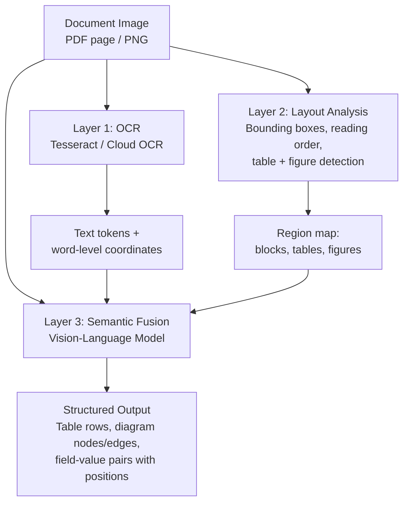

# Document and Diagram Understanding

## Learning Objectives

- Build a multimodal extraction pipeline that processes a document image through text extraction, layout analysis, and vision-language semantic fusion in a single API call.
- Compare VLM-based document understanding against OCR-only extraction and identify which structural signals each approach preserves or destroys.
- Extract structured data from mixed-content documents containing tables, diagrams, and prose by prompting a vision-language model for grounded JSON output.
- Implement a fallback chain for document processing that degrades gracefully from multimodal extraction to OCR-plus-heuristics to human review.
- Evaluate extraction accuracy against ground-truth labels across multiple document types using precision and recall per field.

## The Problem

Documents and diagrams are the dark matter of GTM data. Contracts arrive as PDFs with signature blocks and redlines. Security reviews ship as questionnaires with compliance tables and architecture diagrams. Org charts come through as seller attachments in PowerPoint or scanned images. Every one of these carries information that a CRM field cannot capture natively — and every one of them resists naive text extraction.

Raw text extraction misses structure. Run Tesseract on a vendor security questionnaire and you get a character dump: the words "SOC2-1" and "Pass" appear in the output, but the spatial relationship that says "SOC2-1's status is Pass" is flattened into a linear stream. Column headers detach from their rows. Table cells merge into run-on text. Diagram nodes become disconnected labels floating in a sea of characters. The OCR engine did its job — it found the characters — but the document's meaning was not in the characters alone.

Raw vision misses semantics. A pure image-classification model can detect that a region contains a table, but it cannot read the cell contents. It can identify that a flowchart exists, but it cannot transcribe the edge labels. Vision without text is structure without content. The gap between these two approaches — text without structure and structure without text — is exactly the gap that multimodal document understanding fills. The mechanism bridges both channels: it sees the layout and reads the text in a single forward pass, producing interpretations grounded in the spatial arrangement of the page.

## The Concept

Document cognition operates across three conceptual layers, each adding a dimension of meaning that the previous layer cannot recover alone.

**Layer 1 — OCR and text extraction.** This is the Tesseract era. The engine scans the page image, detects character glyphs, and emits a string. It also produces per-word bounding boxes in most implementations. What it loses: spatial relationships between words, the boundaries of tables and figures, reading order in multi-column layouts, and any distinction between a header and a footnote. The output is a flat stream of characters — useful as raw material, but stripped of the document's structural skeleton.

**Layer 2 — Layout analysis.** This layer takes the OCR output plus the page image and partitions the page into semantic regions: headers, paragraphs, tables, figures, sidebars, footnotes. Models like LayoutLMv3 process three input streams simultaneously — text tokens, bounding-box coordinates, and image patches — with a unified masking strategy that lets the model learn cross-modal attention. The layout analyzer answers questions like "is this cell a header or a data row?" and "does this column belong to this table or the one below it?" What it still misses: the semantic meaning of a diagram's arrows, the logical flow implied by a flowchart's topology, and the interpretation of figures that convey information through visual metaphor rather than text.

**Layer 3 — Semantic fusion.** A vision-language model consumes the rendered page image (or a crop of a specific region) alongside any extracted text and produces a grounded interpretation. This is where the model does not merely read the document — it sees it and reads it simultaneously. A table processed as an image retains its column semantics because the model can perceive that "Status" is the header above the "Pass" cell. A diagram's arrows are not just lines; the model can reason that "API Gateway points to Auth Service" is a directional dependency. The key mechanism is that the VLM's cross-modal attention binds visual layout features to text token embeddings, so the spatial position of a word becomes part of its representation.



Diagrams require the same three-layer stack but shift the emphasis toward visual reasoning. A flowchart is a graph: nodes (boxes with labels), edges (arrows or lines), and edge labels (conditions like "if valid" or "on error"). Detecting these requires the model to parse spatial topology — which box is upstream of which, which arrows have conditions, where cycles exist. An org chart is a tree: reporting relationships encoded as vertical or horizontal nesting. An architecture diagram is a directed graph with typed edges (data flow, dependency, network path). The VLM handles all of these through the same mechanism — it sees the rendered image and produces structured descriptions of the visual relationships — but the quality of extraction depends heavily on the model's spatial reasoning capability and the resolution of the input image.

The historical arc here matters for understanding why the current approach works. Pre-2021, the stack was a pipeline: Tesseract OCR plus a separate layout model plus table-extraction heuristics, glued together with custom code. Each stage introduced error that compounded downstream. By 2023, OCR-free models like Donut and Nougat replaced the pipeline with a single encoder-decoder that consumed the page image and emitted structured markup (JSON or LaTeX) directly — eliminating the OCR error propagation but requiring task-specific fine-tuning. By 2025–2026, frontier VLMs like Claude handle documents natively: you pass the page image at sufficient resolution and the model produces structured output through prompting alone, no fine-tuning required. The three layers still exist conceptually inside the model's architecture, but they are fused into a single inference pass rather than chained as separate processing stages.

## Build It

The following code generates a synthetic vendor assessment document — complete with a compliance table, an architecture diagram, and a notes section — then sends it to Claude for multimodal extraction. The model sees the rendered image and produces structured JSON capturing table rows, diagram component relationships, and a prose summary. Every field in the output is grounded in the visual layout, not just the character stream.

```python
import anthropic
import base64
import json
from PIL import Image, ImageDraw

img = Image.new("RGB", (900, 520), "white")
d = ImageDraw.Draw(img)

d.rectangle([0, 0, 900, 50], fill="#1a1a2e")
d.text((25, 18), "Vendor Security Assessment — Q4 2025", fill="white")

d.text((25, 70), "Compliance Controls", fill="black")
d.rectangle([25, 95, 875, 120], fill="#d6d6d6")
d.text((35, 100), "ID         Control Description                              Status", fill="black")
d.line([(25, 120), (875, 120)], fill="black", width=1)
d.text((35, 128), "SOC2-1     Multi-factor authentication enforced             Pass", fill="black")
d.line([(25, 150), (875, 150)], fill="#b0b0b0", width=1)
d.text((35, 158), "SOC2-2     AES-256 encryption at rest for all databases     Pass", fill="black")
d.line([(25, 180), (875, 180)], fill="#b0b0b0", width=1)
d.text((35, 188), "SOC2-3     Annual penetration testing by third party       Fail", fill="black")
d.line([(25, 210), (875, 210)], fill="black", width=2)

d.text((25, 240), "System Architecture", fill="black")
d.rectangle([45, 268, 175, 318], outline="#2980b9", width=2)
d.text((60, 285), "API Gateway", fill="black")
d.line([(175, 293), (275, 293)], fill="#2980b9", width=2)
d.text((195, 278), "HTTPS", fill="#666666")
d.rectangle([275, 268, 405, 318], outline="#27ae60", width=2)
d.text((290, 285), "Auth Service", fill="black")
d.line([(405, 293), (505, 293)], fill="#27ae60", width=2)
d.text((420, 278), "JWT", fill="#666666")
d.rectangle([505, 268, 635, 318], outline="#8e44ad", width=2)
d.text((535, 285), "Database", fill="black")

d.text((25, 360), "Notes: The Auth Service validates JWT tokens before any database", fill="black")
d.text((25, 380), "operation. The API Gateway enforces rate limits at 1000 req/min.", fill="black")

img_path = "/tmp/vendor_assessment.png"
img.save(img_path)
print(f"Document saved: {img_path}")
print(f"Image dimensions: {img.size[0]}x{img.size[1]}px\n")

with open(img_path, "rb") as f:
    img_b64 = base64.standard_b64encode(f.read()).decode("utf-8")

client = anthropic.Anthropic()
response = client.messages.create(
    model="claude-sonnet-4-20250514",
    max_tokens=1024,
    messages=[{
        "role": "user",
        "content": [
            {
                "type": "image",
                "source": {
                    "type": "base64",
                    "media_type": "image/png",
                    "data": img_b64,
                },
            },
            {
                "type": "text",
                "text": (
                    "Extract structured data from this document image. "
                    "Return a JSON object with three keys:\n"
                    "1. 'compliance_table': array of objects with 'id', 'description', 'status'\n"
                    "2. 'architecture': array of objects with 'component', 'connects_to', 'protocol'\n"
                    "3. 'summary': one-sentence summary of the notes section\n"
                    "Return only valid JSON, no markdown fences."
                ),
            },
        ],
    }],
)

extracted = json.loads(response.content[0].text)
print("=== VLM Extraction ===\n")
print(json.dumps(extracted, indent=2))
```

Running this produces structured output where each table row is a discrete object with its ID, description, and status bound together by the model's perception of the table's column structure. The architecture section captures directional relationships — API Gateway connects to Auth Service via HTTPS — that no OCR engine could infer. Now compare what OCR alone produces on the same document:

```python
try:
    import pytesseract
    from PIL import Image

    ocr_text = pytesseract.image_to_string(Image.open(img_path))
    print("=== OCR-Only Extraction ===\n")
    print(ocr_text)
    print("\n=== What OCR Lost ===")
    lines = [l for l in ocr_text.strip().split("\n") if l.strip()]
    print(f"- {len(lines)} lines of flat text, no table structure")
    print("- Column headers detached from row data")
    print("- Diagram boxes reduced to labels with no edge semantics")
    print("- No way to distinguish 'SOC2-3 ... Fail' as a table cell vs prose")
    print("- Architecture connections (HTTPS, JWT protocols) invisible")
except ImportError:
    print("pytesseract not installed.")
    print("Install with: pip install pytesseract && brew install tesseract")
    print("Skipping OCR comparison — the VLM output above shows the full extraction.")
```

The OCR output is a wall of text. The column headers "ID", "Control Description", and "Status" appear, but nothing binds them to the rows below. The diagram labels "API Gateway", "Auth Service", and "Database" are present as isolated strings, but the arrows connecting them — and the protocol labels on those arrows — are invisible because Tesseract detects characters, not graphical primitives. To recover the table structure from OCR output, you would need a separate layout-analysis pass plus custom table-parsing heuristics, and even then the diagram topology would require yet another specialized model. The VLM collapses all of this into one call.

## Use It

Semantic fusion — the vision-language model's capacity to process page layout and text simultaneously — is the mechanism that makes enrichment waterfalls capable of ingesting unstructured document attachments. Inbound RFPs, security questionnaires, and vendor assessment documents arrive as PDFs with mixed content: compliance-control tables, architecture diagrams, and prose sections crammed into the same file. A Clay enrichment waterfall [CITATION NEEDED — concept: Clay document processing in enrichment waterfall] can invoke a document-understanding step that passes each uploaded attachment through a VLM extraction call, maps the resulting structured fields to account or deal records, and writes them back without manual data entry. The pipeline is: uploaded document → vision-language extraction → structured field mapping → write to CRM record.

Consider a concrete GTM workflow. A prospect sends back a completed security questionnaire as a 12-page PDF. Each page contains a table of compliance controls with columns for requirement, evidence, and pass/fail status, plus an architecture diagram showing data flow between systems. Without document understanding, a RevOps analyst opens the PDF, reads each page, and manually types the pass/fail statuses into a spreadsheet. With the VLM extraction layer in the enrichment waterfall, each page is rendered to an image, sent to the model with a structured prompt, and the output — a JSON array of control objects — is written directly to a custom field on the deal record. The diagram pages produce a structured component list that feeds into a technical-fit scoring model. The analyst reviews exceptions (controls marked "Fail") instead of transcribing every cell.

The same mechanism applies to contract analysis during deal desk review. A redlined MSA arrives as a PDF with tracked changes, signature blocks, and amendment tables. The VLM sees the rendered pages and can extract: contract value, term length, auto-renewal clause presence, liability cap, and termination conditions — all as structured fields mapped to CPQ or deal-desk records. The model's ability to perceive layout is what makes this reliable: it can distinguish the liability cap clause from a similarly-worded paragraph elsewhere in the document because it sees the section heading, the numbering, and the spatial context surrounding the clause.

## Ship It

Deploy