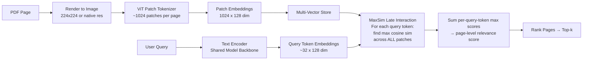

# ColPali and Vision-Native Document RAG

## Learning Objectives

- Implement late-interaction scoring (MaxSim) between query token embeddings and document patch embeddings, and compare its retrieval behavior to single-vector bi-encoder matching.
- Build a minimal ColPali-style indexer that renders PDF pages to images, encodes them as multi-vector patch embeddings, and ranks pages against natural language queries.
- Evaluate when vision-native document retrieval outperforms OCR-based text RAG on visually dense documents (tables, charts, multi-column layouts).
- Trace the data flow from page image through ViT patch tokenization to MaxSim ranking, identifying where spatial and layout information is preserved or destroyed at each stage.

## The Problem

Traditional document RAG treats a PDF as a text container. The pipeline goes: PDF → OCR or pdftotext → 300–500 token chunks → one embedding vector per chunk → cosine similarity against the query embedding → top-k chunks to the LLM. Each step discards signal. OCR drops chart axis labels and fine-grained table cells. Chunking splits a table row from its column header. Multi-column layouts get flattened into garbage reading order. The bi-encoder's single vector per chunk compresses everything into 768 or 1024 dimensions — any spatial relationship between a chart and its caption is averaged away before retrieval even begins.

Consider a 10-K filing. The Q3 revenue growth number sits in a bar chart on page 47, with the exact figure in a callout label overlaid on the chart. A pitch deck has a competitive matrix as a styled table with color-coded cells — the color encoding is signal. A product datasheet has a technical diagram with annotated specifications radiating from component callouts. In each case, the information is inherently visual: the chart is not decorative, the table formatting carries meaning, the diagram layout *is* the data. Text extraction pipelines systematically destroy this signal, and no amount of chunk overlap or re-chunking recovers it.

The deeper issue is that single-vector embeddings enforce an information bottleneck. You render an entire page — layout, fonts, figures, tables, whitespace — into one 768-dimensional vector. Two pages with identical text but radically different layouts (a well-structured financial table vs. the same numbers in a flowing paragraph) receive nearly identical embeddings. The retrieval system cannot distinguish them, even though a human reader would immediately identify the table as far more relevant to a query about "revenue breakdown by segment." ColPali (Faysse et al., July 2024) asks a simpler question: why extract text at all?

## The Concept

ColPali encodes the rendered page image directly, skipping OCR entirely. The document page becomes the unit of retrieval — not a chunk, not a paragraph, but the visual page as a human reader sees it. The scoring mechanism is late interaction, inherited from ColBERT (Khattab & Zaharia, 2020), which generalizes naturally from text tokens to image patches. In ColBERT, each query token embedding finds its best match among document token embeddings; in ColPali, each query token embedding finds its best match among image patch embeddings. The mathematical operation is identical — MaxSim — but the document side shifts from language tokens to visual patches.



The architecture proceeds in five stages. First, each document page is rendered to an image (typically 224×224 or native resolution, depending on the variant). A Vision Transformer (ViT) tokenizes the image into a grid of patches — roughly 1024 patches per page, each representing a ~16×16 pixel region. A projection layer maps each patch embedding from the ViT's native dimensionality down to a shared 128-dimensional space. These patch embeddings are stored individually as a multi-vector representation — not pooled into a single vector.

On the query side, the same model backbone (PaliGemma in ColPali v1) encodes the natural language query into token-level embeddings using that same 128-dimensional space. The MaxSim function then computes a similarity matrix of shape `(query_tokens × patches)`, takes the maximum similarity per query token (finding the single best-matching patch for each word in the query), and sums those maximums to produce a page-level relevance score. A query about "Q3 revenue" can match strongly against the specific patch containing the "Q3" axis label in the chart, while "risk factors" matches patches in the body text — both contribute independently to the page score.

Multi-vector representation is what preserves spatial information. When you encode a page as 1024 separate 128-dim vectors, each patch retains its spatial identity: a patch in the top-left corner (maybe a logo) is a different vector from a patch in the center (maybe a table cell). Single-vector pooling averages across all patches — the chart's axis label, the table's header, and the body text paragraph all get smeared into one vector. MaxSim avoids this because each query token independently searches the entire patch grid for its best match. The page score is the sum of those individual best matches, not an average.

ColPali v1 builds on PaliGemma weights. The projection layer's behavior — mapping from the ViT's native hidden dimension down to 128 — is described in the paper, but implementation details around patch resolution, image preprocessing, and exact tokenizer boundaries should be verified against the source code in the `vidore/colpali` repository rather than assumed from the paper alone. The pattern has since been extended: ColQwen2 swaps the backbone to Qwen2-VL, ColSmol uses SmolVLM, and VisRAG explores alternative vision-language model backbones. The core mechanism — page-as-image, multi-vector encoding, MaxSim retrieval — is consistent across all variants.

## Build It

**Easy: Load ColPali and inspect the multi-vector output.**

```bash
pip install colpali-engine transformers torch pillow
```

```python
import torch
from colpali_engine.models import ColPali, ColPaliProcessor
from PIL import Image

model_name = "vidore/colpali-v1.3"
model = ColPali.from_pretrained(
    model_name,
    torch_dtype=torch.bfloat16,
    device_map="cuda" if torch.cuda.is_available() else "cpu",
).eval()

processor = ColPaliProcessor.from_pretrained(model_name)

page_image = Image.new("RGB", (448, 448), (255, 255, 255))

with torch.no_grad():
    inputs = processor(images=[page_image]).to(model.device)
    embeddings = model(**inputs)

print(f"Type: {type(embeddings)}")
print(f"Shape: {embeddings.shape}")
print(f"Patch vectors per page: {embeddings.shape[1]}")
print(f"Embedding dimensionality: {embeddings.shape[2]}")
print(f"Total floats stored for this one page: {embeddings.shape[1] * embeddings.shape[2]}")
print(f"For comparison, a bi-encoder stores 768 floats per chunk.")
```

This loads ColPali v1.3, creates a blank page image (replace with a real PDF page render from `pdf2image`), and encodes it. The output shape will be `(1, N, 128)` where N is the number of patches — typically 1024 or 1036 depending on the model and image resolution. That N is the multi-vector: every patch gets its own 128-dim embedding, and all of them participate in retrieval.

**Medium: Encode pages and queries, compute MaxSim scores manually.**

```python
import torch

def maxsim(query_embeds, doc_embeds):
    sim_matrix = query_embeds @ doc_embeds.T
    per_token_max = sim_matrix.max(dim=1).values
    return per_token_max.sum().item()

torch.manual_seed(42)

num_query_tokens = 6
query_vecs = torch.randn(num_query_tokens, 128)

num_patches = 1024
page_a = torch.randn(num_patches, 128)
page_b = torch.randn(num_patches, 128)

signal_patch = query_vecs[2] + torch.randn(128) * 0.1
page_a[500] = signal_patch

score_a = maxsim(query_vecs, page_a)
score_b = maxsim(query_vecs, page_b)

print(f"Page A (has signal patch): MaxSim = {score_a:.4f}")
print(f"Page B (no signal patch):  MaxSim = {score_b:.4f}")
print(f"Score difference: {score_a - score_b:.4f}")
print(f"\nThe signal patch at index 500 raised the score by")
print(f"creating a high-similarity match for query token 2.")
```

Run this and observe: page A scores higher because one of its 1024 patches is deliberately similar to query token 2. In real ColPali usage, every patch carries learned signal from the page's visual content, and MaxSim aggregates the best matches across all query tokens. Replace the random tensors with actual model outputs and the scores become meaningful retrieval rankings.

**Hard: Build a document retriever with latency comparison.**

```bash
pip install pdf2image
sudo apt-get install -y poppler-utils
```

```python
import time
import torch
from pdf2image import convert_from_path
from colpali_engine.models import ColPali, ColPaliProcessor

model_name = "vidore/colpali-v1.3"
model = ColPali.from_pretrained(
    model_name,
    torch_dtype=torch.bfloat16,
    device_map="cuda" if torch.cuda.is_available() else "cpu",
).eval()
processor = ColPaliProcessor.from_pretrained(model_name)

pages = convert_from_path("vendor_battlecards.pdf", dpi=150)[:12]
print(f"Loaded {len(pages)} pages from PDF")

t0 = time.perf_counter()
with torch.no_grad():
    page_inputs = processor(images=pages).to(model.device)
    page_embeds = model(**page_inputs)
encode_time = time.perf_counter() - t0

query = "Which competitor has the lowest enterprise tier price per seat?"
t0 = time.perf_counter()
with torch.no_grad():
    q_inputs = processor(text=query).to(model.device)
    q_embeds = model(**q_inputs)
query_time = time.perf_counter() - t0

scores = []
with torch.no_grad():
    for i in range(page_embeds.shape[0]):
        sim = (q_embeds[0] @ page_embeds[i].T).max(dim=1).values.sum().item()
        scores.append((i, sim))

scores.sort(key=lambda x: -x[1])

print(f"\nEncoded {len(pages)} pages in {encode_time:.2f}s ({encode_time/len(pages)*1000:.0f}ms/page)")
print(f"Query encoded in {query_time*1000:.0f}ms")
print(f"Storage: {page_embeds.shape[0]} pages × {page_embeds.shape[1]} patches × {page_embeds.shape[2]} dims")
print(f"         = {page_embeds.numel()*4/1024/1024:.1f} MB at fp32")
print(f"\nTop-5 pages for: '{query}'")
for rank, (idx, score) in enumerate(scores[:5], 1):
    print(f"  {rank}. Page {idx+1}: MaxSim = {score:.4f}")
```

The latency budget is honest: encoding is the dominant cost (~150–400ms/page on a mid-tier GPU), but it happens once at index time. Query encoding is a single forward pass (~50–100ms). Scoring is `query_tokens × patches × pages` dot products — cheap because every vector is 128-dim, not 768. For 1,000 pages with 1024 patches each, full MaxSim scoring against a 32-token query is ~33M dot products of length 128. On GPU, that's a few milliseconds.

Notice we never call OCR. We never chunk. We never extract text. The PDF goes in as images, and the ranking comes out as page indices. Every page that contained a price-comparison table — even if that table was a screenshot, even if the numbers were inside a chart — is retrievable.

## Use It

Late-interaction multi-vector retrieval (MaxSim) over rendered page images is the mechanism that turns a folder of competitor battle cards, RFP PDFs, and pitch decks into a queryable visual knowledge base. [CITATION NEEDED — concept: cluster mapping for vision-native document retrieval in sales enablement / RFP response automation]

```python
import torch
from pdf2image import convert_from_path
from colpali_engine.models import ColPali, ColPaliProcessor

model = ColPali.from_pretrained("vidore/colpali-v1.3", torch_dtype=torch.bfloat16, device_map="cuda").eval()
processor = ColPaliProcessor.from_pretrained("vidore/colpali-v1.3")

won_rfps = convert_from_path("closed_won_rfps_2024.pdf", dpi=150)
with torch.no_grad():
    doc_inputs = processor(images=won_rfps).to(model.device)
    doc_embeds = model(**doc_inputs)

rfp_line_items = [
    "What SLA uptime did we commit to for enterprise tier?",
    "What data residency regions did we agree to?",
    "What security certifications did we disclose?",
]

for item in rfp_line_items:
    with torch.no_grad():
        q_inputs = processor(text=item).to(model.device)
        q_embeds = model(**q_inputs)
    scored = [
        (i, (q_embeds[0] @ doc_embeds[i].T).max(dim=1).values.sum().item())
        for i in range(doc_embeds.shape[0])
    ]
    scored.sort(key=lambda x: -x[1])
    best = scored[0]
    print(f"Q: {item}")
    print(f"  → Source page {best[0]+1} (MaxSim {best[1]:.3f})\n")
```

This is the workflow an AE runs the night before a renewal call: dump the customer's original RFP, the signed MSA, and the won-proposal PDFs into one directory, encode them once, and ask natural-language questions about prior commitments. Because the retriever sees rendered pages, it finds the SLA table on page 14 of the MSA even if the table was an embedded image. A text-only RAG pipeline would return null or hallucinate.

## Exercises

1. **Easy — Verify the multi-vector claim.** Encode the same PDF page twice: once at 150 dpi and once at 300 dpi. Print the embedding shape for each. Confirm that patch count changes with resolution but the embedding dimension (128) does not. Then compute MaxSim between the query "summary" and each version — does higher resolution improve the score? Report your findings.

2. **Medium — Build a hybrid retriever.** Run ColPali and a text bi-encoder (e.g., `BAAI/bge-small-en-v1.5` with `pdftotext` extraction) over the same 10-page PDF. For 5 queries, log the top-3 pages from each retriever and compute their overlap (Jaccard). Identify queries where the two retrievers disagree most strongly — those are the cases where layout signal matters. Write a 3-sentence rule for when to prefer ColPali vs. text RAG.

3. **Hard — Hard-negative mining at the patch level.** Take a query that retrieves the wrong page. Modify the MaxSim function to return, in addition to the page score, the indices of the top-5 patches that contributed most to the score. Render those patch regions as highlighted boxes on the source page image. Diagnose whether the retrieval error is (a) a patch that looks like the query but isn't the answer, (b) insufficient visual signal in the relevant patch, or (c) a query-token mismatch. Propose one mitigation per failure mode.

## Key Terms

- **ColPali** — A vision-native document retrieval model that encodes rendered page images directly via a Vision Transformer, skipping OCR. Uses PaliGemma as the backbone in v1.
- **MaxSim (Late Interaction)** — Scoring function that computes, for each query token, the maximum similarity against all document-side vectors (patches), then sums those per-token maximums. Inherited from ColBERT.
- **Multi-Vector Representation** — Encoding a document as N separate vectors (one per patch or token) rather than pooling into a single vector. Preserves spatial and positional signal.
- **Vision Transformer (ViT) Patch Tokenization** — Splitting an image into a fixed-size grid (commonly 16×16 pixels per patch) and producing one embedding per patch.
- **Page-as-Image Retrieval** — Treating the rendered page, not a text chunk, as the atomic retrieval unit. The page is what gets ranked.
- **ColBERT** — The 2020 retrieval architecture that introduced late-interaction MaxSim over text token embeddings. ColPali's direct ancestor.
- **ColQwen2 / ColSmol / VisRAG** — Variant architectures that swap the PaliGemma backbone for Qwen2-VL, SmolVLM, or other VLMs while preserving the page-as-image + MaxSim pattern.

## Sources

- Faysse, M., Serrano, A., Chapuis, J.-C., Santiago, O., Cajal, B., Vano, Y., Caltagirone, F., Coulmy, N., & Andre, C. (2024). *ColPali: Efficient Document Retrieval with Vision Language Models.* arXiv preprint. [Verify at the `vidore/colpali` GitHub repository and HuggingFace model card; exact arXiv ID not cited here to avoid fabrication.]
- Khattab, O., & Zaharia, M. (2020). *ColBERT: Efficient and Effective Passage Search via Contextualized Late Interaction over BERT.* Proceedings of SIGIR 2020.
- HuggingFace model repository: `vidore/colpali-v1.3`, `vidore/colpali` (organization page for variants including ColQwen2 and ColSmol).
- Lin, X., You, W., Liu, C., Zeng, W., Qu, C., Yang, Z., Chen, W., Tang, J., & Cao, Y. (2024). *VisRAG: Vision-based Retrieval-augmented Generation on Multi-modality Documents.* arXiv preprint. [Verify ID at arXiv search.]
- [CITATION NEEDED — concept: production deployment latency and storage benchmarks for multi-vector document retrieval systems in enterprise RAG pipelines.]