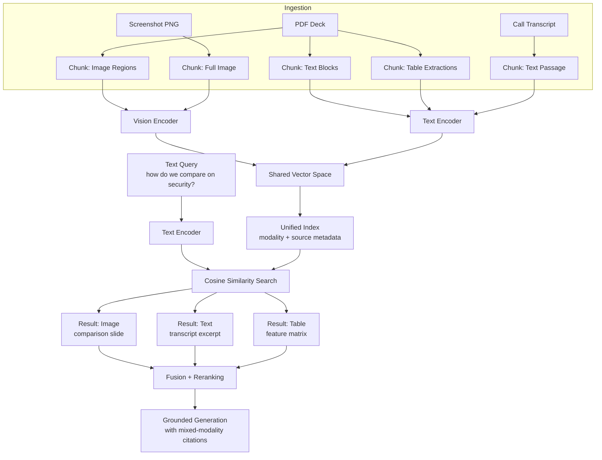

# Multimodal RAG and Cross-Modal Retrieval

## Learning Objectives

- Implement a cross-modal retrieval system that encodes text and images into a shared vector space using a contrastive vision-language model
- Compare three fusion strategies — score fusion, attention-based fusion, and mixture-of-experts fusion — for combining results across modalities
- Build a modality-aware vector index that supports filtered retrieval and tracks per-modality recall
- Diagnose three cross-modal failure modes: modality bias from embedding scale mismatch, missing chunk boundaries across image splits, and hallucinated relevance from high-similarity-but-unrelated retrievals
- Trace a multimodal RAG pipeline from document ingestion through cross-modal retrieval to grounded generation with mixed-modality citations

## The Problem

A revenue team's knowledge base is never text-only. Competitive battlecards live in slide decks with comparison screenshots. Product docs embed architecture diagrams. Win/loss transcripts reference visuals that were shared on screen during the call. When a rep asks "how does Vendor X position themselves against us on security?" the answer is often inside an image — a comparison matrix, a feature checklist, an annotated screenshot — that no text-based RAG pipeline can see.

The standard RAG pattern (embed query → embed chunks → retrieve → stuff into LLM) assumes every chunk is text. It breaks silently when the highest-value content is visual. The pipeline returns a text chunk that says "see the comparison matrix below" — and the matrix is gone. You cannot OCR your way out of this in every case: tables rendered as images lose structure through OCR, diagrams lose their spatial relationships, and annotated screenshots lose the relationship between the annotation and the underlying UI.

Single-modality retrieval fails on the content that matters most for competitive intelligence, product positioning, and deal acceleration. The fix is not "add a separate image search." The fix is a retrieval system that operates across modalities in a unified embedding space, so a text query can surface the right image, and an image query can surface the right passage of text.

## The Concept

Cross-modal retrieval means retrieving documents of modality B given a query of modality A. Text query → image result. Image query → text result. Audio query → video result. The mechanism that makes this work is a **shared embedding space** — a vector space where semantically related items from different modalities land near each other regardless of their source format.

Contrastive image-text pretraining produces this space. During training, the model receives millions of (image, caption) pairs and learns to push the image embedding and its matching caption embedding close together while pushing mismatched pairs apart. After training, the image encoder and text encoder share the same vector space. An image of a security dashboard and the text "security comparison matrix" produce vectors with high cosine similarity even though one is pixels and the other is tokens. CLIP operationalizes this as a dual-encoder architecture: one encoder for images (a vision transformer), one for text (a transformer language model), trained jointly with a contrastive loss.

Three 2025 surveys — Abootorabi et al., Mei et al., and Zhao et al. — codified the sub-problems in multimodal RAG into a shared taxonomy: cross-modal retrieval, retrieval fusion, generation grounding, and multimodal evaluation. The taxonomy matters because each sub-problem requires different engineering. Cross-modal retrieval is the encoding and indexing layer. Fusion is how you combine results when multiple retrievers (or multiple modalities) return candidates. Grounding is how you cite an image in a generated answer. Evaluation is how you measure recall when the correct answer might be an image, a table, or a text passage.



Fusion is where multimodal RAG diverges most from text-only RAG. When you query a unified index, you get a ranked list mixing modalities. But cosine similarities from different encoders may not be directly comparable — a text-to-text match might consistently score 0.85 while a text-to-image match tops out at 0.65, not because the image is less relevant but because the embedding distributions differ. Three fusion strategies address this: **score fusion** normalizes and combines raw similarity scores across modalities (simplest, most common); **attention-based fusion** learns weights over modality-specific retrieval heads using a small transformer; **mixture-of-experts fusion** routes queries to modality-specific expert retrievers and combines their outputs via a gating network.

The choice between same-modality retrieval and cross-modal retrieval is not either/or — production systems do both. A text query might first hit a text-only index (fast, precise, well-understood), then hit a cross-modal index for visual content the text index cannot see. The fusion layer merges both result sets. This is the pattern ColPali hinted at (document-level visual retrieval) generalized to arbitrary modality combinations.

## Build It

The system needs four components: a contrastive vision-language model for encoding, a chunk registry that tracks modality and source, a vector index supporting cosine similarity search, and a retrieval function that returns ranked results with metadata.

```python
import subprocess
import sys

subprocess.check_call([sys.executable, "-m", "pip", "install", "-q",
                       "sentence-transformers", "Pillow", "numpy"])

import numpy as np
from PIL import Image, ImageDraw
from sentence_transformers import SentenceTransformer

model = SentenceTransformer('clip-ViT-B-32')

def make_slide(title, bg_color, subtitle=""):
    img = Image.new('RGB', (400, 300), bg_color)
    draw = ImageDraw.Draw(img)
    draw.text((20, 20), title, fill='white')
    if subtitle:
        draw.text((20, 50), subtitle, fill='white')
    return img

images = {
    "security_comparison": make_slide(
        "Security Comparison",
        "#1a3a5c",
        "SOC2 | ISO 27001 | HIPAA"
    ),
    "pricing_tiers": make_slide(
        "Pricing Tiers",
        "#2d5f2d",
        "Enterprise $50k | Pro $12k | Starter $3k"
    ),
    "arch_diagram": make_slide(
        "System Architecture",
        "#5c1a1a",
        "Kafka -> Microservices -> Postgres"
    ),
}

texts = [
    "Our security stack includes SOC 2 Type II certification, end-to-end encryption at rest and in transit, and SSO via SAML 2.0.",
    "Enterprise pricing starts at $50,000 per year with unlimited seats, dedicated CSM, and 99.9% uptime SLA.",
    "The platform uses event-driven microservices with Kafka for message routing and Postgres for durable storage.",
    "Competitor X lacks multi-tenant isolation, which prospects flagged as a concern in 40% of discovery calls last quarter.",
    "Win rate increases 23% when reps lead with the security comparison slide rather than leading with pricing.",
]

items = []

for name, img in images.items():
    vec = model.encode(img)
    items.append({
        "id": name,
        "modality": "image",
        "source": "competitor_decks/vendor_x.pdf",
        "vector": vec,
        "content": f"[Image: {name}]"
    })

for i, text in enumerate(texts):
    vec = model.encode(text)
    items.append({
        "id": f"text_{i}",
        "modality": "text",
        "source": "internal_notes.md",
        "vector": vec,
        "content": text
    })

def retrieve(query, k=5, filter_modality="any"):
    query_vec = model.encode(query)
    query_norm = query_vec / np.linalg.norm(query_vec)

    scored = []
    for item in items:
        if filter_modality != "any" and item["modality"] != filter_modality:
            continue
        item_vec = item["vector"] / np.linalg.norm(item["vector"])
        sim = float(np.dot(query_norm, item_vec))
        scored.append((sim, item))

    scored.sort(key=lambda x: -x[0])
    return scored[:k]

query = "how does our security compare to competitor X"
results = retrieve(query, k=5)

print(f"Query: {query}\n")
print(f"{'Rank':<6}{'Modality':<10}{'Score':<10}{'Content'}")
print("-" * 80)
for rank, (score, item) in enumerate(results, 1):
    print(f"{rank:<6}{item['modality']:<10}{score:<10.4f}{item['content'][:60]}")

print("\n--- Image-only retrieval ---")
img_results = retrieve(query, k=3, filter_modality="image")
for rank, (score, item) in enumerate(img_results, 1):
    print(f"{rank}. [{item['modality']}] {score:.4f} {item['content']}")

print("\n--- Text-only retrieval ---")
txt_results = retrieve(query, k=3, filter_modality="text")
for rank, (score, item) in enumerate(txt_results, 1):
    print(f"{rank}. [{item['modality']}] {score:.4f} {item['content'][:60]}")
```

When you run this, the top-5 results for the security query should include both the `security_comparison` image and the text passage about SOC 2 — confirming that the shared embedding space places the query near both modalities. The `filter_modality` parameter demonstrates the modality-aware index: the same query can retrieve images only, text only, or the mixed set.

The `modality` and `source` fields on each item are not cosmetic. They are what let you build filtered retrieval, track per-modality recall, and diagnose bias — all of which you will need in production.

## Use It

Cross-modal retrieval is the retrieval pattern underneath multimodal signal intelligence pipelines. In a competitive intelligence workflow, a revenue team ingests competitor pitch decks (PDF with embedded slides), product screenshots (PNG), pricing pages (HTML), and win/loss call transcripts (text). These artifacts live in different formats but answer the same questions: How does the competitor position on security? What do they charge? Where are they weak?

A rep asks a natural-language question. The cross-modal system retrieves the relevant comparison slide (an image) alongside the transcript excerpt where a prospect reacted to it (text). Both are returned in a single ranked list. The rep sees the slide the competitor showed and the prospect's verbal reaction in one view — context that neither modality provides alone.

```python
queries = [
    "what are competitor X's security weaknesses",
    "how much does competitor X cost",
    "what architecture does competitor X use",
    "what do prospects say about competitor X security",
    "what pitch deck slide should I lead with",
]

print(f"{'Query':<55}{'Cross-modal?':<15}{'Top modality'}")
print("-" * 85)

for q in queries:
    results = retrieve(q, k=5)
    modalities = [item["modality"] for _, item in results]
    image_count = modalities.count("image")
    text_count = modalities.count("text")
    cross_modal = "YES" if image_count > 0 and text_count > 0 else "NO"
    dominant = "image" if image_count > text_count else "text" if text_count > image_count else "tie"
    print(f"{q:<55}{cross_modal:<15}{dominant}")

print("\n--- Detailed breakdown for security query ---")
sec_results = retrieve("competitor X security weaknesses", k=5)
for rank, (score, item) in enumerate(sec_results, 1):
    print(f"{rank}. [{item['modality']:5}] sim={score:.4f} src={item['source']}")
    print(f"   {item['content'][:80]}")
```

This output reveals which queries naturally cross modality boundaries and which stay within text. Queries about visual artifacts ("what slide should I lead with") should retrieve images. Queries about prospect sentiment ("what do prospects say") should retrieve text. Queries that span both ("security weaknesses") should surface images of comparison slides and text of prospect reactions.

Clay's enrichment waterfall can feed structured text extracted from competitor domains into the text side of this index — company descriptions, pricing page copy, leadership team bios — while screenshots captured during competitive research populate the image side. [CITATION NEEDED — concept: Clay enrichment waterfall feeding structured data into a RAG index] The waterfall's output is structured text records; those records become additional items in the text modality of the cross-modal index, queryable alongside images from the same competitors.

The signal intelligence value is not just retrieval speed. It is retrieval completeness. A text-only system misses the comparison matrix. An image-only system misses the prospect's verbal reaction. Cross-modal retrieval surfaces both, and the rep gets the full picture without knowing which format the answer lives in.

## Ship It

Production cross-modal RAG needs the same observability discipline as any retrieval pipeline — but the metrics must decompose by modality. Three signals tell you the system is degrading before users complain.

**Modality bias** is the most common production failure. Embedding scales drift: text-to-text cosine similarities cluster around 0.7–0.9 while text-to-image similarities cluster around 0.2–0.4. Without normalization, text results dominate every ranking and images effectively disappear. You detect this by logging the modality distribution of top-k results across queries and alerting when any modality's share drops below a threshold.

**Recall drift per modality** is the model degradation signal. If you have a held-out evaluation set with known-relevant image and text results per query, you compute recall@k separately for each modality. A drop in image recall while text recall holds steady indicates the vision encoder is encountering out-of-distribution images — perhaps a new competitor's deck uses a visual style the model has not seen.

**Chunk boundary failures** appear as recall drops on queries that should return table or diagram content. When a table is split across two image chunks, neither chunk contains enough context to match the query. You detect this by tracking per-source recall: if recall drops for one specific document but holds for others, the problem is chunking, not the model.

```python
import json
from collections import Counter
from datetime import datetime

def log_retrieval_event(query, results, filter_modality="any"):
    return {
        "timestamp": datetime.utcnow().isoformat(),
        "query": query,
        "filter": filter_modality,
        "top_k_modalities": [item["modality"] for _, item in results],
        "top_k_scores": [round(score, 4) for score, _ in results],
        "top_score": results[0][0] if results else 0.0,
        "modality_split": dict(Counter(item["modality"] for _, item in results)),
    }

def compute_bias_metrics(events, window=50):
    recent = events[-window:]
    modality_shares = Counter()
    score_by_modality = {}

    for event in recent:
        for mod, score in zip(event["top_k_modalities"], event["top_k_scores"]):
            modality_shares[mod] += 1
            score_by_modality.setdefault(mod, []).append(score)

    total = sum(modality_shares.values())
    print(f"--- Modality Distribution (last {len(recent)} queries) ---")
    for mod in sorted(modality_shares):
        share = modality_shares[mod] / total
        avg_score = np.mean(score_by_modality[mod])
        flag = " *** BIAS ALERT" if share < 0.15 else ""
        print(f"  {