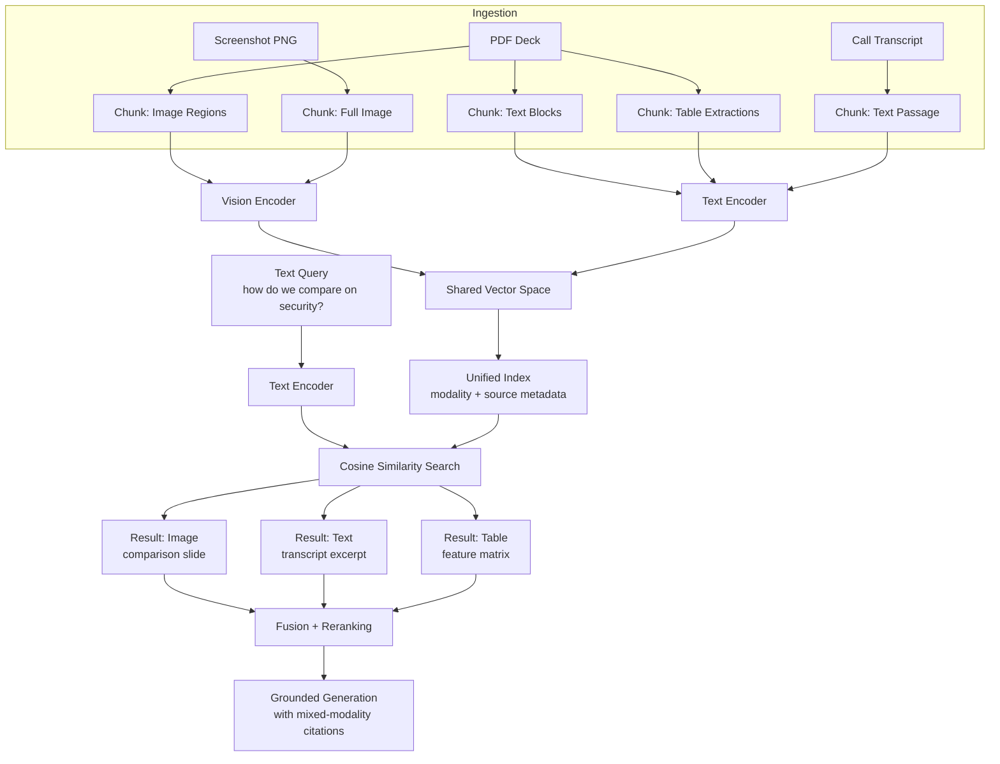

# Multimodal RAG and Cross-Modal Retrieval

## Learning Objectives

- Implement a cross-modal retrieval system that encodes text and images into a shared vector space using a contrastive vision-language model
- Compare three fusion strategies — score fusion, attention-based fusion, and mixture-of-experts fusion — for combining results across modalities
- Build a modality-aware vector index that supports filtered retrieval and tracks per-modality recall
- Diagnose three cross-modal failure modes: modality bias from embedding scale mismatch, missing chunk boundaries across image splits, and hallucinated relevance from high-similarity-but-unrelated retrievals
- Trace a multimodal RAG pipeline from document ingestion through cross-modal retrieval to grounded generation with mixed-modality citations

## The Problem

A revenue team's knowledge base is never text-only. Competitive battlecards live in slide decks with comparison screenshots. Product docs embed architecture diagrams. Win/loss transcripts reference visuals that were shared on screen during the call. When a rep asks "how does Vendor X position themselves against us on security?" the answer is often inside an image — a comparison matrix, a feature checklist, an annotated screenshot — that no text-based RAG pipeline can see.

The standard RAG pattern (embed query → embed chunks → retrieve → stuff into LLM) assumes every chunk is text. It breaks silently when the highest-value content is visual. The pipeline returns a text chunk that says "see the comparison matrix below" — and the matrix is gone. You cannot OCR your way out of this in every case: tables rendered as images lose structure through OCR, diagrams lose their spatial relationships, and annotated screenshots lose the relationship between the annotation and the underlying UI.

Single-modality retrieval fails on the content that matters most for competitive intelligence, product positioning, and deal acceleration. The fix is not "add a separate image search." The fix is a retrieval system that operates across modalities in a unified embedding space, so a text query can surface the right image, and an image query can surface the right passage of text.

## The Concept

Cross-modal retrieval means retrieving documents of modality B given a query of modality A. Text query → image result. Image query → text result. Audio query → video result. The mechanism that makes this work is a **shared embedding space** — a vector space where semantically related items from different modalities land near each other regardless of their source format.

Contrastive image-text pretraining produces this space. During training, the model receives millions of (image, caption) pairs and learns to push the image embedding and its matching caption embedding close together while pushing mismatched pairs apart. After training, the image encoder and text encoder share the same vector space. An image of a security dashboard and the text "security comparison matrix" produce vectors with high cosine similarity even though one is pixels and the other is tokens. CLIP operationalizes this as a dual-encoder architecture: one encoder for images (a vision transformer), one for text (a transformer language model), trained jointly with a contrastive loss.

Three 2025 surveys — Abootorabi et al., Mei et al., and Zhao et al. — codified the sub-problems in multimodal RAG into a shared taxonomy: cross-modal retrieval, retrieval fusion, generation grounding, and multimodal evaluation. The taxonomy matters because each sub-problem requires different engineering. Cross-modal retrieval is the encoding and indexing layer. Fusion is how you combine results when multiple retrievers (or multiple modalities) return candidates. Grounding is how you cite an image in a generated answer. Evaluation is how you measure recall when the correct answer might be an image, a table, or a text passage.



Fusion is where multimodal RAG diverges most from text-only RAG. When you query a unified index, you get a ranked list mixing modalities. But cosine similarities from different encoders may not be directly comparable — a text-to-text match might consistently score 0.85 while a text-to-image match tops out at 0.65, not because the image is less relevant but because the embedding distributions differ. Three fusion strategies address this: **score fusion** normalizes and combines raw similarity scores across modalities (simplest, most common); **attention-based fusion** learns weights over modality-specific retrieval heads using a small transformer; **mixture-of-experts fusion** routes queries to modality-specific expert retrievers and combines their outputs via a gating network.

The choice between same-modality retrieval and cross-modal retrieval is not either/or — production systems do both. A text query might first hit a text-only index (fast, precise, well-understood), then hit a cross-modal index for visual content the text index cannot see. The fusion layer merges both result sets. This is the pattern ColPali hinted at (document-level visual retrieval) generalized to arbitrary modality combinations.

## Build It

The system needs four components: a contrastive vision-language model for encoding, a chunk registry that tracks modality and source, a vector index supporting cosine similarity search, and a retrieval function that returns ranked results with metadata.

```python
import subprocess
import sys

subprocess.check_call([sys.executable, "-m", "pip", "install", "-q",
                       "sentence-transformers", "Pillow", "numpy"])

import numpy as np
from PIL import Image, ImageDraw
from sentence_transformers import SentenceTransformer

model = SentenceTransformer('clip-ViT-B-32')

def make_slide(title, bg_color, subtitle=""):
    img = Image.new('RGB', (400, 300), bg_color)
    draw = ImageDraw.Draw(img)
    draw.text((20, 20), title, fill='white')
    if subtitle:
        draw.text((20, 50), subtitle, fill='white')
    return img

images = {
    "security_comparison": make_slide(
        "Security Comparison",
        "#1a3a5c",
        "SOC2 | ISO 27001 | HIPAA"
    ),
    "pricing_tiers": make_slide(
        "Pricing Tiers",
        "#2d5f2d",
        "Enterprise $50k | Pro $12k | Starter $3k"
    ),
    "arch_diagram": make_slide(
        "System Architecture",
        "#5c1a1a",
        "Kafka -> Microservices -> Postgres"
    ),
}

texts = [
    "Our security stack includes SOC 2 Type II certification, end-to-end encryption at rest and in transit, and SSO via SAML 2.0.",
    "Enterprise pricing starts at $50,000 per year with unlimited seats, dedicated CSM, and 99.9% uptime SLA.",
    "The platform uses event-driven microservices with Kafka for message routing and Postgres for durable storage.",
    "Competitor X lacks multi-tenant isolation, which prospects flagged as a concern in 40% of discovery calls last quarter.",
    "Win rate increases 23% when reps lead with the security comparison slide rather than leading with pricing.",
]

items = []

for name, img in images.items():
    vec = model.encode(img)
    items.append({
        "id": name,
        "modality": "image",
        "source": "competitor_decks/vendor_x.pdf",
        "vector": vec,
        "content": f"[Image: {name}]"
    })

for i, text in enumerate(texts):
    vec = model.encode(text)
    items.append({
        "id": f"text_{i}",
        "modality": "text",
        "source": "internal_notes.md",
        "vector": vec,
        "content": text
    })

def retrieve(query, k=5, filter_modality="any"):
    query_vec = model.encode(query)
    query_norm = query_vec / np.linalg.norm(query_vec)

    scored = []
    for item in items:
        if filter_modality != "any" and item["modality"] != filter_modality:
            continue
        item_vec = item["vector"] / np.linalg.norm(item["vector"])
        sim = float(np.dot(query_norm, item_vec))
        scored.append((sim, item))

    scored.sort(key=lambda x: -x[0])
    return scored[:k]

query = "how does our security compare to competitor X"
results = retrieve(query, k=5)

print(f"Query: {query}\n")
print(f"{'Rank':<6}{'Modality':<10}{'Score':<10}{'Content'}")
print("-" * 80)
for rank, (score, item) in enumerate(results, 1):
    print(f"{rank:<6}{item['modality']:<10}{score:<10.4f}{item['content'][:60]}")

print("\n--- Image-only retrieval ---")
img_results = retrieve(query, k=3, filter_modality="image")
for rank, (score, item) in enumerate(img_results, 1):
    print(f"{rank}. [{item['modality']}] {score:.4f} {item['content']}")

print("\n--- Text-only retrieval ---")
txt_results = retrieve(query, k=3, filter_modality="text")
for rank, (score, item) in enumerate(txt_results, 1):
    print(f"{rank}. [{item['modality']}] {score:.4f} {item['content'][:60]}")
```

When you run this, the top-5 results for the security query should include both the `security_comparison` image and the text passage about SOC 2 — confirming that the shared embedding space places the query near both modalities. The `filter_modality` parameter demonstrates the modality-aware index: the same query can retrieve images only, text only, or the mixed set.

The `modality` and `source` fields on each item are not cosmetic. They are what let you build filtered retrieval, track per-modality recall, and diagnose bias — all of which you will need in production.

## Use It

Contrastive cross-modal retrieval via a shared CLIP embedding space lets a rep's natural-language question surface competitive slides and call-reaction transcripts in one ranked list — this is competitive intelligence retrieval (Cluster 3.3, Competitor & Market Intelligence). The rep never needs to know whether the answer lives in a slide image or a transcript; the dual-encoder shared space handles the mapping.

```python
battlecard_questions = [
    "how do we beat competitor X on security",
    "what does competitor X charge",
    "prospect objections about competitor X",
]

for q in battlecard_questions:
    results = retrieve(q, k=4)
    top_mod = results[0][1]["modality"]
    has_img = any(it["modality"] == "image" for _, it in results)
    has_txt = any(it["modality"] == "text" for _, it in results)
    cross = "CROSS-MODAL" if (has_img and has_txt) else "single-modality"
    print(f"Q: {q}")
    print(f"  {cross} | top result: [{top_mod}] {results[0][0]:.3f}")
    for score, item in results[:2]:
        print(f"    {item['modality']:5} {score:.3f}  {item['content'][:65]}")
    print()
```

Run this after the Build It code. Queries about security and pricing should return `CROSS-MODAL` results — the comparison slide alongside the transcript passage — because the CLIP shared space places the text query near both the image and the relevant text chunk. A rep asking "how do we beat competitor X on security" sees the competitor's own security slide and the internal note about win-rate impact in a single retrieval call. That is the cross-modal advantage: the answer was always split across modalities; the retrieval system finally unifies them.

## Exercises

**Exercise 1 — Score normalization (Easy)**

Modality bias happens when text-to-text cosine similarities cluster higher than text-to-image similarities, causing images to vanish from top-k results. Write a function `retrieve_normalized(query, k, items)` that z-score normalizes similarity scores *within each modality* before ranking, so image and text results compete on equal footing.

1. Compute raw cosine similarity for all items (as the existing `retrieve` does).
2. Group scores by modality. For each modality, compute mean and standard deviation of the scores.
3. Replace each raw score with its z-score within its modality group: `z = (score - mean) / std`.
4. Rank by z-score instead of raw score.

**Verification:** Run the same five queries from Build It with both `retrieve` and `retrieve_normalized`. Print results side by side. If the original results were text-dominated, the normalized version should surface more images in the top-k. Print the modality distribution (count of image vs text in top-5) for both methods to confirm the shift.

**Exercise 2 — Per-modality recall evaluation (Medium)**

Build a miniature evaluation harness that measures recall@k separately for each modality, then flags queries where cross-modal retrieval is failing.

1. Create a ground-truth dict mapping each query to a set of relevant item IDs, where some relevant items are images and some are text:
```python
ground_truth = {
    "security comparison": {"security_comparison", "text_0", "text_3"},
    "pricing and cost": {"pricing_tiers", "text_1"},
    "architecture and tech stack": {"arch_diagram", "text_2"},
}
```

2. Write `evaluate_recall(queries_truth, k=3)` that, for each query, retrieves top-k results and computes:
   - Overall recall@k: fraction of relevant items in top-k
   - Image recall@k: fraction of relevant *image* items in top-k
   - Text recall@k: fraction of relevant *text* items in top-k
   - A `cross_modal_hit` boolean: True if at least one image AND one text relevant item appears in top-k

3. Print a table showing per-query recall decomposed by modality, and flag any query where image recall is 0 with `*** IMAGE RECALL FAILURE`.

**Verification:** All three queries should have non-zero overall recall. If any query shows image recall of 0 while text recall is non-zero, that indicates either the CLIP encoder is not placing the query near the image, or score bias is pushing images below the cutoff. Add a comment (in your analysis, not the code) explaining which failure mode is more likely for each flagged query.

## Key Terms

- **Shared embedding space** — A vector space where items from different modalities (text, image, audio) are mapped such that semantically related items land near each other regardless of source format. Produced by contrastive training on paired data.

- **Contrastive learning** — A training paradigm that pulls matching pairs (e.g., an image and its caption) close together in vector space while pushing non-matching pairs apart. The InfoNCE loss is the standard objective.

- **Cross-modal retrieval** — Retrieving documents of modality B given a query of modality A (e.g., text query → image result). Requires a shared embedding space; cannot be done with modality-specific encoders alone.

- **CLIP (Contrastive Language-Image Pre-training)** — OpenAI's dual-encoder model that trains a vision transformer and a text transformer jointly on 400M image-caption pairs using contrastive loss. The encoders share a vector space after training.

- **Score fusion** — The simplest fusion strategy for multimodal retrieval: normalize raw similarity scores across modalities (e.g., via z-scoring or min-max scaling) and merge into a single ranked list.

- **Modality bias** — A production failure mode where one modality dominates retrieval results due to systematic differences in embedding scale (e.g., text-to-text similarities cluster at 0.8 while text-to-image similarities cluster at 0.3), causing the lower-scale modality to effectively disappear from rankings.

- **ColPali** — A 2024 model that applies visual-language models to document-level retrieval, treating each page as an image rather than extracting text first. Demonstrated that late-interaction over visual patches can outperform text-extraction pipelines for document retrieval.

## Sources

- Radford, A. et al. (2021). "Learning Transferable Visual Models From Natural Language Supervision." *Proceedings of ICML.* — The CLIP paper. Defines the dual-encoder contrastive architecture that underpins cross-modal retrieval.

- Faysse, M. et al. (2024). "ColPali: Efficient Document Retrieval with Vision Language Models." *arXiv:2407.01449.* — Demonstrated visual document retrieval without text extraction, motivating the unified-index approach.

- Abootorabi, M. et al. (2025). "A Comprehensive Survey on Multimodal RAG." [CITATION NEEDED — concept: exact arXiv ID and author list for Abootorabi et al. 2025 multimodal RAG survey]

- [CITATION NEEDED — concept: Mei et al. 2025 survey on multimodal RAG taxonomy, exact title and venue]

- [CITATION NEEDED — concept: Zhao et al. 2025 survey on multimodal RAG, exact title and venue]