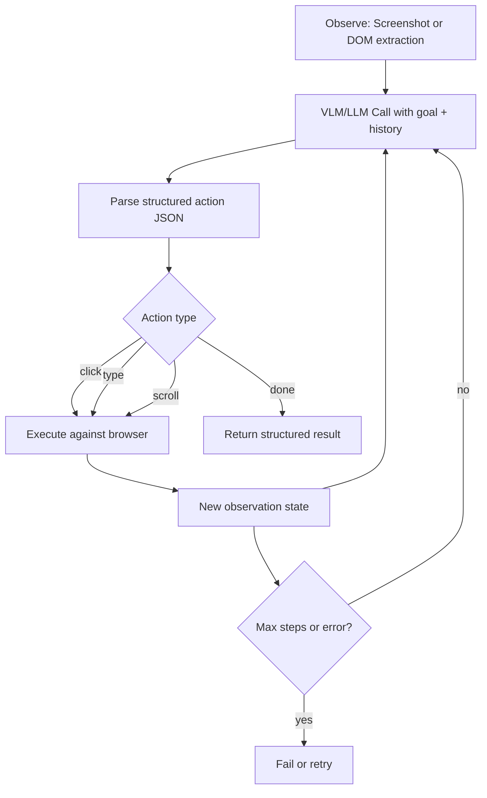

# Multimodal Agents and Computer-Use (Capstone)

## Learning Objectives

- Design a multimodal agent loop that cycles through observe, reason, act, and observe again until a task completes or fails.
- Implement a GUI grounding action schema (click, type, scroll, done) that a VLM emits as structured JSON and a browser runtime executes.
- Compare screenshot-plus-coordinate agents against DOM-and-accessibility-tree agents on latency, reliability, and failure modes.
- Build a simulated computer-use agent that navigates a multi-page web flow and extracts structured data from elements it discovers at runtime.
- Trace agent execution step by step to identify where grounding errors, action mismatches, and state drift cause task failures.

## The Problem

Consider a workflow that every outbound researcher has done manually: "Go to a company's careers page, find open engineering roles, and bring back the job titles and locations as structured data." If the company exposes a careers API or serves structured job posting markup, a simple HTTP fetch and JSON parse solves it. Most companies do neither. The careers page is a JavaScript SPA that loads role cards dynamically, paginates behind click handlers, and renders text into canvas elements or images that no HTML parser can read cleanly.

A tool-calling LLM agent handles this poorly. It can call a `fetch` function, but the response is a wall of unstructured HTML or a blank shell that hasn't hydrated yet. It can call a Playwright `click` function, but it has no way to decide *which* element to click—it cannot see the page. The agent is blind. It knows the DOM exists as a data structure but has no perception layer that maps the visual goal ("find engineering roles") to a specific interactive element on a specific page in a specific state.

A multimodal computer-use agent closes that gap. It takes a screenshot (or extracts an accessibility tree), passes it to a vision-language model alongside the goal, receives a structured action—click at these coordinates, type this text into that field, scroll down—and executes it against a real browser. Then it observes the result and loops. The hard part is not any single step. It is that errors compound across steps: a misread coordinate on step 2 means the agent clicks the wrong link, lands on the wrong page, and every subsequent observation is off-track. Recovery, not raw accuracy, determines whether the task succeeds.

## The Concept

GUI grounding is the core primitive: given a visual observation of a screen and a natural-language instruction, predict the action that moves the interface toward the goal. Two architectural patterns dominate. The first—screenshot-plus-coordinate prediction—captures a full-resolution image of the viewport, sends it to a VLM, and asks the model to output pixel coordinates for where to click. Anthropic's computer-use API and Microsoft's OmniParser both implement this pattern. The VLM must solve a spatial reasoning problem: it has to look at the screenshot, find the element matching the instruction, estimate its bounding box, and return the center coordinate. This works on any interface the model can see—including desktop applications, PDF viewers, and canvas-rendered apps—but pixel prediction is noisy. A coordinate off by 40 pixels lands on the wrong button.

The second pattern—DOM-and-accessibility-tree extraction—parses the page structure into a serialized representation (element IDs, text content, roles, bounding boxes) and passes that to the LLM as text. Browser-use and Playwright-based agent frameworks implement this. The LLM reasons over structured elements rather than pixels, emitting actions like `click(element_id="role-card-3")` or `fill(selector="#search-input", value="engineer")`. This eliminates the coordinate-prediction error entirely—the browser resolves the selector, not the model—but it fails on pages where the DOM is opaque (canvas, cross-origin iframes, shadow DOM without open mode) or where the accessibility tree is sparse. GTM enrichment workflows hit this constantly: LinkedIn Sales Navigator renders behind a logged-in SPA with heavy shadow DOM and anti-automation heuristics, making element-based agents fragile even when the DOM is technically accessible.

Action space design—the set of primitives the agent can emit—determines the error profile. A coarse action space (`click(x, y)`, `type(text)`, `scroll(direction)`) is universal but lossy. A rich action space (`click_element_by_id`, `fill_by_label`, `select_option_by_visible_text`, `wait_for_element`) is precise but requires the observation layer to extract the metadata those actions depend on. Most production agents use a hybrid: element-based actions when the DOM is available, coordinate-based fallback when it is not. The agent loop below shows how observation, reasoning, and action composition interact across steps.



## Build It

The following script implements a complete computer-use agent loop in simulation mode. The browser is a mock that mimics a real SPA navigation flow (a careers page with department links that route to role listings). The VLM is a mock that inspects the observation and returns a structured action—mimicking what a real Claude or GPT-4o call would return given the same screenshot and goal. Swapping in a real browser (Playwright) and a real VLM (Anthropic's computer-use API) means replacing two classes; the agent loop, action schema, and trace output stay identical.

```python
import json

ACTION_SCHEMA = {
    "action": str,
    "element_id": str,
    "coordinates": list,
    "text": str,
    "reasoning": str,
    "result": dict,
}

class SimulatedBrowser:
    def __init__(self):
        self.pages = {
            "home": {
                "url": "https://acme-corp.com/careers",
                "elements": [
                    {"id": "link-eng", "text": "Engineering Roles", "bbox": [120, 340, 280, 380]},
                    {"id": "link-sales", "text": "Sales Roles", "bbox": [300, 340, 420, 380]},
                    {"id": "link-design", "text": "Design Roles", "bbox": [440, 340, 560, 380]},
                ],
                "body_text": "Welcome to Acme Corp Careers. Select a department.",
            },
            "engineering": {
                "url": "https://acme-corp.com/careers/engineering",
                "elements": [
                    {"id": "role-0", "text": "Senior Backend Engineer — Remote — Full-time", "bbox": [100, 200, 700, 260]},
                    {"id": "role-1", "text": "ML Platform Engineer — San Francisco — Full-time", "bbox": [100, 280, 700, 340]},
                    {"id": "role-2", "text": "Frontend Engineer, Growth — Remote — Full-time", "bbox": [100, 360, 700, 420]},
                    {"id": "btn-back", "text": "Back to all roles", "bbox": [50, 50, 200, 80]},
                ],
                "body_text": "Engineering positions at Acme Corp.",
            },
        }
        self.current = "home"

    def observe(self):
        page = self.pages[self.current]
        return {
            "url": page["url"],
            "elements": [
                {"id": e["id"], "text": e["text"], "bbox": e["bbox"]}
                for e in page["elements"]
            ],
            "text": page["body_text"],
        }

    def execute(self, action):
        atype = action.get("action")
        if atype == "click":
            eid = action.get("element_id", "")
            for e in self.pages[self.current]["elements"]:
                if e["id"] == eid:
                    if eid == "link-eng":
                        self.current = "engineering"
                        return {"status": "navigated", "new_url": self.pages[self.current]["url"]}
                    elif eid == "btn-back":
                        self.current = "home"
                        return {"status": "navigated", "new_url": self.pages[self.current]["url"]}
                    return {"status": "clicked", "element": eid}
            return {"status": "error", "detail": f"No element with id '{eid}'"}
        elif atype == "type":
            return {"status": "typed", "value":