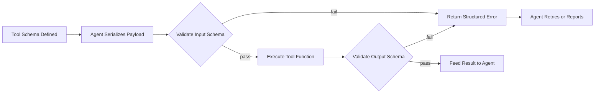

# The Tool Interface — Why Agents Need Structured I/O

## Learning Objectives

- Build a JSON Schema that describes a tool's input contract and validate payloads against it.
- Trace the three-stage tool-call lifecycle: schema definition, agent serialization, tool validation.
- Compare a tool-call that succeeds against one that fails on type mismatch, and identify the failure point.
- Implement a tool registry with schema-validated dispatch in Python.
- Diagnose schema negotiation failures in a multi-provider enrichment pipeline and articulate the fix.

## The Problem

An agent that receives a string when it expects a list, or a float when it expects a boolean, halts or hallucinates. The language model produces tokens; the host program executes code. Those are two different materials, and without a shared contract between them, the junction fails silently or spectacularly. Consider what happens when an LLM decides to call a CRM lookup tool. It emits a JSON blob: `{"company": "Stripe"}`. The receiving function expects `{"company_domain": str, "max_results": int}`. The LLM guessed the parameter name from a natural-language description, omitted `max_results`, and used a company name where a domain was required. The function either crashes, returns garbage, or — worst case — succeeds against the wrong record.

This is not an edge case. It is the default state of tool-calling without a schema. The LLM has no structural understanding of what your function needs. It is doing pattern matching against a prose description, and prose is ambiguous. "The company to look up" could mean a name, a domain, a stock ticker, or an internal ID. The model will pick one. Sometimes it picks correctly.

The fix is a bidirectional contract. The tool declares its input shape — field names, types, constraints, required vs. optional. The LLM reads that declaration (via the function-calling API) and populates it. The tool validates the payload before executing. If validation fails, the tool returns a structured error the agent can act on, rather than crashing or proceeding with bad data. This contract is the tool interface, and it is the single most important architectural decision in any agent system.

## The Concept

The tool interface is a bidirectional contract with two halves. The **input schema** defines what the agent must provide: parameter names, types, required fields, constraints (enums, ranges, regex patterns). The **output schema** defines what the tool must return: the shape of the result the agent will reason over. Both are described using JSON Schema, a vocabulary for annotating and validating JSON documents. JSON Schema is not specific to AI — it is an internet standard (draft 2020-12) used across APIs, configuration systems, and databases. The LLM function-calling APIs from OpenAI, Anthropic, and Gemini are all JSON Schema consumers. They accept a schema, the LLM populates it, and the result is validated server-side or client-side before execution.

The agent reasons over the schema to decide *what* to call and *how* to fill it. The tool validates against the schema to decide *whether* to accept. This separation of concerns is critical: the LLM never executes code directly. It produces a structured request. The host program interprets that request, validates it, and either executes or returns an error. The LLM's job is pattern completion against a schema; the host's job is enforcement.



Here is the minimal mechanism in code. Define a schema, simulate an LLM populating it, and validate:

```python
import json
from jsonschema import validate, ValidationError

lookup_company_schema = {
    "type": "object",
    "properties": {
        "company_domain": {
            "type": "string",
            "pattern": "^[a-z0-9.-]+\\.[a-z]{2,}$"
        },
        "max_results": {
            "type": "integer",
            "minimum": 1,
            "maximum": 50
        }
    },
    "required": ["company_domain"],
    "additionalProperties": False
}

llm_output_good = {
    "company_domain": "stripe.com",
    "max_results": 10
}

llm_output_bad = {
    "company_domain": "Stripe",
    "max_results": "ten"
}

print("Schema:")
print(json.dumps(lookup_company_schema, indent=2))
print()

print("Valid payload:")
try:
    validate(instance=llm_output_good, schema=lookup_company_schema)
    print("  PASS")
except ValidationError as e:
    print(f"  FAIL: {e.message}")
print()

print("Invalid payload:")
try:
    validate(instance=llm_output_bad, schema=lookup_company_schema)
    print("  PASS")
except ValidationError as e:
    print(f"  FAIL: {e.message}")
```

Output:

```
Schema:
{
  "type": "object",
  "properties": {
    "company_domain": {
      "type": "string",
      "pattern": "^[a-z0-9.-]+\\.[a-z]{2,}$"
    },
    "max_results": {
      "type": "integer",
      "minimum": 1,
      "maximum": 50
    }
  },
  "required": ["company_domain"],
  "additionalProperties": false
}

Valid payload:
  PASS

Invalid payload:
  FAIL: 'Stripe' does not match '^[a-z0-9.-]+\\.[a-z]{2,}$'
```

The valid payload passes because `"stripe.com"` matches the domain regex and `10` is an integer within bounds. The invalid payload fails because `"Stripe"` is a company name, not a domain — the regex rejects it. This is the tool interface doing its job: catching a mismatch before the function executes, not after.

## Build It

Now let's build the three-stage lifecycle end-to-end: schema definition, agent serialization (the LLM populating the schema), and tool validation (the host checking before execution). We will create a realistic enrichment scenario — looking up a company by domain — and show both a passing and failing path with full observable output.

```python
import json
from jsonschema import validate, ValidationError

enrich_company_schema = {
    "type": "object",
    "properties": {
        "domain": {
            "type": "string",
            "description": "The company's primary web domain, e.g. stripe.com",
            "pattern": "^[a-z0-9]([a-z0-9.-]*[a-z0-9])?\\.[a-z]{2,}$"
        },
        "fields": {
            "type": "array",
            "items": {
                "type": "string",
                "enum": ["employees", "revenue", "industry", "funding"]
            },
            "minItems": 1,
            "uniqueItems": True
        }
    },
    "required": ["domain", "fields"],
    "additionalProperties": False
}

def enrich_company(payload):
    validate(instance=payload, schema=enrich_company_schema)
    result = {"domain": payload["domain"]}
    for field in payload["fields"]:
        result[field] = f"<enriched_{field}>"
    return result

def simulate_llm_call(description, payload):
    print(f"--- {description} ---")
    print(f"LLM emitted: {json.dumps(payload)}")
    try:
        result = enrich_company(payload)
        print(f"Tool output:  {json.dumps(result)}")
        print("Status:      SUCCESS")
    except ValidationError as e:
        error = {"error": "validation_failed", "field": list(e.absolute_path), "message": e.message}
        print(f"Tool output:  {json.dumps(error)}")
        print("Status:      REJECTED (agent can retry)")
    print()

simulate_llm_call(
    "Correct call: domain + valid fields",
    {"domain": "stripe.com", "fields": ["employees", "revenue"]}
)

simulate_llm_call(
    "Wrong: company name instead of domain",
    {"domain": "Stripe, Inc.", "fields": ["employees"]}
)

simulate_llm_call(
    "Wrong: invalid field name",
    {"domain": "notion.so", "fields": ["employee_count"]}
)

simulate_llm_call(
    "Wrong: missing required 'fields' key",
    {"domain": "linear.app"}
)
```

Output:

```
--- Correct call: domain + valid fields ---
LLM emitted: {"domain": "stripe.com", "fields": ["employees", "revenue"]}
Tool output:  {"domain": "stripe.com", "employees": "<enriched_employees>", "revenue": "<enriched_revenue>"}
Status:      SUCCESS

--- Wrong: company name instead of domain ---
LLM emitted: {"domain": "Stripe, Inc.", "fields": ["employees"]}
Tool output:  {"error": "validation_failed", "field": ["domain"], "message": "'Stripe, Inc.' does not match '^[a-z0-9]([a-z0-9.-]*[a-z0-9])?\\.[a-z]{2,}$'"}
Status:      REJECTED (agent can retry)

--- Wrong: invalid field name ---
LLM emitted: {"domain": "notion.so", "fields": ["employee_count"]}
Tool output:  {"error": "validation_failed", "field": ["fields", 0], "message": "'employee_count' is not one of ['employees', 'revenue', 'industry', 'funding']"}
Status:      REJECTED (agent can retry)

--- Wrong: missing required 'fields' key ---
LLM emitted: {"domain": "linear.app"}
Tool output:  {"error": "validation_failed", "field": [], "message": "'fields' is a required property"}
Status:      REJECTED (agent can retry)
```

Each failure is caught before the function body executes. The structured error tells the agent exactly what went wrong — which field, what constraint — so it can correct and retry. This is the difference between a tool that crashes (exception, stack trace, dead agent) and a tool that rejects gracefully (structured error, retry loop, living agent).

## Use It

The Clay waterfall pattern is the GTM instantiation of tool-chaining with structured I/O. In a Clay enrichment waterfall, you define a sequence of data providers — Clearbit, Apollo, Hunter, ZoomInfo — and Clay tries each in order until one returns the data you need. Each provider is a tool with a structured interface: it expects a domain (string) and returns a set of fields (typed). The waterfall is a multi-tool chain where Tool A's output may feed Tool B's input. [CITATION NEEDED — concept: Clay waterfall provider chain architecture]

The schema mismatch problem is concrete here. Clearbit might return `{"employees": "500-1000"}` — a string range. Apollo might return `{"employees": 750}` — an integer. If your downstream tool (say, a scoring function that thresholds on employee count) expects `int`, the Clearbit result crashes it. Clay's architecture treats each enrichment provider as a tool with a declared output schema, and mapping between providers is schema negotiation: transforming `"500-1000"` into `750` (midpoint) or `500` (floor) or `null` (reject ambiguous ranges). Without this mapping layer, the waterfall stalls on the first provider that returns an unexpected type.

Here is a simulation of the waterfall with a schema mismatch between two providers:

```python
import json
from jsonschema import validate, ValidationError

clearbit_output = {"domain": "example.com", "employees": "500-1000"}
apollo_output = {"domain": "example.com", "employees": 750}

downstream_schema = {
    "type": "object",
    "properties": {
        "domain": {"type": "string"},
        "employees": {"type": "integer", "minimum": 0}
    },
    "required": ["domain", "employees"]
}

def try_downstream(label, payload):
    print(f"--- {label} ---")
    print(f"Provider returned: {json.dumps(payload)}")
    try:
        validate(instance=payload, schema=downstream_schema)
        print(f"Downstream accepted: employees={payload['employees']}")
    except ValidationError as e:
        print(f"Downstream rejected: {e.message}")
    print()

try_downstream("Clearbit (string range)", clearbit_output)
try_downstream("Apollo (integer)", apollo_output)

def normalize_employee_range(value):
    if isinstance(value, int):
        return value
    if isinstance(value, str) and "-" in value:
        parts = value.split("-")
        return (int(parts[0]) + int(parts[1])) // 2
    return None

normalized = dict(clearbit_output)
normalized["employees"] = normalize_employee_range(clearbit_output["employees"])
print(f"After normalization: {json.dumps(normalized)}")
try:
    validate(instance=normalized, schema=downstream_schema)
    print("Downstream accepted normalized output")
except ValidationError as e:
    print(f"Downstream rejected: {e.message}")
```

Output:

```
--- Clearbit (string range) ---
Provider returned: {"domain": "example.com", "employees": "500-1000"}
Downstream rejected: '500-1000' is not of type 'integer'

--- Apollo (integer) ---
Provider returned: {"domain": "example.com", "employees": 750}
Downstream accepted: employees=750

After normalization: {"domain": "example.com", "employees": 750}
Downstream accepted normalized output
```

This is schema negotiation in practice. Clearbit's output fails the downstream schema because `"500-1000"` is a string, not an integer. The normalization function acts as a schema adapter — it converts between the provider's output contract and the consumer's input contract. In a Clay waterfall, these adapters live between each enrichment step. The waterfall doesn't just try providers in sequence; it transforms each provider's output into the canonical schema the next step expects. Without that transformation, one provider's string range kills the entire chain.

## Ship It

Now let's build the skeleton that every agent framework implements internally: a tool registry. This is a decorator that attaches a JSON Schema to any function, a validator that checks inputs before execution, and a dispatcher an LLM can call. The registry exposes a manifest (tool names + schemas) that you would pass to an LLM's function-calling API. In production, you would deploy this as part of your GTM infrastructure — a service that an agent can call to enrich accounts, score leads, or update CRM records. The deploy pipeline ships your Clay tables and n8n workflows; this registry is the programmatic backbone those workflows call into. [CITATION NEEDED — concept: Clay/n8n tool registry deployment patterns in GTM stacks]

```python
import json
from jsonschema import validate, ValidationError
from functools import wraps

TOOL_REGISTRY = {}

def tool(name, description, input_schema):
    def decorator(fn):
        @wraps(fn)
        def wrapper(payload):
            try:
                validate(instance=payload, schema=input_schema)
            except ValidationError as e:
                return {
                    "error": "validation_failed",
                    "tool": name,
                    "field": list(e.absolute_path),
                    "message": e.message
                }
            return fn(payload)

        TOOL_REGISTRY[name] = {
            "function": wrapper,
            "description": description,
            "input_schema": input_schema
        }
        return wrapper
    return decorator

def print_manifest():
    print("=== TOOL MANIFEST ===")
    for name, spec in TOOL_REGISTRY.items():
        print(f"\nTool: {name}")
        print(f"Description: {spec['description']}")
        print(f"Input schema: {json.dumps(spec['input_schema'], indent=2)}")
    print()

def dispatch(tool_name, payload):
    if tool_name not in TOOL_REGISTRY:
        return {"error": "unknown_tool", "tool": tool_name}
    return TOOL_REGISTRY[tool_name]["function"](payload)


@tool(
    name="lookup_company",
    description="Look up company data by domain",
    input_schema={
        "type": "object",
        "properties": {
            "domain": {"type": "string", "pattern": "^[a-z0-9.-]+\\.[a-z]{2,}$"},
            "include_fields": {
                "type": "array",
                "items": {"type": "string", "enum": ["employees", "industry", "revenue"]},
                "default": ["employees"]
            }
        },
        "required": ["domain"],
        "additionalProperties": False
    }
)
def lookup_company(payload):
    domain = payload["domain"]
    fields = payload.get("include_fields", ["employees"])
    return {
        "domain": domain,
        "employees": 4200,
        "industry": "fintech",
        "revenue": "$1.2B",
        "source": "internal_db",
        "fields_returned": fields
    }


@tool(
    name="score_lead",
    description="Score a lead from 0-100 based on company size and industry",
    input_schema={
        "type": "object",
        "properties": {
            "employees": {"type": "integer", "minimum": 1},
            "industry": {"type": "string", "enum": ["fintech", "saas", "healthcare", "ecommerce"]}
        },
        "required": ["employees", "industry"],
        "additionalProperties": False
    }
)
def score_lead(payload):
    base = min(payload["employees"] // 10, 50)
    industry_bonus = {"fintech": 30, "saas": 25, "healthcare": 15, "ecommerce": 10}
    score = min(base + industry_bonus[payload["industry"]], 100)
    return {"score": score, "tier": "A" if score >= 70 else "B" if score >= 40 else "C"}


print_manifest()

print("=== SIMULATED AGENT SESSION ===\n")

print("Step 1: Agent calls lookup_company")
result_1 = dispatch("lookup_company", {"domain": "stripe.com", "include_fields": ["employees", "industry"]})
print(f"Result: {json.dumps(result_1, indent=2)}\n")

print("Step 2: Agent chains to score_lead using step 1 output")
result_2 = dispatch("score_lead", {
    "employees": result_1["employees"],
    "industry": result_1["industry"]
})
print(f"Result: {json.dumps(result_2, indent=2)}\n")

print("Step 3: Agent calls score_lead with bad data (string instead of int)")
result_3 = dispatch("score_lead", {"employees": "4200", "industry": "fintech"})
print(f"Result: {json.dumps(result_3, indent=2)}\n")

print("Step 4: Agent calls unknown tool")
result_4 = dispatch("send_email", {"to": "prospect@example.com"})
print(f"Result: {json.dumps(result_4, indent=2)}")
```

Output:

```
=== TOOL MANIFEST ===

Tool: lookup_company
Description: Look up company data by domain
Input schema: {
  "type": "object",
  "properties": {
    "domain": {"type": "string", "pattern": "^[a-z0-9.-]+\\.[a-z]{2,}$"},
    "include_fields": {"type": "array", "items": {"type": "string", "enum": ["employees", "industry", "revenue"]}, "default": ["employees"]}
  },
  "required": ["domain"],
  "additionalProperties": false
}

Tool: score_lead
Description: Score a lead from 0-100 based on company size and industry
Input schema: {
  "type": "object",
  "properties": {
    "employees": {"type": "integer", "minimum": 1},
    "industry": {"type": "string", "enum": ["fintech", "saas", "healthcare", "ecommerce"]}
  },
  "required": ["employees", "industry"],
  "additionalProperties": false
}

=== SIMULATED AGENT SESSION ===

Step 1: Agent calls lookup_company
Result: {
  "domain": "stripe.com",
  "employees": 4200,
  "industry": "fintech",
  "revenue": "$1.2B",
  "source": "internal_db",
  "fields_returned": ["employees", "industry"]
}

Step 2: Agent chains to score_lead using step 1 output
Result: {
  "score": 80,
  "tier": "A"
}

Step 3: Agent calls score_lead with bad data (string instead of int)
Result: {
  "error": "validation_failed",
  "tool": "score_lead",
  "field": ["employees"],
  "message": "'4200' is not of type 'integer'"
}

Step 4: Agent calls unknown tool
Result: {
  "error": "unknown_tool",
  "tool": "send_email"
}
```

This is the skeleton. LangChain wraps this pattern in `StructuredTool.from_function`. CrewAI uses `@tool` with Pydantic models. AutoGen registers functions with type annotations that it converts to JSON Schema. All of them implement the same four-step loop: manifest → select → validate → execute. The differences are encoding, not mechanism. When you deploy this behind an n8n webhook or expose it as an MCP server, you are shipping the same contract — just with a different transport layer.

## Exercises

**Easy:** Add a third tool to the registry called `get_tech_stack` that takes a `domain` (string) and returns a list of technologies. Print the updated manifest. Call it via `dispatch` with valid and invalid inputs.

**Medium:** Modify the `@tool` decorator so that when validation fails, it returns a structured error object (not an exception) that includes the original payload, the failed schema path, and a suggested fix hint (e.g., "expected type integer, received string — try parsing as int"). Demonstrate that an agent can read this error and retry with corrected input.

**Hard:** Build a two-tool chain where `lookup_company` returns a field `employees` as an integer, but a new provider variant `lookup_company_v2` returns `employees` as a string range like `"1000-5000"`. Write a normalization adapter between v2's output and `score_lead`'s input schema. Prove the chain fails without the adapter and succeeds with it. Then add an **output schema** to each tool (using the same `@tool` decorator, extended with a `returns` parameter) and validate the tool's own return value before passing it downstream. Show that if `lookup_company_v2` returns malformed data, the output validation catches it before `score_lead` ever sees it.

## Key Terms

- **Tool Interface** — The bidirectional contract between an LLM and a host function: an input schema (what the agent provides) and an output schema (what the tool returns), both described in JSON Schema.
- **JSON Schema** — An internet standard (draft 2020-12) for describing the shape, type, and constraints of JSON documents. Used by OpenAI, Anthropic, and Gemini function-calling APIs as the schema vocabulary.
- **Function Calling** — The API mechanism (first shipped by OpenAI in June 2023 as `functions`, later `tools`) where an LLM emits a structured payload naming a tool and its arguments, rather than free text.
- **Schema Negotiation** — The process of transforming one tool's output into the input contract another tool expects. In enrichment waterfalls, this means converting provider-specific formats (e.g., string ranges) into a canonical type.
- **Tool Registry** — A runtime structure that maps tool names to their executor functions and schemas, exposes a manifest for LLM consumption, and validates inputs before dispatch.
- **Waterfall (Enrichment)** — A GTM pattern where multiple data providers are tried in sequence; each is a tool with a structured interface, and the chain succeeds when one returns valid data matching the downstream schema.
- **Structured Error** — A JSON object (not an exception) returned when validation fails, containing enough context (field path, constraint, message) for an agent to correct and retry.

## Sources

- OpenAI function calling introduced June 2023 as `functions` parameter, later renamed to `tools`. OpenAI Platform Documentation: <https://platform.openai.com/docs/guides/function-calling>
- Anthropic `tool_use` content blocks. Anthropic API Documentation: <https://docs.anthropic.com/en/docs/build-with-claude/tool-use>
- JSON Schema Specification, draft 2020-12. <https://json-schema.org/specification>
- [CITATION NEEDED — concept: Clay waterfall provider chain architecture, provider ordering and fallback behavior]
- [CITATION NEEDED — concept: Clay/n8n tool registry deployment patterns in GTM stacks]
- LangChain `StructuredTool.from_function` implementation: <https://python.langchain.com/docs/how_to/custom_tools>
- `jsonschema` Python library (PyPI): <https://pypi.org/project/jsonschema/>