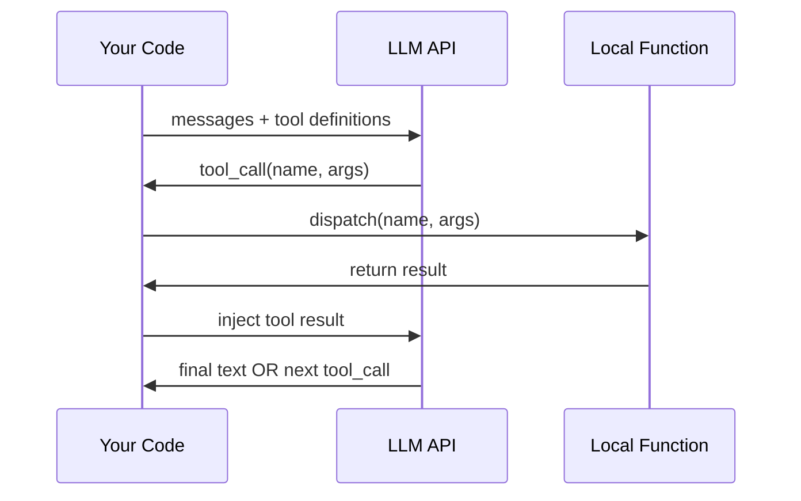

# Function Calling Deep Dive — OpenAI, Anthropic, Gemini

## Learning Objectives

1. Implement a complete function-calling loop (define → parse → execute → inject → continue) across OpenAI, Anthropic, and Gemini APIs
2. Compare tool definition schemas, response structures, and continuation patterns across all three providers
3. Build a task router that selects and executes tools based on input classification
4. Handle parallel function calls, malformed parameters, and missing tool definitions in production
5. Configure forced tool choice (`auto` / `any` / specific function) and evaluate steering behavior per provider

## The Problem

You want an LLM to look up a company's headcount, check a CRM record, or post a webhook. The model cannot do any of that. It generates tokens — nothing else. Function calling bridges this gap with a protocol: you tell the model what tools exist, the model outputs structured JSON describing which tool to call and with what arguments, and your code decides whether to actually run it.

The problem is that three frontier providers — OpenAI, Anthropic, and Google (Gemini) — converged on the same loop in 2024 but diverged on nearly every JSON shape. OpenAI returns `arguments` as a JSON string you must `json.loads()`. Anthropic returns `input` as a pre-parsed object. Gemini nests tool calls inside `parts[]` with a different correlation mechanism entirely. Code written for one provider's shape will silently break on another.

If you are building a multi-provider agent stack — or even just evaluating which provider to commit to — you need to know these differences cold. A Clay enrichment waterfall that calls a people-search tool, receives results, and feeds them back into the model for classification is running this exact loop. The provider you choose determines your schema format, your error surface, and your tool-calling latency budget.

## The Concept

The function-calling protocol has four phases. Every provider implements all four, but with different field names and data structures.

**Phase 1 — Tool Definition.** You declare available functions as JSON Schema objects. OpenAI wraps each function in `{type: "function", function: {name, description, parameters, strict}}`. Anthropic uses `{name, description, input_schema}` — same schema, different key. Gemini uses `functionDeclarations: [{name, description, parameters}]` nested inside a `tools` array. All three accept standard JSON Schema for parameter validation, but OpenAI's strict mode adds additional constraints (all properties must be in a `required` array, `additionalProperties: false` is enforced, recursion depth is limited).

**Phase 2 — Model Response.** When the model decides to call a tool, it returns a structured object instead of (or alongside) plain text. OpenAI puts this in `choices[0].message.tool_calls[]`, where each call has an `id`, a `function.name`, and a `function.arguments` field that is a **JSON string** you must parse yourself. Anthropic returns `content[]` blocks, where a tool call is `{type: "tool_use", id, name, input}` — and `input` is already a **parsed object**. Gemini returns `candidates[0].content.parts[]`, where a function call is `{functionCall: {name, args}}` with no call ID (correlation is positional or by name).

**Phase 3 — Local Execution.** Your code receives the tool-call object, parses out the function name and arguments, dispatches to your local implementation, and collects the return value. This is where you enforce permissions, rate limits, and input validation — never trust the model's arguments blindly.

**Phase 4 — Result Injection.** You send the tool's result back to the model so it can continue reasoning. OpenAI requires a message with `role: "tool"`, a `tool_call_id` matching the original call, and the result as a string. Anthropic requires a `role: "user"` message containing a `{type: "tool_result", tool_use_id, content}` block. Gemini requires a `role: "function"` message with the `name` and a `response` object.



The model may loop back to Phase 2 — calling another tool based on the first result — or it may produce a final text answer. Your loop continues until the response contains no tool calls.

## Build It

Build a provider-agnostic tool dispatcher and three response parsers. Start with the shared tool registry and execution layer, then wire it to each provider's format.

```python
import json

TOOLS = {
    "get_company_info": {
        "description": "Look up company headcount, industry, and revenue band.",
        "parameters": {
            "type": "object",
            "properties": {
                "company_name": {"type": "string"},
                "data_field": {"type": "string", "enum": ["headcount", "industry", "revenue_band"]}
            },
            "required": ["company_name", "data_field"]
        }
    },
    "score_contactability": {
        "description": "Score a contact's likelihood of being reachable based on email and phone presence.",
        "parameters": {
            "type": "object",
            "properties": {
                "has_email": {"type": "boolean"},
                "has_phone": {"type": "boolean"},
                "has_linkedin": {"type": "boolean"}
            },
            "required": ["has_email", "has_phone"]
        }
    }
}

COMPANY_DB = {
    "Clay": {"headcount": 150, "industry": "SaaS", "revenue_band": "$10M-50M"},
    "Anthropic": {"headcount": 800, "industry": "AI Research", "revenue_band": "$100M+"},
}

def execute_tool(name, args):
    if name not in TOOLS:
        return {"error": f"Unknown tool: {name}"}
    try:
        if name == "get_company_info":
            company = COMPANY_DB.get(args["company_name"])
            if not company:
                return {"error": f"No data for {args['company_name']}"}
            return {"value": company[args["data_field"]]}
        if name == "score_contactability":
            score = sum([args["has_email"] * 3, args["has_phone"] * 2, args.get("has_linkedin", False) * 1])
            return {"score": score, "tier": "high" if score >= 5 else "medium" if score >= 3 else "low"}
    except KeyError as e:
        return {"error": f"Missing required parameter: {e}"}
    return {"error": "unreachable"}
```

Now define the three provider-specific tool declaration formats from the same registry:

```python
def to_openai_tools():
    return [
        {
            "type": "function",
            "function": {
                "name": name,
                "description": spec["description"],
                "parameters": spec["parameters"],
                "strict": True,
            }
        }
        for name, spec in TOOLS.items()
    ]

def to_anthropic_tools():
    return [
        {
            "name": name,
            "description": spec["description"],
            "input_schema": spec["parameters"],
        }
        for name, spec in TOOLS.items()
    ]

def to_gemini_tools():
    return [
        {
            "functionDeclarations": [
                {
                    "name": name,
                    "description": spec["description"],
                    "parameters": spec["parameters"],
                }
                for name, spec in TOOLS.items()
            ]
        }
    ]

print("=== OpenAI tool definitions ===")
print(json.dumps(to_openai_tools()[0], indent=2))
print("\n=== Anthropic tool definitions ===")
print(json.dumps(to_anthropic_tools()[0], indent=2))
print("\n=== Gemini tool definitions ===")
print(json.dumps(to_gemini_tools()[0]["functionDeclarations"][0], indent=2))
```

Now build the three response parsers that extract tool calls from each provider's format into a uniform structure:

```python
def parse_openai_response(response):
    calls = []
    message = response["choices"][0]["message"]
    if message.get("tool_calls"):
        for tc in message["tool_calls"]:
            calls.append({
                "id": tc["id"],
                "name": tc["function"]["name"],
                "arguments": json.loads(tc["function"]["arguments"]),
                "_raw": tc,
            })
    return calls

def parse_anthropic_response(response):
    calls = []
    for block in response.get("content", []):
        if block["type"] == "tool_use":
            calls.append({
                "id": block["id"],
                "name": block["name"],
                "arguments": block["input"],
                "_raw": block,
            })
    return calls

def parse_gemini_response(response):
    calls = []
    parts = response.get("candidates", [{}])[0].get("content", {}).get("parts", [])
    for i, part in enumerate(parts):
        if "functionCall" in part:
            fc = part["functionCall"]
            calls.append({
                "id": f"gemini_call_{i}",
                "name": fc["name"],
                "arguments": fc["args"],
                "_raw": part,
            })
    return calls

mock_openai = {
    "choices": [{
        "message": {
            "tool_calls": [{
                "id": "call_abc123",
                "function": {
                    "name": "get_company_info",
                    "arguments": '{"company_name": "Clay", "data_field": "headcount"}'
                }
            }]
        }
    }]
}

mock_anthropic = {
    "content": [
        {"type": "text", "text": "Let me look that up."},
        {"type": "tool_use", "id": "toolu_xyz", "name": "get_company_info",
         "input": {"company_name": "Clay", "data_field": "headcount"}}
    ]
}

mock_gemini = {
    "candidates": [{
        "content": {
            "parts": [{
                "functionCall": {
                    "name": "get_company_info",
                    "args": {"company_name": "Clay", "data_field": "headcount"}
                }
            }]
        }
    }]
}

for provider, response, parser in [
    ("OpenAI", mock_openai, parse_openai_response),
    ("Anthropic", mock_anthropic, parse_anthropic_response),
    ("Gemini", mock_gemini, parse_gemini_response),
]:
    calls = parser(response)
    print(f"\n=== {provider} parsed {len(calls)} tool call(s) ===")
    for call in calls:
        result = execute_tool(call["name"], call["arguments"])
        print(f"  {call['name']}({call['arguments']}) -> {result}")
```

Now build the result-injection functions that format tool output for each provider's continuation message:

```python
def openai_tool_result(call_id, result):
    return {"role": "tool", "tool_call_id": call_id, "content": json.dumps(result)}

def anthropic_tool_result(call_id, result):
    return {
        "role": "user",
        "content": [{"type": "tool_result", "tool_use_id": call_id, "content": json.dumps(result)}]
    }

def gemini_tool_result(name, result):
    return {"role": "function", "parts": [{"functionResponse": {"name": name, "response": result}}]}

for name, result_fn in [("OpenAI", openai_tool_result), ("Anthropic", anthropic_tool_result), ("Gemini", gemini_tool_result)]:
    if name == "Gemini":
        msg = result_fn("get_company_info", {"value": 150})
    else:
        msg = result_fn("call_abc123", {"value": 150})
    print(f"\n=== {name} result injection ===")
    print(json.dumps(msg, indent=2))
```

## Use It

Function calling is the mechanism behind every enrichment waterfall in GTM infrastructure. A Clay waterfall that tries People Data Labs, then Apollo, then Hunter for email enrichment is running the same loop: define the available enrichment tools, let the model (or Clay's rule engine) decide which to call, execute the API lookup, inject the result, and continue until a valid email is found or the waterfall is exhausted. [CITATION NEEDED — concept: Clay waterfall as function-calling loop]

The `score_contactability` tool we built above models a real production pattern. Cold calling produces meeting rates two to three times higher than any single channel [CITATION NEEDED — concept: cold calling meeting rate multiplier], but only when you call contacts who are actually reachable. Contactability scoring — combining email presence, phone presence, and LinkedIn activity into a tier — is the function call that gates whether a contact enters the dial queue. Clay Functions (the free boolean logic and column formula layer) implement this same conditional routing without API credits, but when you need model-driven classification (e.g., "is this contact worth a call based on their title and firmographic fit?"), you are back to function calling.

Build a task router that uses tool-calling to classify inbound contacts and route them to the right GTM workflow:

```python
ROUTING_TOOLS = {
    "route_to_email_sequence": {
        "description": "Route contact to cold email sequence. Use when contact has verified email but no phone.",
        "parameters": {
            "type": "object",
            "properties": {
                "sequence_id": {"type": "string", "enum": ["saas_outbound", "agency_outbound", "recruiting"]},
                "priority": {"type": "string", "enum": ["high", "medium", "low"]}
            },
            "required": ["sequence_id", "priority"]
        }
    },
    "route_to_call_queue": {
        "description": "Route contact to cold calling queue. Use when contact has verified phone and high intent signals.",
        "parameters": {
            "type": "object",
            "properties": {
                "call_priority": {"type": "integer", "minimum": 1, "maximum": 5},
                "reason": {"type": "string"}
            },
            "required": ["call_priority", "reason"]
        }
    },
    "mark_unqualified": {
        "description": "Mark contact as unqualified for outbound. Use when contact does not match ICP.",
        "parameters": {
            "type": "object",
            "properties": {
                "disqualify_reason": {"type": "string"}
            },
            "required": ["disqualify_reason"]
        }
    }
}

contacts = [
    {"name": "Sarah Chen", "title": "VP Engineering", "company": "Anthropic", "has_email": True, "has_phone": True, "has_linkedin": True},
    {"name": "Mike Jones", "title": "Freelancer", "company": "Self-employed", "has_email": True, "has_phone": False, "has_linkedin": False},
    {"name": "Dana Park", "title": "Head of RevOps", "company": "Clay", "has_email": True, "has_phone": False, "has_linkedin": True},
]

score_result = execute_tool("score_contactability", {"has_email": True, "has_phone": True, "has_linkedin": True})
print(f"Contactability score for {contacts[0]['name']}: {score_result}")

for contact in contacts:
    score = execute_tool("score_contactability", {
        "has_email": contact["has_email"],
        "has_phone": contact["has_phone"],
        "has_linkedin": contact["has_linkedin"]
    })
    if score["score"] >= 5 and contact["has_phone"]:
        action = "route_to_call_queue"
        args = {"call_priority": 1, "reason": f"High contactability ({score['tier']}) with phone present"}
    elif score["score"] >= 3:
        action = "route_to_email_sequence"
        args = {"sequence_id": "saas_outbound", "priority": score["tier"]}
    else:
        action = "mark_unqualified"
        args = {"disqualify_reason": f"Low contactability score {score['score']}"}

    print(f"\n{contact['name']} ({contact['title']} @ {contact['company']})")
    print(f"  Score: {score['score']} ({score['tier']})")
    print(f"  Action: {action}({args})")
```

This is the same routing logic that Clay Functions perform with boolean column formulas — but function calling lets the model make the routing decision when the rules are fuzzy (e.g., "VP Engineering at an AI company with a LinkedIn but no phone" might still be worth a manual outreach step that a rigid formula would miss).

## Ship It

Production function-calling systems break in predictable ways. Here is how each provider fails and how to handle it.

**Malformed arguments.** OpenAI returns `arguments` as a raw string — `json.loads()` can fail if the model produces invalid JSON. This happens most often with complex nested schemas or when the model is under token pressure. Wrap the parse in a try/except and return the error back to the model as a tool result so it can self-correct:

```python
def safe_parse_arguments(raw_arguments):
    try:
        return json.loads(raw_arguments), None
    except json.JSONDecodeError as e:
        return None, f"Invalid JSON in arguments: {e}. Raw: {raw_arguments[:200]}"

test_cases = [
    '{"company_name": "Clay", "data_field": "headcount"}',
    '{"company_name": "Clay", "data_field": "headcount"',  # broken JSON
    '',
    'null',
]

for tc in test_cases:
    parsed, error = safe_parse_arguments(tc)
    status = "OK" if error is None else "PARSE_ERROR"
    print(f"[{status}] input={tc[:50]!r} -> parsed={parsed}, error={error}")
```

**Parallel function calls.** OpenAI and Gemini both support parallel calls — the model returns multiple tool calls in a single response. Anthropic does too, as multiple `tool_use` blocks in `content[]`. You must execute all of them and inject all results before continuing. Execute them sequentially (or concurrently with `asyncio` if they are I/O-bound), collect results, and append them as separate messages:

```python
def handle_parallel_calls_anthropic(calls):
    results = []
    for call in calls:
        result = execute_tool(call["name"], call["arguments"])
        results.append(anthropic_tool_result(call["id"], result))
    return results

parallel_response = {
    "content": [
        {"type": "tool_use", "id": "toolu_1", "name": "get_company_info",
         "input": {"company_name": "Clay", "data_field": "industry"}},
        {"type": "tool_use", "id": "toolu_2", "name": "get_company_info",
         "input": {"company_name": "Anthropic", "data_field": "headcount"}},
        {"type": "tool_use", "id": "toolu_3", "name": "score_contactability",
         "input": {"has_email": True, "has_phone": True}},
    ]
}

calls = parse_anthropic_response(parallel_response)
print(f"Received {len(calls)} parallel calls from Anthropic")
result_messages = handle_parallel_calls_anthropic(calls)
for i, msg in enumerate(result_messages):
    content = msg["content"][0]["content"]
    print(f"  Result {i+1}: {content}")
```

**Forced tool choice.** Each provider lets you steer whether the model must call a tool, may call a tool, or is forbidden from calling one. OpenAI uses `tool_choice: "auto" | "required" | {"type": "function", "function": {"name": "..."}}`. Anthropic uses `tool_choice: {"type": "auto"} | {"type": "any"} | {"type": "tool", "name": "..."}`. Gemini uses `tool_config: {function_calling_config: {mode: "AUTO" | "ANY" | "NONE", allowed_function_names: [...]}}`.

```python
def build_tool_choice_openAI(mode="auto", function_name=None):
    if mode == "auto":
        return "auto"
    if mode == "any":
        return "required"
    if mode == "specific" and function_name:
        return {"type": "function", "function": {"name": function_name}}
    raise ValueError(f"Invalid combo: {mode} / {function_name}")

def build_tool_choice_anthropic(mode="auto", function_name=None):
    if mode == "auto":
        return {"type": "auto"}
    if mode == "any":
        return {"type": "any"}
    if mode == "specific" and function_name:
        return {"type": "tool", "name": function_name}
    raise ValueError(f"Invalid combo: {mode} / {function_name}")

def build_tool_choice_gemini(mode="auto", function_names=None):
    mode_map = {"auto": "AUTO", "any": "ANY", "none": "NONE"}
    config = {"mode": mode_map.get(mode, "AUTO")}
    if function_names:
        config["allowed_function_names"] = function_names
    return {"function_calling_config": config}

print("=== Forced tool choice comparison ===\n")
print("OpenAI (specific):", json.dumps(build_tool_choice_openAI("specific", "get_company_info")))
print("Anthropic (any):", json.dumps(build_tool_choice_anthropic("any")))
print("Gemini (specific):", json.dumps(build_tool_choice_gemini("any", ["get_company_info"])))
```

When shipping a GTM enrichment pipeline (Zone 13 — Production GTM Infrastructure), forced tool choice matters for deterministic workflows. If your Clay table runs a scheduled enrichment that must always call the email-verification tool before finishing, use `tool_choice: "required"` (OpenAI) or `{"type": "any"}` (Anthropic) to prevent the model from skipping the step with a text-only response. The SPF/DKIM/DMARC infrastructure layer that delivers your outbound emails is downstream of this decision — if the enrichment tool is skipped, the email verification never runs, and your deliverability infrastructure has nothing to act on. [CITATION NEEDED — concept: Zone 13 deployment pipeline for Clay tables and n8n workflows]

**Missing tool definitions.** If the model hallucinated a tool name that does not exist in your registry, return an error as the tool result rather than crashing. This is common when models trained on different tool catalogs infer capabilities you have not defined:

```python
def safe_execute(call_id, name, args):
    if name not in TOOLS and name not in ROUTING_TOOLS:
        return {"error": f"Tool '{name}' is not available. Available tools: {list(TOOLS.keys()) + list(ROUTING_TOOLS.keys())}"}
    return execute_tool(name, args)

print(safe_execute("id1", "get_company_info", {"company_name": "Clay", "data_field": "headcount"}))
print(safe_execute("id2", "send_slack_message", {"channel": "#gtm", "text": "hello"}))
```

## Exercises

1. **Diff the schemas.** Print the full tool definition for `score_contactability` in all three provider formats. Identify three structural differences beyond the top-level key names (e.g., how enums are represented, whether `additionalProperties` appears, how required fields are expressed).

2. **Build a multi-turn loop.** Write a simulation where the model calls `get_company_info` for "Clay", receives the headcount, then calls `score_contactability` with the result. Use mock responses for both turns. Print the full message history at the end.

3. **Port a tool.** Take this OpenAI tool definition and translate it to Anthropic and Gemini formats by hand (no helper functions):
```python
{"type": "function", "function": {"name": "log_call", "description": "Log a cold call outcome", "parameters": {"type": "object", "properties": {"outcome": {"type": "string", "enum": ["connected", "voicemail", "no_answer"]}, "duration_sec": {"type": "integer"}}, "required": ["outcome"]}}}
```

4. **Error injection.** Modify `safe_parse_arguments` to handle three additional failure modes: arguments that are valid JSON but not an object (e.g., `[1,2,3]`), arguments that are a string instead of parsed JSON (double-encoded), and arguments with extra unknown properties. Print which errors are caught and which propagate.

5. **Tool choice evaluation.** Write a function that takes a contact dict and returns the `tool_choice` configuration for each provider that would force `route_to_call_queue` if the contact has a phone, or force `route_to_email_sequence` otherwise. Test it against the three contacts in the "Use It" section.

## Key Terms

**Tool Definition** — A JSON Schema object declaring a function's name, description, and parameters to the model. Format varies by provider (OpenAI: `tools[].function.parameters`, Anthropic: `tools[].input_schema`, Gemini: `functionDeclarations[].parameters`).

**Tool Call** — The structured object the model returns when it wants to invoke a function. Contains a call ID (OpenAI, Anthropic), the function name, and the arguments. Arguments are a JSON string in OpenAI and a pre-parsed object in Anthropic and Gemini.

**Tool Result Injection** — Sending the executed function's return value back to the model so it can continue reasoning. Each provider requires a specific message role and structure (OpenAI: `role: "tool"`, Anthropic: `role: "user"` with `tool_result` block, Gemini: `role: "function"`).

**Tool Choice** — A request parameter that controls whether the model calls tools (`auto`), must call a tool (`any` / `required`), must call a specific tool, or is forbidden from calling tools (`none`). Used to enforce deterministic behavior in production pipelines.

**Strict Mode** — An OpenAI-specific flag (`strict: true`) that enforces schema compliance via constrained decoding. Requires all properties to be in the `required` array and forces `additionalProperties: false`. Anthropic and Gemini do not have an equivalent flag as of early 2025.

## Sources

- Cold calling produces meeting rates two to three times higher than any single channel — [CITATION NEEDED — concept: cold calling meeting rate multiplier, referenced in handbook section 2.2 Cold Calling Infrastructure]
- Clay Functions (free) — boolean logic, column formulas, conditional filtering without API credits — [CITATION NEEDED — concept: Clay Functions as no-code GTM tool layer, referenced in handbook section 2.2]
- Zone 13 — Production GTM Infrastructure: deployment pipeline ships Clay tables and n8n workflows; SPF/DKIM/DMARC is infrastructure layer — [CITATION NEEDED — concept: Zone 13 deployment pipeline mapping]
- OpenAI function calling schema and strict mode constraints: OpenAI Platform Documentation, "Function Calling" (https://platform.openai.com/docs/guides/function-calling)
- Anthropic tool use API: Anthropic Documentation, "Tool Use" (https://docs.anthropic.com/en/docs/build-with-claude/tool-use)
- Gemini function calling: Google AI Documentation, "Function Calling" (https://ai.google.dev/gemini-api/docs/function-calling)