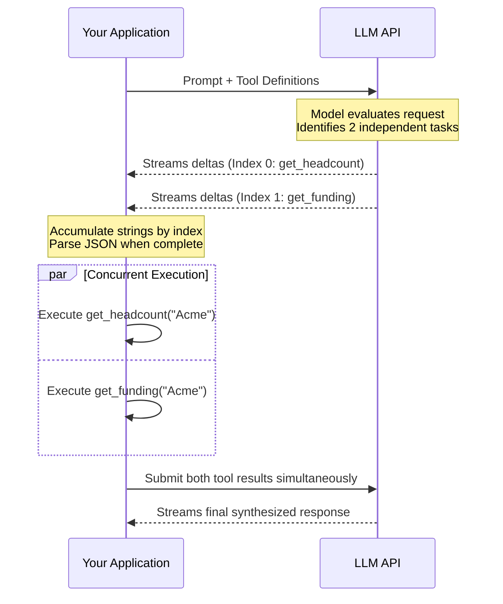

# Parallel Tool Calls and Streaming with Tools

## Learning Objectives
1. **Implement** parallel tool execution in an OpenAI API request.
2. **Differentiate** between sequential and parallel API tool call responses.
3. **Construct** a streaming parser to handle concurrent tool call JSON deltas.
4. **Evaluate** latency improvements when parallelizing independent API lookups.

## The Problem

You are building an automated account research agent. For every inbound lead, the agent must gather three data points: current employee headcount, recent funding news, and core product offerings. 

If you prompt a standard LLM to use tools to find this information, a naive implementation processes requests sequentially. The model decides to call the `get_headcount` tool, waits for your server to return the result, reads it, then decides to call the `get_funding` tool, waits again, and finally calls the `get_products` tool. 

If each external API lookup takes 2 seconds, your agent takes 6 seconds to process a single account. If you are processing 500 accounts in a batch enrichment job, sequential tool calling adds 50 minutes of pure wait time. In go-to-market (GTM) workflows, latency compounds. Slow enrichment means delayed handoffs to Account Executives and missed conversion windows.

## The Concept

Modern LLMs (like GPT-4o) support **parallel tool calls**. When you pass a prompt and a list of available tools, the model analyzes the dependencies. If it determines that multiple tool calls are independent of each other—meaning the result of call A does not influence the arguments for call B—it will return an array of tool calls in a single generation cycle.

Instead of a back-and-forth ping-pong match, the interaction looks like this:

1. You provide the prompt and available tools.
2. The LLM halts text generation and returns a single response containing three distinct `tool_calls` objects.
3. Your application executes all three tool calls concurrently (e.g., using Python's `asyncio` or a thread pool).
4. You return all three results to the model in a single follow-up message.
5. The LLM synthesizes the results and generates its final text response.

When you combine this with **streaming**, the architecture becomes slightly more complex but provides immediate feedback. Streaming means the API yields chunks of data (deltas) as they are generated. When handling parallel tool calls via streaming, the API interleaves the JSON arguments for the different tools. 

Each streamed chunk contains an `index` property. If the model is calling two tools in parallel, the first chunk for tool A has `index: 0`. The first chunk for tool B has `index: 1`. You must accumulate these string fragments in a list, ordered by their index, before passing them to your JSON parser.



## Build It

To observe how the API streams parallel tool calls, you need to inspect the raw chunks. This script defines two tools and forces the model to call both. It demonstrates how the `index` property routes the streamed JSON fragments to the correct buffer.

This code uses the OpenAI Python SDK. You must set your `OPENAI_API_KEY` environment variable before running it.

```python
import openai
import os

client = openai.OpenAI(api_key=os.environ.get("OPENAI_API_KEY"))

tools = [
    {
        "type": "function",
        "function": {
            "name": "get_headcount",
            "description": "Get the employee headcount for a company",
            "parameters": {
                "type": "object",
                "properties": {"company": {"type": "string"}},
                "required": ["company"]
            }
        }
    },
    {
        "type": "function",
        "function": {
            "name": "get_funding",
            "description": "Get the recent funding rounds for a company",
            "parameters": {
                "type": "object",
                "properties": {"company": {"type": "string"}},
                "required": ["company"]
            }
        }
    }
]

messages = [{"role": "user", "content": "Look up the headcount and funding for Acme Corp."}]

stream = client.chat.completions.create(
    model="gpt-4o",
    messages=messages,
    tools=tools,
    stream=True
)

accumulated_args = {}

for chunk in stream:
    delta = chunk.choices[0].delta
    
    if delta.tool_calls:
        for tc in delta.tool_calls:
            idx = tc.index
            
            if idx not in accumulated_args:
                accumulated_args[idx] = {"name": "", "arguments": ""}
                
            if tc.function.name:
                accumulated_args[idx]["name"] = tc.function.name
                
            if tc.function.arguments:
                accumulated_args[idx]["arguments"] += tc.function.arguments

for idx, tool_data in sorted(accumulated_args.items()):
    print(f"Tool Index {idx}: {tool_data['name']}")
    print(f"Raw Arguments String: {tool_data['arguments']}")
    print("-" * 20)
```

When you run this code, you will see that the API returns the function names and their JSON arguments as fragmented strings, grouped by their specific execution `index`.

## Use It

This implements concurrent data retrieval, a mechanism foundational for Cluster 1.1 Account & Domain Enrichment. In practice, GTM engineers use this to query disjointed data providers (like Clearbit, Apollo, and Hunter) at the exact same time during an enrichment workflow.

```python
import openai
import os
import json

client = openai.OpenAI(api_key=os.environ.get("OPENAI_API_KEY"))

def mock_execute(name, args):
    if name == "get_sdr_count": return json.dumps({"count": 12})
    if name == "get_tech_stack": return json.dumps({"crm": "Salesforce"})

tools = [
    {"type": "function", "function": {"name": "get_sdr_count", "parameters": {"type": "object", "properties": {"domain": {"type": "string"}}, "required": ["domain"]}}},
    {"type": "function", "function": {"name": "get_tech_stack", "parameters": {"type": "object", "properties": {"domain": {"type": "string"}}, "required": ["domain"]}}}
]

messages = [{"role": "user", "content": "How many SDRs does stripe.com have, and what CRM do they use?"}]
response = client.chat.completions.create(model="gpt-4o", messages=messages, tools=tools)
msg = response.choices[0].message
msg.tool_calls = msg.tool_calls or []

messages.append(msg)
for tc in msg.tool_calls:
    result = mock_execute(tc.function.name, tc.function.arguments)
    messages.append({"role": "tool", "tool_call_id": tc.id, "name": tc.function.name, "content": result})

final = client.chat.completions.create(model="gpt-4o", messages=messages)
print(final.choices[0].message.content)
```

By allowing the model to request both the SDR count and the tech stack simultaneously, your application architecture mirrors a multi-threaded waterfall. You reduce round-trips and lower the time-to-insight for your sales representatives.

## Exercises

**Exercise 1 (Easy):** Modify the code in the *Build It* section. Add a third tool called `get_industry` and update the prompt to ask for all three data points. Observe how the `accumulated_args` dictionary now manages three distinct indices.

**Exercise 2 (Medium):** Write an `if/else` statement inside the execution loop of the *Use It* code that catches a `KeyError` if the LLM attempts to call a tool you have not defined locally. Print an error message to the terminal instead of crashing the application.

**Exercise 3 (Hard):** Convert the *Use It* code from a standard synchronous request to a streaming request. Parse the streamed tool calls, reconstruct the JSON, pass the results back to the model, and stream the final text answer to the terminal token-by-token. 

## Key Terms

*   **Parallel Tool Calls:** A mechanism where the LLM returns multiple independent tool execution requests in a single response generation cycle.
*   **Streaming Deltas:** Small chunks of data (tokens) yielded continuously by the API as the model generates them, rather than waiting for the entire payload to finish.
*   **Index Property:** In a streamed response containing parallel tool calls, the integer assigned to each specific tool call so the developer can route JSON fragments to the correct buffer.
*   **Round-Trip:** A complete cycle of a client sending a request to a server and receiving a response. Parallelizing tool calls reduces the number of required round-trips for multi-step lookups.

## Sources

*   OpenAI Platform Documentation: Function Calling / Parallel Function Calling [CITATION NEEDED — concept: exact URL for OpenAI API reference on parallel tool streaming behavior]