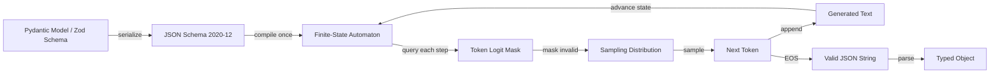

# Structured Output — JSON Schema, Pydantic, Zod, Constrained Decoding

## Learning Objectives

- Write a JSON Schema 2020-12 for a firmographic extraction target using constraints (enum, minimum, maximum, required, pattern) that a grammar compiler can enforce.
- Implement a Pydantic model, compile it to JSON Schema, and call an LLM endpoint with schema enforcement, printing typed output that matches the model.
- Compare raw-output-plus-post-hoc-validation against constrained decoding on the same prompt, measuring failure modes and cost.
- Trace the constrained decoding loop for a minimal vocabulary: identify which logits are masked at each step and explain why.
- Diagnose three distinct failure modes — parse error, schema violation, semantic correctness — and explain why constrained decoding eliminates the first two but not the third.

## The Problem

You have been parsing LLM output with regex and praying. When you prompt a model to return JSON and then run `json.loads()` on the result, you are betting that the model will produce syntactically valid JSON every time. Frontier models fail this bet 5 to 15 percent of the time. The failures come in six flavors: missing closing braces, trailing commas, wrong value types (a string where you expected an integer), hallucinated fields you never asked for, output truncated at the token limit, and leaked prose like "Here is your JSON:" prepended to the payload.

Post-hoc validation catches these after the fact. You generate freely, parse, validate against a schema, and retry on failure. This works — but it is expensive. Every retry costs a full inference call, truncation bugs cost an extra turn, and you have no guarantee the retry will succeed. In a production enrichment pipeline processing thousands of company records, a 10 percent retry rate on a 2,000-record batch means 200 extra LLM calls per run.

The real fix is not better prompting or better validation. It is preventing invalid tokens from being generated in the first place. There is a mechanism that eliminates parse failures entirely by constraining what tokens the model can emit during generation. The model physically cannot produce invalid output because the invalid tokens are masked out of the sampling distribution before any probability is computed.

## The Concept

**Constrained decoding** is the core mechanism. At each generation step, the decoder masks logits for any token that would violate a grammar. The grammar is compiled from your JSON Schema into a finite-state automaton (FSA) — or in some implementations, a pushdown automaton for context-free grammars. Each state in the automaton represents "what am I allowed to emit next?" If the current state says we are inside a string field expecting an enum value, the only tokens that receive nonzero probability are those that begin one of the allowed enum values. Everything else is set to negative infinity before softmax.

The schema-to-grammar compilation happens before generation starts. You pass a JSON Schema to the inference engine, the engine compiles it into an automaton, and that automaton is queried at every decoding step to determine the legal token mask. This compilation is done by libraries like Outlines, by built-in support in llama.cpp and vLLM, or server-side by API providers like OpenAI's structured output mode. The compilation cost is paid once per schema; the per-token masking cost during generation is negligible.

JSON Schema is the interchange format — the lingua franca that Pydantic, Zod, TypeScript types, and Go structs all compile down to. Pydantic (Python) and Zod (TypeScript) are schema-definition ergonomics layers. You write a Python class or a TypeScript schema object, and the library serializes it to a JSON Schema document that the inference engine consumes. They also provide runtime validation after generation, which is useful as a defense-in-depth check even when constrained decoding is active.



There is a critical distinction between "validate after generation" and "constrain during generation." Validation is a quality gate — it tells you the output is wrong but does not prevent the wrongness. Constrained decoding is a manufacturing constraint — the product cannot be defective because the assembly line rejects defective parts before they are produced. This is why constrained decoding achieves near-zero parse failures even on small models that struggle to produce valid JSON when unconstrained.

The guarantee has a boundary: constrained decoding ensures syntactic and structural validity, not semantic correctness. If your schema has a field `company_name: str` and the model generates `"company_name": "banana"`, that is valid JSON matching the schema — it is just semantically wrong. The model can only choose from tokens the grammar allows, but it can still select wrong values from the allowed set. This means schema design matters: enums constrain the value space, patterns constrain string formats, and required fields force the model to commit rather than omit.

## Build It

Let us start by defining a schema the way most Python practitioners do: with Pydantic. We will build a firmographic extraction target — the kind of record a GTM enrichment pipeline pulls from unstructured web pages — compile it to JSON Schema, and validate a hardcoded payload against it.

```python
from pydantic import BaseModel, Field
from typing import Optional
import json

class FirmographicRecord(BaseModel):
    company_name: str = Field(description="Legal or trading name of the company")
    domain: str = Field(pattern=r"^[\w-]+(\.[\w-]+)+$")
    industry: str = Field(description="Primary industry classification")
    employee_count: Optional[int] = Field(default=None, ge=1)
    funding_stage: Optional[str] = Field(
        default=None,
        enum=["pre_seed", "seed", "series_a", "series_b", "series_c", "growth", "public"]
    )
    linkedin_url: Optional[str] = Field(default=None, pattern=r"^https://www\.linkedin\.com/company/")

schema = FirmographicRecord.model_json_schema()
print(json.dumps(schema, indent=2))
```

Run this and you will see the JSON Schema 2020-12 document that Pydantic produces. Notice the `pattern` constraints on `domain` and `linkedin_url`, the `enum` on `funding_stage`, and the `minimum: 1` on `employee_count`. These are not just documentation — when this schema is fed to a constrained decoding engine, each constraint becomes part of the finite-state automaton. The `enum` field means the model can only emit tokens that begin one of the seven allowed funding stage strings. The `pattern` field compiles to a mini-regex automaton nested inside the larger JSON automaton.

Now let us validate a payload against this schema — both a valid one and an invalid one:

```python
valid_payload = {
    "company_name": "Acme Corp",
    "domain": "acme.com",
    "industry": "Manufacturing",
    "employee_count": 250,
    "funding_stage": "series_b",
    "linkedin_url": "https://www.linkedin.com/company/acme-corp"
}

invalid_payload = {
    "company_name": "Bad Co",
    "domain": "not a domain",
    "industry": "Testing",
    "employee_count": -5,
    "funding_stage": "banana",
    "linkedin_url": "https://example.com"
}

try:
    record = FirmographicRecord.model_validate(valid_payload)
    print(f"VALID: {record.company_name} ({record.funding_stage})")
except Exception as e:
    print(f"FAILED: {e}")

try:
    record = FirmographicRecord.model_validate(invalid_payload)
    print(f"VALID: {record.company_name}")
except Exception as e:
    print(f"FAILED: {e}")
```

The second validation fails with a list of every constraint violation: negative employee count, invalid enum value, domain that does not match the pattern, wrong LinkedIn URL format. This is post-hoc validation — the kind you do when you cannot enforce the schema at decode time, or as a safety net when you can. In a production pipeline, this validation step runs after every LLM call regardless of whether constrained decoding was active, because defense in depth is cheap and bugs are expensive.

## Use It

Now we call an LLM endpoint with schema enforcement. This example uses the OpenAI Python SDK with `response_format` set to a JSON Schema — the same mechanism that powers structured output mode. The schema is compiled to a grammar server-side, and the decoder is constrained during generation.

```python
from openai import OpenAI
from pydantic import BaseModel, Field
from typing import Optional
import json

class FirmographicRecord(BaseModel):
    company_name: str = Field(description="Legal or trading name of the company")
    domain: str = Field(pattern=r"^[\w-]+(\.[\w-]+)+$")
    industry: str = Field(description="Primary industry classification")
    employee_count: Optional[int] = Field(default=None, ge=1)
    funding_stage: Optional[str] = Field(
        default=None,
        enum=["pre_seed", "seed", "series_a", "series_b", "series_c", "growth", "public"]
    )

schema = FirmographicRecord.model_json_schema()

client = OpenAI()

completion = client.chat.completions.create(
    model="gpt-4o-2024-08-06",
    messages=[
        {
            "role": "system",
            "content": "Extract firmographic data from the company description."
        },
        {
            "role": "user",
            "content": "Stripe is a technology company that builds economic infrastructure for the internet. Headquartered in San Francisco, they have approximately 8,000 employees and are valued at over $65 billion. Their website is stripe.com."
        }
    ],
    response_format={
        "type": "json_schema",
        "json_schema": {
            "name": "FirmographicRecord",
            "schema": schema,
            "strict": True
        }
    }
)

parsed = FirmographicRecord.model_validate_json(completion.choices[0].message.content)
print(f"Company: {parsed.company_name}")
print(f"Domain: {parsed.domain}")
print(f"Industry: {parsed.industry}")
print(f"Employees: {parsed.employee_count}")
print(f"Funding: {parsed.funding_stage}")
```

The `strict: True` flag tells OpenAI to enforce every property in the schema at decode time. All fields must appear in the schema definition — no `additionalProperties: false` is needed because strict mode enforces it. Optional fields must use the pattern `{"type": ["string", "null"]}` rather than Pydantic's default `anyOf`, which is why some schema shapes require manual adjustment before they work with strict mode.

This is the extraction pattern behind any GTM system that pulls structured account data from unstructured sources. In a Clay enrichment waterfall, when you add an AI column to classify a company's industry, detect buying signals from their homepage, or assess whether an account matches your ICP — [CITATION NEEDED — concept: Clay's internal structured output mechanism for enrichment columns] — that column runs a constrained extraction step. The unstructured web research data (homepage text, news events, job postings) flows into a prompt, and the model's output is constrained to a schema that downstream Clay Formulas can branch on. The output of this process is typically a single ICP column that aggregates filter answers into a binary or categorical field, which then feeds routing logic in the enrichment waterfall.

Without structured output, that pipeline would be unreliable at scale. A 10 percent parse failure rate across a 5,000-company enrichment run means 500 records with missing or malformed data, each requiring manual review or retry logic. Constrained decoding pushes that failure rate toward zero for syntactic errors, leaving only semantic correctness — "did the model extract the right industry?" — as a quality concern. That question is answerable through prompt engineering and evaluation, not through more parsing logic.

## Ship It

Production pipelines need typed error handling, not just happy-path parsing. Three failure modes exist in practice: the model refuses to answer (returns a refusal string instead of JSON), the model produces semantically wrong data (valid JSON, wrong answer), and the schema itself has a bug (too restrictive, causing the model to produce degenerate output). Constrained decoding eliminates a fourth mode — parse failure — but you still need to handle the other three.

```python
from openai import OpenAI
from pydantic import BaseModel, Field, ValidationError
from typing import Optional
import json

class FirmographicRecord(BaseModel):
    company_name: str
    domain: str
    industry: str
    employee_count: Optional[int] = Field(default=None, ge=1)
    funding_stage: Optional[str] = Field(
        default=None,
        enum=["pre_seed", "seed", "series_a", "series_b", "series_c", "growth", "public"]
    )
    refusal_reason: Optional[str] = None

schema = FirmographicRecord.model_json_schema()

client = OpenAI()

def extract_firmographic(company_text: str) -> dict:
    try:
        completion = client.chat.completions.create(
            model="gpt-4o-2024-08-06",
            messages=[
                {
                    "role": "system",
                    "content": "Extract firmographic data. If you cannot determine a field, set refusal_reason and leave the field null."
                },
                {"role": "user", "content": company_text}
            ],
            response_format={
                "type": "json_schema",
                "json_schema": {
                    "name": "FirmographicRecord",
                    "schema": schema,
                    "strict": True
                }
            }
        )
        
        parsed = FirmographicRecord.model_validate_json(
            completion.choices[0].message.content
        )
        
        if parsed.refusal_reason:
            return {
                "status": "refused",
                "reason": parsed.refusal_reason,
                "partial": parsed.model_dump(exclude={"refusal_reason"})
            }
        
        return {"status": "ok", "data": parsed.model_dump(exclude={"refusal_reason"})}
    
    except ValidationError as e:
        return {"status": "schema_violation", "errors": e.errors()}
    except Exception as e:
        return {"status": "error", "message": str(e)}

test_inputs = [
    "Plaid is a fintech company based in San Francisco. Website: plaid.com. About 1,200 employees. Series D funding.",
    "A small bakery on Main Street. No website. Five employees.",
    "INVALID INPUT: the company does not exist and this text is deliberately contradictory."
]

for text in test_inputs:
    result = extract_firmographic(text)
    print(json.dumps(result, indent=2, default=str))
    print("---")
```

The `refusal_reason` field is the key production pattern. By giving the model a structured way to say "I cannot determine this field," you prevent it from hallucinating plausible-sounding but incorrect values. In a GTM enrichment context, a refusal is far more useful than a confident lie — a pipeline that marks a record as "unable to determine funding stage" can route it to manual review, while a pipeline that silently records `funding_stage: "seed"` for a company that is actually bootstrapped will poison downstream ICP scoring.

Schema design for deployment pipelines follows the same principles. When you ship enrichment tables and workflow automations as part of a living GTM system — the kind of infrastructure that gets version-controlled and deployed through CI/CD — the schemas become contracts between pipeline stages. A Clay table's column definitions, an n8n workflow's expected input shape, and the JSON Schema you pass to the LLM should all trace back to the same Pydantic model. Schema drift between these layers is a class of bug that structured output makes visible: if the LLM schema changes but the Clay column does not, the validation step catches it immediately rather than producing silently corrupted data for days.

One practical note on nullable fields and unions: Pydantic's `Optional[X]` compiles to `{"anyOf": [{"type": "X"}, {"type": "null"}]}` by default, but OpenAI's strict mode requires `{"type": ["X", "null"]}` instead. This mismatch means you may need to post-process the generated schema before passing it to the API. The `pydantic-ai` library handles this automatically; raw Pydantic users need to patch the schema or use Pydantic v2's `json_schema_extra` to override specific field serializations.

## Exercises

### Easy: Schema Definition and Validation

Write a Pydantic model for a contact record with `first_name`, `last_name`, `email` (with a pattern constraint), `phone` (optional, with a pattern), and `role` (enum of `decision_maker`, `influencer`, `user`, `unknown`). Serialize to JSON Schema, then validate three hardcoded JSON payloads: one valid, one with a bad email format, one with a bad role enum value. Print the schema and each validation result.

```python
from pydantic import BaseModel, Field, ValidationError
from typing import Optional
import json

class ContactRecord(BaseModel):
    first_name: str
    last_name: str
    email: str = Field(pattern=r"^[^@]+@[^@]+\.[^@]+$")
    phone: Optional[str] = Field(default=None, pattern=r"^\+?[\d\s\-\(\)]+$")
    role: str = Field(
        default="unknown",
        enum=["decision_maker", "influencer", "user", "unknown"]
    )

print(json.dumps(ContactRecord.model_json_schema(), indent=2))

payloads = [
    {"first_name": "Jane", "last_name": "Doe", "email": "jane@acme.com", "role": "decision_maker"},
    {"first_name": "Bob", "last_name": "Smith", "email": "not-an-email", "role": "user"},
    {"first_name": "Alice", "last_name": "Lee", "email": "alice@corp.io", "role": "banana"}
]

for p in payloads:
    try:
        ContactRecord.model_validate(p)
        print(f"PASS: {p['email']}")
    except ValidationError as e:
        print(f"FAIL: {e.errors()[0]['msg']}")
```

### Medium: Constrained Decoding with an LLM API

Call an OpenAI-compatible API with `response_format` set to the `ContactRecord` schema above. Feed it an unstructured email signature block. Print the parsed output and confirm each field's type matches the Pydantic model. Then feed it a deliberately ambiguous input and observe how the model handles fields it cannot determine.

```python
from openai import OpenAI
from pydantic import BaseModel, Field
from typing import Optional
import json

class ContactRecord(BaseModel):
    first_name: str
    last_name: str
    email: str = Field(pattern=r"^[^@]+@[^@]+\.[^@]+$")
    phone: Optional[str] = Field(default=None, pattern=r"^\+?[\d\s\-\(\)]+$")
    role: str = Field(
        default="unknown",
        enum=["decision_maker", "influencer", "user", "unknown"]
    )

schema = ContactRecord.model_json_schema()

client = OpenAI()

email_signatures = [
    """Best,
    Sarah Chen
    VP of Engineering, DataCorp
    sarah.chen@datacorp.com
    +1 (555) 123-4567""",
    
    """Thanks for reaching out. Not sure if I'm the right person.
    - Mike"""
]

for sig in email_signatures:
    completion = client.chat.completions.create(
        model="gpt-4o-2024-08-06",
        messages=[
            {"role": "system", "content": "Extract contact information from the email signature."},
            {"role": "user", "content": sig}
        ],
        response_format={
            "type": "json_schema",
            "json_schema": {
                "name": "ContactRecord",
                "schema": schema,
                "strict": True
            }
        }
    )
    
    parsed = ContactRecord.model_validate_json(completion.choices[0].message.content)
    print(f"Name: {parsed.first_name} {parsed.last_name}")
    print(f"Email: {parsed.email}")
    print(f"Phone: {parsed.phone}")
    print(f"Role: {parsed.role}")
    print(f"Types: {[type(v).__name__ for v in parsed.model_dump().values()]}")
    print("---")
```

### Hard: Minimal Constrained Decoder

Implement a constrained decoder for a 5-token vocabulary and a schema that allows exactly two valid JSON objects: `{"x": 1}` and `{"x": 2}`. At each step, show which logits are masked. This demonstrates the finite-state automaton that real grammar compilers produce.

```python
import math

vocab = ['{', '"', 'x', ':', '1', '2', '}', ' ', 'x"']
vocab_index = {tok: i for i, tok in enumerate(vocab)}

valid_objects = ['{"x": 1}', '{"x": 2}']

def tokenize(s):
    tokens = []
    i = 0
    while i < len(s):
        if s[i:i+4] == '{"x"':
            tokens.append('{"x"')
            i += 4
        elif s[i:i+3] == ': 1' or s[i:i+3] == ': 2':
            tokens.append(s[i:i+3])
            i += 3
        elif s[i] == '}':
            tokens.append('}')
            i += 1
        else:
            tokens.append(s[i])
            i += 1
    return tokens

tokenized_objects = [tokenize(obj) for obj in valid_objects]
print("Tokenized valid objects:")
for obj in tokenized_objects:
    print(f"  {obj}")

valid_token_sequences = tokenized_objects

def get_valid_next_tokens(generated_so_far):
    valid = set()
    for seq in valid_token_sequences:
        if len(generated_so_far) < len(seq):
            if seq[:len(generated_so_far)] == generated_so_far:
                valid.add(seq[len(generated_so_far)])
    return valid

raw_logits = [1.0] * len(vocab)

print("\n--- Constrained Decoding Trace ---")
generated = []
for step in range(10):
    valid_tokens = get_valid_next_tokens(generated)
    if not valid_tokens:
        print(f"Step {step}: No valid continuations. Done.")
        break
    
    masked_logits = []
    for i, tok in enumerate(vocab):
        if tok in valid_tokens:
            masked_logits.append(raw_logits[i])
        else:
            masked_logits.append(float('-inf'))
    
    probs = [math.exp(l) if l != float('-inf') else 0.0 for l in masked_logits]
    total = sum(probs)
    probs = [p / total for p in probs]
    
    best_idx = max(range(len(probs)), key=lambda i: probs[i])
    chosen = vocab[best_idx]
    
    print(f"Step {step}: prefix={generated}")
    print(f"  Valid tokens: {valid_tokens}")
    print(f"  Masked logits: {dict(zip(vocab, ['KEEP' if l != float('-inf') else 'MASK' for l in masked_logits]))}")
    print(f"  Chosen: '{chosen}' (prob={probs[best_idx]:.2f})")
    
    generated.append(chosen)
    
    if chosen == '}':
        print(f"\nFinal output: {''.join(generated)}")
        break
```

### Debug: Schema Edge Cases

Given a Pydantic model with `Optional` and `Union` fields, inspect the generated JSON Schema and identify which constructs a grammar compiler might struggle with. Nullable fields, union types, and deeply nested arrays all produce schema shapes that require more complex automata.

```python
from pydantic import BaseModel, Field
from typing import Optional, Union, List
import json

class Address(BaseModel):
    street: str
    city: str
    zip_code: str

class Company(BaseModel):
    name: str
    headquarters: Optional[Address] = None
    secondary_locations: List[Address] = Field(default_factory=list)
    annual_revenue: Union[int, str] = Field(
        description="Revenue in USD, or 'unknown'"
    )
    tags: Optional[List[str]] = None

schema = Company.model_json_schema()
print(json.dumps(schema, indent=2))

print("\n--- Potential Grammar Compiler Issues ---")
print("1. Union[int, str] for annual_revenue: compiler must branch on type")
print("2. Optional[Address]: nullable nested object adds null-check states")
print("3. List[Address]: unbounded array requires loop in the automaton")
print("4. Optional[List[str]]: doubly-optional nested array")
print("5. additionalProperties defaults differ between Pydantic and strict mode")
```

## Key Terms

**Constrained decoding** — A decoding strategy where the sampling distribution is modified at each step to prevent tokens that would violate a grammar from being selected. Implemented via logit masking before softmax.

**JSON Schema 2020-12** — A specification language for describing the structure of JSON data. Used as the interchange format between schema-definition tools (Pydantic, Zod) and inference engines (Outlines, vLLM, OpenAI structured output mode).

**Finite-state automaton (FSA)** — A mathematical model of computation consisting of states and transitions. JSON Schema is compiled to an FSA where each state represents a position in the expected output and transitions represent allowed next tokens. Some constructs (nested arrays, recursive types) require pushdown automata instead.

**Pydantic** — A Python data validation library that compiles type-annotated classes to JSON Schema and provides runtime validation. Primary schema-definition layer for Python LLM pipelines.

**Zod** — A TypeScript-first schema validation library that compiles to JSON Schema. Analogous to Pydantic for the JavaScript/TypeScript ecosystem.

**Logit masking** — The process of setting logits for disallowed tokens to negative infinity before softmax, forcing their probability to exactly zero. This is the mechanism by which constrained decoding prevents invalid token generation.

**Strict mode** — A flag in OpenAI's structured output API that enforces the schema at decode time with guaranteed adherence. Requires all fields in the schema to be present and uses a restricted subset of JSON Schema features.

## Sources

- OpenAI structured outputs documentation describes `response_format` with `json_schema` type and `strict: true` enforcement: https://platform.openai.com/docs/guides/structured-outputs
- Outlines library documentation describes schema-to-grammar compilation and logit masking: https://outlines-dev.github.io/outlines/
- Pydantic V2 JSON Schema generation follows JSON Schema 2020-12 draft: https://docs.pydantic.dev/latest/concepts/json_schema/
- [CITATION NEEDED — concept: Clay's internal structured output mechanism for enrichment columns]
- [CITATION NEEDED — concept: Clay waterfall enrichment architecture and AI column schema enforcement]
- GTM Zone 13 (Deployment, CI/CD) maps to production GTM infrastructure where schema definitions serve as contracts between pipeline stages: stages/00-b-gtm-content-mapping/output/gtm-topic-map.md