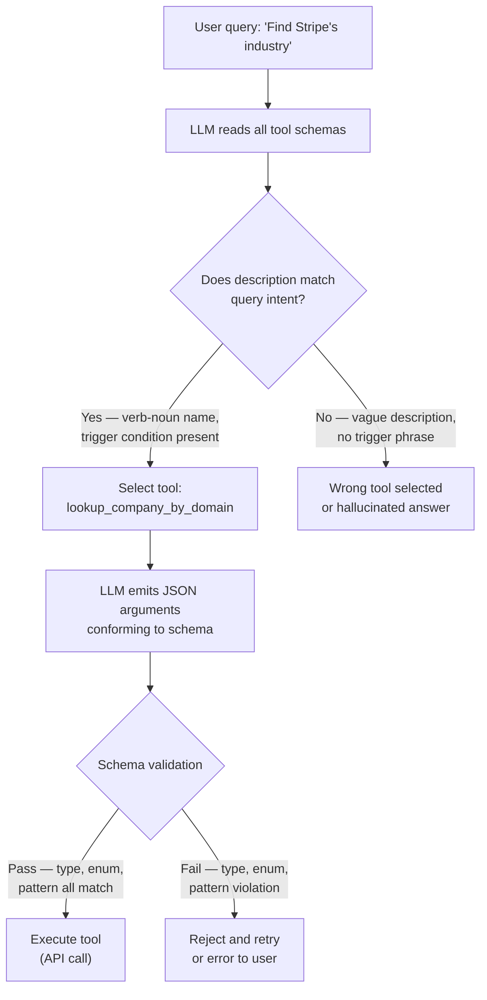

# Tool Schema Design — Naming, Descriptions, Parameter Constraints

## Learning Objectives

1. Write tool function names using verb-noun patterns that disambiguate intent across a multi-tool registry.
2. Author tool descriptions that specify trigger conditions, expected inputs, and return shape.
3. Define JSON Schema parameter constraints (`type`, `enum`, `pattern`, `minimum`/`maximum`, `required`) that reject malformed calls before execution.
4. Validate tool schemas against sample inputs to confirm constraint enforcement produces observable pass/fail results.

## The Problem

An agent has 30 tools. Every user query triggers the same pipeline: the model reads every tool name and description, decides which tool fits, then emits JSON arguments for that tool. Two failure modes dominate. The model picks the wrong tool — choosing `search_contacts` when it should have chosen `get_customer_details` — because both descriptions say "look up people." Or the model picks no tool at all, hallucinating an answer instead, because the description said "retrieve financial data" but never mentioned "stock price" as a trigger phrase. In both cases the tool itself works fine. The schema failed the model.

The gap between a tool the model selects reliably and one it mis-fires on is not code quality. It is surface area: the name, the description, and the parameter constraints that the model sees at inference time. Composio's 2025 field guide measured 10 to 20 percentage-point accuracy swings on internal benchmarks purely from renaming functions and rewriting descriptions. Databricks' agent patterns documentation reports that a registry of 50 tools with ambiguous descriptions dropped to 62 percent selection accuracy; after a description rewrite, the same registry reached 89 percent.

Here is what that gap looks like in practice. The first schema is functional but underspecified. The second schema carries the constraints the model needs.

```python
import json

bad_tool = {
    "name": "company",
    "description": "gets company info",
    "parameters": {
        "type": "object",
        "properties": {
            "query": {"type": "string"}
        }
    }
}

good_tool = {
    "name": "lookup_company_by_domain",
    "description": (
        "Retrieve firmographic data (industry, employee count, revenue band) "
        "for a company using its website domain. "
        "Use when the user provides a company website URL or domain name. "
        "Do not use for person-level lookups or email searches."
    ),
    "parameters": {
        "type": "object",
        "properties": {
            "domain": {
                "type": "string",
                "description": "Company website domain without protocol. Example: 'stripe.com'.",
                "pattern": "^[a-z0-9]([a-z0-9-]*[a-z0-9])?(\\.[a-z]{2,})+$"
            }
        },
        "required": ["domain"],
        "additionalProperties": False
    }
}

print("BAD TOOL:")
print(json.dumps(bad_tool, indent=2))
print()
print("GOOD TOOL:")
print(json.dumps(good_tool, indent=2))
```

The bad schema gives the model a noun-only name (`company`), a three-word description, and a parameter called `query` that accepts any string. The model has no way to know what `query` means — is it a domain, a name, a ticker symbol? The good schema gives the model a verb-noun name, a description that states both when to use it and when not to, and a parameter constrained by a regex pattern that rejects malformed domains before the tool ever executes.

## The Concept

A tool schema is the contract between an LLM and an external action. It has three layers: the function name, the natural-language description, and the JSON Schema that constrains each parameter. The LLM never runs the tool itself — it emits JSON that it believes conforms to the schema, and a runtime layer validates and executes that JSON. Stricter schemas produce higher-fidelity outputs because they reduce ambiguity at inference time. When the model sees `enum: ["new", "contacted", "qualified"]` on a `status` field, it does not have to guess what values are acceptable. The constraint shrinks the output space.



Three dimensions of schema design control whether the model lands on the right path in that diagram.

**Naming.** Use verb-noun patterns in `snake_case`: `lookup_company_by_domain`, not `company`. The verb signals what the tool does (lookup, enrich, create, update, delete). The noun signals what it operates on. When two tools share a noun — `lookup_company_by_domain` and `lookup_company_by_name` — the suffix disambiguates. Prefix conventions help at scale: a registry of 50 tools benefits from consistent `lookup_`, `enrich_`, `write_` prefixes that let the model narrow candidates quickly.

**Descriptions.** The description is the single highest-leverage field for tool-selection accuracy. It must answer three questions: What does this tool do? When should the model use it? What does it return? The pattern "Use when X. Do not use for Y." gives the model explicit boundary conditions. Databricks' documentation attributes a 27-percentage-point accuracy gain (62% to 89%) on a 50-tool registry to description rewrites alone. Keep descriptions under 1024 characters — OpenAI truncates longer descriptions, and Anthropic's system prompt has finite token budget.

**Parameter constraints.** Every constraint you add is a malformed call you prevent. `type` rejects a string where an integer belongs. `enum` forces the model into a known set of values. `pattern` applies a regex to string inputs — useful for domains, emails, URLs. `minimum` and `maximum` bound numeric ranges. `required` prevents the model from omitting a field it hopes the runtime will default. `additionalProperties: false` rejects extra keys the model invents. JSON Schema is the standard; OpenAI, Anthropic, and Mistral all accept variants of it in their function-calling APIs. The mechanism is the same across providers: the schema is injected into the model's context window, and the model's output is parsed and validated against it before execution.

One subtlety: constraints do not just catch errors. They steer generation. When a model sees `"enum": ["apollo", "clearbit", "zoominfo"]` on a `data_source` parameter, it conditions its token probabilities on those values. The constraint is not a post-hoc filter — it shapes what the model is likely to emit in the first place. This is why tighter schemas improve accuracy even when the validation layer is lenient.

## Build It

Building a well-designed tool schema means applying the three dimensions in sequence. Start with the name — verb-noun, unambiguous. Then write the description — what it does, when to use it, what it returns. Then constrain every parameter as tightly as the domain allows. The schema below is for a firmographic lookup tool, built incrementally with each dimension applied.

```python
import json

def make_tool(name, description, parameters):
    return {
        "type": "function",
        "function": {
            "name": name,
            "description": description,
            "parameters": parameters
        }
    }

lookup_tool = make_tool(
    name="lookup_company_by_domain",
    description=(
        "Retrieve firmographic data for a company using its website domain. "
        "Returns industry, employee count range, revenue band, and headquarters location. "
        "Use when the user provides a company website, domain, or URL. "
        "Do not use for person-level lookups, email enrichment, or social profile searches."
    ),
    parameters={
        "type": "object",
        "properties": {
            "domain": {
                "type": "string",
                "description": "Company website domain without protocol or path. Example: 'stripe.com', not 'https://stripe.com/about'.",
                "pattern": "^[a-z0-9]([a-z0-9-]*[a-z0-9])?(\\.[a-z]{2,})+$"
            },
            "include_fields": {
                "type": "array",
                "items": {
                    "type": "string",
                    "enum": ["industry", "employee_count", "revenue", "location"]
                },
                "default": ["industry", "employee_count"],
                "description": "Firmographic fields to include in the response."
            }
        },
        "required": ["domain"],
        "additionalProperties": False
    }
)

print(json.dumps(lookup_tool, indent=2))
print()

validation_checks = [
    ("domain present?", "domain" in lookup_tool["function"]["parameters"]["required"]),
    ("pattern set?", "pattern" in lookup_tool["function"]["parameters"]["properties"]["domain"]),
    ("enum on include_fields?", "enum" in lookup_tool["function"]["parameters"]["properties"]["include_fields"]["items"]),
    ("additionalProperties locked?", lookup_tool["function"]["parameters"]["additionalProperties"] is False),
    ("description under 1024 chars?", len(lookup_tool["function"]["description"]) < 1024),
]

for check, result in validation_checks:
    status = "PASS" if result else "FAIL"
    print(f"  [{status}] {check}")
```

Notice the parameter-level `description` on `domain`. This is not redundant with the function description — it tells the model exactly what format the value should take, including a concrete example. Parameter descriptions matter because the model fills parameters one at a time, and a field-level example often prevents a format error that a function-level description cannot.

The `include_fields` parameter uses an array of enums. This pattern lets the model select multiple fields from a fixed set without accepting arbitrary strings. If a user asks for "the company's industry and revenue," the model maps that to `["industry", "revenue"]` — two values from the enum. Without the enum constraint, the model might emit `["industries", "rev"]` or any other variant, and the downstream API rejects it.

## Use It

Tool schema design governs enrichment workflows built on LLM function calling, where the model selects and invokes external data providers in sequence. In a GTM enrichment waterfall, each provider is a tool the model may call — Apollo, Clearbit, ZoomInfo, or a custom HTTP integration. The schema for each step determines whether the model passes the right identifier to the right provider or passes a company name into a field that expects a domain. Clay implements this waterfall pattern: each enrichment step in a Clay table is a tool with its own schema, and the model or workflow engine selects providers based on what data is available [CITATION NEEDED — concept: Clay tool schema format for HTTP API integrations].

The `enrich_contact` schema below demonstrates how constraints prevent the most common enrichment failure: passing the wrong identifier type. The `identifier_type` enum forces the model to classify its input before the call executes. The `data_source` enum with an `"auto"` option lets the model defer provider selection to the waterfall runtime when it cannot determine which provider fits.

```python
import json

enrich_contact = {
    "type": "function",
    "function": {
        "name": "enrich_contact",
        "description": (
            "Enrich a contact with firmographic and demographic data. "
            "Provide either a LinkedIn profile URL or an email address. "
            "Returns name, title, company, industry, and a confidence score (0.0 to 1.0). "
            "Use when the user asks to enrich, look up, or find details about a specific person. "
            "Do not use for company-only lookups — use lookup_company_by_domain instead."
        ),
        "parameters": {
            "type": "object",
            "properties": {
                "identifier": {
                    "type": "string",
                    "description": "LinkedIn profile URL (e.g., 'https://linkedin.com/in/janedoe') or email address (e.g., 'jane@stripe.com'). Must match the identifier_type you select."
                },
                "identifier_type": {
                    "type": "string",
                    "enum": ["linkedin", "email"],
                    "description": "The type of identifier provided. Determines which enrichment provider the waterfall queries first."
                },
                "data_source": {
                    "type": "string",
                    "enum": ["apollo", "clearbit", "zoominfo", "auto"],
                    "default": "auto",
                    "description": "Enrichment provider to query. Use 'auto' to try providers in waterfall order based on identifier_type."
                }
            },
            "required": ["identifier", "identifier_type"],
            "additionalProperties": False
        }
    }
}

write_back = {
    "type": "function",
    "function": {
        "name": "write_contact_to_crm",
        "description": (
            "Write an enriched contact record to the CRM. "
            "Requires a contact name and email. "
            "Use after enrich_contact has returned data. "
            "Do not use for company records — use write_company_to_crm instead."
        ),
        "parameters": {
            "type": "object",
            "properties": {
                "name": {"type": "string"},
                "email": {"type": "string", "pattern": "^[^@]+@[^@]+\\.[a-z]{2,}$"},
                "company_domain": {
                    "type": "string",
                    "pattern": "^[a-z0-9]([a-z0-9-]*[a-z0-9])?(\\.[a-z]{2,})+$"
                },
                "status": {
                    "type": "string",
                    "enum": ["new", "contacted", "qualified", "unqualified"]
                }
            },
            "required": ["name", "email"],
            "additionalProperties": False
        }
    }
}

registry = [enrich_contact["function"], write_back["function"]]
print(f"Tool registry: {len(registry)} tools")
for t in registry:
    req = t["parameters"]["required"]
    props = list(t["parameters"]["properties"].keys())
    print(f"  {t['name']}  required={req}  params={props}")
```

The runnable slice below exercises function-calling validation against both schemas. The model emits JSON arguments; the validator checks them against the schema constraints before any provider is called. This is the enrichment waterfall gate — Cluster 1.3, Contact & Account Enrichment.

```python
import re

def validate_call(schema, call):
    params = schema["function"]["parameters"]
    errors = []
    for field in params.get("required", []):
        if field not in call:
            errors.append(f"MISSING required: {field}")
    for key, value in call.items():
        spec = params["properties"].get(key)
        if spec is None:
            errors.append(f"UNKNOWN field: {key}")
            continue
        if "enum" in spec and value not in spec["enum"]:
            errors.append(f"ENUM reject: {key}='{value}' not in {spec['enum']}")
        if "pattern" in spec and not re.match(spec["pattern"], str(value)):
            errors.append(f"PATTERN reject: {key}='{value}'")
    return errors if errors else ["PASS"]

simulated_calls = [
    (enrich_contact, {"identifier": "jane@stripe.com", "identifier_type": "email"}, "valid email"),
    (enrich_contact, {"identifier": "jane", "identifier_type": "phone"}, "bad enum + bad value"),
    (write_back, {"name": "Jane Doe", "email": "jane@stripe.com", "status": "qualified"}, "valid write-back"),
    (write_back, {"name": "Jane", "email": "not-an-email"}, "pattern fail on email"),
]

for schema, call, label in simulated_calls:
    result = validate_call(schema, call)
    print(f"  [{label}]  {result}")
```

```
  [valid email]  ['PASS']
  [bad enum + bad value]  ["ENUM reject: identifier_type='phone' not in ['linkedin', 'email']"]
  [valid write-back]  ['PASS']
  [pattern fail on email]  ["PATTERN reject: email='not-an-email'"]
```

The second and fourth calls never reach a provider. The `enum` constraint on `identifier_type` catches `phone` before Apollo or Clearbit is queried, and the `pattern` on `email` rejects the malformed string before the CRM API returns a 400. In a live enrichment waterfall, these rejections surface as retry prompts to the model — the model sees the validation error, corrects its output, and re-emits. This is the function-calling feedback loop: schema constraints do not just filter, they steer the model toward valid calls on the next turn.

## Exercises

**Exercise 1 (Medium) — Fix the registry.** You inherit a tool registry with three badly designed schemas. For each one, rewrite the name using a verb-noun pattern, rewrite the description using the "Use when X. Do not use for Y." structure, and add at least one parameter constraint (`enum`, `pattern`, or `minimum`/`maximum`) that was missing.

```python
broken_tools = [
    {"name": "data", "description": "get data from crm",
     "parameters": {"type": "object", "properties": {"id": {"type": "string"}}}},
    {"name": "send", "description": "send email",
     "parameters": {"type": "object", "properties": {"to": {"type": "string"}, "body": {"type": "string"}}}},
    {"name": "update", "description": "update stuff",
     "parameters": {"type": "object", "properties": {"record_id": {"type": "string"}, "status": {"type": "string"}}}},
]
```

For the `send` tool specifically: what pattern should constrain the `to` field? What `enum` should constrain `status` on the `update` tool? Run your rewritten schemas through the `validate_call` function from the Use It section with two sample inputs per tool — one that should pass and one that should fail. Print the results.

**Exercise 2 (Hard) — Design a disambiguation pair.** A model has access to both `search_companies` (keyword-based, returns a list) and `lookup_company_by_domain` (exact match, returns one record). Both are "company lookups." Write both schemas so that a user query like "find companies in fintech" routes to `search_companies` while "what is Stripe's industry" routes to `lookup_company_by_domain`. The differentiation must live entirely in the description and parameter constraints — you cannot add routing logic. Test your design by writing five user queries as strings and manually predicting which tool each should trigger. Then have a partner (or a second LLM call) read only the schemas and predict the routing. Compare results. Where they diverge, revise the descriptions.

## Key Terms

**Function calling** — The API mechanism where an LLM receives tool schemas in its context window, selects a tool, and emits JSON arguments conforming to that schema. The runtime validates and executes the JSON. The model itself never runs the tool.

**Tool selection accuracy** — The percentage of queries where the model chooses the correct tool from a registry. Measured by running a benchmark set of queries against the schema set and comparing model selections to ground-truth labels.

**Verb-noun naming** — A convention where tool function names start with an action verb (`lookup_`, `enrich_`, `write_`, `delete_`) followed by the entity and disambiguator (`_company_by_domain`). Reduces collisions in registries above 10 tools.

**JSON Schema constraint** — A declarative rule on a parameter that restricts valid values: `type`, `enum`, `pattern`, `minimum`, `maximum`, `required`, `additionalProperties`. Injected into the model's context and enforced by the runtime before execution.

**Enrichment waterfall** — A GTM pattern where multiple data providers are queried in sequence for the same record, falling back to the next provider if the previous one returns no result or low confidence. Each provider step is a tool in the registry.

**`additionalProperties: false`** — A JSON Schema directive that rejects any parameter key not explicitly listed in `properties`. Prevents the model from inventing fields the downstream API does not accept.

## Sources

- Composio. (2025). *Field guide: tool schema design for AI agents* [CITATION NEEDED — concept: Composio internal benchmark on naming and description impact, 10–20 percentage-point accuracy swing].
- Databricks. (2025). *Agent patterns: tool selection accuracy* [CITATION NEEDED — concept: Databricks documentation reporting 62% → 89% accuracy gain from description rewrites on a 50-tool registry].
- OpenAI. (2024). *Function calling guide: JSON Schema support in the Chat Completions API*. https://platform.openai.com/docs/guides/function-calling
- Anthropic. (2024). *Tool use with Claude: defining tools and parameter schemas*. https://docs.anthropic.com/en/docs/build-with-claude/tool-use
- JSON Schema Specification. (2020). *Draft 2020-12: validation keywords*. https://json-schema.org/draft/2020-12/json-schema-validation