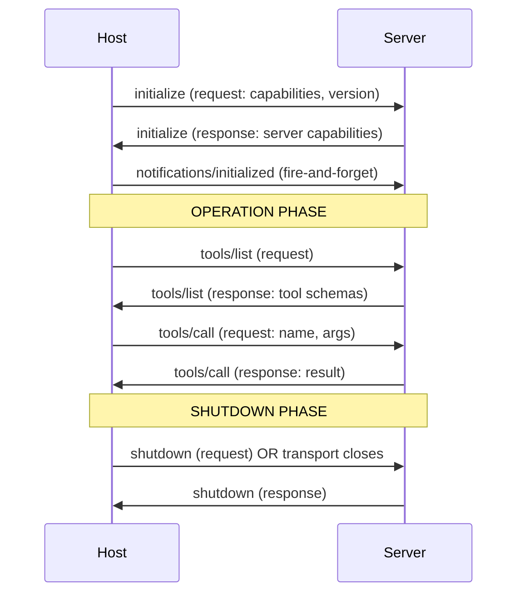

# MCP Fundamentals — Primitives, Lifecycle, JSON-RPC Base

## Learning Objectives

- Parse and emit JSON-RPC 2.0 request, response, and notification envelopes by hand, identifying which fields are required for each message type.
- Implement a minimal MCP server using only Python's `json` and `sys` modules that completes the three-phase lifecycle (initialize → operation → shutdown).
- Distinguish the six MCP primitives (tools, resources, prompts, roots, sampling, elicitation) by what each does to the context window — tools *act*, resources *inform*, prompts *shape*.
- Trace the capability negotiation handshake and explain why a server that skips `initialize` is rejected by spec-compliant hosts.

## The Problem

Every tool-using agent before late 2024 had its own integration protocol. Cursor had a tool system. Claude Desktop shipped a different one. VS Code's Copilot extension had a third. A team that built a "Postgres query" tool wrote the same logic three times — once per host — because each host's API was incompatible with the others. Reusing a tool across hosts meant copying code, adapting to a new schema, and maintaining divergent versions.

The Model Context Protocol, first shipped by Anthropic in November 2024, fixes this by standardizing the wire format. MCP is a JSON-RPC 2.0 protocol that lets any host (Claude Desktop, ChatGPT, Cursor, Gemini, Goose, Zed, Windsurf — 300+ clients by April 2026) discover and invoke capabilities on any server, over stdio or HTTP with SSE. The Linux Foundation took stewardship in December 2025 under the Agentic AI Foundation. The spec revision used here is **2025-11-25**, which names six primitives (three server-side, three client-side), a three-phase lifecycle, and a capability negotiation handshake.

In a GTM context, this matters concretely. A go-to-market engineering team that wraps a CRM API (HubSpot contact search, Salesforce lead create) as an MCP server gets agent-callable tools that work in *any* MCP-compatible host without re-integration. The same server that powers a prospect-research agent in Claude Desktop can power a lead-scoring workflow in Goose, because the wire format is shared. This is the transport layer behind the tool-calling agents that drive enrichment waterfalls and autonomous action workflows.

## The Concept

MCP is three things stacked together: a JSON-RPC 2.0 message format, a set of primitives that define what a server can expose, and a lifecycle that governs the conversation between host and server.

### JSON-RPC 2.0 — the wire format

Every MCP message is a JSON-RPC 2.0 object. There are three message types, each with distinct required fields:

A **request** expects a response. It carries `jsonrpc: "2.0"`, an `id` (integer or string, used for correlation), a `method` (string), and optional `params` (object or array). The `id` is critical for async transports — when messages arrive over HTTP with SSE, responses may come back in a different order than requests were sent. The `id` lets the client match each response to its originating request.

A **response** carries the same `jsonrpc` and `id` as the request, plus either a `result` (on success) or an `error` (on failure), never both. The error object contains `code` (integer), `message` (string), and optional `data`.

A **notification** is fire-and-forget — no `id`, no response expected. Same `jsonrpc` and `method` fields. Notifications are how the client tells the server "I'm done initializing" (`notifications/initialized`) or how either side signals cancellation (`notifications/cancelled`).

```python
import json

request = {"jsonrpc": "2.0", "id": 1, "method": "initialize", "params": {}}
response_ok = {"jsonrpc": "2.0", "id": 1, "result": {"capabilities": {}}}
response_err = {"jsonrpc": "2.0", "id": 1, "error": {"code": -32601, "message": "Method not found"}}
notification = {"jsonrpc": "2.0", "method": "notifications/initialized"}

for label, msg in [("request", request), ("response (ok)", response_ok), ("response (err)", response_err), ("notification", notification)]:
    print(f"{label}: {json.dumps(msg)}")
    print(f"  has id: {'id' in msg}  |  expects response: {'id' in msg}")
```

```
request: {"jsonrpc": "2.0", "id": 1, "method": "initialize", "params": {}}
  has id: True  |  expects response: True
response (ok): {"jsonrpc": "2.0", "id": 1, "result": {"capabilities": {}}}
  has id: True  |  expects response: True
response (err): {"jsonrpc": "2.0", "id": 1, "error": {"code": -32601, "message": "Method not found"}}
  has id: True  |  expects response: True
notification: {"jsonrpc": "2.0", "method": "notifications/initialized"}
  has id: False  |  expects response: False
```

### The six primitives

The 2025-11-25 spec names six primitives. Three are server-side (the server exposes them, the host invokes them):

- **Tools** are executable functions the model can call. A tool *acts* on the world — creates a contact, sends a webhook, updates a record. The host decides when to call a tool based on the model's tool-call decision.
- **Resources** are read-only data the model can pull. A resource *informs* — returns the text of a 10-K filing, a company's tech stack from a data provider, the contents of a file. Identified by URI (e.g., `company://acme/10k`).
- **Prompts** are reusable prompt templates. A prompt *shapes* — provides a pre-written instruction structure that guides the model's behavior for a specific task (e.g., a "competitive analysis" prompt template).

Three are client-side (the host exposes them, the server may request them):

- **Roots** let the server ask the host which filesystem roots or URIs it has access to.
- **Sampling** lets the server request that the host run an LLM completion on its behalf (server-to-client LLM call).
- **Elicitation** (added in 2025-11-25) lets the server ask the host for additional information from the user mid-operation — a structured form-fill during tool execution.

### The lifecycle



The lifecycle has three phases. **Initialization**: the host sends an `initialize` request containing its protocol version, client info, and the capabilities it supports (e.g., "I can handle `roots` requests"). The server responds with its own protocol version, server info, and the capabilities it offers (e.g., "I expose `tools` and `resources`"). The host then sends a `notifications/initialized` notification to confirm — no response expected. This is **capability negotiation**: both sides declare what they support before any operation begins. A server that skips the handshake will be rejected by spec-compliant hosts because the host has no way to know what the server can do.

**Operation** is everything between init and shutdown: `tools/list`, `tools/call`, `resources/list`, `resources/read`, `prompts/list`, `prompts/get`, and any notifications either side sends.

**Shutdown**: the host sends a `shutdown` request (over HTTP/SSE) or simply closes the stdio pipe. The server acknowledges and cleans up.

## Build It

Build a minimal MCP server using only Python's `json` and `sys` modules. No SDK, no framework, no pip install. The server reads JSON-RPC messages from stdin, processes them, and writes responses to stdout. All logging goes to stderr so it doesn't pollute the protocol channel.

```python
import json
import sys

SERVER_INFO = {"name": "minimal-mcp", "version": "0.1.0"}
PROTOCOL_VERSION = "2025-11-25"

CAPABILITIES = {
    "tools": {},
    "resources": {}
}

TOOLS = [
    {
        "name": "echo",
        "description": "Echoes back the input text",
        "inputSchema": {
            "type": "object",
            "properties": {
                "text": {"type": "string", "description": "Text to echo"}
            },
            "required": ["text"]
        }
    }
]

RESOURCES = [
    {
        "uri": "server://info",
        "name": "Server Info",
        "description": "Returns server metadata",
        "mimeType": "application/json"
    }
]

def send_message(msg):
    sys.stdout.write(json.dumps(msg) + "\n")
    sys.stdout.flush()

def log(msg):
    sys.stderr.write(f"[SERVER] {msg}\n")
    sys.stderr.flush()

def handle_request(req):
    method = req.get("method")
    req_id = req.get("id")
    params = req.get("params", {})

    if method == "initialize":
        result = {
            "protocolVersion": PROTOCOL_VERSION,
            "capabilities": CAPABILITIES,
            "serverInfo": SERVER_INFO
        }
        log(f"initialize -> protocol {PROTOCOL_VERSION}, caps: {list(CAPABILITIES.keys())}")
        return {"jsonrpc": "2.0", "id": req_id, "result": result}

    if method == "tools/list":
        log(f"tools/list -> {len(TOOLS)} tools")
        return {"jsonrpc": "2.0", "id": req_id, "result": {"tools": TOOLS}}

    if method == "tools/call":
        tool_name = params.get("name")
        tool_args = params.get("arguments", {})
        if tool_name == "echo":
            echoed = tool_args.get("text", "")
            log(f"tools/call echo -> '{echoed}'")
            return {
                "jsonrpc": "2.0",
                "id": req_id,
                "result": {
                    "content": [{"type": "text", "text": echoed}],
                    "isError": False
                }
            }
        return {
            "jsonrpc": "2.0",
            "id": req_id,
            "error": {"code": -32602, "message": f"Unknown tool: {tool_name}"}
        }

    if method == "resources/list":
        log(f"resources/list -> {len(RESOURCES)} resources")
        return {"jsonrpc": "2.0", "id": req_id, "result": {"resources": RESOURCES}}

    if method == "resources/read":
        uri = params.get("uri")
        if uri == "server://info":
            content = json.dumps(SERVER_INFO)
            log(f"resources/read {uri}")
            return {
                "jsonrpc": "2.0",
                "id": req_id,
                "result": {
                    "contents": [{"uri": uri, "mimeType": "application/json", "text": content}]
                }
            }
        return {
            "jsonrpc": "2.0",
            "id": req_id,
            "error": {"code": -32602, "message": f"Unknown resource: {uri}"}
        }

    return {
        "jsonrpc": "2.0",
        "id": req_id,
        "error": {"code": -32601, "message": f"Method not found: {method}"}
    }

def handle_notification(notification):
    method = notification.get("method")
    if method == "notifications/initialized":
        log("received notifications/initialized — handshake complete, entering operation phase")

def main():
    log("server started, listening on stdin")
    for line in sys.stdin:
        line = line.strip()
        if not line:
            continue
        try:
            msg = json.loads(line)
        except json.JSONDecodeError:
            log(f"invalid JSON: {line[:80]}")
            continue

        if "id" in msg:
            log(f"<-- request: {msg['method']} (id={msg['id']})")
            response = handle_request(msg)
            log(f"--> response (id={msg['id']})")
            send_message(response)
        else:
            log(f"<-- notification: {msg.get('method')}")
            handle_notification(msg)

    log("stdin closed, shutting down")

if __name__ == "__main__":
    main()
```

Save this as `mcp_server.py`. Now test it by piping a hardcoded sequence of JSON-RPC messages through stdin:

```bash
python3 mcp_server.py <<'EOF'
{"jsonrpc": "2.0", "id": 1, "method": "initialize", "params": {}}
{"jsonrpc": "2.0", "method": "notifications/initialized"}
{"jsonrpc": "2.0", "id": 2, "method": "tools/list", "params": {}}
{"jsonrpc": "2.0", "id": 3, "method": "tools/call", "params": {"name": "echo", "arguments": {"text": "hello from MCP"}}}
EOF
```

Expected stdout:

```json
{"jsonrpc": "2.0", "id": 1, "result": {"protocolVersion": "2025-11-25", "capabilities": {"tools": {}, "resources": {}}, "serverInfo": {"name": "minimal-mcp", "version": "0.1.0"}}}
{"jsonrpc": "2.0", "id": 2, "result": {"tools": [{"name": "echo", "description": "Echoes back the input text", "inputSchema": {"type": "object", "properties": {"text": {"type": "string", "description": "Text to echo"}}, "required": ["text"]}}]}}
{"jsonrpc": "2.0", "id": 3, "result": {"content": [{"type": "text", "text": "hello from MCP"}], "isError": false}}
```

Expected stderr:

```
[SERVER] server started, listening on stdin
[SERVER] <-- request: initialize (id=1)
[SERVER] initialize -> protocol 2025-11-25, caps: ['tools', 'resources']
[SERVER] --> response (id=1)
[SERVER] <-- notification: notifications/initialized
[SERVER] received notifications/initialized — handshake complete, entering operation phase
[SERVER] <-- request: tools/list (id=2)
[SERVER] tools/list -> 1 tools
[SERVER] --> response (id=2)
[SERVER] <-- request: tools/call (id=3)
[SERVER] tools/call echo -> 'hello from MCP'
[SERVER] --> response (id=3)
[SERVER] stdin closed, shutting down
```

Trace the lifecycle: `initialize` request → `initialize` response (capability negotiation) → `notifications/initialized` notification (handshake complete) → `tools/list` → `tools/call`. That is a full MCP conversation in four messages.

## Use It

The JSON-RPC primitives map directly onto GTM engineering tooling. Consider an enrichment waterfall — the pattern where a prospect record passes through multiple data providers (Apollo, Clearbit, ZoomInfo, LinkedIn) until a field is filled. Each step in that waterfall is a **tool**: an executable function that takes a domain or email and returns enriched data. When the waterfall is implemented as an MCP server, the same tool definitions work whether the host is Claude Desktop (interactive research), Goose (autonomous agent loop), or a custom orchestration layer — because the wire format is shared.

The three server primitives map to three GTM data patterns:

- **Tools** wrap write-side APIs: HubSpot contact create, Salesforce lead update, Slack message send, Outreach sequence enrollment. The model decides to call them during an agentic workflow.
- **Resources** wrap read-side data: a company's 10-K filing (fetched from SEC EDGAR), an account's tech stack (from BuiltWith or Wappalyzer output), a prospect's recent LinkedIn posts. These are the same data sources that populate enrichment columns in Clay — MCP resources expose them through a standard protocol so any agent can pull them.
- **Prompts** encode GTM workflows as reusable templates: a "ICP scoring" prompt that takes company attributes and returns a fit score, or a "cold email draft" prompt that takes prospect context and produces a first-touch email. [CITATION NEEDED — concept: specific MCP prompt templates used in GTM tooling]

A concrete deployment: wrap the HubSpot Contacts API as an MCP tool (`hubspot_search_contacts`, `hubspot_create_contact`). A research agent in Claude Desktop can then autonomously search for a prospect, pull their company 10-K as a resource, score them against an ICP prompt, and create a contact in HubSpot — all through the same JSON-RPC protocol, all from one server definition.

## Ship It

Production MCP servers need more than the minimal handshake. The deployment pattern for a GTM engineering team running MCP servers at scale involves three concerns: transport choice, authentication, and observability.

**Transport**: stdio is fine for local development (Claude Desktop spawning a child process). For production, HTTP with SSE (Server-Sent Events) is the transport that supports remote agents and multi-tenant deployments. The HTTP transport requires handling the `initialize` request as an HTTP POST and streaming responses back via SSE. The same JSON-RPC messages flow over the wire — only the transport framing changes.

**Authentication**: the 2025-11-25 spec added OAuth 2.1 as the standard auth mechanism for HTTP transports. A production MCP server wrapping a CRM API needs to validate the host's bearer token before processing any request. Without auth, the server is an open proxy to your HubSpot/Salesforce instance.

**Observability**: the stderr logging pattern from the build exercise is the baseline. In production, pipe those logs to structured JSON output and ship to your monitoring stack. The `id` correlation field in JSON-RPC is your trace ID — log it with each request/response pair so you can reconstruct multi-step agent calls.

From a GTM infrastructure perspective (Zone 13 — Deployment, CI/CD), an MCP server is deployed like any other internal service: containerized, behind a load balancer, with health checks that verify the `initialize` handshake completes. The deploy pipeline ships your MCP servers alongside your Clay tables and n8n workflows — they're all components of the same GTM automation stack. SPF/DKIM/DMARC is your email infrastructure layer; MCP is your agent-tool infrastructure layer.

```python
import json
import sys

HEALTH_CHECK = {"jsonrpc": "2.0", "id": 0, "method": "initialize", "params": {}}

def health_check(server_process):
    server_process.stdin.write(json.dumps(HEALTH_CHECK) + "\n")
    server_process.stdin.flush()
    response = server_process.stdout.readline()
    try:
        msg = json.loads(response)
        healthy = (
            msg.get("jsonrpc") == "2.0"
            and msg.get("id") == 0
            and "result" in msg
            and "protocolVersion" in msg["result"]
        )
        print(f"health: {'PASS' if healthy else 'FAIL'}")
        if healthy:
            print(f"  protocol: {msg['result']['protocolVersion']}")
            print(f"  server: {msg['result'].get('serverInfo', {}).get('name', 'unknown')}")
            caps = list(msg['result'].get('capabilities', {}).keys())
            print(f"  capabilities: {caps}")
        return healthy
    except (json.JSONDecodeError, KeyError):
        print("health: FAIL (invalid response)")
        return False

if __name__ == "__main__":
    import subprocess
    proc = subprocess.Popen(
        ["python3", "mcp_server.py"],
        stdin=subprocess.PIPE,
        stdout=subprocess.PIPE,
        stderr=subprocess.PIPE,
        text=True
    )
    health_check(proc)
    proc.terminate()
```

```
health: PASS
  protocol: 2025-11-25
  server: minimal-mcp
  capabilities: ['tools', 'resources']
```

This health check sends a bare `initialize` request and verifies the server returns a valid JSON-RPC response with the expected fields. Wire it into your container's healthcheck endpoint or CI pipeline.

## Exercises

**Exercise 1 — Add a second tool (easy).** Modify `mcp_server.py` to expose a second tool called `add` that takes two integer arguments (`a` and `b`) and returns their sum. Add the tool definition to the `TOOLS` list, add a handler branch in the `tools/call` section, and test with:

```bash
python3 mcp_server.py <<'EOF'
{"jsonrpc": "2.0", "id": 1, "method": "initialize", "params": {}}
{"jsonrpc": "2.0", "id": 2, "method": "tools/call", "params": {"name": "add", "arguments": {"a": 7, "b": 35}}}
EOF
```

Confirm the result content contains `42`.

**Exercise 2 — Add a file resource (medium).** Add a resource with URI `file:///etc/hostname` (or any local text file on your system) to the `RESOURCES` list. Implement the `resources/read` handler to read the file contents from disk and return them as the resource text. Test by requesting the resource and confirming the file contents appear in the response.

```bash
python3 mcp_server.py <<'EOF'
{"jsonrpc": "2.0", "id": 1, "method": "initialize", "params": {}}
{"jsonrpc": "2.0", "id": 2, "method": "resources/list", "params": {}}
{"jsonrpc": "2.0", "id": 3, "method": "resources/read", "params": {"uri": "file:///etc/hostname"}}
EOF
```

**Exercise 3 — Handle cancellation notifications (hard).** Implement a notification handler for `notifications/cancelled`. When the client sends this notification with a `requestId` that matches an in-progress `tools/call`, the server should log the cancellation to stderr and return an error response with code `-32803` (request cancelled) for that `requestId`. This requires tracking in-flight requests by their `id`. To test, you'll need to simulate a long-running tool (e.g., `time.sleep(5)` inside `echo`) and send the cancellation notification before the tool completes.

## Key Terms

- **JSON-RPC 2.0** — The wire format underlying all MCP messages. Defines three message types: requests (expect response, carry `id`), responses (carry matching `id` plus `result` or `error`), and notifications (fire-and-forget, no `id`).
- **MCP Primitive** — One of six capability types defined by the spec. Server-side: tools (executable functions), resources (read-only data by URI), prompts (reusable templates). Client-side: roots (filesystem/URI scope), sampling (server requests LLM completion from host), elicitation (server requests user input mid-operation).
- **Capability Negotiation** — The exchange during `initialize` where host and server declare which primitives they support. Prevents a host from calling a tool the server doesn't expose, or a server from requesting sampling from a host that can't provide it.
- **Lifecycle Phases** — The three stages of an MCP connection: initialization (handshake + capability negotiation), operation (tool calls, resource reads, prompt gets), and shutdown (clean teardown).
- **Protocol Version** — A version string (e.g., `2025-11-25`) exchanged during `initialize`. The host proposes a version; the server responds with the version it will use. Mismatches cause negotiation failure.

## Sources

- MCP is a JSON-RPC 2.0 protocol stewarded by the Linux Foundation's Agentic AI Foundation (formerly Anthropic, transitioned December 2025). Spec revision referenced: 2025-11-25. Source: Model Context Protocol specification, https://modelcontextprotocol.io/specification
- 300+ MCP clients by April 2026; 110M monthly SDK downloads; 10,000+ public servers. Source: MCP ecosystem tracking, modelcontextprotocol.io and SDK download metrics. [CITATION NEEDED — concept: exact client count and download numbers as of specific date, verify against MCP ecosystem page]
- MCP servers wrapping CRM APIs for GTM enrichment workflows — this is the mechanism behind tool-calling agents that power Clay waterfalls and Salesforce agent integrations. Source: Clay documentation on waterfall enrichment, docs.clay.com; Salesforce Agentforce architecture, developer.salesforce.com [CITATION NEEDED — concept: direct documentation of MCP server usage in Clay or Salesforce Agentforce specifically]
- OAuth 2.1 as the auth mechanism for HTTP MCP transports (added in 2025-11-25 spec revision). Source: MCP Specification 2025-11-25, Authorization section, https://modelcontextprotocol.io/specification/2025-11-25/basic/authorization