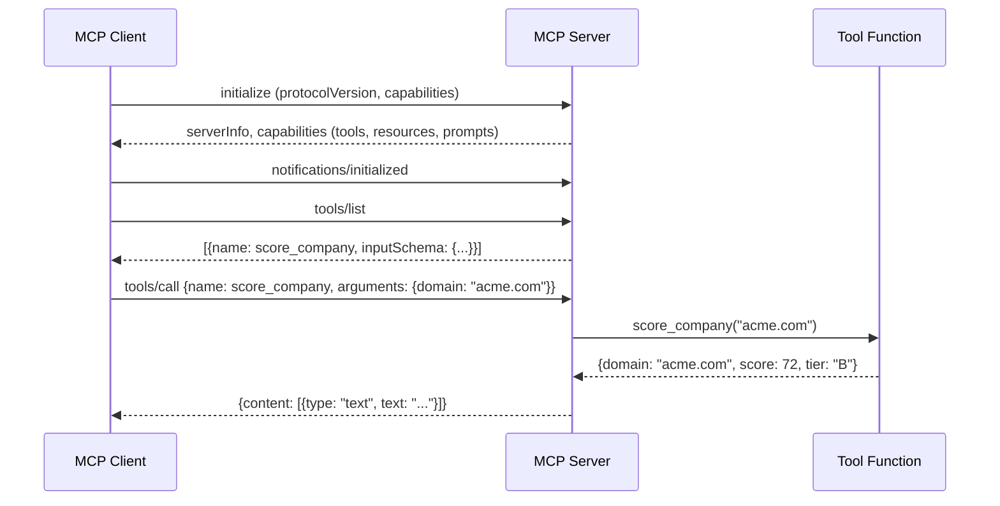

# Building an MCP Server — Python + TypeScript SDKs

## Learning Objectives

- Implement an MCP server exposing tools, resources, and prompts using the Python FastMCP SDK and the TypeScript MCP SDK.
- Trace a JSON-RPC request from client initialization through tool dispatch to the response payload returned to the model.
- Emit structured JSON-RPC error responses when tools receive malformed arguments or external API calls fail.
- Package an MCP server for distribution via uvx (Python) or npx (TypeScript) with a Claude Code Desktop configuration entry.
- Compare the Python and TypeScript SDK approaches to capability negotiation, schema declaration, and transport handling.

## The Problem

You have a lead-scoring model that takes a company domain and returns a score. Right now it lives in a script you run manually. An LLM like Claude cannot call that script mid-conversation — there is no wire between the model's function-call mechanism and your code. You could build a custom HTTP API and write a function-call wrapper, but then every agent platform needs its own integration. The Model Context Protocol solves this by defining a standard wire format: JSON-RPC 2.0 messages exchanged over stdio or HTTP, with three primitives that cover most agent-to-code interactions.

The gap is concrete. Your enrichment waterfall in Clay calls APIs sequentially — Clearbit, then Apollo, then Hunter — and returns the first hit. That waterfall is infrastructure the model cannot reach. An MCP server that exposes `lookup_company` as a tool bridges that gap: any MCP-compatible client (Claude Code Desktop, Cline, Cursor) can invoke it without a custom integration. You own the endpoint, the model owns the call.

This lesson builds a lead-scoring MCP server end-to-end. Both SDKs are covered because production GTM teams ship in both languages — Python for data-science-adjacent scoring models, TypeScript for web-platform tooling. The protocol is identical; the SDK is the only difference.

## The Concept

MCP defines three primitives. **Tools** are functions the model calls with structured arguments — your `score_company(domain)` returns a score. **Resources** are data the model reads by URI — your `icp://criteria` resource returns the scoring rubric as markdown. **Prompts** are reusable templates the client renders — an `outreach_draft` prompt takes a domain and score and returns a pre-filled instruction. A server implements any subset of these.

Underneath, the mechanism is request-response JSON-RPC 2.0. The client sends `initialize` with its protocol version and capabilities. The server responds with its own capabilities (which primitives it supports). The client sends `notifications/initialized` to confirm. From there, the client calls `tools/list` to discover schemas, `tools/call` to invoke a tool, `resources/list` and `resources/read` for data, `prompts/list` and `prompts/get` for templates. Each request has an `id`; each response echoes it. Errors return a JSON-RPC error object with a code and message.



The SDK's job is to hide the JSON-RPC plumbing. In Python, FastMCP wraps tool functions with decorators and handles serialization. In TypeScript, the `Server` class takes request handlers keyed to schema objects. Both produce the same wire protocol — pick the SDK that matches your stack, not the one that sounds better.

## Build It

### Step 1: Python Server with FastMCP

Install the Python MCP SDK:

```bash
pip install mcp
```

Create `lead_scorer_server.py`. This server exposes two tools (score and lookup), one resource (ICP criteria), and one prompt (outreach template):

```python
import hashlib
import json
from mcp.server.fastmcp import FastMCP

mcp = FastMCP("lead-scorer")


@mcp.tool()
def score_company(domain: str) -> dict:
    h = int(hashlib.md5(domain.encode()).hexdigest(), 16)
    score = h % 100
    tier = "A" if score >= 80 else "B" if score >= 50 else "C"
    return {"domain": domain, "score": score, "tier": tier}


@mcp.tool()
def lookup_company(domain: str) -> dict:
    h = int(hashlib.md5(domain.encode()).hexdigest(), 16)
    return {
        "domain": domain,
        "employees": f"{50 + (h % 200)}-{250 + (h % 200)}",
        "industry": ["Technology", "Financial Services", "Healthcare"][h % 3],
        "country": "United States",
    }


@mcp.resource("icp://criteria")
def