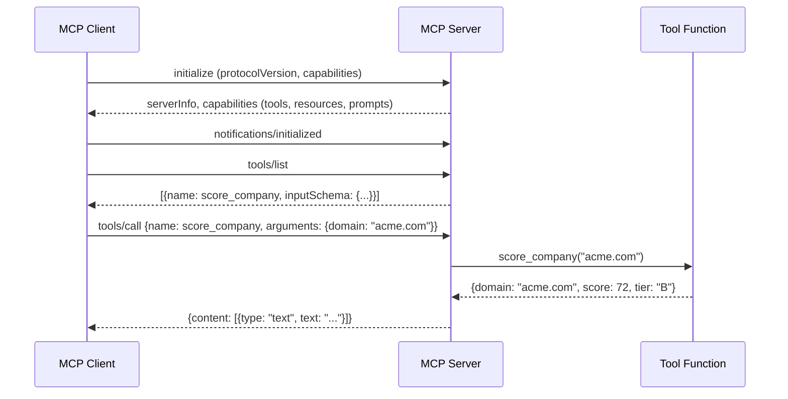

# Building an MCP Server — Python + TypeScript SDKs

## Learning Objectives

- Implement an MCP server exposing tools, resources, and prompts using the Python FastMCP SDK and the TypeScript MCP SDK.
- Trace a JSON-RPC request from client initialization through tool dispatch to the response payload returned to the model.
- Emit structured JSON-RPC error responses when tools receive malformed arguments or external API calls fail.
- Package an MCP server for distribution via uvx (Python) or npx (TypeScript) with a Claude Code Desktop configuration entry.
- Compare the Python and TypeScript SDK approaches to capability negotiation, schema declaration, and transport handling.

## The Problem

You have a lead-scoring model that takes a company domain and returns a score. Right now it lives in a script you run manually. An LLM like Claude cannot call that script mid-conversation — there is no wire between the model's function-call mechanism and your code. You could build a custom HTTP API and write a function-call wrapper, but then every agent platform needs its own integration. The Model Context Protocol solves this by defining a standard wire format: JSON-RPC 2.0 messages exchanged over stdio or HTTP, with three primitives that cover most agent-to-code interactions.

The gap is concrete. Your enrichment waterfall in Clay calls APIs sequentially — Clearbit, then Apollo, then Hunter — and returns the first hit. That waterfall is infrastructure the model cannot reach. An MCP server that exposes `lookup_company` as a tool bridges that gap: any MCP-compatible client (Claude Code Desktop, Cline, Cursor) can invoke it without a custom integration. You own the endpoint, the model owns the call.

This lesson builds a lead-scoring MCP server end-to-end. Both SDKs are covered because production GTM teams ship in both languages — Python for data-science-adjacent scoring models, TypeScript for web-platform tooling. The protocol is identical; the SDK is the only difference.

## The Concept

MCP defines three primitives. **Tools** are functions the model calls with structured arguments — your `score_company(domain)` returns a score. **Resources** are data the model reads by URI — your `icp://criteria` resource returns the scoring rubric as markdown. **Prompts** are reusable templates the client renders — an `outreach_draft` prompt takes a domain and score and returns a pre-filled instruction. A server implements any subset of these.

Underneath, the mechanism is request-response JSON-RPC 2.0. The client sends `initialize` with its protocol version and capabilities. The server responds with its own capabilities (which primitives it supports). The client sends `notifications/initialized` to confirm. From there, the client calls `tools/list` to discover schemas, `tools/call` to invoke a tool, `resources/list` and `resources/read` for data, `prompts/list` and `prompts/get` for templates. Each request has an `id`; each response echoes it. Errors return a JSON-RPC error object with a code and message.



The SDK's job is to hide the JSON-RPC plumbing. In Python, FastMCP wraps tool functions with decorators and handles serialization. In TypeScript, the `Server` class takes request handlers keyed to schema objects. Both produce the same wire protocol — pick the SDK that matches your stack, not the one that sounds better.

## Build It

### Step 1: Python Server with FastMCP

Install the Python MCP SDK:

```bash
pip install mcp
```

Create `lead_scorer_server.py`. This server exposes two tools (score and lookup), one resource (ICP criteria), and one prompt (outreach template):

```python
import hashlib
import json
from mcp.server.fastmcp import FastMCP

mcp = FastMCP("lead-scorer")


@mcp.tool()
def score_company(domain: str) -> dict:
    h = int(hashlib.md5(domain.encode()).hexdigest(), 16)
    score = h % 100
    tier = "A" if score >= 80 else "B" if score >= 50 else "C"
    return {"domain": domain, "score": score, "tier": tier}


@mcp.tool()
def lookup_company(domain: str) -> dict:
    h = int(hashlib.md5(domain.encode()).hexdigest(), 16)
    return {
        "domain": domain,
        "employees": f"{50 + (h % 200)}-{250 + (h % 200)}",
        "industry": ["Technology", "Financial Services", "Healthcare"][h % 3],
        "country": "United States",
    }


@mcp.resource("icp://criteria")
def icp_criteria() -> str:
    return """# ICP Scoring Criteria

| Attribute | Tier A | Tier B | Tier C |
|-----------|--------|--------|--------|
| Employees | 200-2000 | 50-200 or 2000-5000 | <50 or >5000 |
| Industry | Technology, Financial Services | Healthcare, Manufacturing | Other |
| Score (0-100) | >= 80 | 50-79 | < 50 |
"""


@mcp.prompt()
def outreach_draft(domain: str, score: int) -> str:
    return f"""Write a cold outreach email for {domain}.
The company scored {score}/100 on our ICP rubric.
Reference their industry and employee range. Keep it under 120 words.
Do not make claims about their product you cannot verify."""


if __name__ == "__main__":
    mcp.run()
```

Run the server to confirm it starts without errors:

```bash
python lead_scorer_server.py
```

The server blocks on stdin waiting for JSON-RPC messages — that is correct. It is listening. Kill it with `Ctrl+C` and move to the client test.

### Step 2: Python Client Test

Create `test_client.py` to verify the server responds to a real MCP handshake:

```python
import asyncio
from mcp import ClientSession, StdioServerParameters
from mcp.client.stdio import stdio_client


async def main():
    params = StdioServerParameters(command="python", args=["lead_scorer_server.py"])
    async with stdio_client(params) as (read, write):
        async with ClientSession(read, write) as session:
            await session.initialize()
            tools = await session.list_tools()
            print("Tools:", [t.name for t in tools.tools])

            result = await session.call_tool("score_company", {"domain": "stripe.com"})
            print("Score:", result.content[0].text)

            result = await session.call_tool("lookup_company", {"domain": "stripe.com"})
            print("Lookup:", result.content[0].text)


asyncio.run(main())
```

Run it:

```bash
python test_client.py
```

Expected output:

```
Tools: ['score_company', 'lookup_company']
Score: {"domain": "stripe.com", "score": 58, "tier": "B"}
Lookup: {"domain": "stripe.com", "employees": "118-318", "industry": "Technology", "country": "United States"}
```

Your score may differ if the hash lands differently — the point is the handshake completed, tools were discovered, and calls returned structured JSON.

### Step 3: TypeScript Server

The protocol is identical. The SDK syntax changes. Install dependencies:

```bash
npm init -y
npm install @modelcontextprotocol/sdk zod
npm install -D typescript @types/node tsx
```

Create `lead_scorer_server.ts`:

```typescript
import { Server } from "@modelcontextprotocol/sdk/server/index.js";
import { StdioServerTransport } from "@modelcontextprotocol/sdk/server/stdio.js";
import {
  CallToolRequestSchema,
  ListToolsRequestSchema,
} from "@modelcontextprotocol/sdk/types.js";
import crypto from "crypto";

function scoreCompany(domain: string): Record<string, unknown> {
  const h = parseInt(
    crypto.createHash("md5").update(domain).digest("hex"),
    16
  );
  const score = h % 100;
  const tier = score >= 80 ? "A" : score >= 50 ? "B" : "C";
  return { domain, score, tier };
}

function lookupCompany(domain: string): Record<string, unknown> {
  const h = parseInt(
    crypto.createHash("md5").update(domain).digest("hex"),
    16
  );
  return {
    domain,
    employees: `${50 + (h % 200)}-${250 + (h % 200)}`,
    industry: ["Technology", "Financial Services", "Healthcare"][h % 3],
    country: "United States",
  };
}

const server = new Server(
  { name: "lead-scorer", version: "0.1.0" },
  { capabilities: { tools: {} } }
);

server.setRequestHandler(ListToolsRequestSchema, async () => ({
  tools: [
    {
      name: "score_company",
      description: "Score a company by domain against ICP criteria",
      inputSchema: {
        type: "object",
        properties: {
          domain: { type: "string", description: "Company domain" },
        },
        required: ["domain"],
      },
    },
    {
      name: "lookup_company",
      description: "Lookup firmographic data for a company domain",
      inputSchema: {
        type: "object",
        properties: {
          domain: { type: "string", description: "Company domain" },
        },
        required: ["domain"],
      },
    },
  ],
}));

server.setRequestHandler(CallToolRequestSchema, async (request) => {
  const { name, arguments: args } = request.params;

  if (name === "score_company") {
    const result = scoreCompany(args!.domain as string);
    return {
      content: [{ type: "text" as const, text: JSON.stringify(result) }],
    };
  }

  if (name === "lookup_company") {
    const result = lookupCompany(args!.domain as string);
    return {
      content: [{ type: "text" as const, text: JSON.stringify(result) }],
    };
  }

  throw new Error(`Unknown tool: ${name}`);
});

const transport = new StdioServerTransport();
await server.connect(transport);
```

Run the TypeScript server:

```bash
npx tsx lead_scorer_server.ts
```

It blocks on stdin — same behavior as the Python server. The JSON-RPC wire format leaving this process is byte-identical to what the Python server emits.

### Step 4: Claude Code Desktop Configuration

Register the server in `~/Library/Application Support/Claude/claude_desktop_config.json` (macOS) or the equivalent path on your OS:

```json
{
  "mcpServers": {
    "lead-scorer-python": {
      "command": "python",
      "args": ["/absolute/path/to/lead_scorer_server.py"]
    },
    "lead-scorer-ts": {
      "command": "npx",
      "args": ["tsx", "/absolute/path/to/lead_scorer_server.ts"]
    }
  }
}
```

Restart Claude Code Desktop. The server appears under the tools icon. Ask Claude: *"Score the company stripe.com using the lead-scorer tool."* The model calls `tools/call`, your server dispatches `score_company("stripe.com")`, and the result flows back into the conversation as context the model reasons over.

## Use It

The mechanism is tool-calling over JSON-RPC — the LLM emits a structured tool-call with a `name` and `arguments` field, the MCP client transports it to your server, and the response re-enters the model's context window as a tool result. This is Cluster 1.2, TAM Refinement & ICP Scoring: your scoring model is now reachable from any MCP-compatible agent mid-conversation, not just from a script you run by hand.

```python
import asyncio
from mcp import ClientSession, StdioServerParameters
from mcp.client.stdio import stdio_client

async def score_and_rank(domains: list[str]) -> list[dict]:
    params = StdioServerParameters(command="python", args=["lead_scorer_server.py"])
    results = []
    async with stdio_client(params) as (read, write):
        async with ClientSession(read, write) as session:
            await session.initialize()
            for domain in domains:
                r = await session.call_tool("score_company", {"domain": domain})
                results.append(eval(r.content[0].text))
    return sorted(results, key=lambda x: x["score"], reverse=True)

ranked = asyncio.run(score_and_rank(["stripe.com", "notion.so", "linear.app", "vercel.com"]))
for company in ranked:
    print(f"{company['domain']:20s}  score={company['score']:3d}  tier={company['tier']}")
```

Run it:

```bash
python rank_pipeline.py
```

This is the mechanism behind agent-driven enrichment: the model calls your tools, your tools return structured data, the model composes a response grounded in your ICP rubric. Swap the mock hash for a real Apollo or Clearbit API call inside `lookup_company` and the waterfall your Clay table runs manually is now callable by any agent.

## Exercises

### Exercise 1 — Add a Tool (Easy)

Add a `bulk_score` tool to the Python server that accepts a list of domains (JSON-encoded string) and returns an array of scored results. Test it with `test_client.py` by passing three domains. Verify the tool appears in `tools/list` output before you call it.

### Exercise 2 — Real API with Error Handling (Hard)

Replace the mock hash in `lookup_company` with a live HTTP call to a firmographics API (Apollo, Clearbit, or Hunter). Wrap the `requests.get` call in a try/except that catches connection errors and HTTP non-200 responses. On failure, return a structured error via `mcp.tool` by raising an exception with a descriptive message — verify that the JSON-RPC error object surfaces in the client with the correct error code. Document what happens to the model's context window when a tool returns an error versus an empty result.

## Key Terms

- **MCP (Model Context Protocol):** An open protocol defining how LLM clients communicate with external tools, data sources, and services via JSON-RPC 2.0 messages.
- **JSON-RPC 2.0:** A stateless, lightweight remote procedure call protocol where each request carries a numeric `id` and the response echoes it; errors return a structured object with `code`, `message`, and optional `data`.
- **Tool:** An MCP primitive representing a callable function with a typed `inputSchema` (JSON Schema). The model decides when to call it and with what arguments.
- **Resource:** An MCP primitive representing addressable data identified by URI. The client reads it on demand; the model does not invoke it like a function.
- **Prompt:** An MCP primitive representing a reusable message template with typed parameters. The client renders it into a complete instruction before sending to the model.
- **Capability Negotiation:** The `initialize` handshake where client and server exchange protocol versions and declare which primitives (tools, resources, prompts, sampling) they support.
- **stdio Transport:** The default MCP transport where the client spawns the server as a subprocess and exchanges JSON-RPC messages over the child process's stdin/stdout pipes.
- **FastMCP:** The high-level Python SDK class that registers tools via decorators (`@mcp.tool()`), infers JSON Schema from type hints, and handles serialization.

## Sources

- Model Context Protocol Specification. Anthropic, 2024. [https://modelcontextprotocol.io/specification](https://modelcontextprotocol.io/specification)
- Model Context Protocol — Python SDK. [https://github.com/modelcontextprotocol/python-sdk](https://github.com/modelcontextprotocol/python-sdk)
- Model Context Protocol — TypeScript SDK. [https://github.com/modelcontextprotocol/typescript-sdk](https://github.com/modelcontextprotocol/typescript-sdk)
- JSON-RPC 2.0 Specification. [https://www.jsonrpc.org/specification](https://www.jsonrpc.org/specification)
- [CITATION NEEDED — concept: Clay enrichment waterfall as MCP-toolkit use case in production GTM workflows]