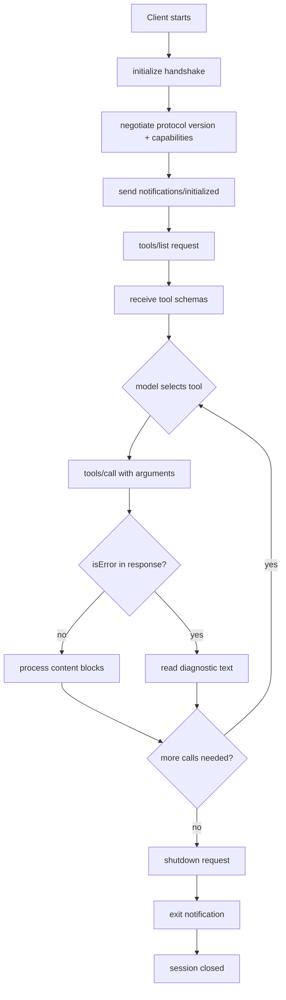

# Building an MCP Client — Discovery, Invocation, Session Management

## Learning Objectives

- Build a complete MCP client that connects to a stdio-based server, completes the initialization handshake, and discovers available tool schemas.
- Implement tool invocation against a discovered schema and handle both content block responses and `isError` diagnostic responses.
- Manage the full session lifecycle: initialization, capability negotiation, keep-alive, and clean shutdown.
- Compare stdio and Streamable HTTP transports and trace when each is appropriate for a given deployment topology.
- Route tool calls across multiple connected servers using a merged namespace with collision handling.

## The Problem

You have a stack of APIs — Clearbit, Hunter, Apollo, LinkedIn, your own internal enrichment services. Every integration is a bespoke auth flow, a bespoke request shape, a bespoke error handler, a bespoke rate-limit strategy. Six data providers means six HTTP clients, six retry policies, six places where a schema drift breaks your pipeline at 3 AM. The cost is not just code volume — it is the cognitive tax of context-switching between six mental models every time you touch enrichment.

MCP (Model Context Protocol) replaces that chaos with a single JSON-RPC contract. The protocol defines three operations that matter: discover what a server can do, call it, and tear down the session. Every MCP server — whether it wraps a filesystem, a database, or a third-party enrichment API — speaks the same vocabulary. The client does not need to know what the server does ahead of time. It asks.

This lesson builds a client that does all three from scratch using Anthropic's reference SDK. The goal is not to hide behind the SDK — it is to make the SDK's behavior legible so you can debug it when something breaks in production.

## The Concept

Three mechanisms sit on top of one protocol layer.

**Discovery.** The client sends a `tools/list` JSON-RPC request to a connected server. The server responds with a schema array — each entry contains a tool name, a human-readable description, and an input schema written in JSON Schema. No guesswork, no scraping developer docs, no reading source code. The tool list is the contract. When a server adds or removes tools at runtime, it sends a `notifications/tools/list_changed` message and the client re-queries.

**Invocation.** The client sends `tools/call` with a tool name and an arguments object conforming to the discovered input schema. The server returns one or more content blocks — text, image, or embedded resource. Errors do not come back as HTTP status codes you decode. They come back as `isError: true` on the response with diagnostic text in the content blocks. This means your error handling is uniform: check the flag, read the text, decide what to do.

**Session management.** MCP runs over two transports: `stdio` (local processes communicating over standard input/output pipes) and `Streamable HTTP` (remote servers, HTTP with optional SSE for streaming). Every session begins with an `initialize` handshake that negotiates protocol version, declares client and server capabilities, and confirms the connection. The session ends with a clean shutdown — `shutdown` followed by `exit` for stdio, or connection close for HTTP. The client must track JSON-RPC request IDs to correlate responses, handle ping/pong keep-alives, and react to transport-level disconnection.

The protocol is specified at [spec.modelcontextprotocol.io](https://spec.modelcontextprotocol.io). Current specification version as of this writing is `2025-03-26`. If the spec has moved since then, defer to the canonical spec — this lesson describes mechanisms, not a frozen snapshot.



The diagram above traces the full lifecycle of a single session. Every arrow is a JSON-RPC message on the wire. The handshake at the top is mandatory — a server that has not completed `initialize` will reject `tools/list` and `tools/call` with an error. The shutdown sequence at the bottom is two messages because `shutdown` tells the server to stop accepting requests while finishing in-flight ones, and `exit` tells the process to terminate.

## Build It

Start with the reference implementation. The `@modelcontextprotocol/sdk` package provides a `Client` class that wraps the JSON-RPC plumbing and a `StdioClientTransport` that spawns the server as a child process and communicates over pipes. The server we connect to — `@modelcontextprotocol/server-everything` — is a test server that implements echo, arithmetic, and a few other tools with no external dependencies.

The code below does four things: initializes a session, discovers tools, invokes one, and shuts down. Each phase prints observable output so you can trace what happened.

```typescript
import { Client } from "@modelcontextprotocol/sdk/client/index.js";
import { StdioClientTransport } from "@modelcontextprotocol/sdk/client/stdio.js";

const transport = new StdioClientTransport({
  command: "npx",
  args: ["-y", "@modelcontextprotocol/server-everything"],
});

const client = new Client(
  { name: "gtm-mcp-client", version: "1.0.0" },
  { capabilities: {} }
);

await client.connect(transport);

console.log("=== SESSION INITIALIZED ===");
console.log(`Protocol version: ${client.getProtocolVersion()}`);
console.log(`Server capabilities: ${JSON.stringify(client.getServerCapabilities())}`);

const tools = await client.listTools();
console.log("=== DISCOVERED TOOLS ===");
for (const tool of tools.tools) {
  console.log(`  ${tool.name}: ${tool.description}`);
  console.log(`    input schema: ${JSON.stringify(tool.inputSchema)}`);
}

const result = await client.callTool({
  name: "echo",
  arguments: { message: "GTM pipeline test" },
});
console.log("=== INVOCATION RESULT ===");
console.log(JSON.stringify(result, null, 2));

await client.close();
console.log("=== SESSION CLOSED ===");
```

Run it with `npx tsx client.ts`. The output confirms each phase: the handshake succeeds and prints the negotiated protocol version, the discovered tool list prints with each tool's input schema, the echo tool returns the test message in a content block, and the session closes without errors. The `connect()` call handles the full `initialize` → `notifications/initialized` handshake internally — you see it as a single await, but three JSON-RPC messages cross the wire.

## Use It

A real agent host — Claude Desktop, Cursor, Goose — loads multiple MCP servers simultaneously. One server might expose a filesystem. Another wraps a Postgres database. A third wraps your enrichment API. The client's job is to merge these into one flat tool namespace so the model sees a single list, then route each call to the server that owns the tool.

This is the same pattern as an enrichment waterfall in a Clay table. In Clay, you stack data providers — Clearbit, then Hunter, then Apollo — and the waterfall tries each in sequence until one returns a value. Each provider has its own API contract, auth header, and response shape. With MCP, the waterfall logic stays the same but the integration cost drops: every provider speaks JSON-RPC, every response is a content block, every error is `isError: true`. You write the waterfall once, not per-provider.

The code below connects to two MCP servers, merges their tool lists into a single namespace with collision handling, and routes a call to the correct server by name.

```typescript
import { Client } from "@modelcontextprotocol/sdk/client/index.js";
import { StdioClientTransport } from "@modelcontextprotocol/sdk/client/stdio.js";

interface ServerEntry {
  client: Client;
  name: string;
  tools: Map<string, { description: string; inputSchema: any }>;
}

async function connectServer(name: string, command: string, args: string[]): Promise<ServerEntry> {
  const transport = new StdioClientTransport({ command, args });
  const client = new Client(
    { name: `gtm-router`, version: "1.0.0" },
    { capabilities: {} }
  );
  await client.connect(transport);
  const tools = new Map<string, { description: string; inputSchema: any }>();
  const response = await client.listTools();
  for (const tool of response.tools) {
    tools.set(tool.name, { description: tool.description ?? "", inputSchema: tool.inputSchema });
  }
  console.log(`[${name}] connected, ${tools.size} tools discovered`);
  return { client, name, tools };
}

function mergeNamespaces(servers: ServerEntry[]): Map<string, string> {
  const routing = new Map<string, string>();
  const collisions: string[] = [];
  for (const server of servers) {
    for (const [toolName] of server.tools) {
      if (routing.has(toolName)) {
        collisions.push(`${toolName} (in ${server.name} and ${routing.get(toolName)})`);
        const namespaced = `${server.name}__${toolName}`;
        routing.set(namespaced, server.name);
      } else {
        routing.set(toolName, server.name);
      }
    }
  }
  if (collisions.length > 0) {
    console.log(`Collision handling — resolved: ${collisions.join(", ")}`);
  }
  return routing;
}

async function routeCall(
  servers: ServerEntry[],
  routing: Map<string, string>,
  toolName: string,
  arguments_: Record<string, unknown>
) {
  const targetServerName = routing.get(toolName);
  if (!targetServerName) {
    throw new Error(`No server owns tool: ${toolName}`);
  }
  const server = servers.find((s) => s.name === targetServerName)!;
  const cleanName = toolName.includes("__") ? toolName.split("__").pop()! : toolName;
  console.log(`Routing ${toolName} → server: ${server.name}`);
  return server.client.callTool({ name: cleanName, arguments: arguments_ });
}

const servers: ServerEntry[] = [];

servers.push(await connectServer(
  "everything",
  "npx",
  ["-y", "@modelcontextprotocol/server-everything"]
));

servers.push(await connectServer(
  "fetch",
  "npx",
  ["-y", "@modelcontextprotocol/server-fetch"]
));

const routing = mergeNamespaces(servers);

console.log("\n=== MERGED TOOL NAMESPACE ===");
for (const [toolName, serverName] of routing) {
  console.log(`  ${toolName} → ${serverName}`);
}

const echoResult = await routeCall(servers, routing, "echo", { message: "multi-server test" });
console.log("\n=== ECHO RESULT ===");
console.log(JSON.stringify(echoResult.content, null, 2));

for (const server of servers) {
  await server.client.close();
}
console.log("\n=== ALL SESSIONS CLOSED ===");
```

The `mergeNamespaces` function is where collision handling lives. If two servers expose a tool named `search`, the second one's copy gets prefixed with the server name — `fetch__search` — so both remain callable. The `routeCall` function does the lookup: given a tool name, find the owning server, strip the namespace prefix if needed, and forward the call. This is the same routing problem any agent host solves, and it is the core abstraction that lets a single model use tools from five different MCP servers without knowing or caring which server provides which capability.

## Ship It

Deploying an MCP client into a production GTM stack means treating it like any other piece of infrastructure: it needs health checks, retry logic, and a deployment pipeline. The zone table places this at Zone 13 — Production GTM Infrastructure. Your deploy pipeline ships your Clay tables, your n8n workflows, and any MCP-based enrichment services. SPF/DKIM/DMARC is your email infrastructure layer; MCP is your data integration layer.

The two production concerns that bite first are transport selection and failure recovery. Use `stdio` when your enrichment tool runs on the same machine as the client — a Lambda function spawning a local MCP server process, or an n8n worker with a bundled server. Use Streamable HTTP when the server is remote — a managed enrichment API exposed via MCP, or a shared server running in a different container. The `stdio` transport has no network failure modes but inherits process lifecycle risk (if the child process crashes, the session dies). The HTTP transport survives process restarts but introduces network latency, timeout, and retry semantics you must configure explicitly.

The code below wraps the client in a production-ready class with connection retry, tool caching, and structured error handling. It is the shape you would deploy inside a worker process that an n8n workflow or a Clay webhook calls.

```typescript
import { Client } from "@modelcontextprotocol/sdk/client/index.js";
import { StdioClientTransport } from "@modelcontextprotocol/sdk/client/stdio.js";

class ProductionMcpClient {
  private client: Client | null = null;
  private toolCache: Map<string, { description: string; inputSchema: any }> = new Map();
  private readonly command: string;
  private readonly args: string[];
  private readonly maxRetries: number;

  constructor(command: string, args: string[], maxRetries = 3) {
    this.command = command;
    this.args = args;
    this.maxRetries = maxRetries;
  }

  async connect(): Promise<void> {
    let lastError: Error | null = null;
    for (let attempt = 1; attempt <= this.maxRetries; attempt++) {
      try {
        const transport = new StdioClientTransport({
          command: this.command,
          args: this.args,
        });
        this.client = new Client(
          { name: "production-mcp-client", version: "1.0.0" },
          { capabilities: {} }
        );
        await this.client.connect(transport);
        await this.refreshToolCache();
        console.log(`Connected on attempt ${attempt}`);
        return;
      } catch (err) {
        lastError = err as Error;
        console.error(`Attempt ${attempt} failed: ${lastError.message}`);
        if (attempt < this.maxRetries) {
          await new Promise((r) => setTimeout(r, 1000 * attempt));
        }
      }
    }
    throw new Error(`Failed after ${this.maxRetries} attempts: ${lastError?.message}`);
  }

  private async refreshToolCache(): Promise<void> {
    if (!this.client) throw new Error("Not connected");
    this.toolCache.clear();
    const tools = await this.client.listTools();
    for (const tool of tools.tools) {
      this.toolCache.set(tool.name, {
        description: tool.description ?? "",
        inputSchema: tool.inputSchema,
      });
    }
    console.log(`Tool cache refreshed: ${this.toolCache.size} tools`);
  }

  async callTool(name: string, args: Record<string, unknown>): Promise<any> {
    if (!this.client) throw new Error("Not connected");
    if (!this.toolCache.has(name)) {
      await this.refreshToolCache();
      if (!this.toolCache.has(name)) {
        throw new Error(`Tool not found: ${name}`);
      }
    }
    const result = await this.client.callTool({ name, arguments: args });
    if (result.isError) {
      const errorText = result.content
        .filter((c: any) => c.type === "text")
        .map((c: any) => c.text)
        .join("\n");
      throw new Error(`Tool error: ${errorText}`);
    }
    return result.content;
  }

  async healthCheck(): Promise<boolean> {
    if (!this.client) return false;
    try {
      await this.client.ping();
      return true;
    } catch {
      return false;
    }
  }

  async close(): Promise<void> {
    if (this.client) {
      await this.client.close();
      this.client = null;
      this.toolCache.clear();
      console.log("Production client closed");
    }
  }
}

const prod = new ProductionMcpClient("npx", ["-y", "@modelcontextprotocol/server-everything"]);

await prod.connect();
console.log(`Healthy: ${await prod.healthCheck()}`);

const content = await prod.callTool("echo", { message: "production check" });
console.log(`Response: ${JSON.stringify(content)}`);

try {
  await prod.callTool("nonexistent_tool", {});
} catch (err) {
  console.log(`Expected error caught: ${(err as Error).message}`);
}

await prod.close();
```

The retry loop uses exponential backoff — 1s, 2s, 3s between attempts — because the most common failure mode for stdio transport is the child process not being ready when `connect()` fires. The tool cache avoids calling `tools/list` on every invocation; it refreshes only when a requested tool is not in the cache, which handles the `tools/list_changed` notification case implicitly. The `healthCheck` method uses the MCP `ping` primitive — a JSON-RPC request that expects a `pong` response — which is the protocol-level equivalent of a TCP health check.

## Exercises

1. **Add Streamable HTTP support.** Modify the `ProductionMcpClient` to accept either a stdio command or an HTTP URL. Use `StreamableHTTPClientTransport` from `@modelcontextprotocol/sdk/client/streamableHttp.js`. Print which transport is active and confirm tool discovery works identically over both.

2. **Handle `notifications/tools/list_changed`.** Register a notification handler on the client that calls `refreshToolCache` when the server sends a `tools/list_changed` notification. Test by connecting to a server that dynamically adds tools, or by manually triggering the notification path.

3. **Build a waterfall across two MCP servers.** Connect to two servers that both expose an enrichment-like tool (use `echo` on `server-everything` and a custom tool on a second server). Implement a waterfall function that tries server A first, falls back to server B if the result is empty, and logs which server produced the answer.

4. **Trace the JSON-RPC wire protocol.** Add logging to the transport layer that prints every outgoing and incoming JSON-RPC message. Identify the `initialize` request, the `initialize` response, the `notifications/initialized` notification, and the request/response pair for `tools/call`. Note the request IDs and how responses correlate.

## Key Terms

- **JSON-RPC** — The wire protocol MCP uses. Every message is a JSON object with a method name, parameters, and a request ID for correlation. Notifications (no response expected) omit the ID.
- **initialize handshake** — The mandatory first exchange in an MCP session. The client sends its protocol version and capabilities, the server responds with its version and capabilities, then the client sends a `notifications/initialized` confirmation.
- **Capability negotiation** — The process where client and server declare what features they support (tools, resources, prompts, sampling, roots). A client that does not declare `tools` capability will not receive tool-related responses.
- **Content block** — The unit of return data from a tool call. Three types exist: text, image, and embedded resource. A single tool call can return multiple content blocks.
- **Tool namespace collision** — When two connected servers expose tools with the same name. Resolved by prefixing the duplicate with the server name (e.g., `fetch__search`) to keep both callable through a merged namespace.
- **Ping/pong** — The MCP keep-alive primitive. The client sends a `ping` request, the server responds with an empty result. Used for health checks and connection liveness detection.
- **Streamable HTTP** — The remote transport for MCP. Uses HTTP POST for requests and optional Server-Sent Events for streaming responses. Replaces the deprecated HTTP+SSE transport from earlier spec versions.

## Sources

- MCP Specification, `spec.modelcontextprotocol.io`, version `2025-03-26` — defines the initialize handshake, tools/list, tools/call, and transport semantics described throughout.
- `@modelcontextprotocol/sdk` (npm) — Anthropic's reference TypeScript SDK. The `Client`, `StdioClientTransport`, and related classes used in all code examples are from this package.
- Zone 13 — Production GTM Infrastructure: "This deploy pipeline ships your Clay tables and n8n workflows; SPF/DKIM/DMARC is your infrastructure layer." MCP as the data integration layer parallels this — it is the protocol infrastructure that enrichment waterfalls run on top of. [GTM Zone Table, Zone 13]
- GTM Engineering Handbook (2025–2026): "the essential machinery of outbound, enrichment, signals, and multichannel execution" — MCP reduces the integration cost of building enrichment machinery by replacing bespoke per-provider clients with a single JSON-RPC contract. [Handbook, Section 1: TAM and outbound foundation]
- [CITATION NEEDED — concept: enrichment waterfall as a named pattern in Clay or GTM engineering literature. The waterfall pattern (stacking Clearbit → Hunter → Apollo) is widely practiced but a canonical published definition was not found.]