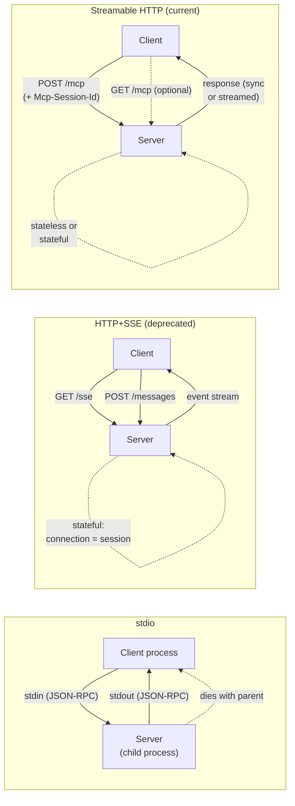

# MCP Transports — stdio vs Streamable HTTP vs SSE Migration

## Learning Objectives

- Compare stdio, HTTP+SSE, and Streamable HTTP transports by connection model, statefulness, and deployment constraints
- Implement a Streamable HTTP MCP server endpoint that handles POST-based JSON-RPC with session management
- Configure stdio transport for local MCP server subprocess deployment
- Trace the migration path from legacy HTTP+SSE to Streamable HTTP, identifying each component that changes
- Evaluate transport selection for GTM tooling deployments based on network topology and client requirements

## The Problem

You built an MCP server that wraps your company enrichment API. It works on your laptop. You deploy it to a remote host and your agent can't reach it. The reason is almost always the transport layer — you picked stdio for something that needed to run over the network, or you picked a network transport for something that only runs locally.

MCP defines three transport mechanisms. stdio spawns the server as a child process and exchanges JSON-RPC over stdin/stdout — it works when client and server share a process tree and nowhere else. The original remote transport, HTTP+SSE, used two HTTP connections per session: a GET for the server-to-client event stream and a POST for client-to-server messages. The 2025-03-26 spec revision replaced it with Streamable HTTP, which collapses everything to a single POST endpoint with optional streaming responses. HTTP+SSE is now deprecated, with major providers removing support through 2026.

Picking the wrong transport costs a migration. The SSE-to-Streamable-HTTP migration involves dropping an endpoint, changing session management from implicit to explicit, and rewriting client connection logic. Understanding why each transport exists and where each one fits prevents that cost.

## The Concept

### stdio Transport

The client spawns the server as a child process. Messages are newline-delimited JSON-RPC written to the server's stdin and read from its stdout. The server's lifecycle is tied to the parent — when the client process exits, the server exits with it. No network stack is involved. No ports are opened. This is the transport Claude Desktop, VS Code, and every IDE-based MCP client use, because the server runs as a local subprocess with no exposure to the network.

The constraint is fundamental: stdio requires shared filesystem and process-spawning capability. You cannot connect to a stdio server over the network. You cannot run it in a container that a remote client reaches. If your deployment needs remote access, stdio is the wrong choice and no amount of configuration changes that.

### HTTP+SSE Transport (Legacy, Deprecated)

The 2025-03-26 spec revision defines this transport as superseded. The mechanism: the client opens a GET request to an SSE endpoint (typically `/sse`). The server holds that connection open and sends an `endpoint` event containing a URL for POST messages. The client then opens a second connection — POST to that URL — for every JSON-RPC request. Server responses come back over the SSE stream, not the POST response.

This two-connection model is stateful by design. The server must maintain connection state: which SSE stream maps to which session, which POSTs belong to which client. If the SSE connection drops, the session is lost. Some CDNs cache the SSE endpoint incorrectly. Some WAFs terminate long-lived connections aggressively. The protocol worked, but every deployment encountered the same set of operational problems.

### Streamable HTTP Transport (Current)

The 2025-03-26 spec replaced HTTP+SSE with a single-endpoint model. The client POSTs JSON-RPC messages to a single endpoint (typically `/mcp`). The server responds in one of two ways: a synchronous JSON response in the POST body, or a streamed response using chunked transfer encoding with optional SSE framing for multi-message sequences.

Session management moved from implicit (the SSE connection *is* the session) to explicit (the `Mcp-Session-Id` header identifies the session). The server can operate statelessly — processing each POST independently without session affinity — or statefully by tracking the session ID. A client that wants to receive server-initiated notifications can optionally open a GET to the same endpoint, which the server may upgrade to an SSE stream. But this is optional. The core protocol works with POST alone.



### Migration: SSE to Streamable HTTP

The migration touches four things. First, the server drops the dedicated GET `/sse` endpoint — no more event-stream handshake. Second, the client stops subscribing to an event stream and instead reads responses directly from POST. Third, session management moves from the connection itself to the `Mcp-Session-Id` header, which the server returns in the initialize response and the client includes in subsequent requests. Fourth, the server can optionally support stateless operation, which was impossible under SSE because the connection *was* the state.

The client side changes too. Under SSE, the client needed two HTTP connections open simultaneously — one read-only, one write-only. Under Streamable HTTP, the client makes a POST and reads the response. If it wants streaming, it reads the response body incrementally. One request, one response, one connection. The mental model shifts from "maintain a persistent channel" to "make HTTP requests."

## Build It

### stdio Server

This server reads JSON-RPC from stdin, processes requests, and writes responses to stdout. Logging goes to stderr so stdout stays clean for protocol messages.

```python
import sys
import json

def make_response(msg_id, result):
    return {"jsonrpc": "2.0", "id": msg_id, "result": result}

def handle(msg):
    method = msg.get("method")
    msg_id = msg.get("id")
    
    if method == "initialize":
        return make_response(msg_id, {
            "protocolVersion": "2025-03-26",
            "serverInfo": {"name": "enrichment-stdio", "version": "1.