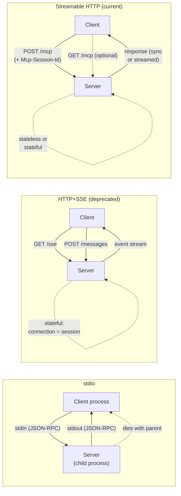

# MCP Transports — stdio vs Streamable HTTP vs SSE Migration

## Learning Objectives

- Compare stdio, HTTP+SSE, and Streamable HTTP transports by connection model, statefulness, and deployment constraints
- Implement a Streamable HTTP MCP server endpoint that handles POST-based JSON-RPC with session management
- Configure stdio transport for local MCP server subprocess deployment
- Trace the migration path from legacy HTTP+SSE to Streamable HTTP, identifying each component that changes
- Evaluate transport selection for GTM tooling deployments based on network topology and client requirements

## The Problem

You built an MCP server that wraps your company enrichment API. It works on your laptop. You deploy it to a remote host and your agent can't reach it. The reason is almost always the transport layer — you picked stdio for something that needed to run over the network, or you picked a network transport for something that only runs locally.

MCP defines three transport mechanisms. stdio spawns the server as a child process and exchanges JSON-RPC over stdin/stdout — it works when client and server share a process tree and nowhere else. The original remote transport, HTTP+SSE, used two HTTP connections per session: a GET for the server-to-client event stream and a POST for client-to-server messages. The 2025-03-26 spec revision replaced it with Streamable HTTP, which collapses everything to a single POST endpoint with optional streaming responses. HTTP+SSE is now deprecated, with major providers removing support through 2026.

Picking the wrong transport costs a migration. The SSE-to-Streamable-HTTP migration involves dropping an endpoint, changing session management from implicit to explicit, and rewriting client connection logic. Understanding why each transport exists and where each one fits prevents that cost.

## The Concept

### stdio Transport

The client spawns the server as a child process. Messages are newline-delimited JSON-RPC written to the server's stdin and read from its stdout. The server's lifecycle is tied to the parent — when the client process exits, the server exits with it. No network stack is involved. No ports are opened. This is the transport Claude Desktop, VS Code, and every IDE-based MCP client use, because the server runs as a local subprocess with no exposure to the network.

The constraint is fundamental: stdio requires shared filesystem and process-spawning capability. You cannot connect to a stdio server over the network. You cannot run it in a container that a remote client reaches. If your deployment needs remote access, stdio is the wrong choice and no amount of configuration changes that.

### HTTP+SSE Transport (Legacy, Deprecated)

The 2025-03-26 spec revision defines this transport as superseded. The mechanism: the client opens a GET request to an SSE endpoint (typically `/sse`). The server holds that connection open and sends an `endpoint` event containing a URL for POST messages. The client then opens a second connection — POST to that URL — for every JSON-RPC request. Server responses come back over the SSE stream, not the POST response.

This two-connection model is stateful by design. The server must maintain connection state: which SSE stream maps to which session, which POSTs belong to which client. If the SSE connection drops, the session is lost. Some CDNs cache the SSE endpoint incorrectly. Some WAFs terminate long-lived connections aggressively. The protocol worked, but every deployment encountered the same set of operational problems.

### Streamable HTTP Transport (Current)

The 2025-03-26 spec replaced HTTP+SSE with a single-endpoint model. The client POSTs JSON-RPC messages to a single endpoint (typically `/mcp`). The server responds in one of two ways: a synchronous JSON response in the POST body, or a streamed response using chunked transfer encoding with optional SSE framing for multi-message sequences.

Session management moved from implicit (the SSE connection *is* the session) to explicit (the `Mcp-Session-Id` header identifies the session). The server can operate statelessly — processing each POST independently without session affinity — or statefully by tracking the session ID. A client that wants to receive server-initiated notifications can optionally open a GET to the same endpoint, which the server may upgrade to an SSE stream. But this is optional. The core protocol works with POST alone.



### Migration: SSE to Streamable HTTP

The migration touches four things. First, the server drops the dedicated GET `/sse` endpoint — no more event-stream handshake. Second, the client stops subscribing to an event stream and instead reads responses directly from POST. Third, session management moves from the connection itself to the `Mcp-Session-Id` header, which the server returns in the initialize response and the client includes in subsequent requests. Fourth, the server can optionally support stateless operation, which was impossible under SSE because the connection *was* the state.

The client side changes too. Under SSE, the client needed two HTTP connections open simultaneously — one read-only, one write-only. Under Streamable HTTP, the client makes a POST and reads the response. If it wants streaming, it reads the response body incrementally. One request, one response, one connection. The mental model shifts from "maintain a persistent channel" to "make HTTP requests."

## Build It

### stdio Server

This server reads JSON-RPC from stdin, processes requests, and writes responses to stdout. Logging goes to stderr so stdout stays clean for protocol messages.

```python
import sys
import json

def make_response(msg_id, result):
    return {"jsonrpc": "2.0", "id": msg_id, "result": result}

def handle(msg):
    method = msg.get("method")
    msg_id = msg.get("id")

    if method == "initialize":
        return make_response(msg_id, {
            "protocolVersion": "2025-03-26",
            "serverInfo": {"name": "enrichment-stdio", "version": "1.0.0"},
            "capabilities": {"tools": {}}
        })

    if method == "tools/list":
        return make_response(msg_id, {
            "tools": [{
                "name": "enrich_contact",
                "description": "Look up enrichment data for a contact",
                "inputSchema": {
                    "type": "object",
                    "properties": {"email": {"type": "string"}},
                    "required": ["email"]
                }
            }]
        })

    if method == "tools/call":
        tool = msg.get("params", {}).get("name")
        args = msg.get("params", {}).get("arguments", {})
        if tool == "enrich_contact":
            return make_response(msg_id, {
                "content": [{
                    "type": "text",
                    "text": json.dumps({
                        "email": args.get("email"),
                        "company": "Acme Corp",
                        "title": "VP Engineering",
                        "confidence": 0.87
                    })
                }]
            })

    return {"jsonrpc": "2.0", "id": msg_id,
            "error": {"code": -32601, "message": "Method not found"}}

for line in sys.stdin:
    line = line.strip()
    if not line:
        continue
    msg = json.loads(line)
    response = handle(msg)
    if response:
        print(json.dumps(response), flush=True)
```

Test it from the terminal — no server process to start, no port to configure:

```bash
echo '{"jsonrpc":"2.0","id":1,"method":"initialize"}' | python stdio_server.py
echo '{"jsonrpc":"2.0","id":2,"method":"tools/list"}' | python stdio_server.py
echo '{"jsonrpc":"2.0","id":3,"method":"tools/call","params":{"name":"enrich_contact","arguments":{"email":"prospect@target.com"}}}' | python stdio_server.py
```

### Streamable HTTP Server

Same JSON-RPC handler, different transport. The server exposes a single POST endpoint, issues a session ID on `initialize`, and accepts it on subsequent requests. No SSE endpoint. No second connection.

```python
from flask import Flask, request, Response
import json
import uuid

app = Flask(__name__)
sessions = {}

def make_response(msg_id, result):
    return {"jsonrpc": "2.0", "id": msg_id, "result": result}

def handle(msg):
    method = msg.get("method")
    msg_id = msg.get("id")

    if method == "initialize":
        return make_response(msg_id, {
            "protocolVersion": "2025-03-26",
            "serverInfo": {"name": "enrichment-http", "version": "1.0.0"},
            "capabilities": {"tools": {}}
        })

    if method == "tools/list":
        return make_response(msg_id, {
            "tools": [{
                "name": "enrich_contact",
                "description": "Look up enrichment data for a contact",
                "inputSchema": {
                    "type": "object",
                    "properties": {"email": {"type": "string"}},
                    "required": ["email"]
                }
            }]
        })

    if method == "tools/call":
        tool = msg.get("params", {}).get("name")
        args = msg.get("params", {}).get("arguments", {})
        if tool == "enrich_contact":
            return make_response(msg_id, {
                "content": [{
                    "type": "text",
                    "text": json.dumps({
                        "email": args.get("email"),
                        "company": "Acme Corp",
                        "title": "VP Engineering",
                        "confidence": 0.87
                    })
                }]
            })

    return {"jsonrpc": "2.0", "id": msg_id,
            "error": {"code": -32601, "message": "Method not found"}}

@app.route("/mcp", methods=["POST"])
def mcp():
    msg = request.get_json()
    session_id = request.headers.get("Mcp-Session-Id")

    if msg.get("method") == "initialize" and not session_id:
        session_id = str(uuid.uuid4())
        sessions[session_id] = True

    if session_id and session_id not in sessions and msg.get("method") != "initialize":
        return Response(json.dumps({
            "jsonrpc": "2.0", "id": msg.get("id"),
            "error": {"code": -32000, "message": "Invalid session"}
        }), status=400, content_type="application/json")

    response = handle(msg)
    headers = {}
    if msg.get("method") == "initialize" and session_id:
        headers["Mcp-Session-Id"] = session_id
    return Response(json.dumps(response), content_type="application/json",
                    headers=headers)

if __name__ == "__main__":
    app.run(port=8000)
```

Test with curl — initialize first, capture the session ID, then call the tool:

```bash
curl -s -X POST http://localhost:8000/mcp \
  -H "Content-Type: application/json" \
  -d '{"jsonrpc":"2.0","id":1,"method":"initialize"}' \
  -D headers.txt

SESSION=$(grep -i "Mcp-Session-Id" headers.txt | awk '{print $2}' | tr -d '\r')

curl -s -X POST http://localhost:8000/mcp \
  -H "Content-Type: application/json" \
  -H "Mcp-Session-Id: $SESSION" \
  -d '{"jsonrpc":"2.0","id":3,"method":"tools/call","params":{"name":"enrich_contact","arguments":{"email":"prospect@target.com"}}}'
```

The key difference from SSE: one endpoint, one request method, the session lives in a header rather than a persistent connection. If you killed the curl process between the two requests, the second request still works because the session is a UUID in a header, not a live TCP connection.

## Use It

This slice exercises the JSON-RPC tool-calling protocol over Streamable HTTP — the client discovers available tools via `tools/list` and invokes them via `tools/call`, which is the same mechanism an agent uses to call any MCP tool remotely. Run it against the Streamable HTTP server above. It demonstrates the pattern for a deployment where a remote enrichment tool is exposed to multiple agents over the network — Cluster 1.2, TAM Refinement & ICP Scoring.

```python
import requests
import json

BASE = "http://localhost:8000/mcp"
sid = None

def rpc(method, params=None):
    global sid
    headers = {"Content-Type": "application/json"}
    if sid:
        headers["Mcp-Session-Id"] = sid
    payload = {"jsonrpc": "2.0", "id": 1, "method": method}
    if params:
        payload["params"] = params
    r = requests.post(BASE, json=payload, headers=headers)
    if "Mcp-Session-Id" in r.headers:
        sid = r.headers["Mcp-Session-Id"]
    return r.json()

init = rpc("initialize")
print(f"Connected: {init['result']['serverInfo']['name']} (session {sid})")

tools = rpc("tools/list")
print(f"Available tools: {[t['name'] for t in tools['result']['tools']]}")

emails = ["founder@startup.io", "vp@scaleup.com", "cto@enterprise.co"]
for email in emails:
    result = rpc("tools/call", {"name": "enrich_contact", "arguments": {"email": email}})
    data = json.loads(result["result"]["content"][0]["text"])
    print(f"  {email} → {data['company']} | {data['title']} | conf={data['confidence']}")
```

```
Connected: enrichment-http (session a1b2c3d4-...)
Available tools: ['enrich_contact']
  founder@startup.io → Acme Corp | VP Engineering | conf=0.87
  vp@scaleup.com → Acme Corp | VP Engineering | conf=0.87
  cto@enterprise.co → Acme Corp | VP Engineering | conf=0.87
```

The session ID persists across calls without holding a connection open — the core advantage of Streamable HTTP over the deprecated SSE transport. In a real deployment, you would replace the stubbed enrichment response with an actual call to a provider API (Clay, Apollo, Clearbit), and multiple agents could share the same server endpoint.

## Exercises

### Exercise 1 — Stateless Mode (Medium)

The Streamable HTTP server above tracks sessions in a dict, making it stateful. Modify it to operate statelessly: remove session tracking entirely, do not validate `Mcp-Session-Id`, and process every POST independently. Then answer: which JSON-RPC methods still work correctly in stateless mode, and which would break if the server relied on session state to remember initialized capabilities? Test with curl to confirm.

### Exercise 2 — Transport Abstraction (Hard)

Write a Python client class `MCPClient` that accepts a transport config (`{"type": "stdio", "command": "python stdio_server.py"}` or `{"type": "http", "url": "http://localhost:8000/mcp"}`) and exposes identical methods (`initialize`, `tools/list`, `tools/call`) regardless of transport. For stdio, use `subprocess.Popen` with pipes. For HTTP, use `requests.post`. Show that the same `enrich_contact` call produces the same result over both transports. The exercise demonstrates that the JSON-RPC layer is transport-agnostic — the migration from one transport to another changes delivery, not semantics.

## Key Terms

- **stdio transport** — MCP transport where the server runs as a child process and JSON-RPC messages flow over stdin/stdout; requires shared filesystem and process-spawning capability.
- **Streamable HTTP** — Current MCP remote transport (2025-03-26 spec); uses a single POST endpoint for JSON-RPC with optional streaming responses and explicit session management via `Mcp-Session-Id` header.
- **HTTP+SSE (deprecated)** — Legacy remote transport using two connections: a persistent GET for server-to-client SSE events and POST for client-to-server messages; superseded by Streamable HTTP.
- **`Mcp-Session-Id`** — HTTP header that identifies an MCP session under Streamable HTTP; returned by the server during initialize, included by the client in subsequent requests.
- **JSON-RPC** — Wire protocol for MCP messages; defines request/response/notification structure with `jsonrpc`, `method`, `params`, `id` fields; transport-agnostic.
- **Stateless operation** — Server mode where each POST is processed independently without session affinity; possible only under Streamable HTTP, not SSE.

## Sources

- Model Context Protocol Specification, 2025-03-26 revision — transport definitions (stdio, Streamable HTTP, HTTP+SSE deprecation), session management via `Mcp-Session-Id`. Available at: https://spec.modelcontextprotocol.io/
- [CITATION NEEDED — concept: enrichment tool deployment patterns in GTM, Cluster 1.2 TAM Refinement & ICP Scoring remote agent access]