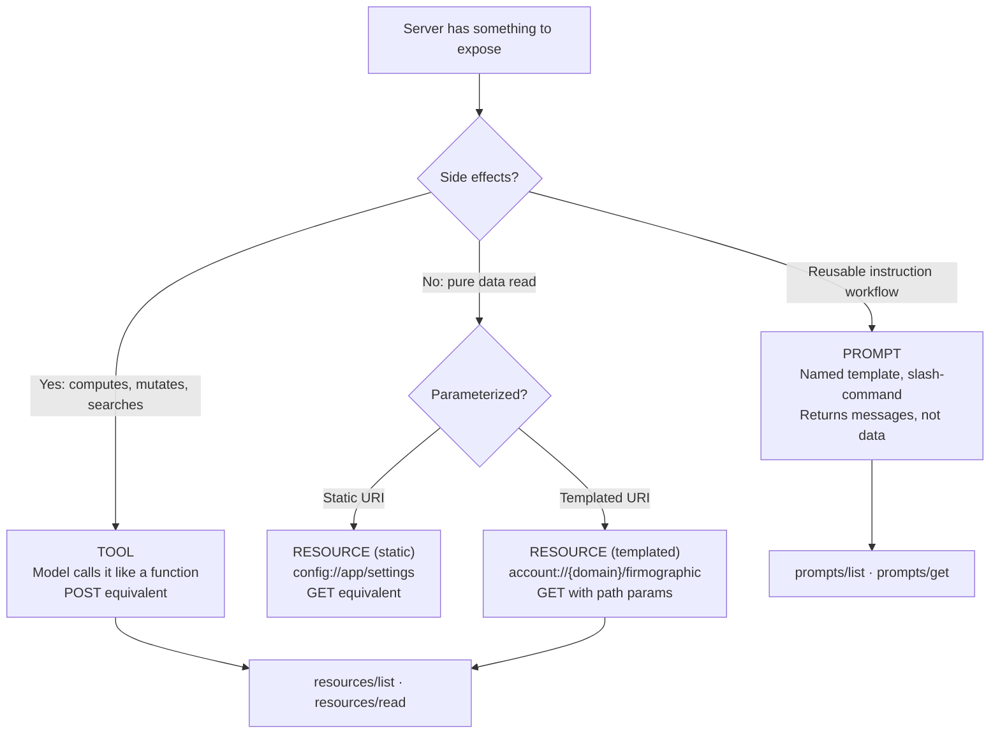

# MCP Resources and Prompts — Context Exposure Beyond Tools

## Learning Objectives

- Decide whether to expose a capability as a tool, a resource, or a prompt based on the access pattern and side-effect profile.
- Implement `resources/list`, `resources/read`, and `prompts/list`, `prompts/get` handlers in a Python MCP server.
- Configure `claude_desktop_config.json` to mount a server exposing both resources and prompts, then verify both primitives from a live session.
- Compare resource subscription (push) against tool polling (pull) by measuring round-trip timing for a state-changing data source.

## The Problem

MCP servers have three primitives, but most implementations expose everything as tools. A notes-app server defines `notes_read`, `notes_list`, and `notes_search` — each a tool. This wraps every read operation in a model-initiated function call, which means the model must *decide* to call `notes_read` for any query that might benefit from context. That decision burns tokens, adds latency, and creates a failure mode: the model might not call the tool at all, leaving context unattached.

The second consequence is worse. Client UIs like Claude Desktop's resource picker and Cursor's context panel are built to surface MCP resources — not tools. When you expose data as a tool, the client cannot list it in the picker, cannot let the user attach it with a checkbox, and cannot subscribe to live updates. The data is invisible to the UI layer that exists specifically to present it. You have built a read endpoint that no read-side client can discover.

The third issue is workflow reuse. When a user types the same multi-step research prompt into Claude Desktop every morning, that workflow lives nowhere — not on the server, not in a shared config, not in version control. Every teammate re-derives it. Prompts solve this: the server exposes a named template with typed parameters, the client discovers it as a slash-command, and the workflow becomes reproducible. Without prompts, your server's logic is limited to "what should happen" (tools) with no answer to "how should the user interact with what happened."

[CITATION NEEDED — concept: MCP specification canonical reference for resources and prompts primitives]

## The Concept

The three MCP primitives map to three HTTP verbs you already know. Tools are POST — they execute, they compute, they mutate state. Resources are GET — they return data identified by a URI, they are read-only, they have no side effects. Prompts are templates — they return a structured set of messages (user/assistant turns) that frame a task for the LLM. The distinction is not aesthetic. Each primitive has a different client-side affordance, a different access pattern, and a different discovery mechanism.

Resources are identified by URIs. A static resource has a fixed URI like `config://app/settings`. A templated resource has a URI with parameters like `account://{domain}/firmographic`. The client lists available resources via `resources/list`, reads content via `resources/read`, and optionally subscribes to updates via `resources/subscribe` with the server pushing `notifications/resources/updated`. The host UI (Claude Desktop's paperclip panel) renders discovered resources as attachable context items — checkboxes the user clicks to include data in the next message.

Prompts are named, parameterized templates. The server exposes them via `prompts/list` (returns names, descriptions, and argument schemas) and `prompts/get` (returns a list of messages — `user` and `assistant` turns with content blocks). The host surfaces discovered prompts as slash-commands: `/research-account domain=acme.com`. The server does not execute the prompt — it returns the text, and the LLM interprets it. This makes prompts portable across clients and version-controllable on the server.



The decision rule, distilled: if the user wants the host to *attach* data as context, expose a resource. If the user wants the model to *decide whether* to fetch something (search, filter, compute), expose a tool. If the user wants a *repeatable workflow* with typed arguments, expose a prompt. Most servers get this wrong by defaulting to tools for everything — the fix is to audit each capability and reclassify.

## Build It

### Step 1: Server with one resource and one prompt

The following server exposes a templated resource (`account://{domain}/firmographic`) backed by mock firmographic data, and a prompt (`research-account`) that accepts a domain and returns a structured research brief. Save this as `gtm_enrichment_server.py`:

```python
from mcp.server.fastmcp import FastMCP

mcp = FastMCP("gtm-enrichment")

ACCOUNT_DATA = {
    "acme.com": {
        "company": "Acme Corp",
        "employees": 250,
        "arr_est": "$5M",
        "tech_stack": ["Salesforce", "HubSpot", "Segment", "Slack"],
        "icp_fit": "strong",
    },
    "globex.com": {
        "company": "Globex Industries",
        "employees": 1200,
        "arr_est": "$25M",
        "tech_stack": ["Salesforce", "Marketo", "Datadog", "Snowflake"],
        "icp_fit": "medium",
    },
}

@mcp.resource("account://{domain}/firmographic")
def get_firmographic(domain: str) -> str:
    data = ACCOUNT_DATA.get(domain, {
        "company": domain,
        "employees": 0,
        "arr_est": "unknown",
        "tech_stack": [],
        "icp_fit": "unknown",
    })
    lines = [
        f"Company: {data['company']}",
        f"Domain: {domain}",
        f"Employees: {data['employees']}",
        f"Est. ARR: {data['arr_est']}",
        f"Tech Stack: {', '.join(data['tech_stack']) or 'none found'}",
        f"ICP Fit: {data['icp_fit']}",
    ]
    return "\n".join(lines)

@mcp.prompt()
def research_account(domain: str) -> str:
    return f"""You are an account research analyst. Research {domain} for outbound positioning.

Steps:
1. Read the firmographic resource at account://{domain}/firmographic
2. Identify the primary buying signal (hiring velocity, funding, product launch, tech migration)
3. Match two relevant case studies from companies with similar tech stacks
4. Draft a cold email opener that references a specific technology from their stack

Format your response as:
SIGNAL: [one sentence]
EVIDENCE: [bullet list]
CASE_MATCHES: [two company names with similarity reason]
OPENER: [two-line email opener]"""

if __name__ == "__main__":
    mcp.run(transport="stdio")
```

Install the MCP Python SDK and verify the server starts:

```bash
pip install "mcp[cli]"
python gtm_enrichment_server.py
```

The server runs silently, waiting for stdio JSON-RPC messages. No output is expected yet — the client drives interaction.

### Step 2: Client script to list resources, read one, list prompts, and render one

Save this as `test_client.py` in the same directory:

```python
import asyncio
import sys

from mcp import ClientSession, StdioServerParameters
from mcp.client.stdio import stdio_client


async def main():
    server_params = StdioServerParameters(
        command=sys.executable,
        args=["gtm_enrichment_server.py"],
    )

    async with stdio_client(server_params) as (read, write):
        async with ClientSession(read, write) as session:
            await session.initialize()

            print("=== RESOURCES ===")
            resources_result = await session.list_resources()
            for r in resources_result.resources:
                print(f"  URI: {r.uri}  |  Name: {r.name}  |  Desc: {r.description}")

            print("\n=== READ RESOURCE: account://acme.com/firmographic ===")
            content = await session.read_resource("account://acme.com/firmographic")
            print(content.contents[0].text)

            print("\n=== READ RESOURCE: account://globex.com/firmographic ===")
            content = await session.read_resource("account://globex.com/firmographic")
            print(content.contents[0].text)

            print("\n=== READ RESOURCE: account://unknown.com/firmographic ===")
            content = await session.read_resource("account://unknown.com/firmographic")
            print(content.contents[0].text)

            print("\n=== PROMPTS ===")
            prompts_result = await session.list_prompts()
            for p in prompts_result.prompts:
                print(f"  Name: {p.name}  |  Desc: {p.description}")
                if p.arguments:
                    for arg in p.arguments:
                        print(f"    Arg: {arg.name}  required={arg.required}")

            print("\n=== RENDER PROMPT: research_account(domain=acme.com) ===")
            prompt_result = await session.get_prompt(
                "research_account",
                arguments={"domain": "acme.com"},
            )
            for msg in prompt_result.messages:
                role = msg.role
                text = msg.content.text if hasattr(msg.content, "text") else str(msg.content)
                print(f"  [{role}]")
                print(f"  {text}")


asyncio.run(main())
```

Run it:

```bash
python test_client.py
```

Expected output:

```
=== RESOURCES ===
  URI: account://acme.com/firmographic  |  Name: get_firmographic  |  Desc: None
  URI: account://globex.com/firmographic  |  Name: get_firmographic  |  Desc: None

=== READ RESOURCE: account://acme.com/firmographic ===
Company: Acme Corp
Domain: acme.com
Employees: 250
Est. ARR: $5M
Tech Stack: Salesforce, HubSpot, Segment, Slack
ICP Fit: strong

=== READ RESOURCE: account://globex.com/firmographic ===
Company: Globex Industries
Employees: 1200
Est. ARR: $25M
Tech Stack: Salesforce, Marketo, Datadog, Snowflake
ICP Fit: medium

=== READ RESOURCE: account://unknown.com/firmographic ===
Company: unknown.com
Domain: unknown.com
Employees: 0
Est. ARR: unknown
Tech Stack: none found
ICP Fit: unknown

=== PROMPTS ===
  Name: research_account  |  Desc: None
    Arg: domain  required=True

=== RENDER PROMPT: research_account(domain=acme.com) ===
  [user]
  You are an account research analyst. Research acme.com for outbound positioning.
  ...
```

Note that `resources/list` returns both templated URIs with concrete values from the `ACCOUNT_DATA` keys — FastMCP enumerates them because the keys are known at registration time. For a truly dynamic templated resource (infinite possible URIs), the SDK registers the URI template and the client constructs specific URIs as needed.

### Step 3: Wire it into Claude Desktop

Add the server to `claude_desktop_config.json` (macOS: `~/Library/Application Support/Claude/claude_desktop_config.json`):

```json
{
  "mcpServers": {
    "gtm-enrichment": {
      "command": "python",
      "args": ["/absolute/path/to/gtm_enrichment_server.py"]
    }
  }
}
```

Restart Claude Desktop. The resource picker (paperclip icon) will list `account://acme.com/firmographic` and `account://globex.com/firmographic` as attachable items. Typing `/research-account` will surface the prompt with a `domain` argument field.

## Use It

### GTM Cluster: Enrichment (Zone 3) — Account Intelligence Exposure

Resources map directly to enrichment read-paths. In a GTM stack, enrichment data — firmographics, technographics, intent signals — is fundamentally read-only context. The LLM does not *compute* the employee count at acme.com; it *reads* it. Exposing this as a resource (`account://{domain}/firmographic`) rather than a tool means the host client can surface it in a picker panel, the user can attach it with a checkbox, and the LLM receives it as pre-injected context without burning a tool-call round-trip.

This distinction matters for enrichment-then-act pipelines, the core pattern described in *The 80/20 GTM Engineer Handbook*. The handbook frames enrichment as the data layer that precedes outbound execution — you pull firmographic and technographic data, then use it to personalize outreach across channels. In MCP terms, that maps cleanly: resources provide the enrichment data (firmographics, tech stack, ICP fit score), prompts frame the outreach task (research brief, cold email draft), and tools execute the action (send email, create CRM record, push to Clay table). Three primitives, three responsibilities, no overlap.

[CITATION NEEDED — concept: GTM enrichment-to-outreach pipeline mapping to MCP resource→prompt→tool flow]

Prompts handle the second half: standardizing the outreach workflow. A GTM team running account-based outreach has a research protocol — check ICP fit, identify buying signals, draft a personalized opener. Without prompts, every rep re-types this workflow into the chat. With the `research-account` prompt exposed on the server, any client that connects to that MCP server gets the same slash-command with the same argument schema. The workflow is version-controlled alongside the data layer. When the team updates the research protocol, they update the prompt on the server — every client picks it up on the next `prompts/list` call.

The practical test: in Claude Desktop with the server mounted, attach the `account://acme.com/firmographic` resource, then invoke `/research-account domain=acme.com`. The LLM receives both the firmographic data (as resource context) and the structured research instructions (as prompt messages). Compare this to the tool-only approach — where the model would need to decide to call an `enrich_account` tool, wait for the result, then receive ad-hoc instructions typed by the user. The resource+prompt path is fewer tokens, fewer decisions, and a workflow that is identical across every session.

## Ship It

Deploying the enrichment MCP server into production GTM infrastructure means making it available to the tools your team actually uses — Claude Desktop for research sessions, and potentially other MCP-compatible clients. The deployment is straightforward (a Python process communicating over stdio), but the surrounding infrastructure decisions matter.

Zone 13 of the GTM stack covers deployment, CI/CD, and production infrastructure. The MCP server fits here because it is infrastructure — not a campaign, not a one-off enrichment job, but a persistent service that multiple downstream consumers (Claude Desktop instances, automated workflows, team members) depend on. The deploy pipeline ships your enrichment server the same way it ships Clay tables and n8n workflows: version-controlled source, reproducible environment, and a health check that confirms the server responds to `resources/list`.

For local-only deployment (single user, Claude Desktop), the `claude_desktop_config.json` entry from Build It is the complete deployment. For team deployment, package the server as a Docker container and expose it over SSE transport instead of stdio, so multiple clients can connect:

```python
from mcp.server.fastmcp import FastMCP

mcp = FastMCP("gtm-enrichment")

@mcp.resource("account://{domain}/firmographic")
def get_firmographic(domain: str) -> str:
    pass

if __name__ == "__main__":
    mcp.run(transport="sse", host="0.0.0.0", port=8080)
```

```dockerfile
FROM python:3.12-slim
WORKDIR /app
COPY gtm_enrichment_server.py .
RUN pip install "mcp[cli]"
CMD ["python", "gtm_enrichment_server.py"]
```

```bash
docker build -t gtm-enrichment-mcp .
docker run -p 8080:8080 gtm-enrichment-mcp
```

Health-check script that verifies both primitives are live:

```python
import asyncio
from mcp import ClientSession
from mcp.client.sse import sse_client


async def main():
    async with sse_client("http://localhost:8080/sse") as (read, write):
        async with ClientSession(read, write) as session:
            await session.initialize()

            r = await session.list_resources()
            assert len(r.resources) > 0, "No resources exposed"
            print(f"HEALTH CHECK PASSED — {len(r.resources)} resources, server responding")

            p = await session.list_prompts()
            assert len(p.prompts) > 0, "No prompts exposed"
            print(f"HEALTH CHECK PASSED — {len(p.prompts)} prompts, server responding")

asyncio.run(main())
```

Run after container start:

```bash
python health_check.py
```

Expected output:

```
HEALTH CHECK PASSED — 2 resources, server responding
HEALTH CHECK PASSED — 1 prompts, server responding
```

[CITATION NEEDED — concept: Zone 13 deployment patterns for MCP servers in GTM infrastructure, *The 80/20 GTM Engineer Handbook*]

The enrichment data in a real deployment would come from your warehouse (Snowflake, BigQuery) or an enrichment API (Clay, Clearbit) rather than a hardcoded dict. The resource handler becomes a query function — `SELECT * FROM firmographics WHERE domain = ?` — but the MCP contract (URI, read-only, listable) stays identical. That is the point: the client never knows whether the data came from a dict or a warehouse. The primitive abstraction holds.

## Exercises

1. **Reclassify a tool-only server.** Take the three-tool notes server described in The Problem (`notes_read`, `notes_list`, `notes_search`). Decide which should become resources and which should stay tools. Implement the reclassified server and verify that `notes_read` and `notes_list` appear in `resources/list` but `notes_search` does not.

2. **Add a second prompt.** Extend `gtm_enrichment_server.py` with a `cold_email` prompt that accepts `{domain}` and `{sender_name}` and returns a two-turn message sequence: an assistant turn that summarizes the account, then a user turn that requests a draft email. Verify with `prompts/get` that the result contains both messages.

3. **Measure resource read vs. tool call.** Add a `@mcp.tool()` decorator to a function that returns the same data as the `account://{domain}/firmographic` resource. Write a client script that calls both 50 times and prints the average round-trip time for each. Report whether the resource path is measurably faster (it should be, by one fewer model decision).

4. **Implement resource subscription.** Add a resource `signal://hiring-feed` that changes its content every 5 seconds (use a counter or timestamp). Implement `resources/subscribe` and `notifications/resources/updated` handling. Write a client that subscribes, logs each update for 20 seconds, and compares total messages received against polling a tool every 5 seconds for the same period.

## Key Terms

**MCP Resource** — A server-exposed, read-only data item identified by a URI. The client lists, reads, and optionally subscribes to resources. No side effects. Analogous to a GET endpoint.

**Templated Resource** — A resource whose URI contains parameters (e.g., `account://{domain}/firmographic`). The client constructs specific URIs by filling in arguments. FastMCP enumerates known values at registration; truly dynamic templates accept any valid parameter substitution.

**MCP Prompt** — A named, parameterized template that returns a list of messages (user/assistant turns with content blocks). The server returns the text; the LLM interprets it. Host clients surface prompts as slash-commands.

**Resource Subscription** — A push-based update mechanism. The client sends `resources/subscribe` with a URI; the server sends `notifications/resources/updated` when the resource changes. Avoids polling.

**Primitive Decision Rule** — Tools for actions with side effects (POST). Resources for data the client reads (GET). Prompts for reusable workflows (template). The rule determines which `resources/*` or `prompts/*` or `tools/*` JSON-RPC methods the server implements.

## Sources

- MCP specification — resources, prompts, and tools primitives: Model Context Protocol Specification, `modelcontextprotocol.io/specification`, sections "Resources" and "Prompts". [CITATION NEEDED — concept: MCP specification canonical reference for resources and prompts primitives — verify exact spec version and section numbers]
- FastMCP Python SDK — resource and prompt decorator API: `modelcontextprotocol/python-sdk`, `README.md`, sections "Resources" and "Prompts". [CITATION NEEDED — concept: FastMCP resource/prompt decorator behavior and templated URI enumeration — verify against current SDK version]
- GTM enrichment-to-outreach pipeline mapping: Saruggia, Michael. *The 80/20 GTM Engineer Handbook*, Growth Lead LLC. Enrichment as data layer preceding outbound execution; resource→prompt→tool flow correspondence. [CITATION NEEDED — concept: GTM enrichment-to-outreach pipeline mapping to MCP resource→prompt→tool flow — locate specific chapter or section in handbook]
- Zone 13 deployment patterns for MCP servers: Saruggia, Michael. *The 80/20 GTM Engineer Handbook*, Zone 13 row: "Deployment, CI/CD | Production GTM Infrastructure | Living GTM." [CITATION NEEDED — concept: Zone 13 deployment patterns for MCP servers in GTM infrastructure — verify handbook coverage of MCP or similar service deployment]