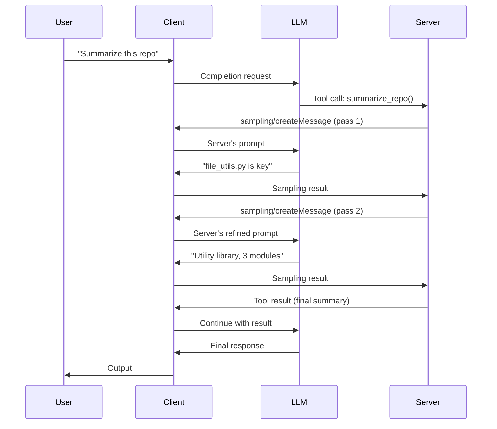

# MCP Sampling — Server-Requested LLM Completions and Agent Loops

## Learning Objectives

1. Implement an MCP server that requests LLM completions from a connected client using the `sampling/createMessage` protocol method.
2. Configure sampling request parameters — `modelPreferences`, `maxTokens`, `systemPrompt` — to control server-initiated completions.
3. Build an agent loop where a server iteratively calls the LLM to refine output until a convergence condition is met.
4. Compare MCP sampling vs. tool-calling as orchestration patterns and identify when each is appropriate.
5. Evaluate the permission and security model around server-requested completions, including human-in-the-loop approval gates.

## The Problem

A code-summarization MCP server needs to walk a file tree, decide which files matter, read them, synthesize a summary, and return. Where does the LLM reasoning live? You have three options, and two of them have serious drawbacks.

Option A: the server calls its own LLM API. This requires an API key baked into the server, bills server-side per call, and means every user's usage flows through one billing account. For a GTM tool that scores leads or enriches profiles, this compounds fast — a single busy day could run hundreds of dollars in tokens that you, the server author, are paying for.

Option B: the server returns raw content as tool output, and the client's LLM does all the reasoning. This works for simple cases but falls apart when the server needs multi-step logic: read file A, decide whether to read file B based on A's contents, synthesize both. That decision tree has to live somewhere, and shoving it into the client prompt makes the server's behavior implicit and fragile — a different client might not follow the same reasoning path.

Option C: the server asks the client's LLM to do specific reasoning steps on demand, using `sampling/createMessage`. The server retains its algorithm (which files to read, how many passes, when to stop) while the client holds the API keys and picks the model. The server never sees a credential. This is sampling, and it is the mechanism by which a trusted server can host an agent loop without being a full LLM host.

## The Concept

Sampling is an MCP protocol capability where a **server** sends a request to the **client** asking it to run an LLM completion. The client — Claude Desktop, an IDE, or a custom host — decides whether to execute it, possibly after asking the user for approval. The server specifies the messages, system prompt, model preferences, and token limits. The client returns the LLM's response. This creates a bidirectional channel that inverts the normal call direction.

In the standard MCP flow, the user prompts the LLM, the LLM calls a server tool, the server returns a result, and the LLM continues. Sampling inserts an extra hop: after the server receives the tool call, it sends a request *back* to the client asking for an LLM completion. The client runs it and returns the text. The server can then use that text to decide its next action — read another file, make another sampling request, or return a final result. That loop — tool call → sampling request → LLM completion → server logic → another sampling request — is what makes the server agentic rather than reactive.



The key architectural distinction: with tool-calling, the server is a passive function that the LLM invokes. With sampling, the server is an active participant that can itself invoke LLM reasoning. The server holds the algorithm; the client holds the credentials. Neither owns the other's responsibility. SEP-1577, merged in late 2025, extended this further by allowing servers to include tool definitions inside sampling requests, so the LLM can call back into server tools mid-completion. That tool-in-sampling shape was experimental through Q1 2026 and is still settling in SDK APIs — if you encounter version-specific behavior in the SDK, that is why.

## Build It

The cleanest way to understand sampling is to implement all three roles — server, client, and LLM — in a single script. The server defines a tool that uses sampling to reason over data. The client receives the sampling request and dispatches it to an LLM. The LLM produces text. No SDK required for the core pattern: the protocol is JSON-RPC, and the logic is a loop.

The script below implements a `RepoSummarizerServer` that walks a file list, makes two sampling passes (one to identify key files, one to synthesize), and returns the result. The `SamplingClient` acts as the host: it receives `sampling/createMessage` requests, runs a mock LLM, and returns completions. The `MockLLM` simulates LLM responses deterministically so the output is reproducible.

```python
import json

MOCK_RESPONSES = [
    "Key file identified: file_utils.py — contains core utility functions.",
    "The repository is a Python utility library with 3 modules: file handling, config parsing, and tests.",
]

class MockLLM:
    def __init__(self):
        self.call_count = 0

    def complete(self, messages, system_prompt, max_tokens):
        idx = min(self.call_count, len(MOCK_RESPONSES) - 1)
        self.call_count += 1
        return MOCK_RESPONSES[idx]

class SamplingClient:
    def __init__(self, llm):
        self.llm = llm
        self.requests_received = []

    def handle_sampling_request(self, request):
        self.requests_received.append(request)
        params = request["params"]
        text = self.llm.complete(
            params["messages"],
            params.get("systemPrompt", ""),
            params.get("maxTokens", 500),
        )
        return {
            "jsonrpc": "2.0",
            "id": request["id"],
            "result": {
                "role": "assistant",
                "content": {"type": "text", "text": text},
                "model": "claude-sonnet-4-20250514",
                "stopReason": "end_turn",
            },
        }

def build_sampling_request(messages, system_prompt="", max_tokens=500,
                           model_hints=None, intelligence=0.5, speed=0.5, cost=0.5):
    params = {"messages": messages, "maxTokens": max_tokens}
    if system_prompt:
        params["systemPrompt"] = system_prompt
    if model_hints:
        params["modelPreferences"] = {
            "hints": [{"name": h} for h in model_hints],
            "intelligencePriority": intelligence,
            "speedPriority": speed,
            "costPriority": cost,
        }
    return {"jsonrpc": "2.0", "id": 0, "method": "sampling/createMessage", "params": params}

class RepoSummarizerServer:
    def __init__(self, client):
        self.client = client
        self.request_id = 0

    def _sample(self, messages, system, max_tokens=200):
        self.request_id += 1
        req = build_sampling_request(messages, system, max_tokens,
                                     model_hints=["claude-sonnet-4-20250514"],
                                     intelligence=0.8, speed=0.3, cost=0.3)
        req["id"] = self.request_id
        resp = self.client.handle_sampling_request(req)
        return resp["result"]["content"]["text"]

    def summarize(self, files):
        messages = [{"role": "user", "content": {"type": "text",
                     "text": f"Repository files: {json.dumps(files)}"}}]
        system = "You are a code analyst. Identify the single most important file."
        pass1 = self._sample(messages, system, max_tokens=200)
        print(f"  Pass 1 (identify): {pass1}")

        messages.append({"role": "assistant", "content": {"type": "text", "text": pass1}})
        messages.append({"role": "user", "content": {"type": "text",
            "text": "Now provide a one-sentence summary of the entire repository based on what you found."}})

        pass2 = self._sample(messages, "Synthesize a final one-sentence summary.", max_tokens=100)
        print(f"  Pass 2 (synthesize): {pass2}")
        return pass2

ll