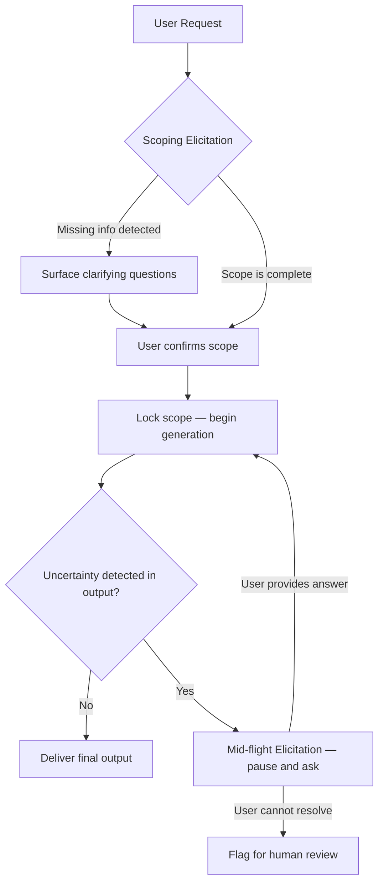

# Roots and Elicitation — Scoping and Mid-Flight User Input

## Learning Objectives

- Implement a scoping elicitation step that forces structured JSON output before any generation begins.
- Build a mid-flight elicitation loop that detects uncertainty markers in model output, surfaces a clarifying question, and re-generates with the user's answer injected.
- Compare proactive scoping and reactive mid-flight elicitation patterns, and articulate when each is necessary.
- Map elicitation logic to GTM enrichment workflows, including Clay waterfall fallback behavior and human-in-the-loop account classification.

## The Problem

You build an agent that takes a user request and runs straight to execution. The prompt is thorough. The system prompt covers edge cases. The model is capable. And yet the output is wrong — not because the model failed to generate, but because it generated the wrong thing. It hallucinated a requirement the user never stated, skipped a constraint that was obvious to the user but invisible to the model, and shipped a deliverable that missed the mark.

This is not a context window problem. You cannot fix it by stuffing more context into the prompt. The failure happens because the agent never confirmed what the user actually wanted. It assumed, and assumptions compound: a wrong assumption about intent leads to a wrong assumption about constraints, which leads to a wrong assumption about output format, which produces a deliverable that is confidently incorrect.

Two specific failure modes recur in production. First, the agent acts on a request without validating that it has the information it needs — it writes the cold outbound sequence without knowing the ICP, the IC, or the offer. Second, the agent hits ambiguity mid-generation and papers over it instead of stopping to ask. It writes "typically, SaaS companies..." instead of asking which segment you mean. Both failures share a root cause: the agent invented an answer to a question it never asked.

The fix is structured elicitation at two critical points. Before you start, you scope — you ask the user to confirm intent, constraints, and missing information. While you run, you pause — you detect when you are about to guess and ask a targeted question instead. These are not conversations. They are structured data-collection steps with defined schemas, defined triggers, and defined incorporation paths.

## The Concept

Two mechanisms prevent an agent from inventing answers to questions it never asked.

**Scoping elicitation** is a structured pre-flight check. Before the agent generates any deliverable, it produces a scoping object — typically a JSON structure with fields like intent summary, constraints detected, missing information, and a readiness flag. This object anchors all downstream behavior. If the readiness flag is false, the agent does not proceed to generation; it surfaces the missing information as questions. If the flag is true, the user has an opportunity to correct the intent summary before the agent commits to execution. The scoping object is the "root" — it defines the boundary of what the agent will and will not do, analogous to how MCP roots define the URIs a server may touch. In the MCP protocol, roots are declared at `initialize` by the client, restricting the server's file operations to a user-controlled set of paths. The scoping pattern applies the same principle to generation: the user declares the scope, and the agent operates within it.

**Mid-flight elicitation** is a reactive pause. The agent is mid-generation when it encounters ambiguity — a missing data point, a decision branch with no clear answer, or an output that contains uncertainty markers. Instead of guessing, the agent halts, surfaces a specific clarifying question to the user, waits for the answer, and incorporates it before continuing. In MCP, this is the `elicitation/create` primitive: the server pauses a tool call and sends a structured request to the client, which renders a form or URL for user input. The same pattern applies at the API level: the agent's output loop detects uncertainty, extracts a question, gets the answer, and re-runs.



The key distinction is temporal. Scoping is proactive — it asks before any action, and it is deterministic: every request passes through the scoping gate. Mid-flight is reactive — it asks only when triggered, and it is conditional: the agent must detect that it is about to guess before it pauses. Both patterns share the same underlying principle: never fabricate an answer to a question you could have asked. The cost of asking is a few seconds of user time. The cost of not asking is a deliverable that misses the mark and erodes trust in the system.

A practical concern: scoping adds latency to every request, and mid-flight pauses add latency to some requests. The trade-off is correctness. In GTM workflows — where a wrong ICP definition or a misclassified account propagates through an entire outbound sequence — the latency cost of elicitation is negligible compared to the cost of acting on bad inputs.

## Build It

### Example 1: Scoping Elicitation

This example makes a single Claude API call where the system prompt forces the model to output a JSON scoping object before any deliverable is produced. The model restates the user's intent, lists constraints, identifies missing information, and sets a readiness flag. If the flag is false, the script prints the questions the agent needs answered.

```python
import json
import anthropic

client = anthropic.Anthropic()

SCOPING_SYSTEM = """You are a scoping agent. Before producing any deliverable, output a JSON object with these exact keys:

- "intent_summary": one sentence restating what the user wants
- "constraints": array of explicit constraints or preferences mentioned
- "missing_info": array of critical details you need but do not have
- "questions": array of specific clarifying questions (empty if nothing is missing)
- "ready": boolean — true only if you have enough to proceed without guessing

Output ONLY the JSON object. No markdown fences, no preamble, no explanation."""

user_request = "Write a cold outbound email sequence for selling our sales tool."

response = client.messages.create(
    model="claude-sonnet-4-20250514",
    max_tokens=1024,
    system=SCOPING_SYSTEM,
    messages=[{"role": "user", "content": user_request}],
)

raw_output = response.content[0].text.strip()
if raw_output.startswith("```"):
    raw_output = raw_output.split("```")[1]
    if raw_output.startswith("json"):
        raw_output = raw_output[4:]
    raw_output = raw_output.strip()

scoping = json.loads(raw_output)

print("=" * 60)
print("SCOPING OBJECT")
print("=" * 60)
print(json.dumps(scoping, indent=2))
print()

if not scoping["ready"]:
    print("AGENT IS NOT READY. Questions to resolve:")
    for i, q in enumerate(scoping["questions"], 1):
        print(f"  {i}. {q}")
else:
    print("SCOPE LOCKED. Safe to proceed to generation.")
```

When you run this, the model has almost no information — no ICP, no product details, no value proposition. The scoping object should reflect that: `ready: false`, with questions asking about target segment, product details, and value prop. The point is that the agent explicitly declares what it does not know instead of guessing.

### Example 2: Mid-Flight Elicitation Loop

This example builds a multi-turn loop where the agent generates a draft, the script scans the output for uncertainty markers, and if any are found, the agent extracts a clarifying question, receives a (simulated) user answer, and regenerates with that answer appended to the conversation. Each round prints to the terminal.

```python
import anthropic

client = anthropic.Anthropic()

UNCERTAINTY_MARKERS = [
    "i'm not sure", "it depends", "might be", "could be",
    "typically", "generally", "varies", "unclear",
    "not certain", "approximately", "i would assume", "likely",
]


def detect_uncertainty(text):
    lower = text.lower()
    found = [m for m in UNCERTAINTY_MARKERS if m in lower]
    return found


def extract_clarifying_question(text):
    q_response = client.messages.create(
        model="claude-sonnet-4-20250514",
        max_tokens=256,
        system="You are a question extractor. Given text that contains uncertainty, output ONE specific clarifying question that would resolve the main ambiguity. Output only the question — no preamble.",
        messages=[{"role": "user", "content": f"Extract the most important clarifying question from this text:\n\n{text}"}],
    )
    return q_response.content[0].text.strip()


def run_with_midflight_elicitation(user_request, max_rounds=2):
    conversation = [{"role": "user", "content": user_request}]

    simulated_answers = [
        "We sell a Clay alternative for solo founders. Price is $99/mo. Target: solo founders at pre-seed SaaS companies.",
        "The main value prop is that it takes 5 minutes to set up versus 2 hours for Clay. No credit card required to start.",
    ]

    for round_num in range(max_rounds + 1):
        response = client.messages.create(
            model="claude-sonnet-4-20250514",
            max_tokens=1024,
            system="You are a GTM copywriter. Write outbound email copy. If you are uncertain about any detail, state your uncertainty explicitly — do not guess.",
            messages=conversation,
        )

        output = response.content[0].text
        print(f"\n{'=' * 60}")
        print(f"ROUND {round_num + 1} — GENERATION")
        print(f"{'=' * 60}")
        print(output)

        markers = detect_uncertainty(output)

        if not markers:
            print(f"\n{'=' * 60}")
            print(f"NO UNCERTAINTY DETECTED — OUTPUT IS FINAL")
            print(f"{'=' * 60}")
            return output

        print(f"\nUNCERTAINTY MARKERS: {markers}")

        if round_num == max_rounds:
            print(f"\n{'=' * 60}")
            print(f"MAX ROUNDS REACHED — FLAGGING FOR HUMAN REVIEW")
            print(f"{'=' * 60}")
            return output

        question = extract_clarifying_question(output)
        print(f"\nMID-FLIGHT QUESTION: {question}")

        answer = simulated_answers[round_num] if round_num < len(simulated_answers) else "No additional info available."
        print(f"USER ANSWER: {answer}")

        conversation.append({"role": "assistant", "content": output})
        conversation.append({"role": "user", "content": f"Clarification: {answer}"})

    return output


final = run_with_midflight_elicitation("Write a cold outbound email for our product.")
print(f"\nDONE. Final output length: {len(final)} chars.")
```

The first round should produce output with uncertainty — the model knows almost nothing about the product. The script detects that uncertainty, extracts a specific question, injects a simulated answer, and regenerates. By the second or third round, the uncertainty markers should diminish as the conversation accumulates concrete detail. The key observable: each round's output should become more specific and less hedged.

## Use It

Elicitation logic — the pattern of identifying what is missing and resolving it before proceeding — maps directly to ICP research and enrichment workflows. [CITATION NEEDED — concept: mapping elicitation patterns to GTM research workflows] The scoping pattern is how enrichment tools gather firmographic and technographic data before scoring accounts. When a Clay waterfall runs, it does not guess a company's employee count. It tries data provider A, then B, then C — and if all three return nothing, it flags the field as empty and either excludes the account from the campaign or routes it to manual research. That waterfall IS elicitation logic: structured identification of a gap, followed by a resolution sequence, followed by a fallback. The waterfall's fallback behavior is the machine equivalent of the scoping object's `ready: false` flag — it stops the pipeline from acting on incomplete data.

Mid-flight elicitation maps to the human-in-the-loop checkpoints that GTM teams already use in async research workflows. An AI agent drafts an account classification — say, labeling a company as "Enterprise" versus "Mid-Market" based on scraped data. Before that classification enters the CRM and triggers a campaign branch, a human reviewer approves or corrects it. The mid-flight pause is the same mechanism: the agent surfaces its uncertainty ("employee count suggests Mid-Market, but revenue signals suggest Enterprise — which segment?"), the human resolves it, and the agent proceeds with a locked answer. The difference is that in the Clay workflow, the elicitation target is a data provider; in the AI workflow, the elicitation target is a human reviewer.

The practical connection: when you build GTM automation in n8n or Clay, you are implementing elicitation logic whether you call it that or not. Every conditional node that checks "is this field populated?" is a scoping check. Every Slack approval step that pauses a workflow until a human confirms is a mid-flight elicitation. Naming the pattern lets you reason about when to use each, how to design the fallback, and where the latency cost is justified. In outbound specifically — where a single misclassified ICP can route hundreds of accounts to the wrong messaging sequence — the cost of skipping elicitation is not a bad email. It is a wasted sales motion at scale. [CITATION NEEDED — concept: cost of misclassification in outbound sequencing]

## Ship It

Putting elicitation into a production GTM pipeline means encoding the scoping and mid-flight patterns into deployable infrastructure. In Zone 13 terms, your deploy pipeline ships Clay tables, n8n workflows, and the enrichment logic that powers them. The elicitation checkpoints need to survive deployment — meaning they are not ad-hoc prompt additions that a developer remembers to include, but versioned, tested components of the system.

For scoping, this means the JSON schema your agent outputs is part of your pipeline definition. If you deploy a new Clay table that scores accounts, the scoping step runs first: it checks whether all required fields exist in the input data, and if any are missing, the table does not score — it flags. This is not a prompt engineering trick. It is a data quality gate that you version-control and test in CI. The same pipeline that deploys your n8n workflows should include a validation step that confirms the elicitation schema matches what the downstream consumer expects.

For mid-flight elicitation in production, the challenge is state management. A paused agent is a workflow that has stopped mid-execution and is waiting for external input. In n8n, this is a Wait node paired with a webhook — the workflow pauses, sends a Slack message with the clarifying question, and resumes when the webhook receives the human's response. In a pure API context, this is harder: you need to persist the conversation state, surface the question through a UI or notification channel, and resume the generation when the answer arrives. The pattern is the same; the infrastructure differs. SPF/DKIM/DMARC is your infrastructure layer for email deliverability; elicitation gates are your infrastructure layer for data quality. [CITATION NEEDED — concept: elicitation as infrastructure layer in GTM pipelines]

A production caveat: mid-flight elicitation that relies on regex scanning for uncertainty markers ("I'm not sure", "it depends") is a heuristic, not a guarantee. A model can be wrong without hedging — it can confidently state an incorrect fact. The regex approach catches visible uncertainty, not invisible errors. For higher-stakes workflows, consider adding a validation step where a second model call checks the output against the scoping object and flags discrepancies. This doubles your API cost but catches a class of errors that uncertainty markers miss.

## Exercises

**Tier 1 — Add a field to the scoping schema.** Modify the scoping elicitation example to add a `"target_audience"` field to the JSON schema. Update the system prompt to require it. After parsing the JSON, validate that the field exists and is non-empty before printing "SCOPE LOCKED." If it is missing or empty, print a warning. Run the script and confirm the field appears in the output.

**Tier 2 — Build a two-phase interactive agent.** Create a script that runs in two phases. Phase 1 calls the scoping endpoint, prints the scoping object, and if `ready` is false, uses `input()` to prompt the terminal user with each question from the `questions` array. Phase 2 takes the user's answers, appends them to the conversation as a clarification, and calls the API again to generate the actual deliverable (e.g., the outbound email). Print both the scoping object and the final deliverable. Run it with a vague request like "write a landing page for our startup" and confirm the user's answers change the output.

**Tier 3 — Full mid-flight elicitation with human input.** Extend the mid-flight example to use real `input()` calls instead of simulated answers. When uncertainty markers are detected,