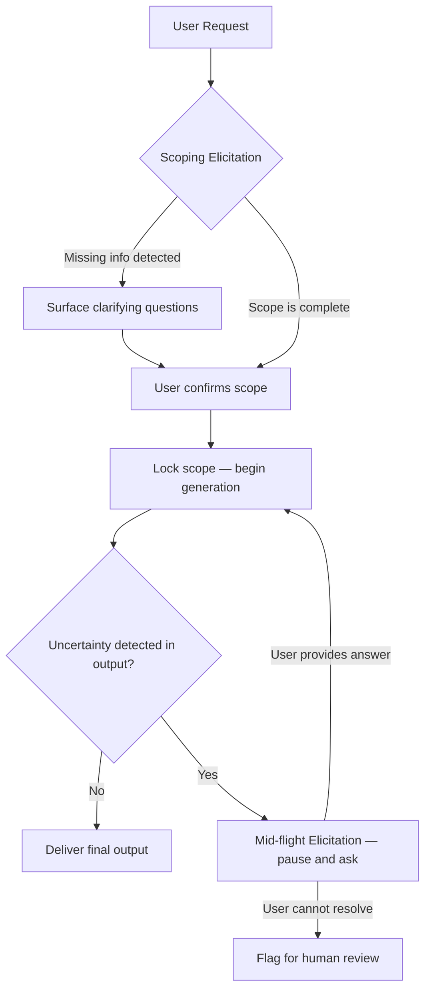

# Roots and Elicitation — Scoping and Mid-Flight User Input

## Learning Objectives

- Implement a scoping elicitation step that forces structured JSON output before any generation begins.
- Build a mid-flight elicitation loop that detects uncertainty markers in model output, surfaces a clarifying question, and re-generates with the user's answer injected.
- Compare proactive scoping and reactive mid-flight elicitation patterns, and articulate when each is necessary.
- Map elicitation logic to GTM enrichment workflows, including Clay waterfall fallback behavior and human-in-the-loop account classification.

## The Problem

You build an agent that takes a user request and runs straight to execution. The prompt is thorough. The system prompt covers edge cases. The model is capable. And yet the output is wrong — not because the model failed to generate, but because it generated the wrong thing. It hallucinated a requirement the user never stated, skipped a constraint that was obvious to the user but invisible to the model, and shipped a deliverable that missed the mark.

This is not a context window problem. You cannot fix it by stuffing more context into the prompt. The failure happens because the agent never confirmed what the user actually wanted. It assumed, and assumptions compound: a wrong assumption about intent leads to a wrong assumption about constraints, which leads to a wrong assumption about output format, which produces a deliverable that is confidently incorrect.

Two specific failure modes recur in production. First, the agent acts on a request without validating that it has the information it needs — it writes the cold outbound sequence without knowing the ICP, the IC, or the offer. Second, the agent hits ambiguity mid-generation and papers over it instead of stopping to ask. It writes "typically, SaaS companies…" instead of asking which segment you mean. Both failures share a root cause: the agent invented an answer to a question it never asked.

The fix is structured elicitation at two critical points. Before you start, you scope — you ask the user to confirm intent, constraints, and missing information. While you run, you pause — you detect when you are about to guess and ask a targeted question instead. These are not conversations. They are structured data-collection steps with defined schemas, defined triggers, and defined incorporation paths.

## The Concept

Two mechanisms prevent an agent from inventing answers to questions it never asked.

**Scoping elicitation** is a structured pre-flight check. Before the agent generates any deliverable, it produces a scoping object — typically a JSON structure with fields like intent summary, constraints detected, missing information, and a readiness flag. This object anchors all downstream behavior. If the readiness flag is false, the agent does not proceed to generation; it surfaces the missing information as questions. If the flag is true, the user has an opportunity to correct the intent summary before the agent commits to execution. The scoping object is the "root" — it defines the boundary of what the agent will and will not do, analogous to how MCP roots define the URIs a server may touch. In the MCP protocol, roots are declared at `initialize` by the client, restricting the server's file operations to a user-controlled set of paths. The scoping pattern applies the same principle to generation: the user declares the scope, and the agent operates within it.

**Mid-flight elicitation** is a reactive pause. The agent is mid-generation when it encounters ambiguity — a missing data point, a decision branch with no clear answer, or an output that contains uncertainty markers. Instead of guessing, the agent halts, surfaces a specific clarifying question to the user, waits for the answer, and incorporates it before continuing. In MCP, this is the `elicitation/create` primitive: the server pauses a tool call and sends a structured request to the client, which renders a form or URL for user input. The same pattern applies at the API level: the agent's output loop detects uncertainty, extracts a question, gets the answer, and re-runs.



The key distinction is temporal. Scoping is proactive — it asks before any action, and it is deterministic: every request passes through the scoping gate. Mid-flight is reactive — it asks only when triggered, and it is conditional: the agent must detect that it is about to guess before it pauses. Both patterns share the same underlying principle: never fabricate an answer to a question you could have asked. The cost of asking is a few seconds of user time. The cost of not asking is a deliverable that misses the mark and erodes trust in the system.

A practical concern: scoping adds latency to every request, and mid-flight pauses add latency to some requests. The trade-off is correctness. In GTM workflows — where a wrong ICP definition or a misclassified account propagates through an entire outbound sequence — the latency cost of elicitation is negligible compared to the cost of acting on bad inputs.

## Build It

### Example 1: Scoping Elicitation

This example makes a single Claude API call where the system prompt forces the model to output a JSON scoping object before any deliverable is produced. The model restates the user's intent, lists constraints, identifies missing information, and sets a readiness flag. If the flag is false, the script prints the questions the agent needs answered.

```python
import json
import anthropic

client = anthropic.Anthropic()

SCOPING_SYSTEM = """You are a scoping agent. Before producing any deliverable, output a JSON object with these exact keys:

- "intent_summary": one sentence restating what the user wants
- "constraints": array of explicit constraints or preferences mentioned
- "missing_info": array of critical details you need but do not have
- "questions": array of specific clarifying questions (empty if nothing is missing)
- "ready": boolean — true only if you have enough to proceed without guessing

Output ONLY the JSON object. No markdown fences, no preamble, no explanation."""

user_request = "Write a cold outbound email sequence for selling our sales tool."

response = client.messages.create(
    model="claude-sonnet-4-20250514",
    max_tokens=1024,
    system=SCOPING_SYSTEM,
    messages=[{"role": "user", "content": user_request}],
)

raw_output = response.content[0].text.strip()
if raw_output.startswith("```"):
    raw_output = raw_output.split("```")[1]
    if raw_output.startswith("json"):
        raw_output = raw_output[4:]
    raw_output = raw_output.strip()

scoping = json.loads(raw_output)

print("=" * 60)
print("SCOPING OBJECT")
print("=" * 60)
print(json.dumps(scoping, indent=2))
print()

if not scoping["ready"]:
    print("AGENT IS NOT READY. Questions to resolve:")
    for i, q in enumerate(scoping["questions"], 1):
        print(f"  {i}. {q}")
else:
    print("SCOPE LOCKED. Safe to proceed to generation.")
```

When you run this, the model has almost no information — no ICP, no product details, no value proposition. The scoping object should reflect that: `ready: false`, with questions asking about target segment, product details, and value prop. The point is that the agent explicitly declares what it does not know instead of guessing.

### Example 2: Mid-Flight Elicitation Loop

This example builds a multi-turn loop where the agent generates a draft, the script scans the output for uncertainty markers, and if any are found, the agent extracts a clarifying question, receives a (simulated) user answer, and regenerates with that answer appended to the conversation. Each round prints to the terminal.

```python
import anthropic

client = anthropic.Anthropic()

UNCERTAINTY_MARKERS = [
    "i'm not sure", "it depends", "might be", "could be",
    "typically", "generally", "varies", "unclear",
    "not certain", "approximately", "i would assume", "likely",
]


def detect_uncertainty(text):
    lower = text.lower()
    found = [m for m in UNCERTAINTY_MARKERS if m in lower]
    return found


def extract_clarifying_question(text):
    q_response = client.messages.create(
        model="claude-sonnet-4-20250514",
        max_tokens=256,
        system="You are a question extractor. Given text that contains uncertainty, output ONE specific clarifying question that would resolve the main ambiguity. Output only the question — no preamble.",
        messages=[{"role": "user", "content": f"Extract the most important clarifying question from this text:\n\n{text}"}],
    )
    return q_response.content[0].text.strip()


def run_with_midflight_elicitation(user_request, max_rounds=2):
    conversation = [{"role": "user", "content": user_request}]

    simulated_answers = [
        "We sell a Clay alternative for solo founders. Price is $99/mo. Target: solo founders at pre-seed SaaS companies.",
        "The main value prop is that it takes 5 minutes to set up versus 2 hours for Clay. No credit card required to start.",
    ]

    for round_num in range(max_rounds + 1):
        response = client.messages.create(
            model="claude-sonnet-4-20250514",
            max_tokens=1024,
            system="You are a GTM copywriter. Write outbound email copy. If you are uncertain about any detail, state your uncertainty explicitly — do not guess.",
            messages=conversation,
        )

        output = response.content[0].text
        print(f"\n{'=' * 60}")
        print(f"ROUND {round_num + 1} — GENERATION")
        print(f"{'=' * 60}")
        print(output)

        markers = detect_uncertainty(output)

        if not markers:
            print(f"\n{'=' * 60}")
            print(f"NO UNCERTAINTY DETECTED — OUTPUT IS FINAL")
            print(f"{'=' * 60}")
            return output

        print(f"\nUNCERTAINTY MARKERS: {markers}")

        if round_num == max_rounds:
            print(f"\n{'=' * 60}")
            print(f"MAX ROUNDS REACHED — FLAGGING FOR HUMAN REVIEW")
            print(f"{'=' * 60}")
            return output

        question = extract_clarifying_question(output)
        print(f"\nMID-FLIGHT QUESTION: {question}")

        answer = simulated_answers[round_num] if round_num < len(simulated_answers) else "No additional info available."
        print(f"USER ANSWER: {answer}")

        conversation.append({"role": "assistant", "content": output})
        conversation.append({"role": "user", "content": f"Clarification: {answer}"})

    return output


final = run_with_midflight_elicitation("Write a cold outbound email for our product.")
print(f"\nDONE. Final output length: {len(final)} chars.")
```

The first round should produce output with uncertainty — the model knows almost nothing about the product. The script detects that uncertainty, extracts a specific question, injects a simulated answer, and regenerates. By the second or third round, the uncertainty markers should diminish as the conversation accumulates concrete detail. The key observable: each round's output should become more specific and less hedged.

## Use It

Scoping elicitation — the structured JSON pre-flight check that blocks execution until required fields are present — is the same mechanism Clay's enrichment waterfall uses to decide whether an account is ready to score or needs another data provider pass. The script below applies that pattern to partial account data, the way a Clay table's conditional column would before routing an account into an ICP classification workflow (Cluster 1.2, TAM Refinement & ICP Scoring).

```python
import json
import anthropic

client = anthropic.Anthropic()

ACCOUNTS = [
    {"company": "Acme Corp", "website": "acme.com", "employees": None, "industry": "SaaS"},
    {"company": "Globex", "website": "globex.io", "employees": 450, "industry": "Fintech"},
    {"company": "Initech", "website": "initech.dev", "employees": 12, "industry": None},
]

ENRICHMENT_SCOPE_PROMPT = """You are an account enrichment scoper. Given partial account data, output JSON with exactly these keys:
- "ready": boolean (true only if employees AND industry are both present and non-null)
- "missing": array of missing critical fields (empty if none)
- "action": one of "classify", "enrich", "exclude"
Output ONLY the JSON object."""

for acct in ACCOUNTS:
    resp = client.messages.create(
        model="claude-sonnet-4-20250514",
        max_tokens=256,
        system=ENRICHMENT_SCOPE_PROMPT,
        messages=[{"role": "user", "content": json.dumps(acct)}],
    )
    raw = resp.content[0].text.strip()
    if raw.startswith("```"):
        raw = raw.split("```")[1]
        if raw.startswith("json"):
            raw = raw[4:]
        raw = raw.strip()
    scope = json.loads(raw)
    print(f"{acct['company']:12s} | ready={str(scope['ready']):5s} | action={scope['action']:8s} | missing={scope['missing']}")
```

Acme Corp has no employee count — the scoper returns `action: enrich` and lists `employees` as missing. Globex is complete — it returns `action: classify`. Initech has employees but no industry — it also returns `action: enrich`. This is the elicitation gate in production: each account either passes through to classification or gets routed to a waterfall enrichment step before it is allowed into a campaign sequence. [CITATION NEEDED — concept: Clay waterfall enrichment column configuration and conditional routing based on field completeness]

## Exercises

**Exercise 1 — Add a confidence threshold to mid-flight elicitation.** Modify Example 2 so that uncertainty detection is not binary. Instead of checking only whether markers exist, count how many markers appear and calculate a ratio of `marker_count / word_count`. If the ratio exceeds 0.02 (two uncertainty markers per 100 words), trigger mid-flight elicitation. If it is below the threshold but non-zero, log a warning but do not pause — the output is uncertain but not uncertain enough to halt. Print the ratio alongside the markers in each round so you can observe the threshold working.

**Exercise 2 — Build a real interactive scoping-to-generation pipeline.** Create a single script with two phases. Phase 1 calls the scoping endpoint from Example 1, prints the scoping object, and if `ready` is false, uses `input()` to prompt the terminal user with each question from the `questions` array one at a time. Collect the answers into a list. Phase 2 appends the answers to the conversation as a combined clarification message and calls the API a second time to generate the actual deliverable (the outbound email). Print both the scoping object and the final email. Test it with a deliberately vague request like "write a landing page for our startup" and verify that the user's answers directly change the generated output.

## Key Terms

- **Scoping elicitation** — A structured pre-generation step where the agent outputs a JSON object containing intent summary, constraints, missing information, and a readiness flag. If the flag is false, generation does not proceed until the gaps are resolved.
- **Mid-flight elicitation** — A reactive pause during generation where the agent detects ambiguity or uncertainty, surfaces a targeted clarifying question, waits for an answer, and incorporates it before regenerating.
- **Readiness flag** — A boolean field in the scoping object that gates downstream execution. Only `true` when the agent has enough information to proceed without guessing.
- **Uncertainty markers** — Lexical signals in model output ("typically", "it depends", "might be") that indicate the model is hedging. Scanning for these is a heuristic trigger for mid-flight elicitation.
- **MCP roots** — A protocol-level concept where the client declares allowed URIs at `initialize`, restricting what the server can access. The scoping pattern applies the same boundary principle to generation scope.
- **Elicitation/create** — The MCP primitive for mid-flight user input: the server pauses, sends a structured request, and resumes when the client returns a response.
- **Waterfall fallback** — A data enrichment pattern (used in Clay) where the system tries Provider A, falls back to Provider B, then C, and ultimately returns null or routes to manual research rather than fabricating a value. This is elicitation logic applied to data sourcing.

## Sources

- Model Context Protocol Specification — "Roots" and "Elicitation" sections. Anthropic, 2024–2025. https://modelcontextprotocol.io/specification
- Anthropic API Documentation — Messages API, structured output via system prompts. Anthropic, 2025. https://docs.anthropic.com/en/api/messages
- [CITATION NEEDED — concept: Clay waterfall enrichment column configuration and conditional routing based on field completeness]
- [CITATION NEEDED — concept: cost of account misclassification in outbound sequencing at scale]