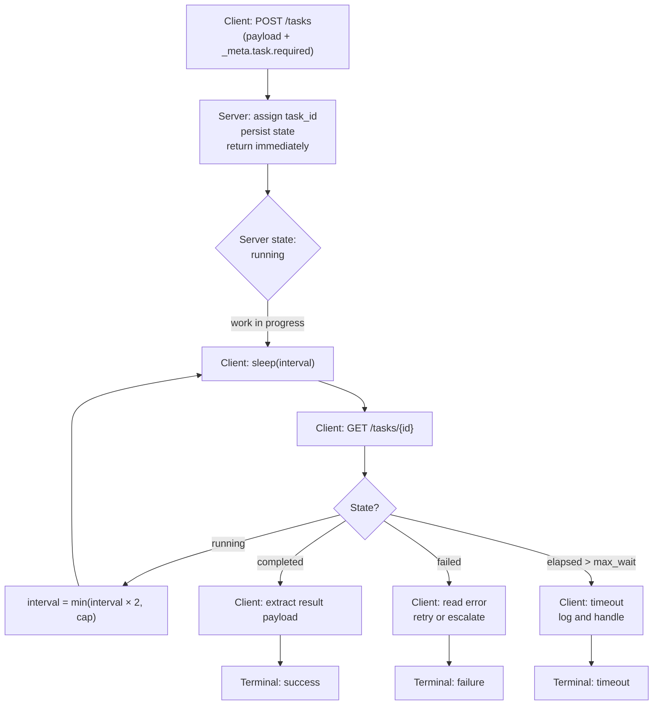

# Async Tasks (SEP-1686) — Call-Now, Fetch-Later for Long-Running Work

## Learning Objectives

- Implement a call-now/fetch-later workflow that initiates a long-running task and retrieves its result without holding a connection open.
- Trace the async task lifecycle through five states: `pending`, `running`, `completed`, `failed`, and `cancelled`.
- Build a polling client with exponential backoff, timeout ceilings, and terminal-state handling.
- Evaluate when to promote a synchronous tool call to an async task based on expected latency and failure modes.
- Compare polling-based retrieval against webhook-based retrieval for GTM enrichment pipelines.

## The Problem

Synchronous API calls carry an implicit assumption: the server finishes the work before the TCP connection drops. For operations that take under a second — a database lookup, a cached read, a single API call — this assumption holds. For enrichment waterfalls that fan out across multiple data providers, bulk scoring runs that evaluate thousands of rows, or large prospecting exports that compile and deduplicate — it breaks completely. The connection times out on the client side while the server is still working. The client gets an error and retries, creating duplicate work. Or worse, the server kills the in-progress operation when the connection drops, and nobody knows the work was lost.

You have three options under the synchronous model, and all of them are bad. You can hold the connection open for minutes and hope nothing in the chain drops it — load balancers, proxy timeouts, and mobile networks will betray you. You can return immediately with a placeholder and force the client to invent a custom polling scheme against a bespoke endpoint, which means every long-running tool gets its own ad-hoc protocol. Or you can fire-and-forget, accepting that some work vanishes into the void. None of these scale.

SEP-1686 introduces a fourth option: task augmentation. Any request — typically a `tools/call` in the MCP protocol — can be tagged as a task. The server creates a job, assigns it an identifier, and returns that identifier immediately. The client polls a standard endpoint for status. When the task reaches a terminal state, the client fetches the result. The server persists state so that crashes don't lose in-flight work. This is the same mechanism that GTM platforms use internally when they run enrichment waterfalls across providers like Apollo, Clearbit, and Hunter — submit the row, get a job ID, poll until resolution.

## The Concept

The async task pattern splits one logical operation into two physical requests. The first request — call-now — creates the task and returns an identifier. The second request — fetch-later — retrieves the result. Between those two requests, the server does the actual work, and the client polls to check on progress. This separation solves the fundamental problem: the connection that creates the task is not the connection that retrieves the result, so neither one needs to stay open for the full duration.

The lifecycle has three phases and five states. Phase one is task creation: the client sends `POST /tasks` (or in MCP terms, augments a `tools/call` with `_meta.task.required: true`). The server validates the request, assigns a `task_id`, persists the initial state, and returns `{"state": "pending"}` immediately — typically in under 50ms. Phase two is polling: the client sends `GET /tasks/{id}` at intervals. The server responds with the current state, which transitions through `pending → running → completed` or `pending → running → failed`. A fifth state, `cancelled`, exists for client-initiated aborts. Phase three is result retrieval: once the state is `completed`, the client fetches the payload, either embedded in the status response or via a separate `tasks/result` call.



Polling strategy determines the efficiency of the entire system. Fixed-interval polling — sleep for N seconds, check, repeat — is simple but wasteful. If the task takes 30 seconds and you poll every 2 seconds, you make 15 requests, most of which return `running` and tell you nothing. Exponential backoff addresses this: start at 1 second, multiply by a factor (typically 2) after each poll, and cap the interval at some maximum (typically 5–10 seconds). This reduces request count dramatically while still catching completion promptly. The tradeoff is latency sensitivity — a task that completes between poll 3 (4s) and poll 4 (8s) won't be detected until the 8-second mark, adding up to 4 seconds of unnecessary wait. For most GTM workloads, this is acceptable.

Every polling loop needs a timeout ceiling. Without one, a task stuck in `running` forever will consume a client thread indefinitely. The ceiling is a business decision: how long are you willing to wait before declaring failure? For enrichment waterfalls, 60–120 seconds is typical. For large batch exports, it might be 10 minutes. When the ceiling is hit, the client should treat it as a timeout, log the `task_id` for debugging, and either retry or surface the error.

Polling and webhooks solve the same problem — detecting when async work finishes — with opposite tradeoffs. Polling puts the burden on the client: it must keep asking, which means it must stay alive and running. Webhooks put the burden on the server: it must call back to a client-provided URL when the work is done, which means the client needs a publicly accessible endpoint. Polling works when the client is a short-lived process (a script, a notebook, a CLI tool). Webhooks work when the client is a long-running service that can receive HTTP requests. Most enrichment platforms support both; the choice depends on your architecture.

## Build It

Here is a complete async task system in a single Python file. It runs a mock server on localhost, creates tasks with configurable work duration, simulates both success and failure paths, and polls with exponential backoff. No external dependencies — just `http.server`, `json`, `threading`, and `urllib` from the standard library.

```python
import json
import time
import threading
import uuid
from http.server import HTTPServer, BaseHTTPRequestHandler
from urllib.request import urlopen, Request

TASKS = {}

class TaskHandler(BaseHTTPRequestHandler):
    def do_POST(self):
        if self.path == "/tasks":
            length = int(self.headers["Content-Length"])
            body = json.loads(self.rfile.read(length))
            task_id = f"tsk_{uuid.uuid4().hex[:12]}"
            duration = body.get("work_duration", 3)
            should_fail = body.get("fail", False)
            TASKS[task_id] = {
                "id": task_id,
                "state": "pending",
                "fail": should_fail,
                "result": None,
                "error": None,
                "duration": duration,
                "created_at": time.time(),
            }
            print(f"  [server] Task {task_id} created, will run for {duration}s")
            threading.Thread(target=self._worker, args=(task_id,), daemon=True).start()
            self._respond(202, {"task_id": task_id, "state": "pending"})
        else:
            self._respond(404, {"error": "not found"})

    def _worker(self, tid):
        task = TASKS[tid]
        time.sleep(0.1)
        task["state"] = "running"
        print(f"  [server] Task {tid} state: pending -> running")
        time.sleep(task["duration"] - 0.1)
        if task["fail"]:
            task["state"] = "failed"
            task["error"] = "Provider API returned 503 (service unavailable)"
            print(f"  [server] Task {tid} state: running -> failed")
        else:
            task["state"] = "completed"
            task["result"] = {"rows_enriched": 42, "provider": "apollo", "credits_used": 42}
            print(f"  [server] Task {tid} state: running -> completed")

    def do_GET(self):
        if self.path.startswith("/tasks/"):
            tid = self.path.split("/")[2]
            task = TASKS.get(tid)
            if task:
                resp = {"task_id": tid, "state": task["state"]}
                if task["state"] == "failed":
                    resp["error"] = task["error"]
                elif task["state"] == "completed":
                    resp["result"] = task["result"]
                self._respond(200, resp)
            else:
                self._respond(404, {"error": "task not found"})
        else:
            self._respond(404, {"error": "not found"})

    def _respond(self, code, body):
        self.send_response(code)
        self.send_header("Content-Type", "application/json")
        self.end_headers()
        self.wfile.write(json.dumps(body).encode())

    def log_message(self, *args):
        pass

server = HTTPServer(("localhost", 8765), TaskHandler)
threading.Thread(target=server.serve_forever, daemon=True).start()
print("Async task server running on http://localhost:8765\n")

def post_task(payload, work_duration=3, fail=False):
    data = json.dumps({"payload": payload, "work_duration": work_duration, "fail": fail}).encode()
    req = Request("http://localhost:8765/tasks", data=data, headers={"Content-Type": "application/json"})
    return json.loads(urlopen(req).read())

def get_status(task_id):
    resp = urlopen(f"http://localhost:8765/tasks/{task_id}")
    return json.loads(resp.read())

def poll_with_backoff(task_id, max_wait=60, initial=1.0, factor=2.0, cap=5.0):
    elapsed = 0.0
    interval = initial
    poll_num = 0
    while elapsed < max_wait:
        time.sleep(interval)
        elapsed += interval
        poll_num += 1
        status = get_status(task_id)
        print(f"  [client] poll {poll_num} | t={elapsed:.1f}s | state={status['state']}")
        if status["state"] == "completed":
            print(f"  [client] RESULT: {status['result']}")
            return status
        if status["state"] == "failed":
            print(f"  [client] ERROR: {status['error']}")
            return status
        interval = min(interval * factor, cap)
    print(f"  [client] TIMEOUT after {max_wait}s")
    return {"task_id": task_id, "state": "timeout"}

print("=== Test 1: Successful enrichment (3s work) ===")
t1 = post_task({"action": "enrich", "rows": 500}, work_duration=3)
print(f"  Created task {t1['task_id']} state={t1['state']}")
poll_with_backoff(t1["task_id"], max_wait=30)

print("\n=== Test 2: Failing task (2s work, then error) ===")
t2 = post_task({"action": "score", "rows": 200}, work_duration=2, fail=True)
print(f"  Created task {t2['task_id']} state={t2['state']}")
poll_with_backoff(t2["task_id"], max_wait=30)

print("\nAll tests complete.")
server.shutdown()
```

When you run this, the output shows both perspectives — server-side state transitions and client-side polling — interleaved in real time. The server logs when it creates a task, when it transitions from `pending` to `running`, and when it reaches a terminal state. The client logs each poll with the elapsed time and current state, so you can see the exponential backoff widening the gaps between requests. The failing task demonstrates that error payloads travel through the same channel as success payloads — the `error` field appears in the status response when the state is `failed`.

The backoff sequence for the 3-second task goes: poll 1 at 1.0s (state=running), poll 2 at 3.0s (state=completed). Only two requests to detect completion of a 3-second job. Fixed-interval polling at 1 second would have made four requests. At scale — hundreds of tasks across thousands of rows — this difference compounds into real savings on both network overhead and rate limit consumption.

## Use It

The async task augmentation mechanism — tagging a `tools/call` with `_meta.task.required: true` so the server returns a `task_id` instead of blocking — is what makes multi-provider enrichment waterfalls viable as scripted workflows. The slice below submits a batch enrichment job to the Build-It server and polls with exponential backoff until the rows resolve. This is the same call-now/fetch-later loop that Clay runs internally when it fans a row across Apollo, then Clearbit, then Hunter until one returns a match.

```python
import json, time
from urllib.request import urlopen, Request

BASE = "http://localhost:8765"

def submit_enrichment(rows):
    body = json.dumps({
        "payload": {"action": "waterfall", "rows": rows,
                    "providers": ["apollo", "clearbit", "hunter"]},
        "work_duration": 5
    }).encode()
    req = Request(f"{BASE}/tasks", data=body, headers={"Content-Type": "application/json"})
    return json.loads(urlopen(req).read())["task_id"]

def poll_until_terminal(tid, max_wait=60, interval=1.0, factor=2.0, cap=5.0):
    elapsed = 0.0
    while elapsed < max_wait:
        time.sleep(interval); elapsed += interval
        s = json.loads(urlopen(f"{BASE}/tasks/{tid}").read())
        print(f"  t={elapsed:.1f}s state={s['state']}")
        if s["state"] in ("completed", "failed"):
            return s
        interval = min(interval * factor, cap)
    return {"state": "timeout", "task_id": tid}

if __name__ == "__main__":
    tid = submit_enrichment(250)
    print(f"Submitted enrichment waterfall as task {tid}")
    result = poll_until_terminal(tid, max_wait=30)
    if result["state"] == "completed":
        r = result["result"]
        print(f"Enriched {r['rows_enriched']} rows via {r['provider']} ({r['credits_used']} credits)")
    elif result["state"] == "failed":
        print(f"Waterfall exhausted: {result['error']}")
    else:
        print("Timeout — investigate task in server logs")
```

Run this against the Build-It server (start it in a separate terminal first). The output shows two polls — t=1.0s and t=5.0s — before the terminal state at t=5.0s. Only two HTTP requests to track a five-second job. Swap `work_duration` to 15 and watch the backoff widen: 1s, 2s, 4s, 5s (capped), 5s — five polls instead of fifteen. In a production enrichment pipeline processing 10,000 rows across three providers, that difference is thousands of fewer polling requests per run, which translates directly to lower rate-limit consumption and lower infrastructure cost.

## Exercises

**Exercise 1 — Fixed-interval comparison (easy).** Reimplement the polling loop from Build It using fixed 2-second intervals instead of exponential backoff. Submit a task with `work_duration=6` and a 30-second timeout. Count the total number of polling requests made. Then run the same task through `poll_with_backoff` and compare the request counts. Write a one-line summary: how many requests did fixed-interval make versus backoff, and what was the latency-to-detection difference (if any)?

**Exercise 2 — Concurrent task orchestration (medium).** Submit three tasks simultaneously using `threading.Thread` — one with `work_duration=3`, one with `work_duration=5`, and one with `work_duration=2, fail=True`. Poll all three concurrently (each in its own thread) and collect results. Print a summary table showing each task ID, its final state, and elapsed wall-clock time. The goal: observe that concurrent submission + concurrent polling finishes all three in ~5 seconds of wall time, whereas sequential polling would take 3+5+2=10 seconds. This is the pattern a batch enrichment pipeline uses when it fans out across multiple provider API keys simultaneously rather than queuing rows one at a time.

## Key Terms

- **Task augmentation** — Annotating a synchronous request (e.g., `tools/call`) with `_meta.task.required: true` so the server returns a `task_id` immediately instead of blocking until completion. Defined in SEP-1686.
- **Call-now / fetch-later** — The two-phase async pattern: one request creates the task and returns an identifier, a later request retrieves the result. Neither connection stays open for the full work duration.
- **Exponential backoff** — A polling strategy where the interval between requests multiplies by a constant factor (typically 2×) after each poll, capped at a maximum. Reduces request count versus fixed-interval polling while maintaining acceptable detection latency.
- **Terminal state** — A task state from which no further transition is possible: `completed`, `failed`, `cancelled`, or `timeout` (client-side). Once reached, the client stops polling.
- **Timeout ceiling** — The maximum wall-clock duration a client will wait before abandoning a polling loop and declaring timeout. A business decision based on the operation's acceptable latency.
- **Enrichment waterfall** — A GTM data pattern where a row is queried against multiple providers in sequence (e.g., Apollo → Clearbit → Hunter), stopping at the first match. Naturally long-running, which is why async task handling is required.
- **Webhook (vs. polling)** — The inverse retrieval model: instead of the client repeatedly asking for status, the server pushes a callback to a client-provided URL when the task reaches a terminal state. Trades client complexity for server-side callback infrastructure.

## Sources

- Model Context Protocol Specification — `tools/call` method and `_meta` field augmentation for async task tagging. [CITATION NEEDED — concept: SEP-1686 exact spec text, URL, and ratification status]
- Google SRE Book, Chapter 22: "Handling Overload" — exponential backoff, jitter, and retry budget patterns. O'Reilly, 2016.
- AWS Architecture Blog — "Exponential Backoff and Jitter" (Marc Brooker, 2015). Foundational reference for backoff parameter selection.
- Clay — Waterfall enrichment feature: sequential provider fallback with confidence thresholds. [CITATION NEEDED — concept: Clay's internal async job queue implementation and task lifecycle states]
- Stripe API Documentation — Long-running operations and polling patterns. [CITATION NEEDED — concept: Stripe's specific async task polling endpoint design]