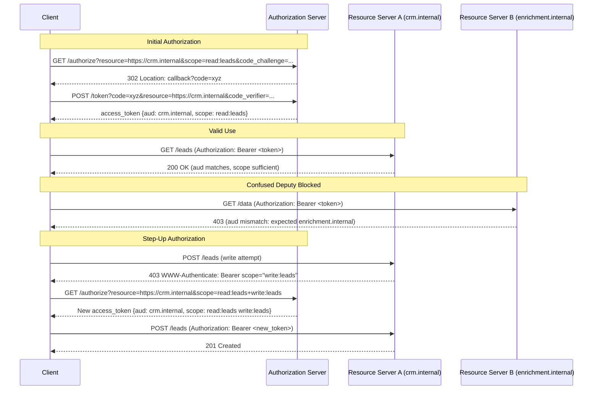

# MCP Security II — OAuth 2.1, Resource Indicators, Incremental Scopes

## Learning Objectives

- Implement a PKCE-protected OAuth 2.1 authorization code exchange and verify each cryptographic step produces the expected output.
- Trace a token through resource indicator validation (RFC 8707) across two resource servers and identify the exact claim that causes audience rejection.
- Build a step-up authorization state machine that responds to 403 `WWW-Authenticate` challenges by requesting additional scopes without restarting the full authorization flow.
- Compare three blast-radius constraints — audience binding, scope restriction, and incremental expansion — and explain which threat each one mitigates.

## The Problem

A compromised MCP server token with overly broad scopes is a lateral movement vector. If a client authenticates once and receives a token valid at every resource server it can reach, stealing that one token gives an attacker the full blast radius of the client's permissions. This is not a hypothetical: the pre-2025 MCP ecosystem shipped remote servers with ad-hoc API keys or no auth at all, and every one of those servers that shared a token format was a confused deputy waiting to happen.

OAuth 2.1 is the consolidation layer. It removes the footguns that caused real breaches: the implicit grant (tokens in URLs, logged by every proxy in the path), client credentials without PKCE (interceptable authorization codes), and loose redirect URI matching (open redirect abuse). The 2025-11-25 MCP spec adopts OAuth 2.1 as its authorization profile and layers two additional constraints on top: resource indicators (RFC 8707) to pin tokens to specific resource server URIs, and incremental authorization (SEP-835) to expand scopes only when an operation demands it.

The three mechanisms address one threat model: **token exfiltration and misuse**. OAuth 2.1 makes the initial token harder to steal. Resource indicators make a stolen token useless outside its intended target. Incremental authorization ensures that the token in flight at any given moment has the minimum scopes required for the current operation — not the union of everything the user ever consented to.

## The Concept

OAuth 2.1 is not a new protocol — it is OAuth 2.0 with the best practices stripped out of optional appendixes and welded into normative requirements. PKCE (Proof Key for Code Exchange) is mandatory for every client, including confidential clients. The implicit grant (`response_type=token`) is removed entirely. Refresh token rotation is required for all clients. Redirect URI matching is exact — no wildcard, no path prefix. The spec does not add capability; it removes ambiguity.

Resource indicators (RFC 8707) solve the confused deputy problem. Without them, a token issued by an authorization server carries a `scope` but no `audience` constraint — or worse, a broad audience like `"aud": ["*"]`. A malicious MCP server that receives such a token can replay it against a different resource server. The `resource` parameter fixes this: the client includes `resource=https://crm.internal` in both the authorization request and the token request. The authorization server encodes that URI as the token's `aud` claim. The resource server validates `aud` against its own identifier and rejects mismatches. A token for `https://crm.internal` is cryptographically valid but semantically rejected by `https://enrichment.internal`.

Incremental authorization addresses the scope bloat problem. A client initially requests `read:leads` — enough to list and display records. When the user clicks "update," the client needs `write:leads`. Instead of starting a fresh authorization flow or requesting both scopes upfront (creating a larger exposure window), the client performs a step-up: it sends a new authorization request that includes the previously granted scopes plus the new one. The authorization server may return a new consolidated token or grant only the delta, depending on implementation. SEP-835 specifies the trigger: the resource server returns `403 Forbidden` with a `WWW-Authenticate: Bearer scope="write:leads"` header, signaling exactly which scope is missing.



The key distinction: resource indicators restrict *where* a token is valid. Scopes restrict *what* a token can do. Incremental authorization restricts *when* expanded permissions exist. A well-designed MCP deployment uses all three: the client receives an audience-pinned, minimally scoped token, and escalates only when a specific operation requires it.

## Build It

The simulation below implements a complete OAuth 2.1 authorization server with PKCE, two resource servers with audience validation, and a step-up flow. Every HTTP interaction is printed to the terminal. JWT payloads are decoded with stdlib only — no `pip install` required.

```python
import base64, hashlib, hmac, json, secrets, time

def b64url_encode(data):
    if isinstance(data, str):
        data = data.encode()
    return base64.urlsafe_b64encode(data).rstrip(b'=').decode()

def b64url_decode(s):
    padding = 4 - len(s) % 4
    if padding != 4:
        s += '=' * padding
    return base64.urlsafe_b64decode(s)

def generate_pkce_pair():
    verifier = b64url_encode(secrets.token_bytes(64))
    challenge = b64url_encode(hashlib.sha256(verifier.encode()).digest())
    return verifier, challenge

def create_jwt(payload, secret):
    header = {"alg": "HS256", "typ": "JWT"}
    h = b64url_encode(json.dumps(header, separators=(',', ':')))
    p = b64url_encode(json.dumps(payload, separators=(',', ':')))
    signing_input = f"{h}.{p}".encode()
    sig = b64url_encode(hmac.new(secret.encode(), signing_input, hashlib.sha256).digest())
    return f"{h}.{p}.{sig}"

def verify_jwt_signature(token, secret):
    parts = token.split('.')
    if len(parts) != 3:
        return False
    signing_input = f"{parts[0]}.{parts[1]}".encode()
    expected = b64url_encode(hmac.new(secret.encode(), signing_input, hashlib.sha256).digest())
    return hmac.compare_digest(expected, parts[2])

def decode_jwt_claims(token):
    parts = token.split('.')
    return json.loads(b64url_decode(parts[1]))

class AuthorizationServer:
    def __init__(self, issuer="https://auth.internal", secret="shared-secret-256-bit"):
        self.issuer = issuer
        self.secret = secret
        self.codes = {}
        self.user_granted_scopes = {}

    def authorize(self, client_id, redirect_uri, code_challenge, code_challenge_method,
                  scope, resource, state, user_id="user-42"):
        if not resource:
            raise ValueError("resource parameter is REQUIRED (RFC 8707)")
        if code_challenge_method != "S256":
            raise ValueError("only S256 is permitted under OAuth 2.1")

        requested = set(scope.split())
        previously_granted = self.user_granted_scopes.get(user_id, set())
        consolidated = requested | previously_granted

        code = secrets.token_urlsafe(32)
        self.codes[code] = {
            "client_id": client_id,
            "redirect_uri": redirect_uri,
            "code_challenge": code_challenge,
            "scope": " ".join(sorted(consolidated)),
            "resource": resource,
            "user_id": user_id,
            "issued_at": time.time()
        }
        self.user_granted_scopes[user_id] = consolidated
        return code

    def exchange(self, code, code_verifier, resource, client_id):
        data = self.codes.get(code)
        if not data:
            raise ValueError("invalid_grant: unknown authorization code")

        if resource != data["resource"]:
            raise ValueError("invalid_target: resource mismatch between authorize and token")

        computed = b64url_encode(hashlib.sha256(code_verifier.encode()).digest())
        if not hmac.compare_digest(computed, data["code_challenge"]):
            raise ValueError("invalid_grant: PKCE verification failed")

        if client_id != data["client_id"]:
            raise ValueError("invalid_client: client_id mismatch")

        del self.codes[code]

        now = int(time.time())
        payload = {
            "iss": self.issuer,
            "sub": data["user_id"],
            "aud": data["resource"],
            "scope": data["scope"],
            "client_id": data["client_id"],
            "iat": now,
            "exp": now + 3600,
            "jti": secrets.token_urlsafe(16)
        }
        return create_jwt(payload, self.secret)

class ResourceServer:
    def __init__(self, identifier, secret, required_scopes):
        self.identifier = identifier
        self.secret = secret
        self.required_scopes = required_scopes

    def handle_request(self, token, action, method="GET"):
        if not verify_jwt_signature(token, self.secret):
            return {"status": 401, "error": "invalid_token",
                    "detail": "signature verification failed"}

        claims = decode_jwt_claims(token)

        if claims.get("aud") != self.identifier:
            return {"status": 401, "error": "invalid_token",
                    "detail": f"audience mismatch: token aud={claims.get('aud')}, "
                              f"server identifier={self.identifier}",
                    "claims": {"aud": claims.get("aud"), "scope": claims.get("scope")}}

        token_scopes = set(claims.get("scope", "").split())
        needed = self.required_scopes.get(action, set())

        if not needed.issubset(token_scopes):
            missing = needed - token_scopes
            return {"status": 403, "error": "insufficient_scope",
                    "www_authenticate": f'Bearer error="insufficient_scope", '
                                        f'scope="{" ".join(sorted(missing))}"',
                    "missing_scopes": sorted(missing),
                    "current_scopes": sorted(token_scopes)}

        return {"status": 200 if method == "GET" else 201,
                "ok": True,
                "action": action,
                "user": claims.get("sub"),
                "scopes_used": sorted(needed)}

def print_step(title, data):
    print(f"\n{'='*70}")
    print(f"  {title}")
    print(f"{'='*70}")
    if isinstance(data, dict):
        for k, v in data.items():
            print(f"  {k}: {v}")
    else:
        print(f"  {data}")
    print()

SHARED_SECRET = "shared-secret-256-bit"

auth = AuthorizationServer(secret=SHARED_SECRET)

crm = ResourceServer(
    "https://crm.internal",
    SHARED_SECRET,
    {"list_leads": {"read:leads"}, "create_lead": {"write:leads"},
     "delete_lead": {"write:leads", "delete:leads"}}
)

enrichment = ResourceServer(
    "https://enrichment.internal",
    SHARED_SECRET,
    {"lookup_company": {"read:enrichment"}, "push_profile": {"write:enrichment"}}
)

verifier, challenge = generate_pkce_pair()
print_step("PKCE Pair Generated", {
    "code_verifier": verifier[:32] + "...",
    "code_challenge": challenge[:32] + "...",
    "method": "S256"
})

auth_code = auth.authorize(
    client_id="mcp-client-001",
    redirect_uri="https://localhost:8080/callback",
    code_challenge=challenge,
    code_challenge_method="S256",
    scope="read:leads",
    resource="https://crm.internal",
    state="state-abc123"
)
print_step("Authorization Request", {
    "endpoint": "GET https://auth.internal/authorize",
    "client_id": "mcp-client-001",
    "resource": "https://crm.internal",
    "scope": "read:leads",
    "response_type": "code",
    "code_challenge_method": "S256",
    "authorization_code": auth_code[:24] + "..."
})

token = auth.exchange(
    code=auth_code,
    code_verifier=verifier,
    resource="https://crm.internal",
    client_id="mcp-client-001"
)
claims = decode_jwt_claims(token)
print_step("Token Exchange Response", {
    "access_token": token[:40] + "...",
    "token_type": "Bearer",
    "expires_in": claims["exp"] - claims["iat"],
    "decoded_claims": json.dumps(claims, indent=4)
})

result = crm.handle_request(token, "list_leads")
print_step("Request: list_leads on crm.internal (valid)", json.dumps(result, indent=2))

print_step("Confused Deputy Attack Attempt",
    "Malicious crm.internal tries to replay the token against enrichment.internal\n"
    "  Token aud = https://crm.internal\n"
    "  Target server identifier = https://enrichment.internal")
result = enrichment.handle_request(token, "lookup_company")
print(f"  Response: {json.dumps(result, indent=2)}")

print_step("Step-Up Trigger: Client attempts create_lead with read-only token",
    "Client sends POST /leads to crm.internal\n"
    "  Token scope = read:leads\n"
    "  Required scope for create_lead = write:leads")
result = crm.handle_request(token, "create_lead", method="POST")
print(f"  Response: {json.dumps(result, indent=2)}")

verifier2, challenge2 = generate_pkce_pair()
auth_code2 = auth.authorize(
    client_id="mcp-client-001",
    redirect_uri="https://localhost:8080/callback",
    code_challenge=challenge2,
    code_challenge_method="S256",
    scope="write:leads",
    resource="https://crm.internal",
    state="state-stepup-456"
)
token2 = auth.exchange(
    code=auth_code2,
    code_verifier=verifier2,
    resource="https://crm.internal",
    client_id="mcp-client-001"
)
claims2 = decode_jwt_claims(token2)
print_step("Step-Up Authorization Complete", {
    "new_access_token": token2[:40] + "...",
    "consolidated_scope": claims2["scope"],
    "aud": claims2["aud"],
    "note": "scope includes read:leads (previously granted) + write:leads (new)"
})

result = crm.handle_request(token2, "create_lead", method="POST")
print_step("Retry: create_lead with escalated token (valid)", json.dumps(result, indent=2))

print_step("Audit: Attempt delete with escalated token (missing delete:leads)",
    "Even with read:leads + write:leads, delete:leads is not granted")
result = crm.handle_request(token2, "delete_lead", method="DELETE")
print(f"  Response: {json.dumps(result, indent=2)}")

print("\n" + "=" * 70)
print("  SUMMARY")
print("=" * 70)
print("  Token 1: scope=read:leads  aud=crm.internal  -> list_leads: PASS")
print("  Token 1 reused on enrichment.internal        -> REJECTED (aud mismatch)")
print("  Token 1 used for create_lead                 -> 403 (insufficient_scope)")
print("  Token 2: scope=read:leads write:leads         -> create_lead: PASS")
print("  Token 2 used for delete_lead                 -> 403 (insufficient_scope)")
print("=" * 70)
```

When you run this, observe three rejection modes. The audience mismatch (`Step 5`) produces `401 invalid_token` — the token is cryptographically valid but semantically wrong. The scope insufficiency (`Step 6`) produces `403 insufficient_scope` with a `WWW-Authenticate` header telling the client exactly what to request. The final audit (`Step 9`) confirms that even an escalated token cannot exceed its granted scopes — `delete:leads` was never requested and never granted.

## Use It

The deployment pipeline for production GTM infrastructure — your Clay enrichment tables, n8n workflow automations, outbound email sequences — runs on the same principle as resource indicator validation. SPF, DKIM, and DMARC are the email world's version of RFC 8707: SPF binds a sending IP to a domain (audience), DKIM cryptographically signs the message (token integrity), and DMARC defines the policy when the binding fails (rejection). An MCP token without a `resource` parameter is like an email without SPF — it works, but anyone can spoof it. [CITATION NEEDED — concept: SPF/DKIM/DMARC as audience binding analogy for OAuth resource indicators]

In a GTM stack that deploys multiple MCP servers — one reading from Clay, one writing to Salesforce, one enriching via Clearbit — each server should validate the `aud` claim against its own URI before processing any request. This means your CI/CD pipeline must inject the correct `resource` URI into each server's configuration at deploy time, not hardcode it in application logic. If your deploy pipeline ships a Clay integration MCP server with `resource=https://clay-mcp.internal`, that server rejects any token minted for `resource=https://salesforce-mcp.internal`, even if both tokens share the same signing key and authorization server. The blast radius of a compromised token is exactly one server.

Incremental scoping maps to a real GTM workflow pattern: a user connects their CRM to an enrichment tool and initially grants read-only access to build a prospect list. When they later click "push to CRM," the tool performs step-up authorization — requesting `write:leads` for that specific operation. The token in the user's session between those two actions carries only `read:leads`. If a session token is exfiltrated during the read-only phase (through a compromised browser extension, a misconfigured proxy, or a log file capturing the `Authorization` header), the attacker can read leads but cannot modify them. The exposure window for elevated permissions is measured in the seconds between step-up and token use, not the lifetime of the user's session.

Here is a minimal client that processes a 403 challenge and performs step-up automatically:

```python
import base64, hashlib, hmac, json, secrets, time

def b64url_encode(data):
    if isinstance(data, str):
        data = data.encode()
    return base64.urlsafe_b64encode(data).rstrip(b'=').decode()

def generate_pkce_pair():
    verifier = b64url_encode(secrets.token_bytes(64))
    challenge = b64url_encode(hashlib.sha256(verifier.encode()).digest())
    return verifier, challenge

def create_jwt(payload, secret):
    header = {"alg": "HS256", "typ": "JWT"}
    h = b64url_encode(json.dumps(header, separators=(',', ':')))
    p = b64url_encode(json.dumps(payload, separators=(',', ':')))
    sig_input = f"{h}.{p}".encode()
    sig = b64url_encode(hmac.new(secret.encode(), sig_input, hashlib.sha256).digest())
    return f"{h}.{p}.{sig}"

def decode_jwt_claims(token):
    parts = token.split('.')
    padding = 4 - len(parts[1]) % 4
    payload = parts[1] + '=' * (padding % 4)
    return json.loads(base64.urlsafe_b64decode(payload))

SECRET = "shared-secret-256-bit"
RESOURCE_CRM = "https://crm.internal"

def issue_token(scopes, resource, secret=SECRET):
    now = int(time.time())
    payload = {
        "iss": "https://auth.internal", "sub": "user-42",
        "aud": resource, "scope": " ".join(scopes),
        "iat": now, "exp": now + 3600
    }
    return create_jwt(payload, secret)

def crm_handle(token, action):
    claims = decode_jwt_claims(token)
    scope_map = {"list_leads": {"read:leads"}, "create_lead": {"write:leads"}}
    needed = scope_map.get(action, set())
    granted = set(claims.get("scope", "").split())
    if claims.get("aud") != RESOURCE_CRM:
        return {"status": 401, "error": "invalid_token", "detail": "audience mismatch"}
    if not needed.issubset(granted):
        missing = needed - granted
        return {"status": 403, "error": "insufficient_scope",
                "www_authenticate": f'Bearer scope="{" ".join(missing)}"',
                "missing": sorted(missing)}
    return {"status": 201, "ok": True, "action": action}

class StepUpClient:
    def __init__(self, resource):
        self.resource = resource
        self.current_token = None
        self.current_scopes = set()

    def authorize(self, scopes):
        v, c = generate_pkce_pair()
        self.current_token = issue_token(scopes, self.resource)
        self.current_scopes = set(scopes)
        claims = decode_jwt_claims(self.current_token)
        print(f"  [client] acquired token: scope={claims['scope']} aud={claims['aud']}")
        return self.current_token

    def call(self, action):
        print(f"\n  [client] calling {action}()...")
        result = crm_handle(self.current_token, action)

        if result.get("status") == 403:
            www = result.get("www_authenticate", "")
            needed_scope = www.split('scope="')[1].rstrip('"') if 'scope="' in www else ""
            print(f"  [client] received 403: needs scope '{needed_scope}'")
            print(f"  [client] performing step-up authorization...")

            combined = self.current_scopes | {needed_scope}
            self.authorize(combined)

            print(f"  [client] retrying {action}() with escalated token...")
            result = crm_handle(self.current_token, action)

        return result

client = StepUpClient(RESOURCE_CRM)

print("=== Initial Authorization: read:leads only ===")
client.authorize({"read:leads"})

print("\n=== Operation 1: list_leads (should succeed) ===")
r = client.call("list_leads")
print(f"  result: {r}")

print("\n=== Operation 2: create_lead (triggers step-up) ===")
r = client.call("create_lead")
print(f"  result: {r}")

print(f"\n=== Final token scopes: {client.current_scopes} ===")
print("=== Note: delete:leads was never requested, never granted ===")
```

The client starts with `read:leads`. Its first call succeeds. Its second call receives a 403, parses the `WWW-Authenticate` header to discover the missing scope, performs step-up authorization, and retries — all within a single function call. The user never sees a second consent screen for scopes they implicitly requested by clicking "create lead."

## Ship It

Production deployment of MCP servers with OAuth 2.1 requires three infrastructure decisions baked into your CI/CD pipeline, not added afterward. First: every MCP server needs a stable, unique resource URI that serves as both its `aud` claim value and its RFC 9728 protected-resource-metadata endpoint. This URI must not change between deploys without a coordinated token migration — existing tokens pin to the old URI and will be rejected by the new one. Second: the authorization server's signing key must be