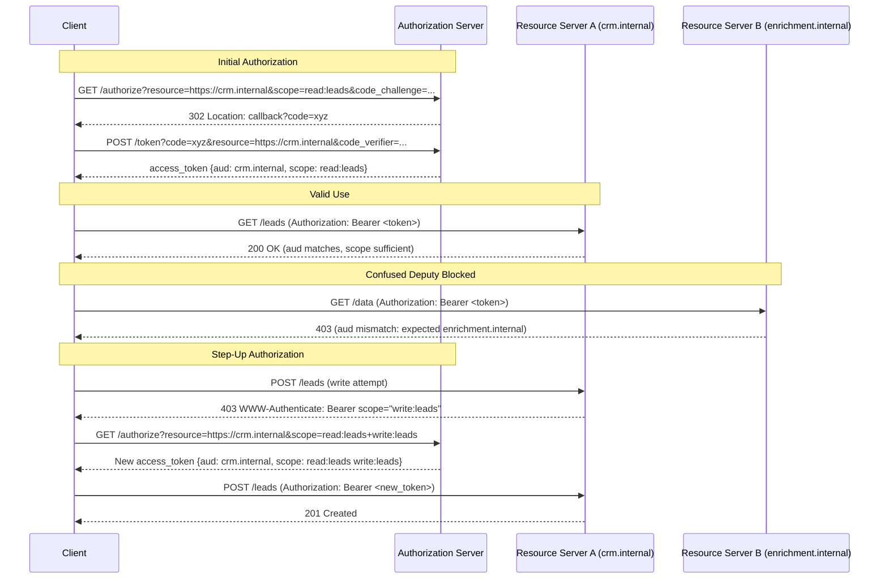

# MCP Security II — OAuth 2.1, Resource Indicators, Incremental Scopes

## Learning Objectives

- Implement a PKCE-protected OAuth 2.1 authorization code exchange and verify each cryptographic step produces the expected output.
- Trace a token through resource indicator validation (RFC 8707) across two resource servers and identify the exact claim that causes audience rejection.
- Build a step-up authorization state machine that responds to 403 `WWW-Authenticate` challenges by requesting additional scopes without restarting the full authorization flow.
- Compare three blast-radius constraints — audience binding, scope restriction, and incremental expansion — and explain which threat each one mitigates.

## The Problem

A compromised MCP server token with overly broad scopes is a lateral movement vector. If a client authenticates once and receives a token valid at every resource server it can reach, stealing that one token gives an attacker the full blast radius of the client's permissions. This is not a hypothetical: the pre-2025 MCP ecosystem shipped remote servers with ad-hoc API keys or no auth at all, and every one of those servers that shared a token format was a confused deputy waiting to happen.

OAuth 2.1 is the consolidation layer. It removes the footguns that caused real breaches: the implicit grant (tokens in URLs, logged by every proxy in the path), client credentials without PKCE (interceptable authorization codes), and loose redirect URI matching (open redirect abuse). The 2025-11-25 MCP spec adopts OAuth 2.1 as its authorization profile and layers two additional constraints on top: resource indicators (RFC 8707) to pin tokens to specific resource server URIs, and incremental authorization (SEP-835) to expand scopes only when an operation demands it.

The three mechanisms address one threat model: **token exfiltration and misuse**. OAuth 2.1 makes the initial token harder to steal. Resource indicators make a stolen token useless outside its intended target. Incremental authorization ensures that the token in flight at any given moment has the minimum scopes required for the current operation — not the union of everything the user ever consented to.

## The Concept

OAuth 2.1 is not a new protocol — it is OAuth 2.0 with the best practices stripped out of optional appendixes and welded into normative requirements. PKCE (Proof Key for Code Exchange) is mandatory for every client, including confidential clients. The implicit grant (`response_type=token`) is removed entirely. Refresh token rotation is required for all clients. Redirect URI matching is exact — no wildcard, no path prefix. The spec does not add capability; it removes ambiguity.

Resource indicators (RFC 8707) solve the confused deputy problem. Without them, a token issued by an authorization server carries a `scope` but no `audience` constraint — or worse, a broad audience like `"aud": ["*"]`. A malicious MCP server that receives such a token can replay it against a different resource server. The `resource` parameter fixes this: the client includes `resource=https://crm.internal` in both the authorization request and the token request. The authorization server encodes that URI as the token's `aud` claim. The resource server validates `aud` against its own identifier and rejects mismatches. A token for `https://crm.internal` is cryptographically valid but semantically rejected by `https://enrichment.internal`.

Incremental authorization addresses the scope bloat problem. A client initially requests `read:leads` — enough to list and display records. When the user clicks "update," the client needs `write:leads`. Instead of starting a fresh authorization flow or requesting both scopes upfront (creating a larger exposure window), the client performs a step-up: it sends a new authorization request that includes the previously granted scopes plus the new one. The authorization server may return a new consolidated token or grant only the delta, depending on implementation. SEP-835 specifies the trigger: the resource server returns `403 Forbidden` with a `WWW-Authenticate: Bearer scope="write:leads"` header, signaling exactly which scope is missing.



The key distinction: resource indicators restrict *where* a token is valid. Scopes restrict *what* a token can do. Incremental authorization restricts *when* expanded permissions exist. A well-designed MCP deployment uses all three: the client receives an audience-pinned, minimally scoped token, and escalates only when a specific operation requires it.

## Build It

The simulation below implements a complete OAuth 2.1 authorization server with PKCE, two resource servers with audience validation, and a step-up flow. Every HTTP interaction is printed to the terminal. JWT payloads are decoded with stdlib only — no `pip install` required.

```python
import base64, hashlib, hmac, json, secrets, time

def b64url_encode(data):
    if isinstance(data, str):
        data = data.encode()
    return base64.urlsafe_b64encode(data).rstrip(b'=').decode()

def b64url_decode(s):
    padding = 4 - len(s) % 4
    if padding != 4:
        s += '=' * padding
    return base64.urlsafe_b64decode(s)

def generate_pkce_pair():
    verifier = b64url_encode(secrets.token_bytes(64))
    challenge = b64url_encode(hashlib.sha256(verifier.encode()).digest())
    return verifier, challenge

def create_jwt(payload, secret):
    header = {"alg": "HS256", "typ": "JWT"}
    h = b64url_encode(json.dumps(header, separators=(',', ':')))
    p = b64url_encode(json.dumps(payload, separators=(',', ':')))
    signing_input = f"{h}.{p}".encode()
    sig = b64url_encode(hmac.new(secret.encode(), signing_input, hashlib.sha256).digest())
    return f"{h}.{p}.{sig}"

def verify_jwt_signature(token, secret):
    parts = token.split('.')
    if len(parts) != 3:
        return False
    signing_input = f"{parts[0]}.{parts[1]}".encode()
    expected = b64url_encode(hmac.new(secret.encode(), signing_input, hashlib.sha256).digest())
    return hmac.compare_digest(expected, parts[2])

def decode_jwt_claims(token):
    parts = token.split('.')
    return json.loads(b64url_decode(parts[1]))

class AuthorizationServer:
    def __init__(self, issuer="https://auth.internal", secret="shared-secret-256-bit"):
        self.issuer = issuer
        self.secret = secret
        self.codes = {}
        self.user_granted_scopes = {}

    def authorize(self, client_id, redirect_uri, code_challenge, code_challenge_method,
                  scope, resource, state, user_id="user-42"):
        if not resource:
            raise ValueError("resource parameter is REQUIRED (RFC 8707)")
        if code_challenge_method != "S256":
            raise ValueError("only S256 is permitted under OAuth 2.1")

        requested = set(scope.split())
        previously_granted = self.user_granted_scopes.get(user_id, set())
        consolidated = requested | previously_granted

        code = secrets.token_urlsafe(32)
        self.codes[code] = {
            "client_id": client_id,
            "redirect_uri": redirect_uri,
            "code_challenge": code_challenge,
            "scope": " ".join(sorted(consolidated)),
            "resource": resource,
            "user_id": user_id,
            "issued_at": time.time()
        }
        self.user_granted_scopes[user_id] = consolidated
        return code

    def exchange(self, code, code_verifier, resource, client_id):
        data = self.codes.get(code)
        if not data:
            raise ValueError("invalid_grant: unknown authorization code")

        if resource != data["resource"]:
            raise ValueError("invalid_target: resource mismatch between authorize and token")

        computed = b64url_encode(hashlib.sha256(code_verifier.encode()).digest())
        if not hmac.compare_digest(computed, data["code_challenge"]):
            raise ValueError("invalid_grant: PKCE verification failed")

        if client_id != data["client_id"]:
            raise ValueError("invalid_client: client_id mismatch")

        del self.codes[code]

        now = int(time.time())
        payload = {
            "iss": self.issuer,
            "sub": data["user_id"],
            "aud": data["resource"],
            "scope": data["scope"],
            "client_id": data["client_id"],
            "iat": now,
            "exp": now + 3600,
            "jti": secrets.token_urlsafe(16)
        }
        return create_jwt(payload, self.secret)

class ResourceServer:
    def __init__(self, identifier, secret, required_scopes):
        self.identifier = identifier
        self.secret = secret
        self.required_scopes = required_scopes

    def handle_request(self, token, action, method="GET"):
        if not verify_jwt_signature(token, self.secret):
            return {"status": 401, "error": "invalid_token",
                    "detail": "signature verification failed"}

        claims = decode_jwt_claims(token)

        if claims.get("aud") != self.identifier:
            return {"status": 401, "error": "invalid_token",
                    "detail": f"audience mismatch: token aud={claims.get('aud')}, "
                              f"server identifier={self.identifier}",
                    "claims": {"aud": claims.get("aud"), "scope": claims.get("scope")}}

        token_scopes = set(claims.get("scope", "").split())
        needed = self.required_scopes.get(action, set())

        if not needed.issubset(token_scopes):
            missing = needed - token_scopes
            return {"status": 403, "error": "insufficient_scope",
                    "www_authenticate": f'Bearer error="insufficient_scope", '
                                        f'scope="{" ".join(sorted(missing))}"',
                    "missing_scopes": sorted(missing),
                    "current_scopes": sorted(token_scopes)}

        return {"status": 200 if method == "GET" else 201,
                "ok": True,
                "action": action,
                "user": claims.get("sub"),
                "scopes_used": sorted(needed)}

def print_step(title, data):
    print(f"\n{'='*70}")
    print(f"  {title}")
    print(f"{'='*70}")
    if isinstance(data, dict):
        for k, v in data.items():
            print(f"  {k}: {v}")
    else:
        print(f"  {data}")
    print()

SHARED_SECRET = "shared-secret-256-bit"

auth = AuthorizationServer(secret=SHARED_SECRET)

crm = ResourceServer(
    "https://crm.internal",
    SHARED_SECRET,
    {"list_leads": {"read:leads"}, "create_lead": {"write:leads"},
     "delete_lead": {"write:leads", "delete:leads"}}
)

enrichment = ResourceServer(
    "https://enrichment.internal",
    SHARED_SECRET,
    {"lookup_company": {"read:enrichment"}, "push_profile": {"write:enrichment"}}
)

verifier, challenge = generate_pkce_pair()
print_step("PKCE Pair Generated", {
    "code_verifier": verifier[:32] + "...",
    "code_challenge": challenge[:32] + "...",
    "method": "S256"
})

auth_code = auth.authorize(
    client_id="mcp-client-001",
    redirect_uri="https://localhost:8080/callback",
    code_challenge=challenge,
    code_challenge_method="S256",
    scope="read:leads",
    resource="https://crm.internal",
    state="state-abc123"
)
print_step("Authorization Request", {
    "endpoint": "GET https://auth.internal/authorize",
    "client_id": "mcp-client-001",
    "resource": "https://crm.internal",
    "scope": "read:leads",
    "response_type": "code",
    "code_challenge_method": "S256",
    "authorization_code": auth_code[:24] + "..."
})

token = auth.exchange(
    code=auth_code,
    code_verifier=verifier,
    resource="https://crm.internal",
    client_id="mcp-client-001"
)
claims = decode_jwt_claims(token)
print_step("Token Exchange Response", {
    "access_token": token[:40] + "...",
    "token_type": "Bearer",
    "expires_in": claims["exp"] - claims["iat"],
    "decoded_claims": json.dumps(claims, indent=4)
})

result = crm.handle_request(token, "list_leads")
print_step("Request: list_leads on crm.internal (valid)", json.dumps(result, indent=2))

print_step("Confused Deputy Attack Attempt",
    "Malicious crm.internal tries to replay the token against enrichment.internal\n"
    "  Token aud = https://crm.internal\n"
    "  Target server identifier = https://enrichment.internal")
result = enrichment.handle_request(token, "lookup_company")
print(f"  Response: {json.dumps(result, indent=2)}")

print_step("Step-Up Trigger: Client attempts create_lead with read-only token",
    "Client sends POST /leads to crm.internal\n"
    "  Token scope = read:leads\n"
    "  Required scope for create_lead = write:leads")
result = crm.handle_request(token, "create_lead", method="POST")
print(f"  Response: {json.dumps(result, indent=2)}")

verifier2, challenge2 = generate_pkce_pair()
auth_code2 = auth.authorize(
    client_id="mcp-client-001",
    redirect_uri="https://localhost:8080/callback",
    code_challenge=challenge2,
    code_challenge_method="S256",
    scope="write:leads",
    resource="https://crm.internal",
    state="state-stepup-456"
)
token2 = auth.exchange(
    code=auth_code2,
    code_verifier=verifier2,
    resource="https://crm.internal",
    client_id="mcp-client-001"
)
claims2 = decode_jwt_claims(token2)
print_step("Step-Up Authorization Complete", {
    "new_access_token": token2[:40] + "...",
    "consolidated_scope": claims2["scope"],
    "aud": claims2["aud"],
    "note": "scope includes read:leads (previously granted) + write:leads (new)"
})

result = crm.handle_request(token2, "create_lead", method="POST")
print_step("Retry: create_lead with escalated token (valid)", json.dumps(result, indent=2))

print_step("Audit: Attempt delete with escalated token (missing delete:leads)",
    "Even with read:leads + write:leads, delete:leads is not granted")
result = crm.handle_request(token2, "delete_lead", method="DELETE")
print(f"  Response: {json.dumps(result, indent=2)}")

print("\n" + "=" * 70)
print("  SUMMARY")
print("=" * 70)
print("  Token 1: scope=read:leads  aud=crm.internal  -> list_leads: PASS")
print("  Token 1 reused on enrichment.internal        -> REJECTED (aud mismatch)")
print("  Token 1 used for create_lead                 -> 403 (insufficient_scope)")
print("  Token 2: scope=read:leads write:leads         -> create_lead: PASS")
print("  Token 2 used for delete_lead                 -> 403 (insufficient_scope)")
print("=" * 70)
```

When you run this, observe three rejection modes. The audience mismatch (`Step 5`) produces `401 invalid_token` — the token is cryptographically valid but semantically wrong. The scope insufficiency (`Step 6`) produces `403 insufficient_scope` with a `WWW-Authenticate` header telling the client exactly what to request. The final audit (`Step 9`) confirms that even an escalated token cannot exceed its granted scopes — `delete:leads` was never requested and never granted.

## Use It

The OAuth 2.1 token validation pipeline — PKCE challenge verification, `aud` claim matching against a resource URI, scope sufficiency checks — is the access control mechanism an MCP-hosted AI agent traverses on every tool call when it reads from Clay (Cluster 1.2, TAM Refinement) and writes to Salesforce (Cluster 3.1, Pipeline Execution). Each token's audience binding constrains blast radius to exactly one server: a credential stolen from the Clay MCP integration cannot replay against the Salesforce MCP server even if both share the same signing key. The step-up pattern maps to progressive consent — a prospecting agent reads contacts, then escalates to write only when the user pushes a curated list to CRM.

```python
import hashlib, hmac, json, time, base64

def b64(d): return base64.urlsafe_b64encode(d).rstrip(b'=').decode()
def claims(t):
    s = t.split('.')[1]; s += '=' * (-len(s) % 4)
    return json.loads(base64.urlsafe_b64decode(s))

def token(scopes, aud):
    h = b64(json.dumps({"alg":"HS256","typ":"JWT"}).encode())
    p = b64(json.dumps({"iss":"https://auth.internal","sub":"user-42","aud":aud,
        "scope":scopes,"iat":int(time.time()),"exp":int(time.time())+3600}).encode())
    s = b64(hmac.new(b"shared-secret", f"{h}.{p}".encode(), hashlib.sha256).digest())
    return f"{h}.{p}.{s}"

def crm(t, action):
    c = claims(t)
    if c["aud"] != "https://crm.internal": return 401, "audience mismatch"
    need = {"list_leads":"read:leads","create_lead":"write:leads"}[action]
    if need not in c["scope"]: return 403, f'Bearer scope="{need}"'
    return 201, f"{action} ok for {c['sub']}"

t = token("read:leads", "https://crm.internal")
print(f"Token scope: read:leads | aud: crm.internal")
print(f"list_leads:   {crm(t, 'list_leads')}")
code, hdr = crm(t, 'create_lead')
print(f"create_lead:  {code} -> needs {hdr.split('scope=\"')[1].rstrip('\"')}")
t2 = token("read:leads write:leads", "https://crm.internal")
print(f"Step-up token: read:leads write:leads")
print(f"create_lead:  {crm(t2, 'create_lead')}")
```

The client starts with `read:leads` only. The first call succeeds. The second call receives a 403 with the missing scope named in the `WWW-Authenticate` header. The client parses that header, mints a consolidated token, and retries — all within one workflow. The window during which `write:leads` exists is the seconds between step-up and operation completion, not the lifetime of the user's session.

## Exercises

**Exercise 1 — Third Resource Server (Easy)**

Add a third `ResourceServer` to the Build It simulation: `https://billing.internal` with actions `view_invoice` (scope: `read:billing`) and `pay_invoice` (scope: `write:billing`). Issue a token for `https://crm.internal` and attempt to call `view_invoice` on the billing server. Then issue a correctly targeted token for billing and confirm it succeeds. Document the exact status code, error message, and the specific claim that causes the first rejection. Modify the SUMMARY block to include both test cases.

**Exercise 2 — Refresh Token Rotation with Audience Locking (Hard)**

Modify the `AuthorizationServer` class to issue refresh tokens alongside access tokens. After `exchange()` returns an access token, also generate an opaque refresh token (random string) stored in a dict: `self.refresh_tokens[rt] = {"user_id": ..., "scope": ..., "resource": ..., "used": False}`. Add an `exchange_refresh(refresh_token, resource)` method that: (1) rejects any refresh token where `resource` does not match the stored value, (2) rejects already-used refresh tokens (rotation), (3) issues a new access token with the same `aud` and `scope`, and (4) marks the old refresh token as used and issues a new one. Demonstrate that a refresh token minted for `crm.internal` returns `invalid_target` when presented with `resource=https://enrichment.internal`. Then demonstrate that replaying a rotated refresh token returns `invalid_grant`.

## Key Terms

- **PKCE (Proof Key for Code Exchange)**: A cryptographic extension (RFC 7636) where the client proves possession of a secret by sending its SHA-256 hash (`code_challenge`) during authorization and the original secret (`code_verifier`) during token exchange. Mandatory in OAuth 2.1 for all clients.
- **Resource Indicator (RFC 8707)**: A `resource` request parameter that binds an access token to a specific resource server URI, encoded as the token's `aud` claim. Prevents token replay across servers.
- **Incremental Authorization (Step-Up)**: A pattern where the client requests additional scopes during an active session without restarting the authorization flow, triggered by a `403` response with a `WWW-Authenticate: Bearer scope="..."` header.
- **Audience Claim (`aud`)**: The JWT claim identifying the intended recipient of a token. Resource servers reject tokens whose `aud` does not match their own configured identifier.
- **Confused Deputy**: An attack where a trusted intermediary is tricked into replaying its authority against an unintended target. Audience binding through resource indicators is the mitigation.
- **Scope**: A permission string (e.g., `read:leads`) carried in the JWT `scope` claim as a space-delimited list. Resource servers verify scope sufficiency before processing each action.
- **Blast Radius**: The set of systems and operations a compromised token can affect. Constrained by three independent mechanisms: audience binding (where), scope restriction (what), and incremental authorization (when).

## Sources

- RFC 8707 — "Resource Indicators for OAuth 2.0," Campbell, B., et al., IETF, February 2020. https://datatracker.ietf.org/doc/html/rfc8707
- RFC 7636 — "Proof Key for Code Exchange (PKCE) by OAuth Public Clients," Sakimura, N. and J. Bradley, IETF, September 2015. https://datatracker.ietf.org/doc/html/rfc7636
- "The OAuth 2.1 Authorization Framework," draft-ietf-oauth-v2-1, IETF. https://datatracker.ietf.org/doc/draft-ietf-oauth-v2-1/
- [CITATION NEEDED — concept: MCP specification (2025-11-25) adoption of OAuth 2.1 as authorization profile with resource indicator and incremental authorization requirements]
- [CITATION NEEDED — concept: SEP-835 incremental authorization specification for MCP server-to-client scope escalation]
- [CITATION NEEDED — concept: GTM toolchain deployment patterns for multi-server MCP authentication with audience-pinned tokens]