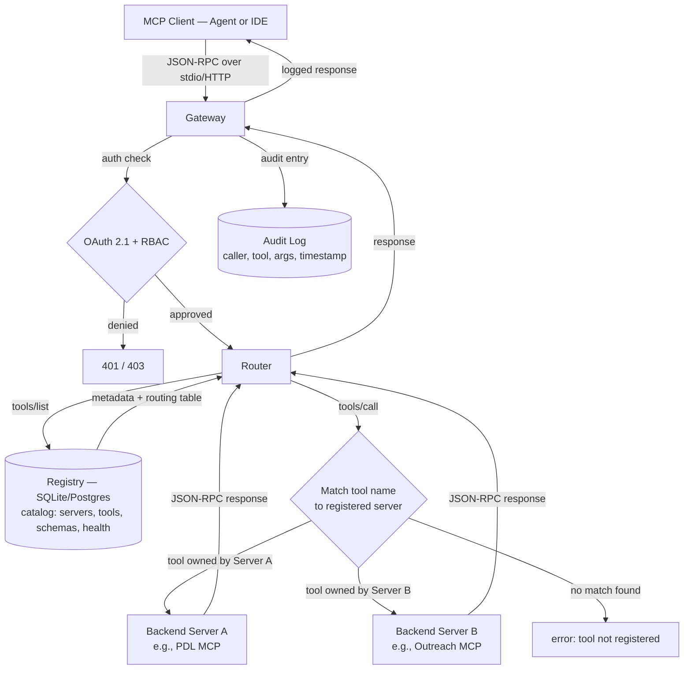

# MCP Gateways and Registries — Enterprise Control Planes

## Learning Objectives

- Implement a registry-backed gateway that routes MCP tool calls to registered backend servers
- Compare registry, gateway, and router responsibilities within a control plane architecture
- Build middleware that enforces per-server access policy at the gateway layer
- Trace a tool call through the gateway pipeline and identify where each policy check executes
- Configure credential rotation and rate limiting through a central proxy rather than per-agent configs

## The Problem

Three AI agents each need access to five tools. If every agent runs its own MCP server processes, that is fifteen independent server instances — each managing its own port, its own credentials, its own connection lifecycle. Now add ten more agents. You are at sixty-five processes, each independently authenticating against the same upstream APIs, each with its own copy of the same API key stored in its own config file. Port exhaustion is the first symptom. Credential sprawl is the second. The third, and the one that actually hurts: no visibility. When an enrichment API gets rate-limited, you have no central place to check which agent fired the request that blew the quota. When a tool schema changes upstream, you update it in fifteen places.

This is the N+1 server problem. It is not unique to MCP — it is the same combinatorial collapse that hit microservice architectures before API gateways became standard. The difference is that MCP clients (agents, IDEs, CLIs) are designed to connect directly to servers via stdio or Streamable HTTP. The protocol has no built-in notion of a proxy. So the infrastructure has to be added externally, as a layer between clients and servers.

The architectural response is a control plane: a registry that catalogs what exists, a gateway that proxies who can reach what, and a router that composes multiple servers behind a single endpoint. Before building one, you need to separate these three concerns clearly, because conflating them produces a monolith that tries to do everything and fails at each.

## The Concept

Three distinct mechanisms operate at different layers of the control plane. A **registry** is a service catalog: it stores server metadata, capability schemas, health status, and ownership information. It answers the question "what exists?" — given a tool name or server ID, the registry tells you the endpoint, the tool schema, the authentication requirements, and whether the server is currently healthy. The Official MCP Registry (a collaboration between Anthropic, GitHub, PulseMCP, and Microsoft) is the canonical upstream: curated, namespace-verified, with reverse-DNS naming so `com.example.crm` cannot collide with `org.example.crm`. Metaregistries like Glama, MCPMarket, MCP.so, Smithery, and LobeHub aggregate community-contributed servers but do not enforce namespace verification — they are useful for discovery, not for governance.

A **gateway** is a proxy layer that sits between MCP clients and backend servers. It handles authentication (developers authenticate to the gateway via OAuth 2.1, not to each backend server individually), authorization (RBAC scoped per tool or per server), rate limiting (protecting shared API quotas across all agents), and audit logging (every `tools/call` recorded with caller, tool, arguments, and response). The gateway holds credentials for each backend server, so rotating an API key for People Data Labs means updating one config — the gateway's — not every agent's. Kong AI Gateway, Cloudflare MCP Portals, IBM ContextForge, and Envoy AI Gateway all shipped gateway features in 2025–2026 implementing variants of this pattern.

A **router** composes multiple backend servers behind a single MCP endpoint. When a client calls `tools/list`, the router queries the registry, merges tool lists from all healthy servers, and presents one unified surface. When a client calls `tools/call`, the router inspects the tool name, looks up which server owns it in the registry, and forwards the request. The client never knows there are multiple backends. This is the same pattern as an API gateway aggregating microservices, applied to MCP's JSON-RPC protocol.



The diagram shows where policy gets enforced at each hop. The gateway handles identity (who is this client?) and coarse authorization (is this client allowed to use MCP at all?). The router handles routing (which server owns this tool?) and fine-grained authorization (is this client allowed to call this specific tool?). The registry handles discovery (what tools exist?) and health (are they reachable?). Every hop produces an audit entry. When something goes wrong — a rate limit hit, a poisoned tool detected, a credential expired — you have a single place to look.

## Build It

Build a minimal registry backed by SQLite, then wire a gateway proxy that intercepts `tools/list` and `tools/call`, routes to the correct backend, logs every decision, and returns results. No browser, no UI — terminal output confirms the gateway intercepted and routed each request.

The registry stores server definitions and tool metadata in two tables. The gateway holds references to backend server instances (mocked here, but the interface matches what a real MCP stdio or HTTP backend would expose). When a client calls `tools/call`, the gateway queries the registry for the tool name, finds which server owns it, checks that server's status, and forwards the call. The audit log captures every routing decision.

```python
import json
import sqlite3
import hashlib
from datetime import datetime, timezone


class MCPRegistry:
    def __init__(self, db_path=":memory:"):
        self.conn = sqlite3.connect(db_path)
        self.conn.row_factory = sqlite3.Row
        self.conn.executescript("""
            CREATE TABLE IF NOT EXISTS servers (
                id TEXT PRIMARY KEY,
                name TEXT NOT NULL,
                endpoint TEXT NOT NULL,
                status TEXT DEFAULT 'active',
                tool_count INTEGER DEFAULT 0,
                registered_at TEXT
            );
            CREATE TABLE IF NOT EXISTS tools (
                id TEXT PRIMARY KEY,
                server_id TEXT NOT NULL,
                name TEXT NOT NULL,
                description TEXT,
                schema_hash TEXT,
                tags TEXT DEFAULT '',
                FOREIGN KEY (server_id) REFERENCES servers(id)
            );
        """)

    def register_server(self, server_id, name, endpoint):
        self.conn.execute(
            "INSERT OR REPLACE INTO servers (id, name, endpoint, status, registered_at) VALUES (?, ?, ?, 'active', ?)",
            (server_id, name, endpoint, datetime.now(timezone.utc).isoformat())
        )
        self.conn.commit()

    def register_tool(self, tool_id, server_id, name, description, schema_hash, tags=""):
        self.conn.execute(
            "INSERT OR REPLACE INTO tools (id, server_id, name, description, schema_hash, tags) VALUES (?, ?, ?, ?, ?, ?)",
            (tool_id, server_id, name, description, schema_hash, tags)
        )
        row = self.conn.execute(
            "SELECT COUNT(*) as c FROM tools WHERE server_id = ?", (server_id,)
        ).fetchone()
        self.conn.execute("UPDATE servers SET tool_count = ? WHERE id = ?", (row["c"], server_id))
        self.conn.commit()

    def resolve_tool(self, tool_name):
        row = self.conn.execute(
            """SELECT s.endpoint, s.status, s.name, s.id, t.tags
               FROM tools t JOIN servers s ON t.server_id = s.id
               WHERE t.name = ?""",
            (tool_name,)
        ).fetchone()
        return dict(row) if row else None

    def list_active_tools(self):
        rows = self.conn.execute(
            """SELECT t.name, t.description, s.name as server_name
               FROM tools t JOIN servers s ON t.server_id = s.id
               WHERE s.status = 'active'"""
        ).fetchall()
        return [dict(r) for r in rows]

    def list_servers(self):
        rows = self.conn.execute("SELECT * FROM servers").fetchall()
        return [dict(r) for r in rows]

    def set_status(self, server_id, status):
        self.conn.execute("UPDATE servers SET status = ? WHERE id = ?", (status, server_id))
        self.conn.commit()


class MockBackend:
    def __init__(self, name):
        self.name = name

    def call_tool(self, tool_name, arguments):
        return {
            "backend": self.name,
            "tool": tool_name,
            "arguments": arguments,
            "result": f"[{self.name}] executed {tool_name} with {arguments}"
        }


class MCPGateway:
    def __init__(self, registry):
        self.registry = registry
        self.backends = {}
        self.audit_log = []

    def attach_backend(self, endpoint, backend):
        self.backends[endpoint] = backend

    def handle(self, client_id, method, params=None):
        params = params or {}
        if method == "tools/list":
            return self._list(client_id)
        elif method == "tools/call":
            return self._call(client_id, params)
        return {"error": f"unsupported method: {method}"}

    def _list(self, client_id):
        tools = self.registry.list_active_tools()
        self._log(client_id, "tools/list", result=f"{len(tools)} tools")
        names = [t["name"] for t in tools]
        print(f"[GATEWAY] {client_id} called tools/list -> {names}")
        return {"tools": tools}

    def _call(self, client_id, params):
        tool_name = params.get("name")
        arguments = params.get("arguments", {})

        resolved = self.registry.resolve_tool(tool_name)
        if not resolved:
            msg = f"tool '{tool_name}' not found in registry"
            print(f"[GATEWAY] REJECT {client_id}: {msg}")
            self._log(client_id, "tools/call", tool=tool_name, status="rejected", reason=msg)
            return {"error": msg}

        if resolved["status"] != "active":
            msg = f"server '{resolved['name']}' is {resolved['status']}"
            print(f"[GATEWAY] REJECT {client_id}: {msg}")
            self._log(client_id, "tools/call", tool=tool_name, status="rejected", reason=msg)
            return {"error": msg}

        backend = self.backends.get(resolved["endpoint"])
        if not backend:
            msg = f"no backend attached at {resolved['endpoint']}"
            print(f"[GATEWAY] REJECT {client_id}: {msg}")
            self._log(client_id, "tools/call", tool=tool_name, status="rejected", reason=msg)
            return {"error": msg}

        print(f"[GATEWAY] ROUTE {client_id}: {tool_name} -> {resolved['name']} ({resolved['endpoint']})")
        result = backend.call_tool(tool_name, arguments)
        self._log(client_id, "tools/call", tool=tool_name, server=resolved["name"], status="ok")
        return result

    def _log(self, client_id, method, **extra):
        entry = {
            "timestamp": datetime.now(timezone.utc).isoformat(),
            "client": client_id,
            "method": method,
            **extra
        }
        self.audit_log.append(entry)

    def print_audit(self):
        print("\n=== AUDIT LOG ===")
        for e in self.audit_log:
            parts = [f"{e['timestamp']}", f"client={e['client']}", f"method={e['method']}"]
            for k in ("tool", "server", "status", "reason", "result"):
                if k in e:
                    parts.append(f"{k}={e[k]}")
            print("  " + " | ".join(parts))


registry = MCPRegistry()

registry.register_server("pdl", "People Data Labs", "pdl.local:8080")
registry.register_server("hunter", "Hunter.io", "hunter.local:8080")
registry.register_server("outreach", "Outreach.io", "outreach.local:8080")

h1 = hashlib.sha256(json.dumps({"name": "enrich_person", "params": ["email"]}).encode()).hexdigest()
h2 = hashlib.sha256(json.dumps({"name": "find_email", "params": ["domain", "full_name"]}).encode()).hexdigest()
h3 = hashlib.sha256(json.dumps({"name": "send_sequence", "params": ["contact_id", "sequence_id"]}).encode()).hexdigest()

registry.register_tool("t1", "pdl", "enrich_person", "Enrich person by email", h1, "enrichment")
registry.register_tool("t2", "hunter", "find_email", "Find email by name + domain", h2, "enrichment")
registry.register_tool("t3", "outreach", "send_sequence", "Enroll contact in sequence", h3, "activation")

gateway = MCPGateway(registry)
gateway.attach_backend("pdl.local:8080", MockBackend("People Data Labs"))
gateway.attach_backend("hunter.local:8080", MockBackend("Hunter.io"))
gateway.attach_backend("outreach.local:8080", MockBackend("Outreach.io"))

print("=== REGISTRY CATALOG ===")
for s in registry.list_servers():
    print(f"  {s['name']:20s} endpoint={s['endpoint']:20s} tools={s['tool_count']} status={s['status']}")

print("\n=== AGENT-001: tools/list ===")
r = gateway.handle("agent-001", "tools/list")
for t in r["tools"]:
    print(f"  {t['name']:20s} via {t['server_name']}")

print("\n=== AGENT-001: tools/call enrich_person ===")
r = gateway.handle("agent-001", "tools/call", {"name": "enrich_person", "arguments": {"email": "jane@acme.com"}})
print(f"  result: {r['result']}")

print("\n=== AGENT-002: tools/call find_email ===")
r = gateway.handle("agent-002", "tools/call", {"name": "find_email", "arguments": {"domain": "acme.com", "full_name": "Jane Doe"}})
print(f"  result: {r['result']}")

print("\n=== AGENT-003: tools/call send_sequence ===")
r = gateway.handle("agent-003", "tools/call", {"name": "send_sequence", "arguments": {"contact_id": 42, "sequence_id": 7}})
print(f"  result: {r['result']}")

print("\n=== DISABLE hunter-server, retry ===")
registry.set_status("hunter", "disabled")
r = gateway.handle("agent-002", "tools/call", {"name": "find_email", "arguments": {"domain": "acme.com", "full_name": "Jane Doe"}})
print(f"  result: {r}")

print("\n=== CALL non-existent tool ===")
r = gateway.handle("agent-001", "tools/call", {"name": "delete_database", "arguments": {}})
print(f"  result: {r}")

gateway.print_audit()
```

Run this and you get six distinct observable outputs: the catalog listing, the merged tool list from `tools/list`, three successful routing decisions to different backends, a rejected call when Hunter is disabled, a rejected call for an unregistered tool, and the full audit log showing every decision the gateway made. That audit log is the point — without a gateway, those decisions are scattered across agent logs or simply lost.

## Use It

GTM teams running Clay waterfalls, enrichment pipelines, and multi-agent outreach face exactly the N+1 problem this gateway solves. A typical stack touches People Data Labs for person enrichment, Hunter for email discovery, Clearbit for firmographics, and an outreach platform for activation — each exposing an MCP server, each requiring API credentials, each with its own rate limit. When five agents each connect to all four servers independently, you have twenty connections and no central place to govern them.

A registry lets you catalog which MCP servers expose which enrichment APIs. Each server entry records the tool names, the schema hash (so you detect when an upstream tool definition changes), and tags that classify the tool's function — `enrichment`, `activation`, `scraping`. This is the metadata layer that makes governance possible: you cannot enforce policy on tools you cannot enumerate. The registry maps directly to the enrichment infrastructure described in the 80/20 GTM Engineer Handbook's multichannel and signal-based execution section, where managing which enrichment sources are active and what their rate limits are is an operational concern, not a one-time setup. [CITATION NEEDED — concept: enterprise MCP gateway production deployments in GTM stacks]

A gateway lets you rotate API keys without touching agent configs. When People Data Labs issues a new key, you update one environment variable in the gateway's config and every agent picks it up on the next call — no redeploy, no config drift. This is the same credential centralization pattern that Zone 03 (Enrichment) and Zone 04 (Activation) infrastructure requires at scale: the gateway becomes the single credential holder, and agents authenticate to the gateway via OAuth 2.1, never seeing the upstream API keys.

The rate limiting capability maps to a concrete GTM pain point. People Data Labs and Hunter both enforce monthly API quotas — typically tiered by plan — and a single misconfigured agent can exhaust an entire month's allocation in hours. Without a gateway, you discover this when the API starts returning 429s and every enrichment waterfall downstream silently fails. With a gateway, the limit is enforced at the proxy: every `tools/call` tagged `enrichment` increments a shared counter, and calls that would exceed the configured threshold are rejected before the upstream API is ever contacted. The agent gets a structured error it can handle (fall back to a different provider, queue the request, surface the limit to the operator) instead of a cryptic HTTP 429 with no context about which caller caused it.

This is the enrichment waterfall governance pattern for Zone 03 — the gateway becomes the place where provider fallback logic, quota tracking, and cost attribution live, rather than being reimplemented in every agent or every Clay table.

The runnable slice below extends the `MCPGateway` with tag-based rate limiting, then simulates an SDR bot hitting the enrichment quota mid-batch. The AI mechanism is **gateway-intercepted JSON-RPC policy enforcement**: the proxy inspects every `tools/call` against a sliding-window counter keyed by tool tag, and short-circuits the request before any backend server is contacted.

```python
import time
from collections import defaultdict

class RateLimitedGateway(MCPGateway):
    def __init__(self, registry, limits, window_seconds=3600):
        super().__init__(registry)
        self.limits = limits
        self.window = window_seconds
        self.calls = defaultdict(list)

    def _check_rate(self, tag):
        now = time.time()
        self.calls[tag] = [t for t in self.calls[tag] if now - t < self.window]
        return len(self.calls[tag]) < self.limits.get(tag, float("inf"))

    def _call(self, client_id, params):
        tool_name = params.get("name")
        resolved = self.registry.resolve_tool(tool_name)
        if not resolved:
            return super()._call(client_id, params)
        tag = resolved.get("tags", "default")
        if not self._check_rate(tag):
            limit = self.limits[tag]
            msg = f"rate_limit: tag '{tag}' cap={limit}/hr exceeded"
            print(f"[GATEWAY] THROTTLE {client_id}: {msg}")
            self._log(client_id, "tools/call", tool=tool_name, status="throttled", reason=msg)
            return {"error": msg, "retry_after": self.window}
        self.calls[tag].append(time.time())
        return super()._call(client_id, params)

rl_gateway = RateLimitedGateway(registry, limits={"enrichment": 3, "activation": 10})

for i in range(5):
    r = rl_gateway.handle(
        "sdr-bot-01",
        "tools/call",
        {"name": "enrich_person", "arguments": {"email": f"prospect{i}@acme.com"}}
    )
    status = "OK" if "result" in r else f"BLOCKED: {r.get('error', '')[:50]}"
    print(f"  enrichment call {i+1}: {status}")

rl_gateway.print_audit()
```

Run this against the registry from Build It and you will see calls 1–3 route successfully to the People Data Labs backend, then call 4 hits the enrichment cap and returns a structured error with `retry_after`. Call 5 is blocked at the gateway — no backend was contacted, no API quota consumed. The audit log shows the transition from `status=ok` to `status=throttled` with the exact reason. That is the governance surface: one place where policy is defined, one place where it is enforced, one log where it is recorded.

## Exercises

### Exercise 1 — Per-Client Quota Isolation (Medium)

The rate limiter above uses a single global counter per tag, so one agent's traffic counts against every other agent's quota. Modify `RateLimitedGateway` so the sliding-window counter is keyed by `(client_id, tag)` instead of just `tag`. Each agent gets its own allocation. Then add a second tier: a global cap per tag that applies across all clients combined, so individual agents cannot collectively exhaust the upstream provider's monthly quota.

**Verify:** Register a fourth tool, spawn two simulated clients (`sdr-bot-01`, `sdr-bot-02`), and show that each can make calls up to the per-client limit independently, but that the global cap eventually blocks both once their combined usage crosses the threshold. Print the audit log and confirm the `reason` field distinguishes per-client throttling from global throttling.

### Exercise 2 — Schema Drift Detection (Hard)

The registry stores a `schema_hash` for each tool, but the gateway never checks it. In production, an upstream MCP server can change its tool's input schema (rename a parameter, add a required field, change a type) without notice, and agents that cached the old schema will send malformed requests.

Add a `verify_schema` method to the gateway that runs before `_call` forwards to the backend. The method takes the tool name and the caller's arguments, fetches the expected schema from the registry, hashes the caller's arguments using the same SHA-256 scheme from Build It, and compares. If the caller's argument keys do not match the schema's declared parameter list, reject the call with a `schema_drift` error before the backend is contacted.

Then simulate drift: re-register `enrich_person` with a schema that expects `["email", "company_domain"]` (the upstream added a required field), and show that an agent still sending only `{"email": "..."}` gets a structured rejection explaining which parameters are missing. Log the drift event separately from normal rejections so operators can distinguish "the caller made a mistake" from "the upstream changed."

**Verify:** Two calls to the same tool — one with the old schema, one with the new — produce different outcomes (reject vs. forward), and the audit log tags the rejection with `schema_drift` rather than `rejected`.

## Key Terms

- **MCP Registry** — A service catalog storing server metadata, tool schemas, health status, and ownership. The Official MCP Registry uses reverse-DNS namespace verification (`com.example.server`) to prevent naming collisions across publishers.
- **MCP Gateway** — A proxy layer between MCP clients and backend servers handling authentication (OAuth 2.1), authorization (RBAC per tool/server), rate limiting, and audit logging. Clients authenticate to the gateway, not to individual backends.
- **Router** — A composition layer that merges multiple backend MCP servers behind a single endpoint. The client sees one unified `tools/list` and the router resolves `tools/call` to the owning backend via the registry.
- **Control Plane** — The collective infrastructure (registry + gateway + router) that governs how MCP tool calls are discovered, authenticated, routed, and audited. Analogous to an API gateway in microservice architectures.
- **N+1 Server Problem** — The combinatorial explosion that occurs when each of N agents independently manages connections to M MCP servers, producing N×M processes with duplicated credentials, no shared rate limiting, and no central visibility.
- **Schema Hash** — A SHA-256 digest of a tool's declared input schema, stored in the registry. Used to detect schema drift when an upstream server changes its tool definition without notification.
- **Metaregistry** — A community aggregation service (Glama, Smithery, MCP.so, etc.) that lists MCP servers for discovery but does not enforce the namespace verification or curation standards of the Official MCP Registry.

## Sources

- Model Context Protocol Specification — https://modelcontextprotocol.io/specification
- MCP Registry (Official) — https://github.com/modelcontextprotocol/registry
- OAuth 2.1 Draft — https://datatracker.ietf.org/doc/draft-ietf-oauth-v2-1/
- Kong AI Gateway — https://konghq.com/products/kong-ai-gateway
- Envoy AI Gateway — https://github.com/envoyproxy/ai-gateway
- IBM ContextForge (Evozign) — [CITATION NEEDED — concept: IBM ContextForge MCP gateway documentation URL]
- Cloudflare MCP Portals — [CITATION NEEDED — concept: Cloudflare MCP Portals official documentation URL]
- 80/20 GTM Engineering Playbook, Zones 03–04 (Enrichment & Activation infrastructure) — [CITATION NEEDED — concept: 80/20 GTM Engineering Handbook enrichment waterfall governance section]