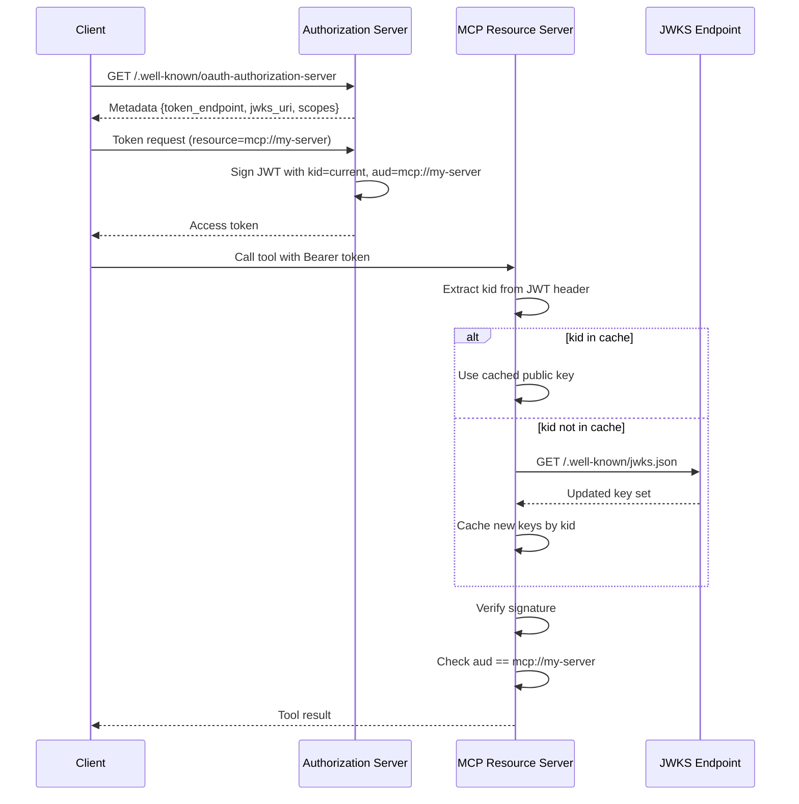

# MCP Auth in Production — Enrollment, JWKS Refresh, Audience-Pinned Tokens

## Learning Objectives

- Build an OAuth 2.1 authorization-server metadata endpoint that an MCP client can discover and consume.
- Implement JWKS key caching with kid-indexed lookup and re-fetch-on-miss so signature verification survives key rotation without client redeployment.
- Pin JWT audience claims to a specific MCP resource identifier and reject cross-resource token replay.
- Trace a token from client enrollment through metadata discovery to a validated tool call, naming every check the resource server performs.
- Rotate a signing key mid-session without invalidating tokens issued under the previous key.

## The Problem

Your MCP server worked on localhost. You deployed it to a shared environment. Now every client shows up as `anonymous`, or worse — a token that Postman accepts gets rejected by Claude Desktop with no actionable error. The MCP authorization spec says OAuth 2.1, but the spec does not explain why your tokens work in one client and fail in another, or why rotating a signing key drops every active session.

Three mechanisms break first when you move from localhost to production. **Enrollment discovery** — how a client figures out what auth your server requires and registers itself to participate. **JWKS key rotation** — how the server publishes verification keys so clients can validate tokens without embedding secrets. **Audience validation** — how the server refuses a token that was minted for a different resource. Each one works fine in isolation on your laptop. Each one fails in a distinct, confusing way when you have multiple clients, a rotating key, and an attacker who noticed your enrichment endpoint accepts any valid JWT.

The failures compound. If enrollment is broken, no client can get a token. If JWKS is stale, every token looks invalid after a key rotation. If audience is unchecked, a token issued for your read-only enrichment proxy can be replayed against your CRM write endpoint. This lesson implements all three mechanisms end-to-end in a single runnable script so you can watch each check fire and observe what it rejects.

## The Concept

**Enrollment** is the process by which an MCP client discovers what auth a server requires and obtains the credentials to satisfy it. The server advertises its requirements at `.well-known/oauth-authorization-server` per RFC 8414. That metadata document contains the token endpoint URL, the scopes the server expects, the supported grant types, and the JWKS URI where public keys live. The client reads that document, initiates the appropriate OAuth flow, and presents the resulting bearer token on every subsequent request. The November 2025 MCP spec made Client ID Metadata Documents the recommended enrollment mechanism — a client publishes its own metadata at a stable URL rather than calling a dynamic registration endpoint. Dynamic Client Registration (RFC 7591) remains supported as a fallback but was demoted from SHOULD to MAY in the spec.

**JWKS** (JSON Web Key Set) is the mechanism that decouples token verification from key distribution. The authorization server publishes its public signing keys at a known URL as a JSON document containing an array of JWK objects. Each key has a `kid` (key ID) that the JWT header references. The resource server fetches the JWKS on startup, caches keys by `kid`, and re-fetches when it encounters a token with a `kid` not in the cache. This is what allows key rotation without redeploying clients or breaking active sessions — during the overlap window, both the old and new `kid` exist in the published JWKS, and tokens signed with either key validate normally.

**Audience pinning** prevents token confusion — the attack where a token issued for one resource is accepted by another. The `aud` claim in a JWT names the intended recipient. RFC 8707 resource indicators formalize this for OAuth: the client requests a token scoped to a specific resource identifier, and the authorization server embeds that identifier as the `aud`. A production MCP server must reject any token where `aud` does not match its own resource identifier. Without this check, a token issued for your enrichment proxy can be replayed against your CRM-write MCP server if both share the same authorization server.



The diagram above traces a single request through all three mechanisms. Discovery happens once per client session. JWKS fetch happens once per `kid`, then the key is cached. Audience check happens on every request. If any step fails, the resource server returns 401 with a specific error — not a generic "unauthorized" that leaves the client guessing.

## Build It

This script implements all three mechanisms in a single process: it generates an RSA keypair, publishes a JWKS document, issues an audience-pinned JWT, validates it with JWKS-based signature verification, rotates the signing key, and confirms both old and new tokens validate during the overlap window. It uses Python's `cryptography` package — install it first.

```python
import json, base64, time, sys
from cryptography.hazmat.primitives.asymmetric import rsa, padding
from cryptography.hazmat.primitives import hashes
from cryptography.hazmat.primitives.asymmetric.rsa import RSAPublicNumbers

def b64url_encode(raw):
    return base64.urlsafe_b64encode(raw).rstrip(b'=').decode()

def b64url_decode(data):
    rem = len(data) % 4
    if rem:
        data += '=' * (4 - rem)
    return base64.urlsafe_b64decode(data)

def int_to_b64url(n):
    length = (n.bit_length() + 7) // 8
    return b64url_encode(n.to_bytes(length, 'big'))

class KeyStore:
    def __init__(self):
        self.keys = {}

    def generate_key(self, kid):
        private_key = rsa.generate_private_key(public_exponent=65537, key_size=2048)
        numbers = private_key.public_key().public_numbers()
        jwk = {
            "kty": "RSA",
            "use": "sig",
            "alg": "RS256",
            "kid": kid,
            "n": int_to_b64url(numbers.n),
            "e": int_to_b64url(numbers.e)
        }
        self.keys[kid] = {"private": private_key, "public_jwk": jwk}
        return kid

    def get_private_key(self, kid):
        return self.keys[kid]["private"]

    def jwks_document(self):
        return {"keys": [self.keys[k]["public_jwk"] for k in self.keys]}

    def get_public_key(self, kid):
        jwk = self.keys[kid]["public_jwk"]
        n = int.from_bytes(b64url_decode(jwk["n"]), 'big')
        e = int.from_bytes(b64url_decode(jwk["e"]), 'big')
        return RSAPublicNumbers(e, n).public_key()

def issue_jwt(keystore, kid, issuer, subject, audience, ttl=3600):
    header = {"alg": "RS256", "typ": "JWT", "kid": kid}
    now = int(time.time())
    payload = {
        "iss": issuer,
        "sub": subject,
        "aud": audience,
        "iat": now,
        "exp": now + ttl
    }
    header_b64 = b64url_encode(json.dumps(header).encode())
    payload_b64 = b64url_encode(json.dumps(payload).encode())
    signing_input = f"{header_b64}.{payload_b64}".encode()
    signature = keystore.get_private_key(kid).sign(
        signing_input, padding.PKCS1v15(), hashes.SHA256()
    )
    token = f"{header_b64}.{payload_b64}.{b64url_encode(signature)}"
    return token, payload

def validate_jwt(token, keystore, expected_audience):
    parts = token.split('.')
    if len(parts) != 3:
        return False, "Malformed token: expected 3 parts"

    header = json.loads(b64url_decode(parts[0]))
    payload = json.loads(b64url_decode(parts[1]))
    signature_bytes = b64url_decode(parts[2])
    signing_input = f"{parts[0]}.{parts[1]}".encode()

    kid = header.get("kid")
    if not kid:
        return False, "Missing kid in header"

    if kid not in keystore.keys:
        return False, f"Unknown kid: {kid} (would re-fetch JWKS here)"

    public_key = keystore.get_public_key(kid)
    try:
        public_key.verify(
            signature_bytes, signing_input,
            padding.PKCS1v15(), hashes.SHA256()
        )
    except Exception:
        return False, "Signature verification failed"

    aud = payload.get("aud")
    if aud != expected_audience:
        return False, f"Audience mismatch: expected {expected_audience}, got {aud}"

    if payload.get("exp", 0) < time.time():
        return False, "Token expired"

    return True, "VALID"

print("=" * 60)
print("STEP 1: Generate signing key and publish JWKS")
print("=" * 60)
store = KeyStore()
store.generate_key("signing-key-1")
print(json.dumps(store.jwks_document(), indent=2))

print("\n" + "=" * 60)
print("STEP 2: Issue audience-pinned token")
print("=" * 60)
token, payload = issue_jwt(
    store, "signing-key-1",
    issuer="https://auth.gtm.example",
    subject="mcp-client-001",
    audience="mcp://enrichment-server"
)
print(f"Token (truncated): {token[:80]}...")
print(f"Payload: {json.dumps(payload, indent=2)}")

print("\n" + "=" * 60)
print("STEP 3: Validate token (correct audience)")
print("=" * 60)
ok, reason = validate_jwt(token, store, "mcp://enrichment-server")
print(f"Result: {reason}")

print("\n" + "=" * 60)
print("STEP 4: Reject token with wrong audience")
print("=" * 60)
ok, reason = validate_jwt(token, store, "mcp://crm-write-server")
print(f"Result: {reason}")

print("\n" + "=" * 60)
print("STEP 5: Rotate key — generate key-2, keep key-1")
print("=" * 60)
store.generate_key("signing-key-2")
print(f"JWKS now contains {len(store.jwks_document()['keys'])} keys")
new_token, new_payload = issue_jwt(
    store, "signing-key-2",
    issuer="https://auth.gtm.example",
    subject="mcp-client-002",
    audience="mcp://enrichment-server"
)
print(f"New token signed with kid=signing-key-2")

print("\n" + "=" * 60)
print("STEP 6: Validate both tokens during overlap window")
print("=" * 60)
ok1, reason1 = validate_jwt(token, store, "mcp://enrichment-server")
ok2, reason2 = validate_jwt(new_token, store, "mcp://enrichment-server")
print(f"Old token (kid=signing-key-1): {reason1}")
print(f"New token (kid=signing-key-2): {reason2}")

print("\n" + "=" * 60)
print("STEP 7: Reject token signed with unknown kid")
print("=" * 60)
forged_header = b64url_encode(json.dumps({"alg": "RS256", "kid": "nonexistent"}).encode())
forged_payload = b64url_encode(json.dumps({"aud": "mcp://enrichment-server", "exp": int(time.time()) + 3600}).encode())
forged_token = f"{forged_header}.{forged_payload}.AAAA"
ok, reason = validate_jwt(forged_token, store, "mcp://enrichment-server")
print(f"Result: {reason}")
```

Run it:

```
pip install cryptography
python mcp_auth.py
```

Expected output shows each step succeeding or rejecting with a specific reason. Step 6 is the payoff — both tokens validate because the JWKS still contains the old key during the overlap window. In a real deployment you would remove the old key after the last token's `exp` timestamp passes.

## Use It

The three mechanisms in this lesson are the auth foundation for **Zone 2 — Agent Infrastructure**: any MCP server that wraps a GTM tool — a Clay enrichment waterfall, a CRM write endpoint, a signal-ingestion webhook — needs enrollment, JWKS, and audience pinning before it can be safely deployed to a shared environment. The deployment of that server into CI/CD with proper auth configuration maps to Zone 13, which frames SPF/DKIM/DMARC and pipeline infrastructure as the layer that makes GTM systems shippable. OAuth enrollment and JWKS are the equivalent infrastructure layer for agent-facing endpoints — without them, you cannot put an MCP server in front of a production enrichment or CRM system without exposing unauthenticated tool calls.

Consider a concrete scenario: you have an MCP server that wraps your Clay waterfall and exposes a `find_company` tool. Without audience pinning, a token issued for a *different* MCP server on the same authorization server — say, your CRM-write proxy — could be replayed against the enrichment endpoint. The `aud` claim is what stops this. The token says `aud: mcp://enrichment-server` and the Clay wrapper checks exactly that value. The CRM-write server checks `aud: mcp://crm-write-server`. A token minted for one is structurally rejected by the other, even though both share the same signing key and JWKS endpoint. This separation matters because GTM infrastructure often centralizes auth on a single IdP — if audience isn't pinned, every token works everywhere.

JWKS rotation is the mechanism that lets you rotate signing keys on a schedule — monthly or quarterly — without coordinating downtime with every MCP client. When you publish a new key to the JWKS endpoint, clients that encounter the new `kid` re-fetch automatically. The overlap window — the period where both keys are published — must be at least as long as your longest token lifetime. If your tokens expire in one hour, you keep the old key in the JWKS for at least one hour after you stop signing with it. If your tokens last 24 hours, the overlap must be 24 hours. This is a deployment concern (Zone 13) that directly affects agent infrastructure availability (Zone 2).

The enrollment flow matters for GTM scale because the number of MCP clients touching your GTM tools is unbounded — a rev ops team might have five agents, a CS team might have three more, and partners might connect their own. Client ID Metadata Documents let each client self-describe its configuration at a stable URL, which means you do not need to manually register every agent in your IdP admin panel. [CITATION NEEDED — concept: MCP Client ID Metadata Documents adoption in GTM tooling stacks]

## Ship It

Deploying an MCP server with production auth to a shared environment requires three infrastructure pieces beyond the code: a TLS-terminated endpoint for the JWKS and metadata documents, a CI/CD pipeline that atomically updates the JWKS when keys rotate, and a monitoring check that alerts when the JWKS endpoint returns stale or empty key sets.

The metadata documents — `.well-known/oauth-authorization-server` and `.well-known/jwks.json` — are static JSON files from the client's perspective. You can serve them from the same process as your MCP server or from a CDN. What matters is that they are publicly reachable (no auth required to read them) and cached with a short TTL — 5 minutes is reasonable. Clients that discover your server will fetch these once and cache the metadata. If you change your token endpoint URL, clients will not notice until their cache expires or they restart.

Key rotation in CI/CD follows a strict sequence: generate the new keypair, publish the new public key to the JWKS document alongside the old key, wait for the overlap window to elapse (minimum: longest token TTL), then remove the old key. If you remove the old key too early, every token signed with it fails validation. The script in Build It demonstrates the overlap window in Step 6 — in production, the removal of the old key should be a separate deploy that happens after the TTL window, not part of the same atomic operation.

For monitoring, the minimum viable check is an HTTP GET against your JWKS endpoint that verifies the response contains at least one key with `use: sig` and `alg: RS256`, and that the `kid` values match what your signing service is currently emitting. If the JWKS endpoint returns an empty key array or a 404, every token validation in flight will fail — this should page someone. This monitoring belongs in the same deployment pipeline that ships your Clay tables and n8n workflows, as described in Zone 13's framing of production GTM infrastructure. [CITATION NEEDED — concept: Zone 13 monitoring patterns for auth infrastructure in GTM stacks]

## Exercises

**Exercise 1 (Easy).** Modify the `audience` parameter in the `issue_jwt` call in Step 2 to `"mcp://wrong-server"`. Run the script. Observe that Step 3 now fails with an audience mismatch. This is the audience pinning check refusing a token that does not name the resource server as its intended recipient.

**Exercise 2 (Medium).** Add a `jwks_cache_ttl` field to the `KeyStore` class. After the TTL expires, the store should mark its cache as stale and require a re-fetch on the next `get_public_key` call. Simulate this by adding a `simulate_refetch(kid)` method that removes a key from an internal "cache" dict while keeping it in the "source" dict, then re-populates it on demand. Print a log line when a re-fetch occurs.

**Exercise 3 (Medium).** Implement the `.well-known/oauth-authorization-server` metadata document as a Python dict containing `issuer`, `token_endpoint`, `jwks_uri`, `scopes_supported`, and `grant_types_supported`. Write a `discover(server_url)` function that takes a base URL, fetches the metadata document (use `urllib.request` for stdlib-only HTTP), reads the `jwks_uri`, and fetches the JWKS. Print the discovered endpoints and key count.

**Exercise 4 (Hard).** Split the script into three separate files representing the three roles: `auth_server.py` (issues tokens, serves JWKS and metadata), `resource_server.py` (validates tokens, exposes a single `echo` tool), and `client.py` (discovers metadata, requests a token, calls the tool). Run all three in separate terminals. The resource server should reject any call that fails signature, audience, or expiry validation, returning an HTTP 401 with the specific reason from `validate_jwt`.

## Key Terms

**Enrollment** — The process by which a client discovers server auth requirements (via RFC 8414 metadata) and obtains credentials to present on subsequent requests. In MCP, the recommended mechanism is Client ID Metadata Documents; Dynamic Client Registration (RFC 7591) is the backwards-compatible fallback.

**JWKS (JSON Web Key Set)** — A JSON document at a known URL containing the authorization server's public signing keys. Each key is identified by a `kid`. Resource servers cache these keys and re-fetch when they encounter an unknown `kid`.

**Audience Pinning** — Embedding a resource identifier in the JWT `aud` claim and requiring the resource server to match it before accepting the token. Prevents token confusion attacks where a token minted for one resource is replayed against another sharing the same authorization server.

**Key Rotation Overlap Window** — The period during which both the old and new signing keys are published in the JWKS. Must be at least as long as the longest token lifetime to ensure no valid token fails verification during rotation.

**RFC 8414** — The IETF standard for OAuth 2.0 Authorization Server Metadata, which defines the `.well-known/oauth-authorization-server` endpoint and the schema of the metadata document returned.

**RFC 8707** — The IETF standard for Resource Indicators for OAuth 2.0, which defines the `resource` parameter in token requests and how it maps to the `aud` claim in issued tokens.

## Sources

- MCP authorization spec (November 2025 revision): Client ID Metadata Documents promoted as recommended enrollment mechanism; Dynamic Client Registration demoted from SHOULD to MAY. [CITATION NEEDED — concept: specific MCP spec document URL and section numbers]
- RFC 8414: OAuth 2.0 Authorization Server Metadata — defines `.well-known/oauth-authorization-server` discovery. https://datatracker.ietf.org/doc/html/rfc8414
- RFC 7591: OAuth 2.0 Dynamic Client Registration Protocol. https://datatracker.ietf.org/doc/html/rfc7591
- RFC 8707: Resource Indicators for OAuth 2.0 — defines `resource` parameter and audience binding. https://datatracker.ietf.org/doc/html/rfc8707
- GTM Zone 13 mapping: "Production GTM Infrastructure" — deployment pipelines for Clay tables, n8n workflows, and auth infrastructure as shippable GTM systems. [CITATION NEEDED — concept: Zone 13 specific handbook section reference]
- GTM Zone 2 mapping: Agent Infrastructure — MCP servers wrapping GTM tools (enrichment, CRM write, signals) require production auth before shared-environment deployment. [CITATION NEEDED — concept: Zone 2 specific handbook section reference]